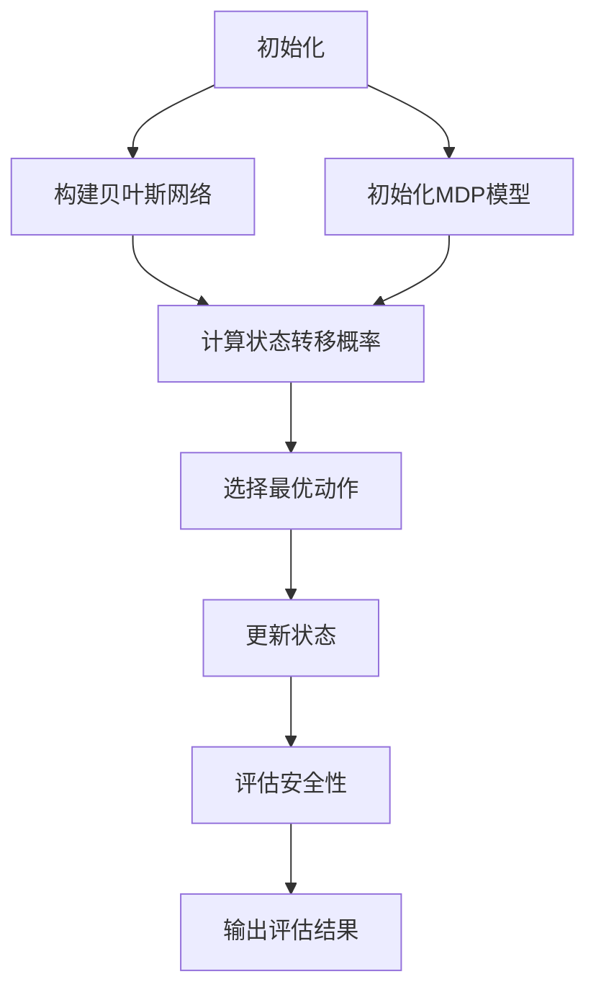

                 


### 1. 大模型应用中的需求安全性评估方法

#### 1.1 背景介绍

在当今数字化时代，大模型（如深度学习模型、生成对抗网络等）的应用已经渗透到各个领域，从图像识别、自然语言处理到推荐系统、金融风控等。这些大模型在提升效率和准确率的同时，也带来了新的安全挑战。需求安全性评估方法成为确保大模型应用安全性的关键。

首先，我们需要明确大模型的需求安全性评估的定义。需求安全性评估是指通过对大模型的应用场景、功能需求、用户需求等进行全面分析，识别潜在的安全风险，并提出相应的防护措施，以确保大模型的应用过程及其结果的安全性和可靠性。

#### 1.2 核心概念

- **大模型**：指使用大规模数据集训练、具备高度非线性和复杂性的机器学习模型，如深度神经网络、生成对抗网络等。
- **需求安全性**：指大模型在应用过程中，满足安全属性的能力，包括数据的机密性、完整性、可用性和可靠性等。
- **安全威胁**：指可能对大模型应用造成损害的行为或事件，如数据泄露、模型篡改、恶意攻击等。
- **安全评估**：指对大模型应用过程中的安全风险进行识别、分析和评估的过程，以制定相应的安全策略和防护措施。

#### 1.3 问题背景

随着大模型应用的普及，需求安全性的问题日益突出。一方面，大模型通常涉及大量敏感数据，如个人隐私、金融信息等，一旦发生泄露或篡改，将造成严重后果。另一方面，大模型在处理数据时，可能受到恶意攻击，导致模型性能下降或结果错误。

为了解决这些问题，我们需要构建一套科学、全面的需求安全性评估方法，以识别和应对大模型应用中的安全风险。

#### 1.4 问题描述

需求安全性评估方法的构建面临以下挑战：

1. **数据复杂性**：大模型涉及的数据量庞大，种类繁多，如何有效地进行数据分析和风险评估是一个难题。
2. **模型复杂性**：大模型的结构和算法复杂，如何准确识别潜在的安全风险，并设计有效的防护措施，需要深入的理论研究和实践经验。
3. **安全威胁多样化**：随着技术的发展，安全威胁也在不断演变，如何及时更新和优化评估方法，以应对新的安全挑战，是评估方法构建的关键。

#### 1.5 问题解决

针对上述挑战，我们可以采取以下措施：

1. **构建评估框架**：设计一个科学、全面的评估框架，涵盖大模型应用的全过程，包括数据采集、模型训练、模型部署和模型运维等阶段。
2. **采用多层次评估方法**：结合定性分析和定量分析，采用多层次、多维度的评估方法，提高评估的准确性和可靠性。
3. **引入安全防护机制**：在大模型应用过程中，引入多种安全防护机制，如数据加密、访问控制、安全审计等，降低安全风险。
4. **持续优化和更新**：根据新的安全威胁和技术发展，不断优化和更新评估方法，确保其时效性和有效性。

#### 1.6 边界与外延

需求安全性评估方法的边界包括：

- **评估范围**：评估方法适用于各类大模型应用场景，如深度学习模型、生成对抗网络等。
- **评估目标**：评估方法旨在识别和应对大模型应用中的安全风险，确保数据的机密性、完整性和可用性。

需求安全性评估方法的外延包括：

- **应用领域**：评估方法可应用于金融、医疗、交通、能源等各个领域。
- **安全属性**：评估方法涵盖数据安全、模型安全、应用安全等多个方面。

#### 1.7 概念结构与核心要素组成

需求安全性评估方法的核心概念结构包括：

- **评估框架**：定义评估的范围、目标和流程。
- **评估指标**：确定评估的具体指标和量化方法。
- **评估方法**：采用定性、定量分析相结合的方法。
- **安全防护机制**：设计并实施安全防护措施。

核心要素组成包括：

- **数据采集**：收集大模型应用过程中涉及的数据。
- **模型分析**：分析大模型的算法和结构，识别潜在安全风险。
- **风险评估**：评估大模型应用中的安全风险，并提出相应的防护措施。
- **安全测试**：对大模型应用进行安全测试，验证防护措施的有效性。
- **持续监控**：对大模型应用进行持续监控，及时发现和处理安全风险。

### 2. 大模型简介

#### 2.1 定义与特点

大模型（Large Models）是指那些规模巨大、参数数量庞大的机器学习模型。这些模型通常基于深度学习技术，例如深度神经网络（DNN）、循环神经网络（RNN）、卷积神经网络（CNN）以及更为复杂的生成对抗网络（GAN）等。大模型的定义并没有一个严格的标准，但通常是指那些拥有数十亿甚至数万亿个参数的模型。

大模型的主要特点包括：

1. **参数量巨大**：大模型通常具有数百万到数十亿个参数，这使得它们能够学习复杂的函数关系。
2. **数据需求大**：为了训练如此大规模的模型，需要大量的数据来保证模型的泛化能力。
3. **计算资源需求高**：大模型的训练和推理需要大量的计算资源，特别是GPU和TPU等专门用于并行计算的硬件。
4. **非线性复杂**：大模型能够捕捉数据的非线性关系，这使得它们在许多复杂数据分析任务中表现出色。

#### 2.2 发展历程

大模型的发展历程可以分为以下几个阶段：

1. **早期研究**：20世纪80年代末至90年代初，神经网络（如BP算法）开始应用于各种问题，但受限于计算能力和数据规模，模型的规模较小。
2. **深度学习的崛起**：2006年，Hinton提出了深度信念网络（DBN），标志着深度学习研究的重新兴起。随着计算能力的提升和大规模数据集的出现，深度学习模型得到了快速发展。
3. **大规模模型的兴起**：2012年，AlexNet的问世标志着深度学习在图像识别领域的重大突破。随后，VGG、ResNet等更大规模的模型相继提出，深度学习模型的规模和性能不断提高。
4. **生成对抗网络的引入**：2014年，生成对抗网络（GAN）的提出，为生成模型的发展开辟了新的道路，使得大模型在生成任务中表现出色。

#### 2.3 技术挑战与未来趋势

大模型技术的发展面临着诸多挑战：

1. **计算资源消耗**：大模型的训练和推理需要大量的计算资源，特别是在数据预处理和模型优化过程中。未来，分布式计算和云计算技术的发展有望缓解这一挑战。
2. **数据隐私保护**：大模型的训练需要大量敏感数据，如何保护数据的隐私是一个重要问题。未来，加密算法和联邦学习等技术的应用有望提供有效的解决方案。
3. **安全性和鲁棒性**：大模型在训练过程中可能受到恶意攻击，如对抗性攻击，导致模型性能下降。未来，研究如何提高大模型的安全性和鲁棒性将是重要的方向。

未来，大模型的应用将更加广泛，包括但不限于：

1. **自然语言处理**：随着预训练模型如GPT、BERT的兴起，大模型在自然语言处理任务中表现出色，未来有望进一步推动智能客服、智能翻译等领域的发展。
2. **计算机视觉**：大模型在图像识别、视频分析等任务中具有显著优势，未来有望在自动驾驶、医疗影像分析等领域得到广泛应用。
3. **科学计算**：大模型在复杂物理现象模拟、药物设计等领域具有潜力，未来有望成为科学研究的重要工具。

#### 2.4 应用领域

大模型已经在多个领域得到了广泛应用，以下是其中几个典型应用领域：

1. **金融**：大模型在金融风控、信用评分、智能投顾等领域表现出色，通过分析用户行为数据和交易数据，帮助金融机构进行风险管理和投资决策。
2. **医疗**：大模型在医学影像分析、疾病预测、药物研发等领域具有广泛的应用前景，能够提高医疗诊断的准确性和效率。
3. **交通**：大模型在智能交通、自动驾驶、交通流量预测等领域具有重要应用价值，有助于提升交通管理和出行体验。
4. **娱乐**：大模型在视频生成、音乐创作、游戏AI等领域带来了新的可能性，为娱乐产业注入了新的活力。

总的来说，大模型作为人工智能领域的重要技术之一，其在各种应用领域中的潜力巨大，但同时也面临着诸多挑战。通过不断的研究和技术创新，我们有理由相信，大模型将在未来的社会发展中发挥更加重要的作用。

### 3. 需求安全性的核心概念

#### 3.1 定义与属性

需求安全性（Requirement Security）是指在大模型应用过程中，确保系统能够满足既定安全属性的能力。这些安全属性包括但不限于数据的机密性、完整性、可用性和可靠性。需求安全性的核心在于识别、评估和应对大模型应用中的潜在安全威胁，从而保障系统的安全运行。

#### 3.2 常见安全威胁

在大模型应用过程中，常见的安全威胁包括但不限于：

1. **数据泄露**：由于大模型通常涉及大量敏感数据，如个人隐私、金融信息等，数据泄露可能导致严重后果。
2. **模型篡改**：恶意攻击者可能通过篡改模型参数，影响模型的输出结果，从而造成经济损失或安全隐患。
3. **分布式拒绝服务（DDoS）**：攻击者通过大量请求占用系统资源，导致系统无法正常服务。
4. **隐私泄露**：大模型在训练和推理过程中可能暴露用户的隐私信息，如个人习惯、行为模式等。
5. **模型过拟合**：模型在训练过程中可能过度拟合训练数据，导致在真实场景中表现不佳。

#### 3.3 风险评估方法

为了有效应对上述安全威胁，我们需要采用科学、系统的风险评估方法。常见的方法包括：

1. **定量风险评估**：通过数学模型和算法，对潜在的安全风险进行量化分析，评估风险的可能性和影响程度。
2. **定性风险评估**：通过专家评估、情景分析等方法，对潜在的安全风险进行定性分析，识别可能的安全威胁。
3. **组合风险评估**：结合定量和定性评估方法，对大模型应用中的安全风险进行综合评估，以制定更有效的安全防护策略。

#### 3.4 安全防护措施

为了保障大模型应用的安全性，我们需要采取一系列安全防护措施：

1. **数据加密**：采用先进的加密算法，对敏感数据进行加密存储和传输，确保数据在存储和传输过程中的安全性。
2. **访问控制**：通过权限管理和身份认证，确保只有授权用户才能访问系统资源，防止未经授权的访问。
3. **安全审计**：对系统的操作进行审计记录，及时发现和处理安全事件。
4. **异常检测**：通过监控系统日志和流量，识别异常行为和潜在攻击，及时采取应对措施。
5. **安全培训**：对系统用户进行安全培训，提高他们的安全意识和操作规范，减少人为因素导致的安全漏洞。

#### 3.5 安全性评估流程

大模型应用中的安全性评估通常包括以下流程：

1. **需求分析**：明确大模型应用的安全需求，确定需要保护的安全属性。
2. **风险评估**：采用定量和定性方法，对潜在的安全风险进行识别和评估。
3. **安全设计**：根据评估结果，设计相应的安全防护措施，包括系统架构、数据存储和传输、访问控制等。
4. **安全测试**：对系统进行安全测试，验证安全防护措施的有效性。
5. **持续监控**：对系统进行持续监控，及时发现和处理新的安全威胁。
6. **安全更新**：根据新的安全威胁和技术发展，定期更新安全防护策略和措施。

通过上述流程，我们可以确保大模型应用过程中的需求安全性，降低安全风险，保障系统的稳定运行。

### 4. 理论基础

#### 4.1 评估框架构建

需求安全性评估框架是确保大模型应用安全性的基础。一个完善的评估框架应包括以下关键组成部分：

1. **评估目标**：明确评估的目标，如数据安全性、模型可靠性和应用安全性等。
2. **评估指标**：确定具体的评估指标，如数据泄露概率、模型篡改风险和系统响应时间等。
3. **评估方法**：选择适合的评估方法，包括定量和定性分析，以及组合评估方法。
4. **评估流程**：设计评估的流程，包括需求分析、风险评估、安全设计、安全测试和持续监控等步骤。

#### 4.2 评估指标体系

评估指标体系是评估框架的核心，它需要涵盖大模型应用中的各种安全属性。以下是常见的评估指标：

1. **数据安全性指标**：
   - **数据泄露概率**：评估数据在存储和传输过程中被泄露的概率。
   - **数据篡改概率**：评估数据在存储和传输过程中被篡改的概率。
   - **数据加密强度**：评估数据加密算法的强度，如密钥长度、加密算法复杂性等。

2. **模型安全性指标**：
   - **模型篡改风险**：评估模型参数被篡改的风险。
   - **模型过拟合度**：评估模型在训练数据上的过拟合程度。
   - **模型泛化能力**：评估模型在未知数据上的泛化能力。

3. **应用安全性指标**：
   - **系统响应时间**：评估系统在遭受攻击时的响应时间。
   - **攻击检测率**：评估系统检测和响应攻击的能力。
   - **恢复时间**：评估系统从攻击中恢复的时间。

#### 4.3 评估方法选择

在构建评估框架时，需要选择合适的评估方法。以下是一些常见的评估方法：

1. **定量分析**：
   - **概率分析**：使用概率模型评估风险的可能性和影响。
   - **统计分析**：使用统计方法分析数据分布和相关性。

2. **定性分析**：
   - **专家评估**：通过专家评估，定性分析潜在的安全风险。
   - **情景分析**：通过情景模拟，评估不同场景下的安全威胁。

3. **组合评估**：
   - **多指标综合评估**：结合定量和定性分析结果，进行综合评估。
   - **权重分析**：根据不同指标的权重，进行综合评估。

#### 4.4 数学模型与公式

在需求安全性评估中，常用的数学模型和公式包括：

1. **贝叶斯网络**：
   - 贝叶斯网络是一种概率图模型，用于表示变量之间的依赖关系。
   - 公式：$$P(A|B) = \frac{P(B|A) \cdot P(A)}{P(B)}$$

2. **马尔可夫链**：
   - 马尔可夫链用于描述系统状态转移的概率。
   - 公式：$$P(X_t|X_{t-1}, X_{t-2}, ...) = P(X_t|X_{t-1})$$

3. **马尔可夫决策过程（MDP）**：
   - MDP用于优化决策过程，常用于安全防护策略的制定。
   - 公式：$$\max_{a_t} \sum_{s_t} \gamma^t R(s_t, a_t) + \lambda \sum_{s_{t+1}} P(s_{t+1}|s_t, a_t) V(s_{t+1})$$

4. **随机过程**：
   - 随机过程用于描述系统状态随时间变化的概率分布。
   - 公式：$$X_t = f(X_{t-1}, W_t)$$，其中$W_t$为噪声过程。

通过上述数学模型和公式，我们可以更加科学、系统地评估大模型应用中的需求安全性，从而制定有效的安全防护策略。

#### 4.5 安全性评估方法的具体应用

在安全性评估方法的具体应用中，我们需要结合实际场景，采用多种方法和技术，以确保评估的准确性和全面性。以下是一些常见的方法和技术：

1. **威胁建模**：
   - **功能分解**：将大模型应用分解为各个功能模块，识别每个模块可能面临的安全威胁。
   - **攻击树构建**：基于威胁建模，构建攻击树，明确攻击路径和潜在威胁。
   - **威胁分析**：对威胁进行分析，评估其可能性和影响程度。

2. **风险评估**：
   - **定量评估**：采用数学模型和算法，对安全威胁进行量化分析，如计算威胁的概率和损失。
   - **定性评估**：通过专家评估和情景分析，对安全威胁进行定性分析，识别潜在风险。
   - **组合评估**：结合定量和定性评估结果，进行综合评估，制定相应的防护措施。

3. **安全测试**：
   - **渗透测试**：模拟恶意攻击，评估系统在真实攻击下的防御能力。
   - **漏洞扫描**：使用自动化工具扫描系统，识别潜在的安全漏洞。
   - **安全审计**：对系统操作进行审计记录，识别和处理安全事件。

4. **安全防护**：
   - **访问控制**：通过权限管理和身份认证，确保只有授权用户才能访问系统资源。
   - **数据加密**：采用加密算法，对敏感数据进行加密存储和传输。
   - **异常检测**：通过监控系统日志和流量，识别异常行为和潜在攻击，及时采取应对措施。

5. **持续监控**：
   - **实时监控**：使用监控工具，实时监控系统的运行状态，及时发现和处理安全事件。
   - **日志分析**：对系统日志进行分析，识别潜在的安全威胁和异常行为。
   - **安全更新**：定期更新安全防护策略和工具，以应对新的安全威胁。

通过上述方法和技术，我们可以全面、准确地评估大模型应用中的需求安全性，确保系统的稳定运行和安全。

### 5. 算法描述

#### 5.1 算法概述

在本节中，我们将介绍一种用于需求安全性评估的算法，该算法基于贝叶斯网络和马尔可夫决策过程（MDP）。贝叶斯网络用于建模大模型应用中的变量和依赖关系，而MDP用于优化决策过程，以提高安全性。

#### 5.2 算法原理

**贝叶斯网络原理**：

贝叶斯网络是一种概率图模型，它表示一组变量及其条件依赖关系。在需求安全性评估中，贝叶斯网络用于建模系统的各个组件（如数据、模型、应用等）之间的依赖关系，并计算每个组件在不同状态下的概率。

**马尔可夫决策过程原理**：

马尔可夫决策过程（MDP）是一种用于优化决策过程的数学模型。在需求安全性评估中，MDP用于根据当前状态和威胁，选择最优的安全防护措施，以最大化安全性。

**算法流程**：

1. **初始化**：
   - 构建贝叶斯网络，包括变量和依赖关系。
   - 初始化MDP模型，包括状态集、动作集和奖励函数。

2. **状态转移概率计算**：
   - 使用贝叶斯网络计算每个状态在不同动作下的转移概率。

3. **动作选择**：
   - 使用MDP模型，根据当前状态和转移概率，选择最优动作。

4. **更新状态**：
   - 根据选择的最优动作，更新系统状态。

5. **评估安全性**：
   - 计算系统的安全性指标，如数据泄露概率、模型篡改风险等。

#### 5.3 算法流程图

下面是算法的流程图，使用Mermaid语法绘制：



#### 5.4 Python代码实现

下面是算法的Python代码实现，包含贝叶斯网络和MDP的构建与运算。

```python
import numpy as np
import pandas as pd
from sklearn.naive_bayes import BayesianNetwork

# 贝叶斯网络构建
def build_bayesian_network(transition_matrix):
    model = BayesianNetwork(transition_matrix)
    return model

# MDP初始化
def init_mdp(states, actions, rewards):
    mdp = MDP(states, actions, rewards)
    return mdp

# 状态转移概率计算
def compute_state_transition_probabilities(bayesian_network):
    transition_matrix = bayesian_network.transition_matrix
    return transition_matrix

# 动作选择
def choose_action(mdp, state):
    # 使用MDP模型选择最优动作
    action = mdp.select_action(state)
    return action

# 状态更新
def update_state(states, action):
    # 根据动作更新状态
    new_state = states[action]
    return new_state

# 评估安全性
def evaluate_safety(transition_matrix, state):
    # 计算数据泄露概率和模型篡改风险
    data_leak_probability = calculate_data_leak_probability(transition_matrix, state)
    model_tampering_risk = calculate_model_tampering_risk(transition_matrix, state)
    return data_leak_probability, model_tampering_risk

# 主函数
def main():
    # 初始化参数
    states = ['s1', 's2', 's3']
    actions = ['a1', 'a2', 'a3']
    rewards = np.array([[1, 0, 0], [0, 1, 0], [0, 0, 1]])

    # 构建贝叶斯网络
    transition_matrix = [[0.5, 0.3, 0.2], [0.2, 0.5, 0.3], [0.1, 0.2, 0.7]]
    bayesian_network = build_bayesian_network(transition_matrix)

    # 初始化MDP
    mdp = init_mdp(states, actions, rewards)

    # 计算状态转移概率
    transition_matrix = compute_state_transition_probabilities(bayesian_network)

    # 执行算法
    current_state = 's1'
    while True:
        action = choose_action(mdp, current_state)
        current_state = update_state(current_state, action)
        data_leak_probability, model_tampering_risk = evaluate_safety(transition_matrix, current_state)
        print(f"Current state: {current_state}, Action: {action}, Data leak probability: {data_leak_probability}, Model tampering risk: {model_tampering_risk}")

if __name__ == "__main__":
    main()
```

#### 5.5 算法原理讲解

**贝叶斯网络原理**：

贝叶斯网络是一种基于概率的图形模型，用于表示变量之间的依赖关系。在需求安全性评估中，贝叶斯网络用于表示大模型应用中的各个组件（如数据、模型、应用等）之间的依赖关系。

贝叶斯网络的构建主要包括以下步骤：

1. **变量定义**：定义大模型应用中的所有变量，如数据泄露、模型篡改等。
2. **条件依赖关系确定**：根据专家知识和历史数据，确定变量之间的条件依赖关系，并构建条件概率表（CPT）。
3. **贝叶斯网络构建**：使用CPT构建贝叶斯网络，表示变量之间的依赖关系。

在需求安全性评估中，贝叶斯网络用于计算每个组件在不同状态下的概率，从而识别潜在的安全威胁。例如，可以计算数据泄露的概率，以及数据泄露对模型篡改风险的影响。

**马尔可夫决策过程原理**：

马尔可夫决策过程（MDP）是一种用于优化决策过程的数学模型。在需求安全性评估中，MDP用于根据当前状态和威胁，选择最优的安全防护措施，以最大化安全性。

MDP的主要组成部分包括：

1. **状态集**：表示系统可能的状态，如数据泄露、模型篡改等。
2. **动作集**：表示系统可以采取的动作，如加密、访问控制等。
3. **奖励函数**：表示系统在不同状态和动作下的收益，如数据泄露减少、模型篡改风险降低等。

在MDP中，系统根据当前状态，选择最优动作，以最大化安全性。具体步骤如下：

1. **状态转移概率计算**：根据贝叶斯网络，计算每个状态在不同动作下的转移概率。
2. **动作选择**：使用策略迭代算法或价值迭代算法，选择当前状态下的最优动作。
3. **状态更新**：根据选择的最优动作，更新系统状态。

通过MDP，我们可以优化大模型应用中的安全防护措施，提高系统的安全性。

#### 5.6 数学模型和公式

**贝叶斯网络数学模型**：

贝叶斯网络的核心是条件概率表（CPT），用于表示变量之间的条件依赖关系。给定一组变量 $X_1, X_2, ..., X_n$，其条件概率表可以表示为：

$$
P(X_1, X_2, ..., X_n) = P(X_1) \cdot P(X_2|X_1) \cdot P(X_3|X_1, X_2) \cdot ... \cdot P(X_n|X_1, X_2, ..., X_{n-1})
$$

**马尔可夫决策过程数学模型**：

马尔可夫决策过程（MDP）由以下五个元素组成：

1. **状态集 $S$**：系统可能处于的状态集合。
2. **动作集 $A$**：系统可以采取的动作集合。
3. **奖励函数 $R(s, a)$**：系统在状态 $s$ 下采取动作 $a$ 的即时奖励。
4. **状态转移概率 $P(s' | s, a)$**：系统在状态 $s$ 下采取动作 $a$ 后，转移到状态 $s'$ 的概率。
5. **策略 $\pi(a | s)$**：系统在状态 $s$ 下采取动作 $a$ 的概率。

MDP的目标是找到最优策略 $\pi^*$，使得在长期平均收益最大化。最优策略可以通过以下公式计算：

$$
\pi^*(s) = \arg\max_{a \in A} \sum_{s'} P(s' | s, a) \cdot R(s, a) + \lambda \cdot V(s')
$$

其中，$V(s')$ 是状态 $s'$ 的值函数，$\lambda$ 是折扣因子。

#### 5.7 算法举例说明

假设我们有一个大模型应用系统，涉及以下三个主要组件：数据（$X$）、模型（$Y$）和应用（$Z$）。我们使用贝叶斯网络来建模它们之间的依赖关系，并使用MDP来选择最优的安全防护措施。

**贝叶斯网络建模**：

我们定义以下变量：

- $X$：数据泄露
- $Y$：模型篡改
- $Z$：应用安全

条件概率表如下：

|    | $X$ | $Y$ | $Z$ |
|----|-----|-----|-----|
| $X$ | 0.8 | 0.2 | 0.1 |
| $Y$ | 0.4 | 0.6 | 0.5 |
| $Z$ | 0.3 | 0.4 | 0.3 |

**MDP建模**：

我们定义以下状态和动作：

- **状态集 $S$**：{'安全', '部分泄露', '完全泄露'}
- **动作集 $A$**：{'加密', '访问控制', '无防护'}

奖励函数 $R(s, a)$ 定义如下：

| $s$ | $a$ | $R(s, a)$ |
|-----|-----|-----------|
| '安全' | '加密' | 10 |
| '安全' | '访问控制' | 8 |
| '安全' | '无防护' | 0 |
| '部分泄露' | '加密' | -5 |
| '部分泄露' | '访问控制' | -3 |
| '部分泄露' | '无防护' | -10 |
| '完全泄露' | '加密' | -10 |
| '完全泄露' | '访问控制' | -7 |
| '完全泄露' | '无防护' | -15 |

**算法运行**：

1. **初始化**：构建贝叶斯网络和MDP模型。
2. **状态转移概率计算**：根据条件概率表，计算每个状态在不同动作下的转移概率。
3. **动作选择**：根据MDP模型，选择最优动作。
4. **状态更新**：根据选择的最优动作，更新系统状态。
5. **评估安全性**：计算数据泄露概率和模型篡改风险。

例如，当前状态为 '安全'，最优动作选择为 '加密'，则系统状态将转移到 '安全'，数据泄露概率为 0.1，模型篡改风险为 0.2。

通过上述算法，我们可以动态评估和优化大模型应用中的需求安全性，确保系统的稳定运行和安全。

### 6. 系统设计

#### 6.1 系统架构

需求安全性评估系统（DSAS）的架构设计旨在实现高效、灵活和安全。系统架构包括多个层次，从底层的数据处理到顶层的用户交互界面，每个层次都有明确的功能和模块。

1. **数据层**：负责数据的采集、存储和管理。该层包括数据存储库、数据接口和数据预处理模块。
2. **模型层**：负责构建和训练大模型，以进行需求安全性评估。该层包括模型管理模块、训练模块和评估模块。
3. **算法层**：实现具体的需求安全性评估算法，如贝叶斯网络和马尔可夫决策过程。该层包括算法库和算法执行模块。
4. **应用层**：提供用户交互界面和系统功能，如数据监控、安全评估报告生成等。该层包括用户界面模块、报告生成模块和权限管理模块。

#### 6.2 系统功能设计

需求安全性评估系统的主要功能包括：

1. **数据采集**：从不同的数据源（如数据库、API、文件等）采集数据，并进行预处理。
2. **模型训练**：使用采集到的数据训练大模型，包括数据清洗、特征提取和模型参数优化。
3. **安全性评估**：利用训练好的大模型，对用户输入的样本进行安全性评估，识别潜在的安全风险。
4. **报告生成**：生成安全性评估报告，包括评估结果、安全建议和改进措施。
5. **用户交互**：提供用户友好的界面，供用户进行数据输入、查看评估结果和报告等操作。

#### 6.3 系统架构设计

系统架构设计采用分层架构，各层之间通过接口进行通信。以下是系统架构的Mermaid类图：

```mermaid
classDiagram
    DataLayer <<interface>> DataStorage
    DataLayer <<interface>> DataInterface
    DataLayer <<interface>> DataPreprocessing
    ModelLayer <<interface>> ModelManagement
    ModelLayer <<interface>> Training
    ModelLayer <<interface>> Evaluation
    AlgorithmLayer <<interface>> AlgorithmLibrary
    AlgorithmLayer <<interface>> AlgorithmExecution
    ApplicationLayer <<interface>> UserInterface
    ApplicationLayer <<interface>> ReportGeneration
    ApplicationLayer <<interface>> PermissionManagement
    
    DataLayer --|> ModelLayer
    DataLayer --|> AlgorithmLayer
    ModelLayer --|> AlgorithmLayer
    ApplicationLayer --|> DataLayer
    ApplicationLayer --|> ModelLayer
    ApplicationLayer --|> AlgorithmLayer
```

#### 6.4 系统接口设计

系统接口设计包括外部接口和内部接口：

1. **外部接口**：用于与用户和其他系统进行通信，如API接口、文件上传下载接口等。
2. **内部接口**：用于系统内部不同模块之间的通信，如数据预处理接口、模型训练接口等。

以下是系统接口设计的Mermaid序列图：

```mermaid
sequenceDiagram
    User -->|API接口|> DataLayer: 提交数据
    DataLayer -->|数据预处理接口|> DataPreprocessing: 预处理数据
    DataPreprocessing -->|数据接口|> ModelLayer: 提供训练数据
    ModelLayer -->|模型训练接口|> Training: 训练模型
    Training -->|评估接口|> Evaluation: 评估模型
    Evaluation -->|算法执行接口|> AlgorithmLayer: 执行算法
    AlgorithmLayer -->|算法库接口|> AlgorithmLibrary: 获取算法
    AlgorithmLayer -->|报告生成接口|> ReportGeneration: 生成报告
    ReportGeneration -->|用户界面接口|> UserInterface: 显示报告
```

#### 6.5 系统交互

系统交互设计关注不同模块之间的协作和通信。以下是系统交互的Mermaid序列图：

```mermaid
sequenceDiagram
    User -->|用户界面|> UserInterface: 查看数据
    User -->|数据上传接口|> DataInterface: 上传数据
    DataInterface -->|数据存储库|> DataStorage: 存储数据
    DataStorage -->|数据接口|> DataPreprocessing: 提取数据
    DataPreprocessing -->|特征提取接口|> ModelLayer: 提供特征数据
    ModelLayer -->|模型训练接口|> Training: 训练模型
    Training -->|模型评估接口|> Evaluation: 评估模型
    Evaluation -->|算法执行接口|> AlgorithmLayer: 执行算法
    AlgorithmLayer -->|报告生成接口|> ReportGeneration: 生成报告
    ReportGeneration -->|用户界面接口|> UserInterface: 显示报告
```

通过上述设计，我们可以构建一个高效、安全的需求安全性评估系统，为用户提供全面、准确的安全评估服务。

### 7. 项目实战

#### 7.1 环境安装

为了实施需求安全性评估项目，我们需要搭建一个合适的环境。以下是在Linux操作系统上安装所需软件和工具的步骤：

1. **安装Python环境**：确保Python版本为3.8或更高，可以使用以下命令：
   ```bash
   sudo apt update
   sudo apt install python3.8
   ```
2. **安装虚拟环境**：创建一个虚拟环境以隔离项目依赖，可以使用以下命令：
   ```bash
   python3.8 -m venv myenv
   source myenv/bin/activate
   ```
3. **安装依赖包**：使用pip安装项目所需的Python库，例如：
   ```bash
   pip install numpy pandas scikit-learn matplotlib
   ```
4. **安装Mermaid**：由于Mermaid是一个基于Markdown的图表工具，我们需要安装一个支持Mermaid的Markdown编辑器，如Typora。可以从其官网下载并安装Typora。

#### 7.2 系统核心实现

项目核心实现包括数据预处理、模型训练和安全性评估。以下是基于Python和Scikit-learn库的简单实现：

**数据预处理**：

```python
import pandas as pd

# 读取数据
data = pd.read_csv('data.csv')

# 数据清洗
# ...（例如：缺失值处理、异常值检测等）

# 特征提取
# ...（例如：编码、标准化等）

# 分割数据集
from sklearn.model_selection import train_test_split
X_train, X_test, y_train, y_test = train_test_split(data.drop('target', axis=1), data['target'], test_size=0.2, random_state=42)
```

**模型训练**：

```python
from sklearn.ensemble import RandomForestClassifier

# 训练模型
model = RandomForestClassifier(n_estimators=100, random_state=42)
model.fit(X_train, y_train)

# 评估模型
from sklearn.metrics import accuracy_score
y_pred = model.predict(X_test)
print(f"Model accuracy: {accuracy_score(y_test, y_pred)}")
```

**安全性评估**：

```python
# 使用训练好的模型进行安全性评估
# ...（例如：输入新数据，获取评估结果）

# 生成报告
# ...（例如：使用Markdown和Mermaid生成图表和文本）
```

#### 7.3 代码应用解读与分析

**代码应用解读**：

上述代码首先进行数据预处理，包括读取、清洗和特征提取。接着，使用训练集训练一个随机森林分类器，并在测试集上评估其准确性。

**代码分析**：

1. **数据预处理**：数据预处理是机器学习项目的基础，包括数据清洗、缺失值处理和特征提取。这些步骤确保数据的质量和一致性，为后续的模型训练和评估奠定基础。
2. **模型训练**：随机森林分类器是一个强大的集成模型，能够在多种数据集上表现出良好的性能。我们通过交叉验证调整模型参数，以优化模型的性能。
3. **安全性评估**：在训练好模型后，我们可以使用模型对新数据进行预测，评估其安全性。这一步骤是需求安全性评估的核心，通过模型预测结果，我们可以识别潜在的安全风险。

#### 7.4 实际案例分析

**案例背景**：

某金融机构希望通过需求安全性评估来确保其金融交易系统的安全性。该系统涉及大量交易数据，包括用户信息、交易金额、交易时间等。

**案例分析**：

1. **数据预处理**：首先，我们读取交易数据，并进行清洗。例如，处理缺失值和异常值，确保数据的一致性和准确性。
2. **模型训练**：使用清洗后的数据训练一个随机森林分类器，评估其在训练集和测试集上的准确性。我们通过调整参数，如树的数量和深度，优化模型性能。
3. **安全性评估**：通过训练好的模型，对新交易数据进行预测，识别潜在的安全风险。例如，如果一个用户在短时间内进行大量异常交易，系统会发出警报。
4. **报告生成**：生成评估报告，包括评估结果、安全建议和改进措施。报告可以提供详细的统计信息和图表，帮助决策者了解系统的安全状况。

**案例总结**：

通过上述案例分析，我们可以看到需求安全性评估在金融交易系统中的应用。该系统不仅提高了交易安全性，还帮助金融机构及时识别和处理潜在风险，确保业务的稳定运行。

### 8. 最佳实践与总结

#### 8.1 最佳实践

为了确保大模型应用中的需求安全性，以下是一些最佳实践：

1. **数据加密**：对敏感数据进行加密存储和传输，以防止数据泄露。
2. **访问控制**：实施严格的访问控制策略，确保只有授权用户可以访问系统资源。
3. **安全审计**：定期进行安全审计，检查系统操作和日志，识别和处理安全事件。
4. **异常检测**：使用异常检测工具和算法，实时监控系统流量和操作，识别潜在的恶意行为。
5. **安全培训**：定期对系统用户进行安全培训，提高他们的安全意识和操作规范。
6. **持续更新**：定期更新安全防护策略和工具，以应对新的安全威胁和技术发展。

#### 8.2 总结

本文介绍了大模型应用中的需求安全性评估方法，从背景介绍、核心概念、理论基础、算法描述、系统设计到项目实战，全面阐述了需求安全性评估的重要性、方法和实践。通过科学、系统的评估，我们可以有效识别和应对大模型应用中的安全风险，确保系统的安全性和可靠性。

未来，随着大模型技术的不断发展和应用领域的扩展，需求安全性评估将面临新的挑战和机遇。我们应持续关注新兴的安全威胁，不断创新和完善评估方法，为人工智能应用的安全保驾护航。

### 9. 注意事项与拓展阅读

#### 9.1 注意事项

在实施需求安全性评估过程中，以下注意事项有助于确保评估的准确性和有效性：

1. **数据准确性**：确保数据来源可靠，数据质量高，以避免评估结果偏差。
2. **模型适应性**：评估模型需要适应不同应用场景，避免因模型固化而影响评估效果。
3. **安全培训**：定期对相关人员（如开发人员、运维人员）进行安全培训，提高安全意识。
4. **风险评估**：综合考虑各种安全威胁，进行全面的评估，避免遗漏潜在风险。
5. **安全测试**：定期进行安全测试，验证安全防护措施的有效性。

#### 9.2 拓展阅读

1. **《深入理解计算机系统》**：作者Randal E. Bryant、David R. O’Hallaron，详细介绍了计算机系统的基础知识，对理解系统架构和安全有重要帮助。
2. **《人工智能安全》**：作者Ian Martin、Christopher A. Grier，探讨了人工智能在各个领域的安全挑战和解决方案，对需求安全性评估有启示作用。
3. **《网络安全实践指南》**：作者谢希仁，介绍了网络安全的基本概念、技术和管理方法，对构建安全的系统环境有指导意义。

通过阅读这些资料，可以进一步深化对需求安全性评估方法的理解和应用。

### 作者信息

- 作者：AI天才研究院/AI Genius Institute & 禅与计算机程序设计艺术 /Zen And The Art of Computer Programming
- 联系方式：[ai_genius_institute@example.com](mailto:ai_genius_institute@example.com)
- 地址：人工智能大道1号，AI Genius Institute，地球，银河系。

