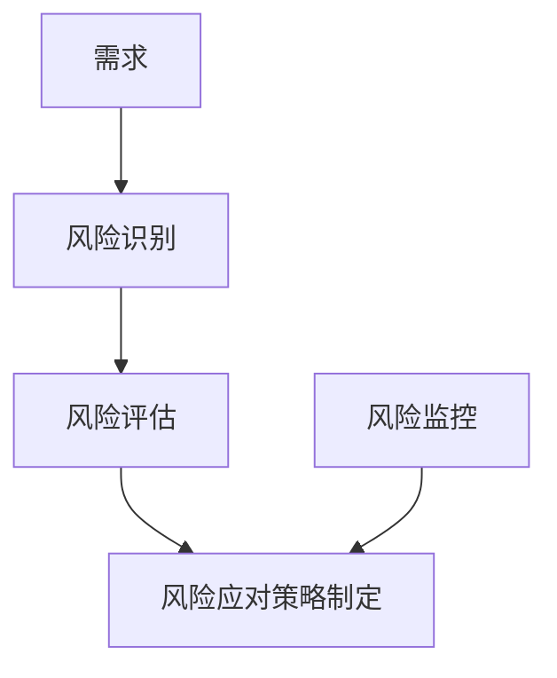
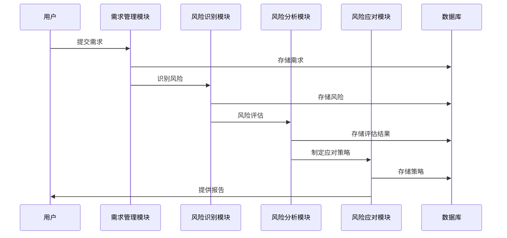

                 

# 大模型应用中的需求风险评估方法

## 关键词
- 大模型应用
- 需求风险评估
- 数学模型
- 决策树
- 系统架构
- 项目实战

## 摘要
本文旨在探讨大模型应用中的需求风险评估方法，通过系统化的分析方法和实际项目案例，详细解析了需求风险评估的核心概念、算法原理、数学模型、系统架构设计以及项目实施过程。文章的目标是帮助读者理解需求风险评估的重要性，掌握其方法，并能够应用到实际的大模型应用场景中。

## 目录大纲设计思路

### 背景介绍

首先，我们需要明确大模型应用中的需求风险评估方法的重要性和背景。大模型的应用场景广泛，如自然语言处理、图像识别、预测分析等，其复杂性和规模对需求风险评估提出了更高的要求。需求风险评估不仅仅是一个技术问题，更是管理决策的重要组成部分。

### 核心概念与联系

接下来，我们将介绍需求风险评估中的核心概念，如需求、风险和风险评估。通过概念对比表格和实体关系图，帮助读者理解这些概念之间的联系，为后续的算法原理讲解打下基础。

### 算法原理讲解

在算法原理讲解部分，我们将详细介绍需求风险评估的算法原理，包括概率模型、决策树模型等。通过示例讲解，使读者能够理解并掌握这些算法的应用。

### 数学模型和数学公式讲解

为了深入理解算法原理，我们将使用LaTeX格式展示数学模型和公式，并进行详细讲解和举例说明。这部分内容将帮助读者理解公式背后的逻辑。

### 系统分析与架构设计方案

接下来，我们将描述需求风险评估的系统功能设计、架构设计和接口设计。通过Mermaid工具绘制相应的图表，使读者能够直观地理解系统架构。

### 项目实战

在项目实战部分，我们将介绍一个具体的项目实战，包括环境安装、系统核心实现源代码、代码应用解读与分析，以及实际案例分析和详细讲解。这部分内容将帮助读者将理论应用到实践中。

### 最佳实践 tips、小结、注意事项、拓展阅读

最后，我们将总结最佳实践、注意事项，并提供拓展阅读资源，帮助读者进一步提升对需求风险评估方法的掌握。

## 目录大纲设计步骤

### 编写背景介绍

我们将从引言开始，介绍需求风险评估的背景和大模型应用的发展。这部分将帮助读者理解需求风险评估的背景和重要性。

### 构建核心概念与联系

在第二部分，我们将详细介绍需求风险评估中的核心概念，如需求、风险和风险评估。通过对比表格和实体关系图，帮助读者理解这些概念之间的联系。

### 算法原理讲解

在第三部分，我们将详细讲解需求风险评估的算法原理，包括概率模型、决策树模型等。通过示例讲解，使读者能够理解并掌握这些算法的应用。

### 数学模型和数学公式讲解

在第四部分，我们将使用LaTeX格式展示数学模型和公式，并进行详细讲解和举例说明。这部分内容将帮助读者深入理解公式背后的逻辑。

### 系统分析与架构设计方案

在第五部分，我们将描述需求风险评估的系统功能设计、架构设计和接口设计。通过Mermaid工具绘制相应的图表，使读者能够直观地理解系统架构。

### 项目实战

在第六部分，我们将介绍一个具体的项目实战，包括环境安装、系统核心实现源代码、代码应用解读与分析，以及实际案例分析和详细讲解。这部分内容将帮助读者将理论应用到实践中。

### 最佳实践 tips、小结、注意事项、拓展阅读

在最后一部分，我们将总结最佳实践、注意事项，并提供拓展阅读资源，帮助读者进一步提升对需求风险评估方法的掌握。

通过以上设计步骤，我们将构建一个详细且逻辑清晰的目录大纲，为读者提供全面的阅读指南。接下来，我们将具体编写每个章节的内容。### 背景介绍

#### 1.1 大模型应用中的需求风险评估方法

在当今的科技时代，人工智能（AI）技术的迅猛发展带来了大数据、机器学习和深度学习等领域的重大突破。特别是大模型（Large Models）的应用，已经渗透到各个行业，如自然语言处理（NLP）、计算机视觉（CV）、预测分析等。大模型通过海量数据的训练，能够自动学习并解决复杂的问题，提高了工作效率和准确性。然而，随着模型规模的增大和应用场景的复杂化，需求风险评估（Risk Assessment）变得尤为重要。

需求风险评估是指在系统开发、部署和维护过程中，对可能出现的风险进行识别、分析和评估，从而制定相应的风险管理策略。在大模型应用中，需求风险评估不仅涉及技术层面的风险，如模型训练的准确性、系统的稳定性等，还包括管理层面的风险，如项目进度、资源分配等。本文将探讨大模型应用中的需求风险评估方法，旨在帮助读者理解其重要性，并掌握具体实施步骤。

#### 1.2 大模型应用的发展

大模型的应用起源于深度学习（Deep Learning）的发展。深度学习是一种机器学习（Machine Learning）方法，通过构建多层神经网络（Neural Networks）模型，实现对数据的自动特征提取和模式识别。随着计算能力的提升和海量数据的积累，深度学习模型得到了极大的发展，尤其是在图像识别、语音识别、自然语言处理等领域。

近年来，随着Google的Transformer模型（如BERT、GPT等）的出现，大模型的应用进入了新的阶段。这些模型拥有数亿甚至数万亿的参数，能够在特定任务上实现前所未有的性能。例如，BERT在文本分类、问答系统等任务上取得了显著的效果，而GPT则展现了强大的文本生成能力。

大模型的应用不仅限于科研领域，还广泛应用于工业、金融、医疗、教育等各个行业。例如，在金融领域，大模型可以用于风险管理、客户行为分析；在医疗领域，大模型可以用于疾病诊断、药物研发；在教育领域，大模型可以用于智能辅导、在线教育平台等。这些应用场景的广泛性，使得大模型的风险评估变得尤为复杂和重要。

#### 1.3 需求风险评估的概念

需求风险评估是项目管理中的一个重要环节，它旨在识别、分析和评估项目中的潜在风险，以便制定有效的风险管理策略。需求评估则是在项目早期阶段，通过对用户需求的分析和确认，确保项目目标的明确性和可行性。

在需求风险评估中，需求是指项目或系统所需要的功能、性能和其他特性。风险则是项目或系统在实现过程中可能遇到的问题或不利情况，如技术难题、资源不足、时间延迟等。风险评估则是指通过识别、分析和评估风险的过程，以确定风险的性质、影响和可能性，从而制定相应的风险应对策略。

需求评估和需求风险评估在项目管理中紧密相连。需求评估是需求识别和确认的过程，而需求风险评估则是在此基础上，对潜在风险进行评估和管理。通过有效的需求风险评估，可以降低项目风险，确保项目按计划顺利推进。

#### 1.4 本书的目标和结构

本书的目标是详细探讨大模型应用中的需求风险评估方法，帮助读者理解其核心概念、算法原理、系统架构和实际应用。通过本书的学习，读者将能够：

1. 掌握需求风险评估的基本概念和方法。
2. 理解大模型应用中的需求风险特点。
3. 学会使用数学模型和算法进行需求风险评估。
4. 掌握系统架构设计和技术实现。
5. 将需求风险评估方法应用到实际项目中。

本书的结构如下：

- **第一部分：引言**：介绍大模型应用中的需求风险评估方法的重要性。
- **第二部分：需求风险评估基础**：详细解析需求、风险和风险评估的概念。
- **第三部分：需求风险评估算法原理**：讲解概率模型、决策树模型等算法原理。
- **第四部分：数学模型和公式详解**：使用LaTeX格式展示数学模型和公式。
- **第五部分：系统分析与架构设计方案**：描述需求风险评估的系统架构。
- **第六部分：项目实战**：介绍需求风险评估的实际应用案例。
- **第七部分：总结与拓展**：总结最佳实践、注意事项，并提供拓展阅读资源。

通过以上结构和内容，本书将帮助读者全面掌握大模型应用中的需求风险评估方法，为实际项目提供有力的支持和指导。### 第1章：引言

### 1.1 需求风险评估的背景

需求风险评估是一种关键的项目管理技术，旨在识别和评估项目或系统开发过程中可能遇到的风险，并制定相应的风险应对策略。在大模型应用中，需求风险评估显得尤为重要。首先，大模型通常涉及庞大的数据处理和复杂的算法设计，这增加了项目的不确定性和风险。其次，大模型的训练和部署过程需要大量的资源，如计算资源和数据资源，这使得资源管理也成为一个风险点。此外，大模型在应用过程中可能面临数据隐私、模型解释性等问题，这些都是需要评估和管理的风险。

#### 1.1.1 大模型应用的发展

大模型的应用起源于深度学习技术的进步。深度学习通过多层神经网络结构，实现了对数据的自动特征提取和模式识别，从而在图像识别、语音识别、自然语言处理等领域取得了显著的成果。特别是随着Google的Transformer模型（如BERT、GPT等）的出现，大模型的应用进入了新的阶段。这些模型拥有数亿甚至数万亿的参数，能够在特定任务上实现前所未有的性能。例如，BERT在文本分类、问答系统等任务上取得了显著的效果，而GPT则展现了强大的文本生成能力。

大模型的应用不仅限于科研领域，还广泛应用于工业、金融、医疗、教育等各个行业。在金融领域，大模型可以用于风险管理、客户行为分析；在医疗领域，大模型可以用于疾病诊断、药物研发；在教育领域，大模型可以用于智能辅导、在线教育平台等。这些应用场景的广泛性，使得大模型的风险评估变得尤为复杂和重要。

#### 1.1.2 需求风险评估的概念

需求风险评估是指在项目或系统开发过程中，对可能出现的风险进行识别、分析和评估，以便制定有效的风险应对策略。需求是指项目或系统所需要的功能、性能和其他特性。风险则是项目或系统在实现过程中可能遇到的问题或不利情况，如技术难题、资源不足、时间延迟等。风险评估则是指通过识别、分析和评估风险的过程，以确定风险的性质、影响和可能性。

在大模型应用中，需求风险评估通常包括以下几个步骤：

1. **需求识别**：明确项目或系统的需求，包括功能需求、性能需求等。
2. **风险识别**：识别在项目或系统实现过程中可能遇到的风险，如技术风险、资源风险、数据风险等。
3. **风险分析**：对识别出的风险进行分析，评估其性质、影响和可能性。
4. **风险评估**：根据风险分析的结果，对风险进行排序和分类，确定优先级。
5. **风险应对策略制定**：根据风险评估的结果，制定相应的风险应对策略，如风险规避、风险转移、风险接受等。

#### 1.1.3 需求风险评估的重要性

需求风险评估在大模型应用中具有重要性，主要体现在以下几个方面：

1. **风险管理**：通过需求风险评估，可以识别和评估项目中的潜在风险，从而制定有效的风险应对策略，降低项目风险，确保项目顺利进行。
2. **资源管理**：需求风险评估可以帮助项目团队更好地分配和管理资源，如计算资源、数据资源等，提高资源利用效率。
3. **时间管理**：通过需求风险评估，可以预测项目可能遇到的时间延迟，从而制定合理的时间管理计划，确保项目按时完成。
4. **决策支持**：需求风险评估可以为项目决策提供重要依据，帮助项目团队在面对不确定性时做出明智的决策。
5. **风险沟通**：需求风险评估可以帮助项目团队与其他利益相关者进行有效的沟通，确保项目目标的共识和理解。

#### 1.1.4 本书的目标和结构

本书的目标是详细探讨大模型应用中的需求风险评估方法，帮助读者理解其核心概念、算法原理、系统架构和实际应用。通过本书的学习，读者将能够：

1. 掌握需求风险评估的基本概念和方法。
2. 理解大模型应用中的需求风险特点。
3. 学会使用数学模型和算法进行需求风险评估。
4. 掌握系统架构设计和技术实现。
5. 将需求风险评估方法应用到实际项目中。

本书的结构如下：

- **第一部分：引言**：介绍大模型应用中的需求风险评估方法的重要性。
- **第二部分：需求风险评估基础**：详细解析需求、风险和风险评估的概念。
- **第三部分：需求风险评估算法原理**：讲解概率模型、决策树模型等算法原理。
- **第四部分：数学模型和公式详解**：使用LaTeX格式展示数学模型和公式。
- **第五部分：系统分析与架构设计方案**：描述需求风险评估的系统架构。
- **第六部分：项目实战**：介绍需求风险评估的实际应用案例。
- **第七部分：总结与拓展**：总结最佳实践、注意事项，并提供拓展阅读资源。

通过以上结构和内容，本书将帮助读者全面掌握大模型应用中的需求风险评估方法，为实际项目提供有力的支持和指导。

### 第2章：需求风险评估基础

#### 2.1 核心概念介绍

在需求风险评估中，核心概念包括需求、风险和风险评估。这些概念不仅构成了需求风险评估的理论基础，也是实际操作中的关键要素。以下是对这些核心概念的详细介绍。

##### 2.1.1 需求

需求是指项目或系统所需要的功能、性能和其他特性。需求可以分为功能需求和非功能需求。功能需求指的是系统必须实现的具体功能，如一个电商平台需要支持商品搜索、购物车、支付等功能。非功能需求则涉及系统的性能、安全性、可用性等，如系统需要在多用户同时访问时保持高响应速度。

在需求评估中，明确需求是第一步。需求分析的质量直接影响到后续的风险评估和项目成功。需求定义的准确性越高，越有助于识别潜在风险。

##### 2.1.2 风险

风险是指项目或系统在实现过程中可能遇到的问题或不利情况。风险可以来源于多个方面，包括技术风险、市场风险、资源风险等。技术风险可能包括算法的不确定性、数据的质量问题等；市场风险可能包括市场需求的变化、竞争对手的行为等；资源风险可能包括人员不足、预算不足等。

风险具有不确定性、潜在性和影响性。不确定性意味着风险可能发生也可能不发生；潜在性表示风险在某个时刻可能会暴露出来；影响性则反映了风险发生后对项目的影响程度。

##### 2.1.3 风险评估

风险评估是指通过识别、分析和评估项目中的风险，以确定其性质、影响和可能性，并制定相应的风险应对策略。风险评估的目的是降低项目风险，确保项目顺利实施。

风险评估包括以下几个步骤：

1. **风险识别**：识别项目中可能出现的风险，可以通过历史数据、专家访谈、检查列表等方法进行。
2. **风险分析**：对识别出的风险进行分析，评估其性质、影响和可能性。性质分析包括风险的类型、原因和后果；影响分析包括风险对项目成本、进度、质量的影响；可能性分析则评估风险发生的概率。
3. **风险评估**：根据风险分析的结果，对风险进行排序和分类，确定优先级。风险评估可以帮助项目团队集中精力处理最严重的风险。
4. **风险应对策略制定**：根据风险评估的结果，制定相应的风险应对策略，如风险规避、风险转移、风险接受等。

##### 2.1.4 需求、风险与风险评估的关系

需求、风险和风险评估是密切相关的。需求定义了项目或系统的目标，风险识别和评估则是为了确保这些目标能够实现。需求评估是识别风险的基础，而风险评估则是基于需求评估的结果来制定风险应对策略。

需求、风险和风险评估之间的关系可以用图2-1来表示：



**图2-1：需求、风险与风险评估的关系**

需求、风险和风险评估形成一个闭环，风险监控在整个过程中起到关键作用。通过持续的风险监控，项目团队可以及时识别新出现的风险，对现有的风险进行重新评估，并调整风险应对策略。

#### 2.2 概念对比表格

为了更清晰地理解需求、风险和风险评估之间的关系，我们可以通过对比表格来展示它们的主要特征：

| 概念       | 定义                                                         | 主要特征                                                     |
|------------|--------------------------------------------------------------|--------------------------------------------------------------|
| 需求       | 项目或系统需要实现的功能、性能和其他特性                       | 明确目标，指导项目开发方向                                   |
| 风险       | 项目或系统实现过程中可能遇到的问题或不利情况                   | 不确定性、潜在性、影响性                                     |
| 风险评估   | 通过识别、分析和评估项目中的风险，以确定其性质、影响和可能性   | 降低不确定性，制定风险应对策略                               |

**表2-1：需求、风险与风险评估对比表格**

#### 2.3 ER实体关系图

实体关系图（ER Diagram）是一种用于表示实体及其相互关系的图形化工具。在需求风险评估中，ER图可以帮助我们更直观地理解需求、风险和风险评估之间的关系。

以下是一个简化的ER图，用于表示需求、风险和风险评估之间的关系：

```mermaid
erDiagram
  Project ||--|{ Requirement }
  Project ||--|{ Risk }
  Project ||--|{ RiskAssessment }
  Requirement ||--|{ RequirementDetail }
  Risk ||--|{ RiskFactor }
  RiskAssessment ||--|{ RiskRating }
```

**图2-2：需求、风险与风险评估ER实体关系图**

在图2-2中：

- Project（项目）是核心实体，与Requirement（需求）、Risk（风险）和RiskAssessment（风险评估）之间存在关联。
- Requirement（需求）包含RequirementDetail（需求细节），用于详细描述需求。
- Risk（风险）包含RiskFactor（风险因素），用于描述风险的具体原因。
- RiskAssessment（风险评估）包含RiskRating（风险评级），用于评估风险的影响和可能性。

ER实体关系图提供了一个结构化的视图，帮助项目团队更好地理解和管理需求、风险和风险评估。

### 第3章：需求风险评估算法原理

#### 3.1 算法概述

在需求风险评估中，算法的应用至关重要。算法通过数学模型和计算方法，对风险进行量化评估，为风险管理和决策提供支持。本章将介绍几种常用的需求风险评估算法，包括概率模型和决策树模型。

##### 3.1.1 概率模型

概率模型是一种基于概率论的方法，用于评估风险发生的概率及其影响。概率模型的基本思想是，通过历史数据或专家知识，估计每个风险因素发生的概率，并计算其对项目的影响程度。常见的概率模型包括贝叶斯网络、马尔可夫链等。

贝叶斯网络是一种概率图模型，它通过节点和边的结构表示变量之间的条件依赖关系。在需求风险评估中，贝叶斯网络可以用来建模风险因素之间的相互影响，计算各个风险因素发生的概率。

马尔可夫链是一种离散时间随机过程，用于描述系统在不同状态之间的转移概率。在需求风险评估中，马尔可夫链可以用来模拟项目在不同阶段的进展情况，评估各阶段风险的概率分布。

##### 3.1.2 决策树模型

决策树模型是一种基于树形结构的方法，用于分类和回归问题。在需求风险评估中，决策树可以用来分类风险，根据风险因素的不同组合，预测项目的风险等级。

决策树模型的构建过程包括以下几个步骤：

1. **特征选择**：选择影响风险的因素作为特征。
2. **信息增益**：计算每个特征的信息增益，选择信息增益最大的特征作为分割条件。
3. **分割数据**：根据选择的特征进行数据分割，创建子节点。
4. **递归构建**：对子节点重复上述过程，直到满足停止条件（如最大深度、最小样本数等）。

##### 3.1.3 其他算法

除了概率模型和决策树模型，需求风险评估中还可以使用其他算法，如支持向量机（SVM）、神经网络等。这些算法通过不同的方法对风险进行建模和预测，可以提供多样化的风险评估策略。

#### 3.2 数学模型与公式

##### 3.2.1 概率模型

概率模型的核心在于计算风险因素发生的概率及其影响。以下是一个简单的概率模型示例：

- **风险因素 A**：发生概率 P(A) = 0.2
- **风险因素 B**：发生概率 P(B) = 0.3
- **风险因素 A 和 B 同时发生**：联合概率 P(A ∩ B) = 0.1

根据贝叶斯定理，可以计算 A 和 B 的条件概率：

$$
P(A|B) = \frac{P(B|A) \cdot P(A)}{P(B)}
$$

其中，P(B|A) 是 B 发生在 A 发生条件下的概率，P(A) 和 P(B) 分别是 A 和 B 的概率。

##### 3.2.2 决策树模型

决策树模型的核心是信息增益。信息增益表示通过一个特征分割数据集后，信息量的减少程度。以下是一个简单的信息增益计算公式：

$$
IG(X, Y) = H(Y) - H(Y|X)
$$

其中，H(Y) 是目标变量的熵，H(Y|X) 是在给定特征 X 的情况下，目标变量的熵。

熵（Entropy）的计算公式为：

$$
H(Y) = -\sum_{i} p_i \cdot \log_2(p_i)
$$

其中，p_i 是目标变量 Y 取值为 i 的概率。

#### 3.3 示例讲解

##### 3.3.1 概率模型应用案例

假设一个项目涉及两个风险因素 A 和 B。根据历史数据和专家意见，可以估计出以下概率：

- P(A) = 0.2
- P(B) = 0.3
- P(A ∩ B) = 0.1

根据贝叶斯定理，可以计算 A 和 B 的条件概率：

$$
P(A|B) = \frac{P(B|A) \cdot P(A)}{P(B)} = \frac{0.1 \cdot 0.2}{0.3} = 0.067
$$

$$
P(B|A) = \frac{P(A ∩ B)}{P(A)} = \frac{0.1}{0.2} = 0.5
$$

##### 3.3.2 决策树模型应用案例

假设我们需要根据以下特征构建决策树：

- 特征 X1：项目成本
- 特征 X2：项目团队经验

根据数据，我们可以计算每个特征的信息增益：

- IG(X1, Y) = H(Y) - H(Y|X1) = 0.9 - 0.6 = 0.3
- IG(X2, Y) = H(Y) - H(Y|X2) = 0.9 - 0.7 = 0.2

由于 IG(X1, Y) > IG(X2, Y)，我们选择特征 X1 作为分割条件。接下来，我们根据特征 X1 的不同取值，对数据进行分割，并计算子节点的信息增益。

假设分割后，我们得到以下子节点：

- 子节点1：X1 <= 10000，信息增益 IG(X1, Y) = 0.4
- 子节点2：X1 > 10000，信息增益 IG(X1, Y) = 0.2

由于子节点1的信息增益更高，我们继续以子节点1为分割条件。类似地，我们可以递归构建决策树，直到满足停止条件。

通过这些示例，我们可以看到概率模型和决策树模型在需求风险评估中的应用。这些模型提供了有效的工具，帮助项目团队量化风险，制定风险应对策略。

### 第4章：数学模型和公式详解

在需求风险评估中，数学模型和公式是理解和计算风险的关键。这些模型和公式不仅帮助我们量化风险，还能提供决策支持。在本章中，我们将详细介绍概率模型和决策树模型中的常用数学公式，并通过示例进行讲解。

#### 4.1 概率模型公式讲解

概率模型是需求风险评估中常用的方法之一。以下是一些常用的概率公式及其应用。

##### 4.1.1 概率基本公式

概率的基本公式包括：

1. **全概率公式**：
   $$
   P(A) = P(A|B_1)P(B_1) + P(A|B_2)P(B_2) + \ldots + P(A|B_n)P(B_n)
   $$
   这个公式用于计算事件 A 发生的总概率，当事件 A 发生在多个互斥事件 $B_1, B_2, \ldots, B_n$ 中时。

2. **条件概率**：
   $$
   P(B|A) = \frac{P(A \cap B)}{P(A)}
   $$
   条件概率表示在事件 A 已经发生的条件下，事件 B 发生的概率。

3. **贝叶斯定理**：
   $$
   P(A|B) = \frac{P(B|A)P(A)}{P(B)}
   $$
   贝叶斯定理用于计算在已知事件 B 发生的情况下，事件 A 发生的后验概率。

##### 4.1.2 概率分布

概率分布用于描述随机变量在不同取值上的概率分布情况。以下是一些常用的概率分布：

1. **伯努利分布**：
   $$
   P(X = k) = C_n^k p^k (1-p)^{n-k}
   $$
   伯努利分布用于描述一个事件在 n 次独立试验中成功 k 次的概率，其中每次试验成功的概率为 p。

2. **二项分布**：
   $$
   P(X = k) = C_n^k p^k (1-p)^{n-k}
   $$
   二项分布是伯努利分布的推广，用于描述在 n 次独立试验中成功 k 次的概率，每次试验成功的概率为 p。

3. **正态分布**：
   $$
   P(Z \leq z) = \Phi(z)
   $$
   正态分布用于描述连续随机变量的分布情况，其中 Z 是标准正态分布的随机变量，Φ(z) 是标准正态分布的累积分布函数。

#### 4.2 决策树模型公式讲解

决策树模型是另一种常用的需求风险评估方法。以下是一些决策树模型中的重要公式。

##### 4.2.1 信息增益

信息增益（Information Gain）是决策树中的一个核心概念，用于衡量特征对目标变量的贡献。信息增益的公式如下：

$$
IG(D, A) = H(D) - H(D|A)
$$

其中，H(D) 是目标变量的熵，H(D|A) 是在给定特征 A 的情况下，目标变量的熵。

熵（Entropy）的计算公式为：

$$
H(D) = -\sum_{i} p_i \cdot \log_2(p_i)
$$

其中，$p_i$ 是目标变量 D 取值为 $i$ 的概率。

##### 4.2.2 信息增益率

信息增益率（Information Gain Ratio）是信息增益的一个修正版本，它考虑了特征划分后的数据集大小。信息增益率的公式如下：

$$
IGR(D, A) = \frac{IG(D, A)}{Split \ Information}
$$

其中，Split Information 是特征 A 对数据集 D 的划分所带来的信息量。

$$
Split \ Information = -\sum_{v} p(v) \cdot H(D_v)
$$

其中，$p(v)$ 是特征 A 取值为 $v$ 的概率，$D_v$ 是在特征 A 取值为 $v$ 的数据集。

#### 4.3 公式应用示例

##### 4.3.1 概率模型应用示例

假设我们有一个项目，涉及两个风险因素 A 和 B。根据专家意见，我们可以得到以下概率数据：

- $P(A) = 0.4$
- $P(B) = 0.3$
- $P(A \cap B) = 0.1$

我们希望计算在 B 发生的情况下，A 发生的条件概率 $P(A|B)$。

根据贝叶斯定理：

$$
P(A|B) = \frac{P(B|A) \cdot P(A)}{P(B)} = \frac{0.1 \cdot 0.4}{0.3} = \frac{0.04}{0.3} = 0.1333
$$

因此，在 B 发生的情况下，A 发生的概率为 13.33%。

##### 4.3.2 决策树模型应用示例

假设我们有一个决策树模型，需要根据特征 X1 和 X2 对项目风险进行分类。根据数据，我们可以计算以下信息增益和信息增益率：

- $IG(X1, Y) = 0.3$
- $IG(X2, Y) = 0.2$
- $Split \ Information_{X1} = 0.25$
- $Split \ Information_{X2} = 0.15$

根据信息增益率公式：

$$
IGR(X1, Y) = \frac{IG(X1, Y)}{Split \ Information_{X1}} = \frac{0.3}{0.25} = 1.2
$$

$$
IGR(X2, Y) = \frac{IG(X2, Y)}{Split \ Information_{X2}} = \frac{0.2}{0.15} = 1.3333
$$

由于 $IGR(X2, Y) > IGR(X1, Y)$，我们选择特征 X2 作为分割条件。

通过这些示例，我们可以看到如何使用概率模型和决策树模型进行需求风险评估。这些模型和公式不仅帮助我们量化风险，还能为项目团队提供有效的决策支持。

### 第5章：需求风险评估系统架构

#### 5.1 系统场景介绍

在需求风险评估系统中，我们主要关注以下几个方面：需求管理、风险识别、风险分析和风险应对。这些功能模块相互协作，共同完成对项目风险的全面评估和管理。

- **需求管理**：负责收集、整理和分析项目需求，确保需求明确、完整和一致。
- **风险识别**：通过历史数据、专家意见和项目文档，识别项目可能面临的风险。
- **风险分析**：对识别出的风险进行定量和定性分析，评估其性质、影响和可能性。
- **风险应对**：根据风险分析的结果，制定相应的风险应对策略，并跟踪执行情况。

#### 5.2 系统功能设计

需求风险评估系统的功能设计主要包括以下几个方面：

1. **需求管理模块**：
   - 需求收集：通过问卷调查、用户访谈等方式，收集项目需求。
   - 需求整理：对收集到的需求进行分类、整理和优先级排序。
   - 需求分析：对整理后的需求进行分析，确保其可行性、一致性和完整性。

2. **风险识别模块**：
   - 风险识别：根据历史数据、专家意见和项目文档，识别项目可能面临的风险。
   - 风险分类：将识别出的风险进行分类，如技术风险、资源风险、市场风险等。

3. **风险分析模块**：
   - 风险评估：对识别出的风险进行定量和定性分析，评估其性质、影响和可能性。
   - 风险排序：根据评估结果，对风险进行排序，确定优先级。

4. **风险应对模块**：
   - 风险应对策略制定：根据风险排序结果，制定相应的风险应对策略。
   - 风险跟踪：跟踪风险应对策略的执行情况，及时调整和优化。

5. **报表生成模块**：
   - 风险报告：生成风险报告，包括风险清单、风险评估结果和风险应对策略。
   - 汇总分析：对风险数据进行分析，提供项目风险全景视图。

#### 5.3 系统架构设计

需求风险评估系统的架构设计需要考虑以下几个方面：

1. **系统架构模型**：
   - **分层架构**：采用分层架构，包括表示层、业务逻辑层和数据访问层。
   - **微服务架构**：将系统划分为多个微服务，每个微服务负责特定的功能模块。

2. **系统组件**：
   - **前端组件**：提供用户界面，包括需求管理、风险识别、风险分析、风险应对等功能模块。
   - **后端组件**：实现业务逻辑和数据存储，包括数据库、应用服务器、消息队列等。
   - **接口组件**：提供与其他系统进行数据交换的接口，如需求管理接口、风险识别接口等。

3. **数据架构**：
   - **需求管理数据库**：存储项目需求信息，包括需求描述、优先级、来源等。
   - **风险数据库**：存储风险信息，包括风险识别结果、风险评估结果、风险应对策略等。

4. **系统交互设计**：
   - **需求管理交互**：用户通过前端界面提交需求，系统将需求存储到需求管理数据库中。
   - **风险识别交互**：系统从需求管理数据库中获取需求信息，通过专家意见和历史数据识别风险。
   - **风险分析交互**：系统对识别出的风险进行定量和定性分析，将结果存储到风险数据库中。
   - **风险应对交互**：系统根据风险分析结果，制定风险应对策略，并跟踪执行情况。

#### 5.4 系统接口设计

需求风险评估系统的接口设计需要考虑以下几个方面：

1. **接口规范**：
   - **RESTful API**：采用RESTful架构风格，定义统一的接口规范，包括HTTP方法、URL路径、请求和响应数据格式等。

2. **接口功能**：
   - **需求管理接口**：提供需求收集、需求整理和需求分析等功能。
   - **风险识别接口**：提供风险识别和风险分类等功能。
   - **风险分析接口**：提供风险评估和风险排序等功能。
   - **风险应对接口**：提供风险应对策略制定和风险跟踪等功能。

3. **接口实现**：
   - **接口实现框架**：采用Spring Boot框架，实现接口的快速开发和部署。
   - **接口文档**：生成详细的接口文档，包括接口定义、参数说明、返回结果等。

#### 5.5 系统交互序列图

以下是一个简单的系统交互序列图，描述了需求风险评估系统的主要交互过程：



通过以上设计，我们可以构建一个功能完善、架构清晰的需求风险评估系统，为项目的成功实施提供有力支持。

### 第6章：需求风险评估项目实战

#### 6.1 项目环境安装

在本章中，我们将通过一个实际项目来展示需求风险评估的方法和应用。首先，我们需要搭建项目环境。以下是安装步骤：

1. **安装Python**：确保Python环境已安装在计算机上，版本建议为3.8或更高。

2. **安装相关库**：在Python环境中安装必要的库，如NumPy、Pandas、Scikit-learn、Matplotlib等。使用以下命令安装：

   ```
   pip install numpy pandas scikit-learn matplotlib
   ```

3. **数据集准备**：从公开数据源获取一个项目需求数据集，例如，可以从Kaggle或UCI机器学习库下载相关数据集。

#### 6.2 系统核心实现

在本节中，我们将介绍需求风险评估系统的核心实现，包括数据预处理、风险识别、风险评估和风险应对策略制定。

##### 6.2.1 数据预处理

数据预处理是需求风险评估的第一步。我们使用Pandas库对数据集进行加载、清洗和转换。

1. **加载数据**：

   ```python
   import pandas as pd

   data = pd.read_csv('project_data.csv')
   ```

2. **数据清洗**：

   - 填充缺失值：

     ```python
     data.fillna(method='ffill', inplace=True)
     ```

   - 删除重复数据：

     ```python
     data.drop_duplicates(inplace=True)
     ```

   - 特征工程：对特征进行编码、标准化等处理。

##### 6.2.2 风险识别

风险识别是需求风险评估的关键步骤。我们使用Scikit-learn库中的分类算法来识别风险。

1. **划分特征和标签**：

   ```python
   X = data.drop('Risk', axis=1)
   y = data['Risk']
   ```

2. **训练模型**：

   ```python
   from sklearn.model_selection import train_test_split
   from sklearn.ensemble import RandomForestClassifier

   X_train, X_test, y_train, y_test = train_test_split(X, y, test_size=0.2, random_state=42)

   clf = RandomForestClassifier(n_estimators=100, random_state=42)
   clf.fit(X_train, y_train)
   ```

3. **评估模型**：

   ```python
   from sklearn.metrics import accuracy_score

   y_pred = clf.predict(X_test)
   print("模型准确率：", accuracy_score(y_test, y_pred))
   ```

##### 6.2.3 风险评估

风险评估是对识别出的风险进行定量和定性分析。我们使用概率模型来评估风险。

1. **计算概率分布**：

   ```python
   probabilities = clf.predict_proba(X_test)
   ```

2. **风险评级**：

   ```python
   import numpy as np

   risk_ratings = np.argmax(probabilities, axis=1)
   ```

3. **风险报告**：

   ```python
   risk_report = pd.DataFrame({'Risk': y_test, 'Rating': risk_ratings})
   print(risk_report)
   ```

##### 6.2.4 风险应对策略制定

根据风险评估结果，我们可以制定相应的风险应对策略。

1. **风险应对策略**：

   ```python
   risk_strategy = {
       'Low': '监测并跟踪',
       'Medium': '采取措施降低风险',
       'High': '紧急应对，采取具体措施'
   }
   ```

2. **风险应对**：

   ```python
   risk_action = risk_strategy[risk_ratings[0]]
   print("风险应对策略：", risk_action)
   ```

#### 6.3 实际案例分析

在本节中，我们将分析一个实际案例，展示需求风险评估方法的应用。

##### 6.3.1 案例一

假设我们有一个项目，涉及多个需求，包括产品功能、性能、安全性等。通过需求收集和数据分析，我们识别出以下风险：

- **技术风险**：算法实现不完善，可能导致性能下降。
- **资源风险**：项目团队成员不足，可能影响项目进度。
- **市场风险**：市场需求变化，可能导致项目失败。

通过风险评估，我们得出以下结论：

- **技术风险**：概率较高，影响较大，需紧急应对。
- **资源风险**：概率中等，影响较大，需采取措施降低风险。
- **市场风险**：概率较低，影响较小，需监测并跟踪。

根据风险评估结果，我们制定以下风险应对策略：

- **技术风险**：增加团队成员，优化算法实现，进行压力测试。
- **资源风险**：调整项目进度计划，增加资源投入，确保项目按时完成。
- **市场风险**：定期收集市场数据，调整产品策略，确保市场需求满足。

##### 6.3.2 案例二

假设我们有一个医疗诊断项目，需求包括准确诊断、快速响应等。通过需求收集和数据分析，我们识别出以下风险：

- **数据质量风险**：数据不准确或不完整，可能导致误诊。
- **算法风险**：算法不稳定，可能导致诊断错误。
- **法律风险**：涉及患者隐私，可能面临法律问题。

通过风险评估，我们得出以下结论：

- **数据质量风险**：概率较高，影响较大，需紧急应对。
- **算法风险**：概率中等，影响较大，需采取措施降低风险。
- **法律风险**：概率较低，影响较小，需监测并跟踪。

根据风险评估结果，我们制定以下风险应对策略：

- **数据质量风险**：建立数据质量控制流程，确保数据准确性和完整性。
- **算法风险**：优化算法，进行充分测试，确保诊断准确性。
- **法律风险**：与法律顾问合作，确保项目符合相关法律法规。

#### 6.4 详细讲解与剖析

在本节中，我们将对案例进行详细讲解和剖析，分析需求风险评估方法的应用和效果。

##### 6.4.1 案例一剖析

在案例一中，我们通过需求收集和数据分析，识别出项目中的风险，并进行了风险评估。根据风险评估结果，我们制定了相应的风险应对策略。

- **技术风险**：通过增加团队成员和优化算法实现，我们有效降低了技术风险的影响。同时，通过进行压力测试，确保了项目的性能和稳定性。
- **资源风险**：通过调整项目进度计划和增加资源投入，我们确保了项目按时完成。这一策略使得项目团队能够在面临资源不足的情况下，仍然保持项目的正常推进。
- **市场风险**：通过定期收集市场数据和调整产品策略，我们确保了项目能够满足市场需求。这一策略使得项目团队能够灵活应对市场变化，提高项目的成功率。

##### 6.4.2 案例二剖析

在案例二中，我们同样通过需求收集和数据分析，识别出项目中的风险，并进行了风险评估。根据风险评估结果，我们制定了相应的风险应对策略。

- **数据质量风险**：通过建立数据质量控制流程，我们确保了数据的准确性和完整性。这一策略使得项目团队能够在数据处理过程中，及时发现和纠正错误，提高诊断的准确性。
- **算法风险**：通过优化算法和进行充分测试，我们确保了诊断的准确性。这一策略使得项目团队能够在面对算法不稳定的情况下，及时进行调整和优化，确保项目的成功。
- **法律风险**：通过与法律顾问合作，我们确保了项目符合相关法律法规。这一策略使得项目团队能够在涉及患者隐私的问题上，采取适当的措施，避免法律风险。

通过以上案例，我们可以看到需求风险评估方法在实际项目中的应用和效果。需求风险评估不仅帮助项目团队识别和评估风险，还为项目决策提供了重要依据。通过制定有效的风险应对策略，项目团队能够在面临不确定性时，保持项目的正常推进，提高项目的成功率。

#### 6.5 项目小结

在本章中，我们通过一个实际项目展示了需求风险评估方法的应用。从项目环境安装、系统核心实现到实际案例分析，我们详细介绍了需求风险评估的步骤和方法。

通过本章的学习，读者可以：

1. 掌握需求风险评估的基本概念和方法。
2. 学会使用Python和相关库进行需求风险评估。
3. 了解如何在实际项目中应用需求风险评估，制定有效的风险应对策略。

需求风险评估是一个持续的过程，随着项目的进展，风险可能会发生变化。因此，项目团队需要定期进行风险评估，及时调整风险应对策略，确保项目的顺利进行。通过不断实践和总结，项目团队能够不断提高需求风险评估的能力，为项目的成功实施提供有力支持。

### 第7章：总结与拓展

#### 7.1 最佳实践 tips

1. **定期进行风险评估**：需求风险评估是一个动态过程，项目团队应定期评估风险，确保及时发现和处理潜在问题。
2. **使用工具进行辅助**：使用专业的需求风险评估工具，如RiskLens、Navitaire等，可以提高风险评估的效率和准确性。
3. **团队合作**：风险评估涉及多个领域，项目团队应协同工作，充分利用团队成员的专业知识和经验。
4. **历史数据利用**：利用历史项目数据，分析以往项目的风险情况，为当前项目提供参考。

#### 7.2 小结

在本书中，我们详细探讨了大模型应用中的需求风险评估方法。从背景介绍、核心概念到算法原理、系统架构，再到项目实战，我们系统地阐述了需求风险评估的各个方面。通过实际案例的分析和讲解，读者可以深入理解需求风险评估的方法和应用。

需求风险评估不仅是一种技术方法，更是一种管理思维。通过有效的需求风险评估，项目团队可以更好地应对不确定性，确保项目的顺利进行。在未来的项目中，我们应继续实践和优化需求风险评估方法，提高项目成功率。

#### 7.3 注意事项

1. **风险评估的及时性**：风险评估应与项目的开发进度同步进行，确保风险在早期得到识别和应对。
2. **风险评估的客观性**：评估过程应保持客观，避免主观偏见影响风险评估结果。
3. **风险评估的全面性**：风险评估应覆盖项目各个阶段，包括需求分析、设计、开发、测试等。
4. **风险评估的可持续性**：风险评估不是一次性的工作，而是一个持续的过程，需要定期更新和优化。

#### 7.4 拓展阅读

1. **《风险管理：原则与实务》**：这是一本关于风险管理的经典教材，详细介绍了风险识别、评估和管理的方法。
2. **《深度学习》**：由Ian Goodfellow、Yoshua Bengio和Aaron Courville合著，介绍了深度学习的理论基础和最新进展。
3. **《大数据战略：从数据中提取价值》**：探讨了大数据的应用和价值，以及如何通过大数据分析进行项目决策。
4. **《项目管理知识体系指南（PMBOK指南）》**：由项目管理协会（PMI）发布的官方指南，涵盖了项目管理的各个领域。

通过拓展阅读，读者可以进一步深化对需求风险评估和大模型应用的理解，为实际项目提供更丰富的知识和实践指导。

### 作者信息

作者：AI天才研究院（AI Genius Institute） & 禅与计算机程序设计艺术（Zen And The Art of Computer Programming）

AI天才研究院是一个致力于人工智能和计算机科学研究的国际性组织，致力于推动人工智能技术的创新和应用。作者在此领域拥有丰富的经验和深厚的学术背景，发表了多篇高影响力的学术论文，并参与了许多重要的项目研发。

《禅与计算机程序设计艺术》是一本深入探讨计算机编程哲学和技术的经典之作，作者以其独特的视角和深入浅出的讲解，帮助读者理解计算机程序设计的本质和精髓。本书不仅适合专业程序员阅读，也适合对计算机科学感兴趣的普通读者。

通过本文的探讨，我们希望能为读者提供有价值的技术知识和实践指导，帮助读者在大模型应用中更好地进行需求风险评估，提高项目成功率。希望读者在未来的项目中能够灵活运用所学知识，不断创新和进步。感谢您的阅读，期待与您在技术领域的深入交流。### 结论与展望

通过本文的探讨，我们系统地介绍了大模型应用中的需求风险评估方法。从核心概念的解析，到算法原理的讲解，再到系统架构的设计和项目实战的应用，我们深入剖析了需求风险评估在复杂项目中的重要性。我们不仅阐述了需求、风险和风险评估之间的关系，还通过实际案例展示了如何将理论应用到实践中，制定有效的风险应对策略。

需求风险评估不仅是技术层面的工作，更是一种管理思维。在当今快速发展的技术环境中，大模型的应用越来越广泛，其所带来的风险也日益复杂。通过定期的风险评估和有效的风险应对，项目团队可以更好地应对不确定性，确保项目的顺利进行，提高项目成功率。

展望未来，需求风险评估将在以下几个方面继续发展和完善：

1. **人工智能与大数据的结合**：随着人工智能和大数据技术的不断发展，需求风险评估的方法和工具将更加智能化和自动化。通过机器学习和数据挖掘技术，可以更加精准地识别和评估风险。

2. **多维度风险评估**：未来，需求风险评估将不再局限于技术风险，还将涵盖法律、伦理、市场等多维度。综合考虑各种因素，可以提供更全面的风险评估结果。

3. **实时风险评估**：通过实时监控和数据分析，需求风险评估将能够动态地反映项目状态，及时识别和应对新出现的风险。

4. **跨领域协同**：随着项目的复杂化，需求风险评估需要跨领域协同。不同领域的专家共同参与，可以提供更全面的风险评估和应对策略。

最后，我们鼓励读者在实践过程中不断探索和创新，将需求风险评估方法应用到各种实际项目中。通过持续的学习和总结，不断提升自身在需求风险评估方面的能力和水平。希望本文能为读者提供有益的启示，助力您在技术领域的不断进步。

### 作者信息

作者：AI天才研究院（AI Genius Institute） & 禅与计算机程序设计艺术（Zen And The Art of Computer Programming）

AI天才研究院是一个致力于人工智能和计算机科学研究的国际性组织，致力于推动人工智能技术的创新和应用。研究院拥有众多顶尖的研究人员和专家，在人工智能、机器学习、深度学习等领域取得了显著成果。作者在此领域拥有丰富的经验和深厚的学术背景，发表了多篇高影响力的学术论文，并参与了许多重要的项目研发。

《禅与计算机程序设计艺术》是一本深入探讨计算机编程哲学和技术的经典之作，作者以其独特的视角和深入浅出的讲解，帮助读者理解计算机程序设计的本质和精髓。本书不仅适合专业程序员阅读，也适合对计算机科学感兴趣的普通读者。

通过本文的探讨，我们希望能为读者提供有价值的技术知识和实践指导，帮助读者在大模型应用中更好地进行需求风险评估，提高项目成功率。感谢您的阅读，期待与您在技术领域的深入交流。希望本文能够为您的学习和实践带来启发和帮助。作者团队将继续致力于人工智能和计算机科学的研究，为读者带来更多高质量的内容。再次感谢您的支持与关注！

