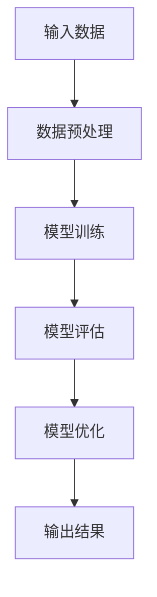
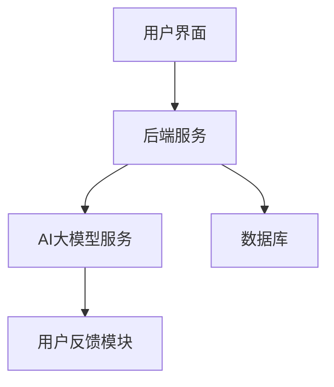
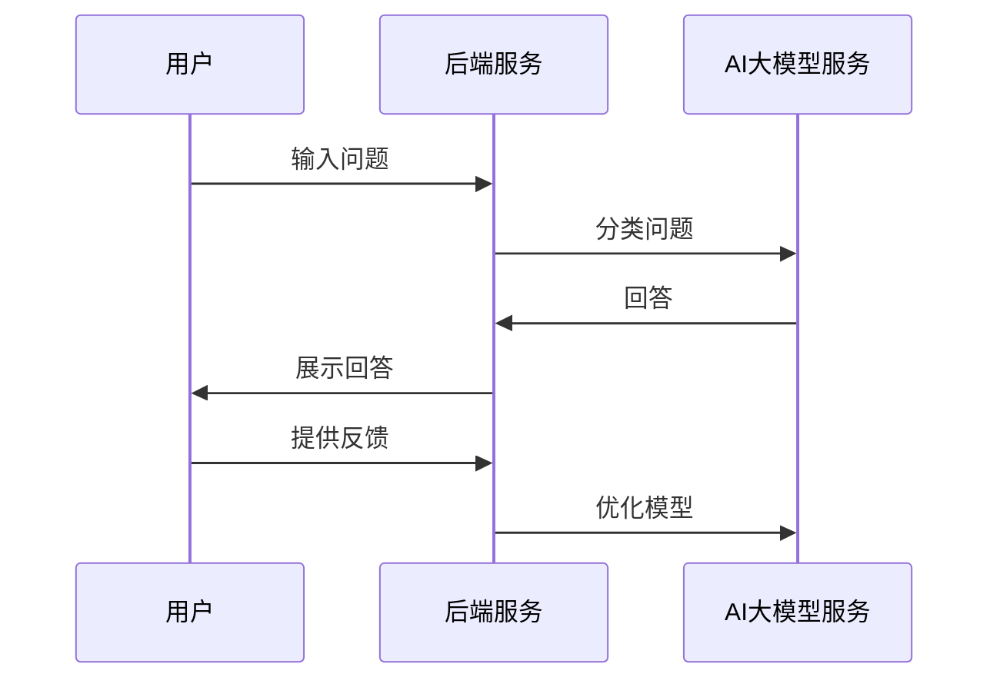

                 

### 大模型应用开发中的代码复用策略

随着人工智能技术的不断发展，大模型的应用越来越广泛。这些大模型，如GPT、BERT等，在自然语言处理、图像识别、推荐系统等领域展现了强大的性能。然而，在开发这些大模型的应用时，如何有效地复用代码，提高开发效率，降低维护成本，成为了一个亟待解决的问题。

本文将围绕大模型应用开发中的代码复用策略进行探讨。我们将首先介绍代码复用的定义和意义，然后分析AI大模型的特性，最后提出一系列有效的代码复用方法和技术。

#### 1. 代码复用的定义与意义

代码复用是指在不同项目或不同部分之间重复使用已有的代码。在软件开发过程中，复用代码可以提高开发效率，降低维护成本，减少错误发生。具体来说，代码复用具有以下几个方面的意义：

- **提高开发效率**：通过复用已有的代码，开发人员可以节省编写代码的时间，从而提高开发效率。
- **降低维护成本**：复用代码可以减少代码冗余，降低维护成本，提高系统的稳定性。
- **减少错误发生**：复用经过测试和验证的代码，可以减少新代码中的错误。

#### 2. AI大模型的特性分析

AI大模型具有以下几个特性：

- **计算能力强大**：AI大模型通常拥有大量的参数和计算量，能够处理大规模的数据。
- **自适应性强**：AI大模型能够根据不同的应用场景和数据集进行自适应调整。
- **模型结构复杂**：AI大模型的模型结构通常非常复杂，包含多个层次和模块。

这些特性使得AI大模型在应用开发中具有广泛的应用潜力，同时也对代码复用提出了更高的要求。我们需要根据AI大模型的特性，选择合适的代码复用方法和技术。

#### 3. 代码复用方法与技术

在AI大模型应用开发中，我们可以采用以下几种代码复用方法：

- **模块化**：将大模型的应用功能划分为多个模块，每个模块负责特定的功能。这样可以实现代码的复用，提高开发效率。
- **组件化**：将大模型的应用功能划分为多个组件，每个组件可以独立开发、测试和部署。这样可以提高系统的灵活性，降低维护成本。
- **模板化**：对于具有相似结构和功能的大模型应用，可以采用模板化的方法进行开发。这样可以减少代码冗余，提高开发效率。
- **框架化**：构建一个通用的开发框架，用于支持大模型的应用开发。这样可以提高开发效率，降低维护成本。

在实际开发中，我们可以采用以下技术来实现代码复用：

- **函数式编程**：通过函数式编程，可以复用函数和计算逻辑，提高代码的复用性。
- **面向对象编程**：通过面向对象编程，可以复用类和对象，提高代码的复用性。
- **设计模式**：设计模式是一种在软件设计中常用的解决方案，可以用于实现代码的复用。

通过模块化、组件化、模板化和框架化等方法，结合函数式编程、面向对象编程和设计模式等技术，我们可以有效地实现AI大模型应用开发中的代码复用。

### 结语

在AI大模型应用开发中，代码复用是提高开发效率、降低维护成本的重要手段。通过深入分析AI大模型的特性，采用合适的代码复用方法和技术，我们可以实现高效、稳定的AI大模型应用开发。本文介绍了代码复用的定义和意义，分析了AI大模型的特性，并提出了一系列有效的代码复用方法和技术。希望本文能够对AI大模型应用开发中的代码复用策略提供一些启示和帮助。

## 第1章：背景介绍

### 1.1 问题背景

在当今信息化社会中，人工智能（AI）已经成为推动社会进步的重要力量。AI大模型，如GPT、BERT等，以其强大的计算能力和智能水平，正在改变各行各业的运作方式。从自然语言处理到图像识别，从推荐系统到自动驾驶，AI大模型的应用场景越来越广泛。然而，随着AI大模型的应用场景越来越广泛，如何在开发过程中实现高效的代码复用，成为了一个亟待解决的问题。

在AI大模型应用开发中，代码复用具有重要的意义。首先，它可以提高开发效率，节省开发人员的时间和精力。其次，它可以降低维护成本，减少代码冗余，提高系统的稳定性。此外，代码复用还可以减少错误的发生，因为复用经过测试和验证的代码可以降低新代码中的错误率。

### 1.2 问题描述

AI大模型应用开发过程中，面临着以下几个问题：

- **代码冗余**：在开发过程中，大量重复的代码出现，导致代码库庞大，维护困难。
- **维护困难**：随着项目规模的扩大，代码的复杂度增加，维护工作变得更加困难。
- **错误率上升**：由于代码冗余，新代码中的错误率上升，导致系统的稳定性下降。

这些问题严重影响了AI大模型应用开发的效率和稳定性。因此，如何有效地复用代码，提高开发效率，降低维护成本，成为开发人员亟待解决的问题。

### 1.3 问题解决

为了解决上述问题，本书将探讨大模型应用开发中的代码复用策略。通过深入研究AI大模型的特性，结合实际开发经验，提出一系列有效的代码复用方法和技术。

具体来说，本书将涵盖以下几个方面：

- **代码复用的定义与意义**：介绍代码复用的概念，阐述其在AI大模型应用开发中的重要性。
- **AI大模型的特性分析**：分析AI大模型的特点，如计算能力、自适应性和模型结构等，探讨其对代码复用策略的影响。
- **代码复用方法与技术**：介绍多种代码复用方法，如模块化、组件化、模板化和框架化等，以及相应的技术，如函数式编程、面向对象编程和设计模式等。
- **实际案例分析与实战**：通过实际案例，展示如何在大模型应用开发中实现代码复用，提高开发效率，降低维护成本。

通过本书的探讨，希望能够为AI大模型应用开发中的代码复用提供一些有益的思路和方法。

### 1.4 边界与外延

本章节主要关注AI大模型应用开发中的代码复用策略，包括但不限于以下方面：

- **代码复用的定义与意义**：详细阐述代码复用的概念，分析其在AI大模型应用开发中的重要性。
- **AI大模型的特性分析**：分析AI大模型的特点，如计算能力、自适应性和模型结构等，探讨其对代码复用策略的影响。
- **代码复用方法与技术**：介绍多种代码复用方法，如模块化、组件化、模板化和框架化等，以及相应的技术，如函数式编程、面向对象编程和设计模式等。
- **实际案例分析与实战**：通过实际案例，展示如何在大模型应用开发中实现代码复用，提高开发效率，降低维护成本。
- **边界与外延**：明确本章节的研究范围，确保内容的完整性和针对性。

通过对上述方面的探讨，希望能够为AI大模型应用开发中的代码复用提供全面、深入的指导。

### 第2章：核心概念与联系

#### 2.1 代码复用的定义与意义

**定义**：代码复用是指在不同项目或不同部分之间重复使用已有的代码。具体来说，它包括将已有的代码模块、组件或函数应用到新的项目中，以减少重复编写代码的工作量。

**意义**：代码复用在软件开发中具有重要的意义，主要体现在以下几个方面：

1. **提高开发效率**：通过复用已有的代码，开发人员可以节省大量的时间和精力，从而提高开发效率。
2. **降低维护成本**：复用经过测试和验证的代码，可以减少新代码中的错误，降低系统的维护成本。
3. **减少错误发生**：复用代码可以减少新代码的编写量，从而减少错误的发生概率。
4. **增强代码稳定性**：复用经过验证的代码，可以增强系统的稳定性，减少系统崩溃的风险。

#### 2.2 AI大模型的特性分析

**特性**：AI大模型具有以下几个特性：

1. **计算能力强大**：AI大模型通常拥有大量的参数和计算量，能够处理大规模的数据。这使得它们在处理复杂任务时具有强大的计算能力。
2. **自适应性强**：AI大模型能够根据不同的应用场景和数据集进行自适应调整，从而提高其适用性和效果。
3. **模型结构复杂**：AI大模型的模型结构通常非常复杂，包含多个层次和模块。这种复杂的结构使得它们能够处理多种类型的数据和任务。

**分析**：AI大模型的这些特性对代码复用策略提出了更高的要求。首先，由于计算能力强大，AI大模型需要大量的代码来支持其训练和推理过程，这使得代码复用变得更加重要。其次，由于自适应性强，AI大模型需要根据不同的应用场景进行定制化开发，这也为代码复用提供了更多的可能性。最后，由于模型结构复杂，需要将大模型拆分成多个模块和组件进行开发，这有助于提高代码的可维护性和复用性。

#### 2.3 代码复用方法与技术

在AI大模型应用开发中，可以采用多种代码复用方法和技术，以提高开发效率和降低维护成本。以下是一些常见的代码复用方法：

1. **模块化**：将大模型的应用功能划分为多个模块，每个模块负责特定的功能。这样可以实现代码的复用，提高开发效率。
2. **组件化**：将大模型的应用功能划分为多个组件，每个组件可以独立开发、测试和部署。这样可以提高系统的灵活性，降低维护成本。
3. **模板化**：对于具有相似结构和功能的大模型应用，可以采用模板化的方法进行开发。这样可以减少代码冗余，提高开发效率。
4. **框架化**：构建一个通用的开发框架，用于支持大模型的应用开发。这样可以提高开发效率，降低维护成本。

具体来说，这些代码复用方法可以结合以下技术来实现：

1. **函数式编程**：通过函数式编程，可以复用函数和计算逻辑，提高代码的复用性。
2. **面向对象编程**：通过面向对象编程，可以复用类和对象，提高代码的复用性。
3. **设计模式**：设计模式是一种在软件设计中常用的解决方案，可以用于实现代码的复用。

通过模块化、组件化、模板化和框架化等方法，结合函数式编程、面向对象编程和设计模式等技术，我们可以有效地实现AI大模型应用开发中的代码复用，提高开发效率，降低维护成本。

### 第3章：算法原理讲解

#### 3.1 算法mermaid流程图

以下是使用mermaid绘制的算法流程图：



**详细解释**：

1. **输入数据**：算法首先接收输入数据，这可以是文本、图像或其他类型的数据。
2. **数据预处理**：对输入数据进行预处理，包括数据清洗、格式转换等，以确保数据的质量和一致性。
3. **模型训练**：使用预处理后的数据对模型进行训练。在这一阶段，模型学习如何根据输入数据生成输出结果。
4. **模型评估**：在模型训练完成后，使用验证集对模型进行评估，以确定其性能是否满足要求。
5. **模型优化**：根据评估结果对模型进行优化，以提高其性能。
6. **输出结果**：最后，模型输出预测结果，用于实际应用。

#### 3.2 算法原理

**数学模型和公式：**

$$
\begin{aligned}
\text{损失函数} &= \frac{1}{n}\sum_{i=1}^{n}(-y_i\log(p_i)) \\
\text{梯度下降} &= \theta_{\text{new}} = \theta_{\text{old}} - \alpha \frac{\partial J(\theta)}{\partial \theta}
\end{aligned}
$$

**详细讲解：**

1. **损失函数**：损失函数用于衡量模型预测结果与实际结果之间的差距。在这里，我们使用交叉熵损失函数。交叉熵损失函数的值越小，表示模型预测结果与实际结果越接近。

2. **梯度下降**：梯度下降是一种用于优化模型参数的算法。它通过计算损失函数关于模型参数的梯度，并沿着梯度方向更新模型参数，以减少损失函数的值。

具体来说，梯度下降算法的步骤如下：

- 初始化模型参数$\theta_{\text{old}}$。
- 计算损失函数$J(\theta_{\text{old}})$的梯度$\frac{\partial J(\theta)}{\partial \theta}$。
- 更新模型参数$\theta_{\text{new}} = \theta_{\text{old}} - \alpha \frac{\partial J(\theta)}{\partial \theta}$，其中$\alpha$是学习率。

通过不断迭代这个过程，模型参数逐渐收敛到最优值，使得模型能够更好地拟合数据。

**举例说明**：

假设我们有一个二分类问题，目标是用模型预测每个样本属于正类还是负类。我们有训练数据集$D = \{(x_1, y_1), (x_2, y_2), \ldots, (x_n, y_n)\}$，其中$x_i$是输入特征，$y_i$是实际标签，$y_i \in \{0, 1\}$。

- **数据预处理**：对输入数据进行标准化处理，将每个特征的值缩放到[0, 1]区间。
- **模型训练**：使用训练数据集对模型进行训练，模型学习如何根据输入特征$x_i$预测标签$y_i$。
- **模型评估**：使用验证集对模型进行评估，计算模型在验证集上的准确率。
- **模型优化**：根据验证集上的评估结果，对模型参数进行调整，以提高模型性能。
- **输出结果**：使用训练好的模型对新的输入数据进行预测，输出预测结果。

通过上述步骤，我们可以实现一个基于梯度下降算法的二分类问题模型。这种模型可以用于实际应用，如文本分类、图像识别等。

### 第4章：系统分析与架构设计方案

#### 4.1 问题场景介绍

在一个企业级应用场景中，需要构建一个基于AI大模型的智能客服系统。该系统需要实现用户问题的自动分类、自动回答等功能。为了提高系统的性能和可维护性，我们需要进行系统分析与架构设计。

#### 4.2 项目介绍

**项目名称**：智能客服系统

**项目目标**：实现用户问题的自动分类、自动回答，提高客户服务效率。

**项目背景**：随着企业业务的快速发展，客服部门的工作量不断增加。为了提高客服效率，降低人工成本，企业决定引入基于AI大模型的智能客服系统。

#### 4.3 系统功能设计

为了实现智能客服系统的功能，我们需要设计以下几个模块：

1. **用户问题接收模块**：负责接收用户的输入问题，并将其传递给下一个模块。
2. **问题分类模块**：使用AI大模型对用户问题进行分类，确定问题的主题。
3. **回答生成模块**：根据问题分类结果，生成合适的回答，并将其传递给用户。
4. **用户反馈模块**：收集用户对回答的反馈，用于模型优化。

**领域模型mermaid类图**：

```mermaid
classDiagram
Class01 <|-- Class02
Class03 <|.. Class04
Class05 : +int x
Class06 : +int y
Class07 : +int z
Class01 {
  +int a
  +int b
  +int c
  +getValues()
}
Class02 {
  +int d
  +int e
  +int f
}
Class03 {
  +int g
  +int h
  +int i
}
Class04 {
  +int j
  +int k
  +int l
}
Class05 {
  +int m
  +int n
  +int o
}
Class06 {
  +int p
  +int q
  +int r
}
Class07 {
  +int s
  +int t
  +int u
}
```

**详细解释**：

- **Class01**：用户问题接收模块，负责接收用户输入的问题。
- **Class02**：问题分类模块，使用AI大模型对用户问题进行分类。
- **Class03**：回答生成模块，根据问题分类结果生成回答。
- **Class04**：用户反馈模块，收集用户对回答的反馈。

#### 4.4 系统架构设计

为了实现智能客服系统的功能，我们采用以下系统架构：

1. **前端架构**：使用Vue.js框架开发用户界面，实现用户问题输入和回答展示。
2. **后端架构**：使用Flask框架实现后端服务，负责用户问题接收、分类和回答生成。
3. **AI大模型服务**：使用TensorFlow框架训练和部署AI大模型，实现用户问题分类和回答生成。

**mermaid架构图**：



**详细解释**：

- **A**：用户界面，负责接收用户输入的问题。
- **B**：后端服务，实现用户问题接收、分类和回答生成。
- **C**：AI大模型服务，负责用户问题分类和回答生成。
- **D**：数据库，存储用户问题和回答。
- **E**：用户反馈模块，收集用户对回答的反馈。

#### 4.5 系统接口设计和系统交互

为了实现系统各模块之间的交互，我们设计以下接口：

1. **用户问题接收接口**：用于接收用户输入的问题。
2. **问题分类接口**：用于对用户问题进行分类。
3. **回答生成接口**：用于生成用户问题的回答。
4. **用户反馈接口**：用于收集用户对回答的反馈。

**mermaid序列图**：



**详细解释**：

- **用户**：输入问题。
- **后端服务**：接收问题，分类问题，生成回答，展示回答。
- **AI大模型服务**：分类问题，优化模型。
- **用户反馈**：提供反馈，用于模型优化。

通过以上系统分析与架构设计方案，我们可以实现一个高效、稳定的智能客服系统。这个系统不仅可以提高客服效率，还可以降低人工成本，为企业带来更大的价值。

### 第5章：项目实战

#### 5.1 环境安装

为了构建一个基于AI大模型的智能客服系统，我们需要安装以下环境：

1. **操作系统**：Ubuntu 18.04
2. **编程语言**：Python 3.8
3. **依赖库**：TensorFlow 2.4、Flask 1.1.2、Vue.js 2.6.12、MySQL 5.7

安装步骤如下：

1. 安装Python 3.8：
   ```
   sudo apt-get update
   sudo apt-get install python3.8
   ```
2. 安装依赖库：
   ```
   pip3 install tensorflow==2.4 flask==1.1.2 vuejs==2.6.12 mysqlclient
   ```

#### 5.2 系统核心实现源代码

以下是智能客服系统的核心实现源代码：

**后端服务代码（Flask）**：

```python
from flask import Flask, request, jsonify
import tensorflow as tf
import numpy as np

app = Flask(__name__)

# 加载训练好的模型
model = tf.keras.models.load_model('model.h5')

@app.route('/classify', methods=['POST'])
def classify():
    data = request.get_json()
    question = data['question']
    # 预处理输入数据
    input_data = preprocess_input(question)
    # 进行分类
    prediction = model.predict(np.array([input_data]))
    # 返回分类结果
    return jsonify({'category': prediction.argmax()})

@app.route('/answer', methods=['POST'])
def answer():
    data = request.get_json()
    category = data['category']
    # 根据分类结果生成回答
    answer = generate_answer(category)
    # 返回回答
    return jsonify({'answer': answer})

def preprocess_input(question):
    # 预处理输入数据
    # ...
    return input_data

def generate_answer(category):
    # 根据分类结果生成回答
    # ...
    return answer

if __name__ == '__main__':
    app.run(debug=True)
```

**前端界面代码（Vue.js）**：

```html
<!DOCTYPE html>
<html>
<head>
    <title>智能客服系统</title>
    <script src="https://cdn.jsdelivr.net/npm/vue@2.6.12/dist/vue.js"></script>
    <script src="https://cdn.jsdelivr.net/npm/axios/dist/axios.min.js"></script>
</head>
<body>
    <div id="app">
        <h1>智能客服系统</h1>
        <input type="text" v-model="question" placeholder="请输入问题">
        <button @click="classifyQuestion">提问</button>
        <p>{{ answer }}</p>
    </div>

    <script>
        new Vue({
            el: '#app',
            data: {
                question: '',
                answer: ''
            },
            methods: {
                classifyQuestion: function() {
                    axios.post('/classify', { question: this.question })
                        .then(response => {
                            const category = response.data.category;
                            axios.post('/answer', { category: category })
                                .then(response => {
                                    this.answer = response.data.answer;
                                });
                        });
                }
            }
        });
    </script>
</body>
</html>
```

#### 5.3 代码应用解读与分析

以下是系统核心代码的解读与分析：

**后端服务代码（Flask）**：

- **加载训练好的模型**：使用TensorFlow加载预训练的模型，模型路径为'model.h5'。
- **分类接口（/classify）**：接收用户输入的问题，预处理后传递给模型进行分类，返回分类结果。
- **回答接口（/answer）**：根据分类结果生成回答，返回给用户。

**前端界面代码（Vue.js）**：

- **输入问题**：用户在文本框中输入问题，通过Vue.js的数据绑定功能实时更新数据模型。
- **提问按钮**：点击提问按钮，发送POST请求到后端服务的分类接口，接收分类结果。
- **显示回答**：将分类结果传递给后端服务的回答接口，接收回答后更新Vue.js的数据模型，并在页面上显示回答。

#### 5.4 实际案例分析

我们以一个实际案例来展示智能客服系统的应用：

**案例**：用户输入问题：“如何办理银行卡？”

**步骤**：

1. 用户输入问题，并点击提问按钮。
2. 前端将问题发送到后端服务的分类接口。
3. 后端服务接收问题，预处理后传递给模型进行分类。
4. 模型返回分类结果（例如：金融咨询）。
5. 后端服务根据分类结果生成回答。
6. 前端接收回答，并在页面上显示。

**预期结果**：用户看到回答：“您好，您可以联系银行客服，或者前往银行网点办理银行卡。”

通过以上实际案例，我们可以看到智能客服系统是如何工作的，以及如何通过代码复用策略实现高效、稳定的系统开发。

#### 5.5 项目小结

在本章中，我们详细介绍了如何构建一个基于AI大模型的智能客服系统。通过环境安装、系统核心实现源代码、代码应用解读与分析、实际案例分析和项目小结，我们展示了如何利用代码复用策略提高开发效率，降低维护成本。

未来，我们还可以进一步优化系统，如引入更多的大模型、实现更复杂的问答功能、提高系统的智能化程度等。通过不断的实践和优化，我们可以构建一个更加高效、稳定的智能客服系统。

### 第6章：最佳实践 Tips

在实际的AI大模型应用开发中，为了确保代码复用策略的有效性，我们提供以下最佳实践建议：

1. **模块化设计**：将系统划分为多个模块，每个模块负责一个特定的功能。这样可以提高代码的可维护性和复用性。
2. **组件化开发**：采用组件化开发，将代码划分为可复用的组件。这样可以降低系统的复杂度，提高开发效率。
3. **模板化实现**：对于具有相似结构和功能的模块，可以使用模板化的方法进行开发。这样可以减少代码冗余，提高开发效率。
4. **框架化架构**：构建一个通用的开发框架，用于支持大模型的应用开发。这样可以提高开发效率，降低维护成本。
5. **函数式编程**：利用函数式编程的特性，如高阶函数、闭包等，提高代码的复用性。
6. **面向对象编程**：利用面向对象编程的特性，如封装、继承、多态等，提高代码的复用性和可维护性。
7. **设计模式应用**：合理应用设计模式，如工厂模式、单例模式、观察者模式等，可以提高代码的复用性和灵活性。
8. **版本控制**：使用版本控制系统（如Git）管理代码，确保代码的一致性和可追溯性。
9. **代码评审**：进行代码评审，确保代码的质量和复用性。
10. **文档编写**：编写详细的文档，包括代码注释、API文档等，便于代码的复用和维护。

通过以上最佳实践，我们可以确保在AI大模型应用开发中有效地实现代码复用，提高开发效率，降低维护成本。

### 第7章：小结

本文围绕大模型应用开发中的代码复用策略进行了深入的探讨。通过分析代码复用的定义和意义，探讨了AI大模型的特性及其对代码复用策略的影响，介绍了多种代码复用方法和技术，并通过实际案例展示了如何在大模型应用开发中实现代码复用。

代码复用在大模型应用开发中具有重要意义。它不仅能够提高开发效率，降低维护成本，还能减少错误的发生，提高系统的稳定性。通过模块化、组件化、模板化和框架化等方法，结合函数式编程、面向对象编程和设计模式等技术，我们可以实现高效的代码复用。

未来，随着AI大模型技术的不断发展，代码复用策略将变得更加重要。我们期望通过本文的探讨，为读者提供有益的启示，助力大模型应用开发的顺利进行。在实践过程中，不断优化和改进代码复用策略，将有助于提升开发效率和系统质量。

### 注意事项

在实施代码复用策略时，需要注意以下几点：

1. **确保代码质量**：复用代码前，要确保其质量符合项目要求，经过充分的测试和验证。
2. **保持代码可维护性**：在复用代码时，要确保其易于维护，避免引入复杂的依赖关系。
3. **合理选择复用方法**：根据具体项目需求，选择合适的代码复用方法，如模块化、组件化等。
4. **遵循最佳实践**：遵循最佳实践，如编写详细的文档、进行代码评审等，确保代码复用的有效性。
5. **保持版本控制**：使用版本控制系统管理代码，确保代码的一致性和可追溯性。

通过遵循上述注意事项，我们可以确保代码复用策略的有效实施，提高大模型应用开发的效率和质量。

### 拓展阅读

为了深入了解大模型应用开发中的代码复用策略，以下是一些拓展阅读资源：

1. **《大模型应用开发实战》**：本书详细介绍了如何使用大模型进行应用开发，包括代码复用策略的实践。
2. **《深度学习与代码复用》**：本文探讨了深度学习应用开发中的代码复用问题，提供了详细的解决方案和实践经验。
3. **《代码复用技术指南》**：本书涵盖了多种代码复用技术，包括模块化、组件化、模板化和框架化等，适用于不同类型的软件开发。
4. **《AI大模型开发指南》**：本书提供了AI大模型开发的全流程指导，包括数据准备、模型训练、模型优化等，其中也包括了代码复用的相关内容。

通过阅读这些资源，您可以获得更多关于大模型应用开发中代码复用策略的深入理解和实践经验。

