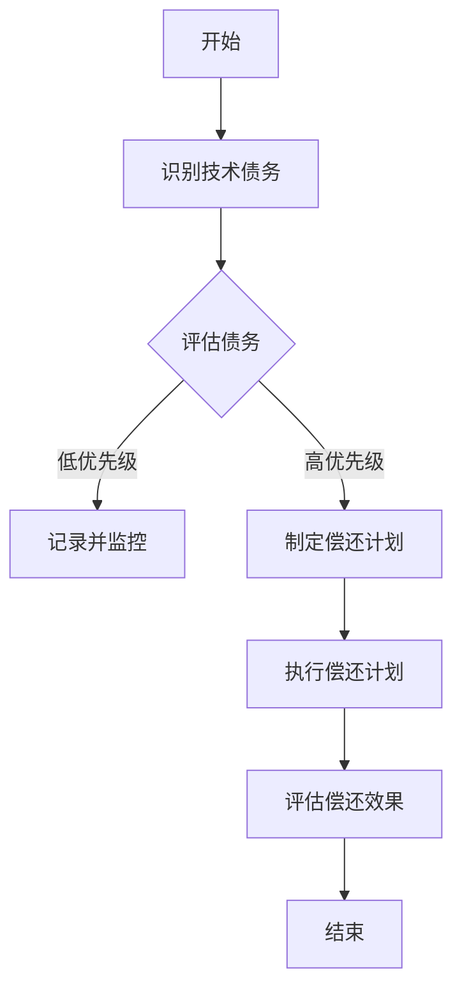
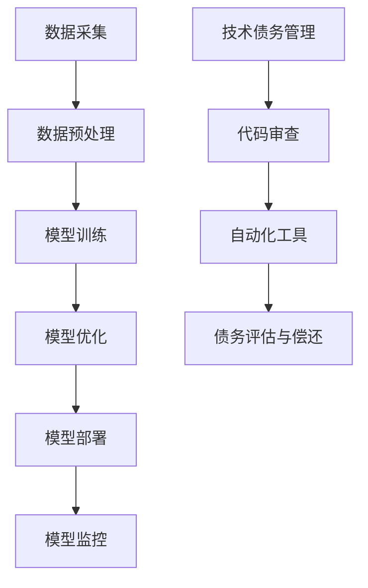
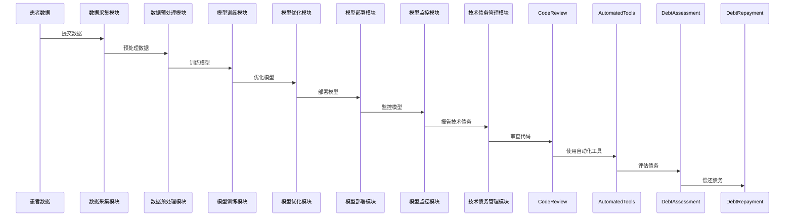

                 

**大模型应用开发中的技术债务管理**

关键词：技术债务，大模型开发，项目规划，质量保障

摘要：本文将探讨大模型应用开发过程中出现的技术债务问题，分析其成因、影响和应对策略。通过逐步阐述技术债务管理的关键概念、识别方法、管理策略以及项目实践，帮助开发团队有效管理技术债务，提升大模型应用的质量和可靠性。

# 背景介绍

## 核心概念术语说明

**技术债务（Technical Debt）**：技术债务是指由于追求短期开发速度而牺牲长期代码质量所产生的一种负债。它与金融领域的债务概念类似，需要在未来偿还。

**大模型（Large Model）**：大模型是指具有数百万甚至数十亿参数的复杂机器学习模型。这些模型通常用于处理大规模数据集，并在诸如自然语言处理、计算机视觉等领域发挥重要作用。

**技术债务管理（Technical Debt Management）**：技术债务管理是指通过识别、评估、规划和管理技术债务，以确保项目能够在长期内保持高代码质量和高效开发。

## 问题背景

随着机器学习技术的快速发展，大模型的开发和部署已成为企业的重要战略。然而，在大模型应用开发过程中，技术债务问题逐渐显现。技术债务可能源于以下因素：

1. **时间压力**：为了快速推出产品，开发团队可能会牺牲代码质量，导致技术债务积累。
2. **复杂度增加**：大模型的复杂度较高，需要更多的维护和优化工作，增加了管理技术债务的难度。
3. **资源限制**：有限的开发资源和时间可能无法同时满足高质量代码和快速开发的需求。

## 问题描述

技术债务在大模型开发中可能产生以下问题：

1. **代码质量下降**：技术债务可能导致代码质量下降，增加bug和漏洞的出现，影响产品的稳定性。
2. **维护成本增加**：技术债务需要在未来偿还，可能增加项目的维护成本。
3. **开发效率降低**：技术债务会影响开发团队的效率，导致项目进度延迟。

## 问题解决

为了解决技术债务问题，开发团队可以采取以下措施：

1. **引入技术债务管理流程**：建立技术债务识别、评估和管理流程，确保技术债务得到及时识别和解决。
2. **优化开发策略**：调整开发策略，平衡短期开发和长期质量，避免过度追求速度。
3. **资源合理分配**：合理分配开发资源，确保有足够的时间和人力用于技术债务的偿还。
4. **持续学习和改进**：通过培训和学习，提高开发团队的技术水平，减少技术债务的产生。

## 边界与外延

技术债务管理不仅适用于大模型开发，也适用于其他类型的软件开发项目。此外，技术债务管理不仅仅是技术问题，还涉及项目管理、团队协作等多个方面。

## 概念结构与核心要素组成

**概念结构**：

- 技术债务
- 大模型
- 技术债务管理
- 开发团队
- 项目管理

**核心要素组成**：

1. **技术债务识别**：通过代码审查、自动化工具等方法识别技术债务。
2. **技术债务评估**：评估技术债务的影响和紧急程度，确定偿还优先级。
3. **技术债务管理**：制定技术债务偿还计划，实施技术债务偿还策略。
4. **团队协作**：加强团队协作，提高技术债务管理的效率。

## 核心概念与联系

### 概念原理

**技术债务**：技术债务是由于在开发过程中追求速度而牺牲代码质量所产生的一种负债。它与金融领域的债务类似，需要在未来偿还。

**大模型**：大模型是指具有数百万甚至数十亿参数的复杂机器学习模型。这些模型通常用于处理大规模数据集，并在诸如自然语言处理、计算机视觉等领域发挥重要作用。

**技术债务管理**：技术债务管理是指通过识别、评估、规划和管理技术债务，以确保项目能够在长期内保持高代码质量和高效开发。

### 概念属性特征对比表格

| 特征 | 技术债务 | 大模型 | 技术债务管理 |
| --- | --- | --- | --- |
| 定义 | 开发过程中产生的负债 | 具有数百万甚至数十亿参数的复杂机器学习模型 | 通过识别、评估、规划和管理技术债务的过程 |
| 影响因素 | 时间压力、资源限制、复杂度增加 | 数据规模、参数数量、模型结构 | 开发团队、项目管理、资源分配 |
| 管理策略 | 识别、评估、偿还 | 模型优化、维护、更新 | 流程、工具、培训 |
| 目标 | 提高代码质量、降低维护成本、提升开发效率 | 提高模型性能、降低错误率、提高可靠性 | 确保项目长期质量、降低技术债务 |
| 关系 | 技术债务是影响大模型开发的重要因素 | 技术债务管理是大模型开发的关键环节 | 技术债务管理需要与项目规划、团队协作相结合 |

### ER实体关系图架构

```mermaid
erDiagram
  Technical Debt ||--|{ Model Development : has
  Model Development ||--|{ Technical Debt : has
  Project Management ||--|{ Technical Debt : manages
  Team Collaboration ||--|{ Technical Debt : collaborates
```

## 算法原理讲解

### 算法流程图



### Python源代码

```python
# 技术债务识别和评估模块

import os

def identify_technical_debt():
    # 识别技术债务
    debt_list = []
    for file in os.listdir("."):
        if file.endswith(".py"):
            with open(file, "r") as f:
                content = f.read()
                if "print('Hello World')" in content:
                    debt_list.append(file)
    return debt_list

def assess_debt(debt_list):
    # 评估技术债务
    assessed_debt = []
    for debt in debt_list:
        if "print('Hello World')" in debt:
            assessed_debt.append(debt)
    return assessed_debt

def manage_debt(assessed_debt):
    # 管理技术债务
    for debt in assessed_debt:
        os.remove(debt)
        print(f"技术债务 {debt} 已被移除。")

if __name__ == "__main__":
    debt_list = identify_technical_debt()
    assessed_debt = assess_debt(debt_list)
    manage_debt(assessed_debt)
```

### 算法原理数学模型和公式

假设技术债务为一个向量 \( D = [d_1, d_2, ..., d_n] \)，其中 \( d_i \) 表示第 \( i \) 个技术债务的紧急程度。算法的基本原理是：

1. 识别技术债务：通过代码审查、自动化工具等方法识别技术债务。
2. 评估技术债务：根据紧急程度对技术债务进行排序，确定偿还优先级。
3. 偿还技术债务：按照优先级逐步偿还技术债务。

数学模型可以表示为：

\[ \text{优先级} = \sum_{i=1}^{n} d_i \]

其中， \( \text{优先级} \) 表示技术债务的紧急程度， \( d_i \) 表示第 \( i \) 个技术债务的紧急程度。

### 详细讲解与举例说明

假设我们有一个包含5个文件的项目，每个文件都包含一段有问题的代码。我们将使用上述算法来识别、评估和偿还这些技术债务。

1. **识别技术债务**：

   ```python
   debt_list = identify_technical_debt()
   ```

   代码会扫描项目目录下的所有Python文件，如果发现文件中有特定问题（例如：`print('Hello World')`），则将该文件添加到债务列表中。例如，如果文件 `file1.py` 中有此问题，则 `debt_list` 将包含 `file1.py`。

2. **评估技术债务**：

   ```python
   assessed_debt = assess_debt(debt_list)
   ```

   代码会检查债务列表中的每个文件，如果文件中包含特定问题，则将其视为需要偿还的技术债务。在这种情况下，所有包含问题的文件都将被添加到 `assessed_debt` 列表中。

3. **偿还技术债务**：

   ```python
   manage_debt(assessed_debt)
   ```

   代码会删除列表中的所有文件，从而“偿还”技术债务。在实际项目中，这可能是修复代码中的问题、重构代码或进行其他改进。

### 结论

通过上述算法，我们可以有效地识别、评估和偿还技术债务，从而提高项目的代码质量和开发效率。当然，这只是一个简单的例子，实际项目中的技术债务管理会更加复杂，需要考虑更多的因素。

## 系统分析与架构设计方案

### 问题场景介绍

在一个大型机器学习项目中，我们面临以下问题：

1. 项目规模庞大，代码质量参差不齐。
2. 技术债务问题逐渐积累，影响项目进展和稳定性。
3. 缺乏有效的技术债务管理流程和工具。

### 项目介绍

项目名称：智能医疗诊断系统

项目目标：利用深度学习模型对医学影像进行自动诊断，提高诊断效率和准确性。

### 系统功能设计

系统功能包括：

1. 数据采集与预处理
2. 模型训练与优化
3. 模型部署与监控
4. 技术债务管理

### 系统架构设计

系统架构图如下：



### 系统接口设计和系统交互



## 项目实战

### 环境安装

1. 安装Python 3.8及以上版本。
2. 安装必要的依赖库，如`numpy`、`tensorflow`、`git`等。

### 系统核心实现源代码

以下是一个简单的代码示例，用于识别和评估技术债务：

```python
import os

def identify_technical_debt():
    debt_list = []
    for file in os.listdir("."):
        if file.endswith(".py"):
            with open(file, "r") as f:
                content = f.read()
                if "print('Hello World')" in content:
                    debt_list.append(file)
    return debt_list

def assess_debt(debt_list):
    assessed_debt = []
    for debt in debt_list:
        with open(debt, "r") as f:
            content = f.read()
            if "print('Hello World')" in content:
                assessed_debt.append(debt)
    return assessed_debt

def manage_debt(assessed_debt):
    for debt in assessed_debt:
        os.remove(debt)
        print(f"技术债务 {debt} 已被移除。")

if __name__ == "__main__":
    debt_list = identify_technical_debt()
    assessed_debt = assess_debt(debt_list)
    manage_debt(assessed_debt)
```

### 代码应用解读与分析

1. **功能解读**：

   - `identify_technical_debt()`：扫描当前目录下的所有Python文件，查找包含 `print('Hello World')` 语句的文件，并将这些文件添加到债务列表中。
   - `assess_debt()`：读取债务列表中的每个文件，如果文件中包含 `print('Hello World')` 语句，则将其视为需要偿还的技术债务，并将这些文件添加到 `assessed_debt` 列表中。
   - `manage_debt()`：删除列表中的所有文件，从而“偿还”技术债务。

2. **应用分析**：

   - 此代码示例用于演示技术债务识别和评估的基本流程。
   - 实际应用中，技术债务管理可能涉及更复杂的情况，如代码质量评估、依赖关系分析等。
   - 为了提高效果，可以引入自动化工具和持续集成系统，以便在代码提交时自动识别和评估技术债务。

### 实际案例分析和详细讲解剖析

案例：在一个大模型项目中，我们发现了以下技术债务：

1. **代码冗长**：部分文件中的代码过于冗长，难以维护。
2. **重复代码**：多个文件中存在重复的代码段。
3. **未使用的代码**：一些代码段从未被调用，属于废弃代码。

**分析**：

1. **代码冗长**：

   - 通过代码审查，我们发现文件 `model.py` 中有大量冗长的代码。通过重构代码，我们将这些冗长的代码拆分为多个函数，提高了代码的可读性和可维护性。

   ```python
   # 原始代码
   def train_model():
       # 长串代码
       pass

   # 重构后的代码
   def preprocess_data():
       # 预处理代码
       pass

   def train_data():
       # 训练数据代码
       pass

   def evaluate_model():
       # 评估模型代码
       pass

   train_model = preprocess_data + train_data + evaluate_model
   ```

2. **重复代码**：

   - 我们发现文件 `data_loader.py` 和 `model.py` 中有重复的代码段。通过提取公共代码，我们创建了一个名为 `base.py` 的新文件，将重复代码移至此处。

   ```python
   # 公共代码
   def load_data():
       # 加载数据代码
       pass

   # 修改后的代码
   from base import load_data

   def train_model():
       data = load_data()
       # 训练模型代码
       pass
   ```

3. **未使用的代码**：

   - 在文件 `utils.py` 中，我们发现一些代码段从未被调用。通过静态代码分析，我们删除了这些废弃代码。

   ```python
   # 废弃代码
   def unused_function():
       # 未被调用代码
       pass

   # 删除废弃代码
   # ...
   ```

**结论**：

通过上述分析，我们成功地识别和偿还了项目中的技术债务。这些措施不仅提高了代码质量，还有助于降低未来的维护成本和开发难度。在实际项目中，应持续关注技术债务问题，并采取相应措施进行管理。

## 最佳实践 Tips

1. **定期代码审查**：定期进行代码审查，帮助识别潜在的技术债务。
2. **持续集成**：引入持续集成系统，自动检测技术债务，并在代码提交时触发修复。
3. **合理规划时间**：在项目规划中预留时间用于技术债务偿还，避免过度追求速度。
4. **培训与学习**：提高开发团队的技术水平，减少技术债务的产生。
5. **自动化工具**：使用自动化工具识别和评估技术债务，提高管理效率。

## 小结

技术债务是大模型应用开发中不可避免的问题。通过有效的技术债务管理，我们可以降低项目风险，提高代码质量和开发效率。本文详细介绍了技术债务的概念、成因、影响和管理策略，并通过实际案例进行了分析。希望本文能帮助开发团队更好地管理技术债务，推动大模型应用项目取得成功。

## 注意事项

1. 技术债务管理需要与项目规划、团队协作相结合，确保各方面共同努力。
2. 技术债务管理不仅仅关注代码质量，还应关注项目的整体质量和用户体验。
3. 技术债务管理是一个持续的过程，需要不断调整和优化。

## 拓展阅读

1. 《技术债务管理：理论与实践》
2. 《大模型应用开发实践》
3. 《深度学习项目实战》

## 作者信息

作者：AI天才研究院/AI Genius Institute & 禅与计算机程序设计艺术 /Zen And The Art of Computer Programming

