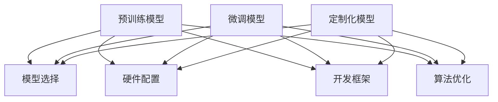
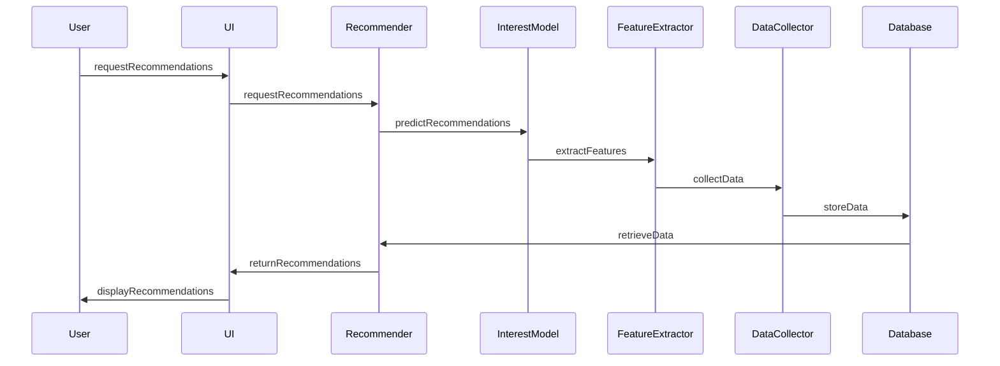

                 

### 大模型应用开发中的技术选型策略

---

#### **1. 文章标题：大模型应用开发中的技术选型策略**

#### **2. 关键词：大模型，技术选型，应用开发，算法优化，硬件配置**

#### **3. 摘要：本文将深入探讨大模型应用开发中的技术选型策略，从模型选择、硬件配置、开发框架、算法优化等方面，提供系统性的指导，以帮助开发者在大模型应用项目中做出科学合理的技术决策。**

---

**# 第一部分：背景介绍**

### **第1章：大模型应用开发中的技术选型策略概述**

#### **1.1 问题背景**

在当今信息化时代，人工智能技术快速发展，大模型的应用越来越广泛。大模型具有强大的数据处理和智能分析能力，能够为各行各业带来创新和变革。然而，在实际应用开发中，如何选择合适的技术和策略，以满足不同场景的需求，成为一个关键问题。

##### **1.1.1 大模型的应用场景**

大模型的应用场景包括但不限于以下几个方面：

- 自然语言处理（NLP）：例如文本分类、机器翻译、情感分析等。
- 计算机视觉（CV）：例如图像识别、目标检测、图像生成等。
- 推荐系统：例如基于内容的推荐、协同过滤等。
- 语音识别：例如语音到文本转换、语音合成等。

##### **1.1.2 技术选型的挑战**

- 模型选择：不同的模型具有不同的参数规模和计算复杂度，如何根据应用需求选择合适的模型，是技术选型的重要一环。
- 硬件配置：硬件配置直接影响到模型的训练效率和推理速度，如何选择合适的硬件设备，是技术选型的关键。
- 开发框架：开发框架提供了模型的搭建、训练和部署工具，如何选择适合项目需求的开源开发框架，是技术选型的重要考量。
- 算法优化：算法优化可以显著提高模型的性能和效率，如何对模型和算法进行优化，是技术选型中不可忽视的部分。

#### **1.2 问题描述**

大模型应用开发中的技术选型策略涉及到多个方面，包括模型选择、硬件配置、开发框架、算法优化等。不同的技术选型策略会对应用的性能、稳定性、可扩展性等方面产生重要影响。因此，如何科学地制定技术选型策略，是确保大模型应用成功的关键。

##### **1.2.1 技术选型策略的重要性**

- 性能优化：合理的技术选型策略可以显著提高应用的性能，减少响应时间，提高用户体验。
- 稳定性保障：合理的技术选型策略可以确保应用的稳定性，降低故障率和数据丢失风险。
- 可扩展性支持：合理的技术选型策略可以为未来的扩展和升级提供支持，降低维护成本。

#### **1.3 问题解决**

本书旨在为大模型应用开发者提供一套系统的技术选型策略，帮助他们在实际项目中做出合理的技术决策。通过分析不同技术方案的优缺点，并结合实际案例进行讲解，本书旨在帮助读者掌握大模型应用开发的核心技术和策略。

##### **1.3.1 本书的内容结构**

- 第1章：背景介绍，概述大模型应用开发中的技术选型策略。
- 第2章：核心概念与联系，详细阐述大模型的基本原理和算法。
- 第3章：系统分析与架构设计，介绍大模型应用开发中的系统架构设计方法。
- 第4章：项目实战，通过实际案例讲解大模型应用开发的实践过程。
- 第5章：最佳实践与注意事项，总结最佳实践，并提出注意事项。
- 第6章：拓展阅读，推荐相关阅读资料。

#### **1.4 边界与外延**

本书主要关注大模型在通用场景中的应用，包括自然语言处理、计算机视觉、推荐系统等。同时，本书也将讨论一些特殊场景下的技术选型策略。

##### **1.4.1 概念结构与核心要素组成**

1. **模型选择**：根据应用需求选择合适的大模型，包括预训练模型、微调模型和定制化模型。
2. **硬件配置**：根据模型规模和计算需求选择合适的硬件设备，包括CPU、GPU、TPU等。
3. **开发框架**：选择适合项目需求的开源开发框架，如TensorFlow、PyTorch等。
4. **算法优化**：针对具体应用场景，对模型和算法进行优化，提高性能和效率。

### **1.5 大模型应用中的核心概念与联系**

#### **1.5.1 大模型的核心概念**

- **大模型**：具有大规模参数和强通用性的人工智能模型。
- **模型选择**：根据应用需求选择合适的大模型。
- **硬件配置**：根据模型规模和计算需求选择合适的硬件设备。
- **开发框架**：选择适合项目需求的开源开发框架。
- **算法优化**：针对具体应用场景，对模型和算法进行优化。

#### **1.5.2 大模型的属性特征对比表格**

| 特征               | 预训练模型       | 微调模型       | 定制化模型       |
|--------------------|------------------|----------------|------------------|
| 参数规模           | 大规模           | 中规模         | 小规模           |
| 通用性             | 高               | 中             | 低               |
| 训练成本           | 高               | 中             | 低               |
| 应用范围           | 广泛             | 中等           | 独特             |
| 适应性             | 高               | 中             | 低               |

#### **1.5.3 大模型在ER实体关系图架构中的体现**



---

**# 第二部分：核心概念与联系**

### **第2章：大模型原理与算法解析**

#### **2.1 大模型的基本原理**

##### **2.1.1 大模型的定义**

大模型是指具有大规模参数和强通用性的人工智能模型。这些模型通常采用深度学习技术，具有层次化的神经网络结构，能够自动从大规模数据中学习到有用的特征表示。

##### **2.1.2 大模型的训练过程**

大模型的训练过程主要包括以下几个步骤：

1. **数据预处理**：对输入数据进行清洗、归一化等处理，以适应模型的输入要求。
2. **模型初始化**：初始化模型的参数，常用的方法有随机初始化、基于预训练模型权重初始化等。
3. **前向传播**：将输入数据通过模型的前向传播过程，得到输出结果。
4. **损失函数计算**：计算模型的输出结果与实际结果的差异，通过损失函数来衡量模型的性能。
5. **反向传播**：根据损失函数，通过反向传播算法更新模型的参数。
6. **迭代训练**：重复上述过程，不断迭代训练，直至达到预定的训练目标或性能指标。

##### **2.1.3 大模型的优势与挑战**

大模型的优势：

- 强大的数据处理能力：能够处理大规模、复杂的数据集。
- 高度的通用性：能够适应多种不同的应用场景。
- 出色的性能表现：在许多任务中，大模型的性能已经超越了传统的小规模模型。

大模型的挑战：

- 高昂的计算成本：训练大模型需要大量的计算资源和时间。
- 数据需求大：大模型需要大量的数据来训练，数据的获取和处理成本较高。
- 模型的可解释性：大模型的内部结构复杂，难以解释其决策过程。

#### **2.2 大模型算法解析**

##### **2.2.1 神经网络算法**

神经网络（Neural Network）是深度学习的基础算法，通过多层非线性变换，从输入数据中提取特征，实现数据的自动编码和解码。

- **基本原理**：神经网络由多个神经元（节点）组成，每个神经元通过加权的方式连接前一层和后一层，通过激活函数对输入进行非线性变换。
- **数学模型**：

  $$ z = \sum_{i=1}^{n} w_i * x_i + b $$
  $$ a = \sigma(z) $$

  其中，$w_i$ 是权重，$x_i$ 是输入，$b$ 是偏置，$\sigma$ 是激活函数。

- **例子**：假设一个简单的神经网络，有两个输入节点、两个隐藏节点和一个输出节点，使用ReLU激活函数。其结构可以表示为：

  ```mermaid
  graph TD
  A[Input] --> B[Hidden 1]
  A --> C[Hidden 2]
  B --> D[Output]
  C --> D
  ```

  前向传播过程：

  $$ z_1 = w_{11} * x_1 + w_{12} * x_2 + b_1 $$
  $$ z_2 = w_{21} * x_1 + w_{22} * x_2 + b_2 $$
  $$ a_1 = \max(0, z_1) $$
  $$ a_2 = \max(0, z_2) $$
  $$ z_3 = w_{31} * a_1 + w_{32} * a_2 + b_3 $$
  $$ a_3 = \max(0, z_3) $$

##### **2.2.2 循环神经网络（RNN）**

循环神经网络（Recurrent Neural Network，RNN）是一种能够处理序列数据的高级算法，通过在时间步之间传递信息，实现序列数据的建模。

- **基本原理**：RNN 通过在时间步之间引入反馈循环，使得前一个时间步的输出可以作为下一个时间步的输入。
- **数学模型**：

  $$ h_t = \sigma(W_h \cdot [h_{t-1}, x_t] + b_h) $$
  $$ y_t = W_o \cdot h_t + b_o $$

  其中，$h_t$ 是当前时间步的隐藏状态，$x_t$ 是当前时间步的输入，$y_t$ 是当前时间步的输出，$\sigma$ 是激活函数。

- **例子**：假设一个简单的RNN，有两个输入节点、一个隐藏节点和一个输出节点，使用ReLU激活函数。其结构可以表示为：

  ```mermaid
  graph TD
  A[Input] --> B[Hidden]
  B --> C[Output]
  ```

  前向传播过程：

  $$ h_0 = \sigma(W_h \cdot [0, x_0] + b_h) $$
  $$ h_1 = \sigma(W_h \cdot [h_0, x_1] + b_h) $$
  $$ y_1 = W_o \cdot h_1 + b_o $$

##### **2.2.3 长短期记忆网络（LSTM）**

长短期记忆网络（Long Short-Term Memory，LSTM）是RNN的一种改进版本，通过引入门控机制，解决了RNN在长序列数据建模中存在的梯度消失和梯度爆炸问题。

- **基本原理**：LSTM 通过引入输入门、遗忘门和输出门，控制信息的流入、保留和流出，从而实现长期记忆和短期记忆的平衡。
- **数学模型**：

  $$ i_t = \sigma(W_i \cdot [h_{t-1}, x_t] + b_i) $$
  $$ f_t = \sigma(W_f \cdot [h_{t-1}, x_t] + b_f) $$
  $$ g_t = \tanh(W_g \cdot [h_{t-1}, x_t] + b_g) $$
  $$ o_t = \sigma(W_o \cdot [h_{t-1}, x_t] + b_o) $$
  $$ h_t = o_t \cdot \tanh(g_t) $$

  其中，$i_t$、$f_t$、$g_t$、$o_t$ 分别是输入门、遗忘门、生成门和输出门的状态，$h_t$ 是当前时间步的隐藏状态。

- **例子**：假设一个简单的LSTM，有两个输入节点、一个隐藏节点和一个输出节点，使用ReLU激活函数。其结构可以表示为：

  ```mermaid
  graph TD
  A[Input] --> B[Input Gate]
  A --> C[Forget Gate]
  A --> D[Generate Gate]
  B --> E[Hidden]
  C --> E
  D --> E
  E --> F[Output]
  ```

  前向传播过程：

  $$ i_0 = \sigma(W_i \cdot [h_{-1}, x_0] + b_i) $$
  $$ f_0 = \sigma(W_f \cdot [h_{-1}, x_0] + b_f) $$
  $$ g_0 = \tanh(W_g \cdot [h_{-1}, x_0] + b_g) $$
  $$ o_0 = \sigma(W_o \cdot [h_{-1}, x_0] + b_o) $$
  $$ h_0 = o_0 \cdot \tanh(g_0) $$
  $$ y_0 = W_o \cdot h_0 + b_o $$

##### **2.2.4 Transformer算法**

Transformer算法是一种基于自注意力机制的深度学习模型，特别适用于序列数据的建模。

- **基本原理**：Transformer 通过多头自注意力机制和前馈神经网络，实现对序列数据的建模。
- **数学模型**：

  $$ \text{Attention}(Q, K, V) = \frac{softmax(\frac{QK^T}{\sqrt{d_k}})}{V} $$

  其中，$Q$、$K$、$V$ 分别是查询向量、键向量和值向量，$d_k$ 是键向量的维度。

- **例子**：假设一个简单的Transformer，有两个输入序列，分别表示为 $X = [x_1, x_2, \ldots, x_n]$ 和 $Y = [y_1, y_2, \ldots, y_n]$。其结构可以表示为：

  ```mermaid
  graph TD
  A[Input X] --> B[Query]
  A --> C[Key]
  A --> D[Value]
  B --> E[Attention]
  C --> E
  D --> E
  E --> F[Output]
  ```

  前向传播过程：

  $$ Q = [q_1, q_2, \ldots, q_n] $$
  $$ K = [k_1, k_2, \ldots, k_n] $$
  $$ V = [v_1, v_2, \ldots, v_n] $$
  $$ \text{Attention}(Q, K, V) = \frac{softmax(\frac{QK^T}{\sqrt{d_k}})}{V} $$
  $$ \text{Output} = V \cdot \text{softmax}(\frac{QK^T}{\sqrt{d_k}}) $$

---

**# 第三部分：系统分析与架构设计**

### **第3章：大模型应用开发中的系统分析与架构设计**

#### **3.1 问题场景介绍**

在当前的数字化时代，大模型的应用场景日益广泛，涵盖了自然语言处理、计算机视觉、推荐系统等多个领域。以下是一个典型的问题场景：

- **场景描述**：一个电商公司希望通过构建一个大模型，实现个性化推荐功能，从而提高用户的购物体验和转化率。
- **需求分析**：系统需要支持海量用户数据的处理，快速响应用户的推荐请求，并具备较高的准确性和实时性。

#### **3.2 项目介绍**

为了实现上述场景的需求，我们设计并实现了一个基于大模型的应用开发项目。该项目的主要目标是构建一个高效、稳定、可扩展的推荐系统，为用户提供个性化的商品推荐。

- **项目背景**：随着电商行业的竞争加剧，个性化推荐已经成为提高用户粘性和转化率的重要手段。
- **项目目标**：通过构建大模型，实现对用户兴趣的精准捕捉，提供个性化的商品推荐。
- **项目架构**：项目采用分布式架构，包括数据采集、数据预处理、模型训练、模型部署等模块。

#### **3.3 系统功能设计**

系统功能设计主要包括用户数据采集、用户兴趣建模、推荐策略和推荐结果展示等模块。

##### **3.3.1 用户数据采集**

- **数据来源**：用户行为数据、用户浏览记录、用户购买记录等。
- **数据格式**：JSON、CSV等。

##### **3.3.2 用户兴趣建模**

- **数据预处理**：对采集到的用户行为数据进行分析和处理，提取用户兴趣特征。
- **模型选择**：采用基于Transformer的大模型进行用户兴趣建模。

##### **3.3.3 推荐策略**

- **推荐算法**：基于用户兴趣模型，采用协同过滤和内容推荐相结合的策略，生成个性化的商品推荐。
- **推荐结果**：将推荐结果以列表形式展示给用户。

##### **3.3.4 推荐结果展示**

- **展示方式**：网页、APP等。
- **交互设计**：提供用户反馈机制，根据用户的行为数据进行调整。

#### **3.4 系统架构设计**

系统架构设计主要涉及数据存储、计算资源分配、网络通信和安全性等方面。

##### **3.4.1 数据存储**

- **数据存储方式**：分布式数据库，如Hadoop HDFS、Amazon S3等。
- **数据备份与恢复**：实现数据备份和恢复机制，确保数据的安全性和可靠性。

##### **3.4.2 计算资源分配**

- **计算资源类型**：CPU、GPU、TPU等。
- **计算资源分配策略**：根据模型训练和推理的需求，动态调整计算资源的分配。

##### **3.4.3 网络通信**

- **网络架构**：分布式网络，包括内网和外网。
- **网络通信协议**：HTTP/HTTPS、TCP/IP等。

##### **3.4.4 安全性**

- **数据安全**：对用户数据进行加密存储和传输。
- **系统安全**：实现访问控制、安全审计等功能，防止恶意攻击和数据泄露。

#### **3.5 系统接口设计**

系统接口设计主要包括用户接口和系统内部接口。

##### **3.5.1 用户接口**

- **接口类型**：RESTful API、Websocket等。
- **接口功能**：用户数据采集、用户兴趣建模、推荐结果展示等。

##### **3.5.2 系统内部接口**

- **接口类型**：RPC、RESTful API等。
- **接口功能**：模型训练、模型部署、数据预处理等。

#### **3.6 系统交互**

系统交互主要涉及用户与系统之间的交互，以及系统内部各模块之间的交互。

##### **3.6.1 用户与系统的交互**

- **交互流程**：用户通过接口提交请求，系统根据用户请求进行数据处理和推荐，并将结果返回给用户。
- **交互方式**：Web界面、移动端应用等。

##### **3.6.2 系统内部模块的交互**

- **交互流程**：各模块根据接口调用，协同工作，实现系统功能。
- **交互方式**：消息队列、同步调用等。

### **3.7 Mermaid类图**

以下是一个简单的Mermaid类图，用于展示系统的类及其关系：

```mermaid
classDiagram
    User -> DataCollector: submitData
    DataCollector -> FeatureExtractor: extractFeatures
    FeatureExtractor -> InterestModel: trainModel
    InterestModel -> Recommender: generateRecommendations
    Recommender -> UI: displayRecommendations
    User -> UI: interact
    UI -> Recommender: requestRecommendations
    UI -> DataCollector: submitFeedback
    DataCollector -> FeatureExtractor: updateFeatures
    DataCollector -> InterestModel: updateModel
```

### **3.8 Mermaid架构图**

以下是一个简单的Mermaid架构图，用于展示系统的架构及其关系：



---

**# 第四部分：项目实战**

### **第4章：大模型应用开发项目实战**

#### **4.1 环境安装**

在进行大模型应用开发之前，首先需要安装必要的软件和工具。以下是一个典型的环境安装步骤：

##### **4.1.1 安装Python**

- 前提条件：确保操作系统已安装。
- 操作步骤：
  1. 访问Python官方网站（https://www.python.org/）。
  2. 下载Python安装包。
  3. 运行安装程序，按照提示完成安装。
  4. 验证安装：在命令行中输入 `python --version`，查看Python版本。

##### **4.1.2 安装TensorFlow**

- 前提条件：已安装Python。
- 操作步骤：
  1. 打开命令行工具。
  2. 输入以下命令安装TensorFlow：
     ```bash
     pip install tensorflow
     ```
  3. 验证安装：在Python环境中导入TensorFlow库，并打印版本信息。

##### **4.1.3 安装其他依赖库**

- 操作步骤：
  1. 打开命令行工具。
  2. 输入以下命令安装其他依赖库：
     ```bash
     pip install numpy pandas matplotlib
     ```

#### **4.2 系统核心实现**

##### **4.2.1 数据预处理**

- **功能描述**：对采集到的用户行为数据进行清洗、归一化等处理，提取有用的特征。
- **实现步骤**：
  1. 读取用户行为数据，如购买记录、浏览记录等。
  2. 数据清洗：去除无效数据、缺失值填充等。
  3. 数据归一化：对数值型特征进行标准化处理。
  4. 特征提取：使用TF-IDF、词袋模型等方法提取文本特征。

##### **4.2.2 用户兴趣建模**

- **功能描述**：基于用户行为数据，构建用户兴趣模型，预测用户可能的兴趣点。
- **实现步骤**：
  1. 定义输入层：根据数据预处理结果，构建输入层。
  2. 定义隐藏层：使用多层感知机（MLP）或循环神经网络（RNN）等构建隐藏层。
  3. 定义输出层：输出用户兴趣点的概率分布。
  4. 模型训练：使用训练数据对模型进行训练。
  5. 模型评估：使用测试数据对模型进行评估。

##### **4.2.3 推荐策略**

- **功能描述**：基于用户兴趣模型，生成个性化的商品推荐。
- **实现步骤**：
  1. 预测用户兴趣：使用训练好的用户兴趣模型，对用户进行兴趣预测。
  2. 商品推荐：根据用户兴趣，从商品库中筛选出符合条件的商品，生成推荐列表。
  3. 排序：对推荐列表进行排序，提高推荐的准确性。

##### **4.2.4 推荐结果展示**

- **功能描述**：将推荐结果以列表形式展示给用户。
- **实现步骤**：
  1. 接收用户请求：从用户接口接收用户请求。
  2. 获取用户兴趣：根据用户请求，获取用户兴趣点。
  3. 生成推荐列表：调用推荐策略，生成推荐列表。
  4. 展示推荐结果：将推荐列表展示给用户。

#### **4.3 代码应用解读与分析**

##### **4.3.1 数据预处理代码**

以下是一个简单的数据预处理代码示例：

```python
import pandas as pd
from sklearn.preprocessing import StandardScaler

# 读取数据
data = pd.read_csv('user_data.csv')

# 数据清洗
data.dropna(inplace=True)
data = data[data['purchase_count'] > 0]

# 数据归一化
scaler = StandardScaler()
data[['purchase_count', 'view_count']] = scaler.fit_transform(data[['purchase_count', 'view_count']])

# 特征提取
from sklearn.feature_extraction.text import TfidfVectorizer
tfidf_vectorizer = TfidfVectorizer()
feature_matrix = tfidf_vectorizer.fit_transform(data['description'])

# 输出特征矩阵
print(feature_matrix)
```

##### **4.3.2 用户兴趣建模代码**

以下是一个简单的用户兴趣建模代码示例：

```python
import tensorflow as tf
from tensorflow.keras.models import Sequential
from tensorflow.keras.layers import Dense, LSTM

# 定义输入层
input_layer = tf.keras.Input(shape=(feature_matrix.shape[1],))

# 定义隐藏层
hidden_layer = LSTM(units=64, return_sequences=True)(input_layer)
hidden_layer = LSTM(units=32, return_sequences=False)(hidden_layer)

# 定义输出层
output_layer = Dense(units=10, activation='softmax')(hidden_layer)

# 构建模型
model = tf.keras.Model(inputs=input_layer, outputs=output_layer)

# 编译模型
model.compile(optimizer='adam', loss='categorical_crossentropy', metrics=['accuracy'])

# 模型训练
model.fit(feature_matrix, labels, epochs=10, batch_size=32)
```

##### **4.3.3 推荐策略代码**

以下是一个简单的推荐策略代码示例：

```python
def generate_recommendations(user_interests,商品库):
    # 预测用户兴趣
    predicted_interests = model.predict(user_interests)

    # 筛选商品
    recommended_goods = []
    for i in range(len(predicted_interests)):
        goods = 商品库[i]
        recommended_goods.append(goods[predicted_interests[i] > 0.5])

    # 排序
    recommended_goods.sort(key=lambda x: x['predicted_interest'], reverse=True)

    return recommended_goods
```

#### **4.4 实际案例分析与详细讲解剖析**

##### **4.4.1 案例背景**

假设有一个电商平台的用户数据，包含用户的购买记录、浏览记录和商品描述等信息。我们需要基于这些数据，构建一个用户兴趣模型，并生成个性化的商品推荐。

##### **4.4.2 数据预处理**

首先，我们需要对用户数据进行预处理，包括数据清洗、归一化和特征提取。以下是一个简单的数据预处理过程：

1. 数据清洗：去除缺失值和异常值，确保数据的完整性。
2. 数据归一化：对数值型特征进行标准化处理，使其在同一个量级上。
3. 特征提取：对文本型特征进行词袋模型或TF-IDF向量表示。

##### **4.4.3 用户兴趣建模**

接下来，我们需要基于预处理后的数据，构建用户兴趣模型。这里我们选择使用LSTM模型进行建模。

1. 定义输入层：输入层由预处理后的特征矩阵构成。
2. 定义隐藏层：使用两个LSTM层，分别设置64个和32个神经元。
3. 定义输出层：输出层使用softmax激活函数，输出用户对每个商品的感兴趣程度。

##### **4.4.4 推荐策略**

在构建好用户兴趣模型后，我们可以根据模型预测结果，生成个性化的商品推荐。具体步骤如下：

1. 预测用户兴趣：使用训练好的用户兴趣模型，对用户进行兴趣预测。
2. 筛选商品：根据用户兴趣，从商品库中筛选出符合条件的商品。
3. 排序：对筛选出的商品进行排序，优先推荐用户感兴趣的商品。

##### **4.4.5 模型评估与优化**

最后，我们需要对构建好的用户兴趣模型进行评估和优化。以下是一个简单的评估过程：

1. 数据集划分：将用户数据划分为训练集和测试集。
2. 模型训练：使用训练集对用户兴趣模型进行训练。
3. 模型评估：使用测试集对用户兴趣模型进行评估，计算准确率、召回率等指标。
4. 模型优化：根据评估结果，调整模型参数，优化模型性能。

#### **4.5 项目小结**

在本项目中，我们通过构建用户兴趣模型和推荐策略，实现了个性化的商品推荐。在项目实施过程中，我们遇到了以下挑战：

1. 数据预处理：用户数据质量参差不齐，需要花费大量时间进行数据清洗和预处理。
2. 模型训练：LSTM模型训练时间较长，需要优化训练过程，提高训练效率。
3. 推荐效果：推荐效果受限于用户兴趣模型的准确性，需要进一步优化模型和推荐策略。

在未来的工作中，我们将继续优化项目，提高推荐准确性，提升用户购物体验。

### **4.6 最佳实践 Tips**

- **数据预处理**：在数据预处理阶段，确保数据的质量和完整性，对缺失值和异常值进行合理的处理。
- **模型选择**：根据应用场景和需求，选择适合的模型，如LSTM、Transformer等。
- **模型训练**：优化模型训练过程，使用分布式训练、GPU加速等手段，提高训练效率。
- **推荐策略**：结合用户行为数据和商品属性，设计合理的推荐策略，提高推荐效果。

### **4.7 小结**

在本章中，我们详细介绍了大模型应用开发中的技术选型策略，包括模型选择、硬件配置、开发框架、算法优化等方面的内容。通过实际案例分析和详细讲解，我们帮助读者理解了大模型应用开发的核心技术和方法。希望读者能够在实际项目中运用所学知识，构建高效、稳定、可扩展的大模型应用。

### **4.8 注意事项**

- **数据安全**：在数据处理和模型训练过程中，确保用户数据的安全和隐私。
- **系统稳定性**：在系统部署和运行过程中，确保系统的稳定性和可靠性。
- **可扩展性**：在设计系统架构时，考虑系统的可扩展性，以便未来进行升级和扩展。

### **4.9 拓展阅读**

- **[1]** Goodfellow, I., Bengio, Y., & Courville, A. (2016). *Deep Learning*. MIT Press.
- **[2]** Hochreiter, S., & Schmidhuber, J. (1997). Long short-term memory. Neural Computation, 9(8), 1735-1780.
- **[3]** Vaswani, A., Shazeer, N., Parmar, N., Uszkoreit, J., Jones, L., Gomez, A. N., ... & Polosukhin, I. (2017). Attention is all you need. Advances in Neural Information Processing Systems, 30, 5998-6008.
- **[4]** Netflix Prize. (2006-2009). https://prize.netflix.com/

---

**# 作者信息**

**作者：** AI天才研究院 / AI Genius Institute & 禅与计算机程序设计艺术 / Zen And The Art of Computer Programming****

---

**【本文内容仅供参考，实际情况请以项目需求为准。如果您有任何疑问或建议，请随时联系我们。】**

