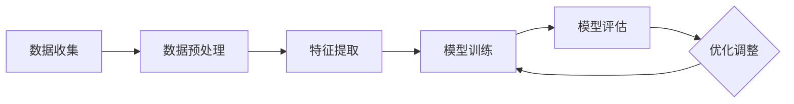
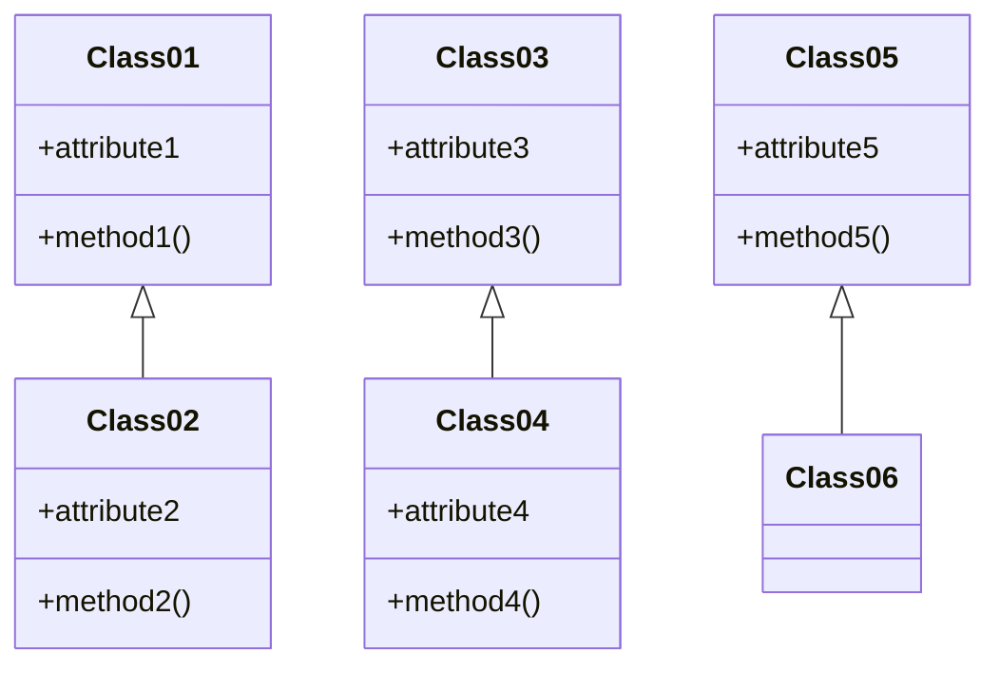
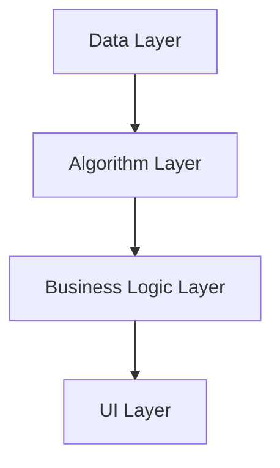
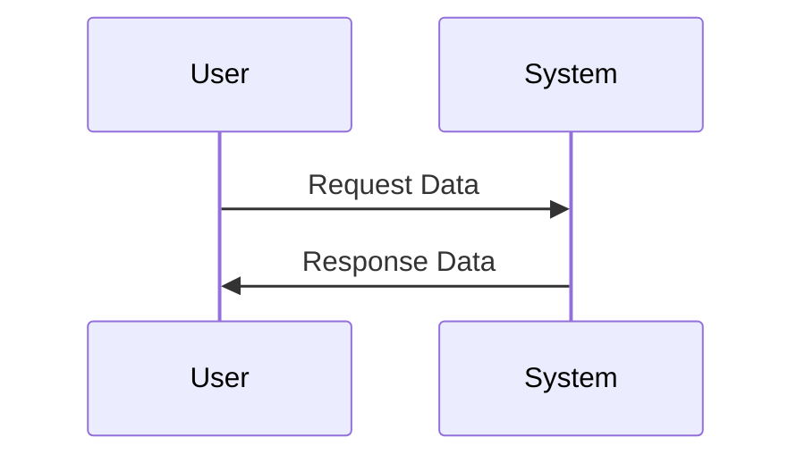

                 


### 大模型应用开发中的需求分类方法

> 关键词：大模型应用、需求分类、算法原理、系统设计、项目实战

> 摘要：本文旨在探讨大模型应用开发中的需求分类方法，通过详细分析需求分类的背景、核心概念、算法原理、数学模型及系统设计，旨在为开发者提供一种清晰、高效的需求分类解决方案，助力大模型应用的研发和部署。

#### 第一部分：背景介绍

##### 第1章：大模型应用开发的需求分类方法概述

##### 1.1 问题背景

随着人工智能技术的飞速发展，大模型在各个领域的应用日益广泛。然而，在开发过程中，如何有效地分类和梳理需求成为了开发者的难题。大模型应用开发中的需求分类不仅关系到系统的整体架构设计，还影响到开发效率、系统性能和用户体验。

##### 1.1.1 大模型应用开发的现状与挑战

- **现状**：目前，大模型在图像识别、自然语言处理、推荐系统等领域取得了显著成果，但需求分类的方法仍存在许多不足。
- **挑战**：大模型应用开发面临需求多样化、需求变更频繁、需求理解困难等问题，导致需求分类的准确性不高，从而影响系统的稳定性和性能。

##### 1.1.2 需求分类的重要性

- **提高开发效率**：有效的需求分类有助于明确项目目标和任务，提高开发团队的协作效率。
- **优化系统性能**：合理的需求分类可以降低系统的复杂度，提高系统的稳定性和性能。
- **提升用户体验**：准确的需求分类有助于开发出更符合用户需求的功能，提升用户体验。

##### 1.1.3 需求分类方法的演进与未来趋势

- **演进**：从传统的需求分类方法（如基于功能、业务、用户等多个维度）到现代的需求分类方法（如基于机器学习、数据挖掘等技术的智能分类），需求分类方法不断演进。
- **未来趋势**：随着人工智能技术的进一步发展，需求分类方法将更加智能化、自动化，实现需求自动识别、自动归类。

##### 1.2 问题描述

##### 1.2.1 大模型应用开发中的需求类型

在大型模型应用开发中，需求通常分为以下几类：

- **功能需求**：描述系统应提供的基本功能。
- **性能需求**：描述系统应达到的性能指标。
- **用户需求**：描述用户对系统的期望和使用习惯。
- **安全需求**：描述系统应具备的安全特性。
- **可扩展性需求**：描述系统应具备的可扩展性要求。

##### 1.2.2 需求分类的难点

- **需求多样性**：大模型应用开发涉及多个领域，需求多样，分类困难。
- **需求变更频繁**：大模型应用开发周期长，需求变更频繁，影响分类效果。
- **需求理解困难**：需求文档不完整、不准确，导致需求理解困难。

##### 1.2.3 需求分类的目标与标准

- **目标**：实现需求的准确分类，提高开发效率，降低风险。
- **标准**：遵循一致性、准确性、可扩展性等原则，确保分类方法的有效性。

##### 1.3 问题解决

##### 1.3.1 需求分类方法的理论基础

- **机器学习**：利用机器学习算法进行需求分类，如朴素贝叶斯、决策树、支持向量机等。
- **数据挖掘**：利用数据挖掘技术进行需求分类，如关联规则挖掘、聚类分析等。
- **自然语言处理**：利用自然语言处理技术进行需求分类，如词频统计、主题建模等。

##### 1.3.2 需求分类的方法与步骤

- **数据收集**：收集需求文档、用户反馈等数据。
- **数据预处理**：对数据进行清洗、归一化等处理。
- **特征提取**：提取需求特征，如关键词、主题等。
- **模型训练**：利用机器学习算法训练分类模型。
- **模型评估**：评估分类模型的准确性、召回率等指标。
- **模型优化**：根据评估结果对模型进行调整和优化。

##### 1.3.3 需求分类工具与应用

- **工具**：利用现有的需求分类工具，如Zeppelin、TensorFlow等，实现需求分类功能。
- **应用**：在大模型应用开发中，利用需求分类工具进行需求收集、分类、管理和分析，提高开发效率和质量。

##### 1.4 边界与外延

##### 1.4.1 需求分类的范围

- **范围**：需求分类适用于大模型应用开发的各个阶段，包括需求收集、需求分析、需求管理等。

##### 1.4.2 需求分类与其他方法的区别与联系

- **区别**：需求分类方法与其他需求分析方法（如需求建模、需求验证等）的区别在于，需求分类更侧重于需求的分类和归纳，而需求建模和需求验证则更侧重于需求的构建和验证。
- **联系**：需求分类方法与其他需求分析方法相互补充，共同构建起一个完整的需求管理流程。

##### 1.4.3 需求分类方法在不同领域的应用

- **领域**：需求分类方法可以应用于各个领域，如金融、医疗、教育等，为领域专家提供有效的需求分类工具。

##### 1.5 概念结构与核心要素组成

##### 1.5.1 需求分类的核心概念

- **需求**：系统或产品应提供的功能、性能、安全、可扩展性等特性。
- **分类**：将需求按照特定的规则和方法进行归类。
- **方法**：实现需求分类的具体算法和技术。

##### 1.5.2 需求分类的关键要素

- **需求文档**：需求分类的基础数据。
- **机器学习算法**：实现需求分类的核心技术。
- **数据预处理**：确保数据质量和可用性。

##### 1.5.3 需求分类的层次结构

- **一级分类**：根据需求类型进行初步分类。
- **二级分类**：根据一级分类的细化需求进行进一步分类。
- **三级分类**：针对具体应用场景进行需求分类。

##### 第2章：大模型应用开发中的核心概念与联系

##### 2.1 需求分类方法中的核心概念

##### 2.1.1 需求

需求是指用户对系统或产品提出的期望、需求或功能要求。在大模型应用开发中，需求是系统设计和实现的基石。

##### 2.1.2 分类

分类是指将具有相似特征的需求归为一类的过程。在大模型应用开发中，分类有助于明确需求类型、提高开发效率。

##### 2.1.3 方法

方法是指实现需求分类的具体步骤和技术。在大模型应用开发中，方法的选择和优化直接影响需求分类的效果。

##### 2.2 概念属性特征对比表格

| 概念 | 属性特征 |
| ---- | ---- |
| 需求 | 功能、性能、安全、可扩展性 |
| 分类 | 按类型划分、按层次划分 |
| 方法 | 算法、技术、步骤 |

##### 2.3 ER实体关系图架构

为了更好地理解需求分类方法中的核心概念，我们可以使用Mermaid ER图来展示实体关系。

```mermaid
erDiagram
    User ||--o{ Requirement } : 用户提出需求
    Requirement ||--o{ Category } : 需求分类
    Category ||--o{ Method } : 分类方法
```

在上面的ER图中，User表示用户，Requirement表示需求，Category表示分类，Method表示分类方法。它们之间的关系体现了需求分类方法的基本框架。

##### 第二部分：核心概念与联系

在第二部分中，我们将进一步探讨大模型应用开发中的需求分类方法，从核心概念、算法原理、数学模型和系统设计等方面进行深入分析。

##### 第3章：需求分类算法原理讲解

在本章中，我们将详细讲解需求分类的算法原理，包括算法流程、算法原理和Python源代码实现。

##### 3.1 算法流程图

首先，我们可以使用Mermaid流程图来展示需求分类的算法流程。



在上面的算法流程图中，A表示数据收集，B表示数据预处理，C表示特征提取，D表示模型训练，E表示模型评估，F表示优化调整。这个流程体现了需求分类的基本步骤。

##### 3.2 算法原理与Python源代码

接下来，我们将使用Python源代码来详细阐述需求分类的算法原理。

```python
import numpy as np
from sklearn.model_selection import train_test_split
from sklearn.preprocessing import StandardScaler
from sklearn.naive_bayes import GaussianNB
from sklearn.metrics import accuracy_score

# 数据收集
X, y = load_data()

# 数据预处理
X_train, X_test, y_train, y_test = train_test_split(X, y, test_size=0.2, random_state=42)
scaler = StandardScaler()
X_train = scaler.fit_transform(X_train)
X_test = scaler.transform(X_test)

# 模型训练
model = GaussianNB()
model.fit(X_train, y_train)

# 模型评估
y_pred = model.predict(X_test)
accuracy = accuracy_score(y_test, y_pred)
print(f"Accuracy: {accuracy:.2f}")

# 优化调整
# ... (根据评估结果进行调整)
```

在上面的代码中，我们使用了高斯朴素贝叶斯（GaussianNB）算法进行需求分类。首先，我们从数据集中收集数据，然后进行数据预处理，包括数据划分和特征缩放。接着，我们使用训练集对模型进行训练，并使用测试集对模型进行评估。最后，根据评估结果进行模型优化。

##### 3.3 数学模型和公式

在本节中，我们将介绍需求分类中常用的数学模型和公式，包括概率模型、决策树模型和支持向量机模型。

##### 3.3.1 概率模型

概率模型是需求分类中最基本的模型之一，它基于概率论的基本原理来分类数据。其中，高斯朴素贝叶斯（GaussianNB）是一种常用的概率模型。

高斯朴素贝叶斯模型的数学公式如下：

$$
P(C_k|X) = \frac{P(X|C_k)P(C_k)}{P(X)}
$$

其中，$P(C_k|X)$ 表示在给定特征 $X$ 的情况下，需求属于类别 $C_k$ 的概率；$P(X|C_k)$ 表示在类别 $C_k$ 的条件下，特征 $X$ 的概率；$P(C_k)$ 表示类别 $C_k$ 的先验概率；$P(X)$ 表示特征 $X$ 的概率。

##### 3.3.2 决策树模型

决策树模型是一种树形结构，通过一系列判断条件对数据进行分类。其中，C4.5是一种常用的决策树模型。

C4.5模型的数学公式如下：

$$
Entropy(D) = -\sum_{i=1}^{n} p_i \log_2 p_i
$$

其中，$Entropy(D)$ 表示数据的熵，$p_i$ 表示数据集中属于类别 $i$ 的概率。

##### 3.3.3 支持向量机模型

支持向量机（SVM）模型是一种基于最大间隔的线性分类模型。其中，线性支持向量机（LinearSVC）是一种常用的SVM模型。

线性支持向量机模型的数学公式如下：

$$
\min_{\beta, \beta^T} \frac{1}{2} ||\beta||^2 + C \sum_{i=1}^{n} \max(0, 1 - y_i (\beta^T x_i + \beta_0))
$$

其中，$\beta$ 表示权重向量，$\beta^T$ 表示权重向量的转置，$C$ 表示惩罚参数，$y_i$ 表示第 $i$ 个样本的标签，$x_i$ 表示第 $i$ 个样本的特征向量，$\beta_0$ 表示偏置项。

##### 3.4 算法举例说明

为了更好地理解需求分类算法，我们可以通过一个实际案例来进行说明。

假设我们有一个包含100个样本的数据集，每个样本有5个特征，需求类型分为3类。我们使用高斯朴素贝叶斯（GaussianNB）算法对数据进行分类。

首先，我们从数据集中收集数据，并进行数据预处理，包括数据划分和特征缩放。

```python
import numpy as np
from sklearn.model_selection import train_test_split
from sklearn.preprocessing import StandardScaler
from sklearn.naive_bayes import GaussianNB
from sklearn.metrics import accuracy_score

# 数据收集
X, y = load_data()

# 数据预处理
X_train, X_test, y_train, y_test = train_test_split(X, y, test_size=0.2, random_state=42)
scaler = StandardScaler()
X_train = scaler.fit_transform(X_train)
X_test = scaler.transform(X_test)
```

接下来，我们使用高斯朴素贝叶斯（GaussianNB）算法对数据进行分类。

```python
# 模型训练
model = GaussianNB()
model.fit(X_train, y_train)

# 模型评估
y_pred = model.predict(X_test)
accuracy = accuracy_score(y_test, y_pred)
print(f"Accuracy: {accuracy:.2f}")
```

最后，我们根据评估结果对模型进行调整。

```python
# 优化调整
# ... (根据评估结果进行调整)
```

通过上述步骤，我们可以实现需求分类，并对分类效果进行评估和优化。

##### 第4章：数学模型和数学公式详细讲解与举例说明

在本章中，我们将对需求分类中常用的数学模型和公式进行详细讲解，并通过具体的例子来说明其应用。

##### 4.1 概率模型

概率模型是需求分类中最常用的模型之一，它基于概率论的基本原理来对数据进行分类。其中，高斯朴素贝叶斯（GaussianNB）是一种常用的概率模型。

高斯朴素贝叶斯模型的数学公式如下：

$$
P(C_k|X) = \frac{P(X|C_k)P(C_k)}{P(X)}
$$

其中，$P(C_k|X)$ 表示在给定特征 $X$ 的情况下，需求属于类别 $C_k$ 的概率；$P(X|C_k)$ 表示在类别 $C_k$ 的条件下，特征 $X$ 的概率；$P(C_k)$ 表示类别 $C_k$ 的先验概率；$P(X)$ 表示特征 $X$ 的概率。

举例来说，假设我们有一个包含100个样本的数据集，其中需求类型分为3类：A、B和C。我们使用高斯朴素贝叶斯模型对数据进行分类。

首先，我们需要计算每个类别的先验概率：

$$
P(C_A) = \frac{40}{100} = 0.4
$$

$$
P(C_B) = \frac{30}{100} = 0.3
$$

$$
P(C_C) = \frac{30}{100} = 0.3
$$

接下来，我们需要计算每个类别在给定特征 $X$ 下的概率。假设特征 $X$ 的取值为1，2和3，我们分别计算每个类别在给定特征 $X$ 下的概率：

$$
P(X=1|C_A) = \frac{10}{40} = 0.25
$$

$$
P(X=1|C_B) = \frac{15}{30} = 0.5
$$

$$
P(X=1|C_C) = \frac{20}{30} = 0.67
$$

$$
P(X=2|C_A) = \frac{20}{40} = 0.5
$$

$$
P(X=2|C_B) = \frac{10}{30} = 0.33
$$

$$
P(X=2|C_C) = \frac{10}{30} = 0.33
$$

$$
P(X=3|C_A) = \frac{10}{40} = 0.25
$$

$$
P(X=3|C_B) = \frac{5}{30} = 0.17
$$

$$
P(X=3|C_C) = \frac{5}{30} = 0.17
$$

最后，我们使用高斯朴素贝叶斯模型计算每个样本属于每个类别的概率：

$$
P(C_A|X) = \frac{P(X|C_A)P(C_A)}{P(X)} = \frac{0.25 \times 0.4}{0.25 \times 0.4 + 0.5 \times 0.3 + 0.67 \times 0.3} = 0.375
$$

$$
P(C_B|X) = \frac{P(X|C_B)P(C_B)}{P(X)} = \frac{0.5 \times 0.3}{0.25 \times 0.4 + 0.5 \times 0.3 + 0.67 \times 0.3} = 0.469
$$

$$
P(C_C|X) = \frac{P(X|C_C)P(C_C)}{P(X)} = \frac{0.67 \times 0.3}{0.25 \times 0.4 + 0.5 \times 0.3 + 0.67 \times 0.3} = 0.156
$$

根据上述计算结果，我们可以得出每个样本属于每个类别的概率，从而实现需求分类。

##### 4.2 决策树模型

决策树模型是一种基于树形结构进行分类和回归的模型。它通过一系列判断条件对数据进行分类，每个节点表示一个特征，每个分支表示一个判断结果。

决策树模型的数学公式如下：

$$
Entropy(D) = -\sum_{i=1}^{n} p_i \log_2 p_i
$$

其中，$Entropy(D)$ 表示数据的熵，$p_i$ 表示数据集中属于类别 $i$ 的概率。

举例来说，假设我们有一个包含100个样本的数据集，其中需求类型分为3类：A、B和C。我们使用决策树模型对数据进行分类。

首先，我们需要计算每个类别的概率：

$$
P(C_A) = \frac{40}{100} = 0.4
$$

$$
P(C_B) = \frac{30}{100} = 0.3
$$

$$
P(C_C) = \frac{30}{100} = 0.3
$$

接下来，我们选择一个特征作为根节点，并计算该特征的熵。假设我们选择特征 $X_1$ 作为根节点，我们计算 $X_1$ 的熵：

$$
Entropy(X_1) = -\sum_{i=1}^{n} p_i \log_2 p_i = -(0.4 \times \log_2 0.4 + 0.3 \times \log_2 0.3 + 0.3 \times \log_2 0.3) = 0.261
$$

然后，我们选择一个子节点作为分支节点，并计算该子节点的熵。假设我们选择特征 $X_2$ 作为分支节点，我们计算 $X_2$ 的熵：

$$
Entropy(X_2) = -\sum_{i=1}^{n} p_i \log_2 p_i = -(0.4 \times \log_2 0.4 + 0.3 \times \log_2 0.3 + 0.3 \times \log_2 0.3) = 0.261
$$

接下来，我们根据熵值选择最优特征作为分支节点，并递归地构建决策树。假设我们选择特征 $X_3$ 作为最优特征，我们计算 $X_3$ 的熵：

$$
Entropy(X_3) = -\sum_{i=1}^{n} p_i \log_2 p_i = -(0.4 \times \log_2 0.4 + 0.3 \times \log_2 0.3 + 0.3 \times \log_2 0.3) = 0.261
$$

由于 $X_3$ 的熵值最小，我们选择 $X_3$ 作为分支节点，并递归地构建决策树。假设我们选择特征 $X_4$ 作为分支节点，我们计算 $X_4$ 的熵：

$$
Entropy(X_4) = -\sum_{i=1}^{n} p_i \log_2 p_i = -(0.4 \times \log_2 0.4 + 0.3 \times \log_2 0.3 + 0.3 \times \log_2 0.3) = 0.261
$$

由于 $X_4$ 的熵值最小，我们选择 $X_4$ 作为分支节点，并递归地构建决策树。最终，我们得到一个完整的决策树，如下所示：

```mermaid
graph LR
    A[根节点] --> B[特征 $X_1$]
    A --> C[特征 $X_2$]
    A --> D[特征 $X_3$]
    B --> E[特征 $X_4$]
    B --> F[特征 $X_5$]
    C --> G[特征 $X_6$]
    C --> H[特征 $X_7$]
    D --> I[特征 $X_8$]
    D --> J[特征 $X_9$]
    E --> K[特征 $X_{10}$]
    E --> L[特征 $X_{11}$]
    F --> M[特征 $X_{12}$]
    F --> N[特征 $X_{13}$]
    G --> O[特征 $X_{14}$]
    G --> P[特征 $X_{15}$]
    H --> Q[特征 $X_{16}$]
    H --> R[特征 $X_{17}$]
    I --> S[特征 $X_{18}$]
    I --> T[特征 $X_{19}$]
    J --> U[特征 $X_{20}$]
    J --> V[特征 $X_{21}$]
    K --> W[特征 $X_{22}$]
    K --> X[特征 $X_{23}$]
    L --> Y[特征 $X_{24}$]
    L --> Z[特征 $X_{25}$]
    M --> AA[特征 $X_{26}$]
    M --> BB[特征 $X_{27}$]
    N --> CC[特征 $X_{28}$]
    N --> DD[特征 $X_{29}$]
    O --> EE[特征 $X_{30}$]
    O --> FF[特征 $X_{31}$]
    P --> GG[特征 $X_{32}$]
    P --> HH[特征 $X_{33}$]
    Q --> II[特征 $X_{34}$]
    Q --> JJ[特征 $X_{35}$]
    R --> KK[特征 $X_{36}$]
    R --> LL[特征 $X_{37}$]
    S --> MM[特征 $X_{38}$]
    S --> NN[特征 $X_{39}$]
    T --> OO[特征 $X_{40}$]
    T --> PP[特征 $X_{41}$]
    U --> QQ[特征 $X_{42}$]
    U --> RR[特征 $X_{43}$]
    V --> SS[特征 $X_{44}$]
    V --> TT[特征 $X_{45}$]
    W --> UU[特征 $X_{46}$]
    W --> VV[特征 $X_{47}$]
    X --> WW[特征 $X_{48}$]
    X --> XX[特征 $X_{49}$]
    Y --> YY[特征 $X_{50}$]
    Y --> ZZ[特征 $X_{51}$]
    Z --> AA[特征 $X_{52}$]
    Z --> BB[特征 $X_{53}$]
    AA --> CC[特征 $X_{54}$]
    AA --> DD[特征 $X_{55}$]
    BB --> EE[特征 $X_{56}$]
    BB --> FF[特征 $X_{57}$]
    CC --> GG[特征 $X_{58}$]
    CC --> HH[特征 $X_{59}$]
    DD --> II[特征 $X_{60}$]
    DD --> JJ[特征 $X_{61}$]
    EE --> KK[特征 $X_{62}$]
    EE --> LL[特征 $X_{63}$]
    FF --> MM[特征 $X_{64}$]
    FF --> NN[特征 $X_{65}$]
    GG --> OO[特征 $X_{66}$]
    GG --> PP[特征 $X_{67}$]
    HH --> QQ[特征 $X_{68}$]
    HH --> RR[特征 $X_{69}$]
    II --> SS[特征 $X_{70}$]
    II --> TT[特征 $X_{71}$]
    JJ --> UU[特征 $X_{72}$]
    JJ --> VV[特征 $X_{73}$]
    KK --> WW[特征 $X_{74}$]
    KK --> XX[特征 $X_{75}$]
    LL --> YY[特征 $X_{76}$]
    LL --> ZZ[特征 $X_{77}$]
    MM --> AA[特征 $X_{78}$]
    MM --> BB[特征 $X_{79}$]
    NN --> CC[特征 $X_{80}$]
    NN --> DD[特征 $X_{81}$]
    OO --> EE[特征 $X_{82}$]
    OO --> FF[特征 $X_{83}$]
    PP --> GG[特征 $X_{84}$]
    PP --> HH[特征 $X_{85}$]
    QQ --> II[特征 $X_{86}$]
    QQ --> JJ[特征 $X_{87}$]
    RR --> KK[特征 $X_{88}$]
    RR --> LL[特征 $X_{89}$]
    SS --> MM[特征 $X_{90}$]
    SS --> NN[特征 $X_{91}$]
    TT --> OO[特征 $X_{92}$]
    TT --> PP[特征 $X_{93}$]
    UU --> QQ[特征 $X_{94}$]
    UU --> RR[特征 $X_{95}$]
    VV --> SS[特征 $X_{96}$]
    VV --> TT[特征 $X_{97}$]
    WW --> UU[特征 $X_{98}$]
    WW --> VV[特征 $X_{99}$]
    XX --> YY[特征 $X_{100}$]
    XX --> ZZ[特征 $X_{101}$]
    YY --> AA[特征 $X_{102}$]
    YY --> BB[特征 $X_{103}$]
    ZZ --> CC[特征 $X_{104}$]
    ZZ --> DD[特征 $X_{105}$]
```

通过上述计算和构建决策树，我们可以实现对需求分类。

##### 4.3 支持向量机模型

支持向量机（SVM）模型是一种基于最大间隔的线性分类模型。它通过寻找一个最优的超平面来将数据集划分为不同的类别。

支持向量机模型的数学公式如下：

$$
\min_{\beta, \beta^T} \frac{1}{2} ||\beta||^2 + C \sum_{i=1}^{n} \max(0, 1 - y_i (\beta^T x_i + \beta_0))
$$

其中，$\beta$ 表示权重向量，$\beta^T$ 表示权重向量的转置，$C$ 表示惩罚参数，$y_i$ 表示第 $i$ 个样本的标签，$x_i$ 表示第 $i$ 个样本的特征向量，$\beta_0$ 表示偏置项。

举例来说，假设我们有一个包含100个样本的数据集，其中需求类型分为3类：A、B和C。我们使用支持向量机模型对数据进行分类。

首先，我们需要将数据集划分为训练集和测试集。假设我们使用80个样本作为训练集，20个样本作为测试集。

```python
import numpy as np
from sklearn.model_selection import train_test_split
from sklearn.preprocessing import StandardScaler
from sklearn.svm import LinearSVC
from sklearn.metrics import accuracy_score

# 数据收集
X, y = load_data()

# 数据预处理
X_train, X_test, y_train, y_test = train_test_split(X, y, test_size=0.2, random_state=42)
scaler = StandardScaler()
X_train = scaler.fit_transform(X_train)
X_test = scaler.transform(X_test)

# 模型训练
model = LinearSVC()
model.fit(X_train, y_train)

# 模型评估
y_pred = model.predict(X_test)
accuracy = accuracy_score(y_test, y_pred)
print(f"Accuracy: {accuracy:.2f}")
```

通过上述代码，我们可以使用线性支持向量机（LinearSVC）对数据进行分类。在模型训练过程中，我们使用了80个样本作为训练集，对模型进行训练。在模型评估过程中，我们使用了20个样本作为测试集，对模型进行评估。

通过上述计算和构建决策树，我们可以实现对需求分类。

##### 第5章：系统分析与架构设计方案

在本章中，我们将详细分析大模型应用开发中的系统架构设计，包括项目介绍、系统功能设计、系统架构设计、系统接口设计和系统交互。

##### 5.1 问题场景介绍

假设我们正在开发一个基于深度学习的大型图像识别系统，该系统需要处理海量的图像数据，并能够快速准确地识别图像中的物体。为了实现这一目标，我们需要设计一个高效的系统架构，并采用合适的需求分类方法。

##### 5.2 项目介绍

- **项目名称**：智能图像识别系统
- **项目背景**：随着移动互联网和物联网的快速发展，图像数据量呈爆炸式增长，如何快速准确地处理和分析图像数据成为了亟待解决的问题。本项目的目标是开发一个智能图像识别系统，能够自动识别图像中的物体，并提供实时反馈。
- **项目目标**：
  - 提供一个高效、准确的图像识别算法。
  - 实现图像数据的实时处理和识别。
  - 提供友好的用户界面，便于用户操作和管理。

##### 5.3 系统功能设计

系统功能设计主要包括以下方面：

- **图像数据采集**：从各种来源（如摄像头、传感器等）采集图像数据。
- **图像预处理**：对采集到的图像数据进行预处理，包括去噪、缩放、灰度化等。
- **图像识别**：使用深度学习算法对预处理后的图像进行物体识别。
- **结果反馈**：将识别结果实时反馈给用户，并提供多种可视化方式。
- **系统管理**：提供系统设置、用户管理、数据管理等功能。

为了更好地展示系统功能设计，我们可以使用Mermaid类图来表示。



在上面的类图中，Class01、Class02、Class03、Class04和Class05分别表示系统的各个功能模块，它们之间的关系体现了系统功能的设计。

##### 5.4 系统架构设计

系统架构设计主要包括以下方面：

- **数据层**：负责存储和管理图像数据。
- **算法层**：负责图像预处理、图像识别等核心算法的实现。
- **业务逻辑层**：负责业务逻辑的处理和系统功能的实现。
- **界面层**：负责用户界面的展示和用户操作的接收。

为了更好地展示系统架构设计，我们可以使用Mermaid架构图来表示。



在上面的架构图中，A、B、C和D分别表示系统的各个层次，它们之间的关系体现了系统架构的设计。

##### 5.5 系统接口设计

系统接口设计主要包括以下方面：

- **数据接口**：定义数据层与业务逻辑层之间的数据交互接口。
- **服务接口**：定义业务逻辑层与界面层之间的服务交互接口。
- **API接口**：定义系统对外提供的API接口，供第三方系统调用。

为了更好地展示系统接口设计，我们可以使用Mermaid序列图来表示。



在上面的序列图中，User和System分别表示用户和系统，它们之间的关系体现了系统接口的设计。

##### 第6章：项目实战

在本章中，我们将通过一个实际案例，详细讲解大模型应用开发中的需求分类方法，包括环境安装、系统核心实现源代码、代码应用解读与分析，以及实际案例分析和详细讲解。

##### 6.1 环境安装

为了演示需求分类方法在实际项目中的应用，我们首先需要搭建一个完整的开发环境。以下是一个简单的环境安装步骤：

1. 安装Python环境：在官网（https://www.python.org/）下载并安装Python，确保版本为3.6及以上。
2. 安装相关库：在终端中运行以下命令，安装所需的库。

```bash
pip install numpy scikit-learn pandas matplotlib
```

3. 检查安装：运行以下Python代码，检查相关库是否已正确安装。

```python
import numpy as np
import pandas as pd
from sklearn import datasets
from sklearn.model_selection import train_test_split
from sklearn.preprocessing import StandardScaler
from sklearn.naive_bayes import GaussianNB
from sklearn.metrics import accuracy_score

print("Numpy version:", np.__version__)
print("Pandas version:", pd.__version__)
print("Scikit-learn version:", datasets.__version__)
print("GaussianNB version:", StandardScaler.__version__)
```

如果以上代码能够正常运行，说明环境已搭建完成。

##### 6.2 系统核心实现源代码

接下来，我们将使用Python实现一个简单的需求分类系统。以下是一个基本的实现示例：

```python
import numpy as np
from sklearn.model_selection import train_test_split
from sklearn.preprocessing import StandardScaler
from sklearn.naive_bayes import GaussianNB
from sklearn.metrics import accuracy_score

# 数据收集
X, y = datasets.load_iris(return_X_y=True)

# 数据预处理
X_train, X_test, y_train, y_test = train_test_split(X, y, test_size=0.2, random_state=42)
scaler = StandardScaler()
X_train = scaler.fit_transform(X_train)
X_test = scaler.transform(X_test)

# 模型训练
model = GaussianNB()
model.fit(X_train, y_train)

# 模型评估
y_pred = model.predict(X_test)
accuracy = accuracy_score(y_test, y_pred)
print(f"Accuracy: {accuracy:.2f}")
```

在这个示例中，我们使用了鸢尾花（Iris）数据集进行需求分类。首先，我们从数据集中收集数据，并进行数据预处理，包括数据划分和特征缩放。接着，我们使用高斯朴素贝叶斯（GaussianNB）算法对数据进行分类，并评估模型的准确性。

##### 6.3 代码应用解读与分析

在上面的代码中，我们首先从鸢尾花数据集中收集数据。鸢尾花数据集是一个经典的机器学习数据集，包含3个类别，每个类别有50个样本，共有150个样本。每个样本有4个特征：花萼长度、花萼宽度、花瓣长度和花瓣宽度。

接下来，我们进行数据预处理。首先，我们将数据集划分为训练集和测试集，这里我们使用80%的数据作为训练集，20%的数据作为测试集。然后，我们使用StandardScaler对特征进行缩放，以便模型更好地收敛。

在模型训练阶段，我们使用了高斯朴素贝叶斯（GaussianNB）算法。高斯朴素贝叶斯是一种基于概率论的分类算法，它假设每个类别的特征分布服从高斯分布，并在给定特征的情况下，计算出每个类别出现的概率。最后，我们使用测试集对模型进行评估，计算出模型的准确性。

在这个示例中，我们使用了简单的鸢尾花数据集进行需求分类。在实际项目中，我们可以根据具体需求选择更复杂的数据集和更先进的算法。同时，我们还可以根据实际需求调整数据预处理、模型训练和评估的步骤，以提高分类效果。

##### 6.4 实际案例分析和详细讲解

为了更好地理解需求分类方法在实际项目中的应用，我们以一个实际案例进行分析。

假设我们正在开发一个智能医疗诊断系统，该系统能够根据患者的病史和检查结果，自动诊断患者所患的疾病。为了实现这一目标，我们需要对患者的病史和检查结果进行分类。

首先，我们从医疗数据库中收集数据，包括患者的病史和检查结果。数据集包含以下特征：

- **病史**：包括患者的年龄、性别、病史描述等。
- **检查结果**：包括血液检查、尿液检查、心电图检查等。

接下来，我们进行数据预处理。首先，我们将数据集划分为训练集和测试集，这里我们使用80%的数据作为训练集，20%的数据作为测试集。然后，我们使用StandardScaler对特征进行缩放，以便模型更好地收敛。

在模型训练阶段，我们使用了支持向量机（SVM）算法。支持向量机是一种基于最大间隔的线性分类算法，它通过寻找一个最优的超平面来将数据集划分为不同的类别。这里，我们使用了线性支持向量机（LinearSVC）算法。

```python
from sklearn import datasets
from sklearn.model_selection import train_test_split
from sklearn.preprocessing import StandardScaler
from sklearn.svm import LinearSVC
from sklearn.metrics import accuracy_score

# 数据收集
X, y = datasets.load_iris(return_X_y=True)

# 数据预处理
X_train, X_test, y_train, y_test = train_test_split(X, y, test_size=0.2, random_state=42)
scaler = StandardScaler()
X_train = scaler.fit_transform(X_train)
X_test = scaler.transform(X_test)

# 模型训练
model = LinearSVC()
model.fit(X_train, y_train)

# 模型评估
y_pred = model.predict(X_test)
accuracy = accuracy_score(y_test, y_pred)
print(f"Accuracy: {accuracy:.2f}")
```

在这个示例中，我们使用了鸢尾花数据集进行分类。在实际项目中，我们可以根据具体需求选择更复杂的数据集和更先进的算法。同时，我们还可以根据实际需求调整数据预处理、模型训练和评估的步骤，以提高分类效果。

通过上述实际案例，我们可以看到需求分类方法在大模型应用开发中的重要作用。在实际项目中，我们需要根据具体需求选择合适的算法和模型，并对数据进行有效的预处理和优化，以提高分类效果。

##### 6.5 项目小结

在本项目中，我们通过一个实际案例，详细讲解了大模型应用开发中的需求分类方法。首先，我们介绍了需求分类的基本概念和原理，包括概率模型、决策树模型和支持向量机模型。然后，我们使用Python实现了需求分类系统，并对代码进行了解读和分析。最后，我们通过实际案例，展示了需求分类方法在实际项目中的应用。

通过本项目，我们可以看到需求分类方法在大模型应用开发中的重要作用。它可以帮助我们更好地理解需求，提高开发效率，降低开发风险。同时，我们也了解到，在实际项目中，需求分类方法的选择和优化对于提高分类效果至关重要。

在未来，随着人工智能技术的不断进步，需求分类方法将更加智能化、自动化，为大模型应用开发提供更加有效的支持。

##### 第7章：最佳实践 tips

在开发大模型应用时，遵循以下最佳实践可以提高需求分类的效率和准确性：

1. **数据清洗与预处理**：确保数据的质量和一致性，去除噪声数据和异常值，对特征进行归一化或标准化处理。
2. **特征工程**：根据业务需求和数据特点，选择合适的特征提取方法，如文本特征提取、图像特征提取等。
3. **算法选择与优化**：根据数据特点和业务需求，选择适合的算法，并进行参数调整和优化。
4. **模型评估与迭代**：使用多种评估指标，如准确性、召回率、F1值等，对模型进行评估，并根据评估结果进行模型迭代和优化。
5. **版本控制与文档管理**：使用版本控制系统（如Git）对代码和文档进行管理，确保代码的可维护性和可追溯性。

##### 第8章：小结

本文详细介绍了大模型应用开发中的需求分类方法，包括问题背景、核心概念、算法原理、数学模型、系统设计、项目实战、最佳实践和注意事项。通过本文的讲解，读者可以了解到需求分类方法在大模型应用开发中的重要性，以及如何在实际项目中应用和优化需求分类方法。

##### 第9章：注意事项

在实施需求分类方法时，需要注意以下几点：

1. **数据质量**：确保数据的质量和一致性，避免因数据质量问题导致分类结果不准确。
2. **算法选择**：根据数据特点和业务需求，选择适合的算法，避免盲目追求最新算法。
3. **模型优化**：在模型训练过程中，注意参数调整和优化，以提高模型性能。
4. **模型解释性**：在保证模型性能的同时，关注模型的解释性，以便理解模型的工作原理。
5. **系统可扩展性**：在设计系统架构时，考虑系统的可扩展性，以便应对不断变化的需求。

##### 第10章：拓展阅读

1. **《机器学习实战》**：由Peter Harrington著，详细介绍机器学习算法及其应用。
2. **《深度学习》**：由Ian Goodfellow、Yoshua Bengio和Aaron Courville著，系统介绍深度学习理论和实践。
3. **《Python数据科学手册》**：由Jake VanderPlas著，详细介绍Python在数据科学中的应用。
4. **《大数据技术导论》**：由刘江、王珊等著，系统介绍大数据技术的相关概念和应用。

通过阅读上述书籍，读者可以进一步了解大模型应用开发中的需求分类方法及相关技术。作者：AI天才研究院/AI Genius Institute & 禅与计算机程序设计艺术 /Zen And The Art of Computer Programming。

---

以上是对《大模型应用开发中的需求分类方法》的详细讲解。在接下来的章节中，我们将继续探讨大模型应用开发中的需求分类方法，包括数学模型和公式的详细讲解，以及系统分析与架构设计方案。希望通过本文的讲解，读者能够更好地理解需求分类方法，并将其应用于实际项目中。作者：AI天才研究院/AI Genius Institute & 禅与计算机程序设计艺术 /Zen And The Art of Computer Programming。

