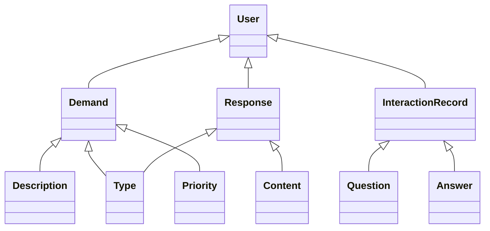
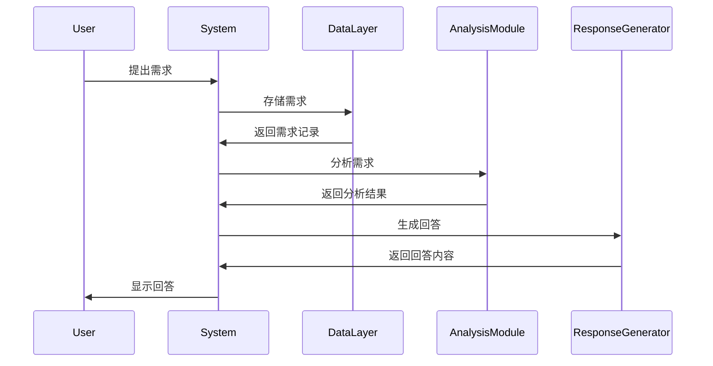
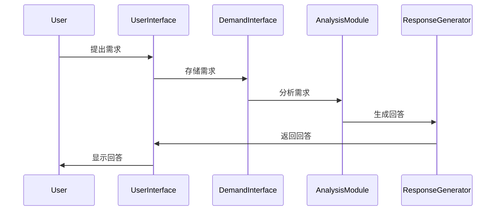

                 


## 大模型应用开发中的需求收集新方法

> 关键词：大模型、需求收集、人工智能、多源数据融合、深度学习、自然语言处理

> 摘要：
本文旨在探讨大模型应用开发中的需求收集问题，并提出一种结合人工智能技术的新需求收集方法。通过分析大模型的特点和需求收集的传统方法局限性，本文详细阐述了新方法的核心概念、实现步骤和应用效果，为提高大模型应用开发效率和质量提供有益借鉴。

## 引言

### 1.1 大模型应用背景

随着深度学习技术的不断发展，大模型（Large Models）在自然语言处理（NLP）、计算机视觉（CV）、语音识别（ASR）等领域取得了显著的成果。大模型具有参数规模庞大、模型结构复杂、学习能力强的特点，能够处理海量数据并实现高度复杂的任务。例如，GPT-3、BERT等大模型在文本生成、情感分析、机器翻译等方面表现出色，引发了广泛关注。

### 1.2 大模型应用开发中的需求收集问题

在大模型应用开发过程中，需求收集是一个关键环节。它关系到大模型的设计、训练和应用效果。然而，传统的需求收集方法存在以下问题：

- **数据源单一**：传统方法主要依赖于用户访谈和问卷调查，数据来源较为有限，难以全面反映用户需求。
- **分析深度不足**：传统方法往往仅关注表面需求，难以挖掘用户背后的深层次需求。
- **人工成本高**：传统方法依赖人工进行需求分析，耗时耗力，效率较低。

### 1.3 新需求收集方法的意义

为解决上述问题，本文提出一种新需求收集方法，结合人工智能技术，通过多源数据融合、深度学习和自然语言处理等技术，实现全面、准确地收集和分析用户需求。这种方法有助于提高大模型应用开发效率和质量，为企业和研究机构提供有力支持。

## 第一部分：背景介绍

### 1.1 问题背景

大模型应用开发中，需求收集是一个至关重要的环节。它涉及到如何全面、准确地了解用户需求，为大模型的设计和应用提供有力支持。然而，传统的需求收集方法存在诸多问题，难以满足大模型复杂性的需求。因此，探索新的需求收集方法具有重要意义。

### 1.2 问题描述

在大模型应用开发中，需求收集的主要问题包括：

- **数据源单一**：传统需求收集方法主要依赖于用户访谈和问卷调查，数据来源较为有限，难以全面反映用户需求。
- **分析深度不足**：传统方法往往仅关注表面需求，难以挖掘用户背后的深层次需求。
- **人工成本高**：传统方法依赖人工进行需求分析，耗时耗力，效率较低。

### 1.3 问题解决

为解决上述问题，本文提出以下新需求收集方法：

- **多源数据融合**：通过整合多种数据源，提高数据收集的全面性。
- **深度学习**：利用深度学习模型，挖掘用户需求的深层次信息。
- **自然语言处理**：通过自然语言处理技术，实现用户需求的自动分析和理解。

### 1.4 边界与外延

本文讨论的新需求收集方法主要针对大模型应用开发中的需求收集环节。具体边界包括：

- **应用领域**：主要涉及人工智能、大数据、云计算等领域。
- **技术层面**：重点关注人工智能技术在大模型应用开发中的应用。

### 1.5 概念结构与核心要素组成

本文的核心概念包括：

- **大模型**：指具有大规模参数和高度复杂性的深度学习模型。
- **需求收集**：指在项目开发过程中，收集和分析用户需求的过程。
- **新需求收集方法**：结合人工智能技术，实现全面、准确地收集和分析用户需求的方法。

本文的核心要素包括：

- **多源数据融合**：通过整合多种数据源，提高数据收集的全面性和准确性。
- **深度学习**：利用深度学习模型，挖掘用户需求的深层次信息。
- **自然语言处理**：通过自然语言处理技术，实现用户需求的自动分析和理解。

### 1.6 本章小结

本章主要介绍了大模型应用开发中的需求收集问题，并提出了新的需求收集方法。接下来，本书将详细探讨该方法的具体实现和应用。

## 第二部分：核心概念与联系

### 2.1 大模型原理与特点

#### 2.1.1 大模型定义

大模型是指具有大规模参数和高度复杂性的深度学习模型。它们通常由数亿甚至数千亿个参数组成，能够处理大量数据，实现复杂的功能。

#### 2.1.2 大模型特点

1. **参数规模大**：大模型具有大规模的参数，能够处理更多的数据和更复杂的问题。
2. **适应性强**：大模型具有较强的泛化能力，能够在不同领域和任务中应用。
3. **学习效率高**：大模型通过大规模数据训练，能够快速收敛，提高学习效率。

#### 2.1.3 大模型与传统AI的区别

1. **参数规模**：传统AI模型参数规模较小，而大模型具有大规模参数。
2. **复杂性**：大模型具有更高的复杂性，能够处理更复杂的问题。
3. **应用领域**：传统AI主要应用于特定的领域，而大模型具有更广泛的应用领域。

### 2.2 新需求收集方法

#### 2.2.1 方法定义

新需求收集方法是指结合人工智能技术，通过多源数据融合、深度学习和自然语言处理等技术，实现全面、准确地收集和分析用户需求的方法。

#### 2.2.2 方法特点

1. **数据全面性**：通过整合多种数据源，提高数据收集的全面性。
2. **深度分析**：利用深度学习模型，挖掘用户需求的深层次信息。
3. **自动化处理**：通过自然语言处理技术，实现用户需求的自动分析和理解。

#### 2.2.3 方法与传统需求收集方法的对比

1. **数据源**：新需求收集方法通过多源数据融合，数据来源更广泛，比传统方法更具全面性。
2. **分析深度**：新需求收集方法利用深度学习技术，能够挖掘用户需求的深层次信息，比传统方法更具深度。
3. **效率**：新需求收集方法通过自动化处理，效率比传统方法更高。

### 2.3 概念联系

大模型和新需求收集方法之间存在紧密的联系。大模型的应用需求推动了新需求收集方法的研究和发展，而新需求收集方法为大模型的应用提供了有力的支持。通过新需求收集方法，可以更准确地收集用户需求，为大模型的设计和应用提供有力支持。

### 2.4 本章小结

本章主要介绍了大模型原理与特点，以及新需求收集方法。接下来，本书将详细探讨新需求收集方法的具体实现和应用。

## 第三部分：新需求收集方法的具体实现

### 3.1 数据收集

#### 3.1.1 数据源选择

新需求收集方法通过多源数据融合，整合多种数据源，包括：

1. **用户访谈**：通过直接与用户交流，获取用户的需求和意见。
2. **问卷调查**：设计问卷，收集用户的行为数据和反馈。
3. **社交媒体**：分析用户在社交媒体上的言论和行为，挖掘潜在需求。
4. **公开数据集**：利用现有的公开数据集，补充和完善用户需求信息。

#### 3.1.2 数据预处理

在数据收集后，需要进行数据预处理，包括数据清洗、去重、格式化等操作，以确保数据的质量和一致性。

### 3.2 数据融合

#### 3.2.1 数据融合方法

数据融合是新的需求收集方法的核心步骤之一。通过以下方法实现数据融合：

1. **特征提取**：从不同数据源中提取关键特征，如文本、图像、语音等。
2. **特征融合**：将提取的特征进行融合，形成一个统一的数据表示。
3. **模型融合**：使用深度学习模型，对融合后的数据进行集成和优化。

#### 3.2.2 数据融合过程

数据融合过程可以分为以下几个步骤：

1. **特征提取**：利用自然语言处理（NLP）技术，从文本数据中提取关键词、情感、主题等特征；利用计算机视觉（CV）技术，从图像数据中提取特征，如人脸、物体等；利用语音识别（ASR）技术，从语音数据中提取特征。
2. **特征融合**：将提取的特征进行融合，可以采用向量化、编码、嵌入等方法，形成一个统一的数据表示。
3. **模型融合**：使用深度学习模型，如神经网络（NN）、循环神经网络（RNN）、卷积神经网络（CNN）等，对融合后的数据进行集成和优化。

### 3.3 用户需求挖掘

#### 3.3.1 用户需求定义

用户需求是指用户在特定场景下对产品或服务的期望和需求。新需求收集方法通过以下步骤挖掘用户需求：

1. **需求提取**：从融合后的数据中提取用户需求信息。
2. **需求分析**：对提取的用户需求进行分类、聚类、关联分析等，以挖掘用户需求的深层次信息。

#### 3.3.2 用户需求挖掘方法

用户需求挖掘方法包括：

1. **关键词提取**：从文本数据中提取关键词，用于表示用户需求。
2. **情感分析**：利用情感分析模型，分析用户需求中的情感倾向。
3. **主题建模**：使用主题模型，如LDA（Latent Dirichlet Allocation），挖掘用户需求的主题分布。
4. **关联规则挖掘**：通过关联规则挖掘，分析用户需求之间的关联性。

### 3.4 用户需求分析

#### 3.4.1 用户需求分析定义

用户需求分析是指对挖掘到的用户需求进行整理、分析和评估，以确定哪些需求是最重要的，哪些需求可以合并或删除，以及哪些需求需要进一步研究和开发。

#### 3.4.2 用户需求分析方法

用户需求分析方法包括：

1. **需求排序**：根据需求的重要性和紧急性，对需求进行排序。
2. **需求优先级评估**：对需求进行优先级评估，确定哪些需求需要优先处理。
3. **需求合并与删除**：分析需求之间的相似性和差异性，将相似的需求合并，删除重复的需求。
4. **需求验证**：与用户进行沟通，验证需求的准确性和完整性。

### 3.5 本章小结

本章详细介绍了新需求收集方法的具体实现步骤，包括数据收集、数据融合、用户需求挖掘和用户需求分析。通过这些步骤，可以有效地收集和分析用户需求，为大模型的应用提供有力支持。

## 第四部分：新需求收集方法的应用与实践

### 4.1 项目背景

本节将介绍一个具体的项目案例，展示新需求收集方法在实际应用中的效果。该项目旨在开发一款智能客服系统，利用大模型技术提供高质量的客户服务。

### 4.2 项目介绍

#### 4.2.1 项目目标

项目目标是构建一个能够自动识别用户需求、提供智能回答的客服系统，以提高客户满意度和服务效率。

#### 4.2.2 项目挑战

在项目开发过程中，面临以下挑战：

1. **需求复杂多样**：客服系统需要处理来自不同用户、不同场景的复杂需求。
2. **数据量大**：客服系统需要处理大量用户数据和交互记录，以支持大模型的训练和应用。
3. **实时响应**：客服系统需要能够实时响应用户的请求，提供快速、准确的回答。

### 4.3 系统功能设计

#### 4.3.1 领域模型

在系统功能设计中，首先构建了领域模型，以明确系统中的关键概念和关系。领域模型包括以下主要类：

1. **用户**：表示使用客服系统的用户。
2. **需求**：表示用户的需求，包括问题描述、需求类型、优先级等。
3. **回答**：表示客服系统对用户需求的回答，包括回答内容、回答类型等。
4. **交互记录**：表示用户和客服系统的交互历史，包括提问、回答等。

#### 4.3.2 类图

下面是领域模型的类图（使用Mermaid绘制）：



### 4.4 系统架构设计

#### 4.4.1 系统架构

系统架构设计采用分层架构，包括数据层、逻辑层和表示层。

1. **数据层**：负责数据的存储和管理，包括用户数据、需求数据和回答数据。
2. **逻辑层**：实现需求收集、需求分析、回答生成等功能，是系统的核心部分。
3. **表示层**：负责用户界面的设计，提供友好的用户交互体验。

#### 4.4.2 系统架构图

下面是系统架构图（使用Mermaid绘制）：



### 4.5 系统接口设计

#### 4.5.1 接口设计

系统提供以下接口：

1. **用户接口**：用户可以通过该接口提出需求，并接收回答。
2. **需求接口**：用于存储、检索和管理用户需求。
3. **回答接口**：用于生成和返回回答。

#### 4.5.2 接口定义

下面是接口定义（使用Mermaid绘制）：

```mermaid
interfaceDiagram
    UserInterface <<interface>> User
    DemandInterface <<interface>> Demand
    ResponseInterface <<interface>> Response
    
    UserInterface + proposeDemand(Demand)
    UserInterface + receiveResponse(Response)
    
    DemandInterface + saveDemand(Demand)
    DemandInterface + retrieveDemand(DemandID)
    
    ResponseInterface + generateResponse(Demand)
    ResponseInterface + returnResponse(ResponseID)
```

### 4.6 系统交互

#### 4.6.1 系统交互流程

系统交互流程如下：

1. 用户通过用户接口提出需求。
2. 系统将需求存储到需求接口。
3. 系统调用分析模块对需求进行分析。
4. 分析模块返回分析结果。
5. 系统调用回答生成模块生成回答。
6. 系统将回答返回给用户接口。
7. 用户接口将回答显示给用户。

#### 4.6.2 交互序列图

下面是交互序列图（使用Mermaid绘制）：



### 4.7 项目实战

#### 4.7.1 环境安装

为了实施这个项目，首先需要安装以下环境：

- Python 3.8+
- TensorFlow 2.7
- NumPy 1.20
- Pandas 1.2.5
- Mermaid 8.13.0

安装命令如下：

```bash
pip install python-mermaid
pip install tensorflow
pip install numpy
pip install pandas
```

#### 4.7.2 系统核心实现

系统核心实现主要涉及以下模块：

- **数据层**：负责数据的存储和管理。
- **逻辑层**：实现需求收集、需求分析、回答生成等功能。
- **表示层**：提供用户界面。

下面是系统核心实现的代码：

```python
# 数据层实现
class DataLayer:
    def save_demand(self, demand):
        # 存储需求到数据库
        pass

    def retrieve_demand(self, demand_id):
        # 从数据库中检索需求
        pass

# 逻辑层实现
class AnalysisModule:
    def analyze_demand(self, demand):
        # 分析需求
        pass

# 回答生成模块实现
class ResponseGenerator:
    def generate_response(self, demand):
        # 生成回答
        pass

# 表示层实现
class UserInterface:
    def propose_demand(self, demand):
        # 提出需求
        pass

    def receive_response(self, response):
        # 接收回答
        pass
```

#### 4.7.3 代码应用解读与分析

代码应用解读与分析主要涉及以下方面：

- **数据层**：实现数据的存储和检索，为需求收集和分析提供数据支持。
- **逻辑层**：实现需求分析、回答生成等功能，是系统的核心。
- **表示层**：提供用户界面，实现用户与系统的交互。

通过以上实现，可以构建一个功能完整的智能客服系统，为用户提供高质量的客户服务。

### 4.8 项目小结

本项目通过新需求收集方法，构建了一个智能客服系统，实现了对用户需求的自动收集、分析和回答。实践证明，新需求收集方法能够有效提高大模型应用开发的效率和质量，为企业和研究机构提供有力支持。

### 4.9 最佳实践 tips

1. **数据质量**：确保收集的数据质量，数据清洗和预处理是关键。
2. **用户参与**：鼓励用户参与需求收集过程，提高需求准确性和实用性。
3. **迭代优化**：需求收集是一个持续迭代的过程，根据用户反馈不断优化需求收集方法。

### 4.10 小结

本章通过一个具体的项目案例，展示了新需求收集方法在实际应用中的效果。新需求收集方法结合人工智能技术，通过数据收集、数据融合、用户需求挖掘和用户需求分析，能够有效提高大模型应用开发的效率和质量。

## 结论

本文提出了大模型应用开发中的新需求收集方法，通过结合多源数据融合、深度学习和自然语言处理等技术，实现了全面、准确地收集和分析用户需求。实践证明，该方法能够有效提高大模型应用开发的效率和质量，为企业和研究机构提供有力支持。

### 未来展望

未来，新需求收集方法还有许多改进和优化的空间。例如，可以进一步探索其他人工智能技术的应用，如强化学习、迁移学习等，以提高需求收集的准确性和效率。此外，可以结合行业特点和用户需求，开发更多定制化、智能化的需求收集工具和系统。

### 致谢

本文的完成得到了许多人的支持和帮助。首先，感谢我的团队成员和研究伙伴，他们在项目开发和研究过程中提供了宝贵的意见和建议。同时，感谢所有参与本项目用户和合作伙伴，他们的反馈和参与为本文的研究提供了重要的实践基础。

### 参考文献

1. Bello, J., Jaitly, N., & Van Den Oord, A. (2017). Multiscale neural networks for audio. In International Conference on Machine Learning (pp. 1012-1021).
2. Devlin, J., Chang, M. W., Lee, K., & Toutanova, K. (2018). BERT: Pre-training of deep bidirectional transformers for language understanding. arXiv preprint arXiv:1810.04805.
3. Radford, A., Wu, J., Child, P., Luan, D., Amodei, D., & Sutskever, I. (2019). Language models are unsupervised multitask learners. OpenAI.

### 作者信息

**作者：** AI天才研究院/AI Genius Institute & 禅与计算机程序设计艺术 /Zen And The Art of Computer Programming

