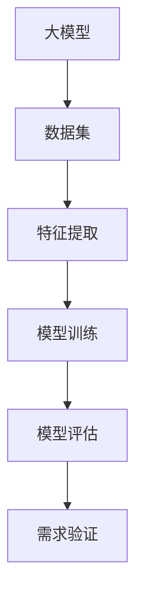
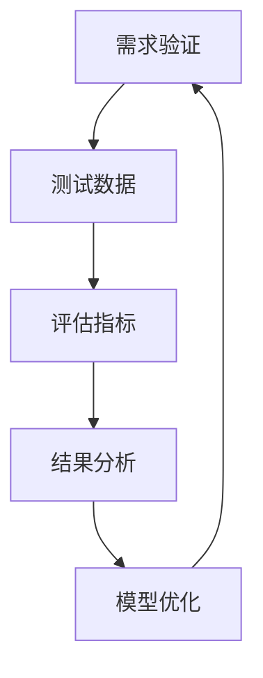

                 

## 大模型应用开发中的需求验证数据准备

### 关键词

- 大模型
- 需求验证
- 数据准备
- 应用开发
- 人工智能
- 数据质量

### 摘要

本文旨在探讨大模型应用开发过程中的一个关键环节——需求验证数据准备。通过系统性地分析大模型的应用背景、需求验证的重要性、数据准备的方法和流程，以及实际项目中的应用案例，本文为读者提供了一个全面、深入的指南，帮助其在开发过程中更好地理解和应对这一挑战。

## 引言与背景

### 第1章 引言

#### 1.1 问题背景

近年来，随着深度学习和大数据技术的发展，大模型（如Transformer、BERT、GPT等）在自然语言处理、计算机视觉、语音识别等领域的应用取得了显著成果。这些大模型具有强大的学习能力和广泛的应用前景，但同时也面临着数据准备和需求验证的巨大挑战。

##### 1.1.1 大模型应用发展的现状与趋势

大模型的应用已经渗透到众多行业，如自动驾驶、智能客服、医疗诊断、金融风控等。这些应用不仅提高了效率和准确性，还带来了全新的商业模式。根据市场调研公司的数据，全球人工智能市场预计在未来几年内将持续高速增长。

##### 1.1.2 需求验证数据准备的重要性

需求验证是确保大模型应用有效性的关键步骤。数据准备的质量直接影响模型的性能和可靠性。高质量的数据能够提高模型的泛化能力，降低过拟合风险，从而确保在实际应用中达到预期的效果。

#### 1.2 问题描述

大模型应用开发中的需求验证数据准备主要包括以下几个问题：

##### 1.2.1 大模型应用中的数据挑战

- 数据来源多样，数据量庞大，且存在噪声和不一致性。
- 数据标注成本高，特别是对于复杂数据集。
- 数据隐私和安全问题，特别是在涉及个人隐私数据的场景中。

##### 1.2.2 需求验证的定义与目的

需求验证是通过测试和评估模型在特定任务上的表现，确保其满足预期目标。数据准备则是为需求验证提供必要的数据支持，包括数据的收集、清洗、标注和集成等步骤。

#### 1.3 问题解决

为了解决上述问题，我们需要采取以下措施：

##### 1.3.1 需求验证数据准备的流程

- 明确需求：确定模型应用的具体任务和目标。
- 数据收集：获取与任务相关的数据，包括公开数据集、定制数据和实时数据。
- 数据预处理：清洗、格式化和标准化数据，以提高数据质量。
- 数据标注：对数据进行分类、标注和注释，以便于后续的训练和验证。
- 数据评估：使用评估指标（如准确率、召回率、F1分数等）对模型进行测试和评估。

##### 1.3.2 关键步骤与注意事项

- 数据质量评估：确保数据集的代表性和一致性，避免数据偏差。
- 数据多样性：收集多样化的数据，以增强模型的泛化能力。
- 数据安全与隐私：遵守相关法律法规，确保数据的安全和隐私。

#### 1.4 边界与外延

##### 1.4.1 需求验证的适用范围

需求验证适用于各种大模型应用，如文本分类、图像识别、语音识别等。但不同类型的应用可能需要不同的验证方法和策略。

##### 1.4.2 数据准备的特殊情况

对于某些特殊场景，如实时数据处理和在线学习，数据准备可能需要特殊的考虑，如低延迟数据传输和动态数据更新。

#### 1.5 概念结构与核心要素组成

##### 1.5.1 大模型的基本概念

- 大模型：具有数百万甚至数十亿参数的深度神经网络。
- 特征表示：通过学习输入数据的特征表示，提高模型的泛化能力。

##### 1.5.2 需求验证与数据准备的核心要素

- 需求验证：评估模型的性能和可靠性。
- 数据准备：确保数据质量，为需求验证提供支持。

### 第2章 核心概念与联系

#### 2.1 大模型原理简介

##### 2.1.1 大模型的基本原理

大模型通常基于深度学习技术，通过多层神经网络结构对大量数据进行训练，以提取有效的特征表示。

##### 2.1.2 大模型的类型与架构

大模型可以分为生成模型（如GPT）和判别模型（如BERT），以及不同的架构（如Transformer、CNN等）。

#### 2.2 需求验证与数据准备的原理

##### 2.2.1 需求验证的基本原理

需求验证通过测试模型在实际任务中的表现，评估其是否满足预期目标。

##### 2.2.2 数据准备的核心步骤与技巧

数据准备涉及数据收集、预处理、标注和评估等多个环节，每个环节都有其独特的挑战和技巧。

#### 2.3 概念属性特征对比表格

##### 2.3.1 大模型与需求验证的对比

| 对比项            | 大模型                       | 需求验证                  |
|-------------------|------------------------------|--------------------------|
| 定义              | 大规模的神经网络结构         | 对模型性能的评估           |
| 特点              | 参数规模大、学习能力强       | 确保模型满足业务需求       |
| 关键要素          | 特征提取、模型优化           | 数据质量、评估指标        |

##### 2.3.2 数据准备与数据处理的技术差异

| 对比项            | 数据准备                          | 数据处理                    |
|-------------------|-----------------------------------|---------------------------|
| 目的              | 提供高质量的验证数据             | 数据清洗、转换、分析       |
| 工作内容          | 数据收集、预处理、标注           | 数据清洗、转换、分析       |
| 关键挑战          | 数据多样性、数据质量             | 数据一致性、数据完整性     |
| 技术难点          | 数据标注、数据平衡               | 数据去噪、特征提取         |

#### 2.4 ER实体关系图架构

##### 2.4.1 大模型应用的实体关系

##### 2.4.2 需求验证的数据关系

## 大模型应用开发

### 第3章 大模型应用开发概述

#### 3.1 大模型应用开发的定义与目标

大模型应用开发是指基于大规模深度神经网络模型，开发出满足特定业务需求的应用系统。其目标是通过模型的高效学习和推理能力，解决实际问题，提升业务价值。

##### 3.1.1 大模型应用开发的定义

大模型应用开发涉及多个环节，包括需求分析、模型选择、训练、评估和部署等。每个环节都有其特定的目标和任务。

##### 3.1.2 开发目标与挑战

开发目标包括提高模型性能、降低成本、提升用户体验等。面临的挑战有数据质量、计算资源、模型可解释性等。

#### 3.2 开发流程与关键环节

##### 3.2.1 需求分析

需求分析是应用开发的基础，包括明确业务目标、理解用户需求、确定模型应用场景等。

##### 3.2.2 模型选择与训练

模型选择是根据需求分析的结果，选择合适的大模型。训练是通过大量的数据对模型进行优化，以提高其性能。

##### 3.2.3 模型评估与优化

模型评估是通过验证数据集对模型进行评估，确保其满足需求。优化是通过调整模型参数和架构，提高模型性能。

##### 3.2.4 部署与监控

部署是将训练好的模型部署到生产环境，进行实际应用。监控是确保模型稳定运行，并根据业务需求进行动态调整。

### 第4章 需求验证数据准备

#### 4.1 需求验证数据准备的重要性

##### 4.1.1 需求验证与数据准备的关系

需求验证是通过测试模型在实际任务中的表现，确保其满足业务需求。数据准备是为需求验证提供高质量的验证数据。

##### 4.1.2 验证数据准备的影响因素

验证数据准备的影响因素包括数据质量、数据多样性、数据标注等。

#### 4.2 验证数据的收集与处理

##### 4.2.1 数据来源与采集方法

数据来源包括公开数据集、定制数据和实时数据。采集方法包括网络爬虫、传感器采集和人工标注等。

##### 4.2.2 数据预处理技巧

数据预处理包括数据清洗、格式化、标准化等，以提高数据质量。

#### 4.3 验证数据的质量评估与提升

##### 4.3.1 数据质量评估标准

数据质量评估标准包括完整性、一致性、代表性和可靠性等。

##### 4.3.2 数据质量提升策略

数据质量提升策略包括数据增强、数据清洗和数据平衡等。

### 第5章 需求验证数据准备案例解析

#### 5.1 案例背景介绍

##### 5.1.1 案例一：自然语言处理应用

自然语言处理应用场景包括文本分类、情感分析、机器翻译等。

##### 5.1.2 案例二：图像识别与分类应用

图像识别与分类应用场景包括人脸识别、图像分类、物体检测等。

#### 5.2 系统功能设计与架构

##### 5.2.1 功能设计

功能设计包括数据收集、预处理、标注、训练、评估和部署等。

##### 5.2.2 系统架构设计

系统架构设计包括数据层、模型层和应用层等。

#### 5.3 数据准备与验证实现

##### 5.3.1 数据准备流程

数据准备流程包括数据收集、预处理、标注和评估等。

##### 5.3.2 验证数据准备策略

验证数据准备策略包括数据增强、数据清洗和数据平衡等。

##### 5.3.3 实现源代码与应用解读

实现源代码与应用解读将详细介绍数据准备与验证的具体实现过程。

### 第6章 实际项目中的需求验证数据准备

#### 6.1 项目介绍

##### 6.1.1 项目背景

项目背景介绍，包括项目目标、业务需求和挑战等。

##### 6.1.2 项目目标与挑战

项目目标与挑战介绍，包括预期目标、数据质量要求、计算资源限制等。

#### 6.2 系统核心实现

##### 6.2.1 数据收集与预处理

数据收集与预处理详细介绍，包括数据来源、采集方法和预处理流程。

##### 6.2.2 验证数据准备

验证数据准备详细介绍，包括数据标注、评估指标和结果分析。

##### 6.2.3 源代码解读与分析

源代码解读与分析详细介绍，包括代码实现、参数设置和优化策略。

#### 6.3 实际案例分析

##### 6.3.1 案例一：在线教育平台的用户行为分析

案例一详细介绍，包括数据收集、预处理和需求验证的具体实现过程。

##### 6.3.2 案例二：金融行业的风险控制

案例二详细介绍，包括数据收集、预处理和需求验证的具体实现过程。

##### 6.3.3 案例三：智能交通系统优化

案例三详细介绍，包括数据收集、预处理和需求验证的具体实现过程。

#### 6.4 项目小结

##### 6.4.1 经验与教训

项目经验与教训总结，包括成功经验和改进方向。

##### 6.4.2 优化方向与展望

项目优化方向与展望，包括未来可能的研究方向和改进措施。

## 第三部分 最佳实践与拓展

### 第7章 最佳实践

##### 7.1 数据收集与预处理

数据收集与预处理最佳实践，包括数据来源选择、采集方法和预处理流程。

##### 7.2 数据标注与质量评估

数据标注与质量评估最佳实践，包括数据标注技巧、评估指标选择和质量提升策略。

##### 7.3 模型选择与训练

模型选择与训练最佳实践，包括模型选择标准、训练策略和性能优化方法。

### 第8章 小结

##### 8.1 总结

本文对大模型应用开发中的需求验证数据准备进行了全面系统的分析，包括核心概念、开发流程、数据准备和实际应用案例。

##### 8.2 注意事项

注意事项包括数据质量的重要性、数据安全与隐私保护、以及数据多样性等方面的关注点。

##### 8.3 拓展阅读

拓展阅读推荐，包括相关研究论文、书籍和在线课程等，以供进一步学习和研究。

作者：AI天才研究院/AI Genius Institute & 禅与计算机程序设计艺术 /Zen And The Art of Computer Programming

通过上述详细的目录结构和章节内容安排，本文将逐步引导读者深入了解大模型应用开发中的需求验证数据准备，以期为他们的实际工作提供有益的指导和参考。接下来，我们将进入具体的章节内容编写，进一步丰富和完善文章的内容。

