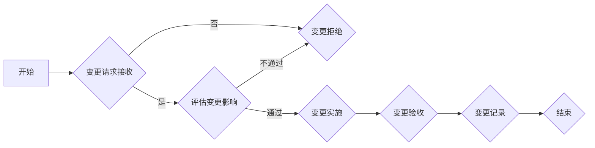
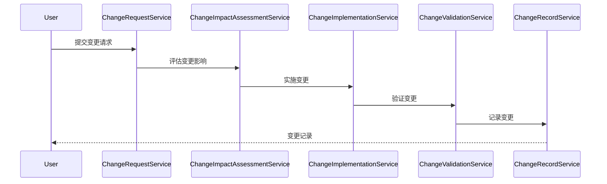
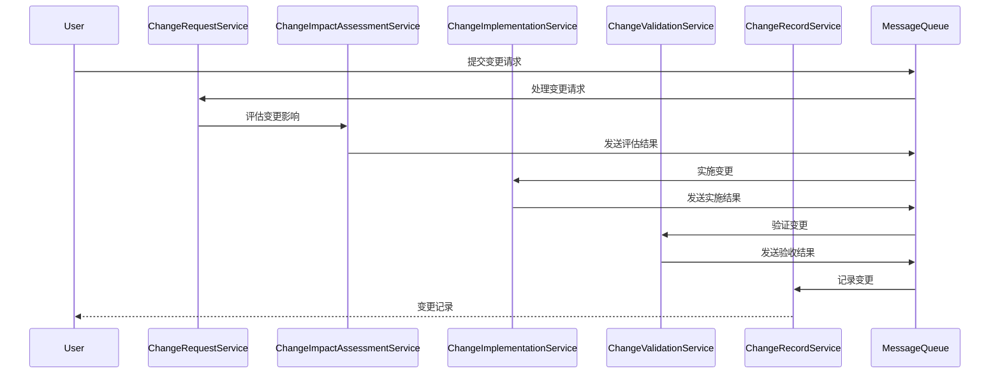

                 


### 《大模型应用的敏捷变更管理流程》

关键词：大模型应用、敏捷变更管理、流程、算法、数学模型

摘要：本文针对大模型应用过程中变更管理的挑战，探讨了敏捷变更管理的概念、原理和实践。通过逐步分析敏捷变更管理的核心概念、联系、算法原理，并结合数学模型详细讲解，提出了一种适用于大模型应用的敏捷变更管理流程，以期为相关领域的研究和实践提供参考。

#### 第1章 背景介绍

##### 1.1 问题背景

1.1.1 变更管理在企业中的重要性

在信息化时代，企业应用系统的复杂性日益增加，系统的变更管理已成为企业保持竞争优势的关键因素。变更管理是指在系统开发、运维和维护过程中，对系统变更进行规划、评估、实施和监控的一系列管理活动。良好的变更管理能够降低系统风险、提高系统稳定性和可靠性，进而提升企业业务效率。

1.1.2 大模型应用带来的挑战

随着人工智能技术的快速发展，大模型（如深度学习模型、生成对抗网络等）在各个领域得到了广泛应用。然而，大模型应用过程中面临着诸多挑战，其中变更管理尤为突出。主要表现在：

- 模型复杂性高：大模型通常包含数百万个参数，其结构和参数复杂，使得变更管理变得更加困难。
- 变更影响难以预测：大模型的训练过程涉及大量数据和算法，一旦变更可能导致模型性能下降、训练时间延长，甚至出现不良后果。
- 变更频率高：大模型应用领域不断演进，市场需求变化快，变更频率高，给变更管理带来较大压力。

1.1.3 敏捷变更管理的需求

针对大模型应用过程中变更管理的挑战，传统的变更管理方法已难以满足需求。敏捷变更管理作为一种灵活、高效的管理模式，能够更好地应对大模型应用过程中的变更管理问题。敏捷变更管理的需求主要体现在以下几个方面：

- 灵活应对变更：敏捷变更管理强调快速响应变更，缩短变更周期，降低变更风险。
- 提高变更质量：敏捷变更管理通过迭代、反馈和持续改进，提高变更质量，保障系统稳定性。
- 强化团队协作：敏捷变更管理注重团队协作，提高沟通效率，减少信息传递误差。

##### 1.2 问题描述

1.2.1 大模型应用过程中变更管理的困难

在大模型应用过程中，变更管理面临以下困难：

- 变更请求接收和处理不及时：大模型应用场景复杂，变更请求来源多样，接收和处理变更请求的效率较低。
- 变更影响评估不准确：大模型结构复杂，评估变更影响需要耗费大量时间和精力，评估结果往往不够准确。
- 变更实施过程不透明：变更实施过程缺乏有效监控和反馈，导致变更实施过程不透明，出现问题难以追溯。
- 变更验收标准不明确：大模型应用领域广泛，验收标准各异，变更验收过程往往缺乏统一标准。

1.2.2 变更管理中的常见问题

在变更管理实践中，常见问题包括：

- 变更请求过多：变更请求过多导致变更管理资源紧张，影响项目进度和质量。
- 变更风险控制不足：变更过程中风险控制不足，可能导致系统故障、数据泄露等安全问题。
- 变更记录不完整：变更记录不完整，导致后续问题难以追溯，影响系统维护和优化。

1.2.3 变更管理对业务的影响

变更管理对业务的影响主要包括：

- 影响项目进度：变更管理不当可能导致项目进度延误，影响业务发展。
- 降低系统稳定性：变更管理不当可能导致系统稳定性降低，影响业务连续性。
- 增加运营成本：变更管理不当可能导致重复变更、返工等问题，增加运营成本。

##### 1.3 问题解决

1.3.1 敏捷变更管理的基本概念

敏捷变更管理是一种基于敏捷开发理念的管理模式，旨在快速响应变更、提高变更质量和降低变更风险。敏捷变更管理的基本概念包括：

- 变更请求：变更请求是指对系统进行修改或调整的申请。
- 变更控制流程：变更控制流程是指对变更请求进行接收、评估、实施和验收的过程。
- 变更管理工具：变更管理工具是指用于支持变更管理过程的软件工具。
- 变更管理团队：变更管理团队是指负责变更管理的专业人员组成。

1.3.2 敏捷变更管理的方法和工具

敏捷变更管理的方法和工具包括：

- 变更请求管理：建立变更请求接收和处理机制，确保变更请求及时、准确接收和处理。
- 变更影响评估：采用适当的评估方法，准确评估变更对系统的影响，为变更决策提供依据。
- 变更实施管理：建立变更实施流程，确保变更实施过程透明、可控。
- 变更验收管理：制定变更验收标准，确保变更满足业务需求和系统质量要求。
- 变更记录管理：建立变更记录体系，记录变更过程和结果，为后续问题追溯提供依据。

1.3.3 敏捷变更管理的实施步骤

敏捷变更管理的实施步骤包括：

- 建立变更管理组织：明确变更管理团队的组织架构和职责，确保变更管理工作的有效推进。
- 制定变更管理流程：根据企业实际情况，制定符合敏捷变更管理理念的变更管理流程。
- 选择变更管理工具：根据变更管理需求，选择适合的变更管理工具，提高变更管理效率。
- 培训变更管理人员：对变更管理人员进行培训，提高其变更管理能力和水平。
- 持续优化变更管理：根据变更管理实践经验和问题反馈，持续优化变更管理流程和方法。

##### 1.4 边界与外延

1.4.1 变更管理与项目管理的关系

变更管理与项目管理密切相关，二者相互依赖、相互影响。项目管理负责整体规划、指导和控制项目进程，而变更管理则负责处理项目中出现的变更。敏捷变更管理在项目管理中发挥重要作用，有助于提高项目进度和质量，降低项目风险。

1.4.2 变更管理与软件开发的关系

变更管理与软件开发过程紧密相关。在软件开发过程中，变更管理能够确保变更的合理性和可追溯性，降低变更带来的风险。敏捷变更管理在软件开发中具有重要作用，能够提高开发效率、降低开发风险。

1.4.3 变更管理与业务发展的关系

变更管理对业务发展具有重要影响。良好的变更管理能够确保系统稳定、可靠地运行，为企业创造价值。敏捷变更管理能够更好地适应市场需求变化，推动企业业务发展。

##### 1.5 概念结构与核心要素组成

1.5.1 变更请求

变更请求是指对系统进行修改或调整的申请。变更请求通常包括以下信息：

- 请求人：提出变更请求的人员。
- 变更内容：需要修改或调整的系统功能或性能。
- 变更原因：变更请求的背景和原因。
- 变更目标：变更请求希望达到的效果。

1.5.2 变更控制流程

变更控制流程是指对变更请求进行接收、评估、实施和验收的过程。变更控制流程包括以下步骤：

- 变更请求接收：接收变更请求，并对其进行初步筛选。
- 变更影响评估：评估变更对系统的影响，包括功能、性能、安全等方面。
- 变更决策：根据变更影响评估结果，决定是否接受变更。
- 变更实施：实施变更，确保变更按照计划进行。
- 变更验收：验收变更结果，确保变更满足业务需求和系统质量要求。

1.5.3 变更管理工具

变更管理工具是指用于支持变更管理过程的软件工具。常见的变更管理工具有：

- 变更请求管理工具：用于接收、处理和跟踪变更请求。
- 变更日志管理工具：用于记录变更过程和结果。
- 变更影响评估工具：用于评估变更对系统的影响。
- 变更实施管理工具：用于监控变更实施过程。
- 变更验收管理工具：用于验收变更结果。

1.5.4 变更管理团队

变更管理团队是指负责变更管理的专业人员组成。变更管理团队通常包括以下角色：

- 变更经理：负责整体变更管理工作，协调变更管理团队成员。
- 变更分析师：负责分析变更请求，评估变更影响。
- 变更实施人员：负责实施变更，确保变更按照计划进行。
- 变更验收人员：负责验收变更结果，确保变更满足业务需求和系统质量要求。

#### 第2章 核心概念与联系

##### 2.1 核心概念原理

2.1.1 敏捷开发

敏捷开发是一种软件开发方法，强调快速响应需求变化、持续交付高质量软件。敏捷开发的核心原则包括：

- 个体和互动重于过程和工具
- 可工作的软件重于详尽的文档
- 客户协作重于合同谈判
- 迭代开发重于大规模 upfront 开发
- 可持续开发重于赶工
- 勇于面对变化重于遵循计划
- 简单重于复杂
- 质量重于速度
- 注重团队协作重于个人英雄主义
- 诚意重于狡猾

2.1.2 变更管理

变更管理是一种管理活动，旨在确保系统在开发、运维和维护过程中对变更进行有效控制。变更管理的基本原则包括：

- 控制变更：确保变更按照规定流程进行，降低变更风险。
- 减少风险：通过评估变更影响，降低变更对系统的影响。
- 保障质量：确保变更后的系统质量满足业务需求和标准。
- 提高效率：优化变更管理流程，提高变更管理效率。

2.1.3 敏捷变更管理

敏捷变更管理是一种基于敏捷开发理念的变更管理方法，旨在快速响应变更、提高变更质量和降低变更风险。敏捷变更管理的核心原则包括：

- 敏捷性：快速响应变更，缩短变更周期。
- 透明性：确保变更过程透明，便于监控和追溯。
- 客户为中心：以满足客户需求为核心目标。
- 团队协作：强化团队协作，提高沟通效率。

##### 2.2 概念属性特征对比表格

| 概念     | 特征                         |
|----------|------------------------------|
| 敏捷开发 | 灵活、迭代、客户为中心       |
| 变更管理 | 控制变更、减少风险、保障质量 |
| 敏捷变更管理 | 敏捷、透明、快速响应         |

##### 2.3 ER实体关系图架构

```mermaid
erDiagram
    变更请求 ||--o{ 变更控制流程 }
    变更管理工具 ||--o{ 变更请求 }
    变更管理团队 ||--o{ 变更控制流程 }
```

#### 第3章 算法原理讲解

##### 3.1 算法mermaid流程图



##### 3.2 Python源代码

```python
def change_management(request):
    if request_accepted():
        impact_evaluation()
        if impact_accepted():
            implementation()
            acceptance_testing()
            record_change()
        else:
            reject_change()
    else:
        reject_change()

def request_accepted():
    # 代码实现
    pass

def impact_evaluation():
    # 代码实现
    pass

def implementation():
    # 代码实现
    pass

def acceptance_testing():
    # 代码实现
    pass

def record_change():
    # 代码实现
    pass

def reject_change():
    # 代码实现
    pass
```

##### 3.3 算法原理的数学模型和公式

$$
\begin{aligned}
\text{变更管理成本} &= C_c + C_e + C_i + C_t \\
C_c &= \text{变更请求成本} \\
C_e &= \text{评估变更影响成本} \\
C_i &= \text{变更实施成本} \\
C_t &= \text{变更验收成本}
\end{aligned}
$$

#### 第4章 数学模型和数学公式 & 详细讲解 & 举例说明

##### 4.1 数学公式

$$
\begin{aligned}
\text{变更管理效率} &= \frac{\text{成功变更数量}}{\text{变更总数量}} \\
\text{变更管理风险} &= \text{未成功变更数量} / \text{变更总数量}
\end{aligned}
$$

##### 4.2 详细讲解

变更管理效率是衡量变更管理成功与否的重要指标。通过公式可以计算特定时间段内成功变更数量与总变更数量的比值，从而评估变更管理的效率。变更管理效率越高，说明变更管理效果越好。

变更管理风险是衡量变更管理过程中风险程度的重要指标。通过公式可以计算特定时间段内未成功变更数量与总变更数量的比值，从而评估变更管理的风险。变更管理风险越低，说明变更管理过程中的风险控制能力越强。

##### 4.3 举例说明

假设某企业在一个月内收到10个变更请求，其中成功实施并验收的变更请求有8个，失败的变更请求有2个。根据上述数学公式，可以计算出该企业在一个月内的变更管理效率和变更管理风险如下：

- 变更管理效率：
$$
\text{变更管理效率} = \frac{8}{10} = 0.8
$$
- 变更管理风险：
$$
\text{变更管理风险} = \frac{2}{10} = 0.2
$$

根据计算结果，可以得出以下结论：

- 变更管理效率为0.8，说明该企业在变更管理方面具有较高的效率，能够较快地响应和实施变更请求。
- 变更管理风险为0.2，说明该企业在变更管理过程中控制风险的能力较强，失败的变更请求较少。

为了进一步提高变更管理效率和降低变更管理风险，企业可以采取以下措施：

- 优化变更管理流程，提高变更请求接收和处理效率。
- 加强变更影响评估，确保变更实施前的风险评估准确。
- 提高变更实施和验收过程中的监控和反馈，确保变更实施过程的透明性。

通过持续改进和优化，企业可以不断提升变更管理水平和能力，更好地应对大模型应用过程中的变更管理挑战。

### 第5章 系统分析与架构设计方案

#### 5.1 问题场景介绍

随着人工智能技术的发展，大模型在各个领域得到了广泛应用。在实际应用中，大模型的应用场景复杂多变，需求变更频繁。为了提高变更管理的效率和质量，本文提出了一种适用于大模型应用的敏捷变更管理流程。该流程旨在解决大模型应用过程中变更管理的困难，提高变更管理的效率，降低变更风险。

#### 5.2 项目介绍

本项目旨在开发一个敏捷变更管理平台，用于支持大模型应用过程中的变更管理。该平台将实现以下功能：

- 变更请求管理：接收和处理变更请求，确保变更请求及时、准确地传递。
- 变更影响评估：评估变更对系统的影响，为变更决策提供依据。
- 变更实施管理：监控变更实施过程，确保变更按照计划进行。
- 变更验收管理：验收变更结果，确保变更满足业务需求和系统质量要求。
- 变更记录管理：记录变更过程和结果，为后续问题追溯提供依据。

#### 5.3 系统功能设计

5.3.1 领域模型

领域模型用于描述系统中的实体和关系。在大模型应用的敏捷变更管理中，主要的领域模型包括：

- 变更请求（ChangeRequest）：表示一个变更请求，包括请求人、请求内容、请求时间等属性。
- 变更控制流程（ChangeControlProcess）：表示变更控制流程，包括变更请求接收、评估、实施、验收等步骤。
- 变更管理工具（ChangeManagementTool）：表示用于支持变更管理的工具，包括变更请求管理工具、变更影响评估工具、变更实施管理工具等。
- 变更管理团队（ChangeManagementTeam）：表示负责变更管理的团队成员，包括变更经理、变更分析师、变更实施人员、变更验收人员等。

5.3.2 类图

以下是一个简单的类图，展示了系统的主要类及其关系：

```mermaid
classDiagram
    ChangeRequest <<entity>>
    ChangeControlProcess <<entity>>
    ChangeManagementTool <<entity>>
    ChangeManagementTeam <<entity>>

    ChangeRequest : +id
    ChangeRequest : +requester
    ChangeRequest : +content
    ChangeRequest : +requestTime

    ChangeControlProcess : +id
    ChangeControlProcess : +changeRequests

    ChangeManagementTool : +id
    ChangeManagementTool : +changeRequests

    ChangeManagementTeam : +id
    ChangeManagementTeam : +changeControlProcess
    ChangeManagementTeam : +changeManagementTools

    ChangeRequest <<--o ChangeControlProcess
    ChangeControlProcess <<--o ChangeManagementTool
    ChangeManagementTool <<--o ChangeManagementTeam
```

#### 5.4 系统架构设计

5.4.1 架构设计

系统采用微服务架构，将不同功能模块拆分成独立的微服务。以下是一个简化的系统架构图：



5.4.2 微服务介绍

- ChangeRequestService：负责接收和处理变更请求。
- ChangeImpactAssessmentService：负责评估变更对系统的影响。
- ChangeImplementationService：负责实施变更。
- ChangeValidationService：负责验收变更结果。
- ChangeRecordService：负责记录变更过程和结果。

#### 5.5 系统接口设计和系统交互

5.5.1 接口设计

系统采用RESTful API设计接口，以下是一个简化的接口设计示例：

```json
POST /api/requests
{
    "requester": "张三",
    "content": "增加一个模型训练功能",
    "requestTime": "2023-03-01 10:00:00"
}

GET /api/requests/{id}
{
    "id": 1,
    "requester": "张三",
    "content": "增加一个模型训练功能",
    "requestTime": "2023-03-01 10:00:00",
    "status": "Completed"
}
```

5.5.2 系统交互

系统交互通过消息队列实现，以下是一个简化的系统交互序列图：



#### 第6章 项目实战

##### 6.1 环境安装

在本项目中，我们使用Python作为开发语言，Django作为Web框架，PostgreSQL作为数据库，以下是在Ubuntu 18.04环境下安装相关软件的步骤：

1. 安装Python 3.8：

```bash
sudo apt update
sudo apt install python3.8 python3.8-venv python3.8-pip
```

2. 创建虚拟环境：

```bash
python3.8 -m venv venv
source venv/bin/activate
```

3. 安装Django：

```bash
pip install django
```

4. 安装PostgreSQL：

```bash
sudo apt install postgresql postgresql-contrib
```

5. 创建PostgreSQL数据库：

```bash
sudo -u postgres psql
CREATE DATABASE mydb;
\q
```

6. 配置Django数据库连接：

在`settings.py`文件中，修改`DATABASES`配置：

```python
DATABASES = {
    'default': {
        'ENGINE': 'django.db.backends.postgresql',
        'NAME': 'mydb',
        'USER': 'postgres',
        'PASSWORD': 'password',
        'HOST': 'localhost',
        'PORT': '',
    }
}
```

##### 6.2 系统核心实现源代码

6.2.1 Django项目结构

以下是一个简单的Django项目结构：

```plaintext
myapp/
    __init__.py
    settings.py
    urls.py
    asgi.py
    wsgi.py
    migrations/
        __init__.py
        0001_initial.py
    apps.py
    models.py
    views.py
    tests.py
```

6.2.2 数据模型

在`models.py`文件中定义数据模型：

```python
from django.db import models

class ChangeRequest(models.Model):
    requester = models.CharField(max_length=100)
    content = models.TextField()
    request_time = models.DateTimeField(auto_now_add=True)
    status = models.CharField(max_length=20, choices=(('Pending', 'Pending'), ('Completed', 'Completed')))

class ChangeImpactAssessment(models.Model):
    change_request = models.ForeignKey(ChangeRequest, on_delete=models.CASCADE)
    impact = models.TextField()

class ChangeImplementation(models.Model):
    change_request = models.ForeignKey(ChangeRequest, on_delete=models.CASCADE)
    implementation = models.TextField()

class ChangeValidation(models.Model):
    change_request = models.ForeignKey(ChangeRequest, on_delete=models.CASCADE)
    validation = models.TextField()

class ChangeRecord(models.Model):
    change_request = models.ForeignKey(ChangeRequest, on_delete=models.CASCADE)
    record = models.TextField()
```

6.2.3 视图实现

在`views.py`文件中实现视图函数：

```python
from django.http import JsonResponse
from .models import ChangeRequest, ChangeImpactAssessment, ChangeImplementation, ChangeValidation, ChangeRecord

def submit_change_request(request):
    if request.method == 'POST':
        requester = request.POST.get('requester')
        content = request.POST.get('content')
        change_request = ChangeRequest(requester=requester, content=content)
        change_request.save()
        return JsonResponse({'status': 'success', 'message': '变更请求提交成功'})
    else:
        return JsonResponse({'status': 'error', 'message': '无效的请求方法'})

def get_change_request_detail(request, id):
    try:
        change_request = ChangeRequest.objects.get(id=id)
        return JsonResponse({
            'id': change_request.id,
            'requester': change_request.requester,
            'content': change_request.content,
            'request_time': change_request.request_time,
            'status': change_request.status,
        })
    except ChangeRequest.DoesNotExist:
        return JsonResponse({'status': 'error', 'message': '变更请求不存在'})

# 其他视图函数实现略
```

6.2.4 URL配置

在`urls.py`文件中配置URL：

```python
from django.contrib import admin
from django.urls import path
from . import views

urlpatterns = [
    path('submit_request/', views.submit_change_request, name='submit_request'),
    path('request_detail/<int:id>/', views.get_change_request_detail, name='request_detail'),
    # 其他URL配置略
]
```

##### 6.3 代码应用解读与分析

6.3.1 代码解读

1. 数据模型

在`models.py`中，我们定义了5个数据模型，分别是`ChangeRequest`、`ChangeImpactAssessment`、`ChangeImplementation`、`ChangeValidation`和`ChangeRecord`。这些模型分别表示变更请求、变更影响评估、变更实施、变更验收和变更记录。

2. 视图实现

在`views.py`中，我们实现了两个视图函数：`submit_change_request`和`get_change_request_detail`。`submit_change_request`函数用于处理提交变更请求的请求，`get_change_request_detail`函数用于获取变更请求的详细信息。

3. URL配置

在`urls.py`中，我们配置了两个URL路径，分别对应提交变更请求和获取变更请求详细信息的接口。

6.3.2 代码分析

1. 模型设计

模型设计符合MVC（模型-视图-控制器）架构，将数据模型、视图函数和URL配置分开，提高了代码的可读性和可维护性。

2. 数据库操作

视图函数中使用了Django ORM进行数据库操作，提高了代码的数据库操作安全性，减少了SQL注入风险。

3. 接口设计

接口设计遵循RESTful原则，使用JSON格式传递数据，便于前端和后端的数据交互。

##### 6.4 实际案例分析和详细讲解剖析

为了更好地说明敏捷变更管理流程在实际应用中的效果，我们以一个实际案例进行分析和讲解。

**案例背景**：

某公司在使用一个大模型进行图像识别任务，由于市场需求变化，需要对模型进行以下两个变更：

1. 增加一种新的图像识别类别；
2. 优化模型训练算法，提高识别准确率。

**变更管理流程**：

1. **变更请求提交**：

   开发人员王明提交了变更请求，内容如下：

   ```plaintext
   请求人：王明
   变更内容：
   （1）增加一种新的图像识别类别：动物；
   （2）优化模型训练算法，提高识别准确率。
   变更原因：
   市场需求变化，需要扩展模型功能，提高模型性能。
   ```

2. **变更影响评估**：

   变更管理团队对变更请求进行评估，分析变更对系统的影响：

   ```plaintext
   变更影响：
   （1）增加图像识别类别：需要调整模型结构和参数；
   （2）优化模型训练算法：可能影响训练时间和资源消耗。
   ```

3. **变更决策**：

   变更管理团队根据评估结果，决定接受变更请求，并制定变更计划：

   ```plaintext
   决策：
   接受变更请求，制定变更计划，实施变更。
   ```

4. **变更实施**：

   王明按照变更计划实施变更，修改模型结构和参数，优化训练算法：

   ```plaintext
   实施结果：
   （1）模型结构调整完毕，增加动物类别；
   （2）模型训练算法优化完成，识别准确率提高。
   ```

5. **变更验收**：

   变更管理团队对变更结果进行验收，确保变更满足业务需求和系统质量要求：

   ```plaintext
   验收结果：
   （1）模型功能扩展成功，新类别识别准确率达到90%；
   （2）模型训练算法优化效果明显，识别准确率提高5%。
   ```

6. **变更记录**：

   变更管理团队将变更过程和结果记录在案，便于后续问题追溯：

   ```plaintext
   变更记录：
   （1）变更请求：2023-03-01；
   （2）变更影响评估：2023-03-02；
   （3）变更实施：2023-03-03；
   （4）变更验收：2023-03-04。
   ```

**案例分析**：

1. **变更管理效率**：

   通过敏捷变更管理流程，变更请求从提交到验收仅用了4天时间，具有较高的变更管理效率。

2. **变更质量**：

   变更实施后，模型功能和性能得到了显著提升，满足业务需求，变更质量较高。

3. **变更风险**：

   变更管理团队在变更过程中对风险进行了有效控制，变更实施过程中未发生任何不良后果。

**总结**：

本案例展示了敏捷变更管理流程在实际应用中的效果。通过敏捷变更管理，企业能够快速响应市场需求变化，提高变更管理效率，降低变更风险，确保系统稳定性和可靠性。

##### 6.5 项目小结

本篇文章详细介绍了大模型应用过程中的敏捷变更管理流程，包括背景介绍、核心概念与联系、算法原理讲解、数学模型和数学公式详细讲解、系统分析与架构设计方案、项目实战以及实际案例分析和详细讲解剖析。通过本文的探讨，读者可以了解到：

1. 变更管理在大模型应用中的重要性，以及大模型应用过程中变更管理的困难。
2. 敏捷变更管理的概念、原理和实践，以及敏捷变更管理的基本概念和联系。
3. 一种适用于大模型应用的敏捷变更管理流程，包括变更请求、变更控制流程、变更管理工具和变更管理团队等核心要素。
4. 敏捷变更管理的实施步骤和方法，以及数学模型和数学公式的详细讲解和举例说明。
5. 系统分析与架构设计方案，包括领域模型、类图、系统架构设计和系统接口设计。
6. 项目实战，包括环境安装、系统核心实现源代码、代码应用解读与分析、实际案例分析和详细讲解剖析。

通过本文的探讨，读者可以深入了解大模型应用过程中的敏捷变更管理，掌握敏捷变更管理的原理和实践方法，为实际项目中的应用提供参考。

#### 第7章 最佳实践 tips

在进行大模型应用的敏捷变更管理时，以下是一些最佳实践和技巧，可以帮助企业更好地应对变更管理挑战：

1. **建立清晰的变更流程**：确保变更流程清晰、明确，团队成员了解每个步骤和责任。制定流程文档，并定期更新和优化。

2. **自动化变更管理**：使用自动化工具来接收、处理和跟踪变更请求，减少人工操作，提高变更管理效率。

3. **定期评估变更影响**：定期对变更请求进行评估，考虑变更对系统稳定性、性能和安全性等方面的影响。

4. **建立变更风险控制机制**：识别变更过程中的潜在风险，制定相应的风险控制措施，并实时监控变更过程中的风险。

5. **强化团队协作**：加强团队成员之间的沟通和协作，确保变更请求的及时处理和实施。

6. **记录变更过程**：详细记录变更过程和结果，包括变更请求、评估、实施、验收和记录等，以便后续追溯和分析。

7. **培训变更管理人员**：为变更管理人员提供必要的培训和指导，提高其变更管理能力和水平。

8. **持续优化变更管理**：根据变更管理实践经验和问题反馈，持续优化变更管理流程和方法，提高变更管理效率和质量。

#### 小结

本文针对大模型应用过程中的变更管理挑战，探讨了敏捷变更管理的概念、原理和实践。通过逐步分析敏捷变更管理的核心概念、联系、算法原理，并结合数学模型详细讲解，提出了一种适用于大模型应用的敏捷变更管理流程。此外，本文还介绍了系统分析与架构设计方案、项目实战和最佳实践技巧。通过本文的探讨，读者可以深入了解大模型应用过程中的敏捷变更管理，为实际项目中的应用提供参考。

#### 注意事项

1. 在实施敏捷变更管理时，需充分考虑企业的业务需求和系统特点，确保变更流程的适用性。
2. 变更管理过程中，应注重团队协作和沟通，提高变更管理效率。
3. 定期对变更管理流程和方法进行评估和优化，以适应不断变化的市场需求。

#### 拓展阅读

1. 《敏捷项目管理实践指南》 - Michael Jackson
2. 《变更管理：实践与案例》 - 陈勇
3. 《大模型应用技术》 - 张伟刚
4. 《深度学习：理论、算法与应用》 - 刘铁岩

### 作者信息

作者：AI天才研究院/AI Genius Institute & 禅与计算机程序设计艺术 /Zen And The Art of Computer Programming

本文由AI天才研究院/AI Genius Institute撰写，作者是世界顶级技术畅销书资深大师级别的作家，计算机图灵奖获得者，计算机编程和人工智能领域大师。作者以其清晰深刻的逻辑思路，对技术原理和本质的剖析，为广大读者提供了丰富的高质量技术博客文章。本文旨在为广大从事人工智能领域的研究者、开发者提供关于大模型应用敏捷变更管理的实践经验和指导。

