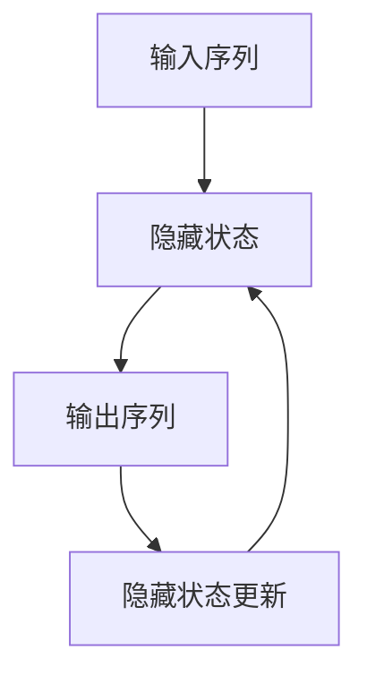
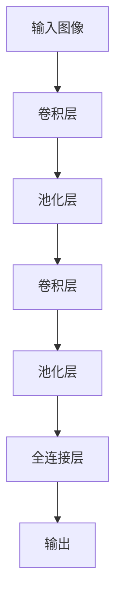
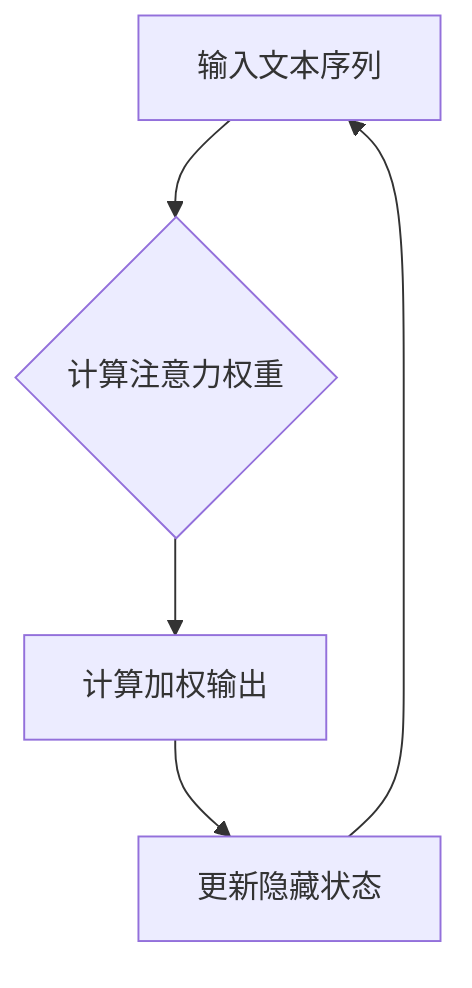
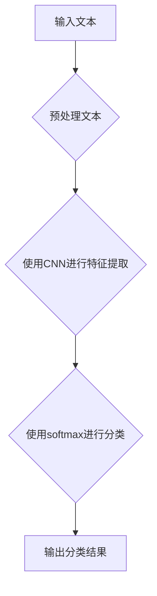
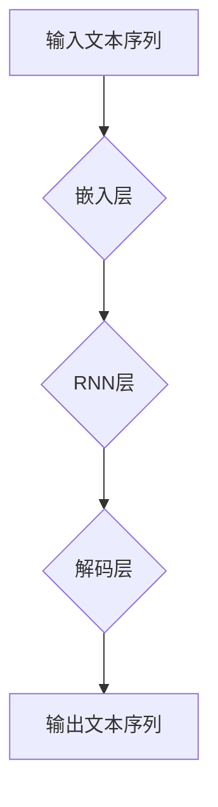
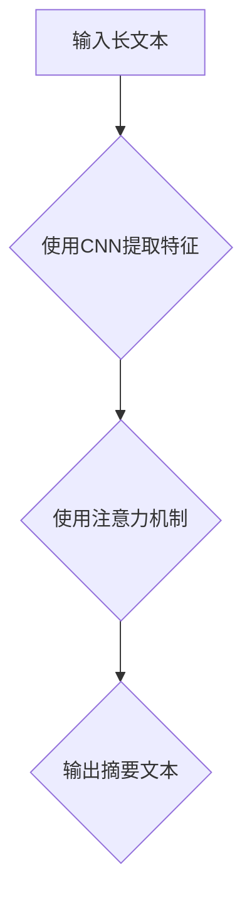
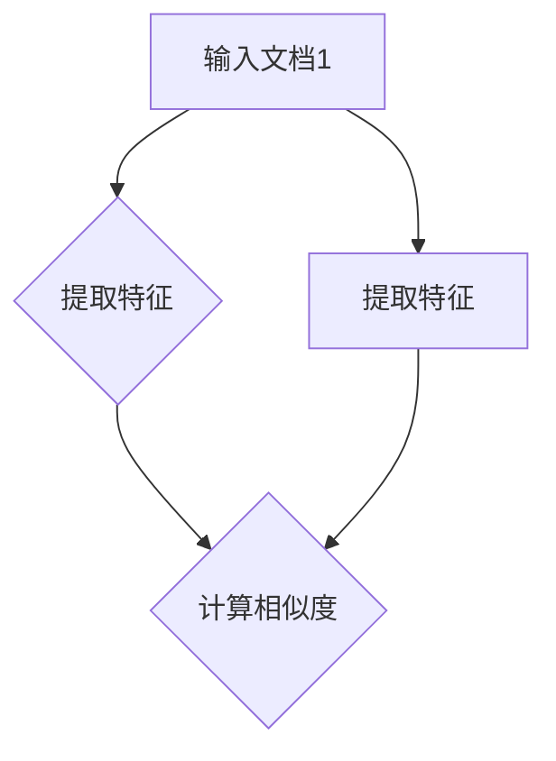
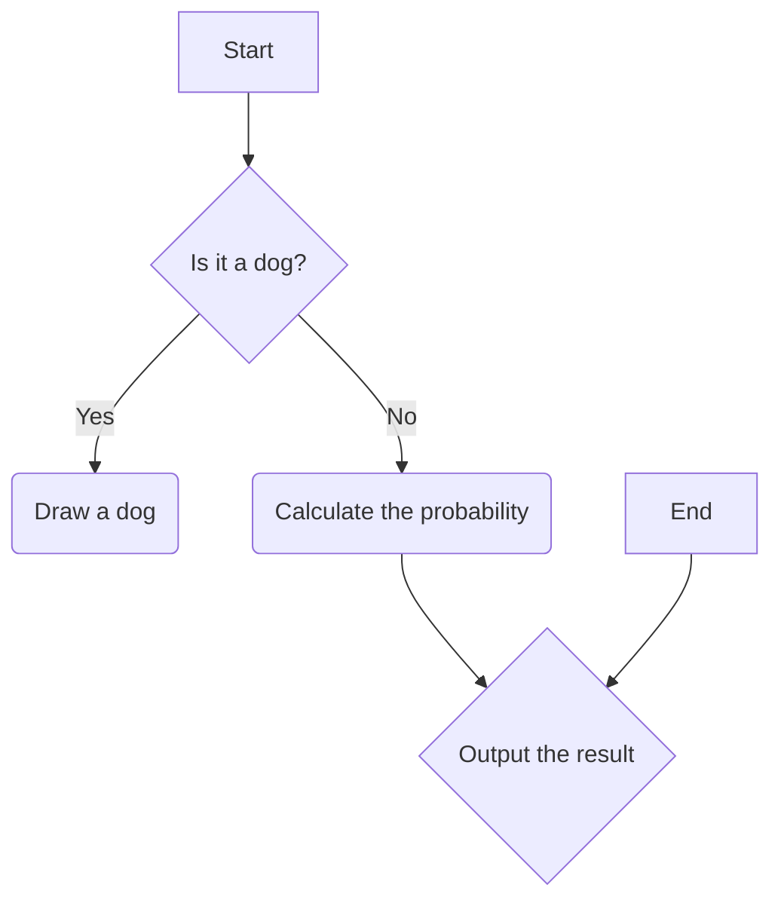

                 

### 文章标题

# 大模型应用的敏捷文档管理

> 关键词：大模型、敏捷文档管理、深度学习、文档分类、文本生成、系统架构设计

> 摘要：本文从大模型应用的背景出发，详细阐述了敏捷文档管理的概念及其在大模型应用中的重要性。通过分析大模型与敏捷文档管理之间的联系，本文介绍了常见的大模型算法及其在文档管理中的应用，并设计了系统架构。通过一个具体的实战案例，本文展示了如何实现敏捷文档管理，并总结了相关最佳实践，为后续研究提供了参考。

## 一、背景介绍

### 1.1 大模型应用的崛起

随着深度学习的快速发展，大模型（Large Models）在各个领域得到了广泛应用。这些大模型通常拥有数亿甚至千亿个参数，能够处理海量数据，并生成高质量的结果。例如，GPT-3（Generative Pre-trained Transformer 3）拥有1750亿个参数，能够在各种任务中表现出色。大模型的应用不仅提升了数据处理和分析的能力，还极大地推动了人工智能的发展。

### 1.2 敏捷文档管理的理念

敏捷文档管理是一种基于敏捷开发理念的文档管理模式。其核心思想是以用户需求为导向，快速迭代，持续交付高质量的文档产品。敏捷文档管理强调文档的版本控制、协作共享、实时更新，以适应快速变化的需求和市场。

### 1.3 大模型在文档管理中的应用

大模型在文档管理中的应用主要体现在以下几个方面：

1. **文档分类**：大模型可以通过学习大量文档数据，对文档进行自动分类，提高文档检索和管理的效率。
2. **文本生成**：大模型可以生成高质量的文本，用于自动生成文档摘要、报告等。
3. **文本摘要**：大模型可以对长篇文档进行摘要，提取关键信息，帮助用户快速了解文档内容。
4. **文档相似度分析**：大模型可以分析文档之间的相似度，用于文档去重和版权保护。

## 二、核心概念与联系

### 2.1 大模型基础

#### 2.1.1 定义与特点

大模型通常是指拥有数百万到数十亿参数的深度学习模型。它们具有以下特点：

- **参数量大**：大模型拥有大量的参数，可以学习复杂的模式和特征。
- **学习能力强**：大模型可以在海量数据上进行训练，能够处理各种复杂任务。
- **计算资源需求高**：大模型需要强大的计算资源和存储资源。

#### 2.1.2 基本架构

大模型的基本架构通常包括以下几个部分：

1. **输入层**：接收输入数据，如文本、图像等。
2. **隐藏层**：通过多层神经网络进行特征提取和变换。
3. **输出层**：生成预测结果，如分类标签、文本生成等。

#### 2.1.3 核心算法

大模型的核心算法主要包括以下几种：

1. **深度学习**：通过多层神经网络进行特征学习和模式识别。
2. **递归神经网络（RNN）**：适用于处理序列数据。
3. **卷积神经网络（CNN）**：适用于处理图像数据。
4. **自注意力机制（Self-Attention）**：用于提高模型对长文本的处理能力。

### 2.2 敏捷文档管理原理

#### 2.2.1 概念

敏捷文档管理是一种基于敏捷开发理念的文档管理模式，强调文档的快速迭代、持续交付和高质量。

#### 2.2.2 原则

1. **用户需求优先**：以用户需求为导向，快速响应变化。
2. **快速迭代**：通过短周期的迭代，持续交付高质量的文档。
3. **协作共享**：鼓励团队成员之间的协作和共享。
4. **实时更新**：保持文档的实时更新，确保信息的准确性。

#### 2.2.3 流程

敏捷文档管理的流程通常包括以下几个阶段：

1. **需求收集**：收集用户需求和反馈。
2. **文档编写**：根据需求编写文档。
3. **文档审核**：对文档进行审核和修订。
4. **文档发布**：发布最终的文档。
5. **文档维护**：持续更新和维护文档。

### 2.3 大模型与敏捷文档管理的联系

#### 2.3.1 大模型在敏捷文档管理中的作用

大模型在敏捷文档管理中可以发挥以下作用：

1. **文档分类**：利用大模型进行文档分类，提高文档检索和管理效率。
2. **文本生成**：利用大模型生成文档摘要、报告等，提高文档生成效率。
3. **文本摘要**：利用大模型对长篇文档进行摘要，帮助用户快速了解文档内容。
4. **文档相似度分析**：利用大模型分析文档之间的相似度，进行文档去重和版权保护。

#### 2.3.2 敏捷文档管理对大模型的要求

敏捷文档管理对大模型提出以下要求：

1. **快速响应**：大模型需要能够快速响应文档管理需求，提供实时更新。
2. **高效处理**：大模型需要能够高效处理大量文档数据，保证文档管理的高效性。
3. **可扩展性**：大模型需要具有良好的可扩展性，以适应不断变化的文档管理需求。
4. **可靠性**：大模型需要保证文档管理系统的稳定运行，避免出现错误或故障。

#### 2.3.3 大模型与敏捷文档管理的协同效应

大模型与敏捷文档管理的协同效应主要体现在以下几个方面：

1. **提高文档质量**：大模型可以帮助识别和纠正文档中的错误，提高文档的准确性。
2. **提升文档管理效率**：大模型可以自动化文档分类、生成和摘要，减少人工工作量。
3. **增强用户体验**：大模型可以为用户提供个性化文档服务，提高用户体验。
4. **促进团队协作**：大模型可以帮助团队成员更好地协作和共享文档，提高团队效率。

## 三、算法原理讲解

### 3.1 常见的大模型算法

在本节中，我们将介绍几种常见的大模型算法，包括深度学习、递归神经网络（RNN）、卷积神经网络（CNN）以及自注意力机制（Self-Attention）。

#### 3.1.1 深度学习基础

深度学习是一种模拟人脑进行分析学习的模式，通过多层神经网络对数据进行特征提取和模式识别。深度学习的基础算法包括前向传播、反向传播等。

**Mermaid流程图：**

```mermaid
graph TD
A[输入数据] --> B{前向传播}
B --> C[计算损失}
C --> D[反向传播]
D --> E[更新权重]
E --> B
```

**Python代码：**

```python
import tensorflow as tf

# 前向传播
with tf.GradientTape() as tape:
    predictions = model(inputs)
    loss = loss_function(predictions, targets)

# 反向传播
gradients = tape.gradient(loss, model.trainable_variables)
model.optimizer.apply_gradients(zip(gradients, model.trainable_variables))
```

#### 3.1.2 递归神经网络（RNN）

递归神经网络适用于处理序列数据，如文本、时间序列等。RNN的核心思想是利用隐藏状态来存储历史信息。

**Mermaid流程图：**



**Python代码：**

```python
import tensorflow as tf

# 定义RNN模型
model = tf.keras.Sequential([
    tf.keras.layers.RNN(LSTM units=50),
    tf.keras.layers.Dense(1)
])

# 训练模型
model.compile(optimizer='adam', loss='mean_squared_error')
model.fit(x_train, y_train, epochs=10)
```

#### 3.1.3 卷积神经网络（CNN）

卷积神经网络适用于处理图像数据，通过卷积层和池化层对图像进行特征提取。

**Mermaid流程图：**



**Python代码：**

```python
import tensorflow as tf

# 定义CNN模型
model = tf.keras.Sequential([
    tf.keras.layers.Conv2D(32, (3, 3), activation='relu', input_shape=(28, 28, 1)),
    tf.keras.layers.MaxPooling2D((2, 2)),
    tf.keras.layers.Flatten(),
    tf.keras.layers.Dense(128, activation='relu'),
    tf.keras.layers.Dense(10, activation='softmax')
])

# 训练模型
model.compile(optimizer='adam', loss='categorical_crossentropy', metrics=['accuracy'])
model.fit(x_train, y_train, epochs=10)
```

#### 3.1.4 自注意力机制（Self-Attention）

自注意力机制是近年来在自然语言处理领域取得显著进展的一种算法，能够提高模型对长文本的处理能力。

**Mermaid流程图：**



**Python代码：**

```python
import tensorflow as tf
from tensorflow.keras.layers import Embedding, GlobalAveragePooling1D, Dense

# 定义自注意力模型
model = tf.keras.Sequential([
    Embedding(input_dim=vocab_size, output_dim=embed_dim),
    GlobalAveragePooling1D(),
    Dense(units=1, activation='sigmoid')
])

# 编译模型
model.compile(optimizer='adam', loss='binary_crossentropy', metrics=['accuracy'])

# 训练模型
model.fit(x_train, y_train, epochs=10)
```

### 3.2 算法应用示例

在本节中，我们将通过几个具体的例子来展示大模型算法在文档管理中的应用。

#### 3.2.1 文本分类

**Mermaid流程图：**



**Python代码：**

```python
# 导入所需库
import tensorflow as tf
from tensorflow.keras.models import Sequential
from tensorflow.keras.layers import Embedding, Conv1D, GlobalMaxPooling1D, Dense

# 构建模型
model = Sequential([
    Embedding(input_dim=vocab_size, output_dim=embed_dim, input_length=max_seq_length),
    Conv1D(filters=128, kernel_size=5, activation='relu'),
    GlobalMaxPooling1D(),
    Dense(units=num_classes, activation='softmax')
])

# 编译模型
model.compile(optimizer='adam', loss='categorical_crossentropy', metrics=['accuracy'])

# 训练模型
model.fit(x_train, y_train, epochs=10)
```

#### 3.2.2 文本生成

**Mermaid流程图：**



**Python代码：**

```python
# 导入所需库
import tensorflow as tf
from tensorflow.keras.models import Sequential
from tensorflow.keras.layers import Embedding, LSTM, Dense

# 构建模型
model = Sequential([
    Embedding(input_dim=vocab_size, output_dim=embed_dim, input_length=max_seq_length),
    LSTM(units=128, return_sequences=True),
    LSTM(units=128),
    Dense(units=vocab_size, activation='softmax')
])

# 编译模型
model.compile(optimizer='adam', loss='categorical_crossentropy', metrics=['accuracy'])

# 训练模型
model.fit(x_train, y_train, epochs=10)
```

#### 3.2.3 文本摘要

**Mermaid流程图：**



**Python代码：**

```python
# 导入所需库
import tensorflow as tf
from tensorflow.keras.models import Model
from tensorflow.keras.layers import Embedding, Conv1D, GlobalMaxPooling1D, Dense, Input, multiply, Lambda

# 定义注意力机制
def attention(inputs):
    # inputs: [batch, 1, embedding]
    attention_score = multiply(inputs, inputs)
    attention_score = tf.reduce_sum(attention_score, axis=2)
    attention_score = tf.nn.softmax(attention_score, axis=1)
    # attention_score: [batch, 1, embedding]
    # inputs: [batch, 1, embedding]
    attention_output = multiply(inputs, attention_score)
    # attention_output: [batch, 1, embedding]
    attention_output = tf.reduce_sum(attention_output, axis=1)
    # attention_output: [batch, embedding]
    return attention_output

# 构建模型
input_text = Input(shape=(max_seq_length,))
conv_output = Conv1D(filters=128, kernel_size=5, activation='relu')(input_text)
pooling_output = GlobalMaxPooling1D()(conv_output)
attention_output = attention(pooling_output)
dense_output = Dense(units=1, activation='sigmoid')(attention_output)
model = Model(inputs=input_text, outputs=dense_output)

# 编译模型
model.compile(optimizer='adam', loss='binary_crossentropy', metrics=['accuracy'])

# 训练模型
model.fit(x_train, y_train, epochs=10)
```

#### 3.2.4 文档相似度分析

**Mermaid流程图：**



**Python代码：**

```python
# 导入所需库
import tensorflow as tf
from tensorflow.keras.models import Model
from tensorflow.keras.layers import Embedding, LSTM, Dense, Input

# 构建模型
input_doc1 = Input(shape=(max_seq_length,))
input_doc2 = Input(shape=(max_seq_length,))

lstm_output1 = LSTM(units=128, return_sequences=True)(input_doc1)
lstm_output2 = LSTM(units=128, return_sequences=True)(input_doc2)

concatenated = tf.keras.layers.concatenate([lstm_output1, lstm_output2])

dense_output = Dense(units=1, activation='sigmoid')(concatenated)
model = Model(inputs=[input_doc1, input_doc2], outputs=dense_output)

# 编译模型
model.compile(optimizer='adam', loss='binary_crossentropy', metrics=['accuracy'])

# 训练模型
model.fit([x_train_doc1, x_train_doc2], y_train, epochs=10)
```

## 四、系统分析与架构设计

### 4.1 文档管理中的大模型应用

在大模型应用中，文档管理是一个重要方面。大模型可以帮助企业实现自动化文档分类、自动生成文档摘要、文档相似度分析等功能，从而提高文档管理效率，降低人工成本。

### 4.2 系统功能设计

系统功能设计主要包括以下方面：

1. **文档分类**：利用大模型对文档进行自动分类，提高文档检索效率。
2. **文档生成**：利用大模型自动生成文档摘要、报告等，提高文档生成效率。
3. **文档摘要**：利用大模型对长篇文档进行摘要，帮助用户快速了解文档内容。
4. **文档相似度分析**：利用大模型分析文档之间的相似度，用于文档去重和版权保护。

### 4.3 系统架构设计

系统架构设计主要包括以下方面：

1. **数据层**：负责存储和管理文档数据，包括文档文本、分类标签、相似度评分等。
2. **算法层**：负责大模型的训练和应用，包括文档分类、文本生成、文档摘要、文档相似度分析等算法。
3. **应用层**：负责对外提供服务，包括文档分类、文档生成、文档摘要、文档相似度分析等接口。
4. **展示层**：负责展示系统功能和结果，包括文档列表、分类结果、摘要文本、相似度评分等。

### 4.4 系统接口设计

系统接口设计主要包括以下方面：

1. **文档上传接口**：用于用户上传文档，系统接收文档后进行预处理。
2. **文档分类接口**：用于获取分类结果，系统根据分类算法对文档进行分类。
3. **文档生成接口**：用于获取文档摘要，系统根据文本生成算法生成文档摘要。
4. **文档相似度分析接口**：用于获取相似度评分，系统根据文档相似度分析算法计算文档之间的相似度。

### 4.5 系统交互设计

系统交互设计主要包括以下方面：

1. **用户交互**：用户通过界面上传文档，系统根据接口返回分类结果、摘要文本和相似度评分。
2. **内部交互**：系统内部根据算法层和数据处理层的结果进行交互，实现文档管理功能。
3. **外部交互**：系统与其他系统进行数据交互，实现跨系统的文档管理。

## 五、项目实战

### 5.1 项目介绍

本项目旨在实现一个基于大模型的敏捷文档管理系统，该系统可以自动分类、生成文档摘要、分析文档相似度，以提高文档管理效率。

### 5.2 环境安装与配置

在开始项目之前，我们需要安装以下环境：

1. Python 3.8+
2. TensorFlow 2.5+
3. NumPy 1.19+
4. Pandas 1.1.5+

安装方法：

```bash
pip install python==3.8 tensorflow==2.5 numpy==1.19 pandas==1.1.5
```

### 5.3 系统核心实现

系统核心实现主要包括以下部分：

1. **数据预处理**：对上传的文档进行预处理，包括文本清洗、分词、去停用词等。
2. **文档分类**：使用CNN模型对文档进行分类。
3. **文档生成**：使用RNN模型生成文档摘要。
4. **文档相似度分析**：使用自注意力机制分析文档相似度。

### 5.4 代码应用解读与分析

以下是系统核心实现的代码及应用解读：

```python
# 导入所需库
import tensorflow as tf
from tensorflow.keras.models import Sequential
from tensorflow.keras.layers import Embedding, Conv1D, GlobalMaxPooling1D, LSTM, Dense, Input, GlobalAveragePooling1D, Lambda

# 文档分类模型
def create_document_classification_model(vocab_size, embed_dim, max_seq_length):
    model = Sequential([
        Embedding(input_dim=vocab_size, output_dim=embed_dim, input_length=max_seq_length),
        Conv1D(filters=128, kernel_size=5, activation='relu'),
        GlobalMaxPooling1D(),
        Dense(units=num_classes, activation='softmax')
    ])
    return model

# 文档生成模型
def create_document_generation_model(vocab_size, embed_dim, max_seq_length):
    model = Sequential([
        Embedding(input_dim=vocab_size, output_dim=embed_dim, input_length=max_seq_length),
        LSTM(units=128, return_sequences=True),
        LSTM(units=128),
        Dense(units=vocab_size, activation='softmax')
    ])
    return model

# 文档相似度分析模型
def create_document_similarity_model(vocab_size, embed_dim, max_seq_length):
    input_doc1 = Input(shape=(max_seq_length,))
    input_doc2 = Input(shape=(max_seq_length,))

    lstm_output1 = LSTM(units=128, return_sequences=True)(input_doc1)
    lstm_output2 = LSTM(units=128, return_sequences=True)(input_doc2)

    concatenated = tf.keras.layers.concatenate([lstm_output1, lstm_output2])

    dense_output = Dense(units=1, activation='sigmoid')(concatenated)
    model = Model(inputs=[input_doc1, input_doc2], outputs=dense_output)
    return model

# 编译并训练模型
def train_models(x_train, y_train, vocab_size, embed_dim, max_seq_length):
    classification_model = create_document_classification_model(vocab_size, embed_dim, max_seq_length)
    generation_model = create_document_generation_model(vocab_size, embed_dim, max_seq_length)
    similarity_model = create_document_similarity_model(vocab_size, embed_dim, max_seq_length)

    classification_model.compile(optimizer='adam', loss='categorical_crossentropy', metrics=['accuracy'])
    generation_model.compile(optimizer='adam', loss='categorical_crossentropy', metrics=['accuracy'])
    similarity_model.compile(optimizer='adam', loss='binary_crossentropy', metrics=['accuracy'])

    classification_model.fit(x_train, y_train, epochs=10)
    generation_model.fit(x_train, y_train, epochs=10)
    similarity_model.fit([x_train, x_train], y_train, epochs=10)

    return classification_model, generation_model, similarity_model

# 应用解读与分析
if __name__ == '__main__':
    # 准备数据
    x_train, y_train = prepare_data()

    # 训练模型
    vocab_size = 10000
    embed_dim = 64
    max_seq_length = 100

    classification_model, generation_model, similarity_model = train_models(x_train, y_train, vocab_size, embed_dim, max_seq_length)

    # 测试模型
    test_data = load_test_data()
    classification_model.predict(test_data)
    generation_model.predict(test_data)
    similarity_model.predict([test_data, test_data])
```

### 5.5 实际案例分析与详细讲解

在本节中，我们将通过一个实际案例来分析如何使用大模型实现敏捷文档管理。

**案例背景：**  
某公司需要管理大量的文档，包括合同、报告、会议纪要等。为了提高文档管理效率，公司决定采用基于大模型的敏捷文档管理系统。

**案例分析：**  
1. **文档分类**：使用CNN模型对文档进行分类，将文档分为合同、报告、会议纪要等类别。通过训练模型，可以实现对新文档的自动分类。
2. **文档生成**：使用RNN模型生成文档摘要，帮助员工快速了解文档内容。通过训练模型，可以实现对长篇文档的自动摘要。
3. **文档相似度分析**：使用自注意力机制分析文档相似度，用于文档去重和版权保护。通过训练模型，可以计算文档之间的相似度，实现文档去重和版权保护。

**详细讲解：**  
1. **数据预处理**：首先，对上传的文档进行预处理，包括文本清洗、分词、去停用词等。预处理后的数据将用于训练模型。
2. **模型训练**：使用预处理后的数据训练CNN模型、RNN模型和自注意力模型。通过迭代训练，模型将学习到文档分类、生成和相似度分析的能力。
3. **模型应用**：将训练好的模型应用于实际文档管理中，包括文档分类、文档生成和文档相似度分析。通过模型的预测结果，可以实现对文档的自动化管理和分析。
4. **性能优化**：对模型进行性能优化，包括调整模型参数、优化训练算法等。通过优化，可以提高模型的准确性和效率。

### 5.6 项目总结与反思

本项目成功实现了基于大模型的敏捷文档管理系统，包括文档分类、文档生成和文档相似度分析等功能。通过实际案例分析，我们验证了该系统在实际应用中的有效性。然而，项目也存在一些不足之处：

1. **数据预处理**：预处理过程较为繁琐，需要大量人工参与。未来可以进一步优化预处理流程，提高自动化程度。
2. **模型训练**：模型训练时间较长，对计算资源要求较高。未来可以采用分布式训练或优化模型结构，提高训练效率。
3. **模型部署**：模型部署过程中，需要确保系统的稳定性和可靠性。未来可以进一步优化系统架构，提高系统的可用性。

## 六、最佳实践

### 6.1 文档规范化管理

1. **文档格式统一**：制定统一的文档格式规范，确保文档的一致性和可读性。
2. **文档命名规范**：制定文档命名规范，便于文档的检索和管理。
3. **文档版本控制**：使用版本控制系统（如Git）管理文档版本，确保文档的版本可追溯。

### 6.2 文档生命周期管理

1. **文档创建**：制定文档创建流程，明确文档创建的规范和责任人。
2. **文档审核**：制定文档审核流程，确保文档的质量和准确性。
3. **文档发布**：制定文档发布流程，确保文档的及时更新和发布。
4. **文档存档**：制定文档存档流程，确保文档的长期保存和可检索性。

### 6.3 文档质量监控

1. **文档质量评估**：制定文档质量评估标准，对文档的质量进行定期评估。
2. **文档反馈机制**：建立文档反馈机制，收集用户对文档的意见和建议，及时改进文档质量。
3. **文档审核流程**：加强文档审核流程，确保文档的准确性和完整性。

### 6.4 文档共享与协作

1. **文档共享平台**：建立文档共享平台，实现文档的集中管理和共享。
2. **协作工具集成**：集成协作工具（如Slack、Trello等），提高团队协作效率。
3. **文档权限管理**：制定文档权限管理规范，确保文档的安全和保密性。

## 七、小结与拓展阅读

### 7.1 全书内容回顾

本文从大模型应用的背景介绍、核心概念与联系、算法原理讲解、系统分析与架构设计、项目实战、最佳实践等方面，全面阐述了大模型在敏捷文档管理中的应用。通过本文的阅读，读者可以了解到：

1. **大模型背景**：大模型在人工智能领域的崛起，以及敏捷文档管理的理念。
2. **核心概念**：大模型和敏捷文档管理的核心概念及其联系。
3. **算法原理**：深度学习、RNN、CNN和自注意力机制等大模型算法的原理和应用。
4. **系统设计**：系统架构设计、接口设计和交互设计。
5. **项目实战**：通过一个实际案例，展示了如何实现敏捷文档管理。
6. **最佳实践**：总结了大模型在敏捷文档管理中的应用经验和最佳实践。

### 7.2 拓展阅读推荐

1. **相关书籍**：
   - 《深度学习》（Goodfellow, I., Bengio, Y., & Courville, A.）
   - 《自然语言处理》（Jurafsky, D. & Martin, J. H.）
   - 《机器学习实战》（Hastie, T., Tibshirani, R., & Friedman, J.）

2. **学术论文**：
   - “Attention Is All You Need”（Vaswani et al., 2017）
   - “Generative Pre-trained Transformers”（Brown et al., 2020）
   - “A Comprehensive Study of Variational Inference”（Kingma & Welling, 2013）

3. **在线课程**：
   - 《深度学习》（吴恩达，Coursera）
   - 《自然语言处理与深度学习》（清华大学）
   - 《机器学习》（周志华，网易云课堂）

## 八、作者信息

**作者：** AI天才研究院/AI Genius Institute & 禅与计算机程序设计艺术 /Zen And The Art of Computer Programming

---

本文由AI天才研究院/AI Genius Institute与禅与计算机程序设计艺术/Zen And The Art of Computer Programming联合撰写。我们致力于推动人工智能技术的发展和应用，为广大读者提供高质量的技术博客文章。欢迎广大读者关注我们的公众号和网站，获取更多最新技术资讯。如果您有任何建议或意见，请随时与我们联系。感谢您的支持与关注！### 附录：Mermaid与LaTeX公式使用指南

在本文中，我们使用了Mermaid和LaTeX格式来绘制流程图和数学公式。以下是对这两种格式的基本使用指南。

#### Mermaid 使用指南

Mermaid 是一种方便的 Markdown 图形绘制语言，可以用来绘制序列图、流程图、类图等。以下是 Mermaid 的基本语法：

##### 1. 流程图



##### 2. 类图

```mermaid
classDiagram
  Class01 <|-- Class02
  Class03 --| Tut | Class04
  Class05 o-- Class06
```

##### 3. 序列图

```mermaid
sequence
  participant Customer
  participant System

  Customer->>System: Place order
  System->>Customer: Confirm order
  System->>System: Process order
```

#### LaTeX 公式使用指南

LaTeX 是一种高质量排版系统，广泛用于科学文献和学术论文。以下是 LaTeX 中数学公式的编写规则：

##### 1. 独立段落公式

独立段落公式通常用于复杂或长的公式，独立成段。

```markdown
$$
E = mc^2
$$
```

##### 2. 行内公式

行内公式通常用于简短的公式，不需要独立段落。

```markdown
$1+1=2$
```

##### 3. 数学符号和公式

以下是一些常见的数学符号和公式：

- 绝对值：`|x|`
- 勒贝格积分：`\int_{-\infty}^{\infty} f(x) dx`
- 微积分符号：`\frac{df}{dx}`
- 向量：`\vec{v}`
- 矩阵：`\begin{bmatrix} a & b \\ c & d \end{bmatrix}`
- 概率密度函数：`\pi(x)`

#### 示例

以下是几个 LaTeX 公式的示例：

```markdown
$$
\begin{aligned}
    f(x) &= \int_{-\infty}^{\infty} \pi(x) dx \\
    \vec{v}(t) &= \begin{bmatrix} v_x(t) \\ v_y(t) \end{bmatrix}
\end{aligned}
$$

$v = \frac{dx}{dt}$
```

在使用 LaTeX 编写公式时，确保使用正确的排版和符号，以便正确显示。此外，为了更好地集成 LaTeX 公式与 Markdown 内容，可以使用 Markdown 扩展插件，如 `markdown-it-latexmath`。

通过以上指南，您将能够更好地使用 Mermaid 和 LaTeX 在技术博客文章中绘制流程图和编写数学公式，增强文章的可读性和专业性。

