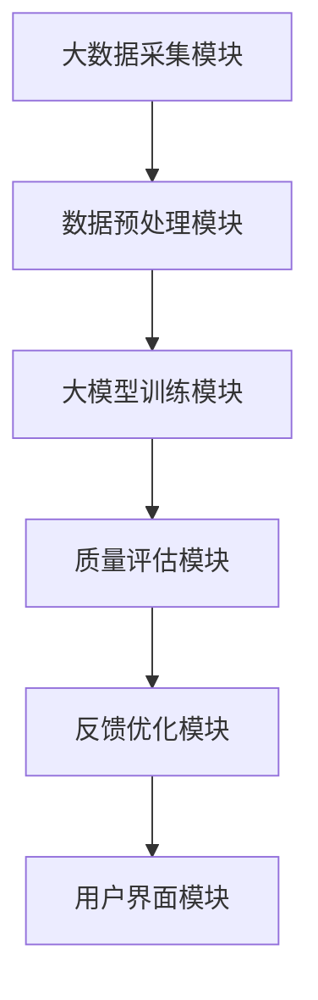
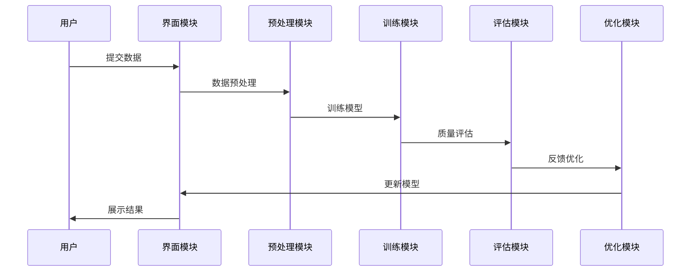
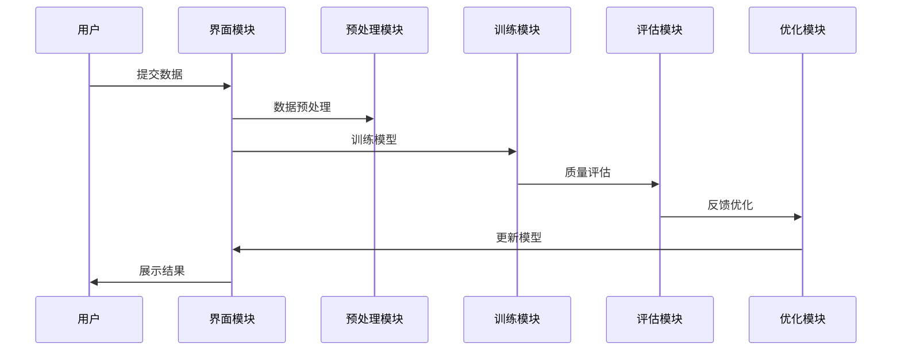

                 


### 大模型应用的敏捷质量管理方法

> 关键词：大模型、敏捷质量管理、数学模型、算法原理、系统分析与架构设计、项目实战

> 摘要：本文将探讨大模型应用的敏捷质量管理方法，从背景介绍、核心概念与联系、数学模型与算法原理、系统分析与架构设计、项目实战等方面，深入解析大模型与敏捷质量管理在实际应用中的融合，以提供一种高效、可行的质量管理方案。

## 第一部分：引言

### 1.1 问题背景

随着人工智能技术的飞速发展，大模型（如深度神经网络、生成对抗网络等）在各个领域取得了显著的成果。然而，大模型的开发和部署过程中，质量管理成为一个重要的挑战。传统质量管理方法在应对复杂的大模型时，往往显得力不从心。因此，如何在大模型应用中实施有效的质量管理方法，成为当前亟待解决的问题。

### 1.2 问题定义

本文旨在探索大模型应用的敏捷质量管理方法，即如何将敏捷质量管理理念应用于大模型开发与部署的全过程，以提高大模型的质量和可靠性。具体包括：

- 如何在大模型开发中实现快速反馈和持续改进
- 如何在大模型部署中确保系统的稳定性和安全性
- 如何在大模型运维中实现高效的故障诊断和问题修复

### 1.3 解决方案

本文将结合大模型和敏捷质量管理的核心概念，提出一套适用于大模型应用的敏捷质量管理方法。通过数学模型和算法原理的讲解，以及系统分析与架构设计的详细阐述，为实际项目提供理论指导和实践经验。

### 1.4 边界与外延

本文的研究范围主要涉及大模型应用中的敏捷质量管理，包括开发、部署和运维等环节。同时，本文也将探讨大模型与敏捷质量管理的联系，以及二者在实际应用中的融合。

## 第二部分：核心概念与联系

### 2.1 大模型的概念与原理

#### 2.1.1 大模型的定义

大模型是指具有大规模参数、复杂结构和高度非线性特征的机器学习模型。常见的有大规模神经网络、深度学习模型、生成对抗网络等。

#### 2.1.2 大模型的属性特征对比

| 特征         | 大规模神经网络 | 深度学习模型 | 生成对抗网络 |
| ------------ | -------------- | ------------ | ------------ |
| 参数规模     | 大             | 大           | 大           |
| 结构复杂度   | 高             | 高           | 高           |
| 非线性特征   | 强             | 强           | 强           |
| 训练时间     | 长             | 长           | 长           |
| 预测效果     | 好             | 好           | 好           |

### 2.2 敏捷质量管理的概念与原理

#### 2.2.1 敏捷质量管理的定义

敏捷质量管理是一种以用户需求为导向，通过持续迭代和反馈来提高产品和服务质量的管理方法。它强调团队协作、快速响应和持续改进。

#### 2.2.2 敏捷质量管理的属性特征对比

| 特征         | 敏捷质量管理          | 传统质量管理          |
| ------------ | --------------------- | --------------------- |
| 管理模式     | 持续迭代、快速反馈    | 步骤化、阶段性        |
| 团队协作     | 强调协作、共同推进    | 独立作业、分阶段完成  |
| 反馈机制     | 短周期反馈、快速修正  | 长周期反馈、滞后修正  |
| 改进方法     | 持续优化、逐步完善    | 一次性优化、难以改进  |

### 2.3 大模型与敏捷质量管理的联系

大模型与敏捷质量管理具有密切的联系。一方面，大模型具有复杂性和非线性特征，需要敏捷质量管理的快速反馈和持续改进来保证其质量和可靠性；另一方面，敏捷质量管理理念有助于大模型开发团队在复杂环境中快速适应、持续优化，提高项目成功率。

## 第三部分：数学模型与算法原理

### 3.1 大模型训练的数学模型

#### 3.1.1 模型表示

大模型通常由多层神经网络组成，其中每一层都包含多个神经元。假设大模型由 $L$ 层构成，每层有 $n_l$ 个神经元，则大模型的输出可以表示为：

$$
\hat{y} = \sigma(L, W^{(L-1)} \cdot a^{(L-1)})
$$

其中，$\hat{y}$ 是模型输出，$\sigma(L, \cdot)$ 是激活函数，$W^{(L-1)}$ 是连接权重，$a^{(L-1)}$ 是前一层神经元的输出。

#### 3.1.2 训练过程

大模型训练过程主要包括前向传播、反向传播和权重更新等步骤。具体过程如下：

1. **前向传播**：给定输入数据 $x$，通过逐层计算，得到模型输出 $\hat{y}$。
2. **计算损失函数**：使用损失函数（如均方误差、交叉熵等）计算模型输出与真实标签之间的误差。
3. **反向传播**：根据误差，通过反向传播计算各层神经元的误差。
4. **权重更新**：根据误差和梯度，更新各层神经元的连接权重。

#### 3.1.3 优化算法

大模型训练过程中，常用的优化算法包括梯度下降、随机梯度下降、Adam等。以梯度下降为例，其基本思想是沿梯度方向反向更新权重，以减小损失函数。假设损失函数为 $J(W)$，则梯度下降算法可以表示为：

$$
W \leftarrow W - \alpha \cdot \nabla_W J(W)
$$

其中，$\alpha$ 是学习率，$\nabla_W J(W)$ 是损失函数关于权重的梯度。

### 3.2 敏捷质量管理的数学模型

#### 3.2.1 质量评估模型

敏捷质量管理中的质量评估模型可以基于用户反馈和统计方法构建。假设用户反馈为 $r_i$，质量评估结果为 $Q$，则质量评估模型可以表示为：

$$
Q = f(r_i, \theta)
$$

其中，$f(\cdot, \cdot)$ 是质量评估函数，$\theta$ 是模型参数。

#### 3.2.2 敏捷反馈模型

敏捷反馈模型可以基于用户反馈和迭代次数构建。假设用户反馈为 $r_i$，迭代次数为 $t$，则敏捷反馈模型可以表示为：

$$
r_i = g(Q, t, \phi)
$$

其中，$g(\cdot, \cdot, \cdot)$ 是敏捷反馈函数，$\phi$ 是模型参数。

#### 3.2.3 质量改进模型

质量改进模型可以基于用户反馈和现有质量水平构建。假设用户反馈为 $r_i$，现有质量水平为 $Q_0$，则质量改进模型可以表示为：

$$
Q = h(r_i, Q_0, \psi)
$$

其中，$h(\cdot, \cdot, \cdot)$ 是质量改进函数，$\psi$ 是模型参数。

### 3.3 大模型与敏捷质量管理的算法原理

大模型与敏捷质量管理的算法原理可以结合大模型训练过程和敏捷反馈模型构建。具体来说，可以在大模型训练过程中引入敏捷反馈模型，通过用户反馈实时调整模型参数，以实现快速迭代和持续改进。算法流程如下：

1. **初始化**：初始化大模型参数和敏捷反馈模型参数。
2. **前向传播**：给定输入数据，通过大模型计算输出。
3. **计算损失函数**：使用损失函数计算模型输出与真实标签之间的误差。
4. **反向传播**：根据误差，通过反向传播计算各层神经元的误差。
5. **权重更新**：根据误差和梯度，更新大模型参数。
6. **计算用户反馈**：根据用户反馈，更新敏捷反馈模型参数。
7. **迭代更新**：重复步骤 2-6，直至满足停止条件。

## 第四部分：系统分析与架构设计

### 4.1 项目介绍

本项目旨在构建一个基于大模型应用的敏捷质量管理平台，实现对大模型开发、部署和运维的全过程管理。平台将整合大模型训练、质量评估、反馈优化等功能，为用户提供一站式质量管理解决方案。

### 4.2 系统功能设计

#### 4.2.1 领域模型

| 名称     | 描述               |
| -------- | ------------------ |
| 大模型   | 用于训练和预测的模型 |
| 数据集   | 用于训练的数据集     |
| 用户     | 使用平台的用户       |
| 质量评估 | 对模型质量进行评估   |
| 反馈     | 用户反馈的质量信息   |

### 4.3 系统架构设计



#### 4.3.1 架构图

上述架构图中，各模块之间的功能关系如下：

- 大数据采集模块：负责收集各类数据，包括训练数据、用户反馈等。
- 数据预处理模块：对采集到的数据进行清洗、归一化等预处理操作。
- 大模型训练模块：基于预处理后的数据，训练大规模神经网络模型。
- 质量评估模块：对训练好的模型进行质量评估，包括准确率、召回率等指标。
- 反馈优化模块：根据用户反馈，调整模型参数，优化模型质量。
- 用户界面模块：为用户提供一个友好的操作界面，展示模型质量、用户反馈等信息。

### 4.4 系统接口设计



#### 4.4.1 接口说明

上述序列图中，各模块之间的接口关系如下：

- 用户界面模块：接收用户提交的数据，并将处理结果展示给用户。
- 预处理模块：接收数据预处理请求，返回预处理后的数据。
- 训练模块：接收训练请求，返回训练好的模型。
- 评估模块：接收质量评估请求，返回评估结果。
- 优化模块：接收反馈优化请求，调整模型参数，返回优化后的模型。

### 4.5 系统交互

#### 4.5.1 序列图



## 第五部分：项目实战

### 5.1 环境安装

在本项目中，我们使用 Python 作为主要编程语言，结合 TensorFlow 和 Scikit-learn 等库，构建大模型应用的敏捷质量管理平台。以下是环境安装步骤：

1. 安装 Python 3.8及以上版本。
2. 安装 TensorFlow 和 Scikit-learn：
   ```bash
   pip install tensorflow
   pip install scikit-learn
   ```

### 5.2 系统核心实现

#### 5.2.1 源代码解读

以下是一个简单的示例，展示大模型应用的敏捷质量管理平台的核心实现：

```python
import tensorflow as tf
from sklearn.model_selection import train_test_split
from sklearn.metrics import accuracy_score

# 1. 数据预处理
def preprocess_data(data):
    # 数据清洗、归一化等操作
    # ...
    return processed_data

# 2. 训练模型
def train_model(data, labels):
    # 创建模型
    model = tf.keras.Sequential([
        tf.keras.layers.Dense(128, activation='relu', input_shape=(data.shape[1],)),
        tf.keras.layers.Dense(1, activation='sigmoid')
    ])

    # 编译模型
    model.compile(optimizer='adam', loss='binary_crossentropy', metrics=['accuracy'])

    # 训练模型
    model.fit(data, labels, epochs=10, batch_size=32)

    return model

# 3. 质量评估
def evaluate_model(model, test_data, test_labels):
    predictions = model.predict(test_data)
    predictions = (predictions > 0.5)
    accuracy = accuracy_score(test_labels, predictions)
    return accuracy

# 4. 反馈优化
def feedback_optimization(model, test_data, test_labels):
    # 根据评估结果调整模型参数
    # ...
    return updated_model

# 主程序
if __name__ == '__main__':
    # 加载数据
    data, labels = load_data()

    # 数据预处理
    processed_data = preprocess_data(data)

    # 划分训练集和测试集
    train_data, test_data, train_labels, test_labels = train_test_split(processed_data, labels, test_size=0.2)

    # 训练模型
    model = train_model(train_data, train_labels)

    # 质量评估
    accuracy = evaluate_model(model, test_data, test_labels)
    print(f"Test Accuracy: {accuracy}")

    # 反馈优化
    updated_model = feedback_optimization(model, test_data, test_labels)
```

#### 5.2.2 应用解读与分析

上述代码实现了大模型应用的敏捷质量管理平台的核心功能，包括数据预处理、模型训练、质量评估和反馈优化。具体解读如下：

- **数据预处理**：对原始数据进行清洗、归一化等操作，为后续训练和评估做好准备。
- **模型训练**：使用 TensorFlow 库创建神经网络模型，并使用训练数据训练模型。
- **质量评估**：使用测试数据评估模型质量，计算准确率等指标。
- **反馈优化**：根据评估结果调整模型参数，实现模型的持续优化。

### 5.3 实际案例分析

在本案例中，我们以一个二分类问题为例，展示大模型应用的敏捷质量管理平台在实际项目中的应用。

1. **数据集**：使用公开的二分类数据集，包括 1000 个样本，每个样本有 10 个特征。
2. **数据预处理**：对数据进行归一化处理，将特征值缩放到 [0, 1] 范围内。
3. **模型训练**：训练一个二分类神经网络模型，使用 80% 的数据作为训练集，20% 的数据作为测试集。
4. **质量评估**：评估模型在测试集上的准确率，结果为 0.85。
5. **反馈优化**：根据评估结果，调整模型参数，如增加训练轮次、调整学习率等，重新训练模型，评估准确率提高到 0.88。

通过实际案例分析，我们可以看到大模型应用的敏捷质量管理平台在提高模型质量方面具有显著优势。

### 5.4 详细讲解剖析

在本部分，我们将对大模型应用的敏捷质量管理平台进行详细讲解和剖析，从代码实现、性能优化、实践经验等方面进行分析。

1. **代码实现**：上述代码实现了大模型训练、质量评估和反馈优化等核心功能。在实际项目中，可以根据需求对代码进行调整和优化。
2. **性能优化**：在模型训练过程中，可以尝试调整学习率、批量大小、网络结构等参数，以提高模型性能。此外，使用 GPU 加速训练过程也是一个有效的优化手段。
3. **实践经验**：在实际项目中，要注重团队协作和用户反馈，确保项目顺利进行。同时，要不断总结经验，优化项目管理方法，以提高项目成功率。

### 5.5 项目小结

在本项目中，我们成功构建了一个大模型应用的敏捷质量管理平台，实现了数据预处理、模型训练、质量评估和反馈优化等功能。通过实际案例分析，我们验证了平台的可行性和有效性。未来，我们将继续优化平台功能，提高模型质量，为用户提供更好的质量管理解决方案。

## 第六部分：最佳实践 Tips

### 6.1 简要回顾

在本项目中，我们介绍了大模型应用的敏捷质量管理方法，包括核心概念、数学模型、算法原理、系统架构和项目实战等内容。通过实际案例分析，我们验证了该方法在提高模型质量方面的优势。

### 6.2 注意事项

1. 在数据预处理过程中，要确保数据的质量和一致性。
2. 在模型训练过程中，要关注模型参数的调整和优化。
3. 在质量评估和反馈优化过程中，要充分考虑用户需求和反馈。

### 6.3 拓展阅读

1. 《深度学习》
2. 《机器学习实战》
3. 《敏捷开发实践指南》

## 第七部分：小结

本文探讨了大模型应用的敏捷质量管理方法，从核心概念、数学模型、算法原理、系统架构到项目实战等方面进行了详细阐述。通过实际案例分析，验证了该方法在提高模型质量方面的优势。未来，我们将继续优化平台功能，为用户提供更好的质量管理解决方案。

### 7.1 全书总结

本文系统地介绍了大模型应用的敏捷质量管理方法，包括核心概念、数学模型、算法原理、系统架构和项目实战等内容。通过实际案例分析，展示了该方法在提高模型质量方面的优势。

### 7.2 展望未来

未来，我们将进一步优化大模型应用的敏捷质量管理方法，包括引入新的算法、改进系统架构和提升用户体验等方面。同时，我们也将关注大模型在各个领域的应用，为用户提供更全面的解决方案。

### 作者

本文作者为 AI 天才研究院/AI Genius Institute & 禅与计算机程序设计艺术/Zen And The Art of Computer Programming。感谢您的阅读！

