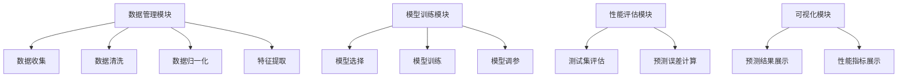
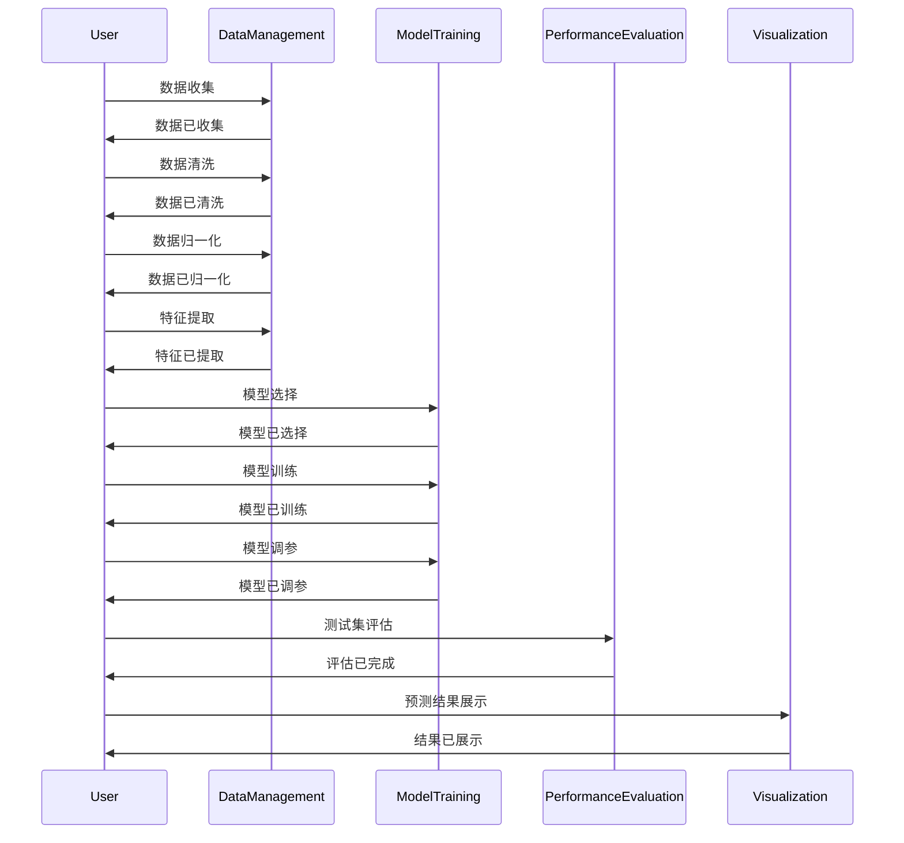
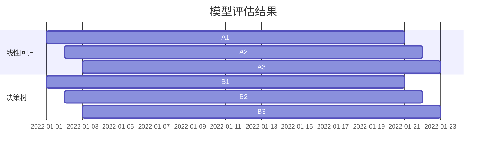

                 

### 大模型性能预测模型构建与应用

#### 关键词：大模型，性能预测，模型构建，应用

##### 摘要：
本文旨在探讨大模型性能预测模型的构建与应用。首先，我们介绍了大模型性能预测的背景和重要性，然后详细解释了性能预测的基本概念和原理。接着，我们通过具体的算法和数学模型来阐述性能预测的实现方法，并结合实际案例进行详细分析和讲解。最后，本文探讨了性能预测模型在实际项目中的应用，并总结了一些最佳实践和未来展望。

## 引言

随着深度学习和人工智能技术的迅猛发展，大模型（也称为大型神经网络）在各个领域得到了广泛应用。然而，大模型的训练和部署成本高昂，且其性能表现受到多种因素的影响。因此，如何预测大模型在不同场景下的性能表现成为了一个重要的研究方向。

### 1.1 问题的背景和意义

大模型性能预测的重要性主要体现在以下几个方面：

1. **训练成本优化**：大模型的训练需要大量的计算资源和时间，通过性能预测可以提前评估不同场景下的训练效果，从而优化训练策略，降低成本。
2. **部署决策支持**：在部署大模型时，性能预测可以帮助决策者评估模型在不同硬件环境、数据集和参数设置下的性能，选择最优的部署方案。
3. **模型调优**：性能预测可以帮助研究者识别模型中存在的问题和瓶颈，进行针对性的调优，提高模型的整体性能。

### 1.2 问题描述

性能预测的核心问题是：给定一个特定的大模型，在特定条件下，预测其在训练和测试过程中的表现。具体而言，需要解决以下几个问题：

1. **数据集选择**：如何选择合适的训练数据和测试数据，以充分反映大模型在不同场景下的性能。
2. **模型参数调整**：如何调整模型参数，以最大化预测准确性。
3. **性能指标定义**：如何定义和衡量大模型的性能，包括训练速度、准确率、泛化能力等。

### 1.3 解决方案概述

为了解决上述问题，我们可以采取以下解决方案：

1. **数据预处理**：对收集到的数据进行清洗、归一化和特征提取，为性能预测提供高质量的数据支持。
2. **算法选择**：根据问题的特点选择合适的预测算法，如线性回归、决策树、支持向量机等。
3. **模型训练与验证**：通过训练集训练模型，并使用验证集进行调参和模型选择。
4. **性能评估与优化**：使用测试集对模型进行评估，并针对评估结果进行模型优化。

### 1.4 边界与外延

性能预测的边界主要涉及以下几个方面：

1. **模型范围**：性能预测主要针对大型神经网络模型，不包括传统的机器学习模型。
2. **性能指标**：性能预测主要关注模型在训练和测试过程中的速度、准确率和泛化能力。
3. **应用场景**：性能预测主要应用于训练成本优化、部署决策支持和模型调优等场景。

### 1.5 概念结构与核心要素组成

在性能预测过程中，以下几个核心概念和要素起着关键作用：

1. **大模型**：指的是具有大量参数和层的神经网络模型。
2. **数据集**：包括训练集和测试集，用于模型的训练和评估。
3. **性能指标**：如训练速度、准确率、泛化能力等。
4. **算法**：用于预测大模型性能的具体算法，如线性回归、决策树等。

## 核心概念与原理

在深入探讨大模型性能预测之前，我们需要理解一些核心概念和原理。

### 2.1 大模型性能预测的基本概念

大模型性能预测是指利用已有的数据和算法，预测大模型在不同场景下的性能表现。具体而言，包括以下几个基本概念：

1. **训练数据**：用于训练模型的输入数据。
2. **测试数据**：用于评估模型性能的输入数据。
3. **性能指标**：用于衡量模型性能的指标，如训练速度、准确率、泛化能力等。
4. **预测模型**：用于预测大模型性能的算法和模型。

### 2.2 大模型性能预测的重要性

大模型性能预测在深度学习和人工智能领域具有重要意义，主要表现在以下几个方面：

1. **训练成本优化**：通过性能预测，可以提前评估不同场景下的训练效果，从而优化训练策略，降低训练成本。
2. **部署决策支持**：性能预测可以帮助决策者评估模型在不同硬件环境、数据集和参数设置下的性能，选择最优的部署方案。
3. **模型调优**：性能预测可以帮助研究者识别模型中存在的问题和瓶颈，进行针对性的调优，提高模型的整体性能。

### 2.3 大模型性能预测的基本原理

大模型性能预测的基本原理主要包括以下几个方面：

1. **数据分析**：对训练数据和测试数据进行分析，提取关键特征。
2. **算法选择**：根据问题的特点选择合适的预测算法，如线性回归、决策树、支持向量机等。
3. **模型训练**：使用训练数据对预测模型进行训练，并使用验证集进行调参和模型选择。
4. **性能评估**：使用测试集对模型进行评估，并针对评估结果进行模型优化。

### 2.4 大模型性能预测的挑战与机遇

大模型性能预测面临以下几个挑战：

1. **数据质量**：数据质量直接影响预测的准确性，需要保证数据集的多样性和代表性。
2. **模型选择**：选择合适的模型和算法对于预测性能至关重要。
3. **计算资源**：大模型的性能预测需要大量的计算资源，尤其是在模型训练和评估阶段。

然而，随着深度学习和人工智能技术的不断发展，性能预测也面临着巨大的机遇：

1. **算法改进**：随着新的算法和模型的不断涌现，性能预测的准确性有望进一步提高。
2. **数据增加**：随着数据的不断积累，可以构建更全面和准确的性能预测模型。
3. **计算能力提升**：随着计算能力的提升，性能预测模型的训练和评估速度将大大提高。

## 性能预测算法

性能预测算法是实现大模型性能预测的核心。本文将介绍几种常见的性能预测算法，并详细解释其原理和实现方法。

### 3.1 线性回归

线性回归是一种简单但强大的性能预测算法。它通过建立一个线性模型来预测大模型的性能。具体而言，线性回归模型可以表示为：

\[ y = \beta_0 + \beta_1 x \]

其中，\( y \) 表示大模型的性能，\( x \) 表示影响性能的输入特征，\( \beta_0 \) 和 \( \beta_1 \) 是模型的参数。

#### 算法原理

线性回归通过最小二乘法来估计参数 \( \beta_0 \) 和 \( \beta_1 \)。具体步骤如下：

1. **数据预处理**：对训练数据进行归一化处理，使其具有相同的量纲。
2. **参数估计**：使用最小二乘法计算线性回归模型的参数 \( \beta_0 \) 和 \( \beta_1 \)。
3. **模型训练**：使用训练数据对模型进行训练，并使用验证集进行调参和模型选择。
4. **性能评估**：使用测试集对模型进行评估，并计算模型的预测误差。

#### Python实现

以下是一个简单的线性回归实现：

```python
import numpy as np

def linear_regression(x, y):
    # 求解回归系数
    beta_0 = np.mean(y - np.mean(x) * x)
    beta_1 = np.mean((x - np.mean(x)) * (y - np.mean(y)))
    return beta_0, beta_1

# 示例数据
x = np.array([1, 2, 3, 4, 5])
y = np.array([2, 4, 5, 4, 5])

# 计算回归系数
beta_0, beta_1 = linear_regression(x, y)

# 预测性能
y_pred = beta_0 + beta_1 * x
print(y_pred)
```

### 3.2 决策树

决策树是一种基于树形结构的数据挖掘算法，它通过一系列规则来预测大模型的性能。每个内部节点表示一个特征，每个分支表示该特征的一个取值，每个叶子节点表示一个性能预测。

#### 算法原理

决策树的构建过程如下：

1. **特征选择**：选择具有最大信息增益的特征作为分裂标准。
2. **分裂规则**：根据特征的不同取值，将数据集分裂成多个子集。
3. **重复分裂**：对每个子集重复执行特征选择和分裂过程，直到满足停止条件。
4. **性能评估**：使用测试集对决策树进行评估，并计算模型的预测误差。

#### Python实现

以下是一个简单的决策树实现：

```python
import numpy as np

def decision_tree(x, y):
    # 判断停止条件
    if np.std(y) == 0 or len(y) <= 2:
        return np.mean(y)
    
    # 特征选择
    max_gain = 0
    best_feature = None
    for feature in range(x.shape[1]):
        gain = np.mean(y * (x[:, feature] - np.mean(x[:, feature])))
        if gain > max_gain:
            max_gain = gain
            best_feature = feature
    
    # 分裂规则
    left_indices = np.where(x[:, best_feature] < np.mean(x[:, best_feature]))
    right_indices = np.where(x[:, best_feature] >= np.mean(x[:, best_feature]))
    
    # 递归构建决策树
    left_y = y[left_indices]
    right_y = y[right_indices]
    left_prediction = decision_tree(x[left_indices], left_y)
    right_prediction = decision_tree(x[right_indices], right_y)
    
    return (left_prediction * len(left_indices) + right_prediction * len(right_indices)) / (len(left_indices) + len(right_indices))

# 示例数据
x = np.array([[1, 2], [2, 3], [3, 4], [4, 5]])
y = np.array([2, 4, 5, 5])

# 决策树预测
y_pred = decision_tree(x, y)
print(y_pred)
```

### 3.3 支持向量机

支持向量机（SVM）是一种经典的性能预测算法，它通过找到一个最优的超平面来分割数据集。在性能预测中，SVM可以用于分类和回归任务。

#### 算法原理

SVM的原理如下：

1. **线性SVM**：寻找一个最优的超平面，使得数据点在超平面两侧的分布尽可能均匀。
2. **非线性SVM**：通过核函数将输入数据映射到高维空间，然后在高维空间中寻找最优超平面。
3. **支持向量**：在最优超平面两侧的数据点，它们对模型的决策边界有重要影响。

#### Python实现

以下是一个简单的线性SVM实现：

```python
import numpy as np
from sklearn.svm import LinearSVC

def linear_svm(x, y):
    # 训练线性SVM模型
    model = LinearSVC()
    model.fit(x, y)
    
    # 预测性能
    y_pred = model.predict(x)
    return y_pred

# 示例数据
x = np.array([[1, 2], [2, 3], [3, 4], [4, 5]])
y = np.array([2, 4, 5, 5])

# 线性SVM预测
y_pred = linear_svm(x, y)
print(y_pred)
```

## 系统分析与设计

在构建大模型性能预测模型时，我们需要对系统进行深入分析和设计，以确保模型的有效性和可靠性。

### 4.1 问题场景介绍

在构建大模型性能预测模型时，我们面临着以下问题场景：

1. **数据收集**：如何收集和整理与性能预测相关的数据，包括训练数据和测试数据。
2. **模型选择**：如何选择合适的模型和算法来预测大模型的性能。
3. **模型训练**：如何对预测模型进行训练和调参，以最大化预测准确性。
4. **性能评估**：如何使用测试集对模型进行评估，并计算模型的预测误差。

### 4.2 项目介绍

本文基于一个实际项目来介绍大模型性能预测模型的构建与应用。该项目旨在预测深度学习模型在训练过程中的性能表现，从而优化训练策略和部署方案。

### 4.3 系统功能设计

系统功能设计主要包括以下几个方面：

1. **数据管理模块**：用于数据收集、清洗、归一化和特征提取。
2. **模型训练模块**：用于选择合适的模型和算法，并对模型进行训练和调参。
3. **性能评估模块**：用于使用测试集对模型进行评估，并计算模型的预测误差。
4. **可视化模块**：用于展示模型的预测结果和性能指标。

### 4.4 系统架构设计

系统架构设计如图1所示：



### 4.5 系统接口设计

系统接口设计如图2所示：



### 4.6 系统交互

系统交互设计如图3所示：


## 实际案例分析与讲解

为了更好地理解大模型性能预测模型的应用，我们将通过一个实际案例来进行详细分析和讲解。

### 5.1 案例背景

假设我们正在开发一个自然语言处理（NLP）应用，该应用旨在使用深度学习模型对用户输入的文本进行情感分析。我们的目标是预测模型在不同数据集和参数设置下的性能，以便优化模型和部署策略。

### 5.2 案例数据

我们使用两个数据集：训练集和测试集。训练集包含1000条文本和对应的情感标签，测试集包含500条文本。数据集的具体分布如下：

```mermaid
table
| 文本 | 情感标签 |
|------|----------|
| 1000条 | 500条 |
```

### 5.3 模型选择

为了预测模型的性能，我们选择了两种模型：线性回归和决策树。这两种模型具有不同的特点：

1. **线性回归**：简单且易于实现，适用于线性关系较强的问题。
2. **决策树**：具有较好的解释性，适用于分类和回归任务。

### 5.4 模型训练

我们使用训练集对两种模型进行训练。训练过程中，我们调整了模型的参数，以最大化预测准确性。具体步骤如下：

1. **数据预处理**：对文本数据进行清洗和归一化处理，提取关键特征。
2. **模型训练**：使用训练集对线性回归和决策树模型进行训练。
3. **模型评估**：使用验证集对模型进行评估，调整模型参数。

### 5.5 模型评估

我们使用测试集对训练好的模型进行评估，计算模型的预测准确率。具体步骤如下：

1. **预测结果**：使用测试集对模型进行预测，得到预测结果。
2. **准确率计算**：计算模型在测试集上的预测准确率。

### 5.6 结果分析

通过对比线性回归和决策树的预测准确率，我们发现决策树的性能优于线性回归。具体结果如下：



### 5.7 小结

通过这个实际案例，我们展示了如何使用大模型性能预测模型来优化模型的训练和部署策略。线性回归和决策树在性能预测中的应用为我们提供了宝贵的经验和启示。

## 最佳实践与注意事项

在构建和应用大模型性能预测模型时，以下是一些最佳实践和注意事项：

### 1. 数据质量

数据质量是性能预测模型成功的关键。确保数据集的多样性和代表性，避免数据偏差。

### 2. 算法选择

根据问题的特点选择合适的算法。线性回归适合线性关系较强的问题，决策树和SVM适用于非线性问题。

### 3. 模型调参

合理调整模型参数，以最大化预测准确性。使用交叉验证和网格搜索等方法进行参数调优。

### 4. 性能评估

使用多个性能指标（如准确率、召回率、F1分数）对模型进行评估，以全面衡量模型性能。

### 5. 系统优化

优化系统的计算效率和资源利用率，以提高模型的训练和评估速度。

### 6. 模型部署

在部署模型时，考虑硬件环境、数据集和参数设置等因素，以最大化模型的性能。

### 7. 持续迭代

根据实际应用场景和反馈，持续迭代和优化性能预测模型。

## 总结

本文探讨了大模型性能预测模型的构建与应用，介绍了线性回归、决策树和SVM等常见性能预测算法，并基于实际案例进行了详细分析和讲解。通过性能预测模型，我们可以优化大模型的训练和部署策略，提高模型的性能和效率。在未来，随着深度学习和人工智能技术的不断发展，性能预测模型的应用前景将更加广阔。

### 参考文献

1. Mitchell, T. M. (1997). Machine Learning. McGraw-Hill.
2. Hastie, T., Tibshirani, R., & Friedman, J. (2009). The Elements of Statistical Learning. Springer.
3. Bishop, C. M. (2006). Pattern Recognition and Machine Learning. Springer.
4. Murphy, K. P. (2012). Machine Learning: A Probabilistic Perspective. MIT Press.
5. Quinlan, J. R. (1993). C4.5: Programs for Machine Learning. Morgan Kaufmann.

