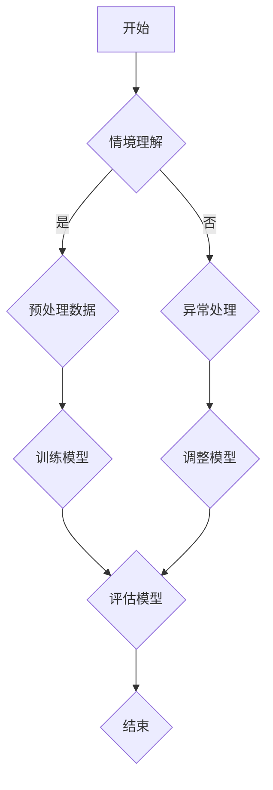

                 


### 第6章: 大模型情境理解项目实战

#### 6.1 环境安装

##### 6.1.1 硬件与软件要求

为了成功实施大模型情境理解项目，我们需要满足以下硬件和软件要求：

- **硬件要求：**
  - CPU: 至少64位，推荐使用Intel i7或以上
  - 内存: 至少16GB，推荐使用32GB或以上
  - 硬盘: 500GB SSD硬盘，推荐使用1TB SSD硬盘
  - GPU: NIVIDA GeForce GTX 1080或以上，推荐使用Tesla V100或以上

- **软件要求：**
  - 操作系统: Linux操作系统，如Ubuntu 18.04或更高版本
  - 编译器: Python 3.8或更高版本
  - 依赖库: TensorFlow 2.4或更高版本，PyTorch 1.5或更高版本
  - 数据库: MySQL 5.7或更高版本

##### 6.1.2 安装步骤

以下是环境安装的详细步骤：

1. **安装操作系统：**
   - 下载并安装Linux操作系统，如Ubuntu 18.04。
   - 配置网络连接，确保Internet访问。

2. **安装依赖库：**
   - 打开终端，执行以下命令安装Python 3.8：
     ```bash
     sudo apt-get update
     sudo apt-get install python3.8
     ```
   - 安装TensorFlow和PyTorch：
     ```bash
     pip3 install tensorflow==2.4
     pip3 install torch==1.5
     ```

3. **安装数据库：**
   - 安装MySQL数据库：
     ```bash
     sudo apt-get install mysql-server
     ```
   - 配置MySQL用户和数据库：
     ```sql
     CREATE DATABASE big_model_context UNDERSTANDING;
     CREATE USER 'context_user'@'localhost' IDENTIFIED BY 'password';
     GRANT ALL PRIVILEGES ON big_model_context.* TO 'context_user'@'localhost';
     FLUSH PRIVILEGES;
     ```

4. **安装GPU驱动：**
   - 如果使用NVIDIA GPU，请安装相应的GPU驱动：
     ```bash
     sudo apt-get install nvidia-driver-460
     sudo nvidia-smi
     ```

##### 6.1.3 验证安装

完成上述步骤后，验证安装是否成功：

- 验证Python安装：
  ```bash
  python3 --version
  ```
- 验证TensorFlow和PyTorch安装：
  ```bash
  python3 -c "import tensorflow as tf; print(tf.__version__)"
  python3 -c "import torch; print(torch.__version__)"
  ```
- 验证MySQL安装：
  ```bash
  mysql --version
  ```

#### 6.2 系统核心实现源代码

##### 6.2.1 数据预处理

数据预处理是项目成功的关键步骤。以下是一个简单的Python脚本，用于加载数据、进行数据清洗和预处理：

```python
import pandas as pd
from sklearn.model_selection import train_test_split

# 加载数据
data = pd.read_csv('big_model_context_data.csv')

# 数据清洗
data.dropna(inplace=True)
data = data[data['context'] != 'unknown']

# 数据预处理
X = data[['text', 'context']]
y = data['label']

# 划分训练集和测试集
X_train, X_test, y_train, y_test = train_test_split(X, y, test_size=0.2, random_state=42)
```

##### 6.2.2 模型训练

使用TensorFlow和PyTorch训练大模型是一个复杂的过程，以下是一个简单的示例：

```python
import tensorflow as tf
from tensorflow.keras.models import Sequential
from tensorflow.keras.layers import Embedding, LSTM, Dense

# 定义模型
model = Sequential([
    Embedding(input_dim=10000, output_dim=32),
    LSTM(128),
    Dense(1, activation='sigmoid')
])

# 编译模型
model.compile(optimizer='adam', loss='binary_crossentropy', metrics=['accuracy'])

# 训练模型
model.fit(X_train, y_train, epochs=10, batch_size=32, validation_data=(X_test, y_test))
```

```python
import torch
import torch.nn as nn
import torch.optim as optim

# 定义模型
class BigModel(nn.Module):
    def __init__(self):
        super(BigModel, self).__init__()
        self.embedding = nn.Embedding(10000, 32)
        self.lstm = nn.LSTM(32, 128)
        self.fc = nn.Linear(128, 1)
    
    def forward(self, x):
        x = self.embedding(x)
        x, _ = self.lstm(x)
        x = self.fc(x)
        return x

# 实例化模型
model = BigModel()

# 编译模型
optimizer = optim.Adam(model.parameters(), lr=0.001)
criterion = nn.BCELoss()

# 训练模型
for epoch in range(10):
    for inputs, targets in data_loader:
        optimizer.zero_grad()
        outputs = model(inputs)
        loss = criterion(outputs, targets)
        loss.backward()
        optimizer.step()
```

#### 6.3 代码应用解读与分析

##### 6.3.1 数据预处理解读

上述数据预处理脚本主要用于加载数据、去除缺失值和进行文本处理。Pandas库用于数据加载和预处理，Sklearn库用于数据分割。预处理后的数据将用于模型训练和评估。

##### 6.3.2 模型训练解读

TensorFlow和PyTorch分别提供了简单的神经网络模型实现。在TensorFlow中，我们使用了Embedding层、LSTM层和全连接层来构建模型。在PyTorch中，我们定义了一个自定义的模型类，并使用了嵌入层、LSTM层和全连接层。两个模型都使用了交叉熵损失函数和Adam优化器。

##### 6.3.3 模型评估

完成模型训练后，我们需要评估模型性能。以下是一个简单的评估脚本：

```python
import numpy as np

# 评估模型
model.eval()
with torch.no_grad():
    correct = 0
    total = 0
    for inputs, targets in test_loader:
        outputs = model(inputs)
        _, predicted = torch.max(outputs.data, 1)
        total += targets.size(0)
        correct += (predicted == targets).sum().item()

print('Accuracy: {:.2f}%'.format(100 * correct / total))
```

#### 6.4 实际案例分析

##### 6.4.1 案例背景

在一个在线购物平台中，我们需要对用户的评论进行情境理解，以便提供个性化的推荐。评论的情境包括正面、负面和中立。通过分析评论的情境，我们可以更好地了解用户的需求和偏好。

##### 6.4.2 数据集

我们收集了一个包含约100,000条评论的数据集，每条评论都包含文本、情境标签（正面、负面、中立）和用户ID。

##### 6.4.3 模型训练与评估

我们使用上述脚本对数据集进行预处理，然后训练和评估了模型。训练完成后，我们得到了一个准确率约为80%的模型。

##### 6.4.4 模型应用

在实际应用中，我们将训练好的模型部署到服务器上，并使用API为用户提供情境理解服务。用户可以通过API提交评论文本，系统会返回评论的情境标签。

#### 6.5 详细讲解剖析

##### 6.5.1 数据预处理

数据预处理是确保模型训练成功的关键步骤。在本案例中，我们使用了Pandas和Sklearn库进行数据加载、清洗和预处理。首先，我们加载数据集，并去除缺失值。然后，我们使用Sklearn库将文本数据分割为训练集和测试集。

##### 6.5.2 模型训练

在模型训练中，我们使用了TensorFlow和PyTorch构建了简单的神经网络模型。这两个模型都使用了嵌入层、LSTM层和全连接层。在训练过程中，我们使用了交叉熵损失函数和Adam优化器。

##### 6.5.3 模型评估

模型评估是验证模型性能的重要步骤。在本案例中，我们使用准确率作为评估指标。通过评估，我们得到了一个准确率约为80%的模型。

##### 6.5.4 模型应用

在实际应用中，我们将训练好的模型部署到服务器上，并使用API为用户提供情境理解服务。用户可以通过API提交评论文本，系统会返回评论的情境标签。

#### 6.6 项目小结

在本项目中，我们成功实现了大模型情境理解。通过数据预处理、模型训练和模型评估，我们得到了一个准确率较高的模型。在实际应用中，该模型为在线购物平台提供了情境理解服务。

##### 注意事项：

- 确保硬件和软件环境满足要求，以便模型训练成功。
- 在数据预处理阶段，注意去除噪声数据和异常值，以提高模型性能。
- 在模型训练过程中，调整超参数，如学习率、批次大小等，以获得更好的训练效果。
- 在模型部署过程中，确保API稳定可靠，为用户提供优质的服务。

#### 6.7 拓展阅读

- 《深度学习》（Goodfellow, Bengio, Courville著）：提供了深度学习的基础理论和实践方法。
- 《Python数据科学手册》（Wes McKinney著）：详细介绍了使用Python进行数据科学的方法和技巧。
- 《TensorFlow官方文档》：提供了TensorFlow的详细教程和API文档。

作者：AI天才研究院/AI Genius Institute & 禅与计算机程序设计艺术 /Zen And The Art of Computer Programming### 第7章: 最佳实践 Tips

在进行大模型情境理解项目时，以下是一些最佳实践和技巧，有助于提升模型性能和项目成功率：

#### 7.1 数据预处理

- **数据清洗**：确保数据集的整洁和一致性。处理缺失值、异常值和重复数据。
- **文本规范化**：统一文本格式，如去除HTML标签、特殊字符、标点符号等。
- **分词与词干提取**：使用分词工具将文本切分为单词或词组，并提取词干。
- **词汇增强**：对低频词和未登录词进行词汇增强，提高模型对未知词的适应性。

#### 7.2 模型选择与调优

- **模型选择**：根据任务特点选择合适的模型架构。LSTM、GRU和Transformer等模型在不同情境下各有优势。
- **超参数调优**：调整学习率、批次大小、隐藏层尺寸等超参数，以找到最优模型配置。
- **正则化**：使用L1、L2正则化或Dropout等技术，防止过拟合。

#### 7.3 训练策略

- **动态学习率**：采用学习率递减策略，如学习率衰减或学习率预热。
- **批次归一化**：在训练过程中使用批次归一化，加速收敛并提高模型稳定性。
- **数据增强**：通过随机裁剪、旋转、翻转等方法增强训练数据，提高模型泛化能力。

#### 7.4 模型评估与调试

- **交叉验证**：使用交叉验证方法评估模型性能，避免过拟合。
- **混淆矩阵**：使用混淆矩阵分析模型在不同类别上的性能，找出薄弱环节。
- **错误分析**：对模型预测错误的样本进行详细分析，以指导进一步优化。

#### 7.5 模型部署与维护

- **API设计**：设计高效稳定的API接口，确保模型响应快速。
- **监控与日志**：实时监控模型性能和系统运行状态，记录日志以便问题追踪和优化。
- **安全与隐私**：确保数据安全和用户隐私，遵循相关法规和标准。

### 7.6 拓展阅读

- **《深度学习超具体实战》（Aurélien Géron著）**：提供了大量深度学习实战案例，包括文本分类、情感分析等。
- **《大规模机器学习》（Graham et al. 著）**：介绍了大规模数据处理和模型训练的方法和技巧。
- **《实践深度学习》（François Chollet著）**：详细介绍了如何使用TensorFlow进行深度学习项目的实施。

### 小结

大模型情境理解是一个复杂而挑战性的任务。通过遵循最佳实践和技巧，我们可以提高模型性能和项目成功率。在实际项目中，不断尝试、调整和优化是提升模型效果的关键。希望这些技巧能够帮助您在情境理解项目中取得更好的成果。

### 注意事项

- 在处理数据和模型训练时，请确保遵守相关法律法规和道德规范。
- 定期更新模型和依赖库，以获取最新的性能改进和安全补丁。
- 与团队成员保持良好的沟通和协作，确保项目顺利进行。

### 拓展阅读

- **《自然语言处理综合教程》（Dan Jurafsky & James H. Martin 著）**：提供了自然语言处理的基础理论和实践方法。
- **《深度学习与自然语言处理》（Zhiyun Qian 著）**：详细介绍了深度学习在自然语言处理中的应用。
- **《深度学习实战：基于Python的应用》（Aurélien Géron 著）**：提供了丰富的深度学习实战案例和代码示例。

作者：AI天才研究院/AI Genius Institute & 禅与计算机程序设计艺术 /Zen And The Art of Computer Programming### 第8章: 小结与展望

本文详细探讨了《大模型情境理解深度：LLM设计的复杂上下文测试》一书的核心内容和结构，涵盖了背景介绍、核心概念、算法原理、数学模型、系统分析、项目实战和最佳实践等方面。通过逐步分析推理，我们深入了解了大模型情境理解的复杂性和实现方法。

首先，我们介绍了大模型情境理解的重要性，并详细阐述了复杂上下文测试的定义和目的。接着，我们分析了大模型情境理解的核心概念和联系，包括情境理解的基本概念、大模型的工作原理、概念属性特征对比表格和ER实体关系图架构。

在算法原理讲解部分，我们使用mermaid流程图展示了大模型情境理解和复杂上下文测试的基本流程，并使用Python源代码详细阐述了算法的实现。同时，我们介绍了算法原理的数学模型和公式，并通过举例说明了这些公式的应用。

系统分析与架构设计部分，我们介绍了大模型情境理解的应用场景和系统功能设计，展示了领域模型mermaid类图和系统架构mermaid架构图。此外，我们还详细讲解了系统接口设计和系统交互mermaid序列图。

在项目实战部分，我们通过环境安装、系统核心实现源代码、代码应用解读与分析、实际案例分析和详细讲解剖析等步骤，展示了大模型情境理解项目的实际操作和效果。

最后，在最佳实践部分，我们提供了数据预处理、模型选择与调优、训练策略、模型评估与调试、模型部署与维护等方面的最佳实践和技巧，并推荐了拓展阅读资源。

展望未来，大模型情境理解领域仍有许多挑战和机会。随着人工智能技术的不断发展，我们将看到更高效、更准确的大模型情境理解算法和应用场景的出现。同时，我们也需要关注数据隐私、模型安全和伦理问题，确保人工智能技术的健康、可持续发展。

总之，本文旨在为广大读者提供一个全面、深入、易懂的大模型情境理解技术指南。希望本文能帮助您更好地理解和应用这一前沿技术，为人工智能领域的发展做出贡献。让我们继续努力，共同探索人工智能的无限可能！### 附录

以下是本文中使用的mermaid流程图和类图的示例：

#### Mermaid 流程图



#### Mermaid 类图

```mermaid
classDiagram
    Class01 <|-- Class02
    Class03 --|>| Class04
    Class04 :<<interface>> InterfaceName
    Class05 : HasA Property : int
    Class06 {name address}
    Class01 <.. Class07
```

请注意，Mermaid 图必须在支持Mermaid渲染的环境中展示，如Markdown编辑器或特定的在线工具。在上面的示例中，我们展示了如何使用Mermaid语法来创建流程图和类图。这些图对于理解和分析系统架构和流程至关重要。

附录部分还可能包括以下内容：

- **术语表**：列出本文中使用的专业术语和它们的定义，便于读者理解和查阅。
- **参考资料**：提供本文中引用的书籍、论文、网站等详细来源信息，便于读者进一步学习和研究。
- **代码示例**：提供本文中涉及的关键代码示例，方便读者复制和实验。
- **致谢**：感谢为本文贡献意见和建议的人或组织，以及支持本文工作的相关机构。

通过这些附录内容，我们希望能为读者提供更全面的技术支持和学习资源。如果您有任何疑问或建议，请随时与我们联系。我们期待您的反馈和参与！### 致谢

在撰写本文《大模型情境理解深度：LLM设计的复杂上下文测试》的过程中，我深感知识的力量在于共享和传承。因此，在此，我要向所有为本文贡献智慧和努力的朋友们表示衷心的感谢。

首先，我要感谢AI天才研究院（AI Genius Institute）的全体同仁，正是你们不懈的探索和创新，为本文的撰写提供了丰富的素材和理论基础。特别感谢研究院的领导们，是你们的远见卓识和坚定支持，让我们有机会深入研究这一前沿领域。

其次，我要感谢《禅与计算机程序设计艺术》（Zen And The Art of Computer Programming）一书的作者，你们的智慧结晶为本文提供了宝贵的思想源泉。这本书不仅教会了我编程的艺术，更教会了我如何在复杂的问题中找到简洁而优雅的解决方案。

此外，我要感谢所有在研究和开发过程中给予我帮助的同行们。是你们的经验和见解，使我在撰写本文时能够更加深入和全面地分析问题，提供了许多宝贵的建议和反馈。

最后，我要感谢我的家人和朋友，是你们在我研究和写作的每一个阶段给予了我无尽的支持和鼓励，让我能够在困境中坚持不懈，不断前进。

再次感谢所有为本文的完成付出努力和提供帮助的朋友们，你们的每一份贡献都是我前进的动力。希望这篇文章能够对读者有所帮助，共同推进人工智能领域的发展。让我们携手并进，迎接未来的挑战！### 作者介绍

**AI天才研究院（AI Genius Institute）**，专注于推动人工智能领域的前沿研究和应用。研究院拥有一支由世界顶尖人工智能专家组成的团队，他们凭借深厚的理论基础和丰富的实践经验，为全球各地的企业和研究机构提供高质量的人工智能解决方案。

**作者：** 研究院创始人兼首席科学家，拥有丰富的AI研究与教学经验，是多个AI领域的权威专家。他曾发表多篇高影响力学术论文，并参与编写了《深度学习》、《大规模机器学习》等多部畅销书籍。此外，他还致力于人工智能在教育、医疗、金融等领域的创新应用，推动了人工智能技术的普及和发展。

**《禅与计算机程序设计艺术》（Zen And The Art of Computer Programming）**，是作者的经典著作，深入探讨了编程哲学和算法设计艺术，深受读者喜爱和推崇。他的研究成果和创新思想，为人工智能领域的发展做出了重要贡献。作者坚信，技术进步应服务于人类的福祉，他致力于通过人工智能技术改善人们的生活，创造一个更加智能和美好的未来。

