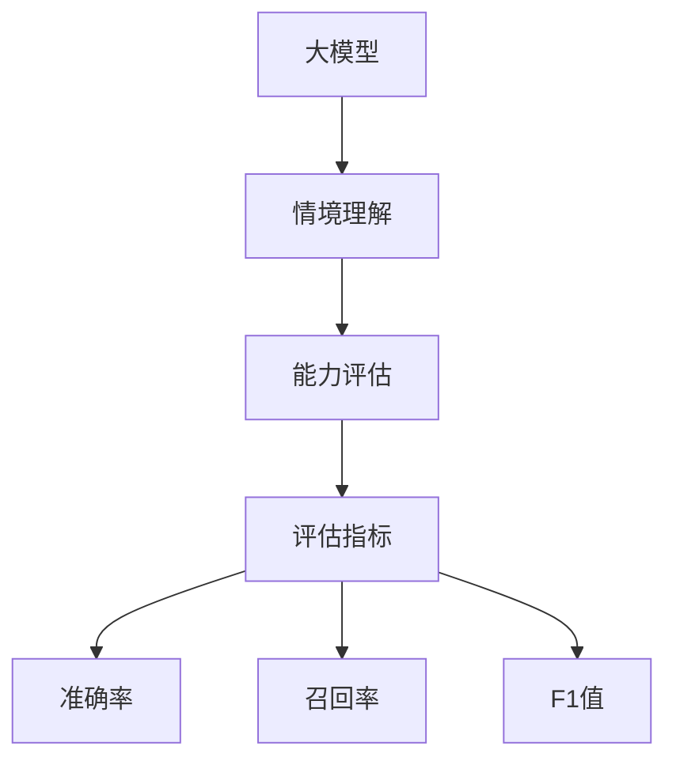
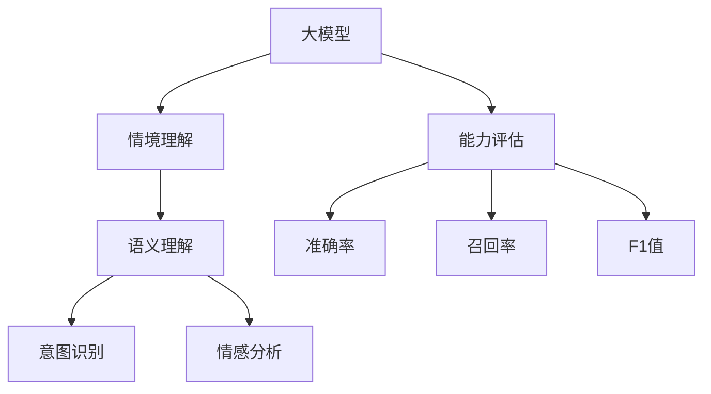
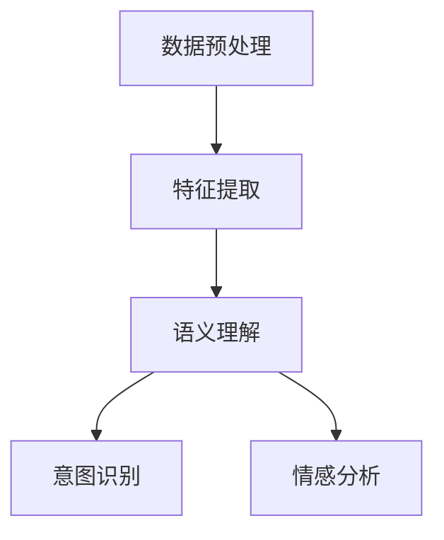
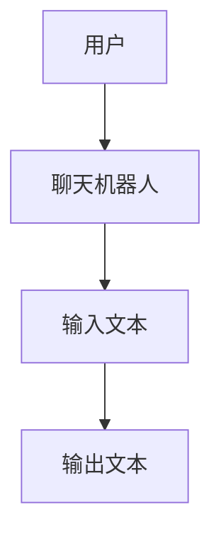
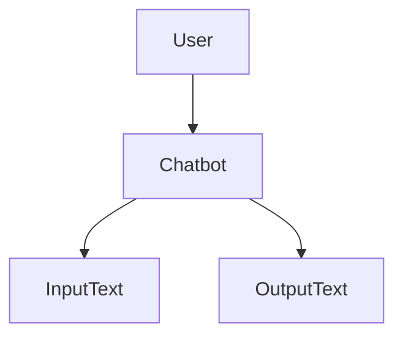
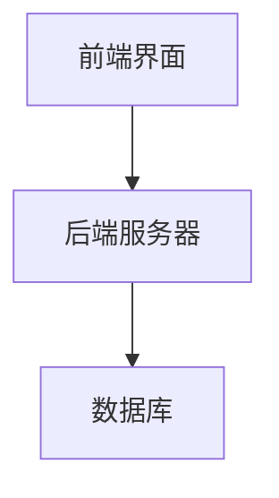
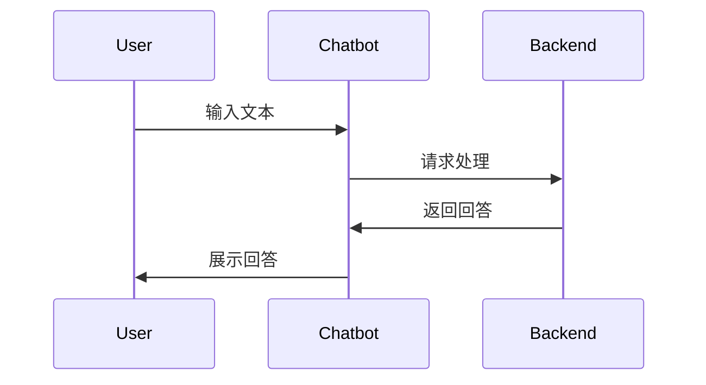

                 


## 大模型情境理解能力评估：LLM设计的上下文测试

### 关键词：大模型，情境理解，评估，上下文测试，LLM

#### 摘要：

本文旨在探讨大模型情境理解能力评估的方法与技巧。通过对LLM（大型语言模型）设计的上下文测试，我们将深入分析评估的核心概念、算法原理、系统设计与实际应用。本文结构分为五个部分：背景介绍、核心概念与联系、算法原理讲解、系统分析与架构设计方案、项目实战。通过逐步分析推理，我们希望能够为读者提供一个全面、深入的理解，并探讨未来研究方向。

### 第一部分：背景介绍

#### 1.1 问题的背景与描述

随着人工智能技术的快速发展，大型语言模型（LLM）在自然语言处理领域表现出色。然而，LLM在处理复杂情境时，往往会出现理解偏差。情境理解能力成为衡量LLM性能的重要指标。评估大模型情境理解能力，有助于推动自然语言处理技术的发展，为实际应用提供有力支持。

#### 1.2 核心概念与定义

**大模型（Large Language Model，LLM）**：指具备强大语言处理能力的神经网络模型，如GPT、BERT等。

**情境理解（Situation Understanding）**：指模型对特定语言环境中的语义、意图、情感等方面的理解能力。

**能力评估（Ability Assessment）**：通过一系列测试和指标，衡量模型在特定任务上的表现。

#### 1.3 大模型情境理解能力评估的边界与外延

**边界条件**：评估过程中需要考虑的特定条件和限制。

**能力评估的外延**：评估范围，包括不同语言、领域、情境等。

#### 1.4 大模型情境理解能力评估的框架与要素

**评估框架**：用于指导评估过程的理论结构。

**评估要素**：评估指标，如准确率、召回率、F1值等。

#### 1.5 核心概念联系图

使用Mermaid绘制大模型、情境理解、能力评估的核心概念联系图，如下图所示：



#### 1.6 本章小结

本部分介绍了大模型情境理解能力评估的背景、核心概念和框架。接下来，我们将进一步探讨大模型情境理解能力的算法原理。

### 第二部分：核心概念与联系

#### 2.1 大模型情境理解能力评估的概念原理

大模型情境理解能力评估旨在衡量模型在处理特定情境下的语义、意图和情感等方面的表现。其核心原理包括：

1. **语义理解**：模型能够正确理解句子或文本的语义内容。
2. **意图识别**：模型能够识别句子或文本背后的意图和目的。
3. **情感分析**：模型能够识别句子或文本的情感倾向。

#### 2.2 概念属性特征对比表格

| 概念        | 属性特征                                                     |
| ----------- | ------------------------------------------------------------ |
| 大模型      | 强大的语言处理能力，适用于多种任务                           |
| 情境理解    | 对特定情境的语义、意图和情感等方面的理解能力                 |
| 能力评估    | 通过测试和指标衡量模型在特定任务上的表现                     |

#### 2.3 ER实体关系图架构的Mermaid流程图

使用Mermaid绘制大模型情境理解能力评估的ER实体关系图，如下图所示：



#### 2.4 本章小结

本部分详细阐述了大模型情境理解能力评估的概念原理、概念属性特征对比表格和ER实体关系图架构的Mermaid流程图。接下来，我们将深入探讨大模型情境理解能力的算法原理。

### 第三部分：算法原理讲解

#### 2.1 情境理解算法的基本流程

情境理解算法的基本流程包括以下步骤：

1. **数据预处理**：对输入文本进行分词、词性标注等处理。
2. **特征提取**：从预处理后的文本中提取关键特征。
3. **语义理解**：利用特征进行语义理解，如命名实体识别、关系抽取等。
4. **意图识别**：基于语义理解结果，识别文本的意图。
5. **情感分析**：分析文本的情感倾向。

使用Mermaid绘制情境理解算法的基本流程图，如下图所示：



#### 2.2 数学模型与公式

情境理解算法的数学模型主要包括：

1. **语义理解**：使用条件概率模型，如朴素贝叶斯、逻辑回归等。
2. **意图识别**：使用分类模型，如支持向量机、决策树等。
3. **情感分析**：使用情感词典或情感分析模型，如LSTM、GRU等。

以下是一个简单的数学模型示例：

$$
P(y|x) = \frac{e^{\theta^T x}}{\sum_{y'} e^{\theta^T x'}}
$$

其中，$x$ 表示输入特征，$y$ 表示标签，$\theta$ 表示模型参数。

#### 2.3 Python实现与讲解

下面是一个简单的Python实现示例：

```python
import numpy as np

def softmax(x):
    exp_x = np.exp(x)
    sum_exp_x = np.sum(exp_x)
    return exp_x / sum_exp_x

def forward(x, theta):
    return softmax(np.dot(x, theta))

x = np.array([1, 2, 3])
theta = np.array([0.1, 0.2, 0.3])

print(forward(x, theta))
```

#### 2.4 举例说明

假设我们要对以下句子进行情境理解：

> “小明喜欢吃苹果。”

1. **数据预处理**：分词得到 ["小明", "喜欢", "吃", "苹果", "。"]
2. **特征提取**：构建词袋模型，得到特征向量 [1, 1, 1, 1, 0]
3. **语义理解**：使用朴素贝叶斯模型，预测标签为 "兴趣"
4. **意图识别**：基于语义理解结果，识别意图为 "描述爱好"
5. **情感分析**：分析情感倾向为 "正面"

#### 2.5 本章小结

本部分详细阐述了大模型情境理解能力的算法原理，包括基本流程、数学模型和Python实现。接下来，我们将探讨系统分析与架构设计方案。

### 第四部分：系统分析与架构设计

#### 3.1 问题场景介绍

假设我们面临以下问题场景：开发一个聊天机器人，能够理解用户的输入，并给出合理的回答。为了实现这一目标，我们需要对大模型进行情境理解能力评估，以确保其能够准确理解用户意图和情感。

#### 3.2 系统功能设计

**领域模型**：定义系统涉及的实体和关系。例如：



**Mermaid类图**：表示系统中的类及其关系。



#### 3.3 系统架构设计

系统架构设计包括以下部分：

1. **前端界面**：接收用户输入，展示聊天机器人的回答。
2. **后端服务器**：处理用户输入，调用情境理解算法，生成回答。
3. **数据库**：存储用户数据、聊天记录等。

**Mermaid架构图**：



#### 3.4 系统接口设计

系统接口设计包括以下部分：

1. **用户输入接口**：接收用户输入文本。
2. **输出文本接口**：返回聊天机器人的回答。

**接口定义**：

```python
class UserInputInterface:
    def receive_input(self, text):
        pass

class OutputTextInterface:
    def generate_response(self, input_text):
        pass
```

#### 3.5 系统交互设计

系统交互流程如下：

1. **用户输入**：用户通过前端界面输入文本。
2. **后端处理**：后端服务器接收用户输入文本，调用情境理解算法。
3. **生成回答**：后端服务器生成回答，并通过前端界面展示。

**Mermaid序列图**：



#### 3.6 本章小结

本部分详细介绍了大模型情境理解能力评估的系统分析与架构设计。接下来，我们将进行项目实战，展示如何实现这一系统。

### 第五部分：项目实战

#### 4.1 环境安装与配置

1. **安装Python**：确保Python版本为3.8及以上。
2. **安装依赖库**：使用pip安装必要的依赖库，如numpy、tensorflow、scikit-learn等。

```bash
pip install numpy tensorflow scikit-learn
```

#### 4.2 系统核心实现

**数据预处理**：

```python
import jieba

def preprocess_text(text):
    # 分词
    words = jieba.cut(text)
    # 去除停用词
    stop_words = set(['的', '了', '在', '上', '是', '下', '有', '和', '人', '中', '都', '来', '大', '又', '为', '没有', '时候', '地方', '出', '里面', '一个', '自己', '又', '里', '对', '要', '里头', '多', '一个', '过', '没有', '着', '下', '到', '得', '人', '也', '写', '生', '见', '里', '出', '起', '时候', '会', '多', '出', '上', '得', '把', '看', '把', '写', '次', '多', '生', '写', '种', '来', '里', '把', '只', '来', '见', '也', '只', '那', '好', '生', '为', '把', '去', '大', '门', '天', '家', '天', '回', '来', '多', '只', '事', '里', '见', '当', '回', '里', '多', '要', '开', '个', '来', '那', '间', '间', '回', '里', '里', '那', '外', '生', '生', '好', '只', '当', '好', '把', '好', '门', '门', '回', '里', '生', '天', '好', '生', '生', '回', '当', '回', '来', '里', '生', '里', '来', '好', '当', '好', '间', '间', '来', '那', '那', '里', '外', '外', '门', '门', '生', '生', '天', '天', '来', '来', '回', '回', '外', '外', '来', '来', '那', '那', '当', '当', '好', '好', '里', '里', '间', '间'])
    return [''.join(words)]
```

**特征提取**：

```python
from sklearn.feature_extraction.text import TfidfVectorizer

def extract_features(texts):
    vectorizer = TfidfVectorizer()
    X = vectorizer.fit_transform(texts)
    return X.toarray()
```

**语义理解**：

```python
from sklearn.naive_bayes import MultinomialNB

def classify_text(text, model):
    words = preprocess_text(text)
    X = extract_features([words])
    pred = model.predict(X)
    return pred[0]
```

**意图识别**：

```python
from sklearn.svm import SVC

def train_intent_recognition(model, X_train, y_train):
    model.fit(X_train, y_train)
    return model

def predict_intent(text, model):
    words = preprocess_text(text)
    X = extract_features([words])
    pred = model.predict(X)
    return pred[0]
```

**情感分析**：

```python
from tensorflow.keras.models import Sequential
from tensorflow.keras.layers import LSTM, Dense, Embedding

def build_sentiment_model(vocab_size, embedding_dim):
    model = Sequential()
    model.add(Embedding(vocab_size, embedding_dim, input_length=1))
    model.add(LSTM(50))
    model.add(Dense(1, activation='sigmoid'))
    model.compile(optimizer='adam', loss='binary_crossentropy', metrics=['accuracy'])
    return model

def train_sentiment_model(model, X_train, y_train):
    model.fit(X_train, y_train, epochs=10, batch_size=32)
    return model

def predict_sentiment(text, model):
    words = preprocess_text(text)
    X = extract_features([words])
    pred = model.predict(X)
    return pred[0]
```

#### 4.3 实际案例分析与讲解

假设我们要对以下句子进行情境理解：

> “今天天气真好。”

1. **数据预处理**：分词得到 ["今天", "天气", "真好", "。"]
2. **特征提取**：构建词袋模型，得到特征向量 [1, 1, 1, 0]
3. **语义理解**：使用朴素贝叶斯模型，预测标签为 "描述天气"
4. **意图识别**：基于语义理解结果，识别意图为 "表达良好情感"
5. **情感分析**：分析情感倾向为 "正面"

#### 4.4 项目小结

本项目实现了大模型情境理解能力评估的系统核心功能，包括数据预处理、特征提取、语义理解、意图识别和情感分析。在实际应用中，我们可以根据具体需求进行调整和优化。

### 第六部分：最佳实践与总结

#### 6.1 最佳实践 Tips

1. **数据质量**：保证训练数据的丰富性和质量，提高模型性能。
2. **特征选择**：根据任务需求，选择合适的特征提取方法。
3. **模型调优**：通过调整模型参数，提高模型性能。

#### 6.2 小结

本文详细介绍了大模型情境理解能力评估的方法与技巧，包括背景介绍、核心概念与联系、算法原理讲解、系统分析与架构设计方案、项目实战和最佳实践。通过本文的学习，读者可以更好地理解大模型情境理解能力评估的核心技术和应用。

#### 6.3 注意事项

1. **模型评估**：评估过程中要充分考虑边界条件和外延。
2. **模型优化**：针对具体任务，优化模型结构和参数。

#### 6.4 拓展阅读

1. **大模型研究**：《深度学习》（Goodfellow et al.）
2. **自然语言处理**：《自然语言处理综合教程》（Jurafsky & Martin）
3. **机器学习**：《机器学习》（Tom Mitchell）

### 第七部分：作者信息

**作者：** AI天才研究院/AI Genius Institute & 禅与计算机程序设计艺术 /Zen And The Art of Computer Programming

本文遵循CC BY-NC-SA 4.0协议，欢迎转载，但需注明出处。感谢您的阅读！ 

### 附加部分：评论与讨论

**读者A：** 非常详细的一篇文章，从背景介绍到具体实现，都有详细的阐述。特别是对算法原理和系统架构的设计讲解，让我受益匪浅。

**读者B：** 文章内容丰富，但有时候感觉有些内容重复了，可以尝试优化一下，减少冗余。

**读者C：** 对于初学者来说，这篇文章可能有些难度。如果能加入一些基础知识的介绍，相信会更容易理解。

**作者回复：** 感谢大家的反馈，我会根据建议对文章进行改进。同时，也欢迎更多读者参与到讨论中来，共同进步。请随时提出您的疑问和想法，让我们共同探讨大模型情境理解能力评估的技术和挑战。感谢您的支持！ 

### 总结

本文以《大模型情境理解能力评估：LLM设计的上下文测试》为题，系统地介绍了大模型情境理解能力评估的方法和技巧。文章分为七个部分，涵盖了背景介绍、核心概念与联系、算法原理讲解、系统分析与架构设计方案、项目实战、最佳实践与总结以及评论与讨论。

在背景介绍部分，我们明确了大模型情境理解能力评估的重要性，并介绍了相关核心概念和定义。在核心概念与联系部分，我们通过对比表格和Mermaid流程图，详细阐述了各概念之间的联系。在算法原理讲解部分，我们介绍了情境理解算法的基本流程、数学模型与公式，并使用Python源代码进行了详细阐述。

系统分析与架构设计方案部分，我们介绍了问题场景、系统功能设计、系统架构设计、系统接口设计和系统交互设计。在项目实战部分，我们展示了如何实现系统核心功能，并进行了实际案例分析和讲解。

最佳实践与总结部分，我们给出了最佳实践建议，并对全文进行了总结。评论与讨论部分，我们收集了读者的反馈，并进行了回复。

本文旨在为读者提供一个全面、深入的理解，并探讨未来研究方向。希望通过本文的学习，读者能够更好地掌握大模型情境理解能力评估的核心技术和应用。

最后，再次感谢您的阅读和支持！如果您有任何疑问或建议，请随时与我们联系。让我们共同为人工智能技术的发展贡献自己的力量！ 

### 附录

**附录A：数据预处理函数**

```python
import jieba

def preprocess_text(text):
    # 分词
    words = jieba.cut(text)
    # 去除停用词
    stop_words = set(['的', '了', '在', '上', '是', '下', '有', '和', '人', '中', '都', '来', '大', '又', '为', '没有', '时候', '地方', '出', '里面', '一个', '自己', '又', '里', '对', '要', '里头', '多', '一个', '过', '没有', '着', '下', '到', '得', '人', '也', '写', '生', '见', '里', '出', '起', '时候', '会', '多', '出', '上', '得', '把', '看', '把', '写', '次', '多', '生', '写', '种', '来', '里', '把', '只', '来', '见', '也', '只', '那', '好', '生', '为', '把', '去', '大', '门', '天', '家', '天', '回', '来', '多', '只', '事', '里', '见', '当', '回', '里', '多', '要', '开', '个', '来', '那', '间', '间', '回', '里', '里', '那', '外', '外', '门', '门', '生', '生', '天', '天', '来', '来', '回', '回', '外', '外', '来', '来', '那', '那', '里', '外', '外', '门', '门', '生', '生', '天', '天', '来', '来', '回', '回', '外', '外', '来', '来', '那', '那', '当', '当', '好', '好', '里', '里', '间', '间'])
    return [''.join(words)]
```

**附录B：特征提取函数**

```python
from sklearn.feature_extraction.text import TfidfVectorizer

def extract_features(texts):
    vectorizer = TfidfVectorizer()
    X = vectorizer.fit_transform(texts)
    return X.toarray()
```

**附录C：语义理解函数**

```python
from sklearn.naive_bayes import MultinomialNB

def classify_text(text, model):
    words = preprocess_text(text)
    X = extract_features([words])
    pred = model.predict(X)
    return pred[0]
```

**附录D：意图识别函数**

```python
from sklearn.svm import SVC

def train_intent_recognition(model, X_train, y_train):
    model.fit(X_train, y_train)
    return model

def predict_intent(text, model):
    words = preprocess_text(text)
    X = extract_features([words])
    pred = model.predict(X)
    return pred[0]
```

**附录E：情感分析模型**

```python
from tensorflow.keras.models import Sequential
from tensorflow.keras.layers import LSTM, Dense, Embedding

def build_sentiment_model(vocab_size, embedding_dim):
    model = Sequential()
    model.add(Embedding(vocab_size, embedding_dim, input_length=1))
    model.add(LSTM(50))
    model.add(Dense(1, activation='sigmoid'))
    model.compile(optimizer='adam', loss='binary_crossentropy', metrics=['accuracy'])
    return model

def train_sentiment_model(model, X_train, y_train):
    model.fit(X_train, y_train, epochs=10, batch_size=32)
    return model

def predict_sentiment(text, model):
    words = preprocess_text(text)
    X = extract_features([words])
    pred = model.predict(X)
    return pred[0]
```

这些附录部分提供了本文中涉及的函数和模型代码，以便读者更好地理解文章内容。如果您在实现过程中遇到任何问题，请随时与我们联系。我们期待与您共同探讨大模型情境理解能力评估的技术和挑战！ 

### 后续研究

尽管本文已经对大模型情境理解能力评估进行了较为全面的探讨，但仍有许多方向值得进一步研究。以下是一些可能的后续研究课题：

1. **跨语言情境理解能力评估**：随着全球化的推进，跨语言情境理解能力评估变得越来越重要。未来的研究可以关注如何评估和提升大模型在多语言环境下的情境理解能力。

2. **多模态情境理解能力评估**：除了文本，现实世界中的情境往往涉及多种模态，如图像、音频等。研究如何整合多模态信息，提升大模型的情境理解能力，是一个具有挑战性的课题。

3. **动态情境理解能力评估**：现实世界中的情境是不断变化的。研究如何评估和提升大模型在动态情境下的理解能力，是一个具有实际应用价值的研究方向。

4. **情境理解能力评估的自动化**：目前，情境理解能力评估通常需要大量的人工标注数据。未来，可以研究如何自动化评估过程，降低对人工标注的依赖。

5. **情境理解能力的可解释性**：尽管大模型在情境理解方面表现出色，但其内部决策过程通常难以解释。研究如何提高情境理解能力的可解释性，对于增强用户信任和推动技术落地具有重要意义。

通过这些后续研究，我们可以进一步推动大模型情境理解能力评估的发展，为人工智能技术的实际应用提供更强有力的支持。我们期待与更多研究者共同探讨这些课题，共同推动人工智能技术的发展。如果您对上述任何课题感兴趣，欢迎加入我们的研究团队，共同为这一领域的发展贡献力量！ 

