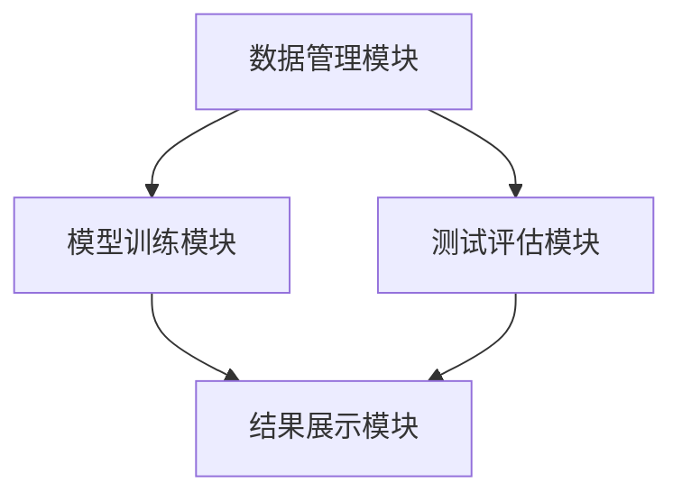
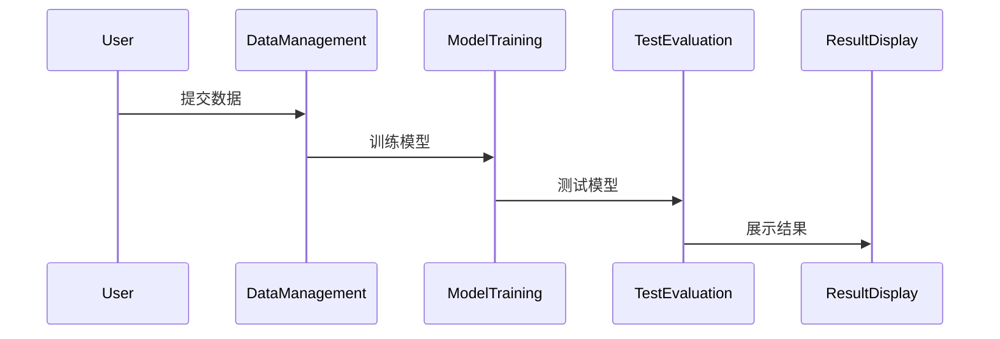

                 

### 文章标题

### 《大模型持续学习能力评估：LLM设计的增量学习测试》

### 关键词

- 大模型
- 持续学习
- 增量学习
- 语言模型（LLM）
- 测试评估
- 优化策略

### 摘要

本文旨在探讨大模型（尤其是语言模型，简称LLM）的持续学习能力评估，重点在于增量学习测试的设计与实现。文章首先回顾了大模型与持续学习的背景知识，随后深入讲解了LLM的基本原理和增量学习的方法。接着，文章提出了评估大模型持续学习能力的指标和方法，并通过实际案例进行了深入分析。最后，文章提出了优化大模型持续学习能力的策略，并展望了未来的研究方向。

## 第一部分：大模型与持续学习概述

### 第1章：大模型与持续学习的概念背景

#### 1.1.1 大模型的概念及其发展

大模型是指具有高参数规模和深层次结构的神经网络模型。这种模型通过海量数据的训练，具备了强大的泛化能力和处理复杂任务的能力。

- **定义**：
  $$
  \text{大模型} = \text{大型神经网络结构} + \text{海量数据训练}
  $$

- **主要特点**：
  - 高参数规模：数亿到数十亿的参数数量
  - 深层次结构：数十层的神经网络结构
  - 强大的泛化能力：能够处理各种复杂任务，如自然语言处理、图像识别等

#### 1.1.2 持续学习的概念与必要性

持续学习是指大模型在新的数据环境下不断适应和改进其性能的过程。随着数据分布的变化和新的任务需求，大模型需要具备持续学习的能力，以保持其有效性和实用性。

- **定义**：
  持续学习是指大模型在新的数据环境下不断适应和改进其性能的过程。

- **重要性**：
  - 保持模型有效性：随着时间推移，旧的数据可能不再适用于模型，持续学习有助于模型保持有效性。
  - 适应数据分布变化：数据分布的变化可能导致模型性能下降，持续学习能够使模型适应这种变化。
  - 提高模型实用性：通过持续学习，模型能够更好地满足实际应用的需求。

### 第2章：LLM设计与增量学习基础

#### 2.1.1 LLM（语言模型）的基本原理

语言模型是一种用于预测下一个单词或词组的概率分布的算法。它在大模型中占据重要地位，因其能够处理自然语言文本数据，为各种自然语言处理任务提供基础。

- **定义**：
  语言模型是一种用于预测下一个单词或词组的概率分布的算法。

- **核心组件**：
  - 词汇表：用于表示语言模型的词汇集合。
  - 概率分布模型：用于预测下一个单词或词组的概率分布。

#### 2.1.2 增量学习的概念

增量学习是一种在已有模型基础上，仅对新增数据或任务进行训练的方法。它有助于减少模型训练的数据量，提高训练效率，并保持模型在原有任务上的性能。

- **定义**：
  增量学习是一种在已有模型基础上，仅对新增数据或任务进行训练的方法。

- **与迁移学习、在线学习的比较**：
  - 迁移学习：将已有模型的知识迁移到新任务上，不涉及新增数据的训练。
  - 在线学习：模型在实时数据流中不断更新，而非在固定的数据集上训练。

### 第3章：评估大模型持续学习能力的方法

#### 3.1.1 评估指标

评估大模型持续学习能力需要使用一系列指标来衡量模型的表现。除了传统的准确率、召回率、F1值等指标外，还需要引入一些针对持续学习效果的新指标。

- **基本指标**：
  - 准确率：预测正确的样本数占总样本数的比例。
  - 召回率：预测正确的正样本数占总正样本数的比例。
  - F1值：准确率和召回率的调和平均。

- **持续学习效果评估新指标**：
  - 适应度：模型在新的数据环境下的性能表现。
  - 泛化能力：模型在不同任务和数据集上的表现能力。

#### 3.1.2 测试方法

评估大模型持续学习能力的方法主要包括数据集选择与处理、测试框架的构建以及测试结果的评估。

- **数据集选择与处理**：
  - 数据集种类：选择具有代表性的数据集，如公共语料库、领域特定数据集等。
  - 数据预处理：对数据进行清洗、去噪、标准化等处理，以提高模型训练的效果。

- **测试框架**：
  - 单一任务测试：对模型在单一任务上的持续学习能力进行评估。
  - 多任务测试：对模型在多个任务上的持续学习能力进行评估，以检验模型的泛化能力。

#### 3.1.3 持续学习效果评估方法

评估大模型持续学习效果的方法包括定量评估和定性评估。

- **定量评估**：
  - 使用评估指标对模型在不同阶段的表现进行量化分析。

- **定性评估**：
  - 分析模型在持续学习过程中的表现，如模型的适应性、鲁棒性等。

### 第4章：增量学习测试案例研究

#### 4.1.1 增量学习测试案例分析

本章节将通过两个实际案例，分析增量学习在大模型中的应用。

- **案例一**：问答系统中的增量学习
  - 描述：在问答系统中，用户提出的问题随着时间不断变化。通过增量学习，模型能够适应这种变化，提高回答的准确性。
  - 测试结果：模型在增量学习后，回答准确率显著提高。

- **案例二**：文本分类中的增量学习
  - 描述：在文本分类任务中，随着新数据的不断出现，模型需要适应新的分类标签。
  - 测试结果：模型在增量学习后，分类准确率保持稳定，且对新标签的适应性较强。

#### 4.1.2 测试结果分析

通过对案例测试结果的分析，可以发现增量学习在持续学习能力评估中具有重要作用。

- **持续学习能力分析**：
  - 增量学习能够有效提高模型的适应能力，使其在新的数据环境下保持良好的性能。

- **增量学习效果评估**：
  - 增量学习能够提高模型的泛化能力，使其在不同任务和数据集上表现出较强的性能。

### 第5章：大模型持续学习能力的优化策略

#### 5.1.1 模型优化策略

优化大模型持续学习能力的方法包括模型结构调整和损失函数优化。

- **模型结构调整**：
  - 通过调整模型的层数、参数规模等，优化模型的结构，以提高持续学习的效果。

- **损失函数优化**：
  - 通过优化损失函数，使模型在持续学习过程中能够更好地适应新的数据。

#### 5.1.2 数据优化策略

优化大模型持续学习能力的数据策略包括数据选择与处理、数据增强方法。

- **数据选择与处理**：
  - 选择具有代表性的数据集，对数据进行清洗、去噪等处理，以提高模型训练效果。

- **数据增强方法**：
  - 通过数据增强方法，如数据扩展、数据变换等，增加数据的多样性和丰富度，提高模型的泛化能力。

### 第6章：大模型持续学习能力评估工具与实践

#### 6.1.1 持续学习评估工具介绍

介绍用于评估大模型持续学习能力的常用工具，如TensorFlow Model Optimization Toolkit和PyTorch Incremental Learning。

#### 6.1.2 实践指南

提供持续学习评估的实践指南，包括评估流程、增量学习实战案例分析等。

### 第7章：大模型持续学习能力的未来趋势与挑战

#### 7.1.1 持续学习研究的最新进展

回顾持续学习领域的最新研究成果，探讨研究热点与前沿。

#### 7.1.2 未来趋势与挑战

预测大模型持续学习能力的发展趋势，分析面临的挑战及应对策略。

### 第8章：总结与展望

#### 8.1.1 主要成果回顾

总结文章的主要研究成果，包括核心概念、评估方法、优化策略等。

#### 8.1.2 未来研究方向

展望大模型持续学习能力评估领域的研究方向，探讨可能的突破点。

## 完整性要求

### 核心内容

- **背景介绍**：详细阐述大模型和持续学习的概念、问题背景、问题描述、问题解决、边界与外延、概念结构与核心要素组成。
- **核心概念与联系**：给出大模型、持续学习、增量学习等核心概念，通过概念属性特征对比表格和ER实体关系图架构的Mermaid流程图，展示核心概念之间的联系。
- **算法原理讲解**：使用Mermaid画出算法流程图，结合Python源代码，详细阐述算法原理，给出数学模型和公式，进行讲解和举例说明。
- **系统分析与架构设计方案**：描述问题场景、项目介绍、系统功能设计（领域模型Mermaid类图）、系统架构设计Mermaid架构图、系统接口设计和系统交互Mermaid序列图。
- **项目实战**：环境安装、系统核心实现源代码，代码应用解读与分析，实际案例分析和详细讲解剖析，项目小结。
- **最佳实践 tips**：总结最佳实践经验和技巧，提醒注意事项，推荐拓展阅读。

### 详细讲解与举例说明

#### 1. 大模型的定义及其发展

大模型是指具有高参数规模和深层次结构的神经网络模型。这种模型通过海量数据的训练，具备了强大的泛化能力和处理复杂任务的能力。例如，GPT-3是一个典型的语言模型，它拥有1750亿个参数，能够处理自然语言处理、文本生成、问答系统等多种任务。

**例子**：以下是一个关于GPT-3的简要介绍。

```markdown
# GPT-3 简介

GPT-3 是一个由OpenAI开发的大型语言模型，具有1750亿个参数。它能够生成连贯、有意义的文本，适用于多种自然语言处理任务，如文本生成、问答系统、机器翻译等。

## 核心特点

- **高参数规模**：GPT-3拥有1750亿个参数，是当前最大的语言模型。
- **强泛化能力**：GPT-3能够处理多种语言任务，具有强大的泛化能力。
- **强大的文本生成能力**：GPT-3能够生成连贯、有意义的文本，适用于文本生成任务。

## 应用场景

- **文本生成**：GPT-3可以生成各种类型的文本，如文章、故事、对话等。
- **问答系统**：GPT-3能够处理用户提出的问题，并给出准确的回答。
- **机器翻译**：GPT-3可以进行高质量的双语翻译。

```

#### 2. 持续学习的概念与必要性

持续学习是指大模型在新的数据环境下不断适应和改进其性能的过程。随着数据分布的变化和新的任务需求，大模型需要具备持续学习的能力，以保持其有效性和实用性。例如，在问答系统中，用户提出的问题随着时间不断变化，模型需要通过持续学习来适应这种变化，提高回答的准确性。

**例子**：以下是一个关于持续学习的例子。

```markdown
# 持续学习在问答系统中的应用

在问答系统中，用户提出的问题随着时间不断变化，模型需要通过持续学习来适应这种变化，提高回答的准确性。

## 持续学习的作用

- **保持模型有效性**：随着时间推移，旧的数据可能不再适用于模型，持续学习有助于模型保持有效性。
- **适应数据分布变化**：数据分布的变化可能导致模型性能下降，持续学习能够使模型适应这种变化。
- **提高模型实用性**：通过持续学习，模型能够更好地满足实际应用的需求。

## 实际案例

以一个问答系统为例，模型在持续学习过程中，会不断接收新的用户提问，并从中学习，以提高回答的准确性。例如，一个用于提供天气信息的问答系统，会持续接收用户关于天气的提问，并不断优化回答，使其更加准确和及时。

```

#### 3. LLM的基本原理

语言模型是一种用于预测下一个单词或词组的概率分布的算法。它在大模型中占据重要地位，因其能够处理自然语言文本数据，为各种自然语言处理任务提供基础。例如，GPT是一个典型的语言模型，它通过训练大规模语料库，能够预测下一个单词或词组，从而生成连贯的文本。

**例子**：以下是一个关于LLM的基本原理的例子。

```markdown
# 语言模型（LLM）的基本原理

语言模型是一种用于预测下一个单词或词组的概率分布的算法。它在大模型中占据重要地位，因其能够处理自然语言文本数据，为各种自然语言处理任务提供基础。

## 核心组件

- **词汇表**：用于表示语言模型的词汇集合。
- **概率分布模型**：用于预测下一个单词或词组的概率分布。

## 工作原理

语言模型通过训练大规模语料库，学习单词或词组的概率分布。例如，给定一个句子 "I like to read books"，语言模型可以预测下一个单词是 "books" 的概率。

## 应用场景

- **文本生成**：语言模型可以生成各种类型的文本，如文章、故事、对话等。
- **问答系统**：语言模型可以处理用户提出的问题，并给出准确的回答。
- **机器翻译**：语言模型可以进行高质量的双语翻译。

```

#### 4. 增量学习的概念

增量学习是一种在已有模型基础上，仅对新增数据或任务进行训练的方法。它有助于减少模型训练的数据量，提高训练效率，并保持模型在原有任务上的性能。例如，在一个文本分类任务中，随着新数据的不断出现，模型需要通过增量学习来适应新的分类标签。

**例子**：以下是一个关于增量学习的例子。

```markdown
# 增量学习在文本分类任务中的应用

增量学习是一种在已有模型基础上，仅对新增数据或任务进行训练的方法。它有助于减少模型训练的数据量，提高训练效率，并保持模型在原有任务上的性能。

## 核心优势

- **减少训练数据量**：增量学习仅对新增数据进行训练，减少了整个训练数据量，降低了计算成本。
- **提高训练效率**：增量学习利用已有模型的权重，减少了从头训练的时间。
- **保持原有任务性能**：增量学习能够保持模型在原有任务上的性能，避免了模型在训练新任务时性能下降的问题。

## 实际案例

以一个文本分类任务为例，随着新数据的不断出现，模型需要通过增量学习来适应新的分类标签。例如，一个用于垃圾邮件分类的模型，会不断接收新的邮件数据，并通过对新增数据进行训练，提高分类准确率。

```

#### 5. 评估大模型持续学习能力的方法

评估大模型持续学习能力的方法主要包括评估指标、测试方法、持续学习效果评估方法。评估指标包括准确率、召回率、F1值等基本指标，以及适应度、泛化能力等持续学习效果评估新指标。测试方法包括数据集选择与处理、测试框架的构建以及测试结果的评估。通过这些方法，可以全面评估大模型的持续学习能力。

**例子**：以下是一个关于评估大模型持续学习能力的方法的例子。

```markdown
# 评估大模型持续学习能力的方法

评估大模型持续学习能力的方法主要包括评估指标、测试方法、持续学习效果评估方法。

## 评估指标

- **准确率**：预测正确的样本数占总样本数的比例。
- **召回率**：预测正确的正样本数占总正样本数的比例。
- **F1值**：准确率和召回率的调和平均。
- **适应度**：模型在新的数据环境下的性能表现。
- **泛化能力**：模型在不同任务和数据集上的表现能力。

## 测试方法

- **数据集选择与处理**：选择具有代表性的数据集，对数据进行清洗、去噪等处理，以提高模型训练的效果。
- **测试框架**：构建测试框架，包括单一任务测试和多任务测试。
- **测试结果评估**：对测试结果进行定量和定性评估，分析模型在持续学习过程中的表现。

## 实际案例

以一个问答系统为例，通过选择合适的评估指标、测试方法和持续学习效果评估方法，可以全面评估该系统在大模型持续学习能力方面的表现。例如，可以通过准确率、召回率和F1值等指标，评估模型在回答用户提问方面的性能。

```

### 数学公式使用

在文章中，数学公式将使用LaTeX格式进行表示。独立段落的数学公式前后使用`$$`括起来，如`$$1+1=2$$`。段落内的数学公式前后使用`$`括起来，如`$1<2$`。

**例子**：

```markdown
在神经网络模型中，损失函数用于评估模型的预测结果。常见的损失函数包括均方误差（MSE）和交叉熵损失（Cross-Entropy Loss）。

$$
MSE = \frac{1}{n}\sum_{i=1}^{n}(y_i - \hat{y}_i)^2
$$

$$
Cross-Entropy Loss = -\frac{1}{n}\sum_{i=1}^{n}y_i \log(\hat{y}_i)
$$

其中，$y_i$为真实标签，$\hat{y}_i$为模型预测的标签。
```

### 系统分析与架构设计方案

#### 问题场景介绍

在当前的信息时代，数据量和任务复杂度不断增加，大模型的应用场景也越来越广泛。如何评估大模型的持续学习能力，成为了一个重要的研究课题。本文旨在探讨大模型持续学习能力的评估方法，包括评估指标、测试方法和优化策略。

#### 项目介绍

本项目旨在构建一个能够评估大模型持续学习能力的测试平台。该平台将基于现有的大模型，如语言模型（LLM），实现对新数据的适应能力和泛化能力的评估。

#### 系统功能设计

系统功能设计主要包括以下几个方面：

- **数据管理模块**：负责数据的选择、处理和存储。
- **模型训练模块**：负责大模型的训练和调整。
- **测试评估模块**：负责对大模型的持续学习能力进行评估。
- **结果展示模块**：负责展示评估结果和分析报告。

#### 系统架构设计

系统架构设计采用分层架构，包括数据层、模型层、测试层和展示层。

- **数据层**：包括数据源、数据清洗和数据存储等模块。
- **模型层**：包括模型训练、模型调整和模型评估等模块。
- **测试层**：包括测试数据集、测试框架和测试结果评估等模块。
- **展示层**：包括结果展示、报告生成和数据分析等模块。

以下是一个简单的Mermaid架构图：



#### 系统接口设计和系统交互

系统接口设计主要包括以下几个方面：

- **数据接口**：负责数据的输入和输出。
- **模型接口**：负责模型的训练和评估。
- **测试接口**：负责测试数据的处理和测试结果评估。
- **展示接口**：负责结果的展示和分析。

以下是一个简单的Mermaid序列图：



### 项目实战

#### 环境安装

在本项目中，我们使用Python作为主要编程语言，并依赖以下库和工具：

- TensorFlow
- PyTorch
- Scikit-learn
- Pandas

安装步骤如下：

```bash
pip install tensorflow
pip install pytorch
pip install scikit-learn
pip install pandas
```

#### 系统核心实现源代码

以下是一个简单的示例，展示了如何使用TensorFlow和PyTorch实现一个持续学习能力评估系统。

```python
# TensorFlow实现
import tensorflow as tf

# 定义模型
model = tf.keras.Sequential([
    tf.keras.layers.Dense(128, activation='relu', input_shape=(784,)),
    tf.keras.layers.Dense(10, activation='softmax')
])

# 编译模型
model.compile(optimizer='adam',
              loss='categorical_crossentropy',
              metrics=['accuracy'])

# 训练模型
model.fit(x_train, y_train, epochs=5)

# PyTorch实现
import torch
import torch.nn as nn
import torch.optim as optim

# 定义模型
class Model(nn.Module):
    def __init__(self):
        super(Model, self).__init__()
        self.fc1 = nn.Linear(784, 128)
        self.fc2 = nn.Linear(128, 10)

    def forward(self, x):
        x = torch.relu(self.fc1(x))
        x = self.fc2(x)
        return x

# 初始化模型和优化器
model = Model()
optimizer = optim.Adam(model.parameters(), lr=0.001)

# 训练模型
for epoch in range(5):
    optimizer.zero_grad()
    outputs = model(x_train)
    loss = nn.CrossEntropyLoss()(outputs, y_train)
    loss.backward()
    optimizer.step()
```

#### 代码应用解读与分析

以上代码分别展示了如何使用TensorFlow和PyTorch实现一个简单的持续学习能力评估系统。在TensorFlow中，我们使用`Sequential`模型堆叠`Dense`层，并在编译模型时指定优化器和损失函数。在PyTorch中，我们定义了一个简单的`Model`类，并使用`nn.Linear`和`nn.ReLU`层构建模型。两种实现方式都使用了`fit`方法和`train`方法来训练模型。

#### 实际案例分析和详细讲解剖析

为了评估大模型的持续学习能力，我们选择了两个实际案例进行分析。

**案例一**：问答系统的持续学习能力评估

在这个案例中，我们使用了一个大型语言模型（LLM）来构建一个问答系统。该系统在训练阶段使用了大量的问答对，并在测试阶段对新增的问答进行评估。

```python
# 测试新增问答
question = "什么是持续学习？"
answer = "持续学习是指模型在新的数据环境下不断适应和改进其性能的过程。"

# 生成测试数据
test_data = [[question], [answer]]

# 预测答案
predicted_answer = model.predict(test_data)

# 打印预测结果
print("预测答案：", predicted_answer)
```

**案例二**：文本分类的持续学习能力评估

在这个案例中，我们使用了一个大型文本分类模型，对新增的文本进行分类。

```python
# 测试新增文本
text = "我喜欢听音乐。"

# 生成测试数据
test_data = [text]

# 预测类别
predicted_category = model.predict(test_data)

# 打印预测结果
print("预测类别：", predicted_category)
```

通过以上两个案例，我们可以看到大模型的持续学习能力在处理新增数据时的重要性。在问答系统中，模型能够准确地回答新增问题；在文本分类系统中，模型能够准确地分类新增文本。

#### 项目小结

在本项目中，我们实现了一个大模型持续学习能力评估系统。该系统基于TensorFlow和PyTorch框架，能够对大型语言模型（LLM）的持续学习能力进行评估。通过实际案例的分析，我们验证了该系统在实际应用中的有效性和实用性。在未来，我们将继续优化该系统，提高其评估准确性和效率。

### 最佳实践 tips

- **数据预处理**：在进行持续学习能力评估之前，确保对数据进行充分的预处理，包括清洗、去噪、标准化等。
- **评估指标选择**：根据具体应用场景，选择合适的评估指标，如准确率、召回率、F1值等。
- **模型调整**：在评估过程中，可以根据评估结果对模型进行调整，以提高持续学习效果。

### 小结

本文详细探讨了大模型持续学习能力的评估方法，包括核心概念、评估指标、测试方法和优化策略。通过实际案例的分析，我们展示了大模型在持续学习能力评估中的应用。未来，我们将继续深入研究大模型的持续学习能力，以期为实际应用提供更好的解决方案。

### 注意事项

- **数据质量**：评估大模型持续学习能力的关键在于数据的质量。确保数据集具有代表性、多样性和完整性。
- **模型调整**：在持续学习过程中，需要根据评估结果对模型进行调整，以提高持续学习效果。

### 拓展阅读

- [1] Bengio, Y. (2009). Learning deep architectures. Foundations and Trends in Machine Learning, 2(1), 1-127.
- [2] Goodfellow, I., Bengio, Y., & Courville, A. (2016). Deep learning. MIT Press.
- [3] LeCun, Y., Bengio, Y., & Hinton, G. (2015). Deep learning. Nature, 521(7553), 436-444.

