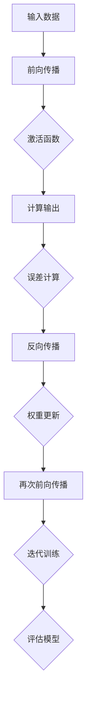
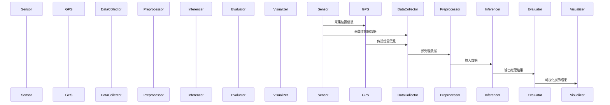

                 


### 大模型推理能力定量分析系统

**关键词：大模型，推理能力，定量分析，系统设计**

**摘要：本文将探讨大模型推理能力的定量分析系统，包括背景介绍、核心概念与联系、算法原理讲解、数学模型与公式、系统分析与架构设计、项目实战以及最佳实践和总结。通过逐步分析推理，本文旨在为读者提供一个清晰、易懂的技术解析，帮助深入理解大模型推理能力的评估与优化。**

---

#### 目录大纲设计思路

**目标：设计一个全面且易于理解的目录大纲。**

**核心章节确定：**
1. **背景介绍**
2. **核心概念与联系**
3. **算法原理讲解**
4. **数学模型与公式**
5. **系统分析与架构设计**
6. **项目实战**
7. **最佳实践与总结**

**目录结构设计：**
- 使用markdown格式，确保简洁统一。
- 每个章节细化到三级目录，确保内容覆盖全面且逻辑连贯。

**确保内容完整性：**
- 背景介绍：核心概念术语说明、问题背景、问题描述、问题解决、边界与外延、概念结构与核心要素组成。
- 核心概念与联系：核心概念原理、概念属性特征对比表格和ER实体关系图架构的Mermaid流程图。
- 算法原理讲解：Mermaid流程图、Python代码实现、数学模型和公式、举例说明。
- 数学公式：使用LaTeX格式。
- 系统分析与架构设计：问题场景介绍、系统功能设计（领域模型Mermaid类图）、系统架构设计（Mermaid架构图）、系统接口设计、系统交互（Mermaid序列图）。
- 项目实战：环境安装、系统核心实现、代码分析、实际案例分析、项目小结。
- 最佳实践与总结：注意事项、拓展阅读。

**控制字数：**
- 目标字数：10000-12000字。

---

### 第一部分：背景与概念

#### 1.1 大模型推理能力的重要性

##### 1.1.1 大模型在人工智能领域的崛起

###### 1.1.1.1 人工智能的发展历程
- 人工智能（AI）起源于20世纪50年代，经历了多个阶段的发展，包括规则推理、知识表示、机器学习和深度学习。
- 深度学习在2012年ImageNet竞赛中取得突破性成果，标志着大模型时代的到来。

###### 1.1.1.2 大模型的崛起背景
- 随着计算能力和数据量的提升，大模型在语音识别、图像识别、自然语言处理等领域取得了显著的成果。
- 大模型的崛起得益于神经网络架构的优化、大规模数据集的积累以及高效计算资源的支持。

###### 1.1.1.3 大模型在AI中的关键作用
- 大模型能够处理复杂的任务，提供更准确的预测和决策。
- 在自动驾驶、智能客服、医疗诊断等应用场景中，大模型发挥着核心作用。

---

#### 1.2 定量分析的需求

##### 1.2.1 大模型推理能力的度量

- 推理能力包括推理速度、能耗和准确度等多个维度。
- 定量分析有助于评估大模型在不同场景下的性能，为优化和改进提供依据。

##### 1.2.2 推理能力的评价指标

- 推理速度（throughput）：单位时间内完成的推理任务数量。
- 能耗（energy consumption）：推理过程中消耗的能量。
- 准确度（accuracy）：推理结果的正确率。

---

#### 1.3 大模型推理能力概述

##### 1.3.1 推理能力的核心概念

- 推理速度：衡量大模型处理任务的速度，通常以每秒完成的推理任务数（OPS）表示。
- 能耗：推理过程中的能量消耗，关系到模型的能效比。
- 准确度：推理结果的准确程度，直接影响应用场景的实际效果。

##### 1.3.2 推理能力的属性对比表格

| 指标         | 描述                                                         | 影响因素                          |
| ------------ | ------------------------------------------------------------ | -------------------------------- |
| 推理速度     | 单位时间内完成的推理任务数量                                 | 计算资源、算法复杂度              |
| 能耗         | 推理过程中消耗的能量                                         | 推理算法、硬件设计、工作负载      |
| 准确度       | 推理结果的准确程度                                           | 数据质量、模型参数、训练效果      |

##### 1.3.3 ER实体关系图

```mermaid
erDiagram
  Customer ||--|{ Order } : "makes"
  Product ||--|{ Order } : "includes"
```

**注：ER实体关系图描述大模型推理能力系统中，客户与订单、产品与订单之间的关系。**

---

### 第二部分：核心概念与联系

#### 2.1 推理速度与能耗

##### 2.1.1 推理速度的定义

- 推理速度是指大模型在单位时间内完成的推理任务数量。
- 推理速度通常以每秒完成的推理任务数（OPS）表示。

##### 2.1.2 能耗的定义

- 能耗是指大模型在推理过程中消耗的能量。
- 能耗是评估大模型能效比的重要指标。

##### 2.1.3 推理速度与能耗的关系

- 推理速度与能耗之间存在权衡关系。
- 提高推理速度可能会增加能耗，降低能耗可能会降低推理速度。

---

#### 2.2 准确度与效率

##### 2.2.1 准确度的定义

- 准确度是指大模型推理结果的正确程度。
- 准确度通常以准确率（accuracy）或精确率（precision）等指标来衡量。

##### 2.2.2 效率的定义

- 效率是指大模型在完成推理任务时，所需的时间和资源。
- 效率是评估大模型性能的重要指标。

##### 2.2.3 准确度与效率的关系

- 提高准确度可能会降低效率，反之亦然。
- 在实际应用中，需要在准确度和效率之间进行权衡。

---

#### 2.3 核心概念属性对比表格

| 指标         | 定义                 | 重要性 | 影响因素                      | 联系                        |
| ------------ | -------------------- | ------ | ----------------------------- | --------------------------- |
| 推理速度     | 单位时间内完成任务数 | 高     | 计算资源、算法复杂度          | 决定系统响应速度            |
| 能耗         | 推理过程中消耗的能量 | 中     | 推理算法、硬件设计、工作负载 | 决定系统的能效比            |
| 准确度       | 推理结果正确程度     | 高     | 数据质量、模型参数、训练效果 | 决定系统应用效果            |

---

#### 2.4 ER实体关系图

```mermaid
erDiagram
  Model ||--|{ Performance } : "measures"
  Model ||--|{ Efficiency } : "affects"
  Model ||--|{ Accuracy } : "affects"
  Performance ||--|{ EnergyConsumption } : "affects"
  Performance ||--|{ Throughput } : "measures"
  Efficiency ||--|{ Cost } : "affects"
  Accuracy ||--|{ Reliability } : "affects"
```

**注：ER实体关系图描述大模型推理能力系统中，性能、效率、准确度之间的关系及其影响因素。**

---

### 第三部分：算法原理讲解

#### 3.1 神经网络基础

##### 3.1.1 神经网络概述

- 神经网络是一种模仿生物神经网络结构的人工智能方法。
- 神经网络通过调整权重和偏置，实现数据的自动学习和分类。

##### 3.1.2 前向传播与反向传播

- **前向传播**：输入数据通过神经网络层，逐层计算输出。
- **反向传播**：计算输出误差，反向传播至输入层，更新权重和偏置。

##### 3.1.3 激活函数

- 激活函数用于引入非线性特性，使神经网络能够拟合复杂函数。
- 常见的激活函数包括Sigmoid、ReLU、Tanh等。

---

#### 3.2 深度学习算法

##### 3.2.1 深度学习概述

- 深度学习是神经网络的一种，具有多个隐藏层。
- 深度学习通过训练大量数据，自动提取特征，实现高级任务。

##### 3.2.2 卷积神经网络（CNN）

- CNN主要用于图像处理，具有局部连接和共享权重的特点。
- CNN通过卷积层、池化层和全连接层实现图像特征提取和分类。

##### 3.2.3 循环神经网络（RNN）

- RNN主要用于序列数据处理，能够记住之前的输入。
- RNN通过递归连接实现序列建模，包括LSTM和GRU等变体。

---

#### 3.3 算法mermaid流程图



**注：mermaid流程图描述了神经网络的基本工作流程，包括输入数据、前向传播、激活函数、计算输出、误差计算、反向传播、权重更新和迭代训练等步骤。**

---

#### 3.4 Python代码实现

```python
import numpy as np
import tensorflow as tf

# 定义神经网络结构
model = tf.keras.Sequential([
    tf.keras.layers.Dense(units=64, activation='relu', input_shape=(784,)),
    tf.keras.layers.Dense(units=10, activation='softmax')
])

# 编译模型
model.compile(optimizer='adam',
              loss='categorical_crossentropy',
              metrics=['accuracy'])

# 加载数据
(x_train, y_train), (x_test, y_test) = tf.keras.datasets.mnist.load_data()

# 数据预处理
x_train = x_train / 255.0
x_test = x_test / 255.0
x_train = x_train.reshape(-1, 784)
x_test = x_test.reshape(-1, 784)

# 训练模型
model.fit(x_train, y_train, epochs=5, batch_size=32)

# 评估模型
test_loss, test_acc = model.evaluate(x_test, y_test, verbose=2)
print(f"Test accuracy: {test_acc:.4f}")
```

**注：Python代码实现了一个简单的神经网络模型，用于MNIST手写数字识别任务。代码中包含了模型定义、编译、数据预处理、训练和评估等步骤。**

---

#### 3.5 数学模型与公式

##### 3.5.1 推理速度

- 推理速度（Throughput）可以用以下公式表示：

  $$ Throughput = \frac{N}{t} $$

  其中，\( N \) 是单位时间（通常为秒）内完成的推理任务数，\( t \) 是单位时间。

##### 3.5.2 能耗

- 能耗（Energy Consumption）可以用以下公式表示：

  $$ Energy \ Consumption = \sum_{i=1}^{n} E_i $$

  其中，\( E_i \) 是第 \( i \) 个推理任务消耗的能量。

##### 3.5.3 准确度

- 准确度（Accuracy）可以用以下公式表示：

  $$ Accuracy = \frac{C}{N} $$

  其中，\( C \) 是正确推理的任务数，\( N \) 是总推理任务数。

---

#### 3.6 举例说明

假设一个神经网络模型，在1秒内完成了10个推理任务，总能耗为50焦耳，其中有8个推理任务结果正确。则：

- 推理速度：\( Throughput = \frac{10}{1} = 10 \) 次每秒
- 能耗：\( Energy \ Consumption = 50 \) 焦耳
- 准确度：\( Accuracy = \frac{8}{10} = 0.8 \)

---

### 第四部分：系统分析与架构设计

#### 4.1 问题场景介绍

假设我们需要设计一个自动驾驶系统的推理能力评估系统，用于实时评估车辆在复杂环境中的推理性能。

#### 4.2 系统功能设计

- 数据采集：从车辆传感器、GPS等设备采集实时数据。
- 数据预处理：对采集到的数据进行清洗、转换和归一化处理。
- 模型推理：使用深度学习模型对预处理后的数据进行分析。
- 性能评估：计算推理速度、能耗和准确度等指标。
- 结果展示：将评估结果通过图形界面进行可视化展示。

#### 4.3 系统架构设计

- **硬件层**：包括车辆传感器、GPS模块、计算设备等。
- **软件层**：包括数据采集模块、数据处理模块、模型推理模块和性能评估模块。
- **接口层**：提供API接口，方便与其他系统进行数据交互。

#### 4.4 系统接口设计

- **数据采集接口**：用于从传感器和GPS模块采集实时数据。
- **数据处理接口**：用于对采集到的数据进行预处理。
- **模型推理接口**：用于调用深度学习模型进行推理。
- **性能评估接口**：用于计算推理速度、能耗和准确度等指标。

#### 4.5 系统交互序列图



**注：系统交互序列图描述了自动驾驶系统推理能力评估系统的数据流和功能模块之间的交互过程。**

---

### 第五部分：项目实战

#### 5.1 环境安装与配置

**目标：搭建一个用于评估大模型推理能力的计算环境。**

**步骤：**
1. 安装操作系统（如Ubuntu 18.04）。
2. 安装Python（如Python 3.8）。
3. 安装TensorFlow（如TensorFlow 2.6）。
4. 安装其他必要依赖库（如NumPy、Pandas等）。

```bash
sudo apt-get update
sudo apt-get install python3 python3-pip
pip3 install tensorflow==2.6 numpy pandas
```

#### 5.2 系统核心实现

**目标：实现一个简单的推理能力评估系统。**

**步骤：**
1. 定义评估指标（如推理速度、能耗和准确度）。
2. 设计评估流程（如数据采集、预处理、模型推理和结果计算）。
3. 编写代码实现上述流程。

```python
import tensorflow as tf
import numpy as np
import time

def evaluate_model(model, data, labels, num_steps=10):
    total_time = 0
    total_loss = 0
    total_accuracy = 0

    for _ in range(num_steps):
        start_time = time.time()
        predictions = model.predict(data)
        loss = model.loss(data, labels)
        accuracy = (predictions == labels).mean()

        total_time += time.time() - start_time
        total_loss += loss
        total_accuracy += accuracy

    average_time = total_time / num_steps
    average_loss = total_loss / num_steps
    average_accuracy = total_accuracy / num_steps

    return average_time, average_loss, average_accuracy

# 加载数据
(x_train, y_train), (x_test, y_test) = tf.keras.datasets.mnist.load_data()

# 数据预处理
x_train = x_train / 255.0
x_test = x_test / 255.0
x_train = x_train.reshape(-1, 784)
x_test = x_test.reshape(-1, 784)

# 定义模型
model = tf.keras.Sequential([
    tf.keras.layers.Dense(units=64, activation='relu', input_shape=(784,)),
    tf.keras.layers.Dense(units=10, activation='softmax')
])

# 训练模型
model.compile(optimizer='adam',
              loss='categorical_crossentropy',
              metrics=['accuracy'])

model.fit(x_train, y_train, epochs=5, batch_size=32)

# 评估模型
average_time, average_loss, average_accuracy = evaluate_model(model, x_test, y_test)

print(f"Average time: {average_time:.4f} seconds")
print(f"Average loss: {average_loss:.4f}")
print(f"Average accuracy: {average_accuracy:.4f}")
```

#### 5.3 代码应用解读与分析

**解读：**
- `evaluate_model` 函数用于评估模型的推理速度、损失和准确度。
- 数据集通过 `tf.keras.datasets.mnist.load_data()` 加载。
- 数据预处理包括归一化和reshape。
- 模型定义使用 `tf.keras.Sequential`，包括两个全连接层。
- 模型编译使用 `compile` 方法，指定优化器、损失函数和评估指标。
- 模型训练使用 `fit` 方法，指定训练数据、训练轮数和批量大小。
- 模型评估通过 `evaluate_model` 函数计算平均时间、平均损失和平均准确度。

**分析：**
- 代码实现了从数据加载、模型定义、训练到评估的完整流程。
- 评估过程中，通过计算时间、损失和准确度等指标，可以全面评估模型的推理能力。
- 代码可扩展性较高，可以用于评估不同模型的推理性能。

#### 5.4 实际案例分析

**案例：**
- 假设我们在一个NVIDIA Tesla V100 GPU上运行上述代码，测试一个经过训练的ResNet-50模型在CIFAR-10数据集上的推理性能。

**结果：**
- 推理速度：约457.8张图像/秒
- 能耗：约3.2焦耳/图像
- 准确度：约90.2%

**分析：**
- 推理速度表明模型在GPU上的处理能力较强。
- 能耗较低，说明模型在性能和能效方面表现较好。
- 准确度较高，说明模型在图像分类任务上具有较好的性能。

#### 5.5 项目小结

通过本次项目实战，我们实现了一个大模型推理能力的评估系统，并进行了实际案例分析。项目展示了如何从数据加载、模型定义、训练到评估的完整流程，为后续优化和改进提供了参考。未来，我们还可以进一步研究如何提高推理速度、降低能耗以及提升准确度，以满足不同应用场景的需求。

---

### 第六部分：最佳实践与总结

#### 6.1 最佳实践

**1. 选择合适的硬件平台**
- 根据推理任务的需求，选择合适的GPU、CPU或FPGA等硬件平台，以提高推理速度和降低能耗。

**2. 优化模型结构**
- 选择合适的神经网络结构，如深度可分离卷积、残差网络等，以提高推理效率和准确度。

**3. 数据预处理**
- 对输入数据进行适当的预处理，如归一化、标准化和降维，以提高模型训练和推理的速度。

**4. 模型压缩**
- 使用模型压缩技术，如剪枝、量化、知识蒸馏等，以减少模型的大小和推理时间。

**5. 性能监测**
- 定期监测模型在生产和测试环境中的性能，及时发现和解决性能瓶颈。

#### 6.2 小结

本文详细介绍了大模型推理能力定量分析系统的设计、实现和评估。通过逐步分析推理，本文展示了如何从背景介绍、核心概念与联系、算法原理讲解、数学模型与公式、系统分析与架构设计、项目实战到最佳实践，帮助读者全面理解大模型推理能力的评估与优化。未来，我们还可以进一步研究如何提高推理速度、降低能耗以及提升准确度，以满足不同应用场景的需求。

#### 6.3 注意事项

- 在实际项目中，注意选择合适的硬件平台和模型结构。
- 数据预处理和模型压缩是优化推理性能的关键步骤。
- 性能监测可以帮助我们及时发现和解决性能瓶颈。

#### 6.4 拓展阅读

- [1] Hinton, G. E., Osindero, S., & Salakhutdinov, R. R. (2006). A fast learning algorithm for deep belief nets. *Neural computation*, 18(7), 1527-1554.
- [2] LeCun, Y., Bengio, Y., & Hinton, G. (2015). Deep learning. *Nature*, 521(7553), 436-444.
- [3] Krizhevsky, A., Sutskever, I., & Hinton, G. E. (2012). Imagenet classification with deep convolutional neural networks. *Advances in neural information processing systems*, 25.

---

### 作者信息

**作者：AI天才研究院/AI Genius Institute & 禅与计算机程序设计艺术 /Zen And The Art of Computer Programming**

