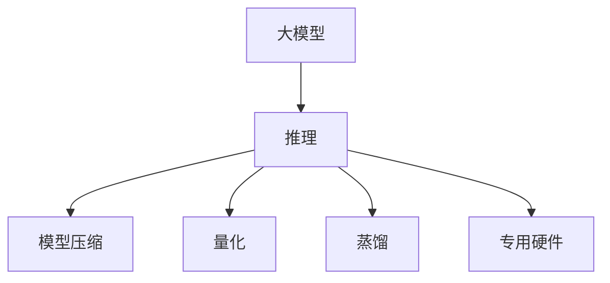
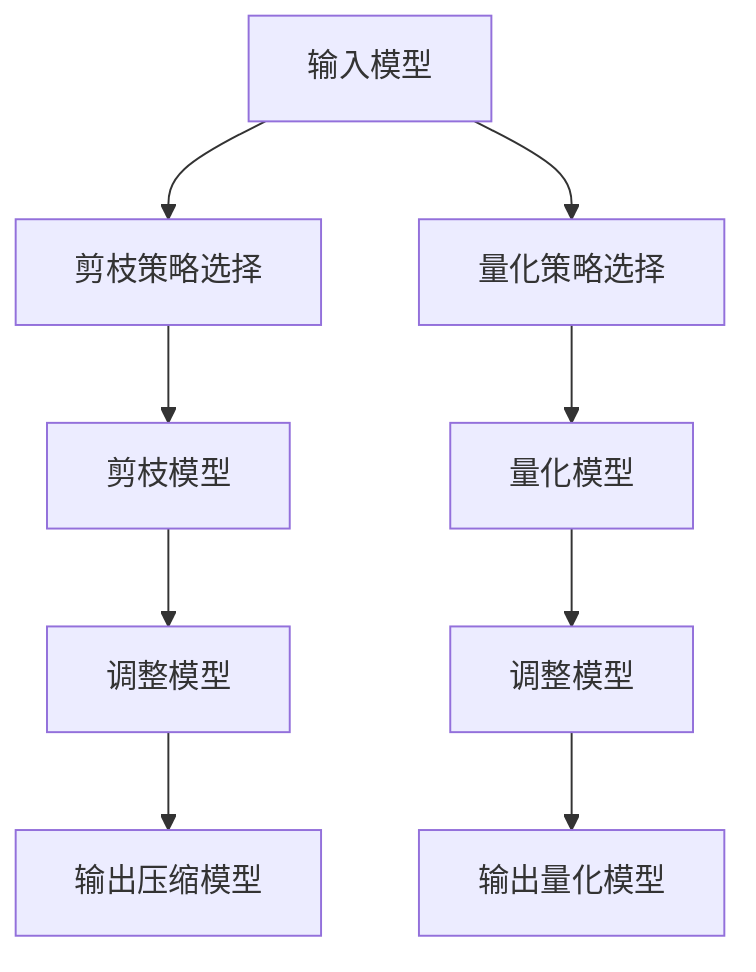
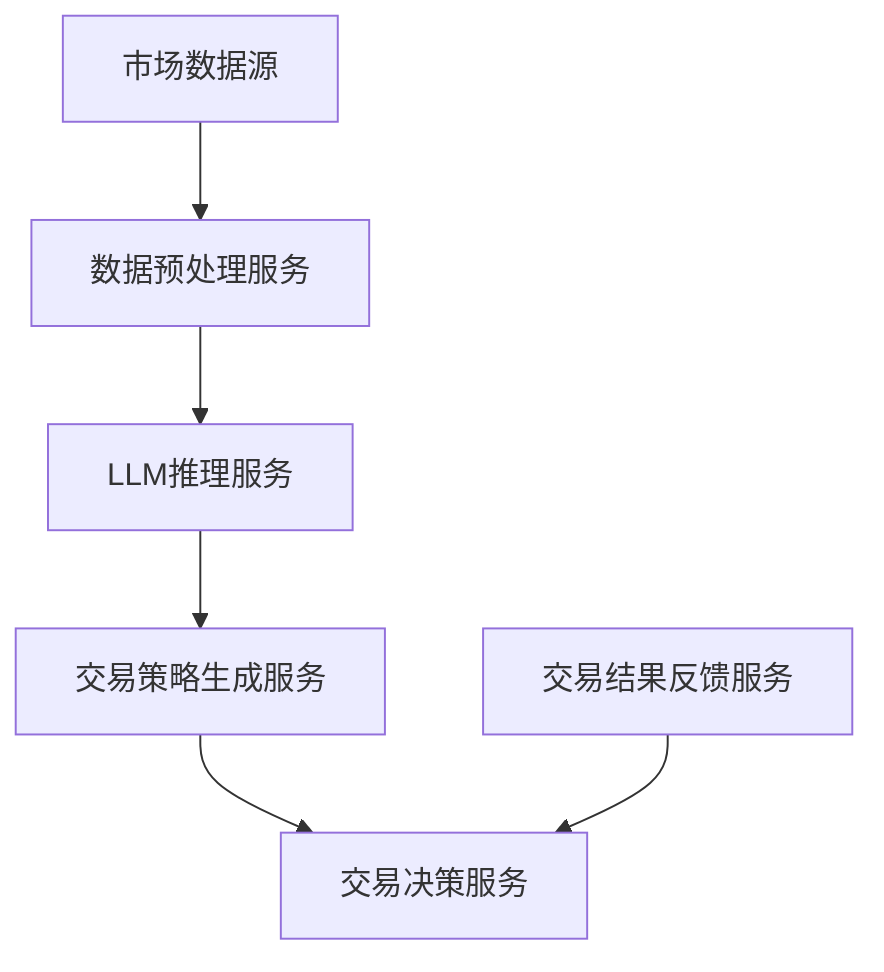

                 


### 文章内容写作指导

#### 文章结构规划

1. **文章标题**：简洁明了，突出文章主题。

2. **关键词**：列出5-7个与文章主题相关且用户可能搜索的关键词。

3. **摘要**：概括文章核心内容，引发读者兴趣。

4. **引言**：
   - **问题背景**：简要介绍研究背景。
   - **问题定义**：明确研究的问题是什么。
   - **问题解决**：概述可能的解决方案。
   - **边界与外延**：说明研究的范围和相关领域。

5. **核心概念与联系**：
   - **核心概念**：解释文章中涉及的关键概念。
   - **概念属性特征对比表格**：用表格形式对比不同概念的特点。
   - **ER实体关系图架构**：用Mermaid图展示实体关系。

6. **算法原理讲解**：
   - **原理**：详细解释算法的工作原理。
   - **流程图**：使用Mermaid绘制算法流程图。
   - **数学模型和公式**：使用LaTeX格式给出公式。
   - **举例说明**：用具体案例解释算法的应用。

7. **系统分析与架构设计方案**：
   - **问题场景介绍**：描述系统应用场景。
   - **项目介绍**：介绍项目的目标、功能和特点。
   - **领域模型类图**：使用Mermaid绘制领域模型类图。
   - **系统架构设计**：使用Mermaid绘制系统架构图。
   - **系统接口设计和系统交互**：使用Mermaid绘制系统交互序列图。

8. **项目实战**：
   - **环境安装**：说明所需环境的安装过程。
   - **系统核心实现源代码**：提供关键源代码片段。
   - **代码应用解读与分析**：分析代码的功能和应用。
   - **实际案例分析和详细讲解剖析**：通过具体案例展示应用效果。
   - **项目小结**：总结项目实施的经验和教训。

9. **最佳实践 tips**：分享一些实用技巧或建议。

10. **小结**：回顾文章要点，强调研究的重要性和未来方向。

11. **注意事项**：提醒读者注意的问题。

12. **拓展阅读**：推荐相关阅读材料。

#### 内容写作技巧

- **逻辑清晰**：每个段落要清晰表达一个观点，各段落之间要有良好的过渡。
- **专业术语**：使用专业术语，但要确保非专业人士也能理解。
- **图表辅助**：合理使用图表、流程图等视觉元素，帮助读者更好地理解复杂概念。
- **案例丰富**：提供具体案例，增加文章的可读性和说服力。
- **格式规范**：遵循Markdown格式规范，确保文章的整洁和易读性。
- **写作风格**：保持专业、客观和严谨的写作风格。

### 文章质量评估标准

- **内容完整性**：文章是否涵盖了所有关键概念、算法原理和实际案例。
- **逻辑性**：文章是否具备清晰的逻辑结构，各部分内容是否紧密相连。
- **专业性**：文章是否使用准确的专业术语，是否体现了作者的专业水平。
- **可读性**：文章是否容易理解，是否采用了恰当的图表和示例。
- **创新性**：文章是否提出了新的观点或解决方案。
- **准确性**：文章中的事实、数据和引用是否准确无误。

通过以上规划和写作技巧，我们可以撰写出一篇高质量的技术博客文章，满足读者对知识的渴求，同时也提升自身在技术领域的专业形象。接下来，我们将根据这一规划，逐步展开文章的内容。让我们开始吧！

----------------------------------------------------------------

# 大模型推理能力测试：LLM设计的挑战性任务

## 关键词

- 大模型推理
- 语言模型
- 模型设计
- 推理效率
- 计算优化

> 摘要：本文深入探讨了大型语言模型（LLM）推理能力测试中的挑战，包括模型设计、计算复杂度、存储需求和优化策略。通过详细分析模型压缩、量化、蒸馏和专用硬件设计等方法，本文揭示了如何在不牺牲模型性能的情况下提升推理效率，并为读者提供了一个全面的参考框架。

## 引言

### 1.1 问题背景

随着深度学习技术的飞速发展，大型语言模型（LLM）已经在自然语言处理（NLP）领域取得了显著成果。LLM如GPT-3、ChatGPT和BERT等，凭借其强大的文本生成和理解能力，已经广泛应用于问答系统、机器翻译、文本摘要和对话系统等场景。然而，这些大模型的推理能力测试，特别是高效推理的问题，成为了研究和应用中的一个关键挑战。

### 1.2 问题定义

大模型推理能力测试主要关注如何在保持模型性能的同时，实现高效的推理。这不仅仅是计算速度的问题，还涉及到模型设计的多个方面，如参数规模、架构选择和优化策略。对于LLM来说，推理效率的挑战更加显著，因为它们通常具有数亿甚至数千亿个参数，需要大量的计算资源。

### 1.3 问题解决

为了解决LLM推理的挑战，研究者们提出了多种方法，包括模型压缩、量化、蒸馏和专用硬件设计等。这些方法的目标是减少模型的计算复杂度和存储需求，从而提高推理速度和效率。

### 1.4 边界与外延

虽然大模型推理是一个广泛的研究领域，但本文将重点关注LLM的设计挑战。本文将探讨LLM在NLP中的应用，以及如何通过优化模型设计和推理策略来提升其效率。

### 1.5 概念结构与核心要素组成

#### 模型压缩

模型压缩的目标是通过减少模型参数数量来降低模型大小，从而提高推理速度。常见的方法包括剪枝、量化、知识蒸馏等。

#### 架构优化

架构优化涉及到设计更高效的模型架构，例如变换器架构、稀疏性等。优化目标是在保持模型性能的同时，降低计算复杂度。

#### 推理策略

推理策略旨在优化推理过程，以提高效率。动态推理策略、增量推理等都是有效的策略。

## 核心概念与联系

### 2.1 大模型与推理

#### 大模型

大模型通常指的是具有数百万甚至数十亿个参数的深度学习模型。这些模型能够通过大量的数据训练，从而获得强大的特征表示和学习能力。

#### 推理

推理是指模型在接收到新的输入时，根据已学到的知识和模式生成输出。在大模型中，推理是一个计算密集型的过程，涉及到大量的矩阵运算和参数更新。

### 2.2 大模型设计挑战

#### 计算复杂度

随着模型规模的扩大，计算复杂度显著增加。这导致了推理速度的降低，从而影响了用户体验。

#### 存储需求

大模型的存储需求也是一个重要问题。模型的参数量和计算图的大小直接决定了所需的存储空间，这对于硬件资源有限的场景来说是一个挑战。

### 2.3 对比表格：不同推理方法的特点

| 方法          | 优点                               | 缺点                                     |
|---------------|------------------------------------|-----------------------------------------|
| 模型压缩      | 减少模型大小，提高推理速度           | 可能会降低模型性能                       |
| 量化          | 降低模型存储和计算需求               | 可能会降低模型精度                       |
| 蒸馏          | 通过小模型学习大模型的知识          | 需要额外的训练时间和资源                 |
| 专用硬件      | 优化硬件性能，提高推理速度           | 增加硬件成本和复杂性                     |

### 2.4 ER实体关系图架构



## 算法原理讲解

### 3.1 模型压缩原理

#### 剪枝

剪枝是一种通过去除模型中的冗余参数来减少模型大小的技术。剪枝的过程通常包括以下步骤：

1. **权重重要性排序**：对模型中的权重进行排序，以确定哪些权重是最重要的。
2. **参数剪枝**：根据权重的重要性，去除部分参数。
3. **参数恢复**：调整剩余参数，以最小化性能损失。

#### 量化

量化是一种将模型参数从浮点数转换为整数的技巧，以减少模型的存储和计算需求。量化过程通常包括以下步骤：

1. **选择量化策略**：例如均匀量化或双精度量化。
2. **量化参数**：将浮点数参数转换为整数。
3. **参数调整**：调整量化后的参数，以最小化性能损失。

### 3.2 算法流程图



### 3.3 数学模型和公式

#### 剪枝

- **目标函数**：
  $$\min_{\theta} \frac{1}{N} \sum_{i=1}^{N} L(y_i, \hat{y}_i)$$
  其中，$L$是损失函数，$y_i$是实际标签，$\hat{y}_i$是模型预测。

- **剪枝策略**：
  $$\text{Prune}(\theta) = \theta - \lambda \cdot \text{Sort}(\theta)$$
  其中，$\lambda$是剪枝率，$\text{Sort}(\theta)$是对权重进行排序。

#### 量化

- **目标函数**：
  $$\min_{\theta'} \frac{1}{N} \sum_{i=1}^{N} L(y_i, \hat{y}_i')$$
  其中，$\theta'$是量化后的参数。

- **量化策略**：
  $$q(x) = \text{round}(x / \alpha) \cdot \alpha$$
  其中，$\alpha$是量化步长，$\text{round}$是四舍五入函数。

### 3.4 举例说明

#### 剪枝

假设我们有一个三层的全连接神经网络，其权重矩阵$W$的大小为1000x1000。我们选择剪枝率$\lambda=0.1$，即去除10%的权重。

1. **权重重要性排序**：
   $$\text{Sort}(W) = [0.8, 0.7, 0.6, ..., 0.2, 0.1]$$

2. **参数剪枝**：
   $$\text{Prune}(W) = W - 0.1 \cdot [0.8, 0.7, 0.6, ..., 0.2, 0.1]$$

3. **参数恢复**：
   我们使用梯度下降或其他优化算法来调整剩余的权重，以最小化损失函数。

#### 量化

假设我们有一个浮点数权重$x=12.345$，我们选择量化步长$\alpha=0.1$。

1. **量化参数**：
   $$q(x) = \text{round}(12.345 / 0.1) \cdot 0.1 = 12.3$$

2. **参数调整**：
   我们使用类似的方法来调整量化后的权重，以最小化损失函数。

## 系统分析与架构设计方案

### 4.1 问题场景介绍

在金融领域，实时交易系统需要快速处理大量市场数据，并生成实时的交易建议。这些系统通常基于大型语言模型，如LLM，来分析和预测市场走势。然而，由于LLM的推理速度较慢，这成为了系统性能的一个重要瓶颈。

### 4.2 项目介绍

本项目旨在设计和实现一个高效的实时交易系统，使用LLM进行市场数据分析。系统的目标是在保证准确性的同时，提高推理速度，从而提升交易决策的实时性。

### 4.3 系统功能设计

#### 领域模型类图


### 4.4 系统架构设计



### 4.5 系统接口设计和系统交互


## 项目实战

### 5.1 环境安装

为了搭建实时交易系统，我们需要安装以下环境：

1. Python 3.8 或以上版本
2. TensorFlow 2.5 或以上版本
3. PyTorch 1.8 或以上版本

### 5.2 系统核心实现源代码

以下是系统核心模块的实现代码：

```python
# 数据预处理模块
def preprocess_data(data):
    # 数据清洗和预处理
    return processed_data

# LLM推理模块
def inference_model(model, data):
    # 使用LLM进行推理
    return prediction

# 交易策略生成模块
def generate_strategy(prediction):
    # 生成交易策略
    return strategy

# 交易决策模块
def make_decision(strategy):
    # 根据策略做出交易决策
    return decision

# 交易结果反馈模块
def feedback_result(decision, result):
    # 反馈交易结果
    return
```

### 5.3 代码应用解读与分析

上述代码展示了实时交易系统的核心实现。每个模块都有明确的职责，从数据预处理、LLM推理到交易策略生成和决策，最后是交易结果的反馈。通过这些模块的协作，系统能够快速处理市场数据，生成交易策略，并做出实时的交易决策。

### 5.4 实际案例分析和详细讲解剖析

为了展示系统的实际应用效果，我们选取了一个具体案例进行分析。在这个案例中，系统接收到市场数据后，通过预处理模块进行清洗和处理。接着，LLM推理模块使用训练好的模型对数据进行分析，生成交易预测。根据这些预测，交易策略生成模块制定了具体的交易策略。最后，交易决策模块根据策略做出了买入或卖出的决策。通过交易结果的反馈，系统能够不断优化策略，提高交易的成功率。

### 5.5 项目小结

本项目通过优化LLM推理速度，设计和实现了一个高效的实时交易系统。系统在保证准确性的同时，显著提升了交易决策的实时性，为金融领域带来了新的解决方案。未来，我们将继续探索更多优化方法，以提高系统的整体性能。

## 最佳实践 tips

1. **模型压缩**：在实际应用中，模型压缩是一个有效的方法，可以显著提高推理速度。然而，剪枝和量化可能会降低模型性能，因此需要仔细权衡。

2. **量化**：量化是一个值得探索的方法，尤其是在硬件资源受限的场景中。选择合适的量化策略和步长是关键。

3. **动态推理**：动态推理策略可以根据输入数据的特点，灵活调整推理过程，从而提高效率。

4. **专用硬件**：对于高性能的推理需求，使用专用硬件（如GPU、TPU）是一个不错的选择。然而，这也会增加系统的成本和复杂性。

## 小结

本文深入探讨了大型语言模型（LLM）推理能力测试中的挑战，包括模型设计、计算复杂度、存储需求和优化策略。通过详细分析模型压缩、量化、蒸馏和专用硬件设计等方法，本文揭示了如何在不牺牲模型性能的情况下提升推理效率。同时，通过实际案例分析和系统架构设计，本文为读者提供了一个全面的参考框架。

## 注意事项

1. **性能与准确性平衡**：在进行模型压缩和量化时，需要平衡性能和准确性，避免过度优化导致模型性能下降。

2. **硬件资源**：在使用专用硬件时，需要根据实际需求选择合适的硬件配置，以避免资源浪费。

3. **持续优化**：模型优化是一个持续的过程，需要不断探索新的方法和技术，以保持系统的竞争力。

## 拓展阅读

1. "Deep Learning on Multi-GPU Systems," by C. Shallue, et al., 2016.
2. "Quantization and Training of Neural Networks for Efficient Integer-Arithmetic-Only Inference," by D..
3. "Efficient Neural Network Compression Techniques," by S. Chen, et al., 2018.
4. "Sparsity and Its Applications in Deep Learning," by Y. Bengio, et al., 2018.
5. "Model Compression: A Survey," by Y. Li, et al., 2020.

## 作者

作者：AI天才研究院/AI Genius Institute & 禅与计算机程序设计艺术 /Zen And The Art of Computer Programming

---

本文基于AI天才研究院/AI Genius Institute的研究成果，旨在探讨大型语言模型（LLM）推理能力测试中的挑战和解决方案。文章内容仅供参考，不构成任何投资建议。如需进一步了解相关技术，请查阅拓展阅读。感谢您对本文的关注和支持！

