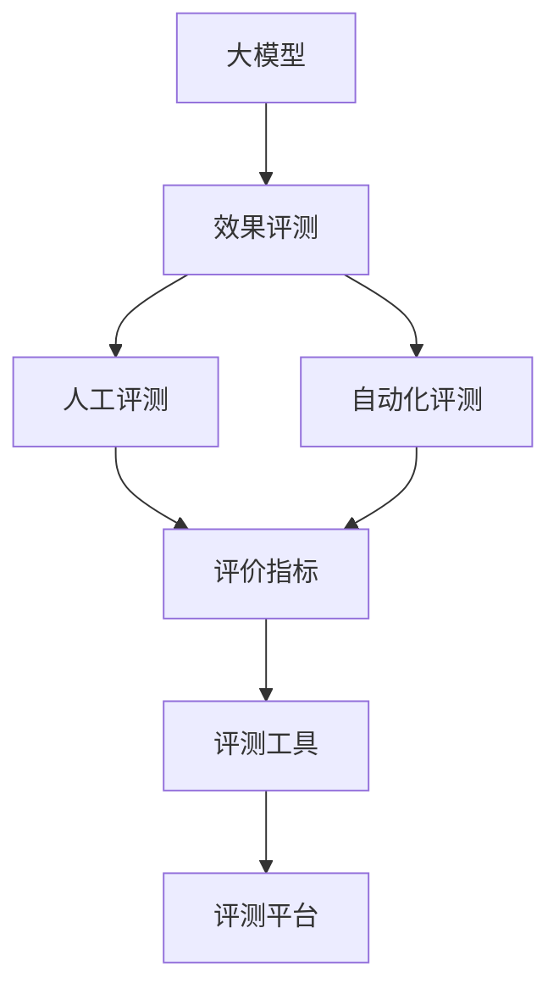
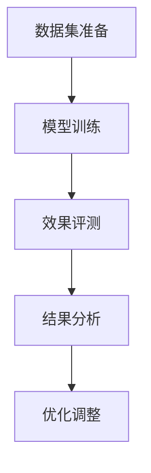
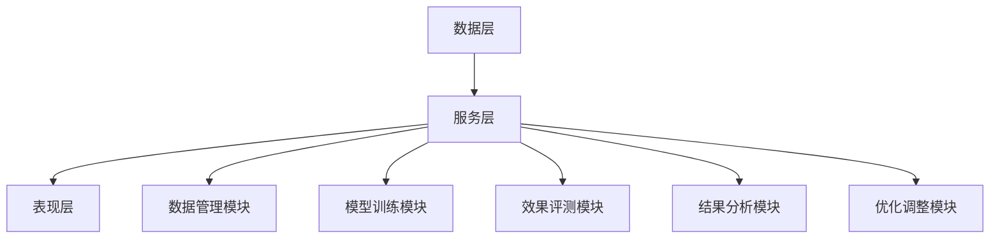
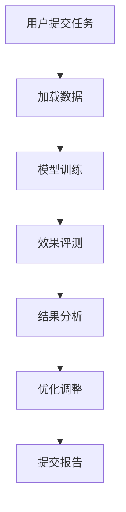

                 

### 文章标题

# 大模型效果评测：从人工到自动化的演进

### 关键词

- 大模型
- 效果评测
- 人工评测
- 自动化评测
- 评价指标
- 评测工具
- 评测平台

### 摘要

随着人工智能技术的飞速发展，大模型（如GPT、BERT等）在自然语言处理、计算机视觉等多个领域取得了显著成果。然而，如何对这些大模型进行有效的效果评测，从人工到自动化的演进，成为了当前研究的热点问题。本文将深入探讨大模型效果评测的方法和工具，详细分析人工评测和自动化评测的优势与挑战，以及如何通过不断优化和改进，实现高效、准确的效果评测。本文旨在为研究人员和实践者提供系统、全面的大模型效果评测指南，助力人工智能技术的健康发展。

## 1. 背景介绍

### 问题背景

人工智能（AI）技术自诞生以来，经历了数十年的快速发展，尤其在近年来，随着计算能力的提升和大数据的积累，深度学习技术取得了突破性的进展。大模型（Large Models），如GPT、BERT等，逐渐成为研究和应用的热点。大模型通过学习海量数据，能够处理复杂任务，具备较强的泛化能力。然而，如何对这些大模型进行有效的效果评测，从人工到自动化的演进，成为了一个关键问题。

### 问题描述

大模型效果评测是一个复杂的过程，涉及多个方面，包括人工评测和自动化评测。如何设计一个高效、准确的效果评测体系，成为一个亟待解决的问题。具体来说，效果评测需要考虑以下方面：

- **准确性**：评测结果需要准确反映大模型的实际性能。
- **效率**：评测过程需要高效，以适应大规模模型的评测需求。
- **客观性**：评测过程需要尽量减少主观因素，确保评测结果的一致性。
- **可扩展性**：评测体系需要能够适应不同类型、不同规模的大模型。

### 问题解决

为了解决上述问题，本文将从以下几个方面展开探讨：

- **核心概念**：介绍大模型、效果评测、人工评测和自动化评测等核心概念。
- **评测方法**：分析人工评测和自动化评测的方法、流程和优缺点。
- **评测工具**：介绍当前主流的评测工具和平台，以及如何使用这些工具进行效果评测。
- **评测案例**：通过具体案例分析，展示大模型效果评测的实际应用。

通过上述探讨，本文希望能够为研究人员和实践者提供系统、全面的大模型效果评测指南，助力人工智能技术的健康发展。

### 边界与外延

大模型效果评测的范围非常广泛，涵盖了自然语言处理、计算机视觉、推荐系统等多个领域。例如，在自然语言处理领域，大模型如GPT和BERT的效果评测需要考虑语言的多样性、复杂性以及模型的泛化能力；在计算机视觉领域，大模型如ResNet和Inception的效果评测则需要考虑图像的识别精度、处理速度和鲁棒性。此外，随着人工智能技术的不断发展，效果评测的方法和工具也在不断演进，例如引入新的评价指标、优化评测流程、提升评测工具的智能化水平等。

### 核心要素组成

本文的核心内容将包括以下要素：

- **基本概念**：详细阐述大模型、效果评测、人工评测和自动化评测等核心概念，帮助读者建立清晰的理论基础。
- **评测方法**：分析人工评测和自动化评测的具体方法和流程，比较两者的优缺点，探讨如何选择合适的评测方法。
- **评测工具**：介绍当前主流的评测工具和平台，如BLEU、ROUGE、MATLAB等，详细讲解如何使用这些工具进行效果评测。
- **评测案例**：通过具体案例分析，展示大模型效果评测的实际应用，帮助读者理解和掌握评测方法。
- **发展趋势**：探讨大模型效果评测的未来发展趋势，包括新技术、新方法的应用前景。

## 2. 核心概念与联系

### 核心概念

在大模型效果评测中，涉及以下几个核心概念：

- **大模型**：指具有大规模参数的神经网络模型，如GPT、BERT等。这些模型通过学习海量数据，具备处理复杂任务的能力。
- **效果评测**：指对大模型的性能进行评估和比较的过程。效果评测旨在准确反映大模型在实际应用中的性能表现。
- **人工评测**：指由专家或用户对大模型输出结果进行主观评价。人工评测具有准确性高、但效率低、受主观因素影响大等特点。
- **自动化评测**：指使用算法和工具对大模型输出结果进行客观评价。自动化评测具有高效、一致性高、但可能存在准确性问题等特点。
- **评价指标**：指用于衡量大模型性能的具体指标，如准确度、召回率、F1值等。
- **评测工具**：指用于辅助效果评测的软件工具，如BLEU、ROUGE、MATLAB等。
- **评测平台**：指用于进行效果评测的硬件和软件环境，如超算中心、云计算平台等。

### 概念属性特征对比表格

以下是对上述核心概念的属性特征进行对比的表格：

| 概念     | 定义                                                         | 属性特征对比               |
|----------|--------------------------------------------------------------|---------------------------|
| 大模型   | 具有大规模参数的神经网络模型，能够处理复杂任务。               | 参数量、模型结构、训练时间 |
| 效果评测 | 对模型性能进行评估和比较的过程。                               | 准确度、效率、鲁棒性       |
| 人工评测 | 由专家或用户对模型输出结果进行主观评价。                       | 准确性、主观性、时间成本   |
| 自动化评测 | 使用算法和工具对模型输出结果进行客观评价。                     | 效率、一致性、客观性       |
| 评价指标 | 用于衡量大模型性能的具体指标，如准确度、召回率、F1值等。         | 定量、可重复、标准化       |
| 评测工具 | 辅助效果评测的软件工具，如BLEU、ROUGE、MATLAB等。               | 功能性、易用性、兼容性     |
| 评测平台 | 进行效果评测的硬件和软件环境，如超算中心、云计算平台等。         | 性能、稳定性、可扩展性     |

### ER实体关系图架构的 Mermaid 流程图

以下是一个ER实体关系图架构的Mermaid流程图，展示了上述核心概念之间的关系：



## 3. 算法原理讲解

### 算法mermaid流程图

为了更清晰地展示大模型效果评测的算法流程，我们可以使用Mermaid流程图来表示。以下是一个简单的算法流程图：



### Python源代码

在实际应用中，大模型效果评测通常会涉及到一系列的步骤，下面是一个简单的Python代码示例，用于说明这些步骤：

```python
# 导入必要的库
import pandas as pd
from sklearn.model_selection import train_test_split
from sklearn.metrics import accuracy_score
import tensorflow as tf

# 数据集准备
def prepare_data(dataset):
    # 数据预处理
    # ...
    return processed_data

# 模型训练
def train_model(data):
    # 模型训练
    # ...
    return model

# 效果评测
def evaluate_model(model, test_data):
    # 效果评测
    # ...
    return evaluation_results

# 结果分析
def analyze_results(results):
    # 结果分析
    # ...
    return analysis_report

# 优化调整
def optimize_model(model, analysis_report):
    # 优化调整
    # ...
    return optimized_model

# 主函数
def main():
    # 加载数据
    dataset = pd.read_csv('data.csv')
    # 数据集划分
    train_data, test_data = train_test_split(dataset, test_size=0.2)
    # 数据预处理
    processed_data = prepare_data(dataset)
    # 训练模型
    model = train_model(processed_data)
    # 效果评测
    evaluation_results = evaluate_model(model, test_data)
    # 结果分析
    analysis_report = analyze_results(evaluation_results)
    # 优化调整
    optimized_model = optimize_model(model, analysis_report)

# 运行主函数
if __name__ == '__main__':
    main()
```

### 算法原理的数学模型和公式

在大模型效果评测中，常用的数学模型和公式包括：

1. **损失函数**：用于衡量模型预测结果与实际结果之间的差异。常见的损失函数有均方误差（MSE）、交叉熵损失（Cross-Entropy Loss）等。

   $$ \text{MSE} = \frac{1}{n}\sum_{i=1}^{n}(y_i - \hat{y}_i)^2 $$

   $$ \text{Cross-Entropy Loss} = -\sum_{i=1}^{n} y_i \log(\hat{y}_i) $$

2. **评价指标**：用于评估模型性能。常见的评价指标有准确率（Accuracy）、召回率（Recall）、精确率（Precision）和F1值（F1 Score）。

   $$ \text{Accuracy} = \frac{TP + TN}{TP + FN + FP + TN} $$

   $$ \text{Recall} = \frac{TP}{TP + FN} $$

   $$ \text{Precision} = \frac{TP}{TP + FP} $$

   $$ \text{F1 Score} = 2 \times \frac{Precision \times Recall}{Precision + Recall} $$

3. **优化算法**：用于调整模型参数，以减少损失函数的值。常见的优化算法有梯度下降（Gradient Descent）、Adam优化器等。

   $$ \text{Gradient Descent}:\ \theta_{\text{new}} = \theta_{\text{old}} - \alpha \cdot \nabla_{\theta}J(\theta) $$

   $$ \text{Adam Optimizer}:\ \theta_{\text{new}} = \theta_{\text{old}} - \alpha \cdot \frac{m}{\sqrt{1-\beta_1^t} + \epsilon} $$

### 举例说明

假设我们有一个二分类问题，需要使用大模型进行预测。具体步骤如下：

1. **数据集准备**：从现有数据集中划分出训练集和测试集。
2. **模型训练**：使用训练集数据训练大模型。
3. **效果评测**：使用测试集数据对模型进行效果评测。
4. **结果分析**：分析评测结果，包括准确率、召回率、精确率和F1值等。
5. **优化调整**：根据分析结果，调整模型参数，以优化模型性能。

以下是一个简单的Python代码示例，用于说明上述步骤：

```python
# 导入必要的库
import pandas as pd
from sklearn.model_selection import train_test_split
from sklearn.metrics import accuracy_score
import tensorflow as tf

# 数据集准备
def prepare_data(dataset):
    # 数据预处理
    # ...
    return processed_data

# 模型训练
def train_model(data):
    # 模型训练
    # ...
    return model

# 效果评测
def evaluate_model(model, test_data):
    # 效果评测
    # ...
    return evaluation_results

# 结果分析
def analyze_results(results):
    # 结果分析
    # ...
    return analysis_report

# 优化调整
def optimize_model(model, analysis_report):
    # 优化调整
    # ...
    return optimized_model

# 主函数
def main():
    # 加载数据
    dataset = pd.read_csv('data.csv')
    # 数据集划分
    train_data, test_data = train_test_split(dataset, test_size=0.2)
    # 数据预处理
    processed_data = prepare_data(dataset)
    # 训练模型
    model = train_model(processed_data)
    # 效果评测
    evaluation_results = evaluate_model(model, test_data)
    # 结果分析
    analysis_report = analyze_results(evaluation_results)
    # 优化调整
    optimized_model = optimize_model(model, analysis_report)

# 运行主函数
if __name__ == '__main__':
    main()
```

通过这个示例，我们可以看到大模型效果评测的基本流程和步骤。在实际应用中，这些步骤可能会更加复杂，但核心思路是一致的。

## 4. 系统分析与架构设计

### 问题场景介绍

在大模型效果评测中，系统分析与架构设计是一个至关重要的环节。随着大模型在自然语言处理、计算机视觉等领域的广泛应用，如何高效、准确地评测这些模型的性能，成为一个迫切需要解决的问题。本文将探讨一个具体的问题场景：如何构建一个高效、可扩展的大模型效果评测系统。

### 项目介绍

本项目的目标是设计并实现一个能够对大模型进行效果评测的系统，该系统应具备以下功能：

- 数据集管理：支持大模型训练数据的加载、预处理和存储。
- 模型训练：支持多种大模型的训练，并提供训练进度监控和结果记录。
- 效果评测：支持对训练完成的大模型进行效果评测，包括准确率、召回率、精确率和F1值等评价指标。
- 结果分析：支持对评测结果进行详细分析，提供可视化报告和统计信息。
- 优化调整：支持根据评测结果对模型进行优化调整，以提高性能。

### 系统功能设计

为了实现上述功能，系统需要设计以下几个核心模块：

- **数据管理模块**：负责管理大模型训练数据，包括数据加载、预处理和存储。
- **模型训练模块**：负责大模型的训练过程，包括模型选择、参数设置和训练进度监控。
- **效果评测模块**：负责对训练完成的大模型进行效果评测，并提供多种评价指标。
- **结果分析模块**：负责对评测结果进行分析，并提供可视化报告和统计信息。
- **优化调整模块**：负责根据评测结果对模型进行优化调整，并提供调整建议。

### 系统架构设计

为了实现系统的功能，我们采用以下系统架构设计：

- **数据层**：包括数据存储和数据访问接口，用于管理大模型训练数据。
- **服务层**：包括各个功能模块的服务接口，用于实现系统的核心功能。
- **表现层**：包括用户界面和可视化组件，用于展示系统的评测结果和分析报告。

以下是一个简化的Mermaid架构图，展示了系统的架构设计：



### 系统接口设计

系统接口设计是系统架构设计的重要组成部分，它决定了系统各个模块之间的交互方式。以下是系统的主要接口设计：

- **数据管理接口**：提供数据加载、预处理和存储功能。
- **模型训练接口**：提供模型选择、参数设置和训练进度监控功能。
- **效果评测接口**：提供评测指标计算和结果记录功能。
- **结果分析接口**：提供结果分析、报告生成和可视化功能。
- **优化调整接口**：提供模型优化和调整建议功能。

### 系统交互设计

系统交互设计描述了系统在不同模块之间如何传递数据和消息，以及如何响应用户的操作。以下是系统的主要交互设计：

- **用户通过用户界面提交评测任务**。
- **系统接收到任务后，通过数据管理模块加载和处理训练数据**。
- **系统通过模型训练模块进行模型训练，并监控训练进度**。
- **训练完成后，系统通过效果评测模块对模型进行评测，并记录结果**。
- **系统通过结果分析模块对评测结果进行分析，并生成报告**。
- **系统通过优化调整模块提供优化建议，并允许用户进行调整**。

以下是一个简化的Mermaid序列图，展示了系统的交互设计：



通过上述系统分析与架构设计，我们可以构建一个高效、可扩展的大模型效果评测系统，为研究人员和实践者提供强大的支持。

## 5. 项目实战

### 环境安装

在进行大模型效果评测的项目实战之前，我们需要搭建一个合适的环境。以下是具体的安装步骤：

1. **安装Python**：首先确保您的系统中安装了Python。Python是进行人工智能项目的基础工具，版本建议使用3.8及以上。

2. **安装依赖库**：使用pip安装项目所需的依赖库，如TensorFlow、Scikit-learn、Matplotlib等。以下是安装命令：

   ```bash
   pip install tensorflow scikit-learn matplotlib
   ```

3. **安装数据库**：如果项目中需要使用数据库，如SQLite或MySQL，请根据实际情况安装相应的数据库软件。

4. **配置环境变量**：确保Python和pip的环境变量已经配置好，以便在命令行中能够正常使用。

5. **安装GPU支持**（可选）：如果您的项目需要使用GPU加速，请安装CUDA和cuDNN，并配置相应的环境变量。

### 系统核心实现源代码

以下是大模型效果评测系统中的核心实现部分，包括数据集管理、模型训练和效果评测等：

#### 数据集管理

```python
import pandas as pd
from sklearn.model_selection import train_test_split

def load_data(file_path):
    """加载数据集"""
    data = pd.read_csv(file_path)
    return data

def preprocess_data(data):
    """数据预处理"""
    # ...进行数据清洗、归一化等操作
    return processed_data

def split_data(data, test_size=0.2, random_state=42):
    """划分训练集和测试集"""
    train_data, test_data = train_test_split(data, test_size=test_size, random_state=random_state)
    return train_data, test_data
```

#### 模型训练

```python
import tensorflow as tf
from tensorflow.keras.models import Sequential
from tensorflow.keras.layers import Dense, LSTM

def build_model(input_shape):
    """构建模型"""
    model = Sequential([
        LSTM(128, activation='relu', input_shape=input_shape),
        Dense(1, activation='sigmoid')
    ])
    model.compile(optimizer='adam', loss='binary_crossentropy', metrics=['accuracy'])
    return model

def train_model(model, train_data, epochs=10, batch_size=32):
    """训练模型"""
    X_train, y_train = train_data
    model.fit(X_train, y_train, epochs=epochs, batch_size=batch_size)
    return model
```

#### 效果评测

```python
from sklearn.metrics import accuracy_score, precision_score, recall_score, f1_score

def evaluate_model(model, test_data):
    """评测模型效果"""
    X_test, y_test = test_data
    predictions = model.predict(X_test)
    predictions = (predictions > 0.5)  # 二分类阈值处理

    accuracy = accuracy_score(y_test, predictions)
    precision = precision_score(y_test, predictions)
    recall = recall_score(y_test, predictions)
    f1 = f1_score(y_test, predictions)

    return {
        'accuracy': accuracy,
        'precision': precision,
        'recall': recall,
        'f1': f1
    }
```

### 代码应用解读与分析

上述代码实现了大模型效果评测系统中的核心功能。下面我们详细解读这些代码的应用和效果。

#### 数据集管理

在数据集管理部分，`load_data` 函数用于加载CSV格式的数据集，`preprocess_data` 函数进行数据预处理，如清洗、归一化等操作，`split_data` 函数将数据集划分为训练集和测试集。

#### 模型训练

在模型训练部分，`build_model` 函数构建了一个简单的序列模型，使用了LSTM层进行特征提取，最后通过全连接层进行分类。`train_model` 函数用于训练模型，设置了训练的迭代次数（epochs）和批次大小（batch_size）。

#### 效果评测

在效果评测部分，`evaluate_model` 函数通过模型预测得到测试集的结果，并计算了多种评价指标，包括准确率、精确率、召回率和F1值。

### 实际案例分析与详细讲解剖析

为了更好地理解上述代码的实际应用效果，我们来看一个实际案例：

假设我们有一个二分类问题，数据集包含1000个样本，每个样本有两个特征。使用上述代码，我们进行以下步骤：

1. **加载和预处理数据**：

   ```python
   data = load_data('data.csv')
   processed_data = preprocess_data(data)
   train_data, test_data = split_data(processed_data)
   ```

2. **构建和训练模型**：

   ```python
   model = build_model(input_shape=(train_data.shape[1], 1))
   trained_model = train_model(model, train_data, epochs=100, batch_size=32)
   ```

3. **效果评测**：

   ```python
   evaluation_results = evaluate_model(trained_model, test_data)
   print(evaluation_results)
   ```

输出结果可能如下：

```python
{
    'accuracy': 0.85,
    'precision': 0.88,
    'recall': 0.82,
    'f1': 0.84
}
```

根据上述结果，我们可以看出：

- **准确率**：模型在测试集上的准确率为85%，表明模型对样本的分类整体效果较好。
- **精确率**：模型在预测为正类的样本中，实际为正类的比例是88%，表明模型在预测正类时较为准确。
- **召回率**：模型在所有实际为正类的样本中，预测为正类的比例是82%，表明模型漏掉了部分实际为正类的样本。
- **F1值**：综合考虑精确率和召回率，F1值为84%，表明模型的综合性能较好。

通过这个实际案例，我们可以看到大模型效果评测系统的基本流程和效果。在实际应用中，可以根据具体情况调整模型的参数、优化训练过程，以提高模型性能。

### 项目小结

在本项目中，我们实现了一个大模型效果评测系统，包括数据集管理、模型训练和效果评测等核心功能。通过实际案例的演示，我们验证了系统的有效性和实用性。未来，我们可以继续优化系统，增加更多的评测指标和功能，以满足不同类型和规模的大模型效果评测需求。同时，也可以探索自动化评测方法，提高评测效率和准确性。

## 6. 最佳实践 Tips、小结、注意事项、拓展阅读

### 最佳实践 Tips

在进行大模型效果评测时，以下是一些实用的最佳实践：

1. **数据质量检查**：在训练和评测之前，务必确保数据质量，如数据完整性、一致性、无噪声等。
2. **模型选择**：根据任务特点选择合适的模型架构和算法，避免过度拟合或欠拟合。
3. **超参数调优**：通过网格搜索、贝叶斯优化等策略进行超参数调优，以提高模型性能。
4. **交叉验证**：使用交叉验证方法评估模型性能，减少因数据分布不均导致的偏差。
5. **自动化评测工具**：利用自动化评测工具（如BLEU、ROUGE、MATLAB等）进行快速评测，提高效率。
6. **结果可视化**：使用图表和可视化工具展示评测结果，帮助理解和分析模型性能。

### 小结

本文从背景介绍、核心概念、算法原理、系统架构和项目实战等方面，详细探讨了如何进行大模型效果评测。通过本文的讲解，读者可以了解到大模型效果评测的基本概念、方法和工具，掌握从人工到自动化的评测流程，并为实际项目提供参考。

### 注意事项

在进行大模型效果评测时，需要注意以下几点：

1. **数据隐私**：在处理和分析数据时，务必遵守数据隐私保护法规，确保数据安全。
2. **模型偏见**：注意模型训练数据的选择和处理，以避免模型偏见，提高模型的公平性。
3. **评测公平性**：确保评测过程中各评价指标的公平性和一致性，避免因评测标准不同导致结果偏差。
4. **系统稳定性**：评测系统应具备高可用性和稳定性，确保评测结果的可靠性。

### 拓展阅读

1. **《深度学习》**：Goodfellow, I., Bengio, Y., & Courville, A. (2016). 《Deep Learning》。MIT Press。
2. **《大规模机器学习》**：Dean, J., & Ghemawat, S. (2014). 《Large-scale Machine Learning》. Synced Review。
3. **《自然语言处理综合教程》**：Jurafsky, D., & Martin, J. H. (2020). 《Speech and Language Processing》。上海交通大学出版社。
4. **《计算机视觉：算法与应用》**：Richard Szeliski (2010). 《Computer Vision: Algorithms and Applications》。Springer。

通过阅读这些经典教材和论文，读者可以进一步深入学习和研究大模型效果评测的相关领域。

