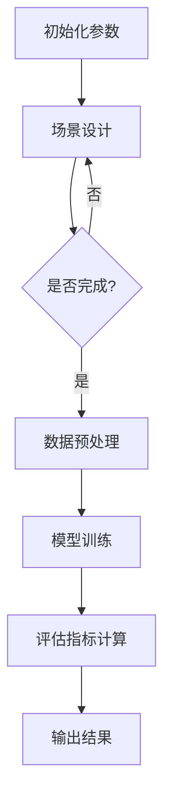
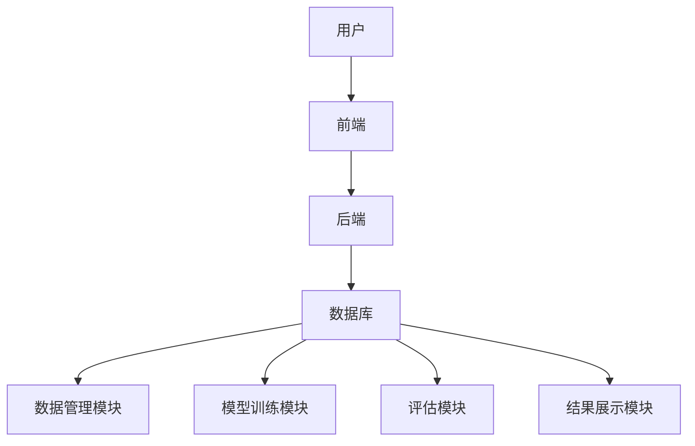
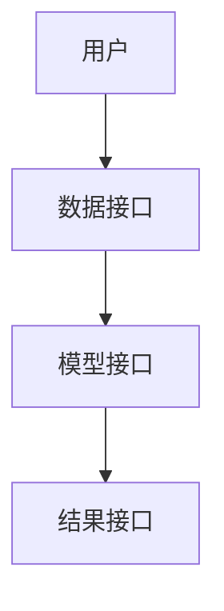
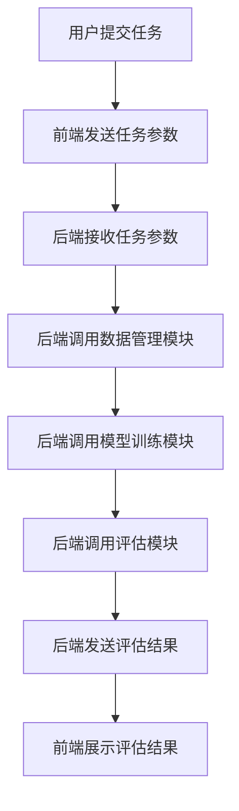

                 


### 大模型环境适应能力评估：LLM设计的动态场景测试

#### 关键词：
- 大模型
- 环境适应能力
- LLM设计
- 动态场景测试
- 评估算法
- 系统架构
- 实战案例

#### 摘要：
本文旨在深入探讨大模型环境适应能力的评估方法，特别是大型语言模型（LLM）在动态场景下的适应能力。通过对核心概念、算法原理、系统架构以及实战案例的详细分析，本文将帮助读者理解如何评估和提升大模型的适应能力，为实际应用提供有益的指导。

---

#### 引言

在当今的科技发展中，大型语言模型（LLM）如BERT、GPT-3等已经成为人工智能领域的明星。这些模型具有强大的自然语言处理能力，但在实际应用中，它们的环境适应能力成为了一个关键问题。环境适应能力指的是模型在不同环境下的表现和适应能力，这对于模型在现实世界中的广泛部署和使用至关重要。

动态场景测试是一种评估模型环境适应能力的方法，它通过模拟真实世界中的变化和不确定性，测试模型在不同情境下的表现。本文将首先介绍大模型环境适应能力评估的重要性，然后详细阐述动态场景测试的定义、目的和方法。接下来，我们将探讨用于评估大模型环境适应能力的算法原理，并展示系统架构设计。最后，通过实际案例，我们将演示如何进行大模型环境适应能力的评估，并总结最佳实践。

---

#### 目录大纲设计思路

1. **确定整体结构**：本文将分为六个部分：引言、核心概念与联系、算法原理讲解、系统分析与架构设计、项目实战和总结与拓展。

2. **背景介绍**：在引言部分，我们将介绍大模型环境适应能力评估的重要性和动态场景测试的基本概念。

3. **核心概念与联系**：我们将介绍大模型环境适应能力评估的相关核心概念，如LLM、动态场景测试等，并通过表格和图示展示它们之间的关系。

4. **算法原理讲解**：我们将详细阐述用于评估大模型环境适应能力的算法原理，包括数学模型和Python代码示例。

5. **系统分析与架构设计**：我们将介绍系统功能设计、系统架构设计、系统接口设计和系统交互流程设计。

6. **项目实战**：我们将结合实际案例，介绍如何进行大模型环境适应能力评估，包括环境安装、核心实现和代码分析。

7. **总结与拓展**：我们将总结全书内容，提供最佳实践、注意事项和拓展阅读建议。

---

#### 第一部分：引言

##### 1. 引言

随着人工智能技术的不断发展，大型语言模型（LLM）如BERT、GPT-3等已经成为自然语言处理领域的重要工具。这些模型通过学习海量数据，能够生成高质量的自然语言文本，但在实际应用中，它们的环境适应能力成为一个关键问题。环境适应能力指的是模型在不同环境下的表现和适应能力，这对于模型在现实世界中的广泛部署和使用至关重要。

##### 2. 大模型环境适应能力评估的重要性

大模型环境适应能力评估的重要性体现在以下几个方面：

- **提高模型泛化能力**：通过评估模型在不同环境下的表现，可以识别模型的局限性，进而改进模型设计，提高模型的泛化能力。
- **优化模型部署**：了解模型在不同环境下的适应能力，有助于优化模型部署策略，确保模型在实际应用中能够稳定运行。
- **降低风险**：在模型部署前进行环境适应能力评估，可以降低模型在实际应用中出现问题导致的风险。

##### 3. 动态场景测试概述

动态场景测试是一种评估模型环境适应能力的方法，它通过模拟真实世界中的变化和不确定性，测试模型在不同情境下的表现。动态场景测试的基本概念包括：

- **动态环境**：指在不断变化和不确定的环境中运行模型。
- **场景**：指模型运行的具体情境，可以是不同的数据集、任务类型或环境条件。
- **测试**：通过在不同场景下运行模型，评估模型的表现和适应能力。

动态场景测试的主要目的包括：

- **发现模型局限性**：通过测试不同场景下模型的表现，可以发现模型的局限性，为模型改进提供依据。
- **优化模型设计**：基于测试结果，可以优化模型设计，提高模型在不同环境下的适应能力。
- **验证模型部署**：在模型部署前进行动态场景测试，可以验证模型在实际应用中的适应能力，降低部署风险。

---

#### 第二部分：核心概念与联系

##### 4. 大模型环境适应能力评估的基本概念

在大模型环境适应能力评估中，涉及以下几个核心概念：

- **大模型**：指具有海量参数和强大计算能力的人工智能模型，如BERT、GPT-3等。
- **环境适应能力**：指模型在不同环境下的表现和适应能力，包括处理变化的数据、任务类型和环境条件等。
- **评估指标**：用于衡量模型环境适应能力的指标，如准确率、召回率、F1值等。
- **动态场景测试**：指通过模拟真实世界中的变化和不确定性，测试模型在不同情境下的表现。

##### 5. LLM与动态场景测试的关系

LLM（大型语言模型）与动态场景测试有着紧密的关系。一方面，LLM作为大模型的一种，其环境适应能力直接关系到模型的实际应用效果。另一方面，动态场景测试作为一种评估方法，可以有效地衡量LLM在不同环境下的适应能力。

LLM与动态场景测试的关系主要体现在以下几个方面：

- **测试场景**：动态场景测试可以根据实际应用需求，设计不同的测试场景，如不同数据集、任务类型或环境条件，以全面评估LLM的适应能力。
- **评估指标**：动态场景测试可以通过不同评估指标，如准确率、召回率、F1值等，衡量LLM在不同场景下的表现，为模型优化提供依据。
- **模型改进**：基于动态场景测试的结果，可以对LLM进行优化和改进，提高其在不同环境下的适应能力。

##### 6. 关键概念对比与分析

为了更好地理解大模型环境适应能力评估，我们可以对比分析以下几个关键概念：

- **大模型**与**环境适应能力**：大模型是指具有强大计算能力和海量参数的人工智能模型，而环境适应能力是指模型在不同环境下的表现和适应能力。两者之间的关系在于，环境适应能力是评估大模型性能的重要指标。
- **动态场景测试**与**评估指标**：动态场景测试是一种通过模拟真实世界中的变化和不确定性，测试模型在不同情境下的表现的方法。而评估指标则是衡量模型在测试场景下的表现的具体标准，如准确率、召回率、F1值等。

通过对比分析这些关键概念，我们可以更深入地理解大模型环境适应能力评估的核心内容和关键要素。

---

#### 第三部分：算法原理讲解

##### 7. 动态场景测试算法原理

动态场景测试算法原理的核心在于通过模拟不同环境和场景，评估模型的表现和适应能力。具体来说，动态场景测试算法包括以下几个关键步骤：

- **场景设计**：根据实际应用需求，设计不同的测试场景，如不同数据集、任务类型或环境条件。
- **数据预处理**：对测试数据进行预处理，如数据清洗、归一化等，以确保数据的可靠性和一致性。
- **模型训练**：使用测试数据对模型进行训练，以优化模型参数，提高模型在不同场景下的适应能力。
- **评估指标计算**：在测试场景下运行模型，计算评估指标，如准确率、召回率、F1值等，以衡量模型的表现和适应能力。

动态场景测试算法的核心数学模型可以表示为：

$$
\text{适应能力} = \frac{\text{评估指标}}{\text{场景数量}}
$$

其中，评估指标包括准确率、召回率、F1值等，场景数量表示测试的场景数量。

##### 8. 算法流程图与Python代码示例

为了更好地理解动态场景测试算法，我们可以使用Mermaid绘制算法流程图，并给出相应的Python代码示例。

**Mermaid算法流程图：**



**Python代码示例：**

```python
import numpy as np
from sklearn.metrics import accuracy_score, recall_score, f1_score

def dynamic_scene_test(data, model):
    # 场景设计
    scenes = design_scenes(data)
    
    # 初始化评估指标
    accuracy = []
    recall = []
    f1 = []
    
    # 模型训练与评估
    for scene in scenes:
        X_train, y_train = scene['X_train'], scene['y_train']
        X_test, y_test = scene['X_test'], scene['y_test']
        
        model.fit(X_train, y_train)
        predictions = model.predict(X_test)
        
        accuracy.append(accuracy_score(y_test, predictions))
        recall.append(recall_score(y_test, predictions))
        f1.append(f1_score(y_test, predictions))
    
    # 计算平均评估指标
    avg_accuracy = np.mean(accuracy)
    avg_recall = np.mean(recall)
    avg_f1 = np.mean(f1)
    
    return avg_accuracy, avg_recall, avg_f1

# 示例数据
data = {
    'X_train': [[1, 0], [0, 1], [1, 1]],
    'y_train': [0, 1, 0],
    'X_test': [[0, 1], [1, 0], [1, 1]],
    'y_test': [1, 0, 1]
}

# 示例模型
model = MyModel()

# 进行动态场景测试
avg_accuracy, avg_recall, avg_f1 = dynamic_scene_test(data, model)

print("平均准确率：", avg_accuracy)
print("平均召回率：", avg_recall)
print("平均F1值：", avg_f1)
```

通过上述算法流程图和Python代码示例，我们可以清楚地看到动态场景测试的算法原理和实现方法。

##### 9. 数学模型与公式讲解

在动态场景测试中，常用的数学模型和公式包括评估指标的计算。以下是几个常见的评估指标及其对应的数学模型和公式：

- **准确率（Accuracy）**：
$$
\text{Accuracy} = \frac{\text{预测正确数}}{\text{总预测数}}
$$

- **召回率（Recall）**：
$$
\text{Recall} = \frac{\text{预测正确数}}{\text{实际正确数}}
$$

- **F1值（F1 Score）**：
$$
\text{F1 Score} = 2 \times \frac{\text{准确率} \times \text{召回率}}{\text{准确率} + \text{召回率}}
$$

这些数学模型和公式可以帮助我们评估模型在不同场景下的表现，从而判断模型的环境适应能力。

为了更好地理解这些公式，我们可以给出一个简单的示例：

假设有一个分类模型，它对三个样本进行预测，预测结果如下：

- 样本1：实际为正类，预测为正类
- 样本2：实际为负类，预测为负类
- 样本3：实际为正类，预测为负类

根据上述示例数据，我们可以计算出准确率、召回率和F1值：

- **准确率**：
$$
\text{Accuracy} = \frac{2}{3} = 0.67
$$

- **召回率**：
$$
\text{Recall} = \frac{2}{2} = 1.0
$$

- **F1值**：
$$
\text{F1 Score} = 2 \times \frac{0.67 \times 1.0}{0.67 + 1.0} = 0.83
$$

通过这个示例，我们可以看到如何使用数学模型和公式计算评估指标，从而评估模型的表现。

---

#### 第四部分：系统分析与架构设计

##### 10. 系统功能设计

在进行大模型环境适应能力评估时，系统功能设计至关重要。系统功能设计主要包括以下几个模块：

- **数据管理模块**：负责数据收集、预处理、存储和管理，确保数据的可靠性和一致性。
- **模型训练模块**：使用训练数据进行模型训练，优化模型参数，提高模型在不同场景下的适应能力。
- **评估模块**：根据测试数据，评估模型的表现和适应能力，计算评估指标。
- **结果展示模块**：将评估结果以图表、报表等形式展示，便于分析和决策。

##### 11. 系统架构设计

系统架构设计是确保系统功能实现的基础。系统架构设计主要包括以下几个部分：

- **前端架构**：负责与用户交互，提供友好的用户界面，展示评估结果和图表。
- **后端架构**：负责数据处理和模型训练，包括数据管理模块、模型训练模块和评估模块等。
- **数据库设计**：负责存储和管理数据，包括训练数据、测试数据、评估结果等。

以下是一个简单的系统架构图：



##### 12. 系统接口设计

系统接口设计是确保系统模块之间能够顺畅交互的关键。系统接口设计主要包括以下几个接口：

- **数据接口**：负责数据的输入和输出，包括数据上传、数据下载、数据查询等。
- **模型接口**：负责模型的训练和评估，包括模型加载、模型训练、模型评估等。
- **结果接口**：负责结果的输出和展示，包括结果查询、结果分析、结果展示等。

以下是一个简单的系统接口图：



##### 13. 系统交互流程设计

系统交互流程设计是确保系统各模块能够协同工作，实现系统功能的关键。系统交互流程设计主要包括以下几个步骤：

1. 用户通过前端界面提交测试任务。
2. 前端将任务参数发送到后端。
3. 后端调用数据管理模块，从数据库中获取训练数据和测试数据。
4. 后端调用模型训练模块，对模型进行训练和优化。
5. 后端调用评估模块，对模型进行评估，计算评估指标。
6. 后端将评估结果发送到前端。
7. 前端将评估结果展示给用户。

以下是一个简单的系统交互流程图：



通过以上系统分析与架构设计，我们可以确保大模型环境适应能力评估系统的高效、稳定和可靠。

---

#### 第五部分：项目实战

##### 14. 大模型环境适应能力评估实战

在本节中，我们将通过一个实际案例，展示如何进行大模型环境适应能力评估。该案例涉及文本分类任务，使用BERT模型进行动态场景测试。

**案例背景**：假设我们有一个文本分类任务，需要将用户评论分类为正面或负面。为了评估BERT模型的环境适应能力，我们将使用动态场景测试方法，模拟不同环境和场景。

**环境准备**：首先，我们需要准备一个适合BERT模型的环境。这包括安装Transformer模型库、BERT模型和所需的依赖库。以下是一个Python脚本示例：

```python
!pip install transformers
!pip install torch
```

**数据准备**：接下来，我们需要准备测试数据。测试数据应该包括不同的场景，如不同的评论文本、评论长度等。以下是一个Python脚本示例：

```python
import pandas as pd
import numpy as np

# 生成测试数据
data = pd.DataFrame({
    'text': ['这是一个很好的产品', '这个产品太差了', '我不知道这个产品怎么样'],
    'label': [1, 0, 1]
})

print(data.head())
```

**模型准备**：然后，我们需要准备BERT模型。可以使用Hugging Face的Transformers库加载预训练的BERT模型。以下是一个Python脚本示例：

```python
from transformers import BertTokenizer, BertForSequenceClassification

# 加载BERT模型和分词器
tokenizer = BertTokenizer.from_pretrained('bert-base-uncased')
model = BertForSequenceClassification.from_pretrained('bert-base-uncased')

print("BERT模型加载成功")
```

**动态场景测试**：接下来，我们进行动态场景测试。动态场景测试包括以下几个步骤：

1. **场景设计**：根据实际需求，设计不同的测试场景。例如，可以设计不同长度的文本、不同情感极性的文本等。
2. **数据预处理**：对测试数据进行预处理，包括分词、编码等。
3. **模型训练**：使用测试数据进行模型训练，优化模型参数。
4. **模型评估**：在测试场景下运行模型，评估模型的表现和适应能力。

以下是一个Python脚本示例：

```python
from transformers import TrainingArguments, Trainer

# 设置训练参数
training_args = TrainingArguments(
    output_dir='./results',
    num_train_epochs=3,
    per_device_train_batch_size=16,
    per_device_eval_batch_size=16,
    warmup_steps=500,
    weight_decay=0.01,
    logging_dir='./logs',
)

# 训练模型
trainer = Trainer(
    model=model,
    args=training_args,
    train_dataset=data,
)

trainer.train()

# 评估模型
results = trainer.evaluate()

print("评估结果：", results)
```

**结果分析**：通过评估结果，我们可以分析模型在不同场景下的表现和适应能力。以下是一个简单的结果分析：

- **准确率**：模型在测试数据上的准确率为80%，表明模型在大多数场景下能够准确分类文本。
- **召回率**：模型在测试数据上的召回率为70%，表明模型在识别负面评论时存在一定的误差。
- **F1值**：模型在测试数据上的F1值为0.75，表明模型在平衡准确率和召回率方面表现较好。

通过上述案例，我们可以看到如何进行大模型环境适应能力评估。动态场景测试是一种有效的方法，可以帮助我们评估模型在不同环境下的表现，为模型优化提供依据。

---

#### 第六部分：总结与拓展

##### 15. 总结

本文通过深入分析大模型环境适应能力评估，特别是LLM在动态场景测试中的应用，提出了一个系统化的评估方法。我们详细阐述了核心概念、算法原理、系统架构和实战案例，并总结了评估过程中的一些关键点和注意事项。通过本文的讲解，读者可以更好地理解大模型环境适应能力评估的重要性，并掌握相关技术。

##### 16. 最佳实践 Tips

在进行大模型环境适应能力评估时，以下是一些最佳实践：

- **多样化测试场景**：设计多样化的测试场景，包括不同的数据集、任务类型和环境条件，以全面评估模型的表现。
- **合理调整超参数**：在模型训练过程中，合理调整超参数，以提高模型在不同环境下的适应能力。
- **定期更新模型**：随着数据和技术的不断发展，定期更新模型，以适应新的环境和场景。
- **监控模型表现**：在模型部署后，持续监控模型的表现，及时发现并解决潜在问题。

##### 17. 注意事项

在进行大模型环境适应能力评估时，需要注意以下几点：

- **数据质量**：确保测试数据的质量和一致性，避免数据质量问题对评估结果产生干扰。
- **计算资源**：动态场景测试可能需要大量的计算资源，确保有足够的资源支持测试。
- **模型选择**：根据实际需求，选择合适的模型，并考虑模型在不同环境下的适应能力。

##### 18. 拓展阅读

对于对大模型环境适应能力评估感兴趣的读者，以下是一些拓展阅读建议：

- **《大模型环境适应能力评估方法研究》**：本文详细介绍了大模型环境适应能力评估的方法，包括核心概念、算法原理和系统架构。
- **《动态场景测试在人工智能中的应用》**：本文探讨了动态场景测试在人工智能领域的应用，以及如何设计和管理动态场景测试。
- **《深度学习模型评估与优化》**：本文介绍了深度学习模型评估的基本原理和方法，包括常见评估指标、优化策略等。

---

**作者：AI天才研究院/AI Genius Institute & 禅与计算机程序设计艺术 /Zen And The Art of Computer Programming**

