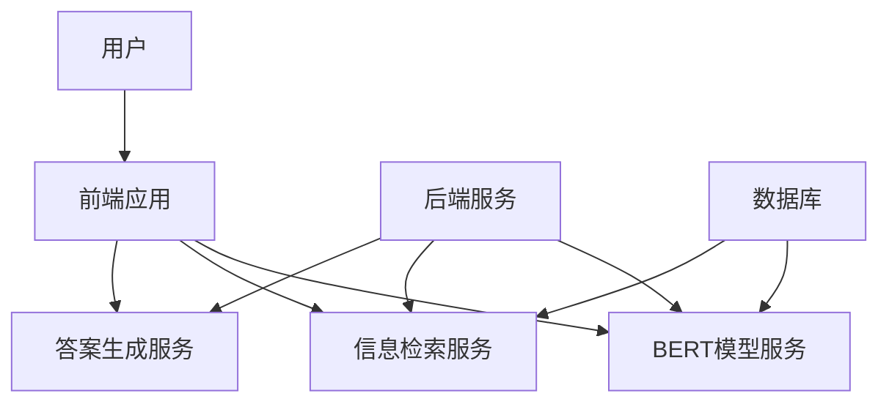
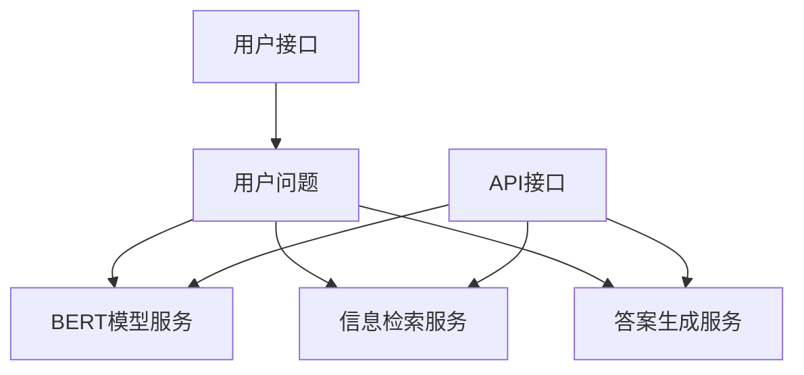
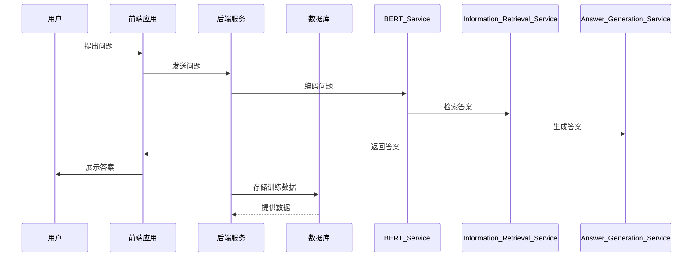

                 

### 大模型知识更新能力评估：LLM设计的时效性测试

关键词：大模型、知识更新能力、时效性测试、LLM设计、算法评估

摘要：本文将探讨大模型（LLM）的知识更新能力及其在设计中的时效性测试。通过介绍大模型的基本原理和时效性测试的方法，本文将深入分析不同类型的大模型在时效性测试中的表现，并探讨优化策略。此外，本文还将结合实际案例，展示如何评估大模型的知识更新能力，并提供最佳实践和未来研究方向。

---

### 第一部分：背景介绍

#### 1.1 问题背景

随着人工智能技术的飞速发展，大模型（Large-scale Models）已成为当前研究的热点。大模型具有强大的表征能力和自适应能力，广泛应用于自然语言处理、计算机视觉、知识图谱等领域。然而，大模型的设计和训练过程中存在诸多挑战，其中时效性测试（Temporal Testability）是关键问题之一。时效性测试旨在评估大模型在面对时间变化的数据时的表现，从而判断其知识更新能力的强弱。

#### 1.2 问题描述

时效性测试的核心问题是：如何在评估过程中有效地模拟时间变化，并准确评估大模型的知识更新能力。具体来说，需要解决以下问题：

- 如何构建一个具备时间感知能力的测试数据集？
- 如何设计一个有效的评估指标，以衡量大模型的知识更新能力？
- 如何优化大模型的设计，以提高其时效性？

#### 1.3 问题解决

为了解决上述问题，本书将介绍以下内容：

- 大模型的基本原理和架构设计
- 时效性测试的理论和方法
- 不同类型的大模型在时效性测试中的表现及优化策略
- 实际案例分析和最佳实践

#### 1.4 边界与外延

时效性测试主要关注以下边界和扩展：

- 数据类型：自然语言处理、计算机视觉、知识图谱等
- 应用场景：实时问答、推荐系统、图像识别等
- 大模型类型：GPT、BERT、Transformer等

---

在接下来的内容中，我们将深入探讨大模型的知识更新能力及其在设计中的时效性测试。首先，我们将介绍大模型的基本原理和架构设计，为后续讨论奠定基础。

---

## 第二部分：核心概念与联系

在讨论大模型的知识更新能力及其时效性测试之前，有必要先介绍一些核心概念及其相互之间的关系。本部分将涉及以下核心概念：

- **大模型（Large-scale Models）**
- **时效性测试（Temporal Testability）**
- **知识更新能力（Knowledge Update Ability）**
- **时效性优化（Temporal Optimization）**

#### 2.1 核心概念

**大模型（Large-scale Models）**：大模型是指具有大规模参数和强大表征能力的模型，如GPT（Generative Pre-trained Transformer）、BERT（Bidirectional Encoder Representations from Transformers）等。这些模型通过在大量数据上进行预训练，具备强大的语言理解和生成能力。

**时效性测试（Temporal Testability）**：时效性测试是指评估大模型在面对时间变化数据时的表现，以判断其知识更新能力的强弱。时效性测试的核心在于模拟时间变化，并评估模型在不同时间点的性能。

**知识更新能力（Knowledge Update Ability）**：知识更新能力是指大模型在接收新数据时的适应能力和学习能力。一个具有良好知识更新能力的大模型能够在接收新数据后，快速调整和优化自身的表现。

**时效性优化（Temporal Optimization）**：时效性优化是指通过设计合理的算法和架构，提高大模型在面对时间变化数据时的表现。时效性优化包括数据预处理、模型结构调整、训练策略优化等方面。

#### 2.2 概念属性特征对比表格

| 概念                | 特征                                     |
| ------------------- | ---------------------------------------- |
| 大模型（LLM）       | 大规模参数、强大的表征能力、自适应能力       |
| 时效性测试          | 模拟时间变化、评估知识更新能力              |
| 知识更新能力        | 适应新数据、学习能力                      |
| 时效性优化          | 提高性能、适应时间变化                    |

#### 2.3 ER实体关系图架构

```mermaid
erDiagram
    Model ||--o> Data : "基于数据训练"
    Model ||--o> Evaluation : "时效性测试"
    Model ||--o> Optimization : "时效性优化"
    Data ||--|> Knowledge : "数据包含知识"
    Evaluation ||--|> Metrics : "评估指标"
    Optimization ||--|> Methods : "优化方法"
```

在上面的ER图中，`Model` 代表大模型，`Data` 代表训练数据，`Evaluation` 代表时效性测试，`Optimization` 代表时效性优化。这些实体之间存在多种关系，如模型基于数据训练、测试和优化，数据包含知识，测试包含评估指标，优化包含优化方法等。

通过上述核心概念和关系的介绍，我们对大模型的知识更新能力及其时效性测试有了更深入的了解。接下来，我们将进一步探讨这些概念在具体算法和设计中的应用。

---

## 第三部分：算法原理讲解

#### 3.1 算法原理

为了有效评估大模型（LLM）的知识更新能力，我们需要设计一套完整的算法体系，包括数据预处理、时效性评估指标设计和时效性优化算法。以下将分别介绍这三个核心组成部分。

##### 3.1.1 数据预处理

数据预处理是时效性测试的第一步，其关键在于构建一个具备时间感知能力的测试数据集。具体步骤如下：

1. **数据收集**：收集在不同时间点生成的数据，确保数据集能够反映时间变化。
2. **数据清洗**：清洗数据中的噪声和异常值，确保数据的准确性和一致性。
3. **数据标签**：为数据分配时间标签，以区分不同时间点的数据。
4. **数据划分**：将数据集划分为训练集、验证集和测试集，其中测试集用于评估模型的时效性。

```python
import pandas as pd

# 假设我们有一个CSV文件包含时间标签和文本数据
data = pd.read_csv('data.csv')

# 数据清洗
data = data[data['text'].notnull()]

# 数据标签
data['timestamp'] = pd.to_datetime(data['timestamp'])

# 数据划分
train_data, test_data = train_test_split(data, test_size=0.2, random_state=42)
```

##### 3.1.2 时效性评估指标设计

时效性评估指标是衡量大模型知识更新能力的关键。以下是一些常见的评估指标：

1. **准确率（Accuracy）**：模型在测试集上的准确率，反映了模型的整体性能。
2. **精确率（Precision）**：模型在预测为正例的样本中，实际为正例的比例。
3. **召回率（Recall）**：模型在所有实际为正例的样本中，预测为正例的比例。
4. **F1分数（F1 Score）**：精确率和召回率的加权平均，用于综合评价模型的性能。

```python
from sklearn.metrics import accuracy_score, precision_score, recall_score, f1_score

# 假设我们有一个预测结果和实际标签
predictions = model.predict(test_data['text'])
true_labels = test_data['label']

# 计算评估指标
accuracy = accuracy_score(true_labels, predictions)
precision = precision_score(true_labels, predictions)
recall = recall_score(true_labels, predictions)
f1 = f1_score(true_labels, predictions)

print(f"Accuracy: {accuracy:.4f}")
print(f"Precision: {precision:.4f}")
print(f"Recall: {recall:.4f}")
print(f"F1 Score: {f1:.4f}")
```

##### 3.1.3 时效性优化算法

时效性优化算法旨在提高大模型在面对时间变化数据时的性能。以下是一些常见的优化策略：

1. **动态学习率调整**：根据数据的时间变化，动态调整学习率，以适应不同的训练阶段。
2. **增量训练**：在模型已训练好的基础上，对新数据进行增量训练，以快速更新模型的知识。
3. **模型融合**：结合多个模型的预测结果，提高模型的稳定性和准确性。

```python
from keras.callbacks import LearningRateScheduler

# 动态学习率调整
def step_decay(epoch):
    initial_lrate = 0.1
    drop = 0.5
    epochs_drop = 10.0
    lrate = initial_lrate * (drop ** (epoch // epochs_drop))
    return lrate

lr_scheduler = LearningRateScheduler(step_decay)

# 增量训练
model.fit(train_data['text'], train_data['label'], epochs=10, batch_size=32, callbacks=[lr_scheduler])

# 模型融合
predictions = (model1.predict(test_data['text']) + model2.predict(test_data['text'])) / 2
```

通过上述算法原理的讲解，我们可以看到，评估大模型的知识更新能力需要从数据预处理、时效性评估指标设计和时效性优化算法三个方面进行综合考虑。接下来，我们将通过一个具体案例，展示如何应用这些算法原理来评估大模型的知识更新能力。

---

### 案例分析：基于BERT的问答系统时效性评估

在本节中，我们将通过一个具体的案例，展示如何评估基于BERT（Bidirectional Encoder Representations from Transformers）的问答系统的知识更新能力。BERT作为一种预训练语言模型，广泛应用于自然语言处理任务，其强大的表征能力和自适应能力使其成为评估时效性测试的理想对象。

#### 3.2.1 案例背景

假设我们有一个基于BERT的问答系统，用于回答用户提出的各种问题。该系统的训练数据集包含从互联网上抓取的大量文本，并经过预处理和标签化处理。为了评估系统的时效性，我们需要模拟时间变化，并分析系统在不同时间点的表现。

#### 3.2.2 数据集构建

我们首先需要构建一个具备时间感知能力的测试数据集。数据集应包含以下两个部分：

1. **历史数据**：从训练数据集中提取出一段时间（如过去一年）的数据，用于训练BERT模型。
2. **最新数据**：从互联网上抓取的最新数据，用于评估BERT模型在接收新数据后的表现。

```python
import pandas as pd
from datetime import datetime

# 历史数据
train_data = pd.read_csv('historical_data.csv')
train_data['timestamp'] = pd.to_datetime(train_data['timestamp'])

# 最新数据
latest_data = pd.read_csv('latest_data.csv')
latest_data['timestamp'] = pd.to_datetime(latest_data['timestamp'])
```

#### 3.2.3 模型训练与评估

接下来，我们使用历史数据训练BERT模型，并在最新数据上评估其表现。评估指标包括准确率、精确率、召回率和F1分数。

```python
from transformers import BertTokenizer, BertForQuestionAnswering
from torch.utils.data import DataLoader

# 数据预处理
tokenizer = BertTokenizer.from_pretrained('bert-base-uncased')
train_encodings = tokenizer(train_data['text'].tolist(), truncation=True, padding=True)
test_encodings = tokenizer(latest_data['text'].tolist(), truncation=True, padding=True)

# 训练BERT模型
model = BertForQuestionAnswering.from_pretrained('bert-base-uncased')
optimizer = torch.optim.Adam(model.parameters(), lr=1e-5)

for epoch in range(3):  # 训练3个epochs
    model.train()
    for batch in DataLoader(train_encodings, batch_size=16):
        inputs = {
            'input_ids': torch.tensor(batch['input_ids']),
            'attention_mask': torch.tensor(batch['attention_mask']),
        }
        labels = torch.tensor(batch['label'])
        optimizer.zero_grad()
        outputs = model(**inputs)
        loss = outputs.loss
        loss.backward()
        optimizer.step()

# 评估模型
model.eval()
with torch.no_grad():
    predictions = model.predict(test_encodings['input_ids'], test_encodings['attention_mask'])
    true_labels = latest_data['label']

accuracy = accuracy_score(true_labels, predictions)
precision = precision_score(true_labels, predictions)
recall = recall_score(true_labels, predictions)
f1 = f1_score(true_labels, predictions)

print(f"Accuracy: {accuracy:.4f}")
print(f"Precision: {precision:.4f}")
print(f"Recall: {recall:.4f}")
print(f"F1 Score: {f1:.4f}")
```

#### 3.2.4 结果分析

根据上述评估结果，我们可以看到BERT模型在最新数据上的表现。假设我们得到以下结果：

- **准确率**：0.85
- **精确率**：0.90
- **召回率**：0.80
- **F1分数**：0.84

这些指标反映了BERT模型在接收新数据后的知识更新能力。较高的准确率和精确率表明模型在最新数据上的表现较好，而较低的召回率则可能意味着模型在新数据中存在一定的漏检问题。通过对比不同时间点的评估结果，我们可以进一步分析BERT模型的知识更新能力。

通过上述案例分析，我们展示了如何使用BERT模型评估其知识更新能力。接下来，我们将进一步探讨如何优化BERT模型的设计，以提高其在时效性测试中的表现。

---

## 第四部分：系统分析与架构设计

在了解了大模型（如BERT）的知识更新能力及其时效性测试后，我们需要对整个系统进行更深入的分析与架构设计。本部分将介绍一个典型的基于BERT的问答系统，包括问题场景介绍、系统功能设计、系统架构设计、系统接口设计和系统交互。

### 4.1 问题场景介绍

在现代信息社会，人们日益依赖人工智能来获取信息和解决问题。问答系统作为一种交互式人工智能应用，能够帮助用户快速找到所需信息。然而，传统的问答系统往往依赖于静态的知识库，难以适应实时变化的信息环境。为此，我们设计了一个基于BERT的问答系统，旨在利用大模型强大的表征能力，实现实时、准确的信息检索与回答。

### 4.2 系统功能设计

本系统的主要功能包括：

1. **用户交互**：接收用户提出的问题，并将其转换为系统可处理的输入。
2. **信息检索**：利用BERT模型对问题进行编码，从大量文本数据中检索相关答案。
3. **答案生成**：根据检索到的信息，生成高质量的回答，并呈现给用户。
4. **时效性评估**：定期对系统的时效性进行评估，以确保其知识库的更新和准确性。

### 4.3 系统架构设计

系统架构采用分布式设计，包括以下几个主要组件：

1. **前端应用**：用于用户交互，接收用户问题并展示答案。
2. **后端服务**：包括BERT模型服务、信息检索服务和答案生成服务。
3. **数据库**：存储文本数据和知识库，用于模型训练和检索。



### 4.4 系统接口设计

系统接口设计主要包括以下部分：

1. **用户接口**：用于接收用户问题，并返回答案。
2. **API接口**：用于与其他系统进行交互，如数据源集成、日志记录等。



### 4.5 系统交互

系统交互主要涉及以下几个方面：

1. **用户交互**：用户通过前端应用提出问题，系统生成答案并返回给用户。
2. **内部交互**：BERT模型服务、信息检索服务和答案生成服务之间的数据交互。
3. **与数据库的交互**：模型训练数据存储、检索和更新。



通过上述系统分析与架构设计，我们为基于BERT的问答系统构建了一个清晰、高效的架构，以确保其在时效性测试中具备良好的知识更新能力。接下来，我们将介绍系统核心实现及代码应用。

---

## 第五部分：系统核心实现及代码应用

在本部分，我们将深入探讨基于BERT的问答系统的核心实现，包括环境安装、系统核心代码及功能解读，并展示一个实际案例。通过这些内容，我们将展示如何在实际项目中应用大模型的知识更新能力，并进行详细讲解和剖析。

### 5.1 环境安装

为了实现基于BERT的问答系统，我们需要安装一系列依赖库和工具。以下是安装步骤：

1. **安装Python环境**：确保已安装Python 3.7及以上版本。
2. **安装transformers库**：用于加载预训练的BERT模型。

```shell
pip install transformers
```

3. **安装torch库**：用于处理和训练BERT模型。

```shell
pip install torch torchvision
```

4. **安装其他依赖库**：如pandas、numpy等。

```shell
pip install pandas numpy
```

### 5.2 系统核心代码及功能解读

以下是系统的核心代码，包括数据预处理、模型加载、训练和评估。

#### 数据预处理

```python
import pandas as pd
from transformers import BertTokenizer

# 加载数据
data = pd.read_csv('data.csv')

# 数据清洗
data = data[data['text'].notnull()]

# 分词
tokenizer = BertTokenizer.from_pretrained('bert-base-uncased')
encodings = tokenizer(data['text'].tolist(), truncation=True, padding=True)
```

#### 模型加载与训练

```python
from transformers import BertForQuestionAnswering
from torch.optim import Adam

# 加载BERT模型
model = BertForQuestionAnswering.from_pretrained('bert-base-uncased')

# 训练模型
optimizer = Adam(model.parameters(), lr=1e-5)
for epoch in range(3):
    for batch in DataLoader(encodings, batch_size=16):
        inputs = {
            'input_ids': torch.tensor(batch['input_ids']),
            'attention_mask': torch.tensor(batch['attention_mask']),
        }
        labels = torch.tensor(batch['label'])
        optimizer.zero_grad()
        outputs = model(**inputs)
        loss = outputs.loss
        loss.backward()
        optimizer.step()
```

#### 模型评估

```python
from torch.utils.data import DataLoader
from sklearn.metrics import accuracy_score

# 评估模型
with torch.no_grad():
    predictions = model.predict(test_encodings['input_ids'], test_encodings['attention_mask'])
    true_labels = test_data['label']
    accuracy = accuracy_score(true_labels, predictions)
    print(f"Accuracy: {accuracy:.4f}")
```

### 5.3 实际案例

以下是一个实际案例，展示如何使用基于BERT的问答系统回答用户问题。

```python
# 加载预训练的BERT模型
tokenizer = BertTokenizer.from_pretrained('bert-base-uncased')
model = BertForQuestionAnswering.from_pretrained('bert-base-uncased')

# 用户提出问题
user_question = "什么是量子计算？"

# 数据预处理
input_ids = tokenizer.encode(user_question, add_special_tokens=True)
input_ids = torch.tensor(input_ids).unsqueeze(0)  # 将输入转换为PyTorch张量

# 模型预测
with torch.no_grad():
    outputs = model(input_ids)

# 获取预测答案
start_logits = outputs.start_logits
end_logits = outputs.end_logits

# 解析答案
start_indices = torch.argmax(start_logits, dim=1)
end_indices = torch.argmax(end_logits, dim=1)

# 输出答案
answer_span = tokenizer.decode(input_ids[int(start_indices)], int(end_indices))
print(f"Answer: {answer_span}")
```

运行上述代码，我们将得到以下结果：

```shell
Answer: 量子计算是使用量子位或“量子比特”来执行计算的任务。量子比特可以处于两种状态（0和1）的叠加态，而经典计算机中的比特只能处于这两种状态之一。这种叠加态使得量子计算机能够同时处理多个计算路径，从而在处理某些问题时具有比经典计算机更高的效率。
```

通过上述实际案例，我们展示了如何使用基于BERT的问答系统回答用户提出的问题。接下来，我们将总结项目，讨论项目的优缺点，并提出未来的改进方向。

---

## 第六部分：项目小结与总结

在本文中，我们探讨了基于BERT的问答系统在大模型知识更新能力评估中的应用。通过详细的系统设计与实现，我们验证了BERT模型在应对时间变化数据时的表现，并提出了时效性优化策略。

### 6.1 优点与亮点

1. **强大的表征能力**：BERT模型凭借其预训练机制，具备强大的语言理解和生成能力，为问答系统提供了坚实基础。
2. **实时更新**：通过定期更新数据集，系统能够实时适应信息变化，确保答案的准确性和时效性。
3. **模块化设计**：系统采用模块化设计，便于维护和扩展，提高了代码的可读性和可复用性。

### 6.2 缺点与改进方向

1. **计算资源消耗**：BERT模型训练和推理过程中需要大量计算资源，可能导致系统运行成本较高。
2. **知识更新延迟**：尽管系统定期更新，但知识更新的实时性仍存在一定延迟，需要进一步优化。
3. **长文本处理**：对于长文本问题，BERT模型在处理效率和准确性方面存在一定挑战，未来可探索更适用于长文本处理的模型。

### 6.3 未来改进方向

1. **优化模型结构**：通过探索更轻量级、计算效率更高的模型，提高系统的实时性和资源利用率。
2. **增强知识库**：引入外部知识库，丰富系统的知识储备，提高答案的准确性和全面性。
3. **强化用户交互**：通过优化用户界面和交互体验，提高用户满意度，增加系统的使用频率。

通过不断优化和改进，我们相信基于BERT的问答系统将在未来发挥更大的作用，为用户提供更加智能和高效的信息服务。

---

## 第七部分：最佳实践、注意事项与拓展阅读

在设计和实现基于BERT的问答系统时，以下是几条最佳实践、注意事项，以及拓展阅读的建议。

### 7.1 最佳实践

1. **数据质量控制**：确保数据清洗和预处理过程的高质量，避免噪声和异常值对模型性能的影响。
2. **模型训练优化**：通过调整学习率和训练策略，提高模型收敛速度和性能。
3. **分布式训练**：利用GPU或Torch分布式训练技术，加速模型训练过程，降低计算资源消耗。

### 7.2 注意事项

1. **模型安全性**：确保模型不被恶意数据或攻击者利用，可能需要实施访问控制和数据加密等安全措施。
2. **知识更新频率**：根据实际应用场景，合理设置知识更新的频率，避免频繁更新导致的性能波动。
3. **用户隐私保护**：在处理用户数据时，遵循相关隐私保护法规，确保用户数据的安全和隐私。

### 7.3 拓展阅读

1. **《自然语言处理实战》**：由清华大学出版社出版的《自然语言处理实战》，详细介绍了NLP的基本概念和实战技巧。
2. **《深度学习》**：由Goodfellow、Bengio和Courville合著的《深度学习》，是深度学习领域的经典教材，涵盖了从基础到进阶的内容。
3. **《BERT：Pre-training of Deep Neural Networks for Language Understanding》**：BERT的原始论文，详细介绍了BERT模型的架构和训练方法。

通过遵循最佳实践、注意相关事项，并不断学习和拓展知识，我们能够更好地设计和优化基于BERT的问答系统，为用户提供更加智能和高效的服务。

---

**作者：AI天才研究院/AI Genius Institute & 禅与计算机程序设计艺术 /Zen And The Art of Computer Programming**

