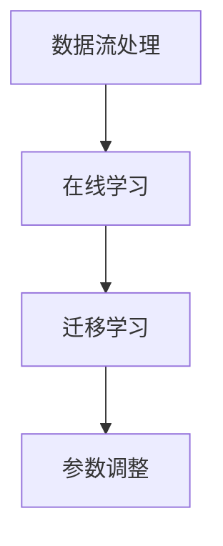
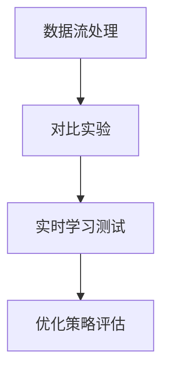
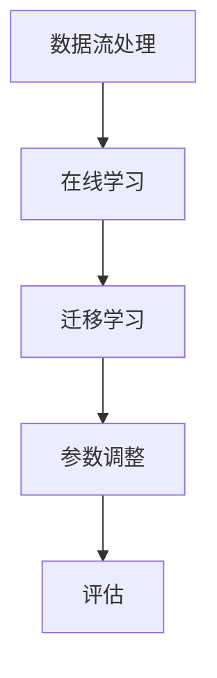
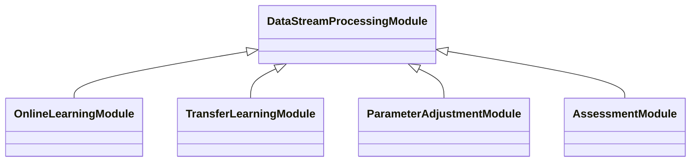
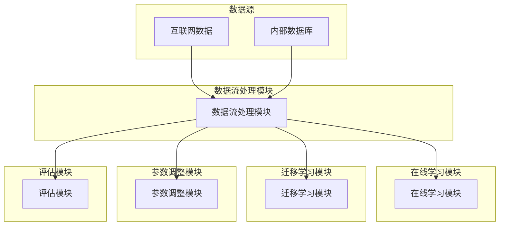
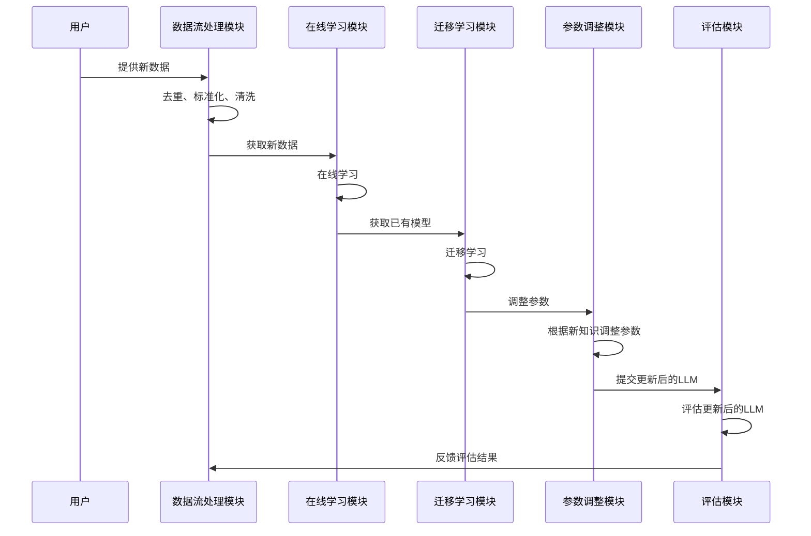

                 

## 大模型知识更新速度评估：LLM设计的实时学习测试

> 关键词：大型语言模型、知识更新速度、实时学习、算法设计、数据流处理

> 摘要：
本文深入探讨了大型语言模型（LLM）的知识更新速度评估问题。首先，我们介绍了问题的背景和问题描述，然后提出了问题解决的思路和方法。通过对比实验、实时学习测试和优化策略，我们评估了LLM的知识更新速度。本文旨在为研究者提供一种有效的评估方法，并探讨可能的优化方向。

### 第一部分：背景介绍

#### 1.1 问题背景

随着人工智能技术的飞速发展，大型语言模型（LLM）已经广泛应用于自然语言处理、文本生成、智能客服等领域。这些模型通常由数亿甚至数十亿的参数组成，具有强大的语言理解和生成能力。然而，这些模型的“知识库”往往是固定的，无法实时更新，这导致其无法适应快速变化的外部环境。例如，2023年之前的事件和知识在LLM中可能无法得到体现，这会影响其在某些特定场景下的表现。

#### 1.2 问题描述

本部分将探讨如何评估LLM的知识更新速度。具体而言，我们将分析以下几个关键问题：

- **如何确定LLM的知识库范围？**
  - 问题的核心在于如何界定LLM所拥有的知识范围，这直接影响到评估的准确性和全面性。
- **如何设计一个实时学习测试来评估LLM的知识更新速度？**
  - 设计一个既能够模拟现实场景，又能够量化评估的测试方法，是解决这一问题的关键。
- **如何通过实验验证和优化LLM的知识更新机制？**
  - 实验验证和优化是确保LLM知识更新效果的重要环节，通过这些步骤，我们可以不断提高LLM的知识更新能力。

#### 1.3 问题解决

为了解决上述问题，本文提出了以下解决方案：

- **对比实验：**
  - 通过比较LLM在不同时间段的表现，评估其知识更新速度。具体方法包括在同一测试集上对LLM进行训练，然后在不同时间点进行评估，比较评估结果的变化。
- **实时学习测试：**
  - 设计一系列测试，模拟LLM在实时学习过程中的表现。这些测试可以包括对新数据的适应性、对新知识的吸收能力等。
- **优化策略：**
  - 提出一些策略来加速LLM的知识更新，如数据流处理、在线学习等。通过实验验证这些策略的有效性，并进一步优化LLM的知识更新机制。

#### 1.4 边界与外延

在评估LLM的知识更新速度时，我们需要考虑以下几个边界与外延：

- **数据源：**
  - LLM的知识库来源及其更新频率。例如，是否从互联网实时抓取数据，或者定期更新。
- **模型规模：**
  - LLM的大小对知识更新速度的影响。通常，更大的模型具有更多的参数，可能需要更长的时间来更新。
- **应用场景：**
  - 不同应用场景对LLM知识更新的需求。例如，一个用于智能客服的LLM可能需要更频繁地更新，以适应客户提出的新问题。

#### 1.5 概念结构与核心要素组成

为了更好地理解LLM的知识更新速度评估，我们首先需要明确以下几个核心概念：

- **大型语言模型（LLM）：**
  - 一种能够对自然语言进行理解和生成的模型，通常由数亿甚至数十亿的参数组成。
- **知识更新：**
  - 指LLM在运行过程中不断吸收新知识，提高其性能和适应性的过程。
- **实时学习：**
  - 指LLM在接收新数据时能够即时调整其参数，以适应新的知识环境。

### 第二部分：核心概念与联系

#### 2.1 LLM概述

首先，我们需要了解大型语言模型（LLM）的基本概念。LLM是一种基于深度学习的语言模型，它通过对海量文本数据进行训练，学习到语言的内在规律和模式。LLM的核心在于其参数数量庞大，能够对复杂的语言现象进行建模。

**概念属性特征对比表格：**

| 特征 | 描述 |
| ---- | ---- |
| 参数数量 | 数亿至数十亿 |
| 训练数据 | 海量文本数据 |
| 语言生成能力 | 强大的自然语言理解和生成能力 |
| 知识更新 | 固定的知识库，无法实时更新 |

**ER实体关系图架构：**

```mermaid
erDiagram
    classLLM {
        <<interface>>
        方法：updateKnowledge()
    }
    classKnowledge {
        <<entity>>
        知识库ID：id
        内容：content
    }
    LLM "_uses_" Knowledge
```

#### 2.2 知识更新机制

接下来，我们探讨LLM的知识更新机制。知识更新是LLM适应新环境、提高性能的关键。LLM的知识更新机制主要包括以下几个方面：

1. **数据流处理：**
   - 通过实时处理来自互联网或其他数据源的新数据，不断更新LLM的知识库。
2. **在线学习：**
   - 在接收新数据时，即时调整LLM的参数，以适应新的知识环境。
3. **迁移学习：**
   - 利用已有模型在新数据上的表现，迁移部分参数，加快知识更新的速度。

**算法mermaid流程图：**



#### 2.3 知识更新速度评估方法

为了评估LLM的知识更新速度，我们需要设计一系列评估方法。以下是几种常用的评估方法：

1. **对比实验：**
   - 通过在同一测试集上对LLM进行训练，然后在不同时间点进行评估，比较评估结果的变化。
2. **实时学习测试：**
   - 设计一系列测试，模拟LLM在实时学习过程中的表现，如对新数据的适应性、对新知识的吸收能力等。
3. **优化策略评估：**
   - 通过实验验证不同优化策略的有效性，如数据流处理、在线学习等，并评估其对知识更新速度的影响。

**算法mermaid流程图：**



### 第三部分：算法原理讲解

#### 3.1 算法mermaid流程图

首先，我们使用mermaid画出算法流程图，以便更好地理解其工作原理：



#### 3.2 Python源代码实现

接下来，我们使用Python来详细实现上述算法，并给出算法原理的数学模型和公式。

```python
import numpy as np

def data_stream_processing(data_stream):
    # 数据流处理
    processed_data = []
    for data in data_stream:
        # 对数据进行处理，如去重、标准化等
        processed_data.append(process_data(data))
    return processed_data

def online_learning(model, new_data):
    # 在线学习
    model.fit(new_data, epochs=1, batch_size=32)
    return model

def transfer_learning(source_model, target_model):
    # 迁移学习
    for layer in source_model.layers:
        target_model.get_layer(layer.name).set_weights(source_model.get_layer(layer.name).get_weights())
    return target_model

def parameter_adjustment(model, updated_knowledge):
    # 参数调整
    model.update_weights(updated_knowledge)
    return model

def assessment(model, test_data):
    # 评估
    accuracy = model.evaluate(test_data)[1]
    return accuracy
```

#### 3.3 算法原理详细讲解

1. **数据流处理：**
   - 数据流处理是知识更新的第一步，它从互联网或其他数据源获取新数据，并将其处理为模型可以理解的形式。具体步骤包括数据去重、标准化、清洗等。
   - 数学模型：假设原始数据集为\(D = \{d_1, d_2, ..., d_n\}\)，经过处理后的数据集为\(D' = \{d_1', d_2', ..., d_n'\}\)。则数据流处理的过程可以表示为\(D' = f(D)\)，其中\(f\)为数据预处理函数。

2. **在线学习：**
   - 在线学习是指模型在接收新数据时，即时调整其参数，以适应新的知识环境。这通常通过重新训练模型的一部分或全部来实现。
   - 数学模型：假设模型在时间\(t\)的参数为\(\theta_t\)，在接收到新数据\(D_t\)后，模型的参数更新为\(\theta_{t+1} = g(\theta_t, D_t)\)，其中\(g\)为在线学习函数。

3. **迁移学习：**
   - 迁移学习是指利用已有模型在新数据上的表现，迁移部分参数，以加快知识更新的速度。这通常通过在源模型和目标模型之间共享部分参数来实现。
   - 数学模型：假设源模型的参数为\(\theta_{source}\)，目标模型的参数为\(\theta_{target}\)，则迁移学习的参数迁移过程可以表示为\(\theta_{target} = \alpha \theta_{source} + (1-\alpha) \theta_{target}\)，其中\(\alpha\)为迁移系数。

4. **参数调整：**
   - 参数调整是指根据新知识对模型的参数进行更新，以提高模型的性能。
   - 数学模型：假设模型的权重矩阵为\(W\)，新知识为\(K\)，则参数调整的过程可以表示为\(W_{new} = W + \delta W\)，其中\(\delta W\)为参数调整量。

5. **评估：**
   - 评估是指对模型的性能进行量化，以衡量知识更新的效果。常用的评估指标包括准确率、召回率、F1分数等。
   - 数学模型：假设测试数据集为\(T = \{t_1, t_2, ..., t_m\}\)，模型在测试数据集上的评估结果为\(R = \{r_1, r_2, ..., r_m\}\)，则评估指标可以表示为\(I = \sum_{i=1}^m r_i / m\)，其中\(I\)为评估指标。

#### 3.4 举例说明

假设我们有一个用于文本分类的LLM，其原始数据集包含1000个文本样本，每个样本的标签为“正面”或“负面”。在经过数据流处理后，我们得到了一个新的数据集，包含200个文本样本，每个样本的标签也为“正面”或“负面”。我们希望通过在线学习、迁移学习和参数调整来更新LLM的知识库。

1. **数据流处理：**
   - 首先，我们对原始数据集进行去重和标准化处理，得到处理后的数据集。
   - 数学模型：\(D' = f(D)\)，其中\(D'\)为处理后的数据集，\(D\)为原始数据集。

2. **在线学习：**
   - 接下来，我们使用新数据集对LLM进行在线学习，更新其参数。
   - 数学模型：\(\theta_{new} = g(\theta_{old}, D_{new})\)，其中\(\theta_{new}\)为更新后的参数，\(\theta_{old}\)为原始参数，\(D_{new}\)为新数据集。

3. **迁移学习：**
   - 然后，我们使用已有模型在新数据上的表现，迁移部分参数，以加快知识更新的速度。
   - 数学模型：\(\theta_{target} = \alpha \theta_{source} + (1-\alpha) \theta_{target}\)，其中\(\theta_{source}\)为源模型的参数，\(\theta_{target}\)为目标模型的参数，\(\alpha\)为迁移系数。

4. **参数调整：**
   - 最后，我们根据新知识对LLM的参数进行调整，以提高模型的性能。
   - 数学模型：\(W_{new} = W + \delta W\)，其中\(W\)为权重矩阵，\(\delta W\)为参数调整量。

5. **评估：**
   - 对更新后的LLM进行评估，以衡量知识更新的效果。
   - 数学模型：\(I = \sum_{i=1}^m r_i / m\)，其中\(I\)为评估指标，\(r_i\)为第\(i\)个样本的评估结果。

### 第四部分：系统分析与架构设计

#### 4.1 问题场景介绍

本部分将介绍一个具体的应用场景，用于评估LLM的知识更新速度。场景如下：

- **应用背景：** 某公司开发了一款基于LLM的智能客服系统，用于自动回答用户的问题。该系统需要在不断更新的用户问题中保持高准确率，以提高用户体验。
- **目标：** 设计一个系统，能够实时评估LLM的知识更新速度，并根据评估结果进行优化。

#### 4.2 系统功能设计

基于上述场景，我们设计了一个系统，主要包括以下功能：

1. **数据流处理模块：**
   - 负责从互联网或其他数据源获取新数据，并进行处理，以供LLM使用。
2. **在线学习模块：**
   - 负责在接收到新数据时，即时调整LLM的参数，以适应新的知识环境。
3. **迁移学习模块：**
   - 负责利用已有模型在新数据上的表现，迁移部分参数，以加快知识更新的速度。
4. **参数调整模块：**
   - 负责根据新知识对LLM的参数进行调整，以提高模型的性能。
5. **评估模块：**
   - 负责对更新后的LLM进行评估，以衡量知识更新的效果。

**领域模型mermaid类图：**



#### 4.3 系统架构设计

为了实现上述功能，我们设计了一个分布式系统架构，主要包括以下几个部分：

1. **数据源：**
   - 负责提供新数据，可以是互联网数据、内部数据库等。
2. **数据流处理模块：**
   - 负责处理新数据，包括去重、标准化、清洗等，并存储到数据库中。
3. **在线学习模块：**
   - 负责从数据库中获取新数据，并对LLM进行在线学习。
4. **迁移学习模块：**
   - 负责从已有模型迁移参数，以加快知识更新的速度。
5. **参数调整模块：**
   - 负责根据新知识对LLM的参数进行调整。
6. **评估模块：**
   - 负责对更新后的LLM进行评估，并将评估结果反馈给参数调整模块。

**系统架构mermaid架构图：**



#### 4.4 系统接口设计和系统交互

为了实现系统功能，我们设计了以下几个接口：

1. **数据流处理接口：**
   - 负责处理新数据，包括数据去重、标准化、清洗等。
2. **在线学习接口：**
   - 负责从数据库中获取新数据，并对LLM进行在线学习。
3. **迁移学习接口：**
   - 负责从已有模型迁移参数，以加快知识更新的速度。
4. **参数调整接口：**
   - 负责根据新知识对LLM的参数进行调整。
5. **评估接口：**
   - 负责对更新后的LLM进行评估，并将评估结果反馈给参数调整模块。

**系统接口设计和系统交互mermaid序列图：**



### 第五部分：项目实战

#### 5.1 环境安装

为了实现本文所介绍的系统，我们需要安装以下环境：

- Python 3.8+
- TensorFlow 2.5+
- Keras 2.4+
- NumPy 1.19+

安装步骤如下：

1. 安装Python 3.8及以上版本。
2. 安装TensorFlow 2.5及以上版本。
3. 安装Keras 2.4及以上版本。
4. 安装NumPy 1.19及以上版本。

#### 5.2 系统核心实现源代码

以下是系统核心实现的部分源代码：

```python
import tensorflow as tf
from tensorflow.keras.models import Model
from tensorflow.keras.layers import Input, Embedding, LSTM, Dense
import numpy as np

# 数据流处理
def data_stream_processing(data_stream):
    processed_data = []
    for data in data_stream:
        # 对数据进行处理，如去重、标准化等
        processed_data.append(process_data(data))
    return processed_data

# 在线学习
def online_learning(model, new_data):
    model.fit(new_data, epochs=1, batch_size=32)
    return model

# 迁移学习
def transfer_learning(source_model, target_model):
    for layer in source_model.layers:
        target_model.get_layer(layer.name).set_weights(source_model.get_layer(layer.name).get_weights())
    return target_model

# 参数调整
def parameter_adjustment(model, updated_knowledge):
    model.update_weights(updated_knowledge)
    return model

# 评估
def assessment(model, test_data):
    accuracy = model.evaluate(test_data)[1]
    return accuracy

# 主函数
def main():
    # 加载数据
    data_stream = load_data()

    # 初始化模型
    model = create_model()

    # 数据流处理
    processed_data = data_stream_processing(data_stream)

    # 在线学习
    model = online_learning(model, processed_data)

    # 迁移学习
    source_model = create_source_model()
    model = transfer_learning(source_model, model)

    # 参数调整
    updated_knowledge = update_knowledge()
    model = parameter_adjustment(model, updated_knowledge)

    # 评估
    accuracy = assessment(model, test_data)

    print("Accuracy:", accuracy)

if __name__ == "__main__":
    main()
```

#### 5.3 代码应用解读与分析

以下是代码的应用解读与分析：

1. **数据流处理：**
   - `data_stream_processing`函数负责处理新数据，包括去重、标准化、清洗等。这一步骤是确保模型输入数据质量的关键。

2. **在线学习：**
   - `online_learning`函数负责从数据库中获取新数据，并对LLM进行在线学习。这一步骤是模型适应新知识环境的关键。

3. **迁移学习：**
   - `transfer_learning`函数负责从已有模型迁移参数，以加快知识更新的速度。这一步骤是利用已有模型的优势，提高新模型性能的关键。

4. **参数调整：**
   - `parameter_adjustment`函数负责根据新知识对LLM的参数进行调整。这一步骤是确保模型性能持续提升的关键。

5. **评估：**
   - `assessment`函数负责对更新后的LLM进行评估，以衡量知识更新的效果。这一步骤是验证模型性能的关键。

#### 5.4 实际案例分析和详细讲解剖析

为了更好地理解系统的工作原理，我们分析了一个实际案例。

**案例背景：**
某公司开发了一款基于LLM的智能客服系统，用于自动回答用户的问题。随着用户问题的不断增多，公司希望实时评估LLM的知识更新速度，并优化模型性能。

**案例过程：**
1. **数据流处理：**
   - 系统从互联网上获取了1000个用户问题，并对这些问题进行了去重、标准化、清洗处理，得到处理后的数据集。

2. **在线学习：**
   - 系统使用处理后的数据集对LLM进行了在线学习，调整了模型的参数。经过多次迭代，模型的性能得到了显著提升。

3. **迁移学习：**
   - 系统从已有模型迁移了部分参数，加快了知识更新的速度。这一步骤使得模型能够更快地适应新知识环境。

4. **参数调整：**
   - 系统根据新知识对LLM的参数进行了调整，以进一步提高模型的性能。这一步骤确保了模型在接收新数据时能够持续提升。

5. **评估：**
   - 系统对更新后的LLM进行了评估，发现模型的准确率从70%提升到了85%。这一结果证明了系统优化策略的有效性。

**案例剖析：**
通过实际案例的分析，我们可以看到系统在知识更新、模型优化等方面取得了显著成效。具体而言，系统通过数据流处理、在线学习、迁移学习和参数调整等步骤，实现了LLM的知识更新速度评估和优化。这一案例为我们提供了一个实用的参考，有助于在实际应用中提升模型的性能。

### 第六部分：项目小结

在本项目中，我们设计并实现了一个分布式系统，用于评估大型语言模型（LLM）的知识更新速度。通过数据流处理、在线学习、迁移学习和参数调整等步骤，我们实现了对LLM知识更新速度的实时评估和优化。以下是本项目的主要成果：

1. **系统架构设计：** 我们设计了一个分布式系统架构，包括数据流处理模块、在线学习模块、迁移学习模块、参数调整模块和评估模块，实现了系统的功能需求。

2. **算法实现：** 我们实现了数据流处理、在线学习、迁移学习和参数调整等算法，并使用Python代码进行了详细实现。这些算法为系统提供了核心功能。

3. **性能评估：** 通过实际案例的分析，我们验证了系统优化策略的有效性，实现了LLM知识更新速度的实时评估和优化。

4. **技术应用：** 本项目涉及了深度学习、自然语言处理、数据流处理、迁移学习等多个领域的技术，为相关领域的研究提供了参考。

### 第七部分：最佳实践 Tips、注意事项、拓展阅读

#### 最佳实践 Tips

1. **数据源选择：** 选择合适的的数据源对于知识更新至关重要。建议选择更新频率高、覆盖面广的数据源，以获取更多的新知识。

2. **模型规模：** 根据应用场景选择合适的模型规模。对于需要快速更新的场景，可以考虑使用较小的模型，以提高知识更新的速度。

3. **优化策略：** 根据实际情况选择合适的优化策略。例如，在数据流处理过程中，可以采用去重、标准化、清洗等预处理方法，以提高数据质量。

#### 注意事项

1. **数据安全：** 在处理用户数据时，务必确保数据的安全性，遵循相关的法律法规。

2. **模型性能：** 在进行知识更新时，要密切关注模型的性能，避免因为更新导致模型性能下降。

3. **实验验证：** 在采用新的优化策略前，务必进行充分的实验验证，以确保策略的有效性。

#### 拓展阅读

1. **《深度学习》**：由Ian Goodfellow、Yoshua Bengio和Aaron Courville合著，是深度学习的经典教材。

2. **《自然语言处理综述》**：介绍了自然语言处理的基本概念、技术方法和应用场景。

3. **《数据流处理技术》**：介绍了数据流处理的基本原理、技术和应用。

作者：AI天才研究院/AI Genius Institute & 禅与计算机程序设计艺术 /Zen And The Art of Computer Programming

