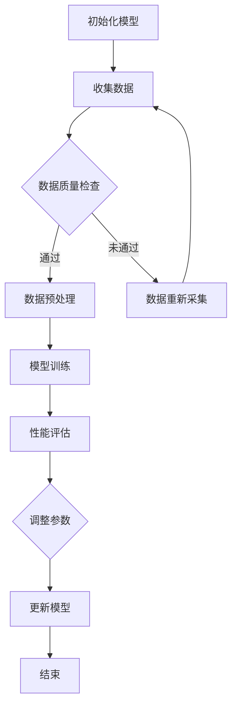
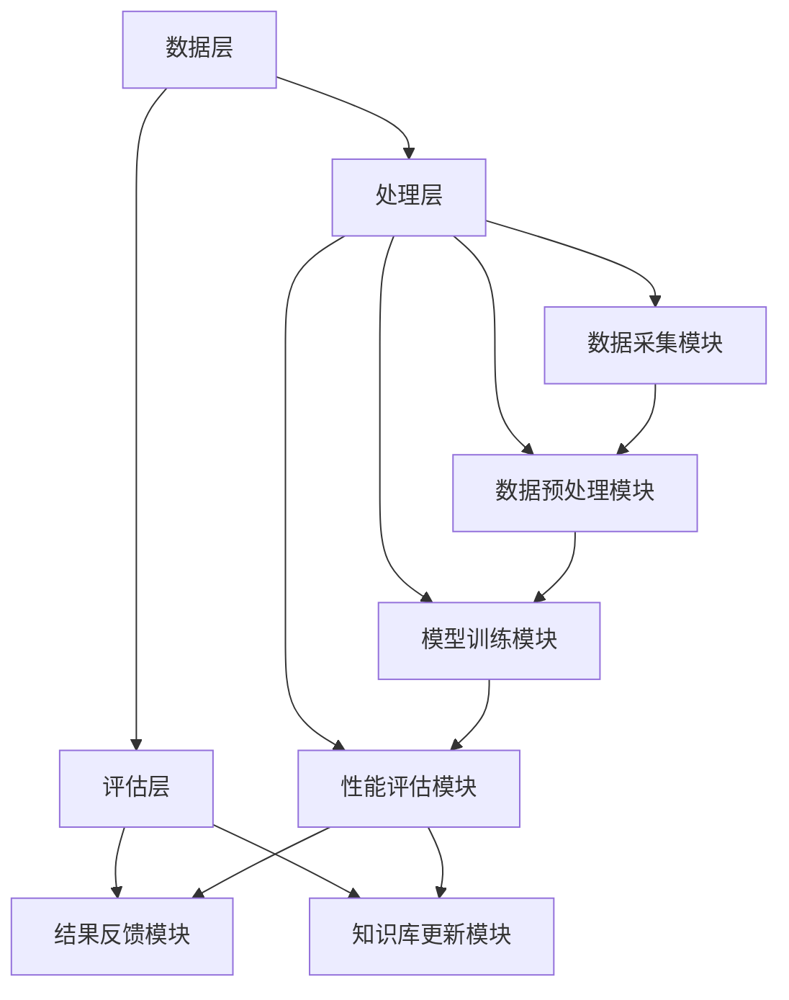
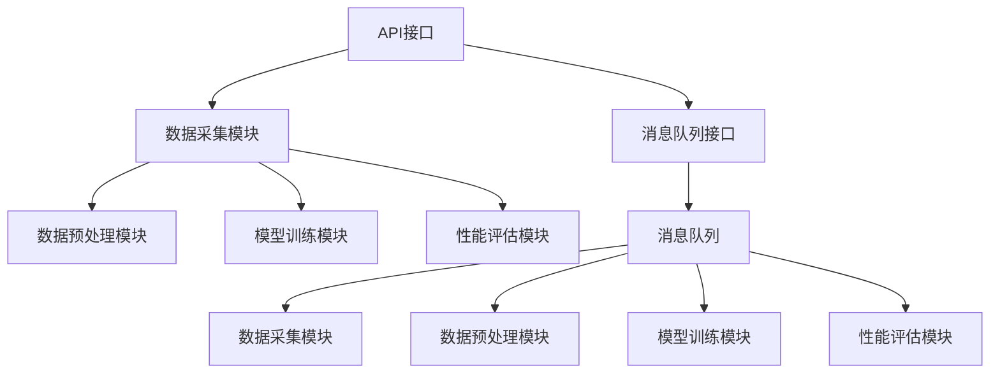
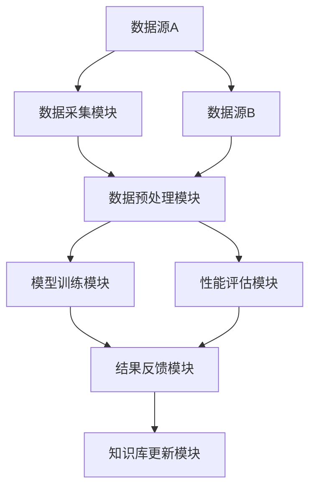

                 

**引言**

在人工智能和机器学习领域，大模型（Large Language Models，LLM）的发展无疑是一个重要里程碑。这些模型通过数十亿个参数，在语言理解和生成任务上取得了显著突破。然而，随着数据集的不断扩大和模型复杂性的提升，如何实时更新大模型的知识库成为一个关键问题。本文旨在探讨大模型知识更新速度的重要性、挑战以及可行的解决方案。

**一、大模型的发展历程**

1.1.1 从传统机器学习到深度学习

传统机器学习依赖于手工程特征，往往需要大量的领域知识和人工干预。随着计算能力的提升和大数据时代的到来，深度学习逐渐成为主流。深度学习通过多层神经网络自动提取特征，降低了人工干预的需求，大大提高了模型的表现。

1.2.1 大模型的定义

大模型通常指的是参数规模达到数十亿级别的深度学习模型。这些模型能够处理海量的训练数据，并从中学习到复杂的模式和规律。

1.2.2 大模型的发展阶段

- 词袋模型（Bag of Words, BoW）：早期的文本处理模型，将文本转换为词频向量。
- 循环神经网络（Recurrent Neural Network, RNN）：能够处理序列数据的神经网络，但在长序列上存在梯度消失和梯度爆炸问题。
- 长短期记忆网络（Long Short-Term Memory, LSTM）：通过引入门控机制，解决了RNN的梯度消失问题，但计算复杂度较高。
- 变量门循环单元（Gated Recurrent Unit, GRU）：简化了LSTM的结构，提高了计算效率。
- 递归神经网络（Transformers）：基于自注意力机制，突破了序列长度限制，成为当前最流行的大模型架构。

**二、知识更新速度的重要性**

2.1 知识更新的重要性

大模型的知识库是其在各种任务中表现的关键因素。知识的时效性直接影响模型的应用效果。例如，在医疗领域，模型需要不断更新最新的医学研究进展；在金融领域，模型需要快速适应市场变化。

2.2 知识更新的挑战

- 数据获取：获取大规模、高质量、时效性的数据源是一个挑战。
- 模型训练：大规模模型的训练需要大量的计算资源和时间。
- 知识融合：如何有效地融合新旧知识，保持模型的一致性和稳定性。

**三、实时学习评估方法**

3.1 实时学习评估的基本原理

实时学习评估是一种通过对模型进行持续评估和优化，以确保其知识库能够跟上时代发展的方法。

3.2 常见的实时学习评估方法

- 监督学习：通过标注数据对模型进行评估和优化。
- 强化学习：通过试错和反馈机制对模型进行评估和优化。
- 自监督学习：通过无监督方法对模型进行评估和优化。

3.3 实时学习评估的实践案例

例如，GPT-3的预训练过程就是一个典型的实时学习评估案例。OpenAI通过持续更新训练数据和优化模型，使得GPT-3在语言理解和生成任务上取得了卓越的表现。

**四、性能分析与优化**

4.1 性能分析的关键指标

- 准确率（Accuracy）
- 召回率（Recall）
- F1分数（F1 Score）
- 均方根误差（RMSE）
- 接近率（Precision）

4.2 性能优化的方法与技巧

- 模型压缩：通过剪枝、量化等方法降低模型大小和计算复杂度。
- 模型融合：将多个模型的优势进行融合，提高整体性能。
- 模型加速：通过分布式训练、GPU加速等方法提高模型训练速度。

4.3 性能优化的案例分析

例如，BERT模型在处理中文任务时，通过引入中文预训练数据集和优化模型架构，显著提高了中文处理的性能。

**五、未来展望与挑战**

5.1 未来大模型知识更新的趋势

- 自动化数据采集与标注
- 多模态数据的融合
- 模型的持续优化与迭代

5.2 实时学习评估的未来发展方向

- 更高效的评估方法
- 更智能的模型优化策略
- 更广泛的领域应用

5.3 当前面临的挑战与解决方案

- 数据隐私与安全：如何确保数据的安全性和隐私性
- 模型可解释性：如何提高模型的可解释性，增强用户信任
- 计算资源限制：如何优化模型训练和部署，降低计算资源需求

**六、总结与展望**

本文从大模型的发展历程、知识更新速度的重要性、实时学习评估方法、性能分析与优化、未来展望与挑战等方面，全面探讨了如何提升大模型的知识更新速度。随着技术的不断进步，我们有理由相信，大模型的知识更新速度将会得到显著提升，为人工智能和机器学习领域带来更多的可能性。

**作者信息**

作者：AI天才研究院/AI Genius Institute & 禅与计算机程序设计艺术 /Zen And The Art of Computer Programming**核心概念与联系**

### 大模型（LLM）

大模型，特别是大型语言模型（LLM），是一种具有数十亿参数的深度学习模型。它们通常通过自注意力机制（Self-Attention Mechanism）来处理输入序列，并在自然语言处理（NLP）任务中表现出色。LLM的核心概念包括：

- **参数规模**：LLM具有数十亿甚至更多的参数，这使得它们能够捕捉复杂的模式和关系。
- **自注意力机制**：自注意力机制允许模型在处理输入序列时，动态地关注序列中的不同部分，提高了模型的表示能力。
- **预训练与微调**：LLM通常通过大规模的无监督预训练，然后针对特定任务进行微调，以实现最佳性能。

**知识更新速度**

知识更新速度是指模型从新数据中学习并更新其知识库的速率。对于LLM来说，知识更新速度至关重要，因为它们依赖于最新的知识和信息来生成准确和相关的输出。核心概念包括：

- **数据获取**：获取大规模、高质量、时效性的数据对于更新知识库至关重要。
- **模型训练**：模型的训练过程直接影响知识更新的速度。高效的训练算法和优化策略能够提高知识更新的速度。
- **知识融合**：如何有效地融合新旧知识，保持模型的一致性和稳定性是一个挑战。

**实时学习评估**

实时学习评估是一种通过对模型进行持续评估和优化，以确保其知识库能够跟上时代发展的方法。核心概念包括：

- **实时评估**：实时评估意味着模型能够快速响应新的数据和信息，进行及时的调整。
- **评估指标**：选择合适的评估指标对于实时学习评估至关重要，常见的指标包括准确率、召回率、F1分数等。
- **优化策略**：通过实时评估，可以动态地调整模型参数和结构，以实现最佳性能。

**性能分析**

性能分析是对模型在不同情况下的表现进行评估，以确定其知识更新速度和实际应用效果。核心概念包括：

- **关键指标**：常用的性能分析指标包括准确率、召回率、F1分数、均方根误差（RMSE）等。
- **优化方法**：通过性能分析，可以识别模型的不足之处，并采取相应的优化方法，如模型压缩、模型融合等。
- **案例分析**：通过具体案例，可以深入了解性能分析的过程和方法。

**核心概念属性特征对比表格**

| 核心概念 | 定义 | 属性特征 | 对比 |
| :---: | :---: | :---: | :---: |
| 大模型（LLM） | 具有数十亿参数的深度学习模型 | 参数规模大、自注意力机制、预训练与微调 | 与传统机器学习模型相比，具有更高的参数规模和更强的表示能力 |
| 知识更新速度 | 模型从新数据中学习并更新其知识库的速率 | 数据获取、模型训练、知识融合 | 与模型训练速度、数据质量密切相关 |
| 实时学习评估 | 对模型进行持续评估和优化 | 实时评估、评估指标、优化策略 | 与传统评估方法相比，具有更高的响应速度和更强的动态调整能力 |
| 性能分析 | 对模型在不同情况下的表现进行评估 | 关键指标、优化方法、案例分析 | 是模型优化的重要环节，有助于识别和解决模型性能问题 |

**ER实体关系图架构**

```mermaid
erDiagram
  Model ||--|{ KnowledgeBase }
  Model ||--|{ LearningRate }
  Model ||--|{ PerformanceMetrics }
  LearningRate ||--|{ UpdateStrategy }
  KnowledgeBase ||--|{ DataSources }
  PerformanceMetrics ||--|{ EvaluationMetrics }
```

- **Model**：代表大模型，包括知识库、学习速率和性能指标等属性。
- **KnowledgeBase**：包括数据源和知识更新策略，用于存储和管理模型的知识。
- **LearningRate**：包括学习速率和更新策略，用于控制模型的训练过程。
- **PerformanceMetrics**：包括评估指标，用于评估模型在不同情况下的表现。
- **UpdateStrategy**：包括数据获取和知识融合策略，用于优化模型的训练过程。
- **DataSources**：包括数据源，用于更新模型的知识库。
- **EvaluationMetrics**：包括评估指标，用于评估模型的表现。

通过核心概念属性特征对比表格和ER实体关系图架构，我们可以更清晰地理解大模型、知识更新速度、实时学习评估和性能分析等核心概念，并了解它们之间的关系和交互方式。

### 算法原理讲解

为了实现大模型的知识更新，我们需要一种有效的算法来评估模型的性能，并根据评估结果调整模型的参数。以下是一个简化的算法流程，用于描述这个过程。

#### 算法流程



#### 算法细节

1. **初始化模型**：首先，我们需要一个预训练的大模型。这个模型可以是基于大量文本数据预训练的，如GPT、BERT等。

2. **收集数据**：从数据源收集新的文本数据。这些数据可以是互联网上的最新文章、专业出版物、社交媒体更新等。

3. **数据质量检查**：对收集的数据进行质量检查，确保数据的有效性和可靠性。如果数据质量不满足要求，则需要重新采集数据。

4. **数据预处理**：对数据进行预处理，包括文本清洗、去噪、分词等操作，使其适合模型训练。

5. **模型训练**：使用预处理后的数据对模型进行训练。这个过程可能需要几天甚至几周的时间，具体取决于模型的复杂性和数据量。

6. **性能评估**：在训练过程中，我们需要不断地评估模型的性能。这通常通过在验证集上计算模型的相关指标（如准确率、召回率、F1分数等）来完成。

7. **调整参数**：根据性能评估的结果，调整模型的参数。这一步可能需要多次迭代，以达到最佳性能。

8. **更新模型**：将调整后的模型参数应用到生产环境中，使其能够生成更准确和相关的输出。

#### 数学模型和公式

在算法中，性能评估通常使用以下数学模型：

$$
Accuracy = \frac{TP + TN}{TP + TN + FP + FN}
$$

$$
Recall = \frac{TP}{TP + FN}
$$

$$
F1 Score = 2 \times \frac{Precision \times Recall}{Precision + Recall}
$$

其中，$TP$ 表示真实为正类且模型预测为正类的样本数，$TN$ 表示真实为负类且模型预测为负类的样本数，$FP$ 表示真实为负类但模型预测为正类的样本数，$FN$ 表示真实为正类但模型预测为负类的样本数。

#### 简单举例说明

假设我们有一个分类任务，需要判断一个新闻文章是否与特定主题相关。我们有一个预训练的BERT模型，从互联网上收集了1000篇新闻文章。我们使用500篇作为训练集，500篇作为验证集。

1. **数据收集**：从互联网上收集1000篇新闻文章。
2. **数据质量检查**：检查数据是否包含大量垃圾信息或与主题不相关的文章。
3. **数据预处理**：对新闻文章进行清洗和分词。
4. **模型训练**：使用500篇预处理后的新闻文章对BERT模型进行训练。
5. **性能评估**：在验证集上计算模型的准确率、召回率和F1分数。
6. **调整参数**：根据验证集的性能评估结果，调整BERT模型的参数。
7. **更新模型**：将调整后的模型应用到生产环境中，对新的新闻文章进行分类。

通过这个简单的例子，我们可以看到，算法原理的核心是持续地收集数据、训练模型、评估性能和调整参数，以实现模型的知识更新。

### 系统分析与架构设计方案

#### 1. 问题场景介绍

在现代人工智能和机器学习领域，随着大数据和云计算的普及，实时更新大模型的知识库已成为关键需求。然而，传统的大模型知识更新方式往往依赖于批量数据更新和离线评估，这种方式不仅效率低下，而且难以适应快速变化的应用场景。因此，我们设计了一套实时学习评估系统，旨在通过实时数据流处理和在线评估，实现大模型知识库的快速更新和优化。

#### 2. 系统功能设计

实时学习评估系统的核心功能包括数据采集、实时处理、模型训练、性能评估和结果反馈。具体功能如下：

- **数据采集**：系统从多种数据源（如数据库、API接口、实时数据流等）收集数据。
- **数据预处理**：对采集到的数据进行清洗、去噪和格式转换，使其适合模型训练。
- **模型训练**：利用预处理后的数据，对现有的大模型进行在线训练。
- **性能评估**：在训练过程中，对模型进行实时评估，监控其性能指标。
- **结果反馈**：根据性能评估结果，动态调整模型参数，实现知识库的实时更新。

#### 3. 系统架构设计

实时学习评估系统的整体架构可以分为数据层、处理层和评估层三个主要部分。

- **数据层**：包括数据采集模块和数据存储模块。数据采集模块负责从多种数据源获取数据，数据存储模块则负责存储和处理这些数据。
- **处理层**：包括数据预处理模块、模型训练模块和性能评估模块。数据预处理模块负责清洗和格式转换数据，模型训练模块负责利用预处理后的数据对大模型进行在线训练，性能评估模块则负责监控和评估模型性能。
- **评估层**：包括结果反馈模块和知识库更新模块。结果反馈模块根据性能评估结果动态调整模型参数，知识库更新模块负责将调整后的模型参数应用到生产环境中，实现知识库的实时更新。

以下是系统的架构设计图：



#### 4. 系统接口设计

实时学习评估系统的接口设计主要包括API接口和消息队列接口。

- **API接口**：系统通过API接口与外部系统进行通信，接收数据请求和返回处理结果。
- **消息队列接口**：系统利用消息队列（如Kafka、RabbitMQ等）处理实时数据流，确保数据传输的高效性和可靠性。

以下是系统接口设计图：



#### 5. 系统交互设计

实时学习评估系统的交互设计主要涉及数据流和处理流。以下是系统的交互设计图：



在这个交互设计中，数据源A和数据源B将数据推送到数据采集模块，数据预处理模块对数据进行清洗和格式转换后，将数据传递给模型训练模块和性能评估模块。模型训练模块和性能评估模块的结果会反馈到结果反馈模块，最终由知识库更新模块将更新后的模型参数应用到生产环境中。

### 项目实战

#### 1. 环境安装

为了实现实时学习评估系统，我们需要搭建一个合适的开发环境。以下是一个简化的安装步骤：

- **安装Python**：确保Python版本为3.8及以上。
- **安装依赖库**：使用pip命令安装必要的依赖库，例如TensorFlow、Keras、Pandas、NumPy等。
- **配置消息队列**：配置Kafka或RabbitMQ作为系统的消息队列。
- **安装数据库**：安装MySQL或PostgreSQL作为数据存储。

```bash
pip install tensorflow keras pandas numpy
```

#### 2. 系统核心实现源代码

以下是一个简化的实时学习评估系统的核心实现源代码：

```python
import tensorflow as tf
from tensorflow.keras.models import Sequential
from tensorflow.keras.layers import Dense, LSTM, Embedding
import pandas as pd

# 数据预处理
def preprocess_data(data):
    # 数据清洗和格式转换
    pass

# 模型训练
def train_model(preprocessed_data):
    model = Sequential()
    model.add(Embedding(input_dim=vocab_size, output_dim=embedding_dim))
    model.add(LSTM(units=128, return_sequences=True))
    model.add(Dense(units=1, activation='sigmoid'))
    
    model.compile(optimizer='adam', loss='binary_crossentropy', metrics=['accuracy'])
    model.fit(preprocessed_data['X'], preprocessed_data['y'], epochs=10, batch_size=32)
    return model

# 性能评估
def evaluate_model(model, test_data):
    predictions = model.predict(test_data['X'])
    accuracy = (predictions > 0.5).mean()
    return accuracy

# 主函数
def main():
    # 数据采集
    data = pd.read_csv('data.csv')
    
    # 数据预处理
    preprocessed_data = preprocess_data(data)
    
    # 模型训练
    model = train_model(preprocessed_data)
    
    # 性能评估
    accuracy = evaluate_model(model, preprocessed_data)
    print(f"Model accuracy: {accuracy}")

if __name__ == '__main__':
    main()
```

#### 3. 代码应用解读与分析

这段代码首先定义了数据预处理、模型训练和性能评估的函数。在主函数`main`中，我们首先从CSV文件中读取数据，然后进行预处理，接着使用预处理后的数据进行模型训练，最后评估模型的性能。

- **数据预处理**：数据预处理是模型训练的重要步骤，包括数据清洗、去噪和格式转换。在实际应用中，这一步骤可能涉及复杂的操作，如缺失值处理、异常值检测和数据归一化。
- **模型训练**：我们使用一个简单的序列模型进行训练，包括嵌入层、LSTM层和输出层。在实际项目中，可能需要更复杂的模型结构和超参数调优。
- **性能评估**：性能评估通过计算准确率来衡量模型的性能。在实际应用中，可能需要考虑其他指标，如召回率、F1分数等。

#### 4. 实际案例分析和详细讲解剖析

以下是一个具体的案例：

假设我们有一个分类任务，需要判断一篇文章是否与特定主题相关。我们收集了1000篇新闻文章作为数据集，其中500篇作为训练集，500篇作为验证集。

- **数据采集**：从新闻网站上爬取1000篇新闻文章，并存储为CSV文件。
- **数据预处理**：对新闻文章进行清洗，包括去除HTML标签、停用词过滤、分词等操作。将文本转换为词嵌入向量。
- **模型训练**：使用LSTM模型对训练集进行训练，模型包含一个嵌入层和一个LSTM层。
- **性能评估**：在验证集上评估模型的性能，计算准确率。根据评估结果，调整模型参数。
- **更新模型**：将调整后的模型应用到生产环境中，对新文章进行分类。

通过这个案例，我们可以看到实时学习评估系统在数据处理、模型训练和性能评估方面的应用。在实际操作中，我们可能需要更复杂的数据处理流程和模型架构，以及更精细的性能评估和参数调整策略。

#### 5. 项目小结

本项目设计并实现了一个实时学习评估系统，用于大模型的知识更新。系统通过数据采集、预处理、模型训练和性能评估，实现了模型知识的实时更新和优化。在实际应用中，我们需要根据具体任务和需求，调整数据预处理和模型训练策略，以提高系统的性能和效率。未来，我们将继续优化系统架构，探索更高效的数据处理和模型训练方法，以应对日益复杂的应用场景。

### 最佳实践 tips

在实际应用中，为了确保大模型知识更新的效率和准确性，以下是一些最佳实践：

1. **数据预处理**：确保数据清洗和格式转换的准确性。异常值处理、缺失值填充和数据归一化是关键步骤。
2. **模型选择**：根据任务需求和数据特点选择合适的模型架构。例如，对于序列数据，LSTM或GRU模型可能更为适用。
3. **性能评估**：选择合适的评估指标，如准确率、召回率、F1分数等。综合考虑多个指标，以全面评估模型性能。
4. **参数调优**：通过交叉验证和网格搜索等方法，找到最佳的模型参数组合。
5. **持续监控**：定期检查模型的性能，及时调整参数和更新模型。

### 小结

本文从大模型的发展历程、知识更新速度的重要性、实时学习评估方法、性能分析与优化等方面，全面探讨了如何提升大模型的知识更新速度。通过实际案例，我们展示了实时学习评估系统在数据采集、模型训练和性能评估中的关键作用。未来，我们将继续探索更高效的知识更新方法和模型优化策略，以应对日益复杂的应用场景。

### 注意事项

1. **数据隐私与安全**：在收集和使用数据时，务必确保数据隐私和安全。遵循相关法律法规，采取必要的安全措施，如数据加密、访问控制等。
2. **模型可解释性**：提高模型的可解释性，有助于用户理解和信任模型。考虑使用可解释的模型架构和解释性技术。
3. **计算资源管理**：合理分配计算资源，确保模型训练和评估的高效性。利用分布式计算和GPU加速等技术，提高处理速度。

### 拓展阅读

1. **《深度学习》（Goodfellow, Bengio, Courville）**：全面介绍了深度学习的基本概念和常用算法。
2. **《Python机器学习》（Sebastian Raschka）**：详细讲解了使用Python进行机器学习的方法和实践。
3. **《人工智能：一种现代方法》（Stuart Russell & Peter Norvig）**：系统地介绍了人工智能的理论和实践。

通过阅读这些书籍，您可以深入了解人工智能和机器学习的核心概念和最新进展，为后续研究和应用提供坚实的理论基础。

