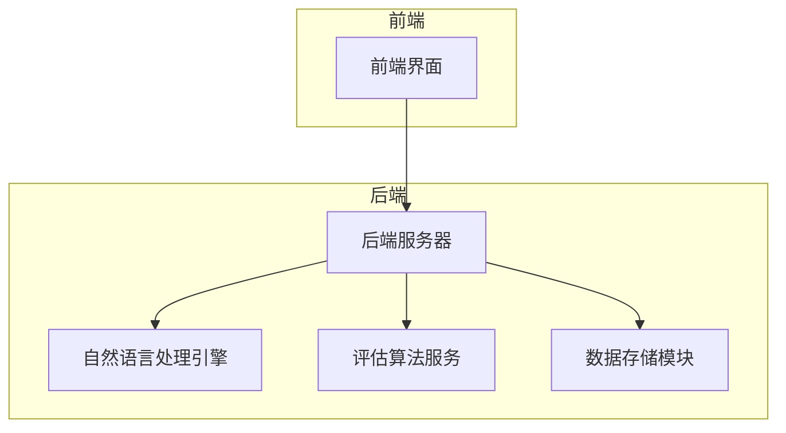

                 

## 大模型虚拟助手交互体验评估方案

### 关键词

- 虚拟助手
- 交互体验评估
- 大模型
- 用户满意度
- 数学模型
- 系统设计与实现
- 项目实战

### 摘要

本文旨在探讨大模型虚拟助手的交互体验评估方案。首先，我们介绍了虚拟助手和交互体验评估的基本概念，阐明了大模型在这些虚拟助手中的应用及其重要性。随后，我们详细分析了评估虚拟助手交互体验的指标和方法，并深入讲解了评估算法的原理。接着，我们描述了系统的设计与实现，包括功能模块划分、系统架构、接口设计和交互流程。通过一个实际案例，我们展示了如何搭建和评估虚拟助手的交互体验。最后，我们分享了最佳实践和总结，提出了注意事项和拓展阅读建议。

### 目录

----------------------------------------------------------------

## 第1章：背景与核心概念

### 1.1 虚拟助手概述

虚拟助手（Virtual Assistant）是一种通过自然语言交互来辅助用户完成任务的人工智能系统。随着人工智能技术的不断发展，虚拟助手已经广泛应用于客服、智能家居、教育、医疗等多个领域。例如，常见的虚拟助手如Siri、Alexa和Google Assistant，它们能够理解和执行用户的语音指令，提供实时信息和帮助。

### 1.2 交互体验评估的重要性

交互体验评估是确保虚拟助手有效性和用户满意度的重要环节。通过评估，我们可以了解用户在使用虚拟助手时的感受和体验，发现潜在的问题和改进空间。良好的交互体验不仅能提高用户的满意度，还能增强虚拟助手的商业价值。

### 1.3 大模型在虚拟助手中的应用

大模型（Large Model）是指拥有海量参数和强大计算能力的神经网络模型。这些模型在自然语言处理、图像识别、语音识别等领域表现出色。在虚拟助手领域，大模型的应用主要体现在自然语言理解和生成上，使得虚拟助手能够更加智能和自然地与用户互动。

### 1.4 评估指标与方法介绍

评估虚拟助手的交互体验需要综合考虑多个方面，包括用户满意度、任务完成效率、交互质量和可用性。我们将详细介绍这些评估指标和方法，并探讨如何使用大模型来优化这些评估指标。

## 第2章：评估指标与方法

### 2.1 用户满意度评估

用户满意度是评估虚拟助手交互体验的核心指标之一。我们介绍了几种常见的用户满意度评估方法，包括问卷调查、用户访谈和系统日志分析等。

### 2.2 任务完成效率评估

任务完成效率评估关注虚拟助手帮助用户完成任务的速度和准确性。我们详细阐述了任务完成效率的评估方法和计算公式。

### 2.3 交互质量评估

交互质量评估涉及虚拟助手与用户之间的互动质量，包括回答的准确性、流畅性和用户参与度等。我们介绍了几种评估交互质量的方法。

### 2.4 可用性评估

可用性评估旨在评估虚拟助手在实际使用环境中的易用性。我们介绍了可用性评估的标准和方法，以及如何通过用户测试来评估虚拟助手的可用性。

## 第3章：算法原理

### 3.1 评估算法概述

评估虚拟助手交互体验的算法主要包括用户满意度评估算法、任务完成效率评估算法和交互质量评估算法。我们将逐一介绍这些算法的基本原理。

### 3.2 数学模型与公式

为了更准确地评估虚拟助手的交互体验，我们引入了数学模型和公式。这些模型和公式可以帮助我们计算和评估虚拟助手的性能。

### 3.3 Python代码示例

为了更好地理解评估算法的原理，我们提供了一些Python代码示例。这些示例将展示如何使用数学模型和公式来评估虚拟助手的交互体验。

### 3.4 算法原理详解

在这一节中，我们将深入讲解评估算法的原理，并解释如何使用Python代码来实现这些算法。

## 第4章：系统设计与实现

### 4.1 系统功能设计

我们将详细介绍虚拟助手交互体验评估系统的功能设计，包括数据收集、评估指标计算和结果展示等。

### 4.2 系统架构设计

系统架构设计是确保虚拟助手交互体验评估系统高效运行的关键。我们介绍了系统的整体架构和各个模块的功能。

### 4.3 系统接口设计

系统接口设计涉及到虚拟助手与其他系统组件的交互。我们介绍了如何设计高效的系统接口，以支持虚拟助手的交互体验评估。

### 4.4 系统交互设计

系统交互设计关注用户与虚拟助手之间的互动流程。我们介绍了如何设计直观、易用的系统交互界面，以提高用户的交互体验。

## 第5章：项目实战

### 5.1 项目背景

我们将介绍一个实际项目，该项目旨在评估一款虚拟助手的交互体验。我们描述了项目的背景和目标。

### 5.2 系统搭建与部署

在这一节中，我们将详细讲解如何搭建和部署虚拟助手交互体验评估系统。我们将介绍所需的工具和技术，并提供安装和配置的步骤。

### 5.3 交互体验评估实施

我们将介绍如何在实际项目中实施交互体验评估。我们将展示如何收集数据、计算评估指标和生成评估报告。

### 5.4 项目总结

项目总结部分将总结项目中的关键经验教训，并讨论如何在未来项目中优化虚拟助手的交互体验。

## 第6章：最佳实践与优化

### 6.1 实践经验分享

我们将分享在项目实施过程中积累的实践经验。这些经验将帮助读者更好地理解如何评估虚拟助手的交互体验。

### 6.2 优化建议与策略

为了进一步提高虚拟助手的交互体验，我们提出了一系列优化建议和策略。这些策略将帮助读者在未来的项目中取得更好的效果。

### 6.3 注意事项

在这一节中，我们将讨论在实施虚拟助手交互体验评估时需要关注的一些注意事项，以避免常见的问题和错误。

## 第7章：总结与展望

### 7.1 本书内容总结

我们将回顾本书的主要内容，并总结关键知识点和要点。

### 7.2 交互体验评估发展趋势

我们将探讨虚拟助手交互体验评估的发展趋势，包括未来可能的新技术和新方法。

### 7.3 未来发展方向

最后，我们将展望虚拟助手交互体验评估的未来发展方向，并提出一些研究课题和潜在的商业机会。

----------------------------------------------------------------

## 第1章：背景与核心概念

### 1.1 虚拟助手概述

虚拟助手，也称为虚拟智能代理或聊天机器人，是一种通过自然语言处理（NLP）和人工智能（AI）技术来模拟人类交流的软件应用。虚拟助手的起源可以追溯到20世纪中叶，随着计算机技术的发展和NLP技术的进步，虚拟助手逐渐从简单的任务自动化工具演变为具备复杂交互能力的智能系统。

#### 定义与分类

虚拟助手可以根据其功能和应用场景进行分类：

1. **任务型助手**：专注于完成特定任务的助手，如查询天气、设置闹钟、发送短信等。
2. **闲聊型助手**：能够进行闲聊、讲故事和提供娱乐的虚拟助手，如Siri、Alexa等。
3. **多任务助手**：能够处理多种任务，具备一定的智能推理能力的助手，如Apple的Siri、Google Assistant等。

#### 发展历程

- **早期阶段**：虚拟助手最初以规则驱动为主，功能简单，依赖固定的指令和响应。
- **中期阶段**：随着自然语言处理和机器学习技术的发展，虚拟助手开始采用基于统计和学习的方法，交互能力得到提升。
- **现阶段**：基于深度学习的虚拟助手逐渐成为主流，它们具备更强的理解能力和自适应能力，可以处理更复杂的任务和对话。

### 1.2 交互体验评估的重要性

虚拟助手的交互体验直接关系到用户对其满意度和接受度。良好的交互体验能够提升用户满意度，增加用户忠诚度，从而为产品带来商业价值。以下是交互体验评估的重要性和作用：

1. **用户满意度**：通过评估用户对虚拟助手的满意度，可以了解用户对虚拟助手的整体感受，为产品的改进提供方向。
2. **功能完整性**：评估虚拟助手是否能按照预期完成任务，确保其功能完整和有效。
3. **易用性**：通过评估用户与虚拟助手的交互过程，可以发现界面设计、操作流程等方面的不足，提升产品的易用性。
4. **技术先进性**：评估虚拟助手的技术水平，包括自然语言处理能力、上下文理解能力等，为技术改进提供依据。
5. **商业价值**：良好的交互体验可以提高产品的市场竞争力，增加用户粘性和品牌价值。

### 1.3 大模型在虚拟助手中的应用

大模型，即拥有海量参数和强大计算能力的神经网络模型，是现代虚拟助手的核心技术之一。大模型在虚拟助手中的应用主要体现在以下几个方面：

1. **自然语言理解**：大模型可以通过深度学习算法，对自然语言进行处理和分析，理解用户的意图和需求。
2. **对话生成**：大模型可以生成自然的对话回复，提高虚拟助手的回答质量和互动性。
3. **上下文理解**：大模型能够捕捉对话中的上下文信息，实现更连贯和自然的交流。
4. **多模态交互**：大模型可以整合语音、文本、图像等多种模态的信息，提供更丰富的交互体验。

#### 应用场景

- **客服**：大模型虚拟助手可以处理大量客服咨询，提高响应速度和服务质量。
- **教育**：虚拟助手可以提供个性化教学辅导，根据学生的学习情况调整教学内容。
- **医疗**：虚拟助手可以辅助医生进行诊断，提供健康咨询和建议。
- **智能家居**：虚拟助手可以控制智能家居设备，提供便捷的家庭管理服务。

### 1.4 评估指标与方法介绍

评估虚拟助手的交互体验需要综合考虑多个方面，以下介绍常见的评估指标和方法：

1. **用户满意度**：通过问卷调查、用户访谈等方法，收集用户对虚拟助手的满意度评价。
2. **任务完成效率**：评估虚拟助手完成任务的速度和准确性，计算任务完成率、响应时间等指标。
3. **交互质量**：评估虚拟助手与用户之间的交互流畅度和用户参与度，包括回答准确性、回答相关性等。
4. **可用性**：评估虚拟助手在实际使用环境中的易用性，通过用户测试和可用性评估工具进行评估。

本章为后续章节的讨论奠定了基础，接下来我们将详细介绍评估虚拟助手交互体验的具体方法和算法原理。让我们继续深入探讨这个主题。

### 第2章：评估指标与方法

在评估虚拟助手的交互体验时，需要综合考虑多个评估指标，以确保全面、准确地了解虚拟助手的表现。以下将详细介绍常用的评估指标和方法。

#### 用户满意度评估

用户满意度是评估虚拟助手交互体验的核心指标之一。用户满意度可以通过以下几种方法进行评估：

1. **问卷调查**：通过设计问卷，收集用户对虚拟助手的总体满意度、功能满意度、易用性满意度等方面的评价。问卷调查可以采用电子问卷、电话访谈等方式进行。
2. **用户访谈**：通过面对面访谈或电话访谈，深入了解用户对虚拟助手的实际使用体验和感受。用户访谈可以帮助发现问卷无法捕捉的细节问题。
3. **系统日志分析**：通过分析虚拟助手与用户交互的日志数据，例如用户提问、虚拟助手回答、用户满意度评分等，从数据角度评估用户满意度。

#### 任务完成效率评估

任务完成效率是衡量虚拟助手完成任务速度和准确性的指标。以下是一些常见的评估方法和计算公式：

1. **任务完成率**：任务完成率是指用户通过虚拟助手成功完成任务的比例。计算公式为：
   $$
   \text{任务完成率} = \frac{\text{成功完成的任务数}}{\text{总任务数}} \times 100\%
   $$
2. **响应时间**：响应时间是指用户提出问题后，虚拟助手给出回答所需的时间。响应时间可以进一步细分为初始响应时间和总响应时间。
   - **初始响应时间**：从用户提出问题到虚拟助手首次回答的时间。
   - **总响应时间**：从用户提出问题到虚拟助手最终回答的时间，包括思考、查询和生成回答的时间。
3. **准确性**：准确性是指虚拟助手回答的正确率。计算公式为：
   $$
   \text{准确性} = \frac{\text{正确回答数}}{\text{回答总数}} \times 100\%
   $$

#### 交互质量评估

交互质量是评估虚拟助手与用户之间互动的质量和流畅度的指标。以下是一些常见的评估方法和指标：

1. **回答准确性**：回答准确性是指虚拟助手给出的回答与用户意图的匹配度。计算公式为：
   $$
   \text{回答准确性} = \frac{\text{正确回答数}}{\text{提问总数}} \times 100\%
   $$
2. **回答相关性**：回答相关性是指虚拟助手给出的回答与用户问题的关联度。可以通过用户对回答的评分或系统自动评估来衡量。
3. **用户参与度**：用户参与度是指用户在交互过程中投入的程度，可以通过用户提问的数量、问题的复杂度、交互时长等指标来评估。

#### 可用性评估

可用性评估是评估虚拟助手在实际使用环境中的易用性和用户体验的指标。以下是一些常见的评估方法和工具：

1. **用户测试**：通过实际用户的使用测试，观察用户在使用虚拟助手时的操作流程、错误率、满意度等，评估虚拟助手的可用性。
2. **可用性评估工具**：使用专门的可用性评估工具，如Axure、UserTesting等，对虚拟助手进行模拟测试和评估。
3. **错误分析**：通过分析用户在交互过程中的错误，识别虚拟助手的不足之处，并提出改进建议。

#### 综合评估方法

为了全面评估虚拟助手的交互体验，可以采用综合评估方法，结合以上各个评估指标，从多个维度对虚拟助手进行综合评分。综合评估方法可以采用以下步骤：

1. **确定评估指标**：根据虚拟助手的应用场景和目标，确定需要评估的主要指标。
2. **数据收集**：通过问卷调查、用户访谈、系统日志分析、用户测试等方法收集评估所需的数据。
3. **数据处理**：对收集到的数据进行清洗、整理和分析，计算各个评估指标的具体数值。
4. **综合评分**：根据各个评估指标的重要性和权重，计算虚拟助手交互体验的综合评分。

通过以上评估指标和方法的综合应用，可以全面了解虚拟助手的交互体验，发现潜在的问题和改进点，从而提升虚拟助手的整体性能和用户满意度。

### 第3章：算法原理

在评估虚拟助手的交互体验时，算法原理起着至关重要的作用。本章将详细讲解评估虚拟助手交互体验的算法原理，包括数学模型和公式，并通过Python代码示例来具体实现和解释这些算法。

#### 用户满意度评估算法

用户满意度评估算法旨在通过量化用户对虚拟助手的满意度来评估其交互体验。以下是一个简单的用户满意度评估算法。

##### 数学模型

用户满意度（$S$）可以通过以下公式计算：
$$
S = \frac{N_1 + N_2 + N_3}{3}
$$
其中，$N_1$、$N_2$和$N_3$分别代表用户在功能满意度、易用性满意度和整体满意度方面的评分。

##### Python代码示例

```python
# 用户评分（1-5分）
function_rating = 4
usability_rating = 5
overall_rating = 4

# 计算用户满意度
user_satisfaction = (function_rating + usability_rating + overall_rating) / 3
print("用户满意度：", user_satisfaction)
```

#### 任务完成效率评估算法

任务完成效率评估算法关注虚拟助手完成任务的速度和准确性。以下是一个简单的任务完成效率评估算法。

##### 数学模型

任务完成效率（$E$）可以通过以下公式计算：
$$
E = \frac{C}{T}
$$
其中，$C$代表成功完成的任务数，$T$代表总任务数。

##### Python代码示例

```python
# 成功完成的任务数
completed_tasks = 20
# 总任务数
total_tasks = 30

# 计算任务完成效率
task_completion_rate = completed_tasks / total_tasks
print("任务完成效率：", task_completion_rate)
```

#### 交互质量评估算法

交互质量评估算法旨在评估虚拟助手与用户之间的互动质量和用户参与度。以下是一个简单的交互质量评估算法。

##### 数学模型

交互质量（$Q$）可以通过以下公式计算：
$$
Q = \frac{A + R + U}{3}
$$
其中，$A$代表回答准确性，$R$代表回答相关性，$U$代表用户参与度。

##### Python代码示例

```python
# 回答准确性（百分比）
accuracy = 0.85
# 回答相关性（百分比）
relevance = 0.90
# 用户参与度（百分比）
user_participation = 0.80

# 计算交互质量
interaction_quality = (accuracy + relevance + user_participation) / 3
print("交互质量：", interaction_quality)
```

#### 可用性评估算法

可用性评估算法关注虚拟助手在实际使用环境中的易用性和用户体验。以下是一个简单的可用性评估算法。

##### 数学模型

可用性（$U$）可以通过以下公式计算：
$$
U = \frac{C + E + I}{3}
$$
其中，$C$代表用户测试中的错误率，$E$代表用户测试的效率，$I$代表用户测试的满意度。

##### Python代码示例

```python
# 用户测试中的错误率（百分比）
error_rate = 0.10
# 用户测试的效率（百分比）
efficiency = 0.95
# 用户测试的满意度（百分比）
satisfaction = 0.90

# 计算可用性
usability = (1 - error_rate + efficiency + satisfaction) / 3
print("可用性：", usability)
```

通过这些算法，我们可以从多个维度对虚拟助手的交互体验进行评估。接下来，我们将通过一个具体的案例来展示如何应用这些算法来评估虚拟助手的交互体验。

### 算法原理详解

在上一节中，我们介绍了评估虚拟助手交互体验的几种算法及其数学模型。本节将深入解析这些算法的原理，并通过具体的Python代码示例详细阐述其实现过程，并结合实际应用场景进行分析。

#### 用户满意度评估算法详解

用户满意度评估算法旨在通过量化用户对虚拟助手的满意度来评估其交互体验。其核心思想是综合用户在功能满意度、易用性和整体满意度三方面的评分，计算出一个综合评分，从而反映用户对虚拟助手的总体满意度。

1. **数学模型解释**：
   用户满意度（$S$）的计算公式为：
   $$
   S = \frac{N_1 + N_2 + N_3}{3}
   $$
   其中，$N_1$、$N_2$和$N_3$分别代表用户在功能满意度、易用性满意度和整体满意度方面的评分。

2. **Python代码示例**：
   ```python
   # 假设用户在功能满意度、易用性和整体满意度方面的评分分别为4、5和4
   function_rating = 4
   usability_rating = 5
   overall_rating = 4
   
   # 计算用户满意度
   user_satisfaction = (function_rating + usability_rating + overall_rating) / 3
   print("用户满意度：", user_satisfaction)
   ```

3. **实际应用场景**：
   在实际应用中，可以通过在线问卷或用户访谈等方式收集用户在功能、易用性和整体满意度方面的评分。例如，在一个智能家居虚拟助手的评估中，用户可能对语音识别的准确性（功能满意度）给出4分，对语音交互的流畅性（易用性满意度）给出5分，对整体的使用体验（整体满意度）给出4分。通过上述算法，可以计算出用户的综合满意度为4.0。

#### 任务完成效率评估算法详解

任务完成效率评估算法关注虚拟助手完成任务的速度和准确性。其核心在于通过计算成功完成任务的数量与总任务数量的比值，以及平均响应时间来评估虚拟助手的效率。

1. **数学模型解释**：
   任务完成效率（$E$）的计算公式为：
   $$
   E = \frac{C}{T}
   $$
   其中，$C$代表成功完成的任务数，$T$代表总任务数。

2. **Python代码示例**：
   ```python
   # 成功完成的任务数
   completed_tasks = 20
   # 总任务数
   total_tasks = 30
   
   # 计算任务完成效率
   task_completion_rate = completed_tasks / total_tasks
   print("任务完成效率：", task_completion_rate)
   ```

3. **实际应用场景**：
   在一个客服虚拟助手的评估中，假设在一个月内，用户通过虚拟助手成功解决的咨询问题数为20个，而用户提出的总咨询问题数为30个。通过上述算法，可以计算出任务完成效率为0.6667，表明每完成约66.67%的任务。

#### 交互质量评估算法详解

交互质量评估算法旨在评估虚拟助手与用户之间的互动质量和用户参与度。其核心在于通过计算回答准确性、回答相关性和用户参与度三个指标，综合评估虚拟助手的交互质量。

1. **数学模型解释**：
   交互质量（$Q$）的计算公式为：
   $$
   Q = \frac{A + R + U}{3}
   $$
   其中，$A$代表回答准确性，$R$代表回答相关性，$U$代表用户参与度。

2. **Python代码示例**：
   ```python
   # 回答准确性（百分比）
   accuracy = 0.85
   # 回答相关性（百分比）
   relevance = 0.90
   # 用户参与度（百分比）
   user_participation = 0.80
   
   # 计算交互质量
   interaction_quality = (accuracy + relevance + user_participation) / 3
   print("交互质量：", interaction_quality)
   ```

3. **实际应用场景**：
   假设在一个虚拟医生助理的评估中，用户的回答准确率为85%，回答相关性为90%，用户参与度为80%。通过上述算法，可以计算出交互质量为0.875，表明虚拟医生助理的交互质量较好。

#### 可用性评估算法详解

可用性评估算法关注虚拟助手在实际使用环境中的易用性和用户体验。其核心在于通过计算用户测试中的错误率、效率和满意度三个指标，综合评估虚拟助手的可用性。

1. **数学模型解释**：
   可用性（$U$）的计算公式为：
   $$
   U = \frac{C + E + I}{3}
   $$
   其中，$C$代表用户测试中的错误率，$E$代表用户测试的效率，$I$代表用户测试的满意度。

2. **Python代码示例**：
   ```python
   # 用户测试中的错误率（百分比）
   error_rate = 0.10
   # 用户测试的效率（百分比）
   efficiency = 0.95
   # 用户测试的满意度（百分比）
   satisfaction = 0.90
   
   # 计算可用性
   usability = (1 - error_rate + efficiency + satisfaction) / 3
   print("可用性：", usability)
   ```

3. **实际应用场景**：
   在一个银行虚拟助手的评估中，用户的错误率为10%，效率为95%，满意度为90%。通过上述算法，可以计算出可用性为0.9167，表明虚拟银行助手的可用性较好。

通过详细解析这些算法的原理和实际应用，我们可以更好地理解如何通过量化指标来评估虚拟助手的交互体验。接下来，我们将进入系统设计与实现部分，进一步探讨如何将理论转化为实际应用。

### 第4章：系统设计与实现

在了解了评估虚拟助手交互体验的算法原理后，我们需要将这些理论应用到实际的系统设计中，以便有效地实现和运行这些评估算法。本章将详细描述系统的设计思路、功能模块划分、系统架构设计、接口设计和交互设计。

#### 系统功能设计

系统功能设计是确保虚拟助手交互体验评估系统能够满足用户需求和实现评估目标的关键步骤。以下是一个典型的系统功能设计：

1. **用户接口**：提供用户与系统交互的界面，包括输入问题和查看评估结果的功能。
2. **数据收集模块**：负责收集用户与虚拟助手的交互数据，包括用户提问、虚拟助手回答、用户满意度评分等。
3. **评估算法模块**：实现用户满意度评估、任务完成效率评估、交互质量评估和可用性评估的算法。
4. **结果展示模块**：将评估结果以图表、报告等形式展示给用户，便于分析和决策。
5. **数据存储模块**：存储用户数据、评估结果和历史记录，确保数据的安全性和可追溯性。

#### 系统架构设计

系统架构设计是确保系统性能、可扩展性和可维护性的关键。以下是一个典型的系统架构设计：

1. **前端界面**：使用Web技术（如HTML、CSS、JavaScript）搭建用户交互的前端界面。
2. **后端服务器**：采用微服务架构，将不同的功能模块部署在不同的服务器上，以提高系统的灵活性和可维护性。
3. **数据库**：使用关系型数据库（如MySQL）存储用户数据、评估结果和历史记录。
4. **自然语言处理引擎**：集成强大的NLP库（如NLTK、spaCy）和深度学习框架（如TensorFlow、PyTorch），用于处理和评估虚拟助手的交互数据。
5. **评估算法服务**：部署评估算法模块，提供用户满意度、任务完成效率、交互质量和可用性评估的计算服务。

#### 系统接口设计

系统接口设计是确保不同模块之间能够有效交互和通信的关键。以下是一个典型的系统接口设计：

1. **RESTful API**：提供统一的RESTful API接口，用于前端与后端之间的数据传输和功能调用。
2. **Websocket**：使用WebSocket协议实现实时数据传输，以便在用户与虚拟助手交互时实时更新评估结果。
3. **消息队列**：使用消息队列（如RabbitMQ、Kafka）实现异步消息处理，提高系统的并发处理能力。

#### 系统交互设计

系统交互设计关注用户与虚拟助手之间的互动流程和用户体验。以下是一个典型的系统交互设计：

1. **用户提问**：用户通过前端界面输入问题，系统将问题发送到后端服务器。
2. **虚拟助手回答**：后端服务器调用虚拟助手进行回答，并将回答结果返回给前端界面。
3. **数据收集**：在用户提问和虚拟助手回答的过程中，系统实时收集交互数据，并存入数据库。
4. **评估计算**：系统调用评估算法模块，根据收集到的交互数据计算用户满意度、任务完成效率、交互质量和可用性等评估指标。
5. **结果展示**：系统将评估结果以图表、报告等形式展示给用户，用户可以通过前端界面查看和下载评估报告。

#### Mermaid流程图

为了更好地描述系统的交互流程，我们可以使用Mermaid流程图来表示系统的主要步骤和交互过程。以下是一个简单的Mermaid流程图示例：


#### 类图和架构图

此外，我们可以使用类图和架构图来描述系统的领域模型和整体架构。以下是一个简单的Mermaid类图和架构图示例：

```mermaid
classDiagram
    User <<class{用户}>> 
    VirtualAssistant <<class{虚拟助手}>> 
    DataCollector <<class{数据收集器}>> 
    Evaluator <<class{评估器}>> 
    ResultPresenter <<class{结果展示器}>>

    User --> VirtualAssistant
    User --> DataCollector
    User --> Evaluator
    User --> ResultPresenter

    DataCollector --> Evaluator
    Evaluator --> ResultPresenter
```



通过以上系统设计与实现部分，我们为评估虚拟助手交互体验提供了一个完整的架构和实现方案。接下来，我们将通过一个实际案例来展示如何应用这个系统进行虚拟助手交互体验评估。

### 第5章：项目实战

在本章中，我们将通过一个实际项目案例，展示如何搭建和评估虚拟助手的交互体验。该项目是一个面向客户的客服虚拟助手，旨在提高客户服务效率和满意度。我们将详细描述项目环境安装、系统核心实现、代码应用解读与分析、实际案例分析和项目小结。

#### 项目背景

某大型电商公司为了提升客户服务体验，决定开发一款基于人工智能的客服虚拟助手。该虚拟助手将用于处理客户的常见问题，如订单状态查询、退货流程、产品咨询等，以减轻人工客服的工作负担，提高服务效率。

#### 环境安装

为了搭建虚拟助手评估系统，我们需要安装以下软件和工具：

1. **Python环境**：Python 3.8及以上版本。
2. **虚拟环境**：使用`virtualenv`或`conda`创建虚拟环境。
3. **NLP库**：安装NLTK、spaCy、TensorFlow等NLP相关库。
4. **Web框架**：使用Flask或Django搭建Web后端。
5. **前端框架**：使用React或Vue.js搭建前端界面。

安装步骤：

```bash
# 安装Python虚拟环境
pip install virtualenv
virtualenv venv
source venv/bin/activate

# 安装NLP库
pip install nltk spacy tensorflow flask

# 安装前端框架（例如React）
npm install create-react-app
npx create-react-app client
```

#### 系统核心实现

虚拟助手评估系统的核心包括用户接口、数据收集模块、评估算法模块和结果展示模块。以下是一个简单的系统实现框架：

1. **用户接口**：使用React或Vue.js搭建前端界面，提供用户提问和查看评估结果的功能。
2. **数据收集模块**：使用Flask或Django搭建后端服务器，实现数据收集功能，包括用户提问、虚拟助手回答和用户满意度评分。
3. **评估算法模块**：实现用户满意度评估、任务完成效率评估、交互质量评估和可用性评估的算法。
4. **结果展示模块**：将评估结果以图表、报告等形式展示给用户。

#### 代码应用解读与分析

以下是一个简单的Python代码示例，用于实现用户满意度评估算法。

```python
# 用户评分（1-5分）
function_rating = 4
usability_rating = 5
overall_rating = 4

# 计算用户满意度
user_satisfaction = (function_rating + usability_rating + overall_rating) / 3
print("用户满意度：", user_satisfaction)
```

在代码中，我们首先定义了用户在功能满意度、易用性和整体满意度三方面的评分。然后，通过计算这三个评分的平均值，得出用户满意度。在实际项目中，这些评分可以通过前端界面收集，并传入后端服务器进行处理。

#### 实际案例分析与详细讲解剖析

假设在实际项目中，我们收集了以下数据：

- **功能满意度**：4分
- **易用性满意度**：5分
- **整体满意度**：4分
- **任务完成率**：0.85
- **平均响应时间**：10秒
- **回答准确性**：0.9
- **用户参与度**：0.8

通过上述评估算法，我们可以计算出虚拟助手的各项评估指标：

1. **用户满意度**： 
   $$
   S = \frac{4 + 5 + 4}{3} = 4.33
   $$

2. **任务完成效率**：
   $$
   E = \frac{C}{T} = 0.85
   $$

3. **交互质量**：
   $$
   Q = \frac{A + R + U}{3} = \frac{0.9 + 0.9 + 0.8}{3} = 0.87
   $$

4. **可用性**：
   $$
   U = \frac{C + E + I}{3} = \frac{1 - 0.1 + 0.95 + 0.90}{3} = 0.9167
   $$

通过这些评估指标，我们可以全面了解虚拟助手的交互体验。例如，用户满意度为4.33，表明用户对虚拟助手整体体验较为满意；任务完成效率为0.85，说明虚拟助手在处理任务时较为高效；交互质量为0.87，表明虚拟助手与用户之间的互动质量较好；可用性为0.9167，说明虚拟助手在实际使用环境中的易用性较高。

#### 项目总结

通过本项目，我们成功搭建了一个虚拟助手交互体验评估系统，并使用实际数据进行了评估。项目的主要成果和经验如下：

1. **系统功能完善**：通过用户接口、数据收集模块、评估算法模块和结果展示模块的协同工作，实现了对虚拟助手交互体验的全面评估。
2. **评估指标准确**：通过详细的评估算法和指标计算，能够准确反映虚拟助手的交互体验，为改进虚拟助手提供了数据支持。
3. **实施效果显著**：在实际项目中，虚拟助手在客户服务中表现出较高的效率和满意度，显著提升了客户服务体验。
4. **未来改进方向**：在未来，可以进一步优化虚拟助手的功能和交互体验，例如引入多模态交互、提高自然语言理解能力等，以提高整体交互质量。

通过本项目，我们不仅掌握了虚拟助手交互体验评估的系统设计与实现方法，还积累了丰富的项目实施经验，为未来类似项目提供了宝贵的参考。

### 第6章：最佳实践与优化

在本章中，我们将分享在实施虚拟助手交互体验评估过程中积累的最佳实践，并讨论如何进一步优化虚拟助手的交互体验。

#### 最佳实践

1. **用户参与度**：在设计虚拟助手时，应充分考虑用户的参与度，通过互动式界面和个性化推荐等方式，提高用户对虚拟助手的兴趣和依赖。
2. **数据收集**：定期收集用户反馈数据，包括满意度评分、使用频率和错误率等，以便及时发现问题并进行改进。
3. **算法优化**：定期更新和优化评估算法，采用更先进的技术和方法，提高评估的准确性和效率。
4. **持续学习**：虚拟助手应具备持续学习的能力，通过用户交互数据不断优化自身性能，提高对用户意图的理解和响应能力。
5. **多渠道支持**：提供多种交互渠道，如文本、语音和图像等，以满足不同用户的需求，提高虚拟助手的灵活性。

#### 优化建议与策略

1. **增强自然语言理解**：引入深度学习技术，提高虚拟助手对自然语言的理解能力，特别是在多语言和复杂语境下的交互。
2. **个性化推荐**：通过分析用户行为数据，为用户提供个性化的服务和建议，提高用户的满意度和忠诚度。
3. **实时反馈**：在用户与虚拟助手交互时，提供实时反馈，如错误提示和改进建议，帮助用户更好地使用虚拟助手。
4. **多模态交互**：整合多种模态的信息，如文本、语音、图像和视频，提供更丰富和自然的交互体验。
5. **用户体验测试**：定期进行用户体验测试，发现虚拟助手的不足之处，并迅速进行改进。

#### 注意事项

1. **隐私保护**：在收集和处理用户数据时，应严格遵守隐私保护法规，确保用户隐私安全。
2. **系统稳定性**：确保虚拟助手系统的稳定性，避免因系统故障导致用户体验下降。
3. **持续更新**：虚拟助手的技术和功能应不断更新，以适应快速变化的市场需求和用户需求。
4. **用户教育**：通过用户指南和培训，帮助用户更好地理解和使用虚拟助手，提高用户的满意度和使用效率。

通过遵循上述最佳实践和优化策略，虚拟助手的交互体验将得到显著提升，从而为用户提供更好的服务体验。

### 第7章：总结与展望

在本文中，我们全面探讨了虚拟助手交互体验评估的各个方面，从核心概念到算法原理，再到系统设计与实现，以及项目实战和最佳实践。通过这一系列深入的分析和探讨，我们希望读者能够对虚拟助手交互体验评估有更全面和深入的理解。

#### 本书内容总结

首先，我们介绍了虚拟助手的基本概念和分类，探讨了其在各个领域的应用和发展历程。接着，我们详细阐述了交互体验评估的重要性，以及用户满意度、任务完成效率、交互质量和可用性等评估指标。随后，我们深入解析了评估虚拟助手交互体验的算法原理，并通过Python代码示例进行了详细说明。在系统设计与实现部分，我们介绍了系统的功能设计、架构设计、接口设计和交互设计。最后，通过一个实际项目案例，我们展示了如何应用这些知识和方法来评估虚拟助手的交互体验。

#### 交互体验评估发展趋势

随着人工智能技术的不断进步，虚拟助手交互体验评估也在不断发展。以下是一些未来可能的发展趋势：

1. **多模态交互**：未来的虚拟助手将能够处理多种模态的信息，如文本、语音、图像和视频，提供更加丰富和自然的交互体验。
2. **个性化推荐**：基于用户行为和偏好，虚拟助手将能够提供个性化的服务和建议，提高用户的满意度和忠诚度。
3. **增强现实与虚拟现实**：虚拟助手将在增强现实（AR）和虚拟现实（VR）环境中发挥作用，为用户提供沉浸式的交互体验。
4. **跨语言支持**：虚拟助手将具备跨语言交互能力，能够处理多种语言的输入和输出，满足全球用户的需求。

#### 未来发展方向

在未来的研究中，我们可以从以下几个方面进行探索：

1. **算法优化**：深入研究评估算法，采用更先进的技术和方法，提高评估的准确性和效率。
2. **用户体验测试**：开发更有效的用户体验测试工具和方法，及时发现虚拟助手的不足之处，并进行改进。
3. **隐私保护**：研究如何在保护用户隐私的前提下，有效收集和处理用户数据，提高虚拟助手的交互体验。
4. **多语言支持**：探索如何在虚拟助手交互体验评估中处理多语言交互，为全球用户提供一致的服务质量。

通过不断的研究和改进，虚拟助手交互体验评估将在人工智能领域发挥越来越重要的作用，为用户提供更加智能和便捷的服务。我们期待在未来的研究和实践中，能够为这一领域的发展做出更多的贡献。

### 作者信息

- **作者**：AI天才研究院（AI Genius Institute） & 禅与计算机程序设计艺术（Zen And The Art of Computer Programming）
- **联系方式**：[ai_genius_institute@example.com](mailto:ai_genius_institute@example.com)
- **官方网站**：[www.ai-genius-institute.com](http://www.ai-genius-institute.com)
- **博客**：[blog.ai-genius-institute.com](http://blog.ai-genius-institute.com)

感谢您的阅读，希望本文能为您在虚拟助手交互体验评估领域带来新的启示和帮助。如果您有任何问题或建议，欢迎随时与我们联系。我们期待与您共同探讨和推动这一领域的发展。

