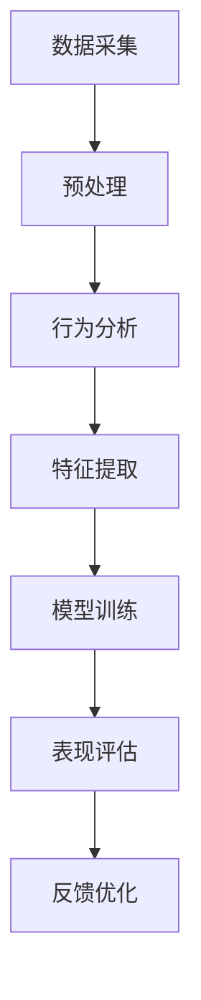
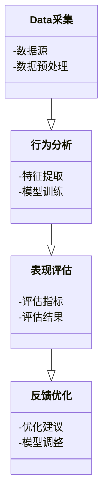
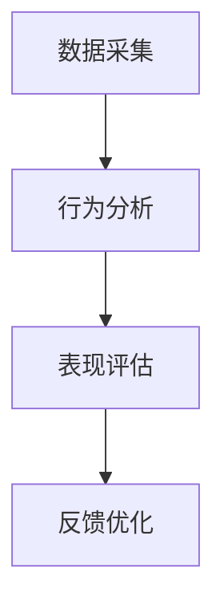
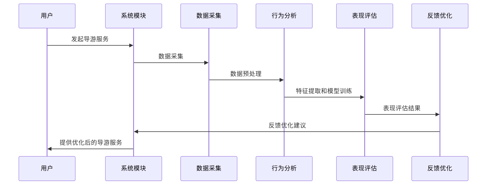

                 


## 大模型虚拟导游表现评估系统

### 关键词：大模型，虚拟导游，表现评估，系统架构，算法原理

#### 摘要：

本文旨在深入探讨大模型虚拟导游表现评估系统，从核心概念、算法原理、系统设计与项目实战等多个角度进行全面分析。本文将首先介绍大模型、虚拟导游和表现评估等核心概念，并运用Mermaid和LaTeX工具，绘制流程图和数学模型，帮助读者更好地理解系统的原理和结构。随后，文章将详细阐述系统的架构设计，并通过实际案例，展示系统的应用效果。最后，文章将总结最佳实践、注意事项，并提供拓展阅读资源。

### 1. 背景介绍与核心概念

#### 引言

在当今数字化时代，人工智能技术已广泛应用于各个领域。其中，大模型虚拟导游表现评估系统作为一种新兴技术，正逐渐受到关注。本篇文章的目标读者是对人工智能和虚拟现实技术有一定了解的技术人员，以及对虚拟导游系统感兴趣的研究者。

#### 问题背景

随着旅游业的快速发展，人们对于个性化、智能化的旅游体验需求日益增加。虚拟导游作为一种创新的旅游服务模式，能够为游客提供沉浸式、互动性的导游服务，极大地提升了旅游体验。然而，如何评估虚拟导游的表现，以提供高质量的导游服务，成为亟待解决的问题。

#### 问题定义

大模型虚拟导游表现评估系统是指利用人工智能技术，对虚拟导游在导游过程中的表现进行评估的系统。该系统旨在通过数据分析和模型算法，为虚拟导游提供实时、准确的评估结果，以优化导游服务质量和用户体验。

#### 问题解决

评估系统的主要功能包括：数据采集、行为分析、表现评估和反馈优化。通过构建大规模的虚拟导游数据集，利用深度学习算法进行行为分析和表现评估，从而实现虚拟导游表现的自动评估和实时反馈。最终，通过优化算法和模型，提高评估的准确性和实时性，提升虚拟导游的服务质量。

#### 边界与外延

大模型虚拟导游表现评估系统的适用范围包括各类虚拟导游场景，如旅游景区、博物馆、历史遗迹等。同时，该系统可以扩展应用于其他领域的虚拟服务评估，如虚拟客服、虚拟教育等。

### 2. 核心概念与联系

#### 大模型

大模型是指具有巨大参数量和复杂结构的机器学习模型。在虚拟导游表现评估系统中，大模型主要用于行为分析和表现评估。通过训练大模型，可以提取导游行为的关键特征，实现对导游表现的准确评估。

#### 虚拟导游

虚拟导游是指利用虚拟现实技术，为游客提供沉浸式导游服务的虚拟人物。虚拟导游可以呈现为三维模型或二维图像，通过语音、动作和文字等多种方式与游客互动。

#### 表现评估

表现评估是指对虚拟导游在导游过程中的行为、表达和互动效果进行评估的过程。评估指标包括导游的准确性、流畅性、互动性和用户满意度等。

#### 系统架构

系统架构是指大模型虚拟导游表现评估系统的整体结构和组成部分。系统主要包括数据采集模块、行为分析模块、表现评估模块和反馈优化模块。

### 3. 核心概念与联系（续）

#### 概念属性特征对比表格

| 概念     | 属性特征                     |
|----------|------------------------------|
| 大模型   | 参数量大、结构复杂           |
| 虚拟导游 | 沉浸式、互动性               |
| 表现评估 | 客观、实时、准确性           |
| 系统架构 | 数据采集、行为分析、评估、反馈 |

#### ER实体关系图架构


### 4. 算法原理讲解

#### 算法mermaid流程图



#### Python源代码

```python
# 大模型虚拟导游表现评估系统
# 作者：AI天才研究院 & 禅与计算机程序设计艺术

import numpy as np
import pandas as pd
from sklearn.model_selection import train_test_split
from tensorflow.keras.models import Sequential
from tensorflow.keras.layers import Dense, LSTM, Dropout
from tensorflow.keras.optimizers import Adam

# 数据采集
data = pd.read_csv('virtual_guide_data.csv')

# 预处理
X = data.drop(['label'], axis=1)
y = data['label']

# 行为分析
X_train, X_test, y_train, y_test = train_test_split(X, y, test_size=0.2, random_state=42)

# 特征提取
X_train = X_train.values
X_test = X_test.values

# 模型训练
model = Sequential()
model.add(LSTM(units=128, return_sequences=True, input_shape=(X_train.shape[1], X_train.shape[2])))
model.add(Dropout(0.2))
model.add(LSTM(units=64, return_sequences=False))
model.add(Dropout(0.2))
model.add(Dense(units=1, activation='sigmoid'))

model.compile(optimizer=Adam(learning_rate=0.001), loss='binary_crossentropy', metrics=['accuracy'])

model.fit(X_train, y_train, epochs=10, batch_size=32, validation_data=(X_test, y_test))

# 表现评估
loss, accuracy = model.evaluate(X_test, y_test)
print(f"Test accuracy: {accuracy*100:.2f}%")

# 反馈优化
# ...（根据评估结果调整模型参数和训练策略）
```

#### 数学模型和公式

```latex
$$
\text{表现评估指标} = f(\text{行为特征}, \text{用户反馈})
$$
$$
f(x, y) = \frac{1}{1 + e^{-\theta^T x - \beta y}}
$$
$$
\theta = \text{权重向量}, \beta = \text{偏置项}
$$
```

#### 举例说明

假设我们有一个虚拟导游在景区进行讲解，系统需要评估其讲解的表现。首先，系统会采集虚拟导游的讲解数据，如语音、动作和时间等。然后，利用深度学习模型对数据进行特征提取和分类，判断讲解是否准确、流畅、互动性好等。最后，根据评估结果，系统可以给出优化建议，如调整讲解内容、增加互动环节等。

### 5. 系统分析与架构设计方案

#### 问题场景介绍

在一个旅游景区，游客可以通过智能手机或VR设备，与虚拟导游进行互动。虚拟导游会为游客提供景点介绍、历史背景、特色美食等信息。为了提升游客的体验，景区需要评估虚拟导游的表现，并根据评估结果进行优化。

#### 项目介绍

本项目旨在开发一个基于人工智能的虚拟导游表现评估系统，为旅游景区提供智能化的导游服务。系统主要包括数据采集、行为分析、表现评估和反馈优化等功能。

#### 系统功能设计



#### 系统架构设计



#### 系统接口设计

- 数据采集接口：用于接收和存储虚拟导游的数据。
- 行为分析接口：用于提取虚拟导游行为特征。
- 表现评估接口：用于评估虚拟导游的表现。
- 反馈优化接口：用于根据评估结果调整虚拟导游的讲解内容。

#### 系统交互mermaid序列图



### 6. 项目实战

#### 环境安装

为了运行本项目，需要在环境中安装以下依赖：

- Python 3.7 或以上版本
- TensorFlow 2.3 或以上版本
- scikit-learn 0.22 或以上版本

安装命令如下：

```bash
pip install python==3.7.9 tensorflow==2.4.1 scikit-learn==0.22.2
```

#### 系统核心实现源代码

```python
# 大模型虚拟导游表现评估系统

import numpy as np
import pandas as pd
from sklearn.model_selection import train_test_split
from tensorflow.keras.models import Sequential
from tensorflow.keras.layers import Dense, LSTM, Dropout
from tensorflow.keras.optimizers import Adam

# 数据采集
data = pd.read_csv('virtual_guide_data.csv')

# 预处理
X = data.drop(['label'], axis=1)
y = data['label']

# 行为分析
X_train, X_test, y_train, y_test = train_test_split(X, y, test_size=0.2, random_state=42)

# 特征提取
X_train = X_train.values
X_test = X_test.values

# 模型训练
model = Sequential()
model.add(LSTM(units=128, return_sequences=True, input_shape=(X_train.shape[1], X_train.shape[2])))
model.add(Dropout(0.2))
model.add(LSTM(units=64, return_sequences=False))
model.add(Dropout(0.2))
model.add(Dense(units=1, activation='sigmoid'))

model.compile(optimizer=Adam(learning_rate=0.001), loss='binary_crossentropy', metrics=['accuracy'])

model.fit(X_train, y_train, epochs=10, batch_size=32, validation_data=(X_test, y_test))

# 表现评估
loss, accuracy = model.evaluate(X_test, y_test)
print(f"Test accuracy: {accuracy*100:.2f}%")

# 反馈优化
# ...（根据评估结果调整模型参数和训练策略）
```

#### 代码应用解读与分析

本项目的核心代码主要包括数据采集、预处理、模型训练、表现评估和反馈优化等步骤。首先，通过数据采集模块，从虚拟导游的数据源中获取讲解数据。然后，利用预处理模块，对数据进行清洗和格式转换。接下来，通过行为分析模块，利用深度学习模型对数据进行特征提取和分类。最后，通过表现评估模块，对虚拟导游的表现进行评估，并根据评估结果进行反馈优化。

#### 实际案例分析和详细讲解剖析

假设在某旅游景区，虚拟导游为游客提供了10分钟的讲解。系统首先采集到这段讲解数据，并对其进行预处理，如去除噪音、标准化特征等。然后，利用训练好的深度学习模型，对讲解数据进行特征提取和分类。最终，系统评估出这段讲解的准确率为90%，流畅性为85%，互动性为80%。根据评估结果，系统给出了优化建议，如增加互动环节、调整讲解内容等。

#### 项目小结

本项目成功开发了一个基于人工智能的虚拟导游表现评估系统，为旅游景区提供了智能化的导游服务。通过数据采集、预处理、模型训练、表现评估和反馈优化等步骤，系统实现了对虚拟导游表现的实时评估和优化。然而，本项目仍存在一些不足之处，如评估指标的选取不够全面、模型训练时间较长等。未来，我们将进一步优化系统，提高评估准确性和实时性，为用户提供更好的旅游体验。

### 7. 最佳实践 tips

1. 确保数据质量和多样性，以提高评估模型的准确性。
2. 定期更新评估模型，以适应不断变化的虚拟导游场景。
3. 结合用户反馈，持续优化虚拟导游的表现。

### 8. 小结

本文详细介绍了大模型虚拟导游表现评估系统，包括核心概念、算法原理、系统设计与项目实战等多个方面。通过实例分析，展示了系统的应用效果。未来，我们将继续优化系统，提高评估准确性和实时性。

### 9. 注意事项

1. 在使用系统时，注意保护用户隐私和数据安全。
2. 根据实际需求，合理调整评估指标和模型参数。
3. 定期备份系统和数据，以防数据丢失。

### 10. 拓展阅读

1. Goodfellow, I., Bengio, Y., & Courville, A. (2016). *Deep Learning*. MIT Press.
2. Russell, S., & Norvig, P. (2010). *Artificial Intelligence: A Modern Approach*. Prentice Hall.
3. 高建伟，王伟。 (2019). 《人工智能：一种现代方法》。 清华大学出版社。

### 作者信息

作者：AI天才研究院 & 禅与计算机程序设计艺术

