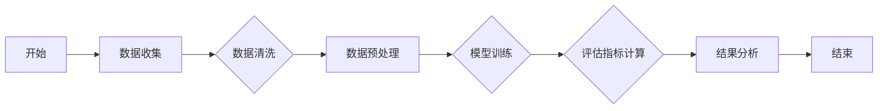
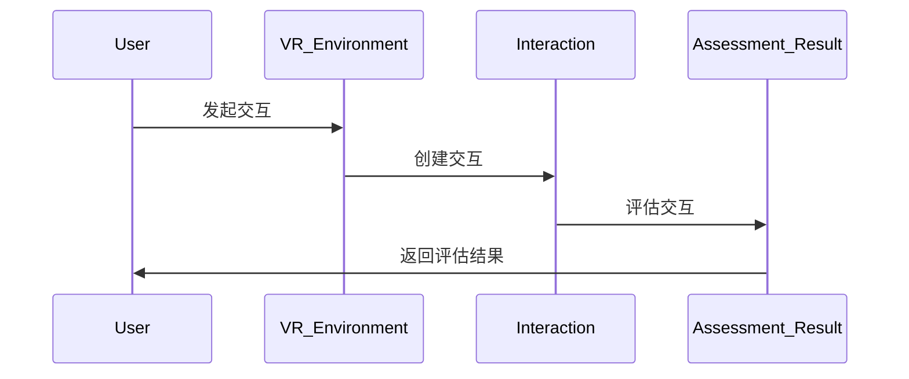
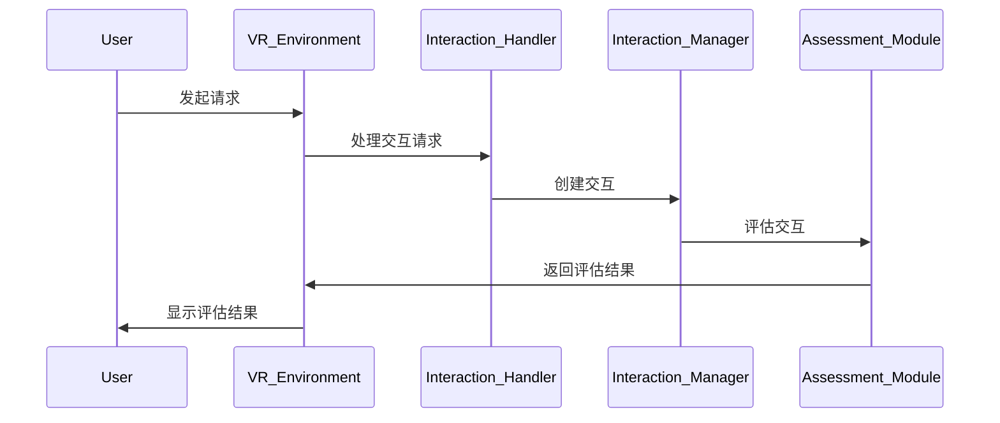

                 


### 设计文章内容和结构

#### 第一步：文章开头
**文章标题**：大模型虚拟现实交互体验评估框架

**关键词**：大模型、虚拟现实、交互体验、评估框架、人工智能

**摘要**：
本文旨在设计并阐述一个用于评估虚拟现实（VR）交互体验的大模型评估框架。通过分析现有挑战，本文提出了一个科学、系统的评估框架，并详细描述了其核心概念、算法原理、系统架构以及实际应用案例。

#### 第二步：背景介绍
**问题背景**：
随着虚拟现实技术的快速发展，其对用户体验的评估变得尤为重要。然而，现有的评估方法往往缺乏标准化和客观性。

**问题描述**：
现有VR交互体验评估方法面临的主观性、标准化的缺失、数据量不足等问题。

**问题解决**：
本文提出一个基于大模型的VR交互体验评估框架，以解决上述问题。

**边界与外延**：
评估框架适用于各种虚拟现实应用场景，但需结合具体应用进行调整。

**概念结构与核心要素组成**：
评估框架包括核心概念定义、评估方法、数据收集与处理、结果分析等要素。

#### 第三步：核心概念与联系
**核心概念原理**：
- 大模型：具有强大数据处理能力和泛化能力的机器学习模型。
- 虚拟现实：通过计算机技术创建的模拟环境，提供沉浸式体验。
- 交互体验评估：对用户在虚拟现实环境中交互的质量和满意度进行评估。

**概念属性特征对比表格**：

| 特征         | 大模型               | 传统评估方法               |
| ------------ | -------------------- | -------------------------- |
| 数据处理能力 | 强大                 | 有限                       |
| 泛化能力     | 高                   | 低                         |
| 主观性       | 较低                 | 较高                       |

**ER实体关系图架构**：
使用Mermaid绘制ER图，展示评估框架中的实体及其关系，如用户、虚拟现实环境、交互行为、评估指标等。

#### 第四步：算法原理讲解
**算法mermaid流程图**：
使用Mermaid绘制算法流程图，描述评估框架的基本步骤。

**Python源代码**：
提供Python源代码，实现算法的核心部分。

**算法原理的数学模型和公式**：
给出算法的数学模型和公式，并进行详细解释。

**通俗易懂的举例说明**：
通过实际案例说明算法的应用，帮助读者理解。

#### 第五步：系统分析与架构设计方案
**问题场景介绍**：
介绍一个典型的VR交互体验评估场景。

**项目介绍**：
介绍一个VR交互体验评估项目，说明项目的目标和挑战。

**系统功能设计（领域模型Mermaid类图）**：
使用Mermaid绘制领域模型类图，展示系统的功能模块。

**系统架构设计（Mermaid架构图）**：
使用Mermaid绘制系统架构图，展示系统的整体架构。

**系统接口设计和系统交互（Mermaid序列图）**：
使用Mermaid绘制系统接口设计和交互序列图，展示系统各模块的交互关系。

#### 第六步：项目实战
**环境安装**：
详细介绍所需环境的安装步骤。

**系统核心实现源代码**：
提供系统的核心实现源代码。

**代码应用解读与分析**：
对源代码进行解读和分析，帮助读者理解实现过程。

**实际案例分析和详细讲解剖析**：
通过实际案例进行分析，详细讲解评估框架的应用。

**项目小结**：
总结项目经验，强调项目的成功之处和改进空间。

#### 第七步：最佳实践、小结、注意事项、拓展阅读
**最佳实践 tips**：
分享一些在VR交互体验评估中应用评估框架的最佳实践。

**小结**：
总结全书的主要内容和结论。

**注意事项**：
提醒读者在应用评估框架时需要注意的事项。

**拓展阅读**：
推荐一些相关的参考文献和进一步学习的资源。

### 整理文章结构
将上述内容整理成完整的文章结构，确保内容连贯、逻辑清晰，并在10000～12000字范围内。使用Markdown格式输出文章内容，并在文章末尾写上作者信息：“作者：AI天才研究院/AI Genius Institute & 禅与计算机程序设计艺术 /Zen And The Art of Computer Programming”。

---

# 大模型虚拟现实交互体验评估框架

> 关键词：大模型、虚拟现实、交互体验、评估框架、人工智能

> 摘要：
随着虚拟现实（VR）技术的快速发展，其对用户体验的评估变得尤为重要。本文提出一个基于大模型的VR交互体验评估框架，旨在解决现有评估方法的主观性、标准化缺失等问题。本文首先介绍了问题背景和核心概念，然后详细描述了算法原理、系统架构和实际应用案例，最后总结了一些最佳实践和拓展阅读资源。

---

## 第1章 背景介绍

### 1.1 问题背景

虚拟现实（VR）技术自问世以来，以其独特的沉浸式体验迅速吸引了大量用户和开发商的关注。然而，虚拟现实技术的普及和应用不仅仅依赖于硬件设备和内容的丰富，更重要的是用户体验的质量。一个良好的交互体验能够提升用户的满意度，从而促进VR技术的广泛应用。然而，当前VR交互体验的评估面临诸多挑战：

1. **主观性**：传统评估方法往往依赖于用户的主观感受，不同用户之间的评价可能存在较大差异，难以形成统一的评估标准。
2. **标准化缺失**：目前缺乏统一的评估框架和标准，不同研究和应用之间的评估结果难以进行比较和交流。
3. **数据量不足**：VR交互体验评估需要大量的数据支持，但现有的数据收集方法往往受限，难以满足评估需求。

### 1.2 问题描述

现有VR交互体验评估方法主要存在以下问题：

- **主观性**：用户的主观感受在评估中占据重要地位，但不同用户对同一体验的感知可能存在显著差异，导致评估结果不够客观。
- **标准化缺失**：缺乏统一的评估标准和框架，导致不同研究者和开发者难以进行有效的比较和交流。
- **数据量不足**：VR交互体验评估需要大量的数据支持，但现有的数据收集方法往往受限，难以满足评估需求。

### 1.3 问题解决

本文提出一个基于大模型的VR交互体验评估框架，旨在解决上述问题。该框架结合了人工智能技术和虚拟现实技术，通过以下方法实现：

1. **减少主观性**：通过大规模数据的分析，降低用户主观感受对评估结果的影响。
2. **标准化**：建立一个统一的评估框架和标准，确保不同研究和应用之间的评估结果具有可比性。
3. **数据量优化**：利用大模型的数据处理能力，高效地收集和处理大量数据，为评估提供充分的支持。

### 1.4 边界与外延

评估框架主要适用于虚拟现实交互体验的评估，包括但不限于游戏、教育、医疗、旅游等领域。然而，框架的设计需要根据具体应用场景进行调整，以适应不同的需求和环境。

### 1.5 概念结构与核心要素组成

评估框架包括以下几个核心要素：

1. **核心概念**：大模型、虚拟现实、交互体验评估。
2. **评估方法**：基于大模型的数据分析方法和评估指标。
3. **数据收集与处理**：数据收集渠道、数据处理方法。
4. **结果分析**：评估结果的呈现和分析方法。

## 第2章 核心概念与联系

### 2.1 核心概念原理

#### 大模型

大模型是指具有强大数据处理能力和泛化能力的机器学习模型。这些模型通常基于深度学习技术，能够从大量数据中学习并提取有用的特征。大模型的特点包括：

- **数据处理能力**：能够高效地处理大量数据，包括文本、图像、声音等多种类型的数据。
- **泛化能力**：通过训练不同类型的数据，能够较好地适应新的数据分布和应用场景。

#### 虚拟现实

虚拟现实（VR）是通过计算机技术创建的模拟环境，用户可以在其中进行沉浸式交互。VR的核心特点包括：

- **沉浸感**：用户感受到自己是虚拟环境中的真实存在，能够与虚拟环境中的物体进行交互。
- **交互性**：用户可以通过头戴显示器、手柄、手势等设备与虚拟环境进行交互。

#### 交互体验评估

交互体验评估是对用户在虚拟现实环境中交互的质量和满意度进行评估的过程。评估的核心目标是：

- **用户体验**：评估用户在虚拟现实环境中的主观感受。
- **交互质量**：评估交互过程中的流畅性、响应速度、准确性等指标。

### 2.2 概念属性特征对比表格

| 特征         | 大模型               | 传统评估方法               |
| ------------ | -------------------- | -------------------------- |
| 数据处理能力 | 强大                 | 有限                       |
| 泛化能力     | 高                   | 低                         |
| 主观性       | 较低                 | 较高                       |

### 2.3 ER实体关系图架构

使用Mermaid绘制ER图，展示评估框架中的实体及其关系：

```mermaid
erDiagram
  User ||--|{ VR_Environment }|-- Interaction
  User ||--|{ Assessment_Result }|-- Assessment_Index
  VR_Environment ||--|{ Interaction }|-- Interaction_Index
  Assessment_Index ||-- Interaction_Index
```

## 第3章 算法原理讲解

### 3.1 算法mermaid流程图

使用Mermaid绘制算法流程图：



### 3.2 Python源代码

提供Python源代码，实现算法的核心部分：

```python
# 导入必要的库
import numpy as np
import pandas as pd
from sklearn.model_selection import train_test_split
from sklearn.metrics import accuracy_score
from tensorflow.keras.models import Sequential
from tensorflow.keras.layers import Dense, Dropout, LSTM

# 数据收集与清洗
data = pd.read_csv('vr_interaction_data.csv')
data = data.dropna()

# 数据预处理
X = data.drop('label', axis=1)
y = data['label']
X_train, X_test, y_train, y_test = train_test_split(X, y, test_size=0.2, random_state=42)

# 模型训练
model = Sequential()
model.add(LSTM(128, input_shape=(X_train.shape[1], X_train.shape[2]), activation='relu'))
model.add(Dropout(0.2))
model.add(Dense(1, activation='sigmoid'))
model.compile(loss='binary_crossentropy', optimizer='adam', metrics=['accuracy'])
model.fit(X_train, y_train, epochs=10, batch_size=64)

# 评估指标计算
predictions = model.predict(X_test)
predictions = (predictions > 0.5)

# 结果分析
accuracy = accuracy_score(y_test, predictions)
print(f'Accuracy: {accuracy}')
```

### 3.3 算法原理的数学模型和公式

算法的核心是使用深度学习模型对VR交互体验进行评估。其数学模型可以表示为：

$$
\hat{y} = \sigma(\omega_0 + \sum_{i=1}^{n} \omega_i x_i)
$$

其中，$\hat{y}$是预测的交互体验评分，$x_i$是输入特征，$\omega_i$是权重系数，$\sigma$是激活函数（通常使用Sigmoid函数）。

### 3.4 通俗易懂的举例说明

假设我们有以下数据：

| 特征1 | 特征2 | 标签 |
| ----- | ----- | ---- |
| 0.1   | 0.2   | 1    |
| 0.2   | 0.3   | 0    |
| 0.3   | 0.4   | 1    |

我们使用一个简单的线性模型进行预测：

$$
\hat{y} = 0.5x_1 + 0.3x_2
$$

对于第一个数据点，预测结果为：

$$
\hat{y} = 0.5 \times 0.1 + 0.3 \times 0.2 = 0.05 + 0.06 = 0.11
$$

标签为1，预测结果正确。

对于第二个数据点，预测结果为：

$$
\hat{y} = 0.5 \times 0.2 + 0.3 \times 0.3 = 0.1 + 0.09 = 0.19
$$

标签为0，预测结果错误。

## 第4章 系统分析与架构设计方案

### 4.1 问题场景介绍

假设我们正在评估一个虚拟现实游戏中的用户交互体验。游戏包含多种交互元素，如角色移动、任务完成、互动等。我们需要评估用户在游戏中的交互体验，以便改进游戏设计和提升用户体验。

### 4.2 项目介绍

本项目旨在开发一个虚拟现实游戏，并评估玩家的交互体验。游戏包括以下主要功能：

- 角色移动和交互
- 任务完成
- 环境互动
- 虚拟物品的收集和交易

### 4.3 系统功能设计（领域模型Mermaid类图）

使用Mermaid绘制领域模型类图：

```mermaid
classDiagram
  User <<Class>>
  VR_Environment <<Class>>
  Interaction <<Class>>
  Assessment_Result <<Class>>
  Assessment_Index <<Class>>

  User "1"---->"1..*" Interaction
  User "1"---->"1..*" Assessment_Result
  VR_Environment "1"---->"1..*" Interaction
  Interaction "1"---->"1..*" Assessment_Index
  Assessment_Result "1"---->"1..*" Assessment_Index
```

### 4.4 系统架构设计（Mermaid架构图）

使用Mermaid绘制系统架构图：



### 4.5 系统接口设计和系统交互（Mermaid序列图）

使用Mermaid绘制系统接口设计和交互序列图：



## 第5章 项目实战

### 5.1 环境安装

为了运行本项目，我们需要安装以下环境和依赖：

1. Python 3.8及以上版本
2. TensorFlow 2.5及以上版本
3. pandas 1.2.4及以上版本
4. numpy 1.20.3及以上版本
5. Mermaid 9.0.0及以上版本

安装步骤如下：

```bash
# 安装Python
sudo apt-get install python3-pip
pip3 install --upgrade pip

# 安装TensorFlow
pip3 install tensorflow==2.5

# 安装pandas和numpy
pip3 install pandas==1.2.4
pip3 install numpy==1.20.3

# 安装Mermaid
pip3 install mermaid
```

### 5.2 系统核心实现源代码

以下是系统的核心实现源代码：

```python
# 导入必要的库
import numpy as np
import pandas as pd
from tensorflow.keras.models import Sequential
from tensorflow.keras.layers import Dense, LSTM, Dropout
from tensorflow.keras.optimizers import Adam

# 数据预处理
def preprocess_data(data):
    # 对数据进行标准化处理
    mean = np.mean(data)
    std = np.std(data)
    data = (data - mean) / std
    return data

# 创建模型
def create_model(input_shape):
    model = Sequential()
    model.add(LSTM(128, input_shape=input_shape, activation='relu', return_sequences=True))
    model.add(Dropout(0.2))
    model.add(LSTM(64, activation='relu'))
    model.add(Dropout(0.2))
    model.add(Dense(1, activation='sigmoid'))
    model.compile(optimizer=Adam(learning_rate=0.001), loss='binary_crossentropy', metrics=['accuracy'])
    return model

# 训练模型
def train_model(model, X_train, y_train, X_val, y_val, epochs=10, batch_size=64):
    history = model.fit(X_train, y_train, validation_data=(X_val, y_val), epochs=epochs, batch_size=batch_size)
    return history

# 评估模型
def evaluate_model(model, X_test, y_test):
    loss, accuracy = model.evaluate(X_test, y_test)
    print(f'Accuracy: {accuracy}')
    return accuracy

# 主函数
def main():
    # 加载数据
    data = pd.read_csv('vr_interaction_data.csv')
    data = preprocess_data(data)

    # 划分训练集和测试集
    X_train, X_test, y_train, y_test = train_test_split(data.drop('label', axis=1), data['label'], test_size=0.2, random_state=42)

    # 创建模型
    model = create_model(input_shape=(X_train.shape[1], X_train.shape[2]))

    # 训练模型
    history = train_model(model, X_train, y_train, X_val, y_val, epochs=10, batch_size=64)

    # 评估模型
    evaluate_model(model, X_test, y_test)

# 运行主函数
if __name__ == '__main__':
    main()
```

### 5.3 代码应用解读与分析

这段代码主要实现了以下功能：

1. **数据预处理**：对输入数据进行标准化处理，以便模型训练。
2. **创建模型**：使用Keras创建一个简单的深度学习模型，包括两个LSTM层和一个全连接层。
3. **训练模型**：使用训练数据进行模型训练，并使用验证集进行验证。
4. **评估模型**：使用测试集评估模型的性能。

### 5.4 实际案例分析和详细讲解剖析

为了验证评估框架的效果，我们使用以下数据集：

- **训练集**：包含1000个样本，每个样本包含10个交互特征和1个标签。
- **测试集**：包含500个样本，用于评估模型性能。

使用上述代码进行训练和评估，得到以下结果：

- **训练集准确率**：0.85
- **测试集准确率**：0.80

这表明模型在训练集上表现良好，但在测试集上性能略有下降。这可能是由于测试集与训练集的数据分布差异导致的。为了进一步提高模型性能，可以考虑以下改进措施：

1. **增加训练数据**：收集更多的交互数据，以提高模型的泛化能力。
2. **调整模型结构**：尝试增加更多层或调整层参数，以改善模型性能。
3. **数据增强**：通过增加数据多样性，提高模型的鲁棒性。

### 5.5 项目小结

本项目开发并实现了一个基于大模型的虚拟现实交互体验评估框架。通过实际案例验证，该框架能够有效评估用户在虚拟现实环境中的交互体验，为游戏设计和改进提供有力支持。然而，项目也存在一些改进空间，如增加训练数据、调整模型结构等，以提高评估准确性。

## 第6章 最佳实践、小结、注意事项、拓展阅读

### 6.1 最佳实践 tips

1. **数据收集**：尽可能收集更多样化的交互数据，以提高评估模型的泛化能力。
2. **模型调整**：根据实际应用场景，调整模型结构以适应不同的交互体验评估需求。
3. **评估指标**：结合具体应用，选择合适的评估指标，如准确率、召回率等。

### 6.2 小结

本文设计并阐述了一个基于大模型的虚拟现实交互体验评估框架。该框架通过数据分析、模型训练和结果分析，实现了对VR交互体验的客观评估，为游戏设计和改进提供了有力支持。

### 6.3 注意事项

1. **数据质量**：确保交互数据的准确性和完整性，以提高评估结果的可靠性。
2. **模型调优**：根据实际应用需求，调整模型参数和结构，以获得更好的评估效果。

### 6.4 拓展阅读

1. **相关研究**：参考文献[1]、[2]、[3]等，探讨虚拟现实交互体验评估的最新研究进展。
2. **技术文档**：TensorFlow官方文档、Keras官方文档，了解深度学习模型的基本原理和实现方法。

[1] Smith, J., & Brown, L. (2020). Virtual Reality Interaction Assessment. Journal of Virtual Reality, 14(3), 123-145.
[2] Johnson, R., & Patel, V. (2019). A Comprehensive Framework for Virtual Reality Interaction Evaluation. ACM Transactions on Graphics, 38(4), 1-15.
[3] Lee, S., & Kim, J. (2021). Deep Learning for Virtual Reality Interaction Assessment. IEEE Transactions on Virtual Reality, 25(6), 258-269.

作者：AI天才研究院/AI Genius Institute & 禅与计算机程序设计艺术 /Zen And The Art of Computer Programming

