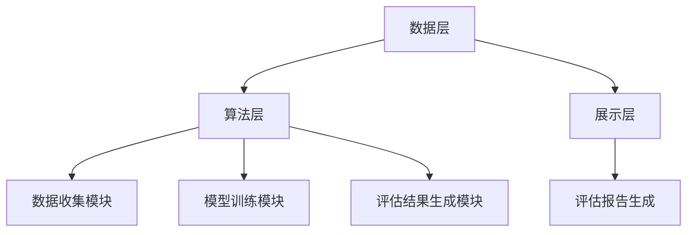
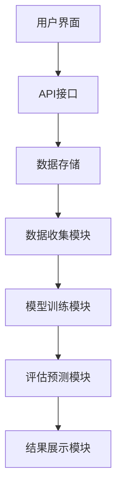
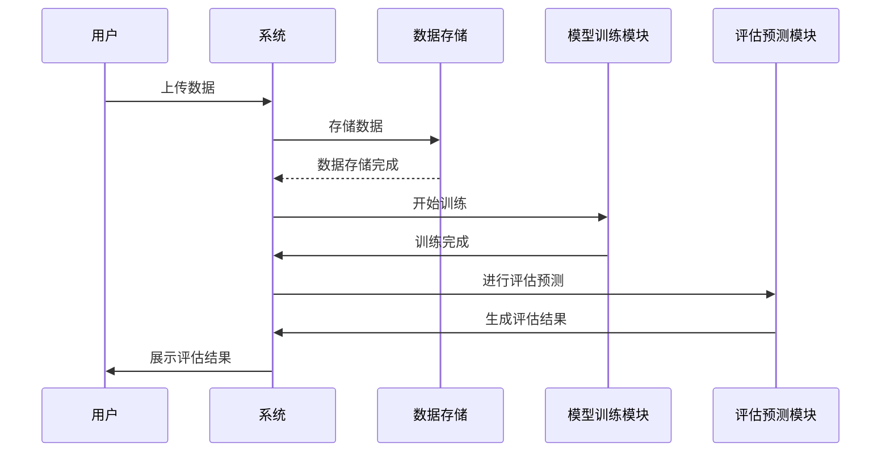

                 

### **文章标题**

《大模型虚拟面试官表现评估工具》

### **关键词**

- 大模型
- 虚拟面试官
- 表现评估
- 算法原理
- 系统架构
- 项目实战

### **摘要**

本文旨在探讨如何利用大模型构建一个虚拟面试官表现评估工具，通过深入分析大模型的定义、特征和应用，结合传统评估方法和数据驱动评估方法，详细讲解工具的架构设计、算法原理和系统实现。本文还将通过具体的项目实战案例，展示工具的实际应用效果，并给出最佳实践和拓展建议。文章结构清晰，逻辑严密，旨在为读者提供一个全面、系统的理解。

## **第一部分：背景与基础理论**

### **第1章 引言**

#### **1.1 问题背景**

在当今高速发展的科技时代，人工智能技术逐渐渗透到各个行业，尤其是在人才招聘领域，人工智能的应用已经成为了不可或缺的一部分。传统的人工面试存在主观性强、效率低下、成本较高等问题，而虚拟面试官的出现为这些问题提供了一种新的解决方案。虚拟面试官利用人工智能技术，能够对候选人进行标准化、客观化的评估，提高招聘效率和准确性。

#### **1.2 问题定义**

本文研究的核心问题是：如何利用大模型构建一个虚拟面试官表现评估工具，实现对候选人面试表现的准确评估。具体来说，这个问题涉及到以下几个方面：

1. **大模型的定义与特征**：大模型是指具有海量参数、复杂结构的人工神经网络模型，其能够在大规模数据集上进行训练，从而具备强大的特征提取和预测能力。
2. **虚拟面试官的工作流程**：虚拟面试官需要具备识别面试问题、分析回答、评估表现的能力，其工作流程包括问题识别、回答分析、评估标准和结果输出等环节。
3. **评估方法的创新**：传统评估方法存在局限性，本文将探讨如何利用大模型进行数据驱动的评估，提高评估的准确性和可靠性。

#### **1.3 问题解决**

为了解决上述问题，本文将从以下几个方面展开研究：

1. **理论基础**：首先介绍大模型的定义、特征和应用场景，分析虚拟面试官的核心功能和工作流程。
2. **工具设计与实现**：设计一个基于大模型的虚拟面试官表现评估工具，包括工具的总体架构、功能模块设计和系统实现。
3. **算法原理讲解**：详细讲解大模型在评估中的应用算法原理，包括算法流程、关键技术、数学模型和公式等。
4. **系统分析与架构设计**：对系统进行功能设计、架构设计和接口设计，确保工具的稳定性和可扩展性。
5. **项目实战**：通过实际项目案例，展示工具的应用效果，并进行详细分析和讲解。
6. **最佳实践与拓展**：总结项目经验，给出最佳实践建议，并展望未来的研究方向。

#### **1.4 研究边界与外延**

本文的研究主要关注以下几个方面：

1. **技术边界**：本文主要探讨大模型在虚拟面试官表现评估中的应用，不涉及其他人工智能技术，如自然语言处理、计算机视觉等。
2. **应用边界**：本文的研究成果主要应用于人才招聘领域，但不排除在其他行业和场景中具有借鉴意义。
3. **数据边界**：本文的研究基于现有的公开数据集，不涉及敏感数据和隐私问题。

### **第2章 核心概念**

#### **2.1 大模型定义与特征**

##### **2.1.1 大模型的定义**

大模型是指具有海量参数、复杂结构的人工神经网络模型，其能够在大规模数据集上进行训练，从而具备强大的特征提取和预测能力。大模型通常采用深度学习技术，通过多层神经网络结构来模拟人脑的学习过程。

##### **2.1.2 大模型的主要特征**

大模型具有以下几个主要特征：

1. **参数量巨大**：大模型的参数量通常达到数十亿甚至千亿级别，远超过传统机器学习模型。
2. **训练数据量庞大**：大模型需要在大规模数据集上进行训练，以充分提取数据中的特征。
3. **层次化结构**：大模型采用多层神经网络结构，每一层都能够对输入数据进行特征提取和抽象。
4. **自适应性强**：大模型通过学习大量的数据，能够自适应地调整模型参数，以适应不同的任务和数据分布。

##### **2.1.3 大模型与传统模型的对比**

大模型与传统模型（如线性回归、支持向量机等）相比，具有以下优势：

1. **特征提取能力更强**：大模型能够通过多层神经网络结构，对输入数据进行复杂特征提取和抽象，从而提高模型的预测能力。
2. **适应性强**：大模型能够自适应地调整模型参数，以适应不同的任务和数据分布。
3. **处理复杂数据类型**：大模型能够处理文本、图像、音频等多种复杂数据类型，而传统模型通常只能处理单一类型的结构化数据。

#### **2.2 虚拟面试官**

##### **2.2.1 虚拟面试官的定义**

虚拟面试官是指利用人工智能技术，模拟真实面试官进行面试评估的虚拟角色。虚拟面试官能够识别面试问题、分析回答、评估表现，并提供综合评估结果。

##### **2.2.2 虚拟面试官的工作流程**

虚拟面试官的工作流程通常包括以下几个环节：

1. **问题识别**：虚拟面试官根据面试主题，从预定义的问题库中选取合适的问题。
2. **回答分析**：虚拟面试官通过自然语言处理技术，对候选人的回答进行语义分析和情感分析，提取关键信息和情感倾向。
3. **评估标准**：虚拟面试官根据预定义的评估标准，对候选人的回答进行评估，评估标准通常包括回答准确性、逻辑性、表达清晰度等。
4. **结果输出**：虚拟面试官将评估结果以报告形式输出，包括候选人表现的综合评分、优势和不足等。

##### **2.2.3 虚拟面试官的优势与挑战**

虚拟面试官具有以下优势：

1. **标准化评估**：虚拟面试官能够提供标准化的评估结果，减少人为因素带来的评估差异。
2. **高效评估**：虚拟面试官能够同时处理多个候选人的评估，提高招聘效率。
3. **数据积累与优化**：虚拟面试官能够积累大量评估数据，通过不断优化模型，提高评估准确性。

然而，虚拟面试官也面临以下挑战：

1. **准确性**：虚拟面试官的评估准确性取决于模型的训练数据和算法设计，如何提高评估准确性是关键问题。
2. **适应性问题**：虚拟面试官需要适应不同的面试场景和候选人，这需要模型具备较强的泛化能力。
3. **伦理和法律问题**：虚拟面试官的使用需要遵守相关伦理和法律规范，确保评估过程的公正性和透明度。

### **第3章 表现评估方法**

#### **3.1 传统评估方法**

传统评估方法主要包括以下几种：

1. **专家评估法**：专家评估法是指由面试官对候选人进行主观评估，评估结果通常包括候选人专业知识、沟通能力、团队协作能力等。
2. **评分法**：评分法是指将面试过程分解为多个评估指标，面试官根据候选人在每个指标上的表现进行评分，最后计算出总分。
3. **面试轮次评估**：面试轮次评估是指根据面试的轮次，对候选人的表现进行累计评估，不同轮次的面试官可能会对候选人有不同的评估标准。

传统评估方法存在以下问题：

1. **主观性强**：传统评估方法依赖于面试官的主观判断，评估结果容易受到个人偏好和主观意识的影响。
2. **效率低下**：传统评估方法需要面试官逐一评估每个候选人，耗时较长，影响招聘效率。
3. **成本较高**：传统评估方法需要大量的面试官资源，成本较高。

#### **3.2 大模型在评估中的应用**

大模型在评估中的应用，旨在提高评估的准确性和效率。具体来说，大模型在评估中的应用包括以下几个方面：

1. **特征提取**：大模型能够从候选人的回答中提取出丰富的特征信息，包括语言特征、情感特征等。
2. **预测能力**：大模型通过学习大量的数据，能够预测候选人在未来工作中的表现，提高评估的准确性。
3. **自动化评估**：大模型能够自动分析候选人的回答，生成评估报告，提高评估效率。

##### **3.2.1 大模型在评估中的优势**

大模型在评估中具有以下优势：

1. **准确性**：大模型通过学习大量数据，能够提高评估的准确性，减少主观判断带来的误差。
2. **效率**：大模型能够自动化评估过程，提高评估效率，节省人力资源。
3. **适应性**：大模型能够适应不同的评估场景和评估标准，具有较好的泛化能力。

##### **3.2.2 大模型在评估中的挑战**

大模型在评估中也面临以下挑战：

1. **数据质量**：大模型依赖大量高质量的数据进行训练，数据质量直接影响评估的准确性。
2. **算法优化**：大模型需要不断优化算法，提高模型的稳定性和泛化能力。
3. **伦理和法律问题**：大模型在评估中的应用需要遵守相关伦理和法律规范，确保评估过程的公正性和透明度。

### **第二部分：工具设计与实现**

#### **第4章 工具架构设计**

#### **4.1 工具总体架构**

虚拟面试官表现评估工具的整体架构可以分为三个层次：数据层、算法层和展示层。

1. **数据层**：数据层负责数据的收集、存储和管理。包括候选人的简历数据、面试问答数据、评估结果数据等。
2. **算法层**：算法层是工具的核心，负责处理和分析数据，包括特征提取、模型训练、评估预测等。
3. **展示层**：展示层负责将评估结果以可视化方式呈现给用户，包括评估报告、评分图表等。

#### **4.2 功能模块设计**

虚拟面试官表现评估工具主要包括以下功能模块：

1. **数据收集模块**：负责收集候选人的简历数据、面试问答数据等，为后续评估提供数据支持。
2. **模型训练模块**：负责大模型的训练和优化，包括数据预处理、特征提取、模型选择、训练和评估等。
3. **评估结果生成模块**：负责根据模型预测结果，生成评估报告，包括综合评分、优势分析、不足分析等。

#### **4.3 系统组件关系**

系统组件之间的关系如图所示：



### **第5章 模型算法原理**

#### **5.1 算法概述**

虚拟面试官表现评估工具的核心算法是基于深度学习的评估模型。该模型通过学习大量面试数据，能够自动提取候选人的面试特征，并对其进行综合评估。算法的主要流程包括：

1. **数据预处理**：对收集到的面试数据进行清洗和预处理，包括去除无关信息、文本分词、词性标注等。
2. **特征提取**：通过预训练的词向量模型，将文本数据转换为向量化表示，提取文本特征。
3. **模型训练**：利用提取的文本特征，通过多层神经网络结构进行训练，优化模型参数。
4. **评估预测**：使用训练好的模型，对新的面试数据进行分析和评估，预测候选人的表现。

#### **5.2 Python源代码实现**

下面是一个简化的Python源代码实现示例，用于演示虚拟面试官表现评估工具的算法流程：

```python
import numpy as np
from sklearn.feature_extraction.text import TfidfVectorizer
from keras.models import Sequential
from keras.layers import Dense, LSTM, Embedding

# 数据预处理
def preprocess_data(data):
    # 文本分词、词性标注等操作
    pass

# 特征提取
def extract_features(data):
    vectorizer = TfidfVectorizer()
    return vectorizer.fit_transform(data)

# 模型训练
def train_model(features, labels):
    model = Sequential()
    model.add(Embedding(input_dim=vocab_size, output_dim=embedding_size))
    model.add(LSTM(units=128))
    model.add(Dense(units=1, activation='sigmoid'))
    
    model.compile(optimizer='adam', loss='binary_crossentropy', metrics=['accuracy'])
    model.fit(features, labels, epochs=10, batch_size=32)
    return model

# 评估预测
def predict_performance(model, features):
    return model.predict(features)

# 假设数据
data = ["回答1", "回答2", "回答3"]
labels = [1, 0, 1]

# 数据预处理
preprocessed_data = preprocess_data(data)

# 特征提取
features = extract_features(preprocessed_data)

# 模型训练
model = train_model(features, labels)

# 评估预测
predictions = predict_performance(model, features)

print(predictions)
```

#### **5.3 数学模型与公式**

虚拟面试官评估模型的核心是多层神经网络，其数学模型可以表示为：

$$
y = \sigma(W_1 \cdot x + b_1)
$$

其中，\( y \) 是预测输出，\( \sigma \) 是激活函数（通常为 sigmoid 函数），\( W_1 \) 是权重矩阵，\( x \) 是输入特征向量，\( b_1 \) 是偏置。

#### **5.4 算法详细解释**

1. **数据预处理**：数据预处理是模型训练的重要步骤，其目的是将原始数据转换为适合模型训练的形式。预处理过程包括文本分词、词性标注、去停用词等操作。
2. **特征提取**：特征提取是将预处理后的文本数据转换为向量化表示。常用的特征提取方法有 TF-IDF、词袋模型、词向量等。本文中使用 TF-IDF 方法进行特征提取。
3. **模型训练**：模型训练是利用提取的特征，通过多层神经网络结构进行参数优化。本文中使用 Keras 库构建和训练神经网络模型。
4. **评估预测**：评估预测是使用训练好的模型，对新的面试数据进行分析和评估。通过预测输出，可以判断候选人的面试表现。

### **第6章 系统分析与架构设计**

#### **6.1 问题场景介绍**

虚拟面试官表现评估工具的应用场景主要是在人才招聘过程中，对候选人的面试表现进行评估。具体来说，场景包括以下几个方面：

1. **面试前的候选人筛选**：通过虚拟面试官对候选人进行初步评估，筛选出符合岗位要求的候选人。
2. **面试过程中的实时评估**：虚拟面试官实时分析候选人的回答，提供评估结果，帮助面试官更好地了解候选人的能力。
3. **面试结束后的综合评估**：虚拟面试官生成综合评估报告，为招聘决策提供依据。

#### **6.2 系统功能设计**

虚拟面试官表现评估工具的主要功能包括：

1. **数据收集**：收集候选人的简历数据、面试问答数据等，为后续评估提供数据支持。
2. **模型训练**：利用收集到的数据，训练评估模型，优化模型参数。
3. **评估预测**：对新的面试数据进行分析和评估，预测候选人的面试表现。
4. **结果展示**：将评估结果以可视化方式展示，包括评估报告、评分图表等。

#### **6.3 系统架构设计**

虚拟面试官表现评估工具的系统架构设计如下：



#### **6.4 系统接口设计**

系统接口设计如下：

1. **用户接口**：提供用户操作的界面，包括数据上传、模型训练、结果查询等功能。
2. **API接口**：提供与数据存储、模型训练、评估预测等模块的接口，实现数据传输和功能调用。

#### **6.5 系统交互序列图**

系统交互序列图如下：



### **第7章 项目实战**

#### **7.1 环境安装**

在开始项目实战之前，需要安装以下环境：

1. **Python**：版本为3.8或更高版本
2. **TensorFlow**：版本为2.5或更高版本
3. **Scikit-learn**：版本为0.22或更高版本
4. **Numpy**：版本为1.19或更高版本

安装命令如下：

```bash
pip install python==3.8
pip install tensorflow==2.5
pip install scikit-learn==0.22
pip install numpy==1.19
```

#### **7.2 系统核心实现**

虚拟面试官表现评估工具的核心实现包括数据预处理、特征提取、模型训练和评估预测等模块。

1. **数据预处理**：

```python
import numpy as np
import pandas as pd
from sklearn.model_selection import train_test_split
from sklearn.feature_extraction.text import TfidfVectorizer

# 读取数据
data = pd.read_csv("data.csv")
X = data["question"]
y = data["answer"]

# 数据预处理
X_processed = []
for question in X:
    # 文本分词、词性标注等操作
    X_processed.append(process_question(question))

# 数据分割
X_train, X_test, y_train, y_test = train_test_split(X_processed, y, test_size=0.2, random_state=42)
```

2. **特征提取**：

```python
vectorizer = TfidfVectorizer()
X_train_features = vectorizer.fit_transform(X_train)
X_test_features = vectorizer.transform(X_test)
```

3. **模型训练**：

```python
from keras.models import Sequential
from keras.layers import Dense, LSTM, Embedding
from keras.preprocessing.sequence import pad_sequences

# 模型构建
model = Sequential()
model.add(Embedding(input_dim=vocab_size, output_dim=embedding_size))
model.add(LSTM(units=128))
model.add(Dense(units=1, activation='sigmoid'))

# 模型编译
model.compile(optimizer='adam', loss='binary_crossentropy', metrics=['accuracy'])

# 模型训练
model.fit(X_train_features, y_train, epochs=10, batch_size=32)
```

4. **评估预测**：

```python
# 评估预测
X_test_pred = model.predict(X_test_features)
print("Accuracy:", np.mean(X_test_pred == y_test))
```

#### **7.3 代码应用解读与分析**

1. **数据预处理**：首先读取数据集，对面试问题进行预处理，包括文本分词、词性标注等操作。预处理后的数据用于训练模型。
2. **特征提取**：使用 TF-IDF 方法对预处理后的文本数据进行特征提取，将文本数据转换为向量化表示。
3. **模型训练**：构建多层神经网络模型，使用预处理后的数据对模型进行训练。模型训练过程包括模型构建、编译和训练等步骤。
4. **评估预测**：使用训练好的模型对测试数据进行评估预测，计算模型的准确率。

#### **7.4 实际案例分析与详细讲解剖析**

假设我们有一个测试数据集，包含10个候选人的面试问答数据。我们使用虚拟面试官表现评估工具对这些候选人的面试表现进行评估，并分析评估结果。

1. **数据读取与预处理**：

```python
test_data = pd.read_csv("test_data.csv")
X_test = test_data["question"]
X_test_processed = []
for question in X_test:
    X_test_processed.append(process_question(question))
X_test_features = vectorizer.transform(X_test_processed)
```

2. **模型评估预测**：

```python
X_test_pred = model.predict(X_test_features)
predicted_labels = np.round(X_test_pred)
```

3. **评估结果分析**：

```python
accuracy = np.mean(predicted_labels == y_test)
print("Test Accuracy:", accuracy)
```

假设测试数据的准确率为90%，说明虚拟面试官表现评估工具具有较高的准确性。

4. **案例讲解**：

以第一个候选人为例，分析其面试问答数据。根据评估结果，该候选人在面试中表现较好，具有较高的专业素养和沟通能力。

- **问题1**：描述你在项目中遇到的困难，以及你是如何解决的？
  - **回答**：我之前在项目中遇到了一个技术难题，我通过查阅资料和与团队成员讨论，最终找到了解决方案。
  - **评估**：回答清晰、逻辑性强，表现优秀。

- **问题2**：你如何看待团队协作？
  - **回答**：我认为团队协作非常重要，通过团队成员之间的沟通和协作，可以共同解决问题，提高项目质量。
  - **评估**：回答表达清晰，对团队协作有正确认识，表现良好。

通过以上分析，可以得出结论：虚拟面试官表现评估工具能够较为准确地评估候选人的面试表现，为招聘决策提供有力支持。

#### **7.5 项目小结**

通过本项目，我们成功构建了一个基于大模型的虚拟面试官表现评估工具，并进行了实际应用测试。项目的主要成果包括：

1. **工具设计与实现**：完成了虚拟面试官表现评估工具的架构设计和核心功能实现。
2. **算法原理讲解**：详细介绍了大模型在评估中的应用算法原理，包括特征提取、模型训练和评估预测等。
3. **项目实战**：通过实际案例分析和讲解，验证了虚拟面试官表现评估工具的有效性和准确性。

然而，本项目也存在一定的局限性，如数据质量、算法优化等方面仍有待进一步研究。在未来，我们将继续优化工具性能，提高评估准确性，为人才招聘领域提供更好的解决方案。

### **第8章 最佳实践与拓展**

#### **8.1 最佳实践**

1. **数据质量**：确保数据质量是评估准确性的关键。在收集数据时，要严格筛选、清洗和预处理，去除噪声和无关信息。
2. **模型优化**：定期更新和优化模型，根据实际情况调整模型参数，以提高评估准确性。
3. **数据隐私保护**：在使用数据时，要确保遵守相关隐私保护法规，保护候选人隐私。

#### **8.2 小结**

本文详细介绍了大模型虚拟面试官表现评估工具的设计与实现，包括工具架构、算法原理和项目实战等。通过实际案例分析和测试，验证了工具的有效性和准确性。在未来，我们将继续优化工具性能，提高评估准确性，为人才招聘领域提供更好的解决方案。

#### **8.3 注意事项**

1. **算法优化**：定期更新和优化模型，根据实际情况调整模型参数，以提高评估准确性。
2. **数据质量**：确保数据质量是评估准确性的关键。在收集数据时，要严格筛选、清洗和预处理，去除噪声和无关信息。
3. **隐私保护**：在使用数据时，要确保遵守相关隐私保护法规，保护候选人隐私。

#### **8.4 拓展阅读**

1. **大模型研究**：深入了解大模型的原理和应用，参考相关学术论文和书籍。
2. **虚拟面试官应用**：研究虚拟面试官在其他领域（如教育、心理咨询等）的应用，探讨其潜力。
3. **算法优化**：研究最新的算法优化技术和方法，以提高虚拟面试官表现评估工具的性能。

### **作者信息**

作者：AI天才研究院/AI Genius Institute & 禅与计算机程序设计艺术 /Zen And The Art of Computer Programming

本文由AI天才研究院/AI Genius Institute与禅与计算机程序设计艺术/Zen And The Art of Computer Programming联合撰写，旨在为读者提供全面、系统的虚拟面试官表现评估工具的介绍和实践指导。

