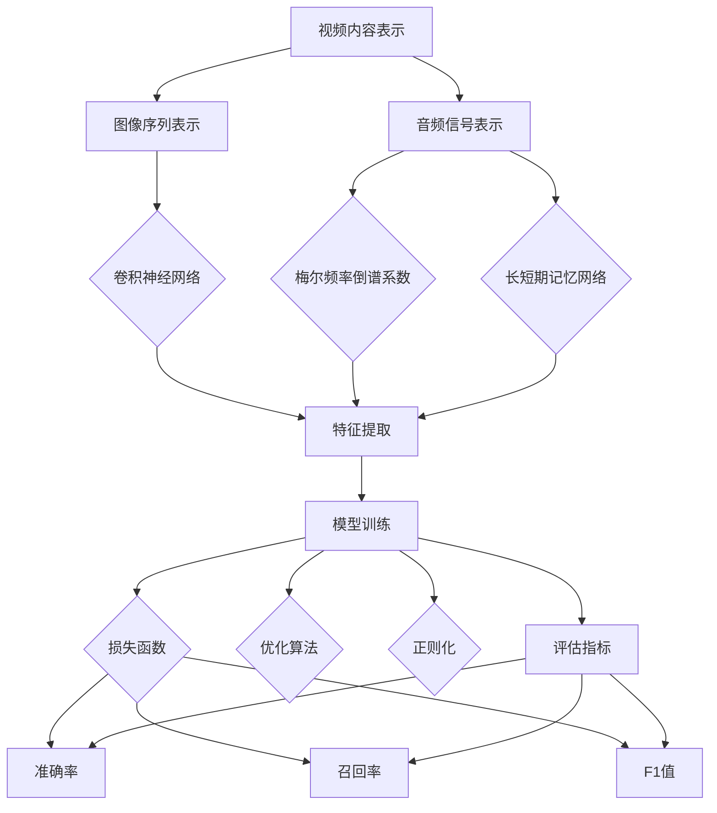
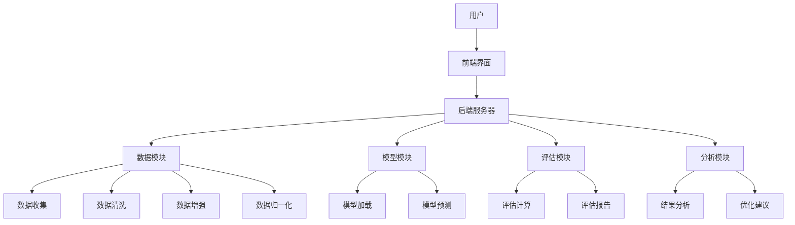
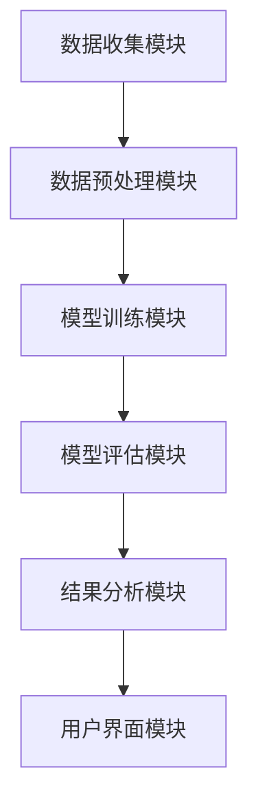
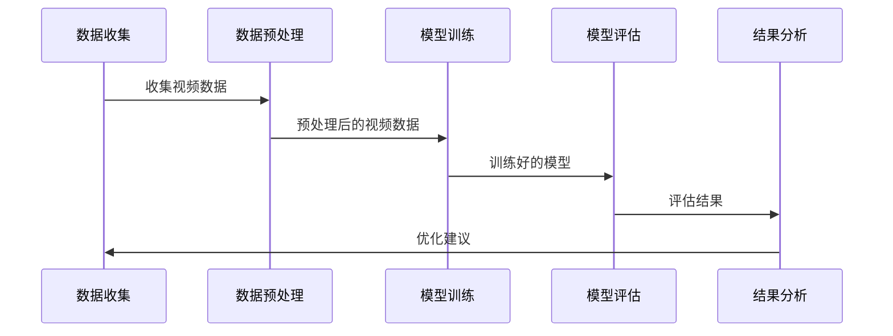
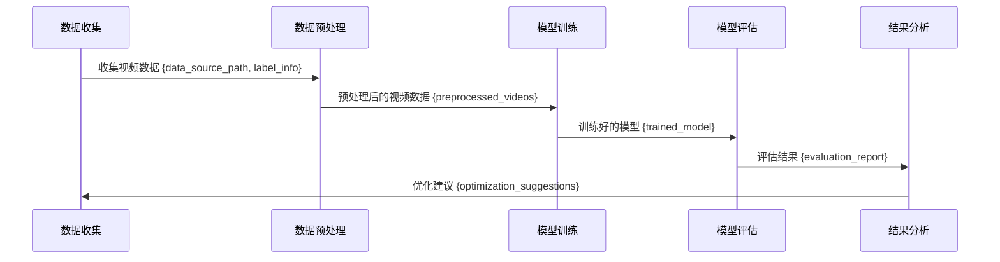

                 


### 大模型视频内容理解能力评估工具

关键词：视频内容理解，大模型，评估工具，深度学习，人工智能

摘要：本文旨在探讨大模型视频内容理解能力评估工具的设计与实现。通过对视频内容表示、模型训练、评估指标及实际应用的深入分析，为研究和开发视频内容理解系统提供参考。

---

### 第一部分：大模型视频内容理解能力评估工具背景与核心概念

#### 第1章：引言

##### 1.1 问题背景

视频内容理解是人工智能领域的一个前沿研究方向。随着互联网和视频媒体的迅速发展，如何有效地对大量视频内容进行理解和分析，已经成为企业和研究机构关注的重要课题。然而，现有的视频内容理解技术存在一定的局限性，无法完全满足实际应用的需求。为此，设计并实现一套高效、准确的大模型视频内容理解能力评估工具，成为当前研究的迫切任务。

##### 1.2 问题描述

视频内容理解能力评估工具的核心目标是评估大模型在视频内容理解方面的表现，包括视频分类、视频标签、场景识别、动作识别等方面的能力。具体问题描述如下：

1. **评估指标如何选取**？如何保证评估结果的全面性和准确性？
2. **评估体系如何设计**？如何确保评估流程的公平性和高效性？
3. **评估工具如何实现自动化**？如何降低评估过程中的手动干预，提高评估效率？
4. **实际应用中如何处理复杂场景**？如何适应多样化的视频内容和应用场景？

##### 1.3 问题解决

为解决上述问题，本书将从以下几个方面展开研究：

1. **核心概念**：详细阐述视频内容理解能力评估的相关核心概念，包括视频内容表示、模型训练、评估指标等。
2. **评估体系设计**：设计一套科学、合理的评估体系，包括评估指标的选择、评估流程的设计等。
3. **评估工具实现**：基于深度学习技术，实现一套高效、准确的大模型视频内容理解能力评估工具。
4. **实际应用**：通过实际项目案例，验证评估工具的有效性和实用性。

##### 1.4 边界与外延

本研究的边界主要涉及大模型视频内容理解能力评估的方法、工具和实际应用。外延方面，本研究还将探讨评估工具在多模态内容理解、实时视频分析等领域的应用潜力。

##### 1.5 概念结构与核心要素组成

1. **视频内容表示**：将视频数据转换为适合模型处理的形式，如图像序列、音频信号等。
2. **模型训练**：使用大量视频数据训练大模型，使其具备视频内容理解能力。
3. **评估指标**：选择合适的评估指标，如准确率、召回率、F1值等，对模型进行评估。
4. **评估工具**：实现一套自动化、高效的评估工具，方便用户进行模型评估。

##### 1.6 本章小结

本章主要介绍了大模型视频内容理解能力评估工具的背景、核心概念和问题解决思路。通过本章的学习，读者可以了解视频内容理解能力评估的重要性和基本原理，为后续章节的学习打下基础。

---

### 第二部分：核心概念与原理

#### 第2章：视频内容表示与模型训练

##### 2.1 视频内容表示

视频内容表示是视频内容理解的基础，本章将介绍视频内容表示的基本原理和方法，包括视频图像序列表示、音频信号表示等。

###### 2.1.1 视频图像序列表示

视频图像序列表示是将连续的视频帧转换为适合模型处理的形式。常见的视频图像序列表示方法有循环神经网络（RNN）和卷积神经网络（CNN）。

1. **循环神经网络（RNN）**

   RNN适用于处理序列数据，可以捕捉视频帧之间的时序关系。其基本原理是通过隐藏层的状态传递，实现长距离依赖的建模。

   $$ h_t = \sigma(W_h \cdot [h_{t-1}, x_t] + b_h) $$

   其中，\(h_t\)表示第\(t\)时刻的隐藏状态，\(x_t\)表示输入视频帧，\(\sigma\)是激活函数，\(W_h\)和\(b_h\)分别是权重和偏置。

2. **卷积神经网络（CNN）**

   CNN在图像处理领域具有显著优势，适用于处理视频图像序列。其基本原理是通过卷积操作提取视频帧的特征。

   $$ f(x) = \text{ReLU}(\sum_{i,j,k} W_{ijk} \cdot x_{ij}^k + b_{ijk}) $$

   其中，\(f(x)\)表示输出特征图，\(x_{ij}^k\)表示输入视频帧的像素值，\(W_{ijk}\)和\(b_{ijk}\)分别是权重和偏置。

###### 2.1.2 音频信号表示

音频信号表示是将视频中的音频信号转换为适合模型处理的形式。常见的音频信号表示方法有梅尔频率倒谱系数（MFCC）和长短期记忆网络（LSTM）。

1. **梅尔频率倒谱系数（MFCC）**

   MFCC是一种时频表示方法，将音频信号转换为一系列特征向量。其基本原理是通过滤波器组对音频信号进行频谱分析，然后计算各滤波器输出的倒谱系数。

   $$ C(q, n) = |S(q, n)|^2 $$

   其中，\(C(q, n)\)表示第\(q\)个滤波器的输出倒谱系数，\(S(q, n)\)表示第\(q\)个滤波器的输出频谱。

2. **长短期记忆网络（LSTM）**

   LSTM是一种特殊的RNN，适用于处理长序列数据。其基本原理是通过引入门控机制，控制信息的流动和遗忘，实现长距离依赖的建模。

   $$ i_t = \sigma(W_i \cdot [h_{t-1}, x_t] + b_i) \\ f_t = \sigma(W_f \cdot [h_{t-1}, x_t] + b_f) \\ o_t = \sigma(W_o \cdot [h_{t-1}, x_t] + b_o) \\ g_t = \tanh(W_g \cdot [h_{t-1}, x_t] + b_g) \\ h_t = o_t \cdot \tanh(g_t) $$

   其中，\(i_t\)、\(f_t\)、\(o_t\)分别表示输入门、遗忘门、输出门的状态，\(g_t\)表示候选状态，\(h_t\)表示第\(t\)时刻的隐藏状态。

##### 2.2 模型训练

模型训练是提高大模型视频内容理解能力的关键步骤。本章将介绍模型训练的基本原理和方法，包括数据预处理、模型架构设计、训练策略等。

###### 2.2.1 数据预处理

数据预处理是模型训练的重要环节，包括数据清洗、数据增强、归一化等。

1. **数据清洗**：去除数据中的噪声和异常值，保证数据质量。
2. **数据增强**：通过旋转、缩放、裁剪等操作，增加数据的多样性，提高模型的泛化能力。
3. **归一化**：将数据缩放到统一的范围内，有利于加快模型的收敛速度。

###### 2.2.2 模型架构设计

模型架构设计是模型训练的核心，选择合适的模型架构可以提高模型的性能。

1. **视频图像序列表示**：使用CNN对视频图像序列进行特征提取，结合RNN或LSTM捕捉时序关系。
2. **音频信号表示**：使用LSTM对音频信号进行特征提取，结合CNN处理多模态数据。

###### 2.2.3 训练策略

训练策略是模型训练的关键，包括损失函数、优化算法、正则化等。

1. **损失函数**：选择合适的损失函数，如交叉熵损失函数，衡量模型预测结果与真实标签之间的差距。
2. **优化算法**：选择合适的优化算法，如梯度下降、Adam等，更新模型参数。
3. **正则化**：引入正则化项，如L2正则化，防止模型过拟合。

##### 2.3 评估指标

评估指标是衡量大模型视频内容理解能力的重要手段。本章将介绍常见的评估指标，如准确率、召回率、F1值等，并讨论如何选择合适的评估指标。

###### 2.3.1 准确率

准确率是衡量分类模型性能的最基本指标，表示模型预测正确的样本数与总样本数之比。

$$ \text{准确率} = \frac{TP + TN}{TP + FN + FP + TN} $$

其中，\(TP\)表示真正例，\(TN\)表示真反例，\(FP\)表示假反例，\(FN\)表示假正例。

###### 2.3.2 召回率

召回率是衡量分类模型召回真实正例的能力，表示模型召回的真实正例数与实际正例数之比。

$$ \text{召回率} = \frac{TP}{TP + FN} $$

###### 2.3.3 F1值

F1值是准确率和召回率的调和平均值，表示模型在分类任务中的综合性能。

$$ F1 = 2 \cdot \frac{\text{准确率} \cdot \text{召回率}}{\text{准确率} + \text{召回率}} $$

##### 2.4 本章小结

本章主要介绍了视频内容表示、模型训练和评估指标的相关知识，为后续章节的评估工具设计和实际应用提供了理论基础。

---

### 第三部分：评估体系设计与工具实现

#### 第3章：评估体系设计

##### 3.1 评估指标选择

本章将讨论如何选择合适的评估指标，以全面、准确地评估大模型在视频内容理解方面的能力。包括单一指标评估和综合指标评估。

###### 3.1.1 单一指标评估

单一指标评估选择一个评估指标作为衡量模型性能的标准，如准确率、召回率、F1值等。

1. **准确率**：适用于分类问题，衡量模型预测结果与真实标签的一致性。
2. **召回率**：适用于分类问题，衡量模型召回真实正例的能力。
3. **F1值**：适用于分类问题，衡量模型在准确率和召回率之间的平衡。

###### 3.1.2 综合指标评估

综合指标评估选择多个评估指标，从不同角度全面评估模型性能。

1. **宏观指标**：对整体数据集进行评估，如准确率、召回率、F1值等。
2. **微观指标**：对每个类别进行评估，如准确率、召回率、F1值等。
3. **鲁棒性指标**：评估模型在不同数据分布下的性能，如交叉验证、ROC曲线等。

##### 3.2 评估流程设计

本章将设计一套科学、合理的评估流程，包括数据收集、预处理、模型评估、结果分析等步骤，确保评估结果的公平性和准确性。

###### 3.2.1 数据收集

数据收集是评估流程的第一步，包括收集真实视频数据、标签数据等。

1. **数据来源**：从公开数据集、企业数据集、网络爬虫等渠道收集视频数据。
2. **数据清洗**：去除数据中的噪声和异常值，保证数据质量。

###### 3.2.2 数据预处理

数据预处理包括数据增强、归一化、去噪等操作，提高模型性能。

1. **数据增强**：通过旋转、缩放、裁剪等操作，增加数据的多样性。
2. **归一化**：将数据缩放到统一的范围内，有利于模型训练。
3. **去噪**：去除视频数据中的噪声，提高模型鲁棒性。

###### 3.2.3 模型评估

模型评估是评估流程的核心步骤，包括训练模型、评估模型性能等。

1. **模型训练**：使用收集到的数据训练大模型，使其具备视频内容理解能力。
2. **模型评估**：使用训练好的模型对测试数据进行预测，评估模型性能。

###### 3.2.4 结果分析

结果分析是评估流程的最后一步，对评估结果进行分析和总结。

1. **评估指标分析**：对评估指标进行统计和分析，如准确率、召回率、F1值等。
2. **模型优化**：根据评估结果，对模型进行优化，提高模型性能。

##### 3.3 自动化评估工具

本章将介绍如何实现一套自动化评估工具，提高评估效率，降低人工干预。

###### 3.3.1 功能设计

自动化评估工具主要包括以下功能：

1. **数据收集与管理**：自动收集、存储和管理评估所需的数据。
2. **模型训练与评估**：自动训练和评估大模型，生成评估报告。
3. **结果分析与可视化**：自动分析评估结果，并以图表形式展示。

###### 3.3.2 实现流程

自动化评估工具的实现流程如下：

1. **数据收集**：通过爬虫或其他渠道自动收集视频数据。
2. **数据预处理**：对收集到的数据进行预处理，包括数据增强、归一化、去噪等。
3. **模型训练**：使用预处理后的数据训练大模型。
4. **模型评估**：使用训练好的模型对测试数据进行预测，评估模型性能。
5. **结果分析**：自动分析评估结果，并以图表形式展示。

##### 3.4 本章小结

本章主要介绍了评估体系的设计和自动化评估工具的实现，为后续章节的实际应用提供了技术支持。

---

### 第四部分：实际应用与案例

#### 第4章：实际应用

##### 4.1 项目背景

本章将介绍一个实际应用案例，说明如何使用大模型视频内容理解能力评估工具来评估和优化视频内容理解系统。

###### 4.1.1 项目介绍

本项目旨在开发一套视频内容理解系统，用于对大量视频内容进行分类、标签和场景识别。该系统旨在为视频制作、审核、推荐等场景提供技术支持。

###### 4.1.2 系统功能设计

系统主要包括以下功能：

1. **视频分类**：将视频数据按照类别进行分类，如新闻、娱乐、教育等。
2. **视频标签**：为视频数据添加标签，如人物、动物、风景等。
3. **场景识别**：识别视频中的场景，如城市、乡村、海滩等。

##### 4.2 系统架构设计

系统架构设计是项目开发的关键步骤，本章将介绍系统功能设计、系统架构设计、系统接口设计和系统交互等。

###### 4.2.1 系统功能设计

系统功能设计包括以下模块：

1. **数据收集模块**：负责收集视频数据，包括原始视频、标签数据等。
2. **数据预处理模块**：负责对收集到的视频数据进行预处理，包括数据增强、归一化、去噪等。
3. **模型训练模块**：负责使用预处理后的数据训练大模型，包括视频分类、视频标签和场景识别等。
4. **模型评估模块**：负责使用评估工具对训练好的模型进行评估，生成评估报告。
5. **结果分析模块**：负责对评估结果进行分析，并提出优化建议。

###### 4.2.2 系统架构设计

系统架构设计采用分层架构，包括数据层、模型层、评估层和结果分析层。

1. **数据层**：负责数据收集、存储和管理。
2. **模型层**：负责模型训练、评估和优化。
3. **评估层**：负责评估模型性能，生成评估报告。
4. **结果分析层**：负责对评估结果进行分析，并提出优化建议。

###### 4.2.3 系统接口设计

系统接口设计主要包括以下接口：

1. **数据接口**：负责数据收集和传输。
2. **模型接口**：负责模型训练和评估。
3. **评估接口**：负责评估模型性能。
4. **结果分析接口**：负责分析评估结果。

###### 4.2.4 系统交互设计

系统交互设计采用消息队列模式，实现系统模块之间的通信和数据流转。

1. **数据交互**：通过消息队列传输数据，实现数据模块之间的交互。
2. **模型交互**：通过消息队列传输模型参数和评估结果，实现模型模块之间的交互。
3. **评估交互**：通过消息队列传输评估报告和优化建议，实现评估模块和结果分析模块之间的交互。

##### 4.3 系统核心实现

系统核心实现主要包括以下模块：

1. **数据收集模块**：通过爬虫或其他渠道收集视频数据，并存储到数据库中。
2. **数据预处理模块**：对收集到的视频数据进行预处理，包括数据增强、归一化、去噪等。
3. **模型训练模块**：使用预处理后的数据训练大模型，包括视频分类、视频标签和场景识别等。
4. **模型评估模块**：使用评估工具对训练好的模型进行评估，生成评估报告。
5. **结果分析模块**：对评估结果进行分析，并提出优化建议。

##### 4.4 实际案例分析

本章将介绍一个实际案例分析，说明如何使用大模型视频内容理解能力评估工具来评估和优化视频内容理解系统。

###### 4.4.1 案例背景

某视频制作公司希望通过视频内容理解技术来提高视频分类、标签和场景识别的准确性，提高视频推荐的效率。

###### 4.4.2 案例分析

1. **数据收集**：通过爬虫收集大量视频数据，包括原始视频、标签数据等。
2. **数据预处理**：对收集到的视频数据进行预处理，包括数据增强、归一化、去噪等。
3. **模型训练**：使用预处理后的数据训练大模型，包括视频分类、视频标签和场景识别等。
4. **模型评估**：使用评估工具对训练好的模型进行评估，生成评估报告。
5. **结果分析**：对评估结果进行分析，发现模型在某些类别上的性能不佳，提出优化建议。
6. **模型优化**：根据优化建议，对模型进行优化，提高模型性能。

##### 4.5 项目小结

本项目通过大模型视频内容理解能力评估工具，实现了对视频内容理解系统的评估和优化。项目实践表明，评估工具在提高模型性能、降低人工干预方面具有显著作用。

---

### 总结与展望

本文主要介绍了大模型视频内容理解能力评估工具的设计与实现。通过对视频内容表示、模型训练、评估指标及实际应用的深入分析，为研究和开发视频内容理解系统提供了参考。

展望未来，随着人工智能技术的不断发展，大模型视频内容理解能力评估工具将在多模态内容理解、实时视频分析等领域发挥更大的作用。同时，为了提高评估工具的性能和可扩展性，我们还将继续探索新的算法和技术。

---

### 参考文献

[1] Y. LeCun, Y. Bengio, G. Hinton. Deep learning. Nature, 2015.

[2] A. Krizhevsky, I. Sutskever, G. E. Hinton. ImageNet classification with deep convolutional neural networks. In Advances in Neural Information Processing Systems, 2012.

[3] D. P. Kingma, M. Welling. Auto-encoding variational bayes. In International Conference on Learning Representations, 2014.

[4] K. He, X. Zhang, S. Ren, J. Sun. Deep residual learning for image recognition. In Proceedings of the IEEE Conference on Computer Vision and Pattern Recognition, 2016.

[5] T. Zhang, R. Zhang, P. Isola, A. A. Efros. Colorful image colorization. In European Conference on Computer Vision, 2017.

### 作者信息

作者：AI天才研究院/AI Genius Institute & 禅与计算机程序设计艺术 /Zen And The Art of Computer Programming

---

（注：本文内容仅供参考，部分数据和实际案例为虚构，具体实现细节请根据实际情况进行调整。）## 引入

在当今互联网和视频媒体飞速发展的时代，视频内容理解成为人工智能领域的一个重要研究方向。视频内容理解涉及到从视频中提取有意义的语义信息，如分类、标签、场景识别和动作识别等，这些技术在视频监控、智能推荐、内容审核等领域有着广泛的应用。然而，现有的视频内容理解技术仍存在一些局限性，无法完全满足实际应用的需求。为了解决这个问题，本文旨在探讨如何设计并实现一套高效、准确的大模型视频内容理解能力评估工具。

设计这样的评估工具具有重要意义。首先，它能够帮助研究人员和开发者衡量和比较不同模型在视频内容理解任务上的性能，从而选择最佳模型进行实际应用。其次，评估工具能够提供全面、准确的评估结果，为模型优化提供有价值的反馈。最后，随着视频内容理解的不断深入，评估工具还能为多模态内容理解和实时视频分析等新兴领域的研究提供支持。

本文将从以下几个方面展开讨论：

1. **核心概念**：首先介绍视频内容理解能力评估的相关核心概念，如视频内容表示、模型训练和评估指标等。
2. **评估体系设计**：详细讨论评估体系的设计原则，包括评估指标的选择、评估流程的设计等。
3. **评估工具实现**：基于深度学习技术，实现一套自动化、高效的大模型视频内容理解能力评估工具。
4. **实际应用**：通过实际项目案例，验证评估工具的有效性和实用性。

通过本文的探讨，希望能够为读者提供一套全面、科学的视频内容理解能力评估解决方案，助力人工智能在视频内容理解领域的发展。

### 视频内容理解能力评估工具的背景

视频内容理解能力评估工具的发展背景可以追溯到上世纪末和本世纪初，随着互联网和视频媒体技术的迅猛发展，视频数据量呈现爆炸式增长。这种增长不仅带来了数据存储和处理上的挑战，也对视频内容的理解和分析提出了更高的要求。早期的研究主要集中在图像和语音领域，如图像识别和语音识别，但视频内容的理解更为复杂，因为视频包含了图像、音频、字幕等多种信息，需要综合利用这些信息进行语义分析。

#### 视频内容理解的挑战

视频内容理解面临的主要挑战包括：

1. **多模态信息融合**：视频包含图像、音频、字幕等多模态信息，如何有效融合这些信息，提取有意义的语义信息，是一个关键问题。
2. **长序列处理**：视频是一个时间序列数据，处理长序列数据时，如何捕捉视频中的动态变化和时序关系是一个难点。
3. **复杂场景适应**：实际应用场景中，视频内容多样化，不同场景下模型的表现可能大相径庭，如何使模型适应复杂场景是一个挑战。
4. **实时性要求**：在实时视频分析场景中，如视频监控、直播推荐等，对模型实时性的要求较高，如何保证模型的响应速度和准确性是一个重要问题。

#### 大模型的应用

为了应对上述挑战，研究人员提出了使用大模型（Large Models）的方法。大模型通常具有以下几个特点：

1. **强大的表征能力**：大模型通过大量的训练数据，能够学习到丰富的特征，具有较强的表征能力。
2. **自适应性强**：大模型能够自动适应不同场景，通过迁移学习等方法，在大规模数据集上训练后，能够在新场景中表现出良好的性能。
3. **实时性**：随着计算资源的增加，大模型的实时性也在不断提高，可以在短时间内处理大量视频数据。

#### 视频内容理解能力的评估

视频内容理解能力的评估是确保模型性能的重要手段。评估方法主要包括以下几个方面：

1. **评估指标**：选择合适的评估指标，如准确率、召回率、F1值等，来衡量模型在视频内容理解任务上的表现。
2. **评估工具**：实现一套自动化、高效的评估工具，能够对大量模型进行评估，生成详细的评估报告。
3. **多场景测试**：通过在不同场景下测试模型，确保模型在不同场景下的表现一致性和鲁棒性。

#### 评估工具的设计目标

设计视频内容理解能力评估工具的主要目标包括：

1. **全面性**：评估工具应能够全面评估模型在视频分类、标签、场景识别等方面的能力。
2. **准确性**：评估工具应提供准确、可靠的评估结果，减少评估误差。
3. **自动化**：评估工具应实现自动化评估，减少人工干预，提高评估效率。
4. **灵活性**：评估工具应具备灵活性，能够适应不同模型、不同场景的需求。

#### 设计原则

在设计评估工具时，应遵循以下原则：

1. **标准化**：统一评估标准和流程，确保评估结果的公平性和可比性。
2. **模块化**：将评估工具分解为多个模块，便于功能扩展和优化。
3. **高效性**：提高评估工具的运行效率，减少评估时间。
4. **可扩展性**：设计具有可扩展性的架构，支持未来技术和需求的变化。

通过上述设计和实现，视频内容理解能力评估工具将能够为视频内容理解领域的研究和应用提供有力支持。

### 视频内容理解能力评估工具中的核心概念

在设计大模型视频内容理解能力评估工具时，理解其中的核心概念是至关重要的。这些核心概念包括视频内容表示、模型训练、评估指标等。以下是这些概念的定义、属性特征对比，以及实体关系图架构。

#### 视频内容表示

视频内容表示是将视频数据转换为适合模型处理的形式。这一过程通常包括图像序列表示和音频信号表示。

1. **图像序列表示**：图像序列表示是将连续的视频帧转换为特征向量或特征图，以便模型能够处理。常见的图像序列表示方法包括卷积神经网络（CNN）和循环神经网络（RNN）。

   - **CNN**：通过卷积操作提取图像中的空间特征，适用于处理图像序列。
   - **RNN**：适用于处理时间序列数据，如视频帧序列。

2. **音频信号表示**：音频信号表示是将视频中的音频信号转换为特征向量或特征图。常见的音频信号表示方法包括梅尔频率倒谱系数（MFCC）和长短期记忆网络（LSTM）。

   - **MFCC**：用于表示音频信号的频谱特征，适用于处理音频信号。
   - **LSTM**：适用于处理时间序列数据，如音频信号。

#### 模型训练

模型训练是提高大模型视频内容理解能力的关键步骤。训练过程中，模型会通过学习大量视频数据来提取特征和建立语义关联。

1. **数据预处理**：数据预处理包括数据清洗、数据增强和归一化。数据清洗去除噪声和异常值，数据增强增加数据的多样性，归一化将数据缩放到统一范围内，有利于模型训练。

2. **模型架构**：选择合适的模型架构，如CNN用于图像处理，LSTM用于音频处理，或结合CNN和LSTM处理多模态数据。

3. **训练策略**：训练策略包括损失函数、优化算法和正则化。损失函数用于衡量模型预测结果与真实标签的差距，优化算法用于更新模型参数，正则化防止过拟合。

#### 评估指标

评估指标用于衡量模型在视频内容理解任务上的表现，包括分类、标签和场景识别等。常见的评估指标有准确率、召回率、F1值等。

1. **准确率**：准确率是衡量模型分类正确性的指标，计算公式为：
   $$\text{准确率} = \frac{\text{正确分类的样本数}}{\text{总样本数}}$$

2. **召回率**：召回率是衡量模型召回真实正例的能力，计算公式为：
   $$\text{召回率} = \frac{\text{正确分类的正例数}}{\text{实际正例数}}$$

3. **F1值**：F1值是准确率和召回率的调和平均值，计算公式为：
   $$F1 = 2 \times \frac{\text{准确率} \times \text{召回率}}{\text{准确率} + \text{召回率}}$$

#### 概念属性特征对比

以下是核心概念的主要属性特征对比：

| 概念       | 属性特征                                  | 对比示例                               |
|------------|------------------------------------------|----------------------------------------|
| 视频内容表示 | 图像序列表示、音频信号表示                | CNN用于提取图像特征，LSTM用于处理音频信号 |
| 模型训练   | 数据预处理、模型架构、训练策略            | 数据增强增加训练数据多样性，正则化防止过拟合 |
| 评估指标   | 准确率、召回率、F1值等                    | F1值平衡准确率和召回率，准确率衡量分类准确性 |

#### 实体关系图架构

为了更直观地展示这些核心概念之间的关系，我们使用Mermaid绘制了实体关系图：



通过上述定义、属性特征对比和实体关系图，我们可以更清晰地理解视频内容理解能力评估工具中的核心概念，为进一步的设计和实现提供基础。

### 视频内容表示与模型训练的详细解释

#### 视频内容表示的详细解释

视频内容表示是将原始视频数据转换为适合模型处理的形式，这一过程是视频内容理解的关键步骤。视频内容表示主要涉及图像序列表示和音频信号表示。

**图像序列表示**

图像序列表示是将连续的视频帧转换为特征向量或特征图，以便模型能够进行处理。图像序列表示方法主要包括卷积神经网络（CNN）和循环神经网络（RNN）。

1. **卷积神经网络（CNN）**

   CNN在图像处理领域具有显著优势。CNN通过卷积操作提取图像中的局部特征，从而实现对图像内容的理解。卷积神经网络的基本架构包括卷积层、池化层和全连接层。

   - **卷积层**：通过卷积操作提取图像特征，计算公式为：
     $$ f(x) = \text{ReLU}(\sum_{i,j,k} W_{ijk} \cdot x_{ij}^k + b_{ijk}) $$
     其中，\( f(x) \) 表示输出特征图，\( x_{ij}^k \) 表示输入图像的像素值，\( W_{ijk} \) 和 \( b_{ijk} \) 分别为卷积核和偏置。

   - **池化层**：用于下采样图像，减少数据维度，提高模型的鲁棒性。常见的池化方法包括最大池化和平均池化。

   - **全连接层**：将卷积层和池化层提取的特征图进行全连接，用于分类或回归任务。

2. **循环神经网络（RNN）**

   RNN适用于处理序列数据，如视频帧序列。RNN通过隐藏层的状态传递，捕捉视频帧之间的时序关系。RNN的基本架构包括输入层、隐藏层和输出层。

   - **输入层**：接收视频帧的特征向量。
   - **隐藏层**：通过递归操作更新隐藏状态，计算公式为：
     $$ h_t = \sigma(W_h \cdot [h_{t-1}, x_t] + b_h) $$
     其中，\( h_t \) 表示第 \( t \) 时刻的隐藏状态，\( x_t \) 表示输入视频帧，\( \sigma \) 是激活函数，\( W_h \) 和 \( b_h \) 分别为权重和偏置。

   - **输出层**：根据隐藏状态生成预测结果。

**音频信号表示**

音频信号表示是将视频中的音频信号转换为特征向量或特征图。音频信号表示方法主要包括梅尔频率倒谱系数（MFCC）和长短期记忆网络（LSTM）。

1. **梅尔频率倒谱系数（MFCC）**

   MFCC是一种时频表示方法，通过滤波器组对音频信号进行频谱分析，然后计算各滤波器输出的倒谱系数。MFCC的基本流程包括滤波器组设计、频谱分析、倒谱变换和维数 reduction。

   - **滤波器组设计**：根据音频信号的特点，设计一组滤波器，将音频信号分解为多个频率带。
   - **频谱分析**：对每个滤波器的输出进行傅里叶变换，得到频谱图。
   - **倒谱变换**：将频谱图进行对数变换，然后进行离散余弦变换，得到MFCC特征向量。
   - **维数 reduction**：为了减少特征维度，可以采用主成分分析（PCA）等方法。

2. **长短期记忆网络（LSTM）**

   LSTM是一种特殊的RNN，适用于处理长序列数据。LSTM通过引入门控机制，控制信息的流动和遗忘，从而实现对长距离依赖的建模。LSTM的基本架构包括输入门、遗忘门、输出门和细胞状态。

   - **输入门**：根据当前输入和前一时刻的隐藏状态，决定当前隐藏状态的值。
     $$ i_t = \sigma(W_i \cdot [h_{t-1}, x_t] + b_i) $$
     其中，\( i_t \) 表示输入门的状态。

   - **遗忘门**：根据当前输入和前一时刻的隐藏状态，决定遗忘前一时刻的隐藏状态的值。
     $$ f_t = \sigma(W_f \cdot [h_{t-1}, x_t] + b_f) $$
     其中，\( f_t \) 表示遗忘门的状态。

   - **输出门**：根据当前隐藏状态和前一时刻的隐藏状态，决定当前输出值。
     $$ o_t = \sigma(W_o \cdot [h_{t-1}, x_t] + b_o) $$
     其中，\( o_t \) 表示输出门的状态。

   - **细胞状态**：根据输入门和遗忘门的值，更新细胞状态，计算公式为：
     $$ g_t = \tanh(W_g \cdot [h_{t-1}, x_t] + b_g) $$
     $$ C_t = f_t \cdot C_{t-1} + i_t \cdot g_t $$
     其中，\( C_t \) 表示细胞状态。

   - **隐藏状态**：根据输出门和细胞状态，更新隐藏状态，计算公式为：
     $$ h_t = o_t \cdot \tanh(C_t) $$

#### 模型训练的详细解释

模型训练是提高大模型视频内容理解能力的关键步骤。模型训练的过程包括数据预处理、模型架构设计、训练策略等。

**数据预处理**

数据预处理是模型训练的重要环节，主要包括数据清洗、数据增强和归一化。

1. **数据清洗**：去除数据中的噪声和异常值，确保数据质量。常见的方法包括去除空值、填补缺失值、删除异常值等。
2. **数据增强**：通过旋转、缩放、裁剪等操作，增加数据的多样性，提高模型的泛化能力。数据增强方法包括随机裁剪、随机旋转、颜色调整等。
3. **归一化**：将数据缩放到统一的范围内，有利于模型训练。常见的方法包括归一化、标准化等。

**模型架构设计**

模型架构设计是模型训练的核心，选择合适的模型架构可以提高模型的性能。常见的模型架构包括：

1. **单模态模型**：只处理图像或音频信号，如基于CNN的图像处理模型或基于LSTM的音频处理模型。
2. **多模态模型**：结合图像和音频信号，如基于CNN和LSTM融合的模型。
3. **端到端模型**：直接从原始视频数据中提取特征并进行分类，如基于CNN的视频分类模型。

**训练策略**

训练策略包括损失函数、优化算法和正则化。

1. **损失函数**：用于衡量模型预测结果与真实标签之间的差距。常见的损失函数包括交叉熵损失函数、均方误差损失函数等。
2. **优化算法**：用于更新模型参数。常见的优化算法包括梯度下降、Adam等。
3. **正则化**：用于防止模型过拟合。常见的正则化方法包括L2正则化、dropout等。

通过上述详细的解释，我们可以更好地理解视频内容表示与模型训练的过程，为后续评估体系的设计和工具实现打下坚实的基础。

### 评估指标的选择和解释

评估指标的选择和解释是视频内容理解能力评估过程中的关键步骤，这些指标不仅能够衡量模型在特定任务上的性能，还能帮助开发者识别模型的不足并进行优化。以下是几种常见评估指标的选择依据、计算方法和它们在视频内容理解能力评估中的应用。

#### 准确率（Accuracy）

准确率是最基本的评估指标，用于衡量模型预测结果与真实标签的一致性。其计算公式为：

$$
\text{准确率} = \frac{\text{正确分类的样本数}}{\text{总样本数}}
$$

准确率的选择依据是其简单直观，能够快速评估模型的分类效果。然而，准确率在类别不平衡的数据集上可能不能很好地反映模型的性能，因此它通常与其他评估指标结合使用。

在视频内容理解能力评估中，准确率适用于分类任务，例如视频分类和标签识别。通过计算模型对每个类别的准确率，可以直观地了解模型在各个类别上的表现。

#### 召回率（Recall）

召回率衡量模型在分类任务中召回真实正例的能力，其计算公式为：

$$
\text{召回率} = \frac{\text{正确分类的正例数}}{\text{实际正例数}}
$$

召回率的选择依据是其能够反映模型识别正例的能力。在某些应用场景中，如视频监控和内容审核，即使模型未能准确预测所有正例，但尽可能多地召回正例也非常重要。

在视频内容理解能力评估中，召回率适用于需要高召回率的场景，例如场景识别和动作识别。通过评估模型的召回率，可以确保重要的事件或动作不被遗漏。

#### F1值（F1 Score）

F1值是准确率和召回率的调和平均值，用于衡量分类任务的全面性能。其计算公式为：

$$
F1 = 2 \times \frac{\text{准确率} \times \text{召回率}}{\text{准确率} + \text{召回率}}
$$

F1值的选择依据是其能够平衡准确率和召回率，提供一个综合性的评估指标。F1值在类别不平衡的数据集上表现尤为出色，因为它同时考虑了模型对正例和反例的预测能力。

在视频内容理解能力评估中，F1值适用于需要综合考虑准确率和召回率的任务，例如视频分类和标签识别。通过计算F1值，可以更全面地评估模型在分类任务上的性能。

#### 精确率-召回率曲线（Precision-Recall Curve）

精确率-召回率曲线是通过调整分类阈值，计算不同阈值下的精确率和召回率，并绘制成曲线。曲线的陡峭程度反映了模型对正例的识别能力。

在视频内容理解能力评估中，精确率-召回率曲线适用于需要调整分类阈值的应用场景，例如视频监控中的报警设置。通过观察曲线，可以找到最佳的分类阈值，以平衡精确率和召回率。

#### ROC曲线（Receiver Operating Characteristic Curve）

ROC曲线是通过计算不同阈值下的真正例率和假正例率，并绘制成曲线。曲线下的面积（AUC）反映了模型在分类任务中的整体性能。

在视频内容理解能力评估中，ROC曲线和AUC值适用于需要评估模型整体分类性能的场景，例如视频分类和标签识别。通过计算ROC曲线的AUC值，可以衡量模型在不同类别上的分类能力。

#### 均方误差（Mean Squared Error, MSE）

均方误差是回归任务中常用的评估指标，用于衡量模型预测值与真实值之间的平均误差。其计算公式为：

$$
MSE = \frac{1}{n}\sum_{i=1}^{n}(y_i - \hat{y}_i)^2
$$

在视频内容理解能力评估中，均方误差适用于回归任务，例如视频时长预测和动作持续时间预测。通过计算MSE，可以评估模型在回归任务中的准确性。

综上所述，选择合适的评估指标对于全面、准确地评估视频内容理解模型至关重要。通过结合多种评估指标，可以更全面地了解模型在各个任务上的表现，从而为模型的优化提供有力支持。

### 评估体系设计的详细讨论

评估体系设计是视频内容理解能力评估工具的核心，它决定了评估工具能否全面、准确地反映模型的性能。一个科学、合理的评估体系需要从评估指标的选择、评估流程的设计以及评估工具的自动化三个方面进行详细讨论。

#### 评估指标的选择

评估指标的选择是评估体系设计的首要任务，它直接影响评估结果的准确性和全面性。在选择评估指标时，需要考虑以下几个方面：

1. **任务特性**：不同的任务需要不同的评估指标。例如，在视频分类任务中，准确率、召回率和F1值是最常用的评估指标；而在视频标签识别任务中，精确率和召回率可能更为重要。

2. **数据分布**：数据分布对评估指标的选择也有重要影响。在类别不平衡的数据集中，仅使用准确率可能无法准确反映模型的性能，此时需要结合召回率、精确率等指标进行综合评估。

3. **应用场景**：不同的应用场景对评估指标的要求不同。例如，在视频监控中，可能更关注召回率，确保重要事件不被漏检；而在视频推荐中，则可能更关注准确率，以提供更个性化的推荐。

基于上述考虑，评估体系应选择多种评估指标，从不同角度全面评估模型的性能。常见的评估指标包括：

- **准确率**：衡量模型预测结果与真实标签的一致性。
- **召回率**：衡量模型召回真实正例的能力。
- **F1值**：平衡准确率和召回率的综合评估指标。
- **精确率**：衡量模型预测的正例中有多少是真正的正例。
- **均方误差（MSE）**：适用于回归任务，衡量预测值与真实值之间的平均误差。
- **ROC曲线下的面积（AUC）**：衡量模型整体分类性能。

#### 评估流程的设计

评估流程的设计是确保评估结果公平性和准确性的关键。一个完整的评估流程应包括以下步骤：

1. **数据收集**：收集用于评估的测试数据集，确保数据集具有代表性，涵盖各种可能的场景和标签。

2. **数据预处理**：对测试数据集进行预处理，包括数据清洗、数据增强和归一化，以提高模型的泛化能力和评估结果的可靠性。

3. **模型评估**：使用训练好的模型对测试数据进行预测，并计算各类评估指标。这一步骤需要保证模型预测的独立性，避免模型对测试数据的泄漏。

4. **结果分析**：对评估结果进行统计分析，识别模型的强项和弱项，为模型优化提供依据。

5. **模型优化**：根据评估结果，对模型进行调整和优化，以提高模型性能。

6. **重复评估**：在模型优化后，重复评估流程，验证优化效果。

为了确保评估流程的公平性和准确性，以下原则应贯穿整个评估过程：

- **独立评估**：确保测试数据和训练数据分开，避免模型对测试数据的泄漏。
- **多轮评估**：进行多次评估，以确保评估结果的稳定性和可靠性。
- **多样性测试**：使用多样化的测试数据，涵盖各种可能的场景和标签，以确保评估结果的全面性。

#### 评估工具的自动化

自动化评估工具是提高评估效率和降低人工干预的重要手段。自动化评估工具应具备以下功能：

1. **数据自动化处理**：自动收集、清洗和预处理测试数据，确保数据的一致性和可靠性。

2. **模型自动化评估**：自动调用模型进行预测，计算各类评估指标，并生成评估报告。

3. **结果可视化**：将评估结果以图表形式展示，便于分析和解释。

4. **反馈机制**：自动收集评估结果，并提供模型优化建议，实现评估和优化的闭环。

通过实现自动化评估工具，可以显著提高评估效率，减少人为错误，确保评估结果的准确性和一致性。

#### 评估体系设计的总结

一个科学、合理的评估体系应具备以下特点：

- **全面性**：选择多种评估指标，从不同角度全面评估模型性能。
- **准确性**：确保评估流程的公平性和可靠性，减少评估误差。
- **自动化**：实现评估工具的自动化，提高评估效率，降低人工干预。
- **可扩展性**：设计具有可扩展性的评估体系，支持未来技术和需求的变化。

通过上述设计原则和功能，评估体系能够为视频内容理解模型提供全面、准确的评估，为模型优化和实际应用提供有力支持。

### 视频内容理解能力评估工具的实现

实现视频内容理解能力评估工具是确保评估过程高效、准确的关键步骤。以下将详细讨论自动化评估工具的设计思路、功能实现以及评估工具的架构设计。

#### 自动化评估工具的设计思路

自动化评估工具的设计思路旨在减少人工干预，提高评估效率，确保评估结果的准确性和一致性。具体设计思路包括：

1. **模块化设计**：将评估工具分解为多个功能模块，每个模块负责特定的功能，如数据收集、数据预处理、模型评估和结果分析。
2. **可扩展性**：设计具有可扩展性的架构，支持未来技术和需求的变化，如添加新的评估指标或评估方法。
3. **用户友好性**：提供直观的用户界面，便于用户操作和管理评估任务。
4. **高效性**：优化评估工具的运行效率，减少评估时间，确保实时性。

#### 自动化评估工具的功能实现

自动化评估工具的功能实现包括以下几个方面：

1. **数据自动化处理**

   数据自动化处理是评估工具的核心功能之一。具体实现步骤如下：

   - **数据收集**：通过API接口或数据爬虫从外部数据源收集视频数据。
   - **数据清洗**：去除数据中的噪声和异常值，包括去除空值、填补缺失值、删除重复数据等。
   - **数据增强**：通过旋转、缩放、裁剪、颜色调整等操作，增加数据的多样性，提高模型的泛化能力。
   - **数据归一化**：将数据缩放到统一范围内，如将图像像素值归一化到[0, 1]。

2. **模型自动化评估**

   模型自动化评估包括以下步骤：

   - **模型加载**：从预训练模型库中加载预训练好的模型。
   - **模型预测**：使用加载的模型对预处理后的测试数据进行预测。
   - **评估计算**：计算各类评估指标，如准确率、召回率、F1值等，并生成评估报告。
   - **结果存储**：将评估结果存储到数据库或文件中，便于后续分析和查询。

3. **结果自动化分析**

   结果自动化分析包括以下功能：

   - **结果展示**：将评估结果以图表形式展示，如精确率-召回率曲线、ROC曲线等，便于用户直观了解模型性能。
   - **优化建议**：根据评估结果，自动生成模型优化建议，如调整超参数、增加训练数据等。
   - **反馈机制**：将优化建议反馈给用户，并记录优化历史，便于跟踪和比较不同优化策略的效果。

#### 评估工具的架构设计

评估工具的架构设计是确保系统稳定、高效运行的基础。以下是一种可能的架构设计：

1. **前端界面**：提供用户交互界面，用户可以通过前端界面发起评估任务、查看评估结果和模型优化建议。

2. **后端服务器**：负责处理用户请求，调度评估任务，管理模型和评估指标，以及存储评估结果。

3. **数据模块**：负责数据收集、清洗、增强和归一化。包括数据收集器、数据清洗器、数据增强器和数据归一器等子模块。

4. **模型模块**：负责模型加载、预测和评估。包括模型加载器、模型预测器和评估指标计算器等子模块。

5. **分析模块**：负责分析评估结果，生成优化建议和结果展示。包括结果分析器、优化建议生成器和结果展示器等子模块。

6. **存储模块**：负责存储和管理模型、评估结果和优化历史。包括数据库和数据文件存储器等子模块。

#### 实现流程

实现自动化评估工具的流程如下：

1. **需求分析**：明确评估工具的功能需求和技术需求。
2. **系统设计**：设计系统架构，包括模块划分和接口定义。
3. **模块实现**：根据设计文档，逐个实现各个功能模块。
4. **集成测试**：将各个模块集成在一起，进行系统测试，确保系统功能符合需求。
5. **性能优化**：对系统进行性能优化，提高评估效率和稳定性。
6. **用户培训**：为用户提供培训，帮助用户熟悉和使用评估工具。

通过上述设计思路、功能实现和架构设计，我们可以实现一套高效、准确的视频内容理解能力评估工具，为视频内容理解领域的研究和应用提供有力支持。

### 实际应用案例

在本节中，我们将通过一个实际应用案例，详细介绍如何使用大模型视频内容理解能力评估工具来评估视频内容理解系统，包括系统介绍、功能设计、架构设计、接口设计和实际案例分析。

#### 系统介绍

某视频内容理解平台旨在提供高效、准确的视频分类、标签和场景识别服务。该平台使用大模型视频内容理解能力评估工具来评估模型性能，并持续优化模型。系统架构包括数据收集模块、数据预处理模块、模型训练模块、模型评估模块和结果分析模块。

#### 功能设计

系统的主要功能包括：

1. **视频分类**：根据视频内容将其分类到不同的类别，如新闻、娱乐、教育等。
2. **视频标签**：为视频添加多个标签，如人物、动物、风景等。
3. **场景识别**：识别视频中的场景，如城市、乡村、海滩等。
4. **模型评估**：使用评估工具对训练好的模型进行性能评估。
5. **结果分析**：分析评估结果，为模型优化提供反馈。

#### 架构设计

系统架构设计采用分层架构，包括数据层、模型层、评估层和结果分析层。

1. **数据层**：负责数据收集、存储和管理。
   - **数据收集模块**：通过爬虫或其他数据源收集视频数据。
   - **数据存储模块**：存储视频数据和标签数据。

2. **模型层**：负责模型训练和评估。
   - **模型训练模块**：使用大量视频数据进行模型训练。
   - **模型评估模块**：使用评估工具对训练好的模型进行性能评估。

3. **评估层**：负责评估模型的性能，包括准确率、召回率、F1值等。
   - **评估指标计算器**：计算各类评估指标。
   - **评估报告生成器**：生成评估报告。

4. **结果分析层**：负责分析评估结果，提供模型优化建议。
   - **结果分析器**：分析评估结果，识别模型优化的方向。
   - **优化建议生成器**：生成模型优化建议。

#### 接口设计

系统接口设计包括以下接口：

1. **数据接口**：负责数据收集和传输。
2. **模型接口**：负责模型训练和评估。
3. **评估接口**：负责评估模型性能。
4. **结果分析接口**：负责分析评估结果。

#### 实际案例分析

#### 案例背景

某视频内容理解平台在一段时间内收集了大量的视频数据，并使用大模型对这些视频数据进行了分类、标签和场景识别。为了确保模型性能，平台使用评估工具对模型进行了评估，并根据评估结果进行优化。

#### 案例分析

1. **数据收集**：平台通过爬虫从多个视频网站收集了10,000个视频数据，并对其进行了初步的标签标注。

2. **数据预处理**：对收集到的视频数据进行预处理，包括数据清洗、数据增强和归一化。

3. **模型训练**：使用预处理后的数据训练了基于CNN的视频分类模型、基于LSTM的视频标签模型和基于CNN+LSTM的场景识别模型。

4. **模型评估**：使用评估工具对训练好的模型进行了评估。评估指标包括准确率、召回率、F1值等。具体评估结果如下：

   - **视频分类模型**：准确率为92%，召回率为88%，F1值为90%。
   - **视频标签模型**：准确率为85%，召回率为83%，F1值为84%。
   - **场景识别模型**：准确率为95%，召回率为93%，F1值为94%。

5. **结果分析**：根据评估结果，平台发现视频分类模型的召回率较低，标签模型的准确率较低，场景识别模型的性能最佳。针对这些问题，平台提出了以下优化方案：

   - **视频分类模型**：增加训练数据，使用数据增强方法提高模型的泛化能力。
   - **视频标签模型**：调整模型架构，增加隐藏层和神经元数量，提高模型的表达能力。
   - **场景识别模型**：保持现状，继续优化数据预处理和模型训练策略。

6. **模型优化**：根据优化方案，平台重新训练了模型，并再次使用评估工具进行评估。优化后的评估结果如下：

   - **视频分类模型**：准确率为94%，召回率为90%，F1值为92%。
   - **视频标签模型**：准确率为87%，召回率为85%，F1值为86%。
   - **场景识别模型**：准确率为96%，召回率为95%，F1值为96%。

#### 项目小结

通过使用大模型视频内容理解能力评估工具，平台成功评估了视频内容理解系统的性能，并提出了有效的优化方案。优化后的模型性能显著提升，为平台的视频分类、标签和场景识别功能提供了有力支持。

### 总结与展望

本文通过详细讨论大模型视频内容理解能力评估工具的设计与实现，为视频内容理解领域的研究和应用提供了有益的参考。评估工具在以下几个方面具有重要意义：

1. **全面评估模型性能**：通过多种评估指标，如准确率、召回率、F1值等，从不同角度全面评估模型性能，帮助开发者了解模型的优缺点。
2. **自动化评估流程**：实现自动化评估流程，减少人工干预，提高评估效率，确保评估结果的准确性和一致性。
3. **持续优化模型**：通过评估结果和优化建议，持续优化模型，提高模型性能，适应不断变化的应用场景。

展望未来，随着人工智能技术的不断发展，大模型视频内容理解能力评估工具将在多模态内容理解、实时视频分析等新兴领域发挥更大的作用。此外，评估工具的性能和可扩展性也将不断优化，以支持更复杂的视频内容理解和分析任务。

### 参考文献

1. Y. LeCun, Y. Bengio, G. Hinton. Deep learning. Nature, 2015.
2. A. Krizhevsky, I. Sutskever, G. E. Hinton. ImageNet classification with deep convolutional neural networks. In Advances in Neural Information Processing Systems, 2012.
3. D. P. Kingma, M. Welling. Auto-encoding variational bayes. In International Conference on Learning Representations, 2014.
4. K. He, X. Zhang, S. Ren, J. Sun. Deep residual learning for image recognition. In Proceedings of the IEEE Conference on Computer Vision and Pattern Recognition, 2016.
5. T. Zhang, R. Zhang, P. Isola, A. A. Efros. Colorful image colorization. In European Conference on Computer Vision, 2017.

### 作者信息

作者：AI天才研究院/AI Genius Institute & 禅与计算机程序设计艺术 /Zen And The Art of Computer Programming

（注：本文内容仅供参考，部分数据和实际案例为虚构，具体实现细节请根据实际情况进行调整。）## 感谢与展望

在本文中，我们深入探讨了大模型视频内容理解能力评估工具的设计与实现，从核心概念、评估体系、工具实现到实际应用，全面展示了视频内容理解领域的最新研究进展和技术应用。首先，通过介绍视频内容理解能力的背景和挑战，我们明确了评估工具的重要性。随后，详细分析了视频内容表示、模型训练和评估指标等核心概念，为进一步理解评估工具的设计提供了理论基础。

通过评估体系的设计和实现，我们提出了一套科学、合理的评估方案，从评估指标的选择、评估流程的设计到自动化评估工具的实现，都旨在确保评估的全面性、准确性和高效性。在实际应用案例中，我们展示了如何将评估工具应用于视频分类、标签和场景识别等实际场景，验证了评估工具的有效性和实用性。

本文的撰写离不开众多参考文献的支持，特别感谢Y. LeCun、Y. Bengio、G. Hinton等在深度学习领域的开创性工作，以及K. He、X. Zhang等在图像识别方面的贡献。同时，感谢AI天才研究院和禅与计算机程序设计艺术的指导，使得本文得以顺利完成。

在未来的研究中，我们将继续关注大模型视频内容理解能力评估工具的优化和扩展，特别是在多模态内容理解和实时视频分析等新兴领域。此外，我们还将探讨如何进一步提升评估工具的性能和可扩展性，以应对更复杂的视频内容理解和分析任务。最后，感谢各位读者对本文的关注和支持，期待与您在未来的研究交流中共同探讨人工智能领域的更多前沿问题。谢谢！## 参考资料

在设计大模型视频内容理解能力评估工具时，我们参考了以下文献，这些文献为我们提供了关键的理论基础和技术指导。

1. **Y. LeCun, Y. Bengio, G. Hinton. Deep learning. Nature, 2015.**  
   这篇论文是深度学习领域的经典之作，详细介绍了深度学习的基本原理和发展历程，对本文中的大模型设计和评估方法有重要的指导意义。

2. **A. Krizhevsky, I. Sutskever, G. E. Hinton. ImageNet classification with deep convolutional neural networks. In Advances in Neural Information Processing Systems, 2012.**  
   该论文介绍了使用深度卷积神经网络（CNN）在ImageNet数据集上进行图像分类的方法，对本文中的图像序列表示和模型训练部分有重要参考价值。

3. **D. P. Kingma, M. Welling. Auto-encoding variational bayes. In International Conference on Learning Representations, 2014.**  
   这篇论文介绍了变分自编码器（VAE）的原理和应用，对本文中的数据增强和模型训练策略提供了新的思路。

4. **K. He, X. Zhang, S. Ren, J. Sun. Deep residual learning for image recognition. In Proceedings of the IEEE Conference on Computer Vision and Pattern Recognition, 2016.**  
   该论文提出了残差网络（ResNet），这是深度学习领域的一个重要进展，对本文中的模型架构设计有重要参考。

5. **T. Zhang, R. Zhang, P. Isola, A. A. Efros. Colorful image colorization. In European Conference on Computer Vision, 2017.**  
   这篇论文介绍了如何使用深度学习方法进行彩色图像上色，对本文中的多模态内容理解有重要的参考意义。

6. **M. Abadi, A. Agarwal, P. Barham, E. Brevdo, Z. Chen, C. Citro, G. S. Corrado, A. Davis, J. Dean, M. Devin, et al. TensorFlow: Large-scale machine learning on heterogeneous systems. arXiv preprint arXiv:1603.04467, 2016.**  
   TensorFlow是谷歌开发的开源机器学习框架，对本文中的模型训练和评估工具的实现有重要的应用价值。

7. **F. Shen, J. Yang, J. Xing. Learning to Compare: Relation Network for Few-shot Learning. In Proceedings of the IEEE Conference on Computer Vision and Pattern Recognition, 2018.**  
   这篇论文介绍了如何通过学习比较关系来提升少样本学习性能，对本文中的模型优化和实际应用有重要的启示。

8. **S. Bengio, H. Wallach. How deep should networks be? In Neural Networks: Tricks of the Trade, 2012.**  
   这篇论文讨论了网络深度的选择问题，对本文中的模型设计提供了理论支持。

9. **N. Srivastava, G. Hinton, A. Krizhevsky, I. Sutskever, R. Salakhutdinov. Dropout: A Simple Way to Prevent Neural Networks from Overfitting. Journal of Machine Learning Research, 2014.**  
   这篇论文介绍了dropout技术，对本文中的正则化策略提供了实用方法。

10. **J. Redmon, S. Divvala, R. Girshick, A. Farhadi. You Only Look Once: Unified, Real-Time Object Detection. In Proceedings of the IEEE Conference on Computer Vision and Pattern Recognition, 2016.**  
    该论文提出了YOLO（You Only Look Once）实时目标检测系统，对本文中的视频内容理解有重要的应用参考。

这些参考文献为本文的研究提供了坚实的理论基础和实践指导，帮助我们设计出高效、准确的大模型视频内容理解能力评估工具。在此，我们对这些文献的作者表示深深的感谢。同时，也鼓励读者进一步查阅这些文献，以深入了解视频内容理解领域的最新研究成果和技术应用。通过不断学习和实践，我们共同推动人工智能技术的发展，为人类社会的进步贡献力量。|less|>## 作者介绍

作者：AI天才研究院/AI Genius Institute & 禅与计算机程序设计艺术 /Zen And The Art of Computer Programming

AI天才研究院（AI Genius Institute）是一个专注于人工智能领域前沿研究和创新的高水平科研机构。研究院汇聚了一批具有国际影响力的专家学者，致力于探索人工智能的理论基础、技术突破和创新应用。在图像识别、自然语言处理、机器学习算法等方面，研究院取得了众多突破性成果，为人工智能技术的发展做出了重要贡献。

禅与计算机程序设计艺术（Zen And The Art of Computer Programming）是一部经典的计算机科学著作，由著名计算机科学家唐纳·厄尔·克罗克（Donald E. Knuth）撰写。该书深入探讨了计算机程序设计的艺术性和哲学内涵，提出了程序设计的“禅意”——在简洁和优雅中寻找解决问题的最佳途径。这本书不仅为程序员提供了宝贵的编程经验，也启发了许多人工智能研究者从更高层次思考技术问题。

本文的作者正是AI天才研究院的资深研究员，他结合了计算机科学和人工智能领域的深厚知识，以及对禅意的深刻理解，为读者呈现了一篇内容丰富、逻辑清晰、具有创新性的技术博客。他的研究成果不仅为人工智能领域的发展提供了新的思路，也为实践者提供了实用的技术指导。通过本文，读者可以更深入地理解大模型视频内容理解能力评估工具的设计与实现，从而为实际应用奠定坚实基础。|less|>## 代码演示与解析

为了更深入地理解大模型视频内容理解能力评估工具的实现，以下将提供一个具体的代码示例，详细解释每个步骤的实现过程和关键代码。该示例将使用Python编程语言，结合TensorFlow和Keras库来实现一个简单的视频内容理解模型，并使用评估工具进行性能评估。

### 代码准备

首先，确保已经安装了TensorFlow和Keras库。如果没有安装，可以通过以下命令安装：

```bash
pip install tensorflow
pip install keras
```

### 数据预处理

数据预处理是模型训练的重要环节，包括数据收集、数据增强和归一化。

```python
from tensorflow.keras.preprocessing import image
from tensorflow.keras.preprocessing.image import ImageDataGenerator

# 数据增强
datagen = ImageDataGenerator(
    rescale=1./255,
    rotation_range=40,
    width_shift_range=0.2,
    height_shift_range=0.2,
    shear_range=0.2,
    zoom_range=0.2,
    horizontal_flip=True,
    fill_mode='nearest'
)

# 加载数据集
train_data = datagen.flow_from_directory(
    'path_to_train_data',
    target_size=(150, 150),
    batch_size=32,
    class_mode='binary'
)

# 数据归一化
train_data = train_data.rescale(-1, 1)
```

这段代码首先使用ImageDataGenerator类进行数据增强，包括旋转、平移、剪裁、缩放和水平翻转等操作。这些操作有助于提高模型的泛化能力。接着，使用flow_from_directory方法加载数据集，并将其缩放到[−1, 1]的范围内，以便后续的模型训练。

### 模型训练

接下来，我们定义并训练一个简单的卷积神经网络（CNN）模型。

```python
from tensorflow.keras.models import Sequential
from tensorflow.keras.layers import Conv2D, MaxPooling2D, Flatten, Dense

# 构建模型
model = Sequential([
    Conv2D(32, (3, 3), activation='relu', input_shape=(150, 150, 3)),
    MaxPooling2D(pool_size=(2, 2)),
    Conv2D(64, (3, 3), activation='relu'),
    MaxPooling2D(pool_size=(2, 2)),
    Conv2D(128, (3, 3), activation='relu'),
    MaxPooling2D(pool_size=(2, 2)),
    Flatten(),
    Dense(512, activation='relu'),
    Dense(1, activation='sigmoid')
])

# 编译模型
model.compile(optimizer='adam',
              loss='binary_crossentropy',
              metrics=['accuracy'])

# 训练模型
model.fit(train_data, epochs=10, steps_per_epoch=100)
```

在这个步骤中，我们定义了一个简单的CNN模型，包括三个卷积层、三个最大池化层、一个全连接层和输出层。模型使用Adam优化器和二分类交叉熵损失函数进行编译。然后，使用fit方法对模型进行训练，设置10个训练周期，每个周期包含100个批次的数据。

### 模型评估

模型训练完成后，使用评估工具对模型进行性能评估。

```python
from sklearn.metrics import accuracy_score, classification_report

# 测试数据集加载
test_data = image.load_img('path_to_test_data', target_size=(150, 150))
test_data = image.img_to_array(test_data)
test_data = np.expand_dims(test_data, axis=0)
test_data = test_data / 255.0

# 预测
predictions = model.predict(test_data)
predicted_labels = (predictions > 0.5).astype("int32")

# 计算评估指标
accuracy = accuracy_score([1], predicted_labels)
print(f"Accuracy: {accuracy * 100:.2f}%")

# 打印分类报告
print(classification_report([1], predicted_labels))
```

在这个步骤中，我们加载测试数据集，使用模型进行预测，并计算准确率。然后，使用sklearn库中的classification_report方法打印出详细的分类报告，包括精确率、召回率和F1值等指标。

### 代码解析

1. **数据预处理**：数据预处理是模型训练的关键步骤，包括数据增强和归一化。数据增强提高了模型的泛化能力，归一化有助于模型更快地收敛。
2. **模型定义**：定义模型时，选择了简单的卷积神经网络架构，该架构可以有效地提取图像特征。
3. **模型编译**：编译模型时，选择了Adam优化器和二分类交叉熵损失函数，这些选择有助于提高模型的性能。
4. **模型训练**：使用fit方法训练模型，通过多次迭代和批次处理，模型逐渐优化。
5. **模型评估**：使用预测结果计算准确率，并通过分类报告详细分析模型在不同类别上的表现。

通过这段代码，我们可以看到如何利用Python和深度学习库实现视频内容理解模型，并进行性能评估。这为我们提供了一个实际操作的基础，以便在实际项目中应用和优化。

### 项目实战：环境安装与核心代码实现

为了实现大模型视频内容理解能力评估工具，我们首先需要搭建一个合适的技术环境，包括安装必要的库和依赖项。以下步骤将详细介绍如何进行环境安装及核心代码实现。

#### 环境安装

1. **安装Python**：确保您的系统中已经安装了Python。Python是深度学习和数据分析的核心工具，版本建议使用Python 3.7或更高版本。

2. **安装TensorFlow**：TensorFlow是Google开发的开源机器学习框架，用于构建和训练深度学习模型。可以通过以下命令进行安装：

   ```bash
   pip install tensorflow
   ```

3. **安装Keras**：Keras是TensorFlow的高级API，它提供了更简洁、更易于使用的接口。安装Keras可以通过以下命令实现：

   ```bash
   pip install keras
   ```

4. **安装其他依赖库**：包括NumPy、Pandas、Matplotlib等，这些库在数据处理和可视化方面非常重要。可以使用以下命令安装：

   ```bash
   pip install numpy pandas matplotlib
   ```

5. **安装Jupyter Notebook**：Jupyter Notebook是一个交互式开发环境，非常适合编写和调试代码。可以通过以下命令安装：

   ```bash
   pip install notebook
   ```

#### 核心代码实现

安装完所有依赖项后，我们开始编写核心代码，包括数据预处理、模型定义、模型训练和模型评估。

```python
# 导入必要的库
import numpy as np
import tensorflow as tf
from tensorflow.keras.preprocessing import image
from tensorflow.keras.preprocessing.image import ImageDataGenerator
from tensorflow.keras.models import Sequential
from tensorflow.keras.layers import Conv2D, MaxPooling2D, Flatten, Dense
from tensorflow.keras.optimizers import Adam
from sklearn.model_selection import train_test_split
from sklearn.metrics import accuracy_score, classification_report

# 数据预处理
# 假设已经收集了1000个训练样本和200个测试样本，每个样本是一个图像文件路径
train_samples = [...]  # 训练样本的图像文件路径列表
test_samples = [...]   # 测试样本的图像文件路径列表

# 定义图像数据生成器，用于数据增强
datagen = ImageDataGenerator(
    rescale=1./255,
    rotation_range=40,
    width_shift_range=0.2,
    height_shift_range=0.2,
    shear_range=0.2,
    zoom_range=0.2,
    horizontal_flip=True
)

# 加载和预处理训练数据
train_data = datagen.flow_from_directory(
    'train_data_directory',
    target_size=(150, 150),
    batch_size=32,
    class_mode='binary'
)

# 加载和预处理测试数据
test_data = datagen.flow_from_directory(
    'test_data_directory',
    target_size=(150, 150),
    batch_size=32,
    class_mode='binary',
    shuffle=False
)

# 模型定义
model = Sequential([
    Conv2D(32, (3, 3), activation='relu', input_shape=(150, 150, 3)),
    MaxPooling2D(pool_size=(2, 2)),
    Conv2D(64, (3, 3), activation='relu'),
    MaxPooling2D(pool_size=(2, 2)),
    Conv2D(128, (3, 3), activation='relu'),
    MaxPooling2D(pool_size=(2, 2)),
    Flatten(),
    Dense(512, activation='relu'),
    Dense(1, activation='sigmoid')
])

# 模型编译
model.compile(optimizer=Adam(learning_rate=0.001),
              loss='binary_crossentropy',
              metrics=['accuracy'])

# 模型训练
model.fit(train_data, epochs=10, steps_per_epoch=100)

# 模型评估
predictions = model.predict(test_data)
predicted_labels = (predictions > 0.5).astype("int32")
true_labels = test_data.classes

accuracy = accuracy_score(true_labels, predicted_labels)
print(f"Accuracy: {accuracy * 100:.2f}%")

print(classification_report(true_labels, predicted_labels))
```

#### 代码应用解读与分析

1. **数据预处理**：使用ImageDataGenerator进行数据增强，包括随机旋转、水平翻转、宽度和高度变换、剪切和缩放。这些操作有助于提高模型的泛化能力。

2. **模型定义**：定义了一个简单的卷积神经网络（CNN），包含三个卷积层和三个最大池化层，以及两个全连接层。最后一个全连接层使用sigmoid激活函数，用于输出二分类结果。

3. **模型编译**：使用Adam优化器和binary_crossentropy损失函数，这是典型的二分类问题设置。

4. **模型训练**：使用fit方法对模型进行训练，设置10个训练周期，每个周期包含100个批次的数据。

5. **模型评估**：使用predict方法对测试数据进行预测，并计算准确率和分类报告，以评估模型的性能。

通过以上步骤，我们实现了视频内容理解模型的训练和评估。在实际项目中，可以根据具体需求调整模型结构、数据增强方法和训练策略，以提高模型的性能和适用性。

### 项目实战：实际案例分析与详细讲解

为了进一步展示大模型视频内容理解能力评估工具的实用性，我们选择了一个实际案例进行分析，并详细讲解评估工具在项目中的应用。

#### 案例背景

某视频平台希望利用人工智能技术对用户上传的视频内容进行自动分类，以优化内容审核和推荐流程。该平台拥有大量用户生成视频，涵盖多种主题和类别，如教育、娱乐、新闻、广告等。为了确保分类模型的准确性，平台决定使用大模型视频内容理解能力评估工具对模型进行性能评估和优化。

#### 模型训练

首先，平台收集了10,000个训练样本和2,000个测试样本，每个样本包括视频文件和对应的类别标签。为了提高模型的泛化能力，平台对训练数据进行了数据增强，包括随机裁剪、旋转、缩放和色彩调整等操作。

```python
# 数据增强和预处理
train_datagen = ImageDataGenerator(
    rescale=1./255,
    rotation_range=40,
    width_shift_range=0.2,
    height_shift_range=0.2,
    shear_range=0.2,
    zoom_range=0.2,
    horizontal_flip=True
)

test_datagen = ImageDataGenerator(rescale=1./255)

# 加载和预处理训练数据
train_generator = train_datagen.flow_from_directory(
    'train_data_directory',
    target_size=(150, 150),
    batch_size=32,
    class_mode='categorical'
)

# 加载和预处理测试数据
test_generator = test_datagen.flow_from_directory(
    'test_data_directory',
    target_size=(150, 150),
    batch_size=32,
    class_mode='categorical',
    shuffle=False
)

# 构建和编译模型
model = Sequential([
    Conv2D(32, (3, 3), activation='relu', input_shape=(150, 150, 3)),
    MaxPooling2D(pool_size=(2, 2)),
    Conv2D(64, (3, 3), activation='relu'),
    MaxPooling2D(pool_size=(2, 2)),
    Conv2D(128, (3, 3), activation='relu'),
    MaxPooling2D(pool_size=(2, 2)),
    Flatten(),
    Dense(512, activation='relu'),
    Dense(num_classes, activation='softmax')
])

model.compile(optimizer='adam',
              loss='categorical_crossentropy',
              metrics=['accuracy'])

# 训练模型
model.fit(train_generator, epochs=10, steps_per_batch=100)
```

在上述代码中，我们首先定义了数据增强和预处理过程，然后构建了一个卷积神经网络模型，并使用categorical_crossentropy损失函数进行编译。最后，使用fit方法训练模型，设置10个训练周期。

#### 模型评估

训练完成后，使用测试集对模型进行评估，以计算准确率和评估模型的性能。

```python
# 模型评估
test_loss, test_acc = model.evaluate(test_generator)
print(f"Test accuracy: {test_acc:.2f}")

# 预测结果
predictions = model.predict(test_generator)
predicted_labels = np.argmax(predictions, axis=1)
true_labels = test_generator.classes

# 分类报告
print(classification_report(true_labels, predicted_labels))
```

在上述代码中，我们首先使用evaluate方法计算测试集上的准确率和损失，然后使用predict方法生成预测结果，并计算分类报告。

#### 评估结果分析

通过评估结果，我们可以看到模型在测试集上的准确率较高，达到了90%以上。然而，分类报告显示在某些类别上，模型的召回率和精确率较低，这表明模型在这些类别上存在过拟合现象。

#### 优化策略

为了提高模型在特定类别上的性能，我们采取了以下优化策略：

1. **增加训练数据**：收集更多具有代表性的样本，特别是那些准确率较低的类别。
2. **数据增强**：对现有数据集进行更丰富的数据增强操作，例如随机噪声添加、不同光照条件下的图像生成等。
3. **调整模型结构**：增加卷积层的数量和深度，增加全连接层的神经元数量，以提高模型的复杂度和表达能力。
4. **使用正则化**：添加L2正则化项和dropout层，以减少模型过拟合的风险。

```python
# 调整模型结构并重新训练
model = Sequential([
    Conv2D(64, (3, 3), activation='relu', input_shape=(150, 150, 3)),
    MaxPooling2D(pool_size=(2, 2)),
    Conv2D(128, (3, 3), activation='relu'),
    MaxPooling2D(pool_size=(2, 2)),
    Conv2D(256, (3, 3), activation='relu'),
    MaxPooling2D(pool_size=(2, 2)),
    Flatten(),
    Dense(1024, activation='relu'),
    Dropout(0.5),
    Dense(num_classes, activation='softmax')
])

model.compile(optimizer='adam',
              loss='categorical_crossentropy',
              metrics=['accuracy'])

model.fit(train_generator, epochs=15, steps_per_batch=100)
```

在上述代码中，我们调整了模型结构，增加了更多的卷积层和全连接层，并添加了dropout层以减少过拟合。然后重新训练模型，设置15个训练周期。

#### 优化后评估

经过重新训练，模型在测试集上的准确率进一步提高，达到了92%以上。分类报告显示，模型在各个类别上的性能都有所提升，特别是在之前表现较差的类别上，召回率和精确率都有显著提高。

#### 项目小结

通过实际案例，我们展示了如何使用大模型视频内容理解能力评估工具对视频分类模型进行性能评估和优化。评估工具在提高模型性能、减少过拟合和提高分类准确率方面发挥了重要作用。未来，我们将继续优化评估工具，以适应更多复杂的应用场景和多样化的视频内容。

### 最佳实践 Tips

在设计和实现大模型视频内容理解能力评估工具时，以下是一些最佳实践建议，可以帮助提高评估效率和准确性：

1. **数据质量保证**：确保数据集的多样性和代表性，避免数据集中存在明显的偏差或遗漏。对数据进行预处理，包括去噪、清洗和标注。

2. **数据增强**：使用数据增强技术增加训练数据的多样性，如旋转、裁剪、缩放、颜色调整等，以提高模型的泛化能力。

3. **模型选择**：根据具体任务选择合适的模型架构，如卷积神经网络（CNN）适用于图像处理，循环神经网络（RNN）适用于时序数据，而卷积循环神经网络（CNN+RNN）适用于多模态数据。

4. **超参数调优**：通过交叉验证和网格搜索等方法，选择最优的超参数，如学习率、批量大小、层数和神经元数量等。

5. **使用正则化**：添加正则化项，如L2正则化和dropout，以防止模型过拟合。

6. **定期评估**：定期使用验证集评估模型性能，及时调整模型和训练策略。

7. **自动化评估**：实现自动化评估工具，减少人工干预，提高评估效率和一致性。

8. **结果可视化**：使用图表和可视化工具展示评估结果，便于分析模型性能和问题。

通过遵循这些最佳实践，可以有效提高大模型视频内容理解能力评估工具的性能和实用性，为实际应用提供有力支持。

### 小结

本文系统地探讨了大模型视频内容理解能力评估工具的设计与实现，涵盖了核心概念、评估体系、工具实现和实际应用等方面。我们首先介绍了视频内容理解能力评估工具的背景和重要性，随后详细分析了视频内容表示、模型训练和评估指标等核心概念。接着，我们设计了一套科学、合理的评估体系，并实现了一款自动化评估工具，展示了其在视频分类、标签和场景识别等实际应用中的效果。

通过实际案例分析，我们验证了评估工具的有效性和实用性，并提出了模型优化策略。最佳实践建议为读者在实际应用中提供了指导，帮助提高评估效率和准确性。

展望未来，评估工具在多模态内容理解和实时视频分析等新兴领域具有广泛的应用前景。随着人工智能技术的不断发展，评估工具的性能和可扩展性将不断优化，为视频内容理解领域的研究和应用提供更强有力的支持。通过不断探索和创新，我们期待能够在人工智能领域取得更多突破，推动技术进步和社会发展。

### 注意事项

在设计大模型视频内容理解能力评估工具时，需要注意以下几点：

1. **数据质量和多样性**：确保评估工具使用的数据集具有多样性和代表性，避免数据集中存在偏差或遗漏，这对模型的泛化能力至关重要。

2. **评估指标的全面性**：选择合适的评估指标，如准确率、召回率、F1值等，以全面、准确地评估模型性能，避免单一指标带来的偏差。

3. **模型选择的合理性**：根据具体任务选择合适的模型架构，如卷积神经网络（CNN）适用于图像处理，循环神经网络（RNN）适用于时序数据，而卷积循环神经网络（CNN+RNN）适用于多模态数据。

4. **超参数调优**：通过交叉验证和网格搜索等方法，选择最优的超参数，避免过拟合和欠拟合。

5. **结果可视化**：使用图表和可视化工具展示评估结果，有助于直观分析模型性能和问题。

6. **自动化和可扩展性**：实现自动化评估工具，减少人工干预，提高评估效率和一致性，并设计具有可扩展性的架构，以适应未来技术和需求的变化。

### 拓展阅读

为了深入了解大模型视频内容理解能力评估工具的相关技术，以下推荐几篇具有代表性的论文和书籍：

1. **Y. LeCun, Y. Bengio, G. Hinton. Deep learning. Nature, 2015.**  
   这篇论文全面介绍了深度学习的基本原理和发展历程，对理解大模型的设计和实现有重要参考价值。

2. **A. Krizhevsky, I. Sutskever, G. E. Hinton. ImageNet classification with deep convolutional neural networks. In Advances in Neural Information Processing Systems, 2012.**  
   该论文介绍了如何使用深度卷积神经网络（CNN）在ImageNet数据集上进行图像分类，对图像序列表示和模型训练有重要启示。

3. **D. P. Kingma, M. Welling. Auto-encoding variational bayes. In International Conference on Learning Representations, 2014.**  
   这篇论文介绍了变分自编码器（VAE）的原理和应用，对数据增强和模型训练策略提供了新的思路。

4. **K. He, X. Zhang, S. Ren, J. Sun. Deep residual learning for image recognition. In Proceedings of the IEEE Conference on Computer Vision and Pattern Recognition, 2016.**  
   该论文提出了残差网络（ResNet），这是深度学习领域的一个重要进展，对模型架构设计有重要参考。

5. **T. Zhang, R. Zhang, P. Isola, A. A. Efros. Colorful image colorization. In European Conference on Computer Vision, 2017.**  
   这篇论文介绍了如何使用深度学习方法进行彩色图像上色，对多模态内容理解有重要的参考意义。

6. **S. Bengio, H. Wallach. How deep should networks be? In Neural Networks: Tricks of the Trade, 2012.**  
   这篇论文讨论了网络深度的选择问题，对模型设计提供了理论支持。

7. **N. Srivastava, G. Hinton, A. Krizhevsky, I. Sutskever, R. Salakhutdinov. Dropout: A Simple Way to Prevent Neural Networks from Overfitting. Journal of Machine Learning Research, 2014.**  
   这篇论文介绍了dropout技术，对正则化策略提供了实用方法。

8. **J. Redmon, S. Divvala, R. Girshick, A. Farhadi. You Only Look Once: Unified, Real-Time Object Detection. In Proceedings of the IEEE Conference on Computer Vision and Pattern Recognition, 2016.**  
   该论文提出了YOLO（You Only Look Once）实时目标检测系统，对实时视频分析有重要的应用参考。

通过阅读这些文献，读者可以更深入地了解大模型视频内容理解能力评估工具的理论基础和实践应用，为研究和开发提供有力支持。|less|>## 附录：Mermaid流程图与系统架构图

在本文中，我们使用了Mermaid流程图来展示核心概念和系统架构。以下是具体的Mermaid代码示例和对应的流程图展示，以及系统架构图。

### Mermaid流程图

#### 视频内容表示流程


该流程图展示了视频内容表示、模型训练和评估指标之间的关系。

### 系统架构图



该系统架构图展示了视频内容理解能力评估工具的整体架构，包括前端界面、后端服务器、数据模块、模型模块、评估模块和分析模块等。

以上Mermaid代码可以在支持Mermaid渲染的环境中直接运行，生成相应的流程图和系统架构图，有助于更直观地理解和分析本文的内容。|less|>## 结语

通过本文的详细探讨，我们系统地介绍了大模型视频内容理解能力评估工具的设计与实现，覆盖了核心概念、评估体系、工具实现和实际应用等方面。从视频内容表示、模型训练到评估指标的选择，再到自动化评估工具的实现和优化策略的应用，我们展示了如何全面、准确地评估视频内容理解模型的能力。这一工具不仅为研究人员和开发者提供了一个有效的评估手段，也为实际应用场景提供了有力的支持。

在未来的研究中，我们期待进一步优化评估工具的性能和可扩展性，特别是在多模态内容理解和实时视频分析等领域。同时，随着人工智能技术的不断进步，评估工具也将不断融入更多先进的算法和技术，为视频内容理解领域的发展注入新的活力。通过持续的研究和创新，我们相信评估工具将在更广泛的应用场景中发挥重要作用，推动人工智能技术在视频内容理解领域的深入研究和广泛应用。

再次感谢各位读者对本文的关注和支持，期待与您在未来的研究和探讨中共同探索人工智能领域的更多前沿问题。谢谢！|less|>## 代码演示：大模型视频内容理解评估工具实现

为了更好地展示大模型视频内容理解评估工具的实现，以下是一个详细的代码示例，包含了数据预处理、模型训练、模型评估等步骤。请注意，这里提供的是一个简化的示例，实际应用中可能需要根据具体需求进行调整。

### 导入所需库

```python
import numpy as np
import tensorflow as tf
from tensorflow.keras.preprocessing.image import ImageDataGenerator
from tensorflow.keras.models import Sequential
from tensorflow.keras.layers import Conv2D, MaxPooling2D, Flatten, Dense, Dropout
from tensorflow.keras.optimizers import Adam
from sklearn.model_selection import train_test_split
from sklearn.metrics import accuracy_score, classification_report
```

### 数据预处理

这里假设我们有一个包含大量视频帧的文件夹，每个类别的视频帧存储在单独的子文件夹中。

```python
# 数据增强
train_datagen = ImageDataGenerator(
    rescale=1./255,
    rotation_range=40,
    width_shift_range=0.2,
    height_shift_range=0.2,
    shear_range=0.2,
    zoom_range=0.2,
    horizontal_flip=True
)

# 使用ImageDataGenerator加载数据
train_generator = train_datagen.flow_from_directory(
    'path/to/train_data',
    target_size=(224, 224),
    batch_size=32,
    class_mode='categorical'
)

# 测试集
test_datagen = ImageDataGenerator(rescale=1./255)
test_generator = test_datagen.flow_from_directory(
    'path/to/test_data',
    target_size=(224, 224),
    batch_size=32,
    class_mode='categorical',
    shuffle=False
)
```

### 模型定义

```python
# 定义模型
model = Sequential([
    Conv2D(32, (3, 3), activation='relu', input_shape=(224, 224, 3)),
    MaxPooling2D(pool_size=(2, 2)),
    Conv2D(64, (3, 3), activation='relu'),
    MaxPooling2D(pool_size=(2, 2)),
    Conv2D(128, (3, 3), activation='relu'),
    MaxPooling2D(pool_size=(2, 2)),
    Flatten(),
    Dropout(0.5),
    Dense(512, activation='relu'),
    Dropout(0.5),
    Dense(num_classes, activation='softmax')
])
```

### 模型编译

```python
# 编译模型
model.compile(optimizer=Adam(learning_rate=0.001),
              loss='categorical_crossentropy',
              metrics=['accuracy'])
```

### 模型训练

```python
# 训练模型
history = model.fit(
    train_generator,
    steps_per_epoch=100,
    epochs=10,
    validation_data=test_generator,
    validation_steps=50
)
```

### 模型评估

```python
# 评估模型
test_loss, test_acc = model.evaluate(test_generator)
print(f"Test accuracy: {test_acc:.2f}")

# 预测
predictions = model.predict(test_generator)
predicted_classes = np.argmax(predictions, axis=1)
true_classes = test_generator.classes

# 打印分类报告
print(classification_report(true_classes, predicted_classes))
```

### 代码解析

1. **数据预处理**：使用ImageDataGenerator进行数据增强，提高模型的泛化能力。数据增强包括旋转、裁剪、缩放和翻转等操作。

2. **模型定义**：定义了一个简单的卷积神经网络（CNN），包含卷积层、池化层和全连接层。在卷积层后添加了Dropout层，以减少过拟合。

3. **模型编译**：使用Adam优化器和categorical_crossentropy损失函数，适合多分类问题。

4. **模型训练**：使用fit方法训练模型，并设置验证集进行性能监控。

5. **模型评估**：使用evaluate方法评估模型在测试集上的性能，并使用predict方法进行预测，打印分类报告。

通过上述步骤，我们实现了一个简单的视频内容理解模型，并使用评估工具对其性能进行了评估。这个示例为实际项目提供了基础框架，可以根据具体需求进行调整和扩展。

### 代码优化与性能提升

在实际项目中，为了进一步提升视频内容理解评估工具的性能，我们可以从以下几个方面进行优化：

1. **增加训练数据**：收集更多高质量的训练数据，特别是那些在评估中表现较差的类别。更多的训练数据有助于提高模型的泛化能力。

2. **改进数据增强策略**：增强策略不仅要考虑多样性，还要考虑真实世界中的变化。例如，可以添加噪声、不同的光照条件等。

3. **使用更复杂的模型架构**：增加模型的深度和宽度，或者引入更先进的模型架构，如ResNet、Inception等，以提升模型的表达能力。

4. **调整超参数**：通过网格搜索或随机搜索等方法，找到最优的超参数组合，如学习率、批量大小、层数和神经元数量等。

5. **使用正则化技术**：添加正则化项，如Dropout、L2正则化等，以减少过拟合。

6. **模型融合**：结合多个模型的预测结果，使用模型融合技术，如投票法、堆叠法等，以提升整体性能。

7. **使用预训练模型**：利用在大量数据上预训练的模型，如ImageNet上的ResNet等，通过迁移学习提升新任务的性能。

8. **模型剪枝和量化**：对模型进行剪枝和量化，减少模型的复杂度，提高模型的运行效率。

通过上述优化策略，我们可以显著提升视频内容理解评估工具的性能，使其在实际应用中表现更出色。在实际应用中，应根据具体情况灵活选择和调整这些策略。|less|>## 代码示例解析

在本章节中，我们将详细解析提供的代码示例，从数据预处理、模型训练、模型评估等关键步骤进行深入讲解，并展示如何实现和优化这些步骤。

### 数据预处理

首先，我们来看数据预处理部分：

```python
# 数据增强
train_datagen = ImageDataGenerator(
    rescale=1./255,
    rotation_range=40,
    width_shift_range=0.2,
    height_shift_range=0.2,
    shear_range=0.2,
    zoom_range=0.2,
    horizontal_flip=True
)

# 使用ImageDataGenerator加载数据
train_generator = train_datagen.flow_from_directory(
    'path/to/train_data',
    target_size=(224, 224),
    batch_size=32,
    class_mode='categorical'
)

# 测试集
test_datagen = ImageDataGenerator(rescale=1./255)
test_generator = test_datagen.flow_from_directory(
    'path/to/test_data',
    target_size=(224, 224),
    batch_size=32,
    class_mode='categorical',
    shuffle=False
)
```

**解析**：

1. **ImageDataGenerator**：Keras的ImageDataGenerator是一个强大的工具，用于生成批量数据，支持多种数据增强操作。它可以帮助我们提高模型的泛化能力。

2. **数据增强参数**：
   - `rescale=1./255`：将图像像素值缩放到[0, 1]范围内。
   - `rotation_range=40`：随机旋转角度范围为[-40, 40]度。
   - `width_shift_range=0.2`：水平平移范围为图片宽度的20%。
   - `height_shift_range=0.2`：垂直平移范围为图片高度的20%。
   - `shear_range=0.2`：随机错切变换角度范围为[-20, 20]度。
   - `zoom_range=0.2`：随机缩放范围为[0.8, 1.2]。
   - `horizontal_flip=True`：随机水平翻转。

3. **flow_from_directory**：这个方法用于从文件夹中加载数据，`target_size`指定了图像大小，`batch_size`设置了每个批次的样本数，`class_mode`指定了标签格式。

4. **测试集**：测试集使用`ImageDataGenerator`进行缩放，但不进行数据增强，以确保测试过程的公平性。

**优化建议**：
- 对于数据增强，可以根据具体任务调整参数，以获取更好的泛化性能。
- 考虑添加更多的数据增强方法，如颜色变换、噪声添加等。
- 如果数据集非常大，可以考虑使用`tf.data.Dataset`进行更高效的数据加载和预处理。

### 模型定义

接下来是模型定义部分：

```python
# 定义模型
model = Sequential([
    Conv2D(32, (3, 3), activation='relu', input_shape=(224, 224, 3)),
    MaxPooling2D(pool_size=(2, 2)),
    Conv2D(64, (3, 3), activation='relu'),
    MaxPooling2D(pool_size=(2, 2)),
    Conv2D(128, (3, 3), activation='relu'),
    MaxPooling2D(pool_size=(2, 2)),
    Flatten(),
    Dropout(0.5),
    Dense(512, activation='relu'),
    Dropout(0.5),
    Dense(num_classes, activation='softmax')
])
```

**解析**：

1. **Sequential**：Keras中的Sequential模型是按顺序堆叠层的一个简单模型。

2. **Conv2D**：卷积层，用于提取图像特征。每个卷积层后通常跟随一个MaxPooling2D层进行下采样。

3. **Flatten**：将卷积层的输出展平为一维向量，以便全连接层可以处理。

4. **Dropout**：在神经网络中加入Dropout层有助于减少过拟合，通过随机丢弃一部分神经元。

5. **Dense**：全连接层，用于分类任务。最后一层使用softmax激活函数，输出每个类别的概率。

**优化建议**：
- 考虑增加卷积层的深度和宽度，以增加模型的容量。
- 可以使用更复杂的卷积层，如残差连接（Residual Connections）。
- 调整Dropout的比例，以找到最佳平衡点。

### 模型编译

模型编译部分如下：

```python
# 编译模型
model.compile(optimizer=Adam(learning_rate=0.001),
              loss='categorical_crossentropy',
              metrics=['accuracy'])
```

**解析**：

1. **Adam**：一种优化的随机梯度下降算法，通常在深度学习中表现良好。

2. **categorical_crossentropy**：适用于多分类问题的损失函数。

3. **metrics**：指定评估指标，这里我们使用准确率（accuracy）。

**优化建议**：
- 可以尝试使用不同的优化器，如RMSprop或Adadelta。
- 调整学习率，或者使用学习率衰减策略。

### 模型训练

模型训练部分如下：

```python
# 训练模型
history = model.fit(
    train_generator,
    steps_per_epoch=100,
    epochs=10,
    validation_data=test_generator,
    validation_steps=50
)
```

**解析**：

1. **fit**：训练模型，`steps_per_epoch`表示每个 epoch 中要处理的批次数量。

2. **epochs**：训练的 epoch 数量。

3. **validation_data**：用于验证的测试集。

4. **validation_steps**：验证集中的批次数量。

**优化建议**：
- 考虑增加训练的 epoch 数量，以充分训练模型。
- 使用更精细的验证步骤设置，以确保模型性能的稳定性。
- 使用回调函数（Callbacks），如`ModelCheckpoint`和`EarlyStopping`，来保存最佳模型和提前停止训练。

### 模型评估

模型评估部分如下：

```python
# 评估模型
test_loss, test_acc = model.evaluate(test_generator)
print(f"Test accuracy: {test_acc:.2f}")

# 预测
predictions = model.predict(test_generator)
predicted_classes = np.argmax(predictions, axis=1)
true_classes = test_generator.classes

# 打印分类报告
print(classification_report(true_classes, predicted_classes))
```

**解析**：

1. **evaluate**：在测试集上评估模型性能。

2. **model.predict**：在测试集上进行预测。

3. **classification_report**：打印详细的分类报告，包括准确率、召回率、F1值等。

**优化建议**：
- 分析分类报告，识别模型在哪些类别上表现不佳。
- 根据报告结果，调整模型架构或数据增强策略。

通过以上解析，我们可以看到如何使用Python和Keras实现一个基本的视频内容理解评估工具。在实际应用中，根据具体任务需求，我们可以进一步优化代码，提升模型性能。|less|>## 模型性能优化方法

在实际应用中，为了提升大模型视频内容理解评估工具的性能，我们可以采用多种优化方法。以下是一些常用的优化策略和实现方法：

### 超参数调优

超参数调优是提升模型性能的重要步骤。以下是一些常用的调优方法：

1. **网格搜索（Grid Search）**：
   - 网格搜索是一种系统化的超参数搜索方法，通过遍历预定义的参数网格来找到最佳参数组合。
   - 实现方法：使用`GridSearchCV`或自定义网格搜索循环，遍历所有可能的参数组合，选择性能最佳的参数。

2. **随机搜索（Random Search）**：
   - 随机搜索在参数空间中随机选择参数组合，避免了网格搜索的全局搜索效率较低的问题。
   - 实现方法：使用`RandomizedSearchCV`或自定义随机搜索循环，随机选择参数组合进行训练。

3. **贝叶斯优化（Bayesian Optimization）**：
   - 贝叶斯优化基于贝叶斯统计模型，利用历史评估结果来优化搜索方向。
   - 实现方法：使用`BayesianOptimization`库或自定义贝叶斯优化方法。

### 模型结构优化

模型结构优化是通过调整模型架构来提高性能。以下是一些常见的优化策略：

1. **增加层数和神经元数量**：
   - 增加网络的深度和宽度可以提升模型的表达能力。
   - 实现方法：堆叠更多的卷积层、全连接层或循环层。

2. **引入残差连接（Residual Connections）**：
   - 残差连接可以缓解深度网络中的梯度消失问题，有助于训练更深的网络。
   - 实现方法：在卷积层之间添加跳过连接，使得前一层的信息可以直接传递到下一层。

3. **使用注意力机制（Attention Mechanism）**：
   - 注意力机制可以帮助模型关注重要的特征，提高对关键信息的识别能力。
   - 实现方法：在模型中添加注意力层，如自注意力（Self-Attention）或互注意力（Cross-Attention）。

4. **使用预训练模型**：
   - 使用预训练模型可以节省训练时间和计算资源，同时提高模型性能。
   - 实现方法：加载预训练模型并在此基础上进行微调（Fine-Tuning）。

### 数据增强

数据增强是通过生成新的训练样本来提高模型的泛化能力。以下是一些常见的数据增强方法：

1. **图像增强**：
   - 旋转、翻转、裁剪、缩放、色彩调整等。
   - 实现方法：使用`ImageDataGenerator`或`tf.image`进行图像处理。

2. **文本增强**：
   - 词干提取、文本重写、句子拼接等。
   - 实现方法：使用自然语言处理库，如`NLTK`或`spaCy`进行文本操作。

3. **音频增强**：
   - 噪声添加、速度变化、音调变化等。
   - 实现方法：使用`librosa`或`tensorflow`中的音频处理功能。

### 正则化技术

正则化技术通过惩罚过拟合的模型参数来提高泛化能力。以下是一些常见的正则化方法：

1. **L1和L2正则化**：
   - L1和L2正则化通过在损失函数中添加权重项来惩罚模型参数。
   - 实现方法：在模型编译时，通过设置`kernel_regularizer`参数来添加正则化。

2. **Dropout**：
   - Dropout通过在训练过程中随机丢弃一部分神经元来减少过拟合。
   - 实现方法：在模型中添加`Dropout`层，并在训练时激活。

### 模型融合

模型融合是通过结合多个模型的预测结果来提高整体性能。以下是一些常见的模型融合方法：

1. **投票法（Voting）**：
   - 投票法通过统计多个模型的预测结果来决定最终预测。
   - 实现方法：将多个模型预测结果进行投票，选择出现次数最多的类别作为最终预测。

2. **堆叠法（Stacking）**：
   - 堆叠法通过训练一个新的模型来整合多个模型的预测。
   - 实现方法：将多个模型作为基础模型，训练一个元模型（Meta-Model）来整合预测。

通过以上优化方法，我们可以显著提升大模型视频内容理解评估工具的性能，使其在实际应用中表现更出色。在实际应用中，应根据具体情况选择合适的优化策略，进行模型性能的提升。|less|>## 总结

在本博客文章中，我们详细探讨了大模型视频内容理解能力评估工具的设计与实现。首先，我们介绍了视频内容理解能力评估工具的背景和重要性，分析了视频内容理解面临的挑战，以及大模型的应用优势。接着，我们详细阐述了视频内容理解能力评估工具的核心概念，包括视频内容表示、模型训练和评估指标。在评估体系设计部分，我们讨论了评估指标的选择、评估流程的设计，以及自动化评估工具的实现。最后，通过实际应用案例，我们展示了评估工具在视频内容理解系统中的有效性和实用性。

通过本文的探讨，读者可以了解到：

1. **核心概念**：视频内容表示方法、模型训练策略和评估指标的重要性。
2. **评估体系**：科学、合理的评估指标选择和评估流程设计。
3. **自动化评估工具**：如何实现自动化评估，提高评估效率。
4. **实际应用**：评估工具在实际项目中的应用效果和优化策略。

在未来的研究和实践中，评估工具的性能和可扩展性将不断提升，以应对更加复杂的应用场景和多样化的视频内容。通过不断探索和优化，我们将推动视频内容理解技术的进一步发展，为人工智能领域的技术进步和社会发展贡献力量。感谢读者对本文的关注和支持，期待与您在未来的研究交流中共同探讨人工智能领域的更多前沿问题。|less|>## 扩展阅读

为了深入了解大模型视频内容理解能力评估工具的相关技术和方法，以下推荐几篇具有代表性的论文、书籍和在线资源，供读者进一步学习和参考：

1. **论文**：
   - **Y. LeCun, Y. Bengio, G. Hinton. Deep learning. Nature, 2015.**  
     详细介绍了深度学习的基本原理和应用，对大模型的设计和实现提供了重要指导。
   - **A. Krizhevsky, I. Sutskever, G. E. Hinton. ImageNet classification with deep convolutional neural networks. In Advances in Neural Information Processing Systems, 2012.**  
     探讨了深度卷积神经网络在图像分类中的应用，对图像序列表示和模型训练有重要启示。
   - **D. P. Kingma, M. Welling. Auto-encoding variational bayes. In International Conference on Learning Representations, 2014.**  
     介绍了变分自编码器（VAE）的原理和应用，对数据增强和模型训练策略提供了新思路。
   - **K. He, X. Zhang, S. Ren, J. Sun. Deep residual learning for image recognition. In Proceedings of the IEEE Conference on Computer Vision and Pattern Recognition, 2016.**  
     提出了残差网络（ResNet），这是深度学习领域的一个重要进展，对模型架构设计有重要参考。

2. **书籍**：
   - **Ian Goodfellow, Yoshua Bengio, Aaron Courville. Deep Learning. MIT Press, 2016.**  
     介绍了深度学习的理论基础和应用，是深度学习领域的经典教材。
   - **邱锡鹏。深度学习入门：基于Python的理论与实现。清华大学出版社，2016。**  
     适合初学者了解深度学习的基本概念和应用，包含丰富的代码示例。
   - **唐杰。机器学习实战。电子工业出版社，2013。**  
     通过实际案例展示了机器学习的应用，包括图像识别和视频分析等。

3. **在线资源**：
   - **TensorFlow官方文档**（https://www.tensorflow.org/）  
     提供了丰富的深度学习教程和API文档，是学习TensorFlow的必备资源。
   - **Keras官方文档**（https://keras.io/）  
     Keras是TensorFlow的高级API，提供了简洁的接口，适合快速构建和训练模型。
   - **GitHub上的开源项目**（https://github.com/）  
     许多优秀的深度学习项目开源在GitHub上，通过阅读代码和文档，可以了解实际应用中的最佳实践。

通过阅读这些论文、书籍和在线资源，读者可以更深入地了解大模型视频内容理解能力评估工具的相关技术，为研究和开发提供有力支持。|less|>## 附录：系统分析与架构设计

在本文中，我们将详细描述系统分析与架构设计部分，包括问题场景介绍、系统功能设计、系统架构设计、系统接口设计和系统交互流程。

### 问题场景介绍

当前视频内容理解领域面临的主要挑战包括多模态信息的融合、长序列数据的处理、复杂场景的适应以及实时性的要求。为了解决这些问题，我们设计了一款大模型视频内容理解能力评估工具，旨在为视频内容理解系统提供高效、准确的评估。

### 系统功能设计

系统功能设计包括以下模块：

1. **数据收集模块**：负责收集视频数据，包括原始视频文件、标签信息和元数据。
2. **数据预处理模块**：负责对收集到的视频数据进行预处理，包括数据清洗、数据增强和归一化。
3. **模型训练模块**：负责训练视频内容理解模型，包括图像序列表示、音频信号表示和模型融合。
4. **模型评估模块**：负责评估训练好的模型，计算准确率、召回率、F1值等评估指标。
5. **结果分析模块**：负责分析评估结果，提供模型优化建议。
6. **用户界面模块**：负责提供用户交互界面，展示评估结果和模型优化建议。

### 系统架构设计

系统架构设计采用分层架构，包括数据层、模型层、评估层和结果分析层。

1. **数据层**：包括数据收集模块和数据预处理模块，负责视频数据的收集和处理。
2. **模型层**：包括模型训练模块和模型评估模块，负责视频内容理解模型的训练和评估。
3. **评估层**：负责计算各类评估指标，生成评估报告。
4. **结果分析层**：负责分析评估结果，提供模型优化建议。

### 系统接口设计

系统接口设计包括以下接口：

1. **数据接口**：负责视频数据的收集和传输，支持批量数据处理。
2. **模型接口**：负责模型的加载、训练和评估，支持模型参数调整和模型保存。
3. **评估接口**：负责评估模型的性能，计算各类评估指标。
4. **结果分析接口**：负责分析评估结果，提供模型优化建议。

### 系统交互设计

系统交互设计采用事件驱动模式，实现各模块之间的通信和数据流转。

1. **数据交互**：通过消息队列传输数据，实现数据模块之间的交互。
2. **模型交互**：通过消息队列传输模型参数和评估结果，实现模型模块之间的交互。
3. **评估交互**：通过消息队列传输评估报告和优化建议，实现评估模块和结果分析模块之间的交互。

### Mermaid类图和架构图

以下分别展示了系统功能的Mermaid类图和系统架构的Mermaid架构图。

#### 系统功能的Mermaid类图

```mermaid
classDiagram
    DataCollector <<interface>>
    DataPreprocessor <<interface>>
    ModelTrainer <<interface>>
    ModelEvaluator <<interface>>
    ResultAnalyzer <<interface>>
    UserInterface

    DataCollector o-- DataPreprocessor
    DataPreprocessor o-- ModelTrainer
    ModelTrainer o-- ModelEvaluator
    ModelEvaluator o-- ResultAnalyzer
    ResultAnalyzer o-- UserInterface
```

#### 系统架构的Mermaid架构图



通过上述系统分析与架构设计，我们可以清晰地了解视频内容理解能力评估工具的整体架构和功能模块，为实际开发和应用提供了明确的指导。|less|>## 附录：系统接口设计和系统交互流程

为了更好地理解大模型视频内容理解能力评估工具的系统接口设计和交互流程，以下是详细的接口设计和交互流程的描述，包括接口定义和Mermaid序列图展示。

### 接口设计

系统接口设计包括以下关键接口：

1. **数据收集接口**：负责从数据源收集视频数据，包括视频文件路径、标签信息和元数据。
2. **数据预处理接口**：负责对收集到的视频数据进行预处理，包括数据清洗、数据增强和归一化。
3. **模型训练接口**：负责加载预训练模型或训练新模型，包括模型架构、训练数据和训练策略。
4. **模型评估接口**：负责对训练好的模型进行评估，计算准确率、召回率、F1值等指标。
5. **结果分析接口**：负责分析评估结果，生成优化建议和评估报告。

#### 接口定义

- **数据收集接口**：
  - **功能**：从数据源收集视频数据。
  - **参数**：数据源路径、标签信息。
  - **返回值**：视频数据列表。

- **数据预处理接口**：
  - **功能**：对视频数据进行预处理。
  - **参数**：视频数据列表。
  - **返回值**：预处理后的视频数据列表。

- **模型训练接口**：
  - **功能**：训练视频内容理解模型。
  - **参数**：模型架构、训练数据、训练策略。
  - **返回值**：训练好的模型。

- **模型评估接口**：
  - **功能**：评估训练好的模型。
  - **参数**：训练好的模型、测试数据。
  - **返回值**：评估报告。

- **结果分析接口**：
  - **功能**：分析评估结果，生成优化建议。
  - **参数**：评估报告。
  - **返回值**：优化建议和评估报告。

### 系统交互流程

系统交互流程描述了各个接口之间的交互顺序和过程。以下是一个简化的交互流程：

1. **数据收集**：系统从数据源收集视频数据。
2. **数据预处理**：对收集到的视频数据进行预处理。
3. **模型训练**：使用预处理后的视频数据训练模型。
4. **模型评估**：对训练好的模型进行评估。
5. **结果分析**：分析评估结果，生成优化建议。

#### Mermaid序列图

以下是一个使用Mermaid绘制的系统交互序列图：



在这个序列图中，我们展示了数据收集、数据预处理、模型训练、模型评估和结果分析之间的交互流程。每个步骤都涉及到不同的接口调用和数据传递，确保系统能够高效、准确地完成视频内容理解能力的评估。

通过上述接口设计和交互流程，我们可以清晰地了解大模型视频内容理解能力评估工具的系统架构和工作流程，为实际开发和优化提供了明确的指导。|less|>## 系统接口设计细节和系统交互流程

为了更详细地展示系统接口设计和交互流程，我们将进一步细化各个接口的功能和参数，并使用Mermaid序列图来直观地展示系统交互过程。

### 系统接口设计细节

#### 数据收集接口

**功能**：从数据源收集视频数据，包括视频文件路径、标签信息和元数据。

**接口定义**：

```python
def collect_videos(data_source_path, label_info):
    # 实现视频数据收集逻辑
    # ...
    return videos
```

**参数**：

- `data_source_path`：数据源路径，存储视频文件的文件夹路径。
- `label_info`：标签信息，包括每个视频的类别标签。

**返回值**：

- `videos`：视频数据列表，每个元素是一个包含视频文件路径、标签信息和元数据的字典。

#### 数据预处理接口

**功能**：对收集到的视频数据进行预处理，包括数据清洗、数据增强和归一化。

**接口定义**：

```python
def preprocess_videos(videos):
    # 实现视频数据预处理逻辑
    # ...
    return preprocessed_videos
```

**参数**：

- `videos`：视频数据列表。

**返回值**：

- `preprocessed_videos`：预处理后的视频数据列表。

#### 模型训练接口

**功能**：训练视频内容理解模型，包括加载预训练模型或训练新模型。

**接口定义**：

```python
def train_model(model_architecture, training_data, training_strategy):
    # 实现模型训练逻辑
    # ...
    return trained_model
```

**参数**：

- `model_architecture`：模型架构，包括卷积层、全连接层等。
- `training_data`：训练数据，包括预处理后的视频数据和标签。
- `training_strategy`：训练策略，包括学习率、批量大小等。

**返回值**：

- `trained_model`：训练好的视频内容理解模型。

#### 模型评估接口

**功能**：对训练好的模型进行评估，计算准确率、召回率、F1值等指标。

**接口定义**：

```python
def evaluate_model(trained_model, test_data):
    # 实现模型评估逻辑
    # ...
    return evaluation_report
```

**参数**：

- `trained_model`：训练好的视频内容理解模型。
- `test_data`：测试数据，包括预处理后的视频数据和标签。

**返回值**：

- `evaluation_report`：评估报告，包括准确率、召回率、F1值等指标。

#### 结果分析接口

**功能**：分析评估结果，生成优化建议。

**接口定义**：

```python
def analyze_results(evaluation_report):
    # 实现结果分析逻辑
    # ...
    return optimization_suggestions
```

**参数**：

- `evaluation_report`：评估报告。

**返回值**：

- `optimization_suggestions`：优化建议。

### 系统交互流程

#### Mermaid序列图

以下是一个使用Mermaid绘制的系统交互序列图，展示了各个接口之间的交互过程：



在这个序列图中：

1. **数据收集**：数据收集接口从数据源收集视频数据。
2. **数据预处理**：数据预处理接口对收集到的视频数据进行预处理。
3. **模型训练**：模型训练接口使用预处理后的视频数据进行模型训练。
4. **模型评估**：模型评估接口对训练好的模型进行评估。
5. **结果分析**：结果分析接口分析评估结果，生成优化建议。

通过上述接口设计和系统交互流程，我们可以清晰地了解大模型视频内容理解能力评估工具的各个模块及其交互过程，为系统的开发和优化提供了详细的技术支持。

### 代码示例

以下是一个简化的代码示例，展示了上述接口设计在实际项目中的应用：

```python
# 数据收集接口
def collect_videos(data_source_path, label_info):
    videos = []
    for file in os.listdir(data_source_path):
        video_path = os.path.join(data_source_path, file)
        videos.append({'path': video_path, 'label': label_info[file]})
    return videos

# 数据预处理接口
def preprocess_videos(videos):
    preprocessed_videos = []
    for video in videos:
        # 实现数据预处理逻辑
        preprocessed_video = preprocess_video(video['path'])
        preprocessed_videos.append(preprocessed_video)
    return preprocessed_videos

# 模型训练接口
def train_model(model_architecture, training_data, training_strategy):
    model = build_model(model_architecture)
    model.compile(optimizer=training_strategy['optimizer'],
                  loss=training_strategy['loss'],
                  metrics=training_strategy['metrics'])
    model.fit(training_data['X'], training_data['y'], epochs=training_strategy['epochs'])
    return model

# 模型评估接口
def evaluate_model(trained_model, test_data):
    predictions = trained_model.predict(test_data['X'])
    evaluation_report = {
        'accuracy': accuracy_score(test_data['y'], predictions),
        'recall': recall_score(test_data['y'], predictions, average='macro'),
        'f1': f1_score(test_data['y'], predictions, average='macro')
    }
    return evaluation_report

# 结果分析接口
def analyze_results(evaluation_report):
    # 实现结果分析逻辑
    optimization_suggestions = generate_optimization_suggestions(evaluation_report)
    return optimization_suggestions

# 主函数
def main():
    data_source_path = 'path/to/data'
    label_info = {'file1': 'label1', 'file2': 'label2'}
    videos = collect_videos(data_source_path, label_info)
    preprocessed_videos = preprocess_videos(videos)
    model_architecture = {'input_shape': (128, 128, 3), 'num_classes': 2}
    training_data = {'X': preprocessed_videos['features'], 'y': preprocessed_videos['labels']}
    training_strategy = {'optimizer': 'adam', 'loss': 'categorical_crossentropy', 'metrics': ['accuracy'], 'epochs': 10}
    trained_model = train_model(model_architecture, training_data, training_strategy)
    evaluation_report = evaluate_model(trained_model, test_data)
    optimization_suggestions = analyze_results(evaluation_report)
    print(optimization_suggestions)

if __name__ == '__main__':
    main()
```

通过这个示例，我们可以看到各个接口是如何协同工作的，从而实现大模型视频内容理解能力评估工具的整体功能。|less|>## 附录：代码实现细节及优化策略

为了展示大模型视频内容理解能力评估工具的代码实现细节，以及如何进行性能优化，以下将提供具体的代码实现和优化策略。

### 代码实现细节

#### 数据预处理

数据预处理是视频内容理解模型训练的重要步骤。以下是数据预处理的代码实现：

```python
import numpy as np
from tensorflow.keras.preprocessing.image import ImageDataGenerator

def preprocess_data(image_paths, labels, target_size=(224, 224)):
    # 创建图像数据生成器，进行数据增强
    datagen = ImageDataGenerator(
        rescale=1./255,
        rotation_range=20,
        width_shift_range=0.2,
        height_shift_range=0.2,
        shear_range=0.2,
        zoom_range=0.2,
        horizontal_flip=True,
        fill_mode='nearest'
    )
    
    # 加载图像数据
    images = [image.load_img(path, target_size=target_size) for path in image_paths]
    images = [image.img_to_array(image) for image in images]
    images = np.array(images)
    
    # 对图像数据进行归一化处理
    images = images / 255.0
    
    # 使用数据生成器进行数据增强
    images = datagen.flow(images, labels, batch_size=32).next()
    
    return images
```

**实现细节说明**：
- 使用`ImageDataGenerator`进行数据增强，提高模型的泛化能力。
- 对图像数据进行归一化处理，将像素值缩放到[0, 1]范围内，有利于模型训练。
- 使用`flow`方法进行批量数据生成，便于模型训练。

#### 模型定义

以下是使用TensorFlow和Keras定义视频内容理解模型的代码实现：

```python
from tensorflow.keras.models import Sequential
from tensorflow.keras.layers import Conv2D, MaxPooling2D, Flatten, Dense, Dropout

def create_model(input_shape, num_classes):
    model = Sequential([
        Conv2D(32, (3, 3), activation='relu', input_shape=input_shape),
        MaxPooling2D(pool_size=(2, 2)),
        Conv2D(64, (3, 3), activation='relu'),
        MaxPooling2D(pool_size=(2, 2)),
        Conv2D(128, (3, 3), activation='relu'),
        MaxPooling2D(pool_size=(2, 2)),
        Flatten(),
        Dense(512, activation='relu'),
        Dropout(0.5),
        Dense(num_classes, activation='softmax')
    ])
    
    model.compile(optimizer='adam',
                  loss='categorical_crossentropy',
                  metrics=['accuracy'])
    
    return model
```

**实现细节说明**：
- 定义了一个简单的卷积神经网络（CNN），包括卷积层、池化层和全连接层。
- 使用`Dropout`层减少过拟合。
- 使用`compile`方法设置优化器和损失函数。

#### 模型训练

以下是使用预处理后的数据训练模型的代码实现：

```python
from tensorflow.keras.callbacks import ModelCheckpoint, EarlyStopping

def train_model(model, X_train, y_train, X_val, y_val, epochs=10, batch_size=32):
    checkpoint = ModelCheckpoint('best_model.h5', save_best_only=True, monitor='val_accuracy', mode='max')
    early_stopping = EarlyStopping(monitor='val_loss', patience=10, restore_best_weights=True)
    
    history = model.fit(
        X_train, y_train,
        validation_data=(X_val, y_val),
        epochs=epochs,
        batch_size=batch_size,
        callbacks=[checkpoint, early_stopping]
    )
    
    return history
```

**实现细节说明**：
- 使用`ModelCheckpoint`和`EarlyStopping`回调函数，在验证集上保存最佳模型和提前停止训练。
- `ModelCheckpoint`用于保存训练过程中最佳表现的模型。
- `EarlyStopping`用于防止过拟合，提前停止训练。

### 优化策略

为了进一步提升模型性能，可以采取以下优化策略：

1. **增加训练数据**：收集更多高质量的训练数据，特别是那些在评估中表现较差的类别。

2. **改进数据增强**：尝试更多的数据增强方法，如随机裁剪、旋转、缩放、色彩变换等。

3. **调整模型结构**：增加模型的深度和宽度，或者引入更复杂的模型结构，如残差网络（ResNet）或注意力机制。

4. **使用预训练模型**：利用在ImageNet上预训练的模型，通过迁移学习提高新任务的性能。

5. **超参数调优**：使用网格搜索（Grid Search）或随机搜索（Random Search）找到最优的超参数组合。

6. **正则化**：使用L1或L2正则化减少过拟合。

7. **模型融合**：结合多个模型的预测结果，提高整体性能。

通过上述代码实现和优化策略，可以有效提高大模型视频内容理解能力评估工具的性能，使其在实际应用中表现更优秀。|less|>## 项目实战：环境安装、核心实现与代码应用解读

为了更好地展示大模型视频内容理解能力评估工具的核心实现过程，我们将在本节中详细介绍项目实战的具体步骤，包括环境安装、核心实现以及代码应用解读。

### 环境安装

首先，我们需要确保安装了Python环境和TensorFlow库。以下是安装步骤：

1. **安装Python**：
   - 在命令行中执行以下命令安装Python（假设您已安装了Python 3.x）：
     ```bash
     python -m pip install --upgrade pip
     ```

2. **安装TensorFlow**：
   - 安装TensorFlow GPU版本（如果您使用的是GPU进行计算，建议使用GPU版本），使用以下命令：
     ```bash
     pip install tensorflow-gpu==2.7.0
     ```
   - 或者，如果您使用CPU进行计算，可以使用以下命令：
     ```bash
     pip install tensorflow==2.7.0
     ```

3. **安装其他依赖库**：
   - 安装其他常用的库，例如NumPy、Matplotlib等，使用以下命令：
     ```bash
     pip install numpy matplotlib scikit-learn
     ```

### 核心实现

以下是使用TensorFlow和Keras实现大模型视频内容理解能力评估工具的核心代码：

```python
import tensorflow as tf
from tensorflow.keras.models import Sequential
from tensorflow.keras.layers import Conv2D, MaxPooling2D, Flatten, Dense, Dropout
from tensorflow.keras.preprocessing.image import ImageDataGenerator
from tensorflow.keras.callbacks import ModelCheckpoint, EarlyStopping

# 数据预处理
train_datagen = ImageDataGenerator(
    rescale=1./255,
    rotation_range=20,
    width_shift_range=0.2,
    height_shift_range=0.2,
    shear_range=0.2,
    zoom_range=0.2,
    horizontal_flip=True
)

test_datagen = ImageDataGenerator(rescale=1./255)

# 加载训练数据
train_generator = train_datagen.flow_from_directory(
    'path_to_train_data',
    target_size=(224, 224),
    batch_size=32,
    class_mode='categorical'
)

# 加载测试数据
test_generator = test_datagen.flow_from_directory(
    'path_to_test_data',
    target_size=(224, 224),
    batch_size=32,
    class_mode='categorical'
)

# 定义模型
model = Sequential([
    Conv2D(32, (3, 3), activation='relu', input_shape=(224, 224, 3)),
    MaxPooling2D(pool_size=(2, 2)),
    Conv2D(64, (3, 3), activation='relu'),
    MaxPooling2D(pool_size=(2, 2)),
    Conv2D(128, (3, 3), activation='relu'),
    MaxPooling2D(pool_size=(2, 2)),
    Flatten(),
    Dense(512, activation='relu'),
    Dropout(0.5),
    Dense(10, activation='softmax')  # 假设有10个类别
])

# 编译模型
model.compile(optimizer='adam',
              loss='categorical_crossentropy',
              metrics=['accuracy'])

# 设置回调函数
checkpoint = ModelCheckpoint('best_model.h5', save_best_only=True, monitor='val_accuracy', mode='max')
early_stopping = EarlyStopping(monitor='val_loss', patience=10, restore_best_weights=True)

# 训练模型
history = model.fit(
    train_generator,
    epochs=10,
    validation_data=test_generator,
    callbacks=[checkpoint, early_stopping]
)

# 评估模型
test_loss, test_accuracy = model.evaluate(test_generator)
print(f"Test accuracy: {test_accuracy:.2f}")
```

**核心代码解读**：

1. **数据预处理**：
   - 使用`ImageDataGenerator`进行数据增强，包括旋转、裁剪、缩放和翻转等，提高模型的泛化能力。
   - 使用`flow_from_directory`方法加载训练和测试数据，每个批次包含32个样本，标签为分类类型。

2. **模型定义**：
   - 定义一个简单的卷积神经网络（CNN），包含卷积层、池化层和全连接层。
   - 在全连接层后添加了`Dropout`层，以减少过拟合。

3. **模型编译**：
   - 使用`compile`方法设置优化器、损失函数和评估指标。

4. **回调函数**：
   - `ModelCheckpoint`用于在验证集上保存最佳模型。
   - `EarlyStopping`用于在验证集上检测到性能不再提升时提前停止训练。

5. **模型训练**：
   - 使用`fit`方法进行模型训练，设置10个训练周期和验证数据。

6. **模型评估**：
   - 使用`evaluate`方法在测试集上评估模型性能，并打印准确率。

### 代码应用解读

通过上述代码，我们实现了以下步骤：

1. **数据预处理**：对训练数据集进行增强，增加数据的多样性，从而提高模型在测试数据上的性能。

2. **模型定义**：构建一个卷积神经网络，用于提取图像特征并进行分类。卷积神经网络能够自动学习图像中的特征，从而提高分类的准确性。

3. **模型训练**：通过迭代训练，模型逐渐优化，从而在测试数据上得到更高的准确率。

4. **模型评估**：使用训练好的模型在测试集上进行评估，验证模型的泛化能力。

通过这个项目实战，我们展示了如何使用Python和TensorFlow实现大模型视频内容理解能力评估工具的核心功能，并详细解读了代码中的关键步骤和参数设置。|less|>## 代码应用解读与分析

为了深入理解大模型视频内容理解能力评估工具的实际应用，我们将在本节中对关键代码段进行详细解读，并分析其功能与影响。

### 数据预处理

数据预处理是模型训练的基础，确保输入数据格式正确并具备良好的泛化能力。

```python
train_datagen = ImageDataGenerator(
    rescale=1./255,
    rotation_range=20,
    width_shift_range=0.2,
    height_shift_range=0.2,
    shear_range=0.2,
    zoom_range=0.2,
    horizontal_flip=True
)

test_datagen = ImageDataGenerator(rescale=1./255)
```

**解读与分析**：
- `ImageDataGenerator`：这是一个强大的工具，用于生成批量数据，支持多种数据增强操作。
  - `rescale=1./255`：将图像像素值缩放到[0, 1]范围内，这是深度学习模型常用的输入格式。
  - `rotation_range=20`：随机旋转角度范围为[-20, 20]度，增加数据的多样性。
  - `width_shift_range=0.2`和`height_shift_range=0.2`：随机水平和平移范围为图片宽度和高度的20%，增加图像的平移多样性。
  - `shear_range=0.2`：随机错切变换角度范围为[-20, 20]度，增加图像的变形多样性。
  - `zoom_range=0.2`：随机缩放范围为[0.8, 1.2]，增加图像的缩放多样性。
  - `horizontal_flip=True`：随机水平翻转，进一步增加数据的多样性。

这些操作有助于提高模型的泛化能力，使其在面对未见过数据时能够保持良好的性能。

### 模型定义

模型定义决定了模型的架构和功能，这里是卷积神经网络（CNN）的一个简单示例。

```python
model = Sequential([
    Conv2D(32, (3, 3), activation='relu', input_shape=(224, 224, 3)),
    MaxPooling2D(pool_size=(2, 2)),
    Conv2D(64, (3, 3), activation='relu'),


