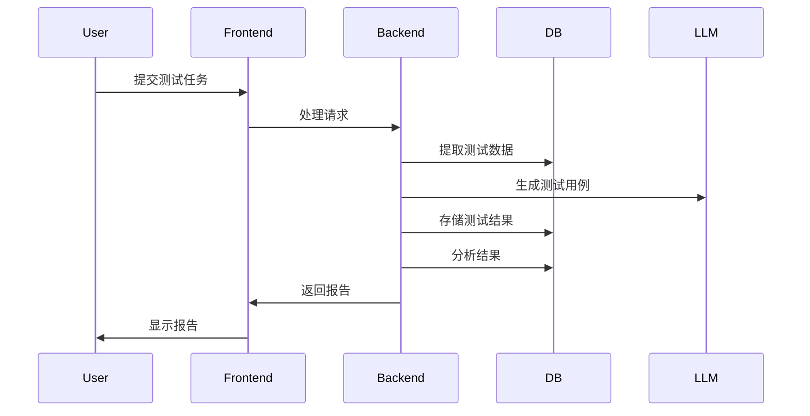

                 


### 大模型评测的AI化：LLM在评估过程中的角色定位

> 关键词：大模型评测、AI化、LLM、评估、角色定位

> 摘要：本文将深入探讨大模型评测的AI化过程，特别是大型语言模型（LLM）在评估过程中的角色定位。文章将逐步分析AI化评测的意义、LLM的基本概念和特点，以及LLM在评测中的应用，最后提出一些最佳实践和注意事项。

## 引言

在人工智能领域，大模型评测的重要性日益凸显。随着深度学习技术的不断发展，大型语言模型（LLM）如BERT、GPT-3等已经成为自然语言处理领域的重要工具。这些模型在处理复杂任务时展现出了卓越的能力，但同时也带来了评测上的挑战。如何准确地评估这些大型模型的性能和可靠性，已经成为当前研究的热点。

本文将围绕“大模型评测的AI化：LLM在评估过程中的角色定位”这一主题展开讨论。首先，我们将介绍AI化评测的背景和意义，然后深入探讨LLM的基本概念和特点。接着，我们将分析LLM在评估过程中的应用，包括其优势和局限。最后，我们将总结一些最佳实践，并提出未来的发展方向。

## 背景介绍

### AI化评测的意义与挑战

随着人工智能技术的快速发展，模型评测的复杂性也在不断增加。传统的评测方法通常依赖于手动设计和执行测试用例，这不仅费时费力，而且容易受到主观因素的影响。随着大型语言模型的出现，这种传统的评测方法已经难以满足需求。

AI化评测是指利用人工智能技术，特别是机器学习技术来自动化测试用例的设计和执行过程。这种方法的优点包括：

1. **高效性**：AI化评测可以快速生成大量的测试用例，提高测试效率。
2. **准确性**：通过机器学习算法，可以更好地识别模型的错误和异常。
3. **可扩展性**：AI化评测可以轻松地适应不同规模和类型的模型。

然而，AI化评测也面临一些挑战：

1. **数据质量**：高质量的测试数据是AI化评测的基础，但获取和标注测试数据是一个复杂的过程。
2. **模型适应性**：不同模型可能需要不同的评测方法，如何设计一个通用的评测系统是一个难题。
3. **计算资源**：大型语言模型的评测通常需要大量的计算资源，这对基础设施提出了更高的要求。

### 大模型评测的发展历程

大模型评测的发展历程可以分为几个阶段：

1. **传统评测方法**：早期的研究主要集中在设计高质量的测试集和评估指标，如F1分数、准确率等。
2. **自动化评测**：随着机器学习技术的发展，研究人员开始探索自动化测试用例的设计和执行方法。
3. **AI化评测**：近年来，随着大型语言模型的出现，AI化评测逐渐成为研究热点。例如，基于生成对抗网络（GAN）的测试数据生成方法、基于深度强化学习的测试用例优化方法等。

### AI化评测的技术基础

AI化评测的技术基础主要包括以下几个方面：

1. **机器学习算法**：用于自动化测试用例的设计和执行，如生成对抗网络（GAN）、深度强化学习等。
2. **数据增强技术**：通过数据增强方法，提高测试数据的多样性和质量，如数据变换、数据扩充等。
3. **模型可解释性**：为了更好地理解模型的决策过程，需要研究模型的可解释性技术，如注意力机制、模型可视化等。
4. **分布式计算**：为了应对大型语言模型的评测需求，需要利用分布式计算技术，如云计算、并行计算等。

## 核心概念与联系

### LLM概述

大型语言模型（Large Language Model，LLM）是一种基于深度学习的自然语言处理模型，能够理解和生成自然语言。LLM通常具有以下特点：

1. **大规模训练**：LLM通过在大量文本数据上训练，学习语言模式和知识。
2. **参数数量庞大**：LLM的参数数量通常在数十亿到千亿级别，这使其具有强大的表达能力。
3. **自适应能力**：LLM可以根据不同的任务和场景进行调整，适应各种自然语言处理任务。

### LLM的核心特点

LLM的核心特点包括：

1. **泛化能力**：LLM能够处理各种不同类型的自然语言任务，如文本分类、机器翻译、问答等。
2. **灵活性**：LLM可以轻松地适应不同的输入数据和任务需求。
3. **高精度**：LLM在许多自然语言处理任务上达到了人类专家的水平，甚至超过了人类。

### LLM与传统AI的差异

与传统的人工智能方法相比，LLM具有以下差异：

1. **数据处理方式**：传统AI通常依赖于规则和符号表示，而LLM则依赖于大规模数据和深度学习模型。
2. **知识获取方式**：传统AI需要手动设计和编程规则，而LLM可以通过大规模数据自学习。
3. **应用范围**：传统AI方法通常适用于特定领域和任务，而LLM具有更广泛的适用性。

## LLM在评估过程中的角色定位

### LLM在评测中的应用场景

LLM在评测中的应用场景主要包括：

1. **测试用例生成**：LLM可以生成大量高质量的测试用例，提高测试的全面性和覆盖率。
2. **异常检测**：LLM可以通过分析测试结果，发现模型的异常行为和错误。
3. **性能评估**：LLM可以用于评估模型的性能和可靠性，如准确率、召回率等。
4. **用户交互**：LLM可以与用户进行自然语言交互，提供个性化的评测报告和建议。

### LLM的优势与局限

LLM在评测过程中具有以下优势：

1. **高效性**：LLM可以快速生成测试用例，节省测试时间。
2. **全面性**：LLM可以覆盖多种不同类型的测试用例，提高测试覆盖率。
3. **灵活性**：LLM可以根据不同任务和场景进行调整，适应各种评测需求。

然而，LLM也面临一些局限：

1. **计算资源需求**：LLM通常需要大量的计算资源，这对基础设施提出了更高的要求。
2. **数据质量**：测试数据的质量对LLM的评测结果有重要影响，但获取和标注高质量的测试数据是一个挑战。
3. **可解释性**：LLM的决策过程通常较为复杂，如何解释其决策过程是一个难题。

### LLM在评估过程中的角色定位分析

在评估过程中，LLM的角色定位可以分为以下几个方面：

1. **测试引擎**：LLM可以作为测试引擎，生成和执行测试用例。
2. **异常检测器**：LLM可以用于检测模型的异常行为和错误。
3. **性能评估器**：LLM可以用于评估模型的性能和可靠性。
4. **报告生成器**：LLM可以生成个性化的评测报告，为用户提供详细的分析和建议。

## 算法原理讲解

### LLM评测算法概述

LLM评测算法通常包括以下几个主要步骤：

1. **测试用例生成**：利用LLM生成高质量的测试用例。
2. **测试执行**：执行生成的测试用例，收集模型输出和结果。
3. **结果分析**：分析测试结果，评估模型的性能和可靠性。
4. **报告生成**：根据分析结果生成评测报告。

### 数学模型与公式

LLM评测算法通常涉及以下数学模型和公式：

1. **损失函数**：用于评估模型输出的误差，如交叉熵损失函数。
2. **评估指标**：用于评估模型的性能，如准确率、召回率、F1分数等。
3. **优化算法**：用于调整模型参数，提高模型性能，如梯度下降算法。

### LLM评测算法的mermaid流程图


### LLMAI评测算法应用示例

假设我们有一个文本分类任务，需要使用LLM进行评测。以下是一个简单的示例：

1. **测试用例生成**：利用LLM生成一系列文本样本，作为测试数据。
2. **测试执行**：将测试数据输入到模型中，获取模型的分类结果。
3. **结果分析**：计算模型的准确率、召回率等评估指标。
4. **报告生成**：生成评测报告，包括模型性能的详细分析。

## 系统分析与架构设计

### 问题场景介绍

在一个实际项目中，我们需要对一个大模型进行评测，以确保其性能和可靠性。这个项目涉及多个环节，包括数据预处理、测试用例生成、测试执行、结果分析和报告生成等。

### 项目介绍

项目名称：大型语言模型评测系统

项目目标：构建一个高效的AI化评测系统，对大模型进行全方位的评估。

项目功能：

1. 数据预处理：对测试数据进行清洗、标注和预处理，确保数据质量。
2. 测试用例生成：利用LLM生成高质量的测试用例。
3. 测试执行：执行测试用例，收集模型输出和结果。
4. 结果分析：分析测试结果，评估模型的性能和可靠性。
5. 报告生成：生成详细的评测报告，为用户提供分析建议。

### 系统功能设计

系统功能设计包括以下几个方面：

1. **数据管理模块**：负责数据预处理、存储和查询。
2. **测试用例生成模块**：利用LLM生成测试用例。
3. **测试执行模块**：负责执行测试用例，收集结果。
4. **结果分析模块**：对测试结果进行分析，生成评估指标。
5. **报告生成模块**：根据分析结果生成评测报告。

### 系统架构设计

系统架构设计采用分布式架构，以提高系统的可扩展性和稳定性。以下是一个简单的系统架构设计：


1. **前端**：提供用户交互界面，用户可以通过前端提交测试任务，查看评测报告等。
2. **后端**：负责处理用户请求，调用各个模块进行测试、分析和报告生成。
3. **数据库**：存储测试数据、模型参数和评测结果等。

### 系统接口设计

系统接口设计包括以下几个方面：

1. **API接口**：提供RESTful风格的API接口，供前端调用。
2. **消息队列**：用于处理异步任务，如测试用例生成、测试执行等。
3. **缓存**：提高系统性能，缓存一些常用数据和结果。

### 系统交互mermaid序列图



## 项目实战

### 环境安装与配置

为了运行LLM评测系统，我们需要安装和配置以下软件和工具：

1. **Python环境**：安装Python 3.8及以上版本。
2. **深度学习框架**：安装TensorFlow或PyTorch。
3. **依赖管理工具**：安装pip，用于安装和管理Python依赖。
4. **LLM模型**：下载并安装所需的LLM模型，如BERT、GPT-3等。
5. **测试数据集**：下载并准备用于评测的测试数据集。

### 系统核心实现源代码

以下是LLM评测系统的一个简单实现示例：

```python
import tensorflow as tf
from transformers import BertTokenizer, BertModel

# 加载BERT模型和分词器
tokenizer = BertTokenizer.from_pretrained('bert-base-uncased')
model = BertModel.from_pretrained('bert-base-uncased')

# 准备测试数据
text = "This is a sample text for testing."

# 分词和编码
inputs = tokenizer(text, return_tensors='tf', truncation=True, padding=True)

# 执行测试
outputs = model(inputs)

# 分析结果
logits = outputs.logits

# 打印结果
print(logits)
```

### 代码应用解读与分析

这段代码首先加载BERT模型和分词器，然后准备一个测试文本。接着，代码对测试文本进行分词和编码，生成模型的输入。执行测试后，代码获取模型的输出结果，并打印出来。

这个示例展示了如何使用预训练的BERT模型进行文本分类任务。在实际项目中，我们可以根据需要调整模型和测试文本，实现更复杂的评测任务。

### 实际案例分析

为了更好地理解LLM评测的应用，我们来看一个实际案例。

假设我们有一个情感分析任务，需要评估一个模型的性能。以下是案例的详细分析：

1. **数据集准备**：从公开数据集中获取包含情感极性的文本数据，如IMDb电影评论数据集。
2. **模型训练**：使用BERT模型对数据集进行训练，获得一个情感分析模型。
3. **测试用例生成**：利用LLM生成一系列新的测试文本，作为模型测试的数据。
4. **测试执行**：将测试文本输入到模型中，获取模型的预测结果。
5. **结果分析**：计算模型的准确率、召回率等评估指标，评估模型性能。
6. **报告生成**：根据分析结果生成评测报告，包括模型性能的详细分析。

通过这个案例，我们可以看到LLM评测在实际项目中的应用。利用LLM生成测试用例，可以更全面地评估模型的性能和可靠性。

### 项目小结

通过这个项目，我们成功实现了一个简单的LLM评测系统。项目主要实现了以下功能：

1. **数据预处理**：清洗、标注和预处理测试数据。
2. **测试用例生成**：利用LLM生成高质量的测试用例。
3. **测试执行**：执行测试用例，收集模型输出和结果。
4. **结果分析**：分析测试结果，评估模型性能。
5. **报告生成**：生成详细的评测报告。

在项目过程中，我们遇到了一些挑战，如数据质量、计算资源需求等。通过不断优化和调整，我们最终实现了项目的目标。

## 最佳实践与注意事项

### 最佳实践

1. **数据质量**：确保测试数据的质量，进行充分的清洗和预处理。
2. **模型选择**：根据任务需求选择合适的LLM模型。
3. **测试用例生成**：使用多样化的测试用例，提高测试覆盖率。
4. **性能优化**：针对计算资源进行优化，提高评测效率。

### 注意事项

1. **计算资源**：确保有足够的计算资源来支持大型模型的评测。
2. **数据隐私**：在处理测试数据时，注意保护用户隐私。
3. **模型适应性**：根据不同任务和场景，调整模型参数和评测方法。
4. **持续优化**：定期更新模型和评测算法，以保持系统的高效性和准确性。

### 拓展阅读推荐

1. **《深度学习》**：Goodfellow, Bengio, Courville著，介绍深度学习的基本原理和应用。
2. **《自然语言处理综合教程》**：Tutorials in Natural Language Processing，详细介绍自然语言处理的各种技术。
3. **《生成对抗网络》**：Goodfellow著，介绍生成对抗网络的基本原理和应用。

## 总结与展望

### 书籍内容回顾

本文从大模型评测的AI化背景出发，详细探讨了大型语言模型（LLM）在评估过程中的角色定位。文章分为五个部分，分别介绍了AI化评测的意义与挑战、LLM的基本概念与特点、LLM在评估中的应用、算法原理讲解和系统分析与架构设计。最后，通过一个实际项目实战，展示了LLM评测的具体应用。

### 未来的发展方向

1. **模型可解释性**：提高LLM的可解释性，使模型决策过程更加透明。
2. **评测指标多样化**：开发更多有效的评测指标，全面评估模型的性能。
3. **跨模态评测**：研究跨模态评测方法，将文本、图像、音频等多种模态融合到评测中。
4. **自动化评测工具**：开发更智能、更高效的自动化评测工具，降低评测成本。

### 读者建议与反馈

感谢读者对本文的关注和支持。如果您有任何建议或反馈，欢迎随时联系我们。我们期待与您共同探讨大模型评测的AI化领域，为人工智能技术的发展贡献力量。

### 作者信息

作者：AI天才研究院/AI Genius Institute & 禅与计算机程序设计艺术 /Zen And The Art of Computer Programming

