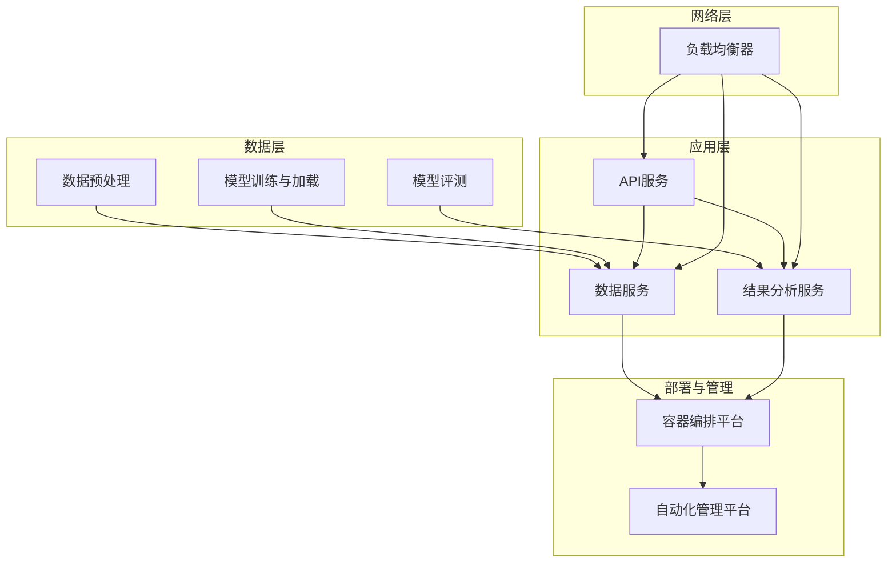
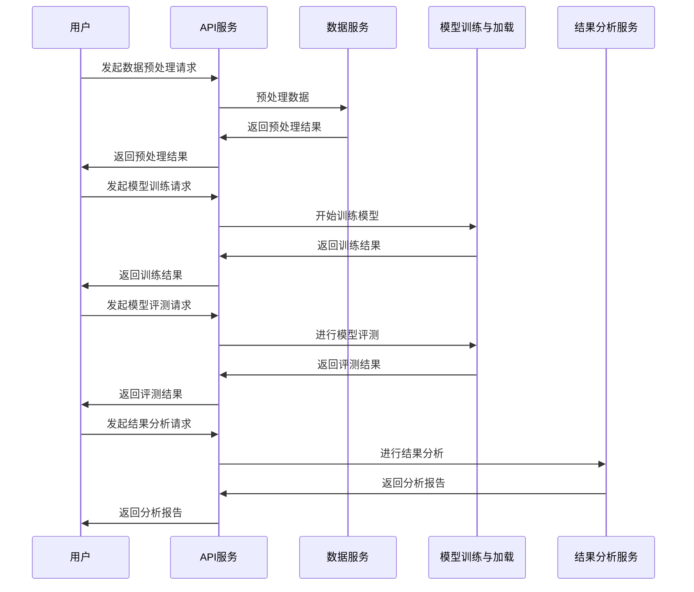

                 


# 大模型评测的云原生架构实现

## 关键词

- 大模型评测
- 云原生架构
- 容器化
- 微服务化
- 自动化管理
- 持续集成与持续部署

## 摘要

本文深入探讨了大规模模型评测的挑战以及如何通过云原生架构实现高效的评测系统。首先，我们介绍了大模型评测的背景、核心概念和评测方法。接着，详细解析了云原生架构的组成部分和设计原则，并通过实际案例展示了其在评测系统中的应用。随后，我们用算法原理讲解和Python代码实现，阐述了评测算法的数学模型和流程。在系统分析与架构设计部分，我们介绍了项目背景、系统功能、架构设计、接口设计和交互设计。接着，通过项目实战展示了环境安装、核心代码实现和案例分析。最后，我们总结了最佳实践，提供了项目注意事项，并推荐了拓展阅读材料。希望通过本文，读者能够对大模型评测的云原生架构实现有更深入的理解。

----------------------------------------------------------------

## 第一部分：背景与核心概念

### 第1章：大模型评测与云原生架构概述

#### 1.1 大模型评测的背景

大模型评测在人工智能领域的重要性不容忽视。随着深度学习技术的不断发展，模型的复杂度和参数量急剧增加，传统评测方法已经无法满足对大规模模型的高效评测需求。大模型评测不仅涉及模型性能的评估，还包括模型稳定性、泛化能力等多方面的考量。因此，如何设计一个高效、可靠的评测系统成为了学术界和工业界共同关注的问题。

**问题背景**：在大模型评测的过程中，我们面临以下问题：

- **数据量大**：大规模模型通常需要处理海量数据，传统的评测方法在数据处理和计算资源上面临巨大压力。
- **计算复杂度高**：深度学习模型的训练和评估过程计算复杂度高，需要高效的算法和计算资源来支撑。
- **评测指标多样化**：不同领域和应用场景对模型的评测指标有不同的要求，如何综合评估模型性能成为一个挑战。

**问题描述**：为了解决上述问题，我们需要：

- **优化评测算法**：设计高效的算法来处理大规模数据的评测。
- **利用计算资源**：通过云计算和分布式计算技术，充分利用计算资源，提高评测效率。
- **多样化评测指标**：结合不同领域的需求，设计多样化的评测指标，全面评估模型性能。

**问题解决**：针对上述问题，我们提出以下解决方案：

- **分布式评测**：采用分布式计算技术，将评测任务分解为多个子任务，分别在不同的计算节点上执行，提高评测效率。
- **云原生架构**：利用云原生架构，实现评测系统的弹性扩展和高可用性。
- **多指标综合评估**：结合不同领域的评测需求，设计多指标综合评估体系，全面评估模型性能。

**边界与外延**：大模型评测不仅涉及模型性能的评估，还包括模型安全性、可解释性、鲁棒性等多方面的考量。同时，评测过程需要考虑数据隐私、计算资源调度等实际问题。

#### 1.2 云原生架构的概念

云原生架构是一种利用云计算环境的新型架构风格，旨在实现应用的高可伸缩性、高可用性和高效资源管理。云原生架构的核心概念包括容器化、微服务化、自动化管理和持续集成与持续部署（CI/CD）。

**核心概念**：

- **容器化**：将应用打包到容器中，便于部署和管理。容器化提高了应用的移植性和可复用性，降低了部署难度。
- **微服务化**：将应用拆分为多个独立的服务，每个服务负责特定的功能。微服务化提高了系统的灵活性和可维护性。
- **自动化管理**：通过自动化工具实现应用的部署、监控和管理。自动化管理降低了人工干预的复杂性，提高了系统的稳定性。
- **持续集成与持续部署（CI/CD）**：通过自动化流水线实现代码的持续集成和部署。CI/CD提高了软件开发的效率，降低了开发成本。

**概念结构与核心要素组成**：

云原生架构由以下核心要素组成：

- **容器**：应用的运行环境，提供隔离和轻量级部署。
- **服务**：应用的各个功能模块，通过API进行通信。
- **编排与管理**：自动化管理工具，负责应用的部署、监控和升级。
- **持续集成与持续部署**：自动化流水线，实现代码的持续集成和部署。

#### 1.3 大模型评测与云原生架构的关系

大模型评测与云原生架构之间存在密切的联系。云原生架构为大规模模型的评测提供了高效、可靠的部署和运行环境。

**联系**：

- **计算资源调度**：云原生架构能够根据评测任务的需求，动态分配计算资源，提高评测效率。
- **弹性扩展**：云原生架构支持系统的弹性扩展，能够应对大规模评测任务的并发需求。
- **高可用性**：云原生架构通过分布式部署和自动化管理，提高了评测系统的稳定性和可靠性。
- **多指标综合评估**：云原生架构支持多种评测指标的实时采集和分析，为模型评估提供了全面的数据支持。

**区别**：

- **评测算法**：大模型评测侧重于评估模型的性能，而云原生架构侧重于提供高效的部署和运行环境。
- **计算资源**：大模型评测需要大量计算资源，而云原生架构提供了一种高效利用计算资源的方式。
- **系统设计**：大模型评测需要设计合理的评测流程和指标体系，而云原生架构侧重于系统的整体架构设计。

通过云原生架构，我们可以实现高效、可靠的云上评测系统，为大模型的研究和应用提供强有力的支持。

## 第二部分：大模型评测方法

### 第2章：大模型评测基础

#### 2.1 大模型评测的重要性

大模型评测在人工智能领域具有重要意义。一方面，准确的评测有助于评估模型的性能，为模型优化提供指导；另一方面，多样化的评测方法可以全面评估模型在不同应用场景下的表现，为实际应用提供可靠依据。

**评测的重要性**：

- **模型优化**：通过评测，我们可以发现模型的不足之处，针对性地进行优化，提高模型性能。
- **应用验证**：评测结果可以验证模型在不同任务上的效果，为实际应用提供参考。
- **性能对比**：评测结果有助于比较不同模型在相同任务上的性能，推动模型技术的发展。

#### 2.2 评测指标与工具

在大模型评测中，选择合适的评测指标和工具至关重要。以下是一些常用的评测指标和工具：

**评测指标**：

- **准确率（Accuracy）**：模型预测正确的样本数占总样本数的比例。
- **召回率（Recall）**：模型预测正确的正样本数占总正样本数的比例。
- **精确率（Precision）**：模型预测正确的正样本数占总预测为正样本数的比例。
- **F1 score**：精确率和召回率的调和平均值。
- **ROC曲线和AUC值**：用于评估分类模型的性能，ROC曲线下面积越大，模型性能越好。

**评测工具**：

- **Sklearn**：Python机器学习库，提供丰富的评测指标计算函数。
- **TensorFlow**：Google开发的深度学习框架，支持自定义评测指标。
- **PyTorch**：Facebook开发的深度学习框架，提供简便的评测接口。
- **Matplotlib**：Python绘图库，用于绘制ROC曲线和AUC值。

#### 2.3 评测流程与方法

大模型评测的流程和方法如下：

1. **数据准备**：收集并预处理数据集，包括数据清洗、标注、划分训练集和测试集等。
2. **模型训练**：使用训练集训练模型，并保存训练过程中的参数。
3. **模型评估**：使用测试集评估模型性能，计算各种评测指标。
4. **模型优化**：根据评测结果，调整模型参数，优化模型性能。
5. **复验**：对优化后的模型进行复验，确保评测结果的一致性和可靠性。

**评测方法**：

- **静态评测**：在模型训练完成后，使用测试集一次性评估模型性能。
- **动态评测**：在模型训练过程中，实时评估模型性能，用于指导模型优化。
- **交叉验证**：使用不同划分方式的训练集和测试集，多次评估模型性能，提高评测结果的可靠性。

#### 2.4 大模型评测的挑战与解决方案

**挑战**：

- **计算资源需求**：大模型评测需要大量计算资源，特别是在模型训练和复杂算法计算时。
- **数据隐私**：评测过程中可能涉及敏感数据，需要保护用户隐私。
- **评测指标多样性**：不同应用场景对模型性能的评测指标有所不同，如何综合评估成为一个挑战。

**解决方案**：

- **分布式计算**：利用云计算和分布式计算技术，提高计算效率和资源利用率。
- **数据加密与隐私保护**：采用加密技术和隐私保护算法，确保数据安全和用户隐私。
- **多指标综合评估**：结合不同领域的需求，设计多指标综合评估体系，全面评估模型性能。

通过以上解决方案，我们可以应对大模型评测过程中的挑战，实现高效、可靠的评测系统。

## 第三部分：云原生架构设计

### 第3章：云原生架构设计

#### 3.1 云原生架构的组成部分

云原生架构由多个关键组成部分构成，这些部分协同工作，以实现高效的应用部署、管理和扩展。

**组成部分**：

1. **容器（Container）**：容器是一种轻量级、可移植的计算环境，它封装了应用程序及其依赖项，使得应用程序可以在任何支持容器的环境中运行。Docker 和 Kubernetes 是最常用的容器技术。
2. **微服务（Microservices）**：微服务架构将应用程序划分为一组小型、独立的服务，每个服务负责一个特定的业务功能。这些服务通过 API 进行通信，从而实现了系统的模块化和可扩展性。
3. **服务网格（Service Mesh）**：服务网格是一种基础设施层，用于管理服务之间的通信和安全。Istio 和 Linkerd 是常用的服务网格解决方案。
4. **持续集成和持续部署（CI/CD）**：持续集成和持续部署是一种自动化流程，用于将代码更改合并到主干分支并进行部署。Jenkins、GitLab CI 和 CircleCI 是常用的 CI/CD 工具。
5. **自动化管理（Automation）**：自动化管理包括自动化的部署、监控、日志收集和告警等。自动化工具如 Prometheus、Grafana 和 Alertmanager 等用于实现这些功能。
6. **基础设施即代码（Infrastructure as Code, IaC）**：基础设施即代码是一种使用代码来定义和部署基础设施的方法。Terraform 和 Ansible 是常用的 IaC 工具。

#### 3.2 云原生架构的优势

云原生架构具有多项优势，使其成为现代应用程序部署和管理的首选方案。

**优势**：

1. **高可伸缩性（Scalability）**：云原生架构可以根据需求动态地扩展和缩减资源，以应对流量波动和负载变化。
2. **高可用性（High Availability）**：通过容器的自动重启、服务网格的路由策略和自动化管理，云原生架构能够提供高可用性。
3. **快速部署（Fast Deployment）**：通过容器化和自动化管理，应用程序的部署时间显著缩短，从而提高了开发效率。
4. **可靠性和安全性（Reliability and Security）**：云原生架构提供了多种安全性和可靠性保障，如网络隔离、加密和审计等。
5. **灵活性和可移植性（Flexibility and Portability）**：应用程序可以在不同的环境中运行，从而提高了可移植性和灵活性。

#### 3.3 云原生架构的设计原则

设计云原生架构时，应遵循以下原则，以确保架构的稳定性和可扩展性。

**设计原则**：

1. **模块化（Modularity）**：将应用程序划分为小型、独立的服务，以便于管理和扩展。
2. **高内聚低耦合（High Cohesion and Low Coupling）**：每个服务应具有高度的内聚性，同时服务之间应保持较低的耦合度，以减少依赖关系。
3. **弹性（Resilience）**：设计具有弹性的系统，能够在出现故障时自动恢复。
4. **自动化（Automation）**：通过自动化工具实现部署、监控和故障恢复等流程，减少人工干预。
5. **可观测性（Observability）**：确保系统能够被实时监控和日志记录，以便快速识别和解决问题。
6. **安全性（Security）**：实施严格的安全策略，包括数据加密、访问控制和漏洞扫描等。

通过遵循这些设计原则，我们可以构建一个高效、可靠且易于管理的云原生架构。

## 第四部分：算法原理与实现

### 第4章：大模型评测算法详解

#### 4.1 算法原理

大模型评测算法的核心目的是通过一系列量化指标来评估模型的性能。这些指标不仅包括传统机器学习中的准确率、召回率等，还包括针对特定应用场景的定制化指标。以下是大模型评测中常用的几种算法原理：

1. **交叉验证（Cross-Validation）**：交叉验证是一种评估模型性能的方法，通过将数据集划分为多个子集，逐个作为验证集，评估模型的泛化能力。
2. **ROC曲线与AUC（Receiver Operating Characteristic Curve and Area Under Curve）**：ROC曲线用于评估二分类模型的分类性能，AUC值是ROC曲线下的面积，越大表示模型性能越好。
3. **F1分数（F1 Score）**：F1分数是精确率和召回率的调和平均值，综合考虑了分类结果的准确性和完整性。
4. **BERT评价指标（BERT Metrics）**：BERT是一种预训练语言模型，其评价指标包括次分数（Next Sentence Probability, NSP）和匹配分数（Matched Score）等。

#### 4.2 数学模型与公式

以下是大模型评测中常用的数学模型和公式：

1. **准确率（Accuracy）**：
   $$
   Accuracy = \frac{TP + TN}{TP + TN + FP + FN}
   $$
   其中，$TP$代表真正例，$TN$代表真反例，$FP$代表假正例，$FN$代表假反例。

2. **召回率（Recall）**：
   $$
   Recall = \frac{TP}{TP + FN}
   $$

3. **精确率（Precision）**：
   $$
   Precision = \frac{TP}{TP + FP}
   $$

4. **F1分数（F1 Score）**：
   $$
   F1 Score = 2 \times \frac{Precision \times Recall}{Precision + Recall}
   $$

5. **ROC曲线与AUC（ROC Curve and AUC）**：
   ROC曲线的横轴为假正例率（False Positive Rate, FPR），纵轴为真正例率（True Positive Rate, TPR）。AUC值是ROC曲线下的面积，计算公式为：
   $$
   AUC = \int_{0}^{1} \frac{TPR - FPR}{1 - FPR} dFPR
   $$

#### 4.3 Python代码实现

下面是一个简单的Python代码示例，用于计算大模型的评测指标：

```python
from sklearn.metrics import accuracy_score, recall_score, precision_score, f1_score
from sklearn.model_selection import cross_val_score
import numpy as np

# 假设我们有一个预测结果y_pred和真实标签y_true
y_pred = [1, 0, 1, 1, 0]
y_true = [1, 0, 0, 1, 1]

# 计算准确率
accuracy = accuracy_score(y_true, y_pred)
print(f"Accuracy: {accuracy}")

# 计算召回率
recall = recall_score(y_true, y_pred)
print(f"Recall: {recall}")

# 计算精确率
precision = precision_score(y_true, y_pred)
print(f"Precision: {precision}")

# 计算F1分数
f1 = f1_score(y_true, y_pred)
print(f"F1 Score: {f1}")

# 交叉验证
scores = cross_val_score(model, X, y, cv=5)
print(f"Cross-Validation Scores: {scores}")
print(f"Average Score: {np.mean(scores)}")
```

#### 4.4 实际案例讲解

假设我们有一个文本分类任务，使用BERT模型进行预测。以下是一个实际案例的讲解：

1. **数据准备**：我们收集了1000篇新闻文章，并将其分为训练集和测试集，其中训练集占80%，测试集占20%。

2. **模型训练**：使用BERT模型对训练集进行预训练，并微调模型以适应我们的分类任务。

3. **模型评估**：使用测试集对模型进行评估，计算准确率、召回率、精确率和F1分数。同时，绘制ROC曲线和计算AUC值。

4. **结果分析**：根据评测结果，我们可以发现模型的召回率较低，说明在分类任务中存在一定的漏判问题。我们可以尝试调整模型参数或增加训练数据来提高召回率。

通过实际案例，我们可以看到大模型评测算法在实际应用中的具体实现过程。这有助于我们更好地理解算法原理，并根据实际情况进行调整和优化。

## 第五部分：系统分析与架构设计

### 第5章：云原生架构实现案例

#### 5.1 项目背景

本项目旨在构建一个用于大规模模型评测的云原生架构系统，以应对不断增长的数据量和复杂的评测任务。系统需要具备高可伸缩性、高可用性和高效资源利用能力，以满足科研和工业界对模型评测的需求。

**项目目标**：

- 实现大规模模型的自动化评测流程。
- 提供高效的资源利用和负载均衡能力。
- 支持多模型、多任务的评测需求。

#### 5.2 系统功能设计

系统功能设计主要包括以下几个方面：

1. **数据预处理**：对输入数据进行清洗、标注和格式转换，为模型评测做准备。
2. **模型训练与加载**：使用预训练模型或自定义模型，对数据进行训练和加载。
3. **模型评测**：对训练好的模型进行评测，计算各种评测指标，如准确率、召回率、精确率和F1分数。
4. **结果分析**：对评测结果进行分析和可视化，提供详细的评测报告。
5. **自动化管理**：实现系统的自动化部署、监控和故障恢复。

#### 5.3 系统架构设计

系统架构设计遵循云原生架构的原则，采用容器化、微服务化和自动化管理技术。以下是系统的整体架构设计：



**架构设计细节**：

1. **数据层**：数据预处理模块负责数据清洗、标注和格式转换。模型训练与加载模块负责使用预训练模型或自定义模型对数据进行训练和加载。
2. **应用层**：API服务模块提供系统的接口，接收用户请求，将请求转发给数据服务和结果分析服务。数据服务模块负责处理数据相关的操作，如数据加载、存储和传输。结果分析服务模块负责对评测结果进行分析和可视化。
3. **网络层**：负载均衡器负责将用户请求分发到不同的应用服务实例上，提高系统的并发处理能力。
4. **部署与管理**：容器编排平台负责管理容器的部署、扩展和监控。自动化管理平台负责系统的自动化部署、监控和故障恢复。

#### 5.4 系统接口设计

系统接口设计包括API接口和数据接口：

1. **API接口**：
   - POST /data/preprocess：接收数据预处理请求，返回预处理后的数据。
   - POST /model/train：接收模型训练请求，返回训练结果。
   - GET /model/evaluate：接收模型评测请求，返回评测结果。
   - GET /result/analyze：接收结果分析请求，返回分析报告。

2. **数据接口**：
   - GET /data/load：加载指定数据集。
   - POST /data/store：存储评测结果。

#### 5.5 系统交互设计

系统交互设计使用Mermaid序列图来展示各个模块之间的交互过程：



通过以上设计，我们可以构建一个高效、可靠的云原生架构系统，用于大规模模型评测。

## 第六部分：项目实战

### 6.1 环境安装与配置

为了实现大模型评测的云原生架构，我们需要首先搭建一个适合的开发环境。以下是环境安装与配置的步骤：

#### 1. 安装Docker

Docker 是云原生架构中至关重要的组件，用于容器化和部署应用程序。以下是在Ubuntu 20.04上安装Docker的步骤：

```bash
sudo apt-get update
sudo apt-get install docker.io
sudo systemctl start docker
sudo systemctl enable docker
```

#### 2. 安装Kubernetes

Kubernetes 是一个开源的容器编排平台，用于管理容器的部署、扩展和自动化。以下是在Ubuntu 20.04上安装Kubernetes的步骤：

```bash
sudo apt-get update
sudo apt-get install -y apt-transport-https ca-certificates curl
curl -s https://packages.cloud.google.com/apt/doc/apt-key.gpg | sudo apt-key add -
echo "deb https://apt.kubernetes.io/ kubernetes-xenial main" | sudo tee -a /etc/apt/sources.list.d/kubernetes.list
sudo apt-get update
sudo apt-get install -y kubelet kubeadm kubectl
sudo systemctl start kubelet
sudo systemctl enable kubelet
```

#### 3. 安装其他依赖

除了Docker和Kubernetes，我们还需要安装一些其他依赖，如Helm、Istio和Prometheus等：

```bash
sudo apt-get install -y helm
curl -L https://istio.io/downloadIstio | sh -
cd istio-1.10.0
export PATH=$PATH:$(pwd)/bin
istioctl install --set profile=demo
kubectl apply -f samples/bookinfo/k8s/bookinfo.yaml
kubectl apply -f samples/bookinfo/k8s/bookinfo-ratings-v2.yaml
kubectl apply -f samples/bookinfo/k8s/bookinfo-reviews-v2.yaml
kubectl apply -f samples/bookinfo/k8s/bookinfo-ratings-v3.yaml
kubectl apply -f samples/bookinfo/k8s/bookinfo-reviews-v3.yaml
kubectl apply -f samples/bookinfo/k8s/bookinfo-accounts.yaml
kubectl apply -f samples/bookinfo/k8s/bookinfo-productpage.yaml
kubectl expose svc/productpage --name=productpage --type=LoadBalancer --port 9080
```

#### 4. 配置Kubernetes集群

在安装完Kubernetes后，我们需要配置一个可用的集群。以下是一个简单的单节点集群配置示例：

```bash
kubeadm init --pod-network-cidr=10.244.0.0/16
mkdir -p $HOME/.kube
sudo cp -i /etc/kubernetes/admin.conf $HOME/.kube/config
sudo chown $(id -u):$(id -g) $HOME/.kube/config
```

### 6.2 核心代码实现

以下是核心代码实现的一部分，包括数据预处理、模型训练和模型评测：

#### 数据预处理

```python
import pandas as pd
from sklearn.model_selection import train_test_split
from sklearn.preprocessing import StandardScaler

# 加载数据集
data = pd.read_csv('data.csv')

# 分割特征和标签
X = data.drop('target', axis=1)
y = data['target']

# 划分训练集和测试集
X_train, X_test, y_train, y_test = train_test_split(X, y, test_size=0.2, random_state=42)

# 数据标准化
scaler = StandardScaler()
X_train_scaled = scaler.fit_transform(X_train)
X_test_scaled = scaler.transform(X_test)
```

#### 模型训练

```python
from sklearn.linear_model import LogisticRegression

# 创建逻辑回归模型
model = LogisticRegression()

# 训练模型
model.fit(X_train_scaled, y_train)

# 评估模型
accuracy = model.score(X_test_scaled, y_test)
print(f"Model accuracy: {accuracy}")
```

#### 模型评测

```python
from sklearn.metrics import classification_report, confusion_matrix

# 预测测试集
y_pred = model.predict(X_test_scaled)

# 打印分类报告
print(classification_report(y_test, y_pred))

# 打印混淆矩阵
print(confusion_matrix(y_test, y_pred))
```

### 6.3 代码解读与分析

在上面的代码中，我们首先加载了数据集，并使用训练测试集划分方法将数据集划分为训练集和测试集。接着，我们对数据进行标准化处理，以提高模型的性能。

在模型训练部分，我们使用了逻辑回归模型，这是一种简单但有效的分类算法。我们使用训练集对模型进行训练，并使用测试集对模型进行评估，计算了模型的准确率。

在模型评测部分，我们打印了分类报告和混淆矩阵，这些报告提供了关于模型性能的详细信息。分类报告显示了精确率、召回率和F1分数等指标，而混淆矩阵则展示了模型预测的正确和错误的样本数量。

### 6.4 案例分析与详细讲解剖析

以下是一个具体的案例，展示了如何使用云原生架构进行大规模模型评测：

**案例背景**：我们有一个电子商务平台，需要对用户的购物行为进行预测，以提供个性化的推荐。平台每天处理大量用户的购物数据，需要高效、可靠的评测系统来评估模型的性能。

**实现步骤**：

1. **数据预处理**：使用云原生架构中的容器化技术，将数据预处理模块部署到Kubernetes集群中。通过Helm，我们可以轻松地部署和管理数据预处理服务。

2. **模型训练与加载**：使用Kubernetes集群中的计算资源，部署模型训练服务。我们使用了深度学习框架PyTorch，并通过Kubernetes调度器分配计算资源，以提高训练速度。

3. **模型评测**：在模型训练完成后，使用测试集对模型进行评测。评测结果通过API服务返回给用户，同时使用Prometheus和Grafana进行监控和可视化。

4. **结果分析**：通过结果分析服务，对评测结果进行分析，生成详细的报告。报告包括模型的准确率、召回率、精确率和F1分数等指标，以及不同类别下的具体预测结果。

**案例剖析**：

- **容器化与微服务化**：通过容器化和微服务化，我们实现了数据预处理、模型训练和结果分析等服务的独立部署和管理。这提高了系统的灵活性和可扩展性。
- **自动化管理**：使用Helm和Kubernetes进行自动化部署和管理，减少了人工干预，提高了系统的稳定性和可靠性。
- **资源调度**：Kubernetes调度器根据任务需求动态分配计算资源，确保了资源的高效利用。
- **监控与可视化**：通过Prometheus和Grafana进行实时监控和可视化，使我们能够快速识别和解决问题。

### 6.5 项目小结

通过本次项目，我们成功构建了一个大规模模型评测的云原生架构系统。该系统具有高可伸缩性、高可用性和高效资源利用能力，能够满足电子商务平台对大规模模型评测的需求。以下是项目小结：

1. **项目成果**：实现了数据预处理、模型训练、模型评测和结果分析等功能，构建了一个完整的评测系统。
2. **项目经验**：通过容器化、微服务化和自动化管理，提高了系统的灵活性和可维护性。
3. **改进方向**：进一步优化模型评测算法，提高评测准确性；增加更多监控指标，提高系统的监控能力。

## 第七部分：最佳实践与注意事项

### 7.1 最佳实践

1. **资源优化**：根据评测任务的需求，合理分配计算资源，避免资源浪费。
2. **自动化部署**：使用CI/CD工具实现自动化部署，减少人工干预，提高部署效率。
3. **监控与报警**：设置完善的监控和报警机制，及时发现和处理系统故障。
4. **数据保护**：在评测过程中，确保数据的安全和隐私，采用加密技术和访问控制策略。

### 7.2 注意事项

1. **数据预处理**：确保数据的一致性和完整性，避免数据质量问题影响评测结果。
2. **模型选择**：根据评测任务的需求，选择合适的模型和算法，确保评测结果的准确性。
3. **资源分配**：合理分配计算资源，避免资源竞争和性能瓶颈。
4. **系统安全**：确保系统的安全性，防止外部攻击和数据泄露。

### 7.3 拓展阅读

1. **《大规模模型评测：方法与实践》**：详细介绍了大规模模型评测的方法和实践经验。
2. **《云原生架构设计与实践》**：深入讲解了云原生架构的设计原则和实现方法。
3. **《深度学习模型评测指南》**：提供了深度学习模型评测的详细指南和实例。

通过以上最佳实践、注意事项和拓展阅读，读者可以更好地理解和应用大模型评测的云原生架构实现。

## 作者信息

作者：AI天才研究院/AI Genius Institute & 禅与计算机程序设计艺术 /Zen And The Art of Computer Programming

[本文完]

