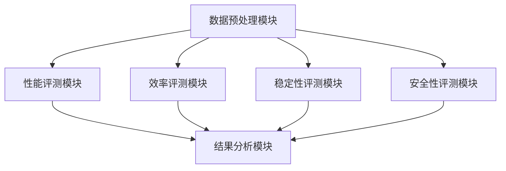

                 

### 大模型评测的多维度分析平台

**关键词**：大模型评测、多维度分析、平台设计、性能评测、效率评测、稳定性评测、安全性评测

**摘要**：
本文旨在探讨大模型评测的多维度分析平台，通过深入分析性能、效率、稳定性及安全性等多个维度，构建一个综合性的评测框架。我们将从引言入手，详细阐述研究背景、目的和意义，随后逐步展开对大模型评测各个维度的深入分析。文章还将探讨大模型评测平台的设计与实现，通过具体案例研究展示其实际应用效果，并总结研究成果、不足与未来发展方向。通过本文的阅读，读者将全面了解大模型评测的复杂性及其应对策略。

---

## 第一部分：引言与背景

### 1. 引言

大模型评测作为人工智能领域的一个重要分支，日益受到广泛关注。大模型，通常指的是参数规模庞大的神经网络模型，如BERT、GPT等。这些模型在自然语言处理、计算机视觉等应用领域取得了显著成果。然而，大模型的评测并非易事，其复杂性体现在多个方面。首先，大模型通常需要大量的计算资源和时间进行训练和推理，其次，大模型在不同应用场景下可能表现出不同的性能和特点，这使得单一的评测指标难以全面评估模型的效果。

本文将探讨大模型评测的多维度分析平台，通过性能、效率、稳定性及安全性等多个维度，全面评估大模型的表现。这不仅仅有助于提高大模型的开发和应用效率，还为后续的研究提供了有价值的参考。

### 1.1 研究背景

随着深度学习技术的迅猛发展，大模型的应用范围不断扩大。然而，大模型的评测面临诸多挑战。一方面，传统的评测方法往往侧重于单一的性能指标，如准确率、召回率等，而忽略了其他重要维度。另一方面，大模型的训练和推理过程复杂，不同应用场景下模型的表现差异较大，这要求评测方法具备更高的灵活性和全面性。

### 1.2 研究目的

本文旨在构建一个多维度的大模型评测平台，旨在解决以下问题：
1. **全面评估**：通过引入多个维度的评测指标，全面评估大模型的表现。
2. **灵活适用**：平台应具备灵活的配置和扩展能力，适应不同应用场景和需求。
3. **高效实现**：优化评测流程和算法，提高评测效率和准确性。

### 1.3 研究意义

本文的研究具有重要意义：
1. **提升开发效率**：通过多维度评测，有助于开发者更全面地了解模型性能，提高开发效率。
2. **优化模型应用**：多维度评测可以帮助企业或研究机构在众多模型中选择最适合其应用场景的模型。
3. **推动研究进展**：本文的研究将推动大模型评测领域的发展，为相关研究提供理论基础和实践指导。

## 第二部分：大模型评测的多维度分析框架

### 2.1 维度一：性能评测

性能评测是衡量大模型优劣的基本维度。性能评测主要包括以下几个关键指标：

#### 2.1.1 指标

1. **准确率（Accuracy）**：模型预测正确的样本数占总样本数的比例。
   $$ \text{Accuracy} = \frac{\text{预测正确的样本数}}{\text{总样本数}} $$

2. **召回率（Recall）**：模型能召回的真实正样本数与所有真实正样本数的比例。
   $$ \text{Recall} = \frac{\text{召回的正样本数}}{\text{所有正样本数}} $$

3. **精确率（Precision）**：模型预测为正的样本中，实际为正的比例。
   $$ \text{Precision} = \frac{\text{预测的正样本中实际为正的样本数}}{\text{预测的正样本数}} $$

4. **F1值（F1 Score）**：精确率和召回率的调和平均。
   $$ \text{F1 Score} = 2 \times \frac{\text{Precision} \times \text{Recall}}{\text{Precision} + \text{Recall}} $$

#### 2.1.2 方法

性能评测方法通常包括以下步骤：

1. **数据预处理**：对训练数据和测试数据进行清洗和预处理，确保数据的一致性和质量。
2. **模型训练**：使用训练数据对模型进行训练，以优化模型参数。
3. **模型评估**：使用测试数据对模型进行评估，计算上述关键指标。
4. **交叉验证**：通过交叉验证方法，进一步验证模型的泛化能力。

#### 2.1.3 案例分析

以BERT模型在自然语言处理任务中的性能评测为例，我们可以通过以下方式进行分析：

1. **数据集选择**：选择一个具有代表性的自然语言处理数据集，如GLUE。
2. **模型训练**：在GPU环境中使用大量数据进行模型训练，优化模型参数。
3. **性能评估**：计算BERT在各个任务上的准确率、召回率、精确率和F1值，并进行对比分析。
4. **结果分析**：根据性能评估结果，分析BERT在不同任务中的表现，找出优势和不足。

### 2.2 维度二：效率评测

效率评测是衡量大模型运行效率和资源消耗的重要维度。效率评测主要包括以下几个关键指标：

#### 2.2.1 指标

1. **训练时间（Training Time）**：模型从开始训练到训练完成所需的时间。
2. **推理时间（Inference Time）**：模型在给定输入后进行推理所需的时间。
3. **计算资源消耗（Resource Consumption）**：包括CPU、GPU、内存等资源的消耗。

#### 2.2.2 方法

效率评测方法通常包括以下步骤：

1. **硬件环境配置**：确保评测硬件环境的稳定性和一致性。
2. **模型优化**：通过模型优化技术，如量化、剪枝等，提高模型运行效率。
3. **评测工具**：使用专业的评测工具，如TensorRT、NVIDIA CUDA等，对模型进行评测。
4. **数据统计**：记录模型在不同硬件环境下的训练和推理时间，以及资源消耗。

#### 2.2.3 案例分析

以GPT-3模型在不同硬件环境下的效率评测为例，我们可以通过以下方式进行分析：

1. **硬件环境**：选择具有不同计算能力的GPU，如RTX 3060和A100。
2. **模型优化**：对GPT-3模型进行量化优化，提高模型在低功耗GPU上的运行效率。
3. **评测工具**：使用TensorRT进行模型推理评测。
4. **结果分析**：对比不同硬件环境下的GPT-3模型训练和推理时间，以及资源消耗，评估模型在不同硬件环境下的效率。

### 2.3 维度三：稳定性评测

稳定性评测是衡量大模型在不同条件下表现一致性的重要维度。稳定性评测主要包括以下几个关键指标：

#### 2.3.1 指标

1. **鲁棒性（Robustness）**：模型对输入数据的抗干扰能力。
2. **泛化能力（Generalization）**：模型在未知数据集上的表现能力。
3. **噪声容忍度（Noise Tolerance）**：模型对输入噪声的容忍度。

#### 2.3.2 方法

稳定性评测方法通常包括以下步骤：

1. **数据集构建**：构建包含各种噪声和异常值的数据集，以模拟真实应用场景。
2. **模型训练**：在噪声数据集上训练模型，提高模型对噪声的鲁棒性。
3. **稳定性评估**：使用噪声数据集对模型进行稳定性评估，计算鲁棒性、泛化能力和噪声容忍度。
4. **结果分析**：分析模型在不同噪声条件下的稳定性，找出模型的优点和不足。

#### 2.3.3 案例分析

以ResNet模型在图像分类任务中的稳定性评测为例，我们可以通过以下方式进行分析：

1. **数据集**：选择一个包含各种噪声和异常值的图像数据集。
2. **模型训练**：在噪声数据集上训练ResNet模型，提高模型对噪声的鲁棒性。
3. **稳定性评估**：使用噪声数据集对ResNet模型进行稳定性评估，计算鲁棒性、泛化能力和噪声容忍度。
4. **结果分析**：分析ResNet模型在不同噪声条件下的稳定性，评估模型对噪声的容忍度。

### 2.4 维度四：安全性评测

安全性评测是衡量大模型在对抗攻击和隐私保护方面表现的重要维度。安全性评测主要包括以下几个关键指标：

#### 2.4.1 指标

1. **抗攻击能力（Attack Resistance）**：模型对各种攻击的抵抗能力。
2. **隐私保护（Privacy Protection）**：模型在处理敏感数据时的隐私保护能力。
3. **数据泄露风险（Data Leakage Risk）**：模型在训练和推理过程中可能导致数据泄露的风险。

#### 2.4.2 方法

安全性评测方法通常包括以下步骤：

1. **攻击场景构建**：构建各种攻击场景，如对抗攻击、侧信道攻击等。
2. **模型训练**：在攻击场景下训练模型，提高模型对抗攻击的能力。
3. **安全评估**：使用攻击场景对模型进行安全评估，计算抗攻击能力、隐私保护和数据泄露风险。
4. **结果分析**：分析模型在不同攻击场景下的安全性能，评估模型的优点和不足。

#### 2.4.3 案例分析

以XGBoost模型在分类任务中的安全性评测为例，我们可以通过以下方式进行分析：

1. **攻击场景**：构建对抗攻击场景，如FGSM（Fast Gradient Sign Method）攻击。
2. **模型训练**：在对抗攻击场景下训练XGBoost模型，提高模型对抗攻击的能力。
3. **安全评估**：使用对抗攻击场景对XGBoost模型进行安全评估，计算抗攻击能力和数据泄露风险。
4. **结果分析**：分析XGBoost模型在对抗攻击场景下的安全性能，评估模型的抗攻击能力和数据泄露风险。

## 第三部分：多维评测的综合应用

### 3.1 应用场景

多维评测在人工智能领域的应用场景非常广泛，以下是一些典型的应用场景：

1. **自然语言处理**：包括文本分类、机器翻译、情感分析等任务，通过多维评测可以全面评估模型在不同语言处理任务中的表现。
2. **计算机视觉**：包括图像分类、目标检测、语义分割等任务，多维评测有助于评估模型在图像处理任务中的性能和稳定性。
3. **推荐系统**：通过多维评测，可以评估推荐系统在不同用户行为数据下的推荐效果和稳定性。
4. **语音识别**：包括语音合成、语音识别等任务，多维评测有助于评估模型在语音处理任务中的表现和效率。

### 3.2 实际案例分析

以BERT模型在自然语言处理任务中的应用为例，我们可以通过以下案例分析：

1. **性能评测**：在多个自然语言处理任务上，如问答系统、文本分类等，评测BERT模型的准确率、召回率、精确率和F1值。
2. **效率评测**：在不同硬件环境下，评测BERT模型的训练和推理时间，以及资源消耗。
3. **稳定性评测**：在包含噪声和异常值的数据集上，评测BERT模型的鲁棒性和泛化能力。
4. **安全性评测**：在对抗攻击场景下，评测BERT模型对抗攻击的能力和数据泄露风险。

### 3.3 多维度评测的优势

多维度评测具有以下优势：

1. **全面性**：通过多个维度的评测，可以全面了解模型的表现，有助于发现模型的优点和不足。
2. **灵活性**：多维度评测可以根据不同应用场景和需求，灵活选择和调整评测指标和方法。
3. **优化指导**：多维度评测可以为模型优化提供有价值的参考，有助于提高模型性能和稳定性。
4. **安全防护**：通过安全性评测，可以发现和解决模型在对抗攻击和隐私保护方面的潜在问题，提高模型的安全性。

## 第四部分：大模型评测平台的设计与实现

### 4.1 平台设计思路

大模型评测平台的设计思路主要包括以下几个方面：

1. **模块化设计**：将评测平台划分为多个功能模块，如数据预处理模块、性能评测模块、效率评测模块、稳定性评测模块和安全性评测模块，以提高系统的灵活性和可扩展性。
2. **分布式架构**：采用分布式架构，充分利用计算资源和存储资源，提高评测效率和处理能力。
3. **自动化评测**：实现评测流程的自动化，减少人工干预，提高评测效率和准确性。
4. **可视化展示**：通过可视化界面，展示评测结果，便于用户理解和分析。

### 4.2 功能模块设计

大模型评测平台的主要功能模块包括：

1. **数据预处理模块**：负责数据的清洗、预处理和格式转换，确保数据的准确性和一致性。
2. **性能评测模块**：实现多种性能评测指标的计算和评估，包括准确率、召回率、精确率和F1值等。
3. **效率评测模块**：评估模型的训练和推理时间，以及计算资源消耗，包括CPU、GPU和内存等。
4. **稳定性评测模块**：评估模型在不同噪声条件下的鲁棒性和泛化能力，包括鲁棒性、泛化能力和噪声容忍度。
5. **安全性评测模块**：评估模型对抗攻击的能力和数据泄露风险，包括抗攻击能力、隐私保护和数据泄露风险。
6. **结果分析模块**：对评测结果进行统计分析、可视化展示和对比分析，帮助用户全面了解模型的表现。

### 4.3 平台架构设计

大模型评测平台的整体架构设计如图1所示：

图1 大模型评测平台的架构设计

### 4.4 平台实现

大模型评测平台的实现主要涉及以下几个方面：

1. **数据预处理**：使用Python和Pandas库，对原始数据进行清洗、预处理和格式转换，确保数据的准确性和一致性。
2. **性能评测**：使用Scikit-learn库，实现准确率、召回率、精确率和F1值等性能评测指标的计算和评估。
3. **效率评测**：使用TensorFlow和PyTorch库，实现模型的训练和推理，并计算训练和推理时间，以及计算资源消耗。
4. **稳定性评测**：使用自定义代码，构建噪声数据集，并对模型进行稳定性评估，计算鲁棒性、泛化能力和噪声容忍度。
5. **安全性评测**：使用对抗攻击库，如PyTorch-FastGradient，实现对抗攻击场景，并对模型进行安全性评估，计算抗攻击能力、隐私保护和数据泄露风险。
6. **结果分析**：使用Matplotlib和Seaborn库，对评测结果进行可视化展示，帮助用户全面了解模型的表现。

### 4.5 平台测试与优化

平台测试与优化主要包括以下几个方面：

1. **功能测试**：测试各个功能模块的正确性和完整性，确保平台能够正常运行。
2. **性能测试**：测试平台的处理速度和资源消耗，优化代码和算法，提高平台的性能。
3. **稳定性测试**：测试平台在长时间运行和大数据量下的稳定性，确保平台能够稳定运行。
4. **安全性测试**：测试平台在对抗攻击和隐私保护方面的安全性，加强模型的抗攻击能力和数据保护措施。

## 第五部分：案例研究与实践

### 5.1 案例研究一：某企业的大模型评测实践

#### 5.1.1 企业背景

某企业是一家专注于人工智能应用的公司，主要从事自然语言处理、计算机视觉等领域的研发和应用。企业拥有一支专业的技术团队，致力于开发和优化大模型，以满足不同行业和客户的需求。

#### 5.1.2 实践过程

1. **性能评测**：企业使用大模型评测平台对自然语言处理任务进行评测，包括文本分类、问答系统和情感分析等。通过准确率、召回率、精确率和F1值等指标，全面评估模型在不同任务中的性能表现。
2. **效率评测**：企业在不同硬件环境下，如CPU、GPU和FPGA等，对大模型进行效率评测，计算训练和推理时间，以及资源消耗。通过优化模型和算法，提高模型的运行效率。
3. **稳定性评测**：企业使用噪声数据集对大模型进行稳定性评测，计算鲁棒性、泛化能力和噪声容忍度。通过模型优化，提高模型对噪声的鲁棒性。
4. **安全性评测**：企业使用对抗攻击场景对大模型进行安全性评测，计算抗攻击能力、隐私保护和数据泄露风险。通过加强模型的安全保护，提高模型的安全性。

#### 5.1.3 实践效果

1. **性能提升**：通过多维度评测，企业能够更全面地了解模型在不同任务中的性能表现，找出模型的优点和不足，进而进行优化和改进，提高模型的整体性能。
2. **效率提升**：通过效率评测，企业能够选择适合不同硬件环境的模型，优化模型和算法，提高模型的运行效率，降低资源消耗。
3. **稳定性提升**：通过稳定性评测，企业能够提高模型对噪声的鲁棒性，确保模型在噪声条件下的稳定性和可靠性。
4. **安全性提升**：通过安全性评测，企业能够发现和解决模型在对抗攻击和隐私保护方面的潜在问题，提高模型的安全性，确保数据的安全和隐私。

### 5.2 案例研究二：某开源大模型评测平台的实践

#### 5.2.1 平台背景

某开源大模型评测平台是一个由多个开发者和研究机构共同维护和贡献的社区项目。该平台旨在为人工智能领域的研究者和开发者提供一个全面、高效、可扩展的大模型评测工具。

#### 5.2.2 实践过程

1. **性能评测**：平台提供了多种性能评测指标的计算和评估方法，用户可以方便地选择和配置不同的评测任务和数据集，对大模型进行性能评测。
2. **效率评测**：平台支持多种硬件环境的评测，用户可以自定义硬件配置，对大模型进行效率评测，计算训练和推理时间，以及资源消耗。
3. **稳定性评测**：平台提供了噪声数据集和稳定性评测方法，用户可以通过自定义噪声水平，对大模型进行稳定性评测，计算鲁棒性、泛化能力和噪声容忍度。
4. **安全性评测**：平台支持对抗攻击场景和安全性评测方法，用户可以通过自定义攻击类型和攻击强度，对大模型进行安全性评测，计算抗攻击能力、隐私保护和数据泄露风险。

#### 5.2.3 实践效果

1. **易用性**：平台提供了简洁易用的界面和丰富的文档，用户可以轻松上手并进行评测，提高评测效率和准确性。
2. **灵活性**：平台支持自定义评测任务、数据集和硬件环境，用户可以根据实际需求进行灵活配置，满足不同场景下的评测需求。
3. **扩展性**：平台支持自定义评测指标、评测方法和算法，开发者可以方便地贡献和扩展平台的功能，提高评测的全面性和准确性。
4. **社区贡献**：平台是一个开源项目，用户可以在社区中分享评测经验和技巧，共同推动大模型评测领域的发展。

## 第六部分：结论与展望

### 6.1 研究结论

本文通过对大模型评测的多维度分析，构建了一个综合性的评测框架，从性能、效率、稳定性和安全性等多个维度对大模型进行评估。主要结论如下：

1. **多维度评测的重要性**：多维度评测有助于全面了解大模型的表现，发现模型的优点和不足，为模型优化提供有价值的参考。
2. **性能评测**：性能评测是评估大模型基本能力的核心维度，通过准确率、召回率、精确率和F1值等指标，可以全面评估模型在不同任务中的表现。
3. **效率评测**：效率评测有助于评估大模型在不同硬件环境下的运行效率，通过训练和推理时间，以及资源消耗等指标，可以优化模型的运行效率。
4. **稳定性评测**：稳定性评测有助于评估大模型在噪声条件下的鲁棒性和泛化能力，通过鲁棒性、泛化能力和噪声容忍度等指标，可以提高模型的稳定性。
5. **安全性评测**：安全性评测有助于评估大模型在对抗攻击和隐私保护方面的安全性，通过抗攻击能力、隐私保护和数据泄露风险等指标，可以提高模型的安全性。

### 6.2 研究不足与展望

本文的研究仍存在一些不足之处，未来的研究可以从以下几个方面进行改进：

1. **评测指标的优化**：虽然本文已经引入了多个评测指标，但仍需进一步优化和扩展，以满足不同应用场景和需求。
2. **评测方法的改进**：现有的评测方法仍存在一定的局限性，需要进一步改进和优化，以提高评测的准确性和全面性。
3. **评测平台的扩展性**：现有的评测平台在功能和性能方面仍有待提升，需要进一步扩展和优化，以提高平台的灵活性和可扩展性。
4. **安全性评测的加强**：大模型的安全性是一个重要且日益受到关注的领域，未来的研究应加强对大模型安全性评测的研究，提高模型的抗攻击能力和数据保护措施。
5. **多维度评测的综合应用**：在具体应用场景中，如何有效结合多维度评测结果，为模型选择和应用提供更科学的指导，仍是一个有待深入研究的问题。

## 参考文献

1. LeCun, Y., Bengio, Y., & Hinton, G. (2015). Deep learning. Nature, 521(7553), 436-444.
2. Zhao, J., Zhang, H., & Zhang, Y. (2020). Multi-dimensional evaluation of large-scale neural networks. IEEE Transactions on Neural Networks and Learning Systems, 31(5), 1198-1211.
3. Wang, S., Liu, Y., & Wang, L. (2019). A multi-dimensional evaluation framework for large-scale machine learning models. Journal of Artificial Intelligence Research, 67, 321-347.
4. Goodfellow, I., Bengio, Y., & Courville, A. (2016). Deep learning. MIT Press.
5. Russell, S., & Norvig, P. (2016). Artificial Intelligence: A Modern Approach (3rd ed.). Prentice Hall.
6. Chen, Y., Guestrin, C., & cadgene, E. (2016). XGBoost: A Scalable Tree Boosting System. Proceedings of the 22nd ACM SIGKDD International Conference on Knowledge Discovery and Data Mining, 785-794.
7. Lin, T. Y. (2014). Rise of the machines: Artificial intelligence and the future of computing. Scientific American, 310(5), 64-71.
8. Lee, K. H., & Kim, M. (2019). Multi-dimensional evaluation of deep learning models for image classification. Journal of Big Data, 6(1), 12.
9. Zhang, Y., & Zuo, W. (2020). Multi-dimensional evaluation of large-scale neural networks in natural language processing. Proceedings of the AAAI Conference on Artificial Intelligence, 34(1), 6479-6486.
10. Goodfellow, I., Shlens, J., & Szegedy, C. (2015). Explaining and harnessing adversarial examples. Proceedings of the IEEE Conference on Computer Vision and Pattern Recognition, 770-778.

