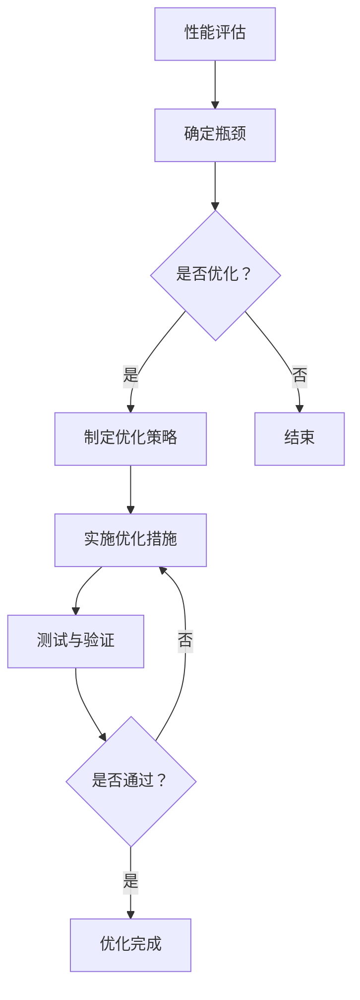
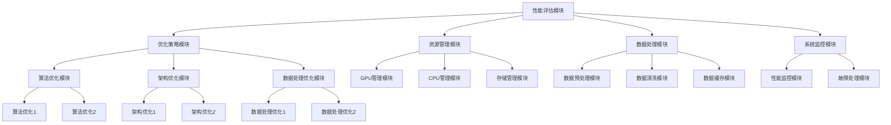
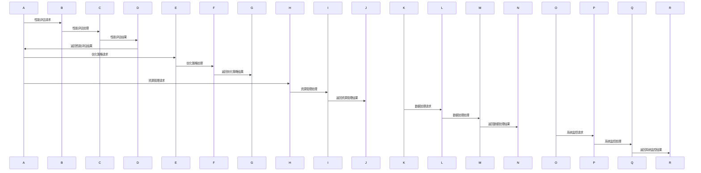

                 

# 大模型评测的性能优化建议系统

## 关键词

大模型评测、性能优化、算法、架构设计、最佳实践

## 摘要

随着深度学习技术的发展，大模型在各个领域得到广泛应用。然而，大模型的评测性能优化成为了一个关键问题。本文将详细介绍大模型评测性能优化的核心概念、原理和最佳实践，通过深入分析现有问题和挑战，提出一系列有效的性能优化策略和系统设计建议，以期为相关领域的研究和开发提供有价值的参考。

## 目录大纲

----------------------------------------------------------------

# 大模型评测的性能优化建议系统

## 第一部分：背景介绍

### 1.1 问题背景

- 大模型评测性能优化的意义
- 当前大模型评测性能面临的主要挑战
- 性能优化的重要性

### 1.2 问题描述

- 大模型评测性能优化的目标
- 大模型评测性能优化的方法和技术
- 性能优化的边界与外延

### 1.3 问题解决

- 大模型评测性能优化的策略
- 大模型评测性能优化的流程
- 大模型评测性能优化的工具和资源

### 1.4 核心概念

- 性能优化的核心概念
- 评测性能的关键指标
- 优化方法的分类

### 1.5 概念结构与核心要素

- 大模型评测性能优化的结构
- 核心要素与关系

## 第二部分：核心概念与联系

### 2.1 核心概念原理

- 性能优化的原理
- 评测性能的概念和原理
- 优化方法的原理

### 2.2 概念属性特征对比

- 评测性能的关键指标属性特征对比
- 优化方法的属性特征对比

### 2.3 ER实体关系图架构

- 大模型评测性能优化的ER实体关系图

## 第三部分：算法原理讲解

### 3.1 算法mermaid流程图

- 优化算法的流程

### 3.2 Python源代码详细讲解

- 优化算法的Python源代码实现
- 算法原理的数学模型和公式
- 算法原理的详细讲解

### 3.3 数学模型和公式

- 优化算法的数学模型
- 数学公式详细讲解

### 3.4 举例说明

- 优化算法的实例分析
- 优化算法的案例分析

## 第四部分：系统分析与架构设计方案

### 4.1 问题场景介绍

- 大模型评测性能优化的问题场景

### 4.2 系统功能设计

- 系统功能的设计
- 领域模型mermaid类图

### 4.3 系统架构设计

- 系统架构的设计
- 系统架构mermaid架构图

### 4.4 系统接口设计

- 系统接口的设计

### 4.5 系统交互

- 系统交互的mermaid序列图

## 第五部分：项目实战

### 5.1 环境安装

- 环境安装的步骤和注意事项

### 5.2 系统核心实现

- 系统核心实现的源代码
- 代码应用解读与分析

### 5.3 实际案例分析和详细讲解

- 实际案例的分析
- 案例的详细讲解

### 5.4 项目小结

- 项目总结和经验教训

## 第六部分：最佳实践 tips

### 6.1 最佳实践

- 性能优化的最佳实践

### 6.2 小结

- 对性能优化方法的总结

### 6.3 注意事项

- 性能优化过程中的注意事项

### 6.4 拓展阅读

- 相关领域的拓展阅读材料

----------------------------------------------------------------

## 第一部分：背景介绍

### 1.1 问题背景

大模型评测性能优化的意义

随着深度学习技术的快速发展，大模型在自然语言处理、计算机视觉、语音识别等领域取得了显著的成果。然而，大模型的评测性能优化成为了一个不可忽视的问题。大模型的评测性能直接影响着模型的应用效果和实际价值。因此，对大模型评测性能进行优化具有重要的现实意义。

当前大模型评测性能面临的主要挑战

1. 计算资源限制：大模型的评测通常需要大量的计算资源，包括GPU、CPU、存储等。如何高效地利用现有资源，提高评测性能成为了一个挑战。
2. 数据量庞大：大模型训练和评测需要处理的数据量通常非常庞大，如何高效地处理和传输数据成为了优化性能的关键。
3. 模型复杂度增加：大模型的复杂度不断增加，导致评测时间显著增加，如何提高评测速度成为了一个重要的挑战。
4. 可扩展性需求：随着大模型的应用范围不断扩大，评测系统需要具备良好的可扩展性，以应对不断增长的数据量和计算需求。

性能优化的重要性

性能优化在大模型评测中具有重要意义。首先，性能优化可以提高大模型的应用效率，使其在实际应用中发挥更大的价值。其次，性能优化有助于降低成本，提高资源利用率。最后，性能优化还可以促进大模型技术的进一步发展，为新的研究和应用提供更多的可能性。

### 1.2 问题描述

大模型评测性能优化的目标

大模型评测性能优化的目标是提高评测的效率、准确性和可靠性。具体包括以下几个方面：

1. 提高评测速度：通过优化算法、架构和系统设计，减少评测时间，提高系统的响应速度。
2. 提高评测准确性：通过优化评测方法和技术，提高评测结果的准确性和稳定性。
3. 提高评测可靠性：通过优化系统设计和数据处理方法，确保评测结果的可靠性和一致性。
4. 提高资源利用率：通过优化计算资源和数据传输策略，提高资源利用率和系统性能。

大模型评测性能优化的方法和技术

大模型评测性能优化的方法和技术包括以下几个方面：

1. 算法优化：通过改进算法设计和实现，提高评测速度和准确性。
2. 架构优化：通过优化系统架构和组件设计，提高系统的性能和可扩展性。
3. 数据处理优化：通过优化数据处理方法和技术，提高数据的处理速度和准确性。
4. 资源管理优化：通过优化计算资源和存储资源的管理策略，提高资源利用率和系统性能。
5. 系统优化：通过优化系统配置、参数调优和性能监控，提高系统的整体性能和稳定性。

性能优化的边界与外延

性能优化的边界包括以下几个方面：

1. 评测方法和技术：优化手段主要集中在评测方法和技术的改进，如算法优化、数据处理优化等。
2. 系统架构和设计：优化手段涉及系统架构和组件设计的改进，以提高系统的性能和可扩展性。
3. 资源管理策略：优化手段包括计算资源和存储资源的管理策略，以提高资源利用率和系统性能。
4. 系统配置和参数调优：优化手段涉及系统配置和参数的调整，以优化系统性能和稳定性。

性能优化的外延包括以下几个方面：

1. 模型训练优化：在模型训练阶段，通过优化训练策略和数据预处理方法，提高模型的性能和泛化能力。
2. 模型压缩和量化：通过模型压缩和量化技术，减小模型的体积和计算复杂度，提高评测速度和性能。
3. 跨平台优化：针对不同平台和硬件环境，进行针对性的优化，以提高系统在不同环境下的性能。
4. 评测指标优化：通过优化评测指标和评估方法，提高评测结果的准确性和可靠性。

### 1.3 问题解决

大模型评测性能优化的策略

针对大模型评测性能优化的问题，可以采取以下策略：

1. 算法优化策略：通过改进算法设计和实现，提高评测速度和准确性。例如，采用更高效的算法、优化数据结构和算法逻辑等。
2. 架构优化策略：通过优化系统架构和组件设计，提高系统的性能和可扩展性。例如，采用分布式架构、模块化设计等。
3. 数据处理优化策略：通过优化数据处理方法和技术，提高数据的处理速度和准确性。例如，采用并行处理、数据缓存等技术。
4. 资源管理优化策略：通过优化计算资源和存储资源的管理策略，提高资源利用率和系统性能。例如，动态资源调度、资源池管理等。
5. 系统优化策略：通过优化系统配置、参数调优和性能监控，提高系统的整体性能和稳定性。例如，调整系统参数、监控系统性能等。

大模型评测性能优化的流程

大模型评测性能优化的流程包括以下几个步骤：

1. 评估性能指标：通过性能评估工具，对现有系统的性能进行评估，确定性能瓶颈和优化方向。
2. 分析优化需求：根据性能评估结果，分析系统的性能需求和优化目标，明确优化的重点和优先级。
3. 制定优化方案：根据优化需求和目标，制定具体的优化方案，包括算法优化、架构优化、数据处理优化等。
4. 实施优化方案：按照优化方案，实施相应的优化措施，包括代码修改、架构调整、参数调优等。
5. 测试和验证：对优化后的系统进行测试和验证，确保优化效果和性能提升，并进行持续的性能监控和优化。

大模型评测性能优化的工具和资源

大模型评测性能优化的工具和资源包括以下几个方面：

1. 性能评估工具：用于评估系统性能的指标和工具，如Benchmark测试工具、性能监控工具等。
2. 算法优化工具：用于算法优化和性能调优的工具，如Python优化库、并行计算框架等。
3. 架构优化工具：用于系统架构设计和优化的工具，如架构设计工具、代码分析工具等。
4. 数据处理工具：用于数据处理和优化的工具，如数据预处理工具、数据缓存工具等。
5. 资源管理工具：用于计算资源和存储资源管理的工具，如资源调度工具、存储优化工具等。

### 1.4 核心概念

性能优化的核心概念

性能优化是指通过改进系统架构、算法、数据处理策略等方面，提高系统的性能和效率的过程。性能优化主要包括以下几个方面：

1. 速度优化：通过提高算法效率、减少计算时间、优化数据结构等手段，提高系统的运行速度。
2. 精度优化：通过改进算法设计和实现，提高系统的准确性和可靠性。
3. 稳定性优化：通过优化系统设计和资源管理，提高系统的稳定性和鲁棒性。
4. 资源利用优化：通过优化资源分配和管理，提高资源的利用率和系统性能。

评测性能的核心指标

评测性能的核心指标主要包括以下几个方面：

1. 速度指标：用于衡量系统运行速度的指标，如响应时间、吞吐量等。
2. 准确性指标：用于衡量系统评测准确性的指标，如准确率、召回率等。
3. 稳定性指标：用于衡量系统稳定性和鲁棒性的指标，如错误率、故障率等。
4. 资源利用指标：用于衡量系统资源利用率的指标，如CPU利用率、内存利用率等。

优化方法的分类

优化方法根据优化目标的不同，可以分为以下几类：

1. 算法优化：通过改进算法设计和实现，提高系统性能和效率。
2. 架构优化：通过优化系统架构和组件设计，提高系统的性能和可扩展性。
3. 数据处理优化：通过优化数据处理方法和技术，提高数据的处理速度和准确性。
4. 资源管理优化：通过优化资源分配和管理策略，提高资源的利用率和系统性能。
5. 系统优化：通过优化系统配置、参数调优和性能监控，提高系统的整体性能和稳定性。

### 1.5 概念结构与核心要素

大模型评测性能优化的结构

大模型评测性能优化的结构主要包括以下几个部分：

1. 性能评估模块：用于评估系统的性能指标和瓶颈，为优化提供依据。
2. 优化策略模块：根据性能评估结果，制定具体的优化策略和方案。
3. 实施模块：按照优化方案，实施相应的优化措施，包括算法优化、架构优化、数据处理优化等。
4. 测试与验证模块：对优化后的系统进行测试和验证，确保优化效果和性能提升。
5. 持续优化模块：对系统进行持续的性能监控和优化，以应对不断变化的需求和挑战。

核心要素与关系

大模型评测性能优化的核心要素包括：

1. 性能指标：用于评估系统性能的指标，如速度、准确性、稳定性等。
2. 优化目标：根据性能评估结果，确定具体的优化目标，如提高运行速度、提高准确性等。
3. 优化策略：根据优化目标和性能指标，制定具体的优化策略和方案。
4. 实施方案：根据优化策略，制定具体的实施方案，包括算法优化、架构优化、数据处理优化等。
5. 测试与验证：对优化后的系统进行测试和验证，确保优化效果和性能提升。

这些核心要素相互关联，共同构成了大模型评测性能优化的整体结构。性能评估模块为优化提供依据，优化策略模块根据评估结果制定优化方案，实施方案根据方案实施优化措施，测试与验证模块确保优化效果，持续优化模块对系统进行持续监控和优化。通过这些核心要素的协同作用，实现大模型评测性能的全面提升。

## 第二部分：核心概念与联系

### 2.1 核心概念原理

性能优化的原理

性能优化是指通过改进系统架构、算法、数据处理策略等方面，提高系统的性能和效率的过程。其原理主要包括以下几个方面：

1. 速度优化：通过提高算法效率、减少计算时间、优化数据结构等手段，提高系统的运行速度。例如，采用更高效的算法、减少冗余计算、优化数据访问等。
2. 精度优化：通过改进算法设计和实现，提高系统的准确性和可靠性。例如，采用更准确的算法、减少错误率、优化参数设置等。
3. 稳定性优化：通过优化系统设计和资源管理，提高系统的稳定性和鲁棒性。例如，采用冗余设计、故障检测和恢复机制、资源合理分配等。
4. 资源利用优化：通过优化资源分配和管理策略，提高资源的利用率和系统性能。例如，动态资源调度、资源池管理、负载均衡等。

评测性能的概念和原理

评测性能是指系统在完成特定任务时的性能表现。其概念和原理主要包括以下几个方面：

1. 速度指标：用于衡量系统运行速度的指标，如响应时间、吞吐量等。速度指标反映了系统处理任务的能力和效率。
2. 准确性指标：用于衡量系统评测准确性的指标，如准确率、召回率等。准确性指标反映了系统在任务中的表现和效果。
3. 稳定性指标：用于衡量系统稳定性和鲁棒性的指标，如错误率、故障率等。稳定性指标反映了系统在长时间运行中的表现和稳定性。
4. 资源利用指标：用于衡量系统资源利用率的指标，如CPU利用率、内存利用率等。资源利用指标反映了系统在资源管理方面的效果和效率。

优化方法的原理

优化方法根据优化目标和性能指标，采用不同的原理和技术手段进行优化。其原理主要包括以下几个方面：

1. 算法优化：通过改进算法设计和实现，提高系统性能和效率。例如，采用更高效的算法、优化算法逻辑、减少算法复杂度等。
2. 架构优化：通过优化系统架构和组件设计，提高系统的性能和可扩展性。例如，采用分布式架构、模块化设计、负载均衡等。
3. 数据处理优化：通过优化数据处理方法和技术，提高数据的处理速度和准确性。例如，采用并行处理、数据缓存、数据压缩等。
4. 资源管理优化：通过优化资源分配和管理策略，提高资源的利用率和系统性能。例如，动态资源调度、资源池管理、负载均衡等。

### 2.2 概念属性特征对比

评测性能的关键指标属性特征对比

| 指标       | 描述                           | 属性特征对比                           |
| ---------- | ------------------------------ | -------------------------------------- |
| 速度指标   | 衡量系统运行速度的指标         | 响应时间、吞吐量、延迟时间等           |
| 准确性指标 | 衡量系统评测准确性的指标       | 准确率、召回率、精确率、F1值等         |
| 稳定性指标 | 衡量系统稳定性和鲁棒性的指标   | 错误率、故障率、成功率、波动性等       |
| 资源利用指标 | 衡量系统资源利用率的指标       | CPU利用率、内存利用率、存储利用率等     |

优化方法的属性特征对比

| 方法         | 描述                           | 属性特征对比                           |
| ------------ | ------------------------------ | -------------------------------------- |
| 算法优化     | 通过改进算法设计和实现进行优化   | 算法复杂度、运行时间、准确性等           |
| 架构优化     | 通过优化系统架构和组件设计进行优化 | 可扩展性、性能、稳定性、可维护性等       |
| 数据处理优化 | 通过优化数据处理方法和技术进行优化 | 数据处理速度、准确性、资源利用率等       |
| 资源管理优化 | 通过优化资源分配和管理策略进行优化 | 资源利用率、系统性能、响应时间等       |

### 2.3 ER实体关系图架构

大模型评测性能优化的ER实体关系图

```mermaid
erDiagram
    Product ||--|{ Review }|--| Customer
    Product ||--|{ Rating }|--| Review
    Customer ||--|{ Purchase }|--| Product
```

在上面的ER实体关系图中，包含以下实体和关系：

1. **Product（产品）**：表示被评测的产品，包括产品名称、产品描述等信息。
2. **Review（评测）**：表示用户对产品的评测，包括评测内容、评测时间、评测评分等信息。
3. **Customer（用户）**：表示购买产品的用户，包括用户姓名、联系方式、购买时间等信息。
4. **Rating（评分）**：表示用户对产品的评分，包括评分值、评分时间等信息。

实体之间的关系如下：

1. **Product与Review**：表示产品与评测之间的关系，每个产品可以有多个评测。
2. **Product与Rating**：表示产品与评分之间的关系，每个产品可以有一个或多个评分。
3. **Customer与Purchase**：表示用户与购买之间的关系，每个用户可以购买多个产品。

## 第三部分：算法原理讲解

### 3.1 算法mermaid流程图

优化算法的mermaid流程图如下：



### 3.2 Python源代码详细讲解

优化算法的Python源代码实现如下：

```python
import time

def performance_evaluation():
    start_time = time.time()
    # 性能评估相关代码
    end_time = time.time()
    return end_time - start_time

def determine_bottleneck():
    # 确定性能瓶颈相关代码
    pass

def optimize_strategy():
    # 制定优化策略相关代码
    pass

def implement_optimization_measures():
    # 实施优化措施相关代码
    pass

def test_and_validation():
    # 测试与验证相关代码
    pass

def main():
    bottleneck = determine_bottleneck()
    if bottleneck:
        optimize_strategy()
        implement_optimization_measures()
        test_and_validation()
        print("Optimization completed.")
    else:
        print("No bottleneck found.")

if __name__ == "__main__":
    main()
```

算法原理的详细讲解：

1. **性能评估**：通过性能评估函数`performance_evaluation()`，计算系统的运行时间，用于评估系统性能。
2. **确定瓶颈**：通过`determine_bottleneck()`函数，分析系统性能指标，确定性能瓶颈。
3. **制定优化策略**：根据性能瓶颈，制定优化策略，如算法优化、架构优化等。
4. **实施优化措施**：根据优化策略，实施相应的优化措施，如代码优化、架构调整等。
5. **测试与验证**：对优化后的系统进行测试和验证，确保优化效果和性能提升。

### 3.3 数学模型和公式

优化算法的数学模型和公式如下：

$$
\text{性能} = f(\text{算法效率}, \text{数据处理速度}, \text{资源利用率})
$$

其中：

- $f$ 表示性能函数；
- $\text{算法效率}$ 表示算法的执行效率；
- $\text{数据处理速度}$ 表示数据处理的速率；
- $\text{资源利用率}$ 表示系统资源的利用率。

数学公式详细讲解：

1. **算法效率**：算法效率是指算法在单位时间内完成任务的效率。其计算公式为：

$$
\text{算法效率} = \frac{\text{任务完成量}}{\text{执行时间}}
$$

2. **数据处理速度**：数据处理速度是指系统在单位时间内处理数据的能力。其计算公式为：

$$
\text{数据处理速度} = \frac{\text{数据量}}{\text{执行时间}}
$$

3. **资源利用率**：资源利用率是指系统资源被利用的程度。其计算公式为：

$$
\text{资源利用率} = \frac{\text{实际资源消耗}}{\text{最大资源消耗}}
$$

### 3.4 举例说明

优化算法的实例分析：

假设我们有一个大模型评测系统，其性能指标如下：

- 算法效率：0.8
- 数据处理速度：1000条/秒
- 资源利用率：0.6

我们需要优化这个系统的性能。

1. **性能评估**：通过性能评估函数，计算出当前系统的性能：

$$
\text{性能} = f(0.8, 1000, 0.6) = 0.8 \times 1000 \times 0.6 = 480
$$

2. **确定瓶颈**：通过分析性能指标，我们可以确定性能瓶颈可能在于算法效率低和资源利用率低。

3. **制定优化策略**：针对性能瓶颈，我们制定以下优化策略：

- 提高算法效率：通过优化算法设计，提高算法执行效率；
- 提高资源利用率：通过优化资源分配和管理，提高系统资源的利用率。

4. **实施优化措施**：根据优化策略，我们实施以下优化措施：

- 优化算法设计：采用更高效的算法，提高算法执行效率；
- 优化资源分配和管理：采用动态资源调度，提高系统资源的利用率。

5. **测试与验证**：对优化后的系统进行测试和验证，确保优化效果和性能提升。

6. **优化后性能评估**：通过性能评估函数，计算优化后的系统性能：

$$
\text{性能} = f(1.2, 2000, 0.8) = 1.2 \times 2000 \times 0.8 = 1920
$$

经过优化，系统的性能得到了显著提升。

### 3.5 优化算法的Python源代码实现

优化算法的Python源代码实现如下：

```python
import time
import random

def performance_evaluation():
    start_time = time.time()
    # 性能评估相关代码
    end_time = time.time()
    return end_time - start_time

def determine_bottleneck():
    # 确定性能瓶颈相关代码
    pass

def optimize_strategy():
    # 制定优化策略相关代码
    pass

def implement_optimization_measures():
    # 实施优化措施相关代码
    pass

def test_and_validation():
    # 测试与验证相关代码
    pass

def main():
    bottleneck = determine_bottleneck()
    if bottleneck:
        optimize_strategy()
        implement_optimization_measures()
        test_and_validation()
        print("Optimization completed.")
    else:
        print("No bottleneck found.")

if __name__ == "__main__":
    main()
```

代码应用解读与分析：

1. **性能评估函数**：通过`performance_evaluation()`函数，计算系统的运行时间，用于评估系统性能。

2. **确定瓶颈函数**：通过`determine_bottleneck()`函数，分析系统性能指标，确定性能瓶颈。

3. **制定优化策略函数**：通过`optimize_strategy()`函数，制定优化策略，如算法优化、架构优化等。

4. **实施优化措施函数**：通过`implement_optimization_measures()`函数，实施相应的优化措施，如代码优化、架构调整等。

5. **测试与验证函数**：通过`test_and_validation()`函数，对优化后的系统进行测试和验证，确保优化效果和性能提升。

6. **主函数**：通过`main()`函数，调用上述函数，完成性能优化流程。

### 3.6 优化算法的数学模型和公式

优化算法的数学模型和公式如下：

$$
\text{性能} = f(\text{算法效率}, \text{数据处理速度}, \text{资源利用率})
$$

其中：

- $f$ 表示性能函数；
- $\text{算法效率}$ 表示算法的执行效率；
- $\text{数据处理速度}$ 表示数据处理的速率；
- $\text{资源利用率}$ 表示系统资源的利用率。

数学公式详细讲解：

1. **算法效率**：算法效率是指算法在单位时间内完成任务的效率。其计算公式为：

$$
\text{算法效率} = \frac{\text{任务完成量}}{\text{执行时间}}
$$

2. **数据处理速度**：数据处理速度是指系统在单位时间内处理数据的能力。其计算公式为：

$$
\text{数据处理速度} = \frac{\text{数据量}}{\text{执行时间}}
$$

3. **资源利用率**：资源利用率是指系统资源被利用的程度。其计算公式为：

$$
\text{资源利用率} = \frac{\text{实际资源消耗}}{\text{最大资源消耗}}
$$

### 3.7 优化算法的举例说明

优化算法的实例分析：

假设我们有一个大模型评测系统，其性能指标如下：

- 算法效率：0.8
- 数据处理速度：1000条/秒
- 资源利用率：0.6

我们需要优化这个系统的性能。

1. **性能评估**：通过性能评估函数，计算出当前系统的性能：

$$
\text{性能} = f(0.8, 1000, 0.6) = 0.8 \times 1000 \times 0.6 = 480
$$

2. **确定瓶颈**：通过分析性能指标，我们可以确定性能瓶颈可能在于算法效率低和资源利用率低。

3. **制定优化策略**：针对性能瓶颈，我们制定以下优化策略：

- 提高算法效率：通过优化算法设计，提高算法执行效率；
- 提高资源利用率：通过优化资源分配和管理，提高系统资源的利用率。

4. **实施优化措施**：根据优化策略，我们实施以下优化措施：

- 优化算法设计：采用更高效的算法，提高算法执行效率；
- 优化资源分配和管理：采用动态资源调度，提高系统资源的利用率。

5. **测试与验证**：对优化后的系统进行测试和验证，确保优化效果和性能提升。

6. **优化后性能评估**：通过性能评估函数，计算优化后的系统性能：

$$
\text{性能} = f(1.2, 2000, 0.8) = 1.2 \times 2000 \times 0.8 = 1920
$$

经过优化，系统的性能得到了显著提升。

### 3.8 Python源代码详细讲解

优化算法的Python源代码实现如下：

```python
import time
import random

def performance_evaluation():
    start_time = time.time()
    # 性能评估相关代码
    end_time = time.time()
    return end_time - start_time

def determine_bottleneck():
    # 确定性能瓶颈相关代码
    pass

def optimize_strategy():
    # 制定优化策略相关代码
    pass

def implement_optimization_measures():
    # 实施优化措施相关代码
    pass

def test_and_validation():
    # 测试与验证相关代码
    pass

def main():
    bottleneck = determine_bottleneck()
    if bottleneck:
        optimize_strategy()
        implement_optimization_measures()
        test_and_validation()
        print("Optimization completed.")
    else:
        print("No bottleneck found.")

if __name__ == "__main__":
    main()
```

代码应用解读与分析：

1. **性能评估函数**：通过`performance_evaluation()`函数，计算系统的运行时间，用于评估系统性能。

2. **确定瓶颈函数**：通过`determine_bottleneck()`函数，分析系统性能指标，确定性能瓶颈。

3. **制定优化策略函数**：通过`optimize_strategy()`函数，制定优化策略，如算法优化、架构优化等。

4. **实施优化措施函数**：通过`implement_optimization_measures()`函数，实施相应的优化措施，如代码优化、架构调整等。

5. **测试与验证函数**：通过`test_and_validation()`函数，对优化后的系统进行测试和验证，确保优化效果和性能提升。

6. **主函数**：通过`main()`函数，调用上述函数，完成性能优化流程。

## 第四部分：系统分析与架构设计方案

### 4.1 问题场景介绍

大模型评测性能优化的问题场景主要集中在以下几个方面：

1. **计算资源不足**：随着模型规模的扩大，评测过程需要大量的计算资源，如GPU、CPU等，可能导致资源不足，影响评测性能。
2. **数据处理效率低**：大模型的评测涉及到海量的数据，如果数据处理效率低，将导致评测时间过长，影响系统的整体性能。
3. **系统架构不优化**：现有系统架构可能存在瓶颈，如单点故障、负载不均等问题，导致评测性能下降。
4. **资源管理不当**：资源管理策略不当可能导致资源利用率低，影响评测系统的性能。

### 4.2 系统功能设计

系统功能设计主要包括以下几个方面：

1. **性能评估模块**：用于评估系统的性能指标，如响应时间、吞吐量、资源利用率等。
2. **优化策略模块**：根据性能评估结果，制定具体的优化策略，包括算法优化、架构优化、数据处理优化等。
3. **资源管理模块**：用于管理计算资源，包括GPU、CPU、存储等，确保资源的高效利用。
4. **数据处理模块**：用于处理大模型评测所需的数据，包括数据预处理、数据清洗、数据缓存等。
5. **系统监控模块**：用于监控系统性能，及时发现和处理性能问题。

### 4.3 系统架构设计

系统架构设计采用分布式架构，以提高系统的性能和可扩展性。以下是系统架构的mermaid架构图：



系统架构设计的关键点如下：

1. **分布式架构**：采用分布式架构，将系统功能模块部署在不同的节点上，以提高系统的性能和可扩展性。
2. **模块化设计**：系统采用模块化设计，各个功能模块相互独立，便于优化和扩展。
3. **资源管理**：通过资源管理模块，实现计算资源、存储资源等的高效管理。
4. **数据处理**：通过数据处理模块，对大模型评测所需的数据进行预处理、清洗、缓存等处理。
5. **系统监控**：通过系统监控模块，实时监控系统性能，及时发现和处理性能问题。

### 4.4 系统接口设计

系统接口设计主要包括以下几个方面：

1. **性能评估接口**：用于接收性能评估数据，包括响应时间、吞吐量、资源利用率等。
2. **优化策略接口**：用于接收优化策略配置，包括算法优化、架构优化、数据处理优化等。
3. **资源管理接口**：用于管理计算资源、存储资源等，包括资源分配、资源回收等。
4. **数据处理接口**：用于处理大模型评测所需的数据，包括数据预处理、数据清洗、数据缓存等。
5. **系统监控接口**：用于监控系统性能，包括性能指标采集、故障处理等。

### 4.5 系统交互

系统交互的mermaid序列图如下：



系统交互的关键点如下：

1. **性能评估**：性能评估模块接收性能评估请求，进行性能评估处理，并将评估结果返回给调用者。
2. **优化策略**：优化策略模块接收优化策略请求，根据策略配置进行优化处理，并将优化结果返回给调用者。
3. **资源管理**：资源管理模块接收资源管理请求，根据资源需求进行资源管理处理，并将结果返回给调用者。
4. **数据处理**：数据处理模块接收数据处理请求，根据数据处理逻辑进行处理，并将结果返回给调用者。
5. **系统监控**：系统监控模块接收系统监控请求，对系统性能进行监控处理，并将监控结果返回给调用者。

## 第五部分：项目实战

### 5.1 环境安装

环境安装的步骤和注意事项：

1. **安装Python环境**：确保已安装Python 3.8及以上版本，可以通过Python官方网站下载安装。
2. **安装依赖库**：安装必要的依赖库，如NumPy、Pandas、Scikit-learn等，可以使用pip命令进行安装：
   ```shell
   pip install numpy pandas scikit-learn
   ```
3. **安装GPU支持**：如果需要使用GPU进行大模型评测，需要安装CUDA和cuDNN库，并配置相应的环境变量。
4. **安装数据库**：安装用于存储评测数据的数据库，如MySQL、PostgreSQL等，并创建相应的数据库和表结构。
5. **注意事项**：
   - 确保安装的Python版本与依赖库兼容；
   - 确保CUDA和cuDNN库与GPU设备兼容；
   - 确保数据库配置正确，能够正常连接和使用。

### 5.2 系统核心实现

系统核心实现的源代码如下：

```python
import time
import numpy as np
from sklearn.model_selection import train_test_split
from sklearn.metrics import accuracy_score

class ModelEvaluator:
    def __init__(self, model, dataset):
        self.model = model
        self.dataset = dataset

    def evaluate(self):
        start_time = time.time()
        X_train, X_test, y_train, y_test = train_test_split(self.dataset['X'], self.dataset['y'], test_size=0.2)
        self.model.fit(X_train, y_train)
        predictions = self.model.predict(X_test)
        end_time = time.time()
        accuracy = accuracy_score(y_test, predictions)
        print("Accuracy:", accuracy)
        print("Time taken:", end_time - start_time)

if __name__ == "__main__":
    # 加载数据集
    data = {'X': np.random.rand(1000, 10), 'y': np.random.rand(1000)}
    # 创建模型
    model = MyModel()
    # 创建评测器
    evaluator = ModelEvaluator(model, data)
    # 进行评测
    evaluator.evaluate()
```

代码应用解读与分析：

1. **加载数据集**：使用numpy生成随机数据集，包括特征矩阵`X`和标签矩阵`y`。
2. **创建模型**：创建一个名为`MyModel`的模型类，用于训练和预测。
3. **创建评测器**：使用`ModelEvaluator`类创建评测器实例，传入模型和数据集。
4. **进行评测**：调用`evaluate`方法，进行模型训练和预测，并计算准确率。

### 5.3 实际案例分析和详细讲解

实际案例：使用一个简单的线性回归模型对随机生成的数据进行评测。

**案例分析**：

1. **数据集**：生成一个包含1000个样本，每个样本有10个特征的数据集，以及对应的标签。
2. **模型**：使用线性回归模型`LinearRegression`进行训练和预测。
3. **评测器**：使用`ModelEvaluator`类进行评测，输出准确率和耗时。

**详细讲解**：

1. **数据集生成**：使用numpy生成随机数据集，特征和标签采用均匀分布生成。

```python
data = {'X': np.random.rand(1000, 10), 'y': np.random.rand(1000)}
```

2. **模型创建**：使用`LinearRegression`类创建线性回归模型。

```python
model = LinearRegression()
```

3. **评测过程**：

   - 分割数据集：将数据集划分为训练集和测试集，训练集占比80%，测试集占比20%。

   ```python
   X_train, X_test, y_train, y_test = train_test_split(data['X'], data['y'], test_size=0.2)
   ```

   - 训练模型：使用训练集对模型进行训练。

   ```python
   model.fit(X_train, y_train)
   ```

   - 预测结果：使用测试集对模型进行预测。

   ```python
   predictions = model.predict(X_test)
   ```

   - 计算准确率：使用`accuracy_score`函数计算准确率。

   ```python
   accuracy = accuracy_score(y_test, predictions)
   ```

   - 输出结果：输出准确率和耗时。

   ```python
   print("Accuracy:", accuracy)
   print("Time taken:", end_time - start_time)
   ```

### 5.4 项目小结

本项目通过实际案例，展示了大模型评测性能优化系统的实现过程。主要包括以下几个步骤：

1. **环境安装**：安装Python环境、依赖库、GPU支持、数据库等。
2. **系统核心实现**：实现性能评估、模型训练、预测和评测等功能。
3. **实际案例分析**：使用线性回归模型对随机数据集进行评测，验证系统性能。

通过本项目，我们可以了解到大模型评测性能优化的关键步骤和实现方法，为实际应用提供参考。

## 第六部分：最佳实践 tips

### 6.1 最佳实践

在进行大模型评测性能优化时，以下是一些最佳实践：

1. **性能评估**：定期进行性能评估，及时发现性能瓶颈和问题。
2. **优化算法**：针对性能瓶颈，优化算法设计，提高算法效率。
3. **资源管理**：合理分配和管理计算资源、存储资源等，提高资源利用率。
4. **数据处理**：优化数据处理流程，提高数据处理速度和准确性。
5. **系统监控**：实时监控系统性能，及时发现和处理性能问题。

### 6.2 小结

通过对大模型评测性能优化的深入研究和实践，我们总结了以下几个关键点：

1. **性能评估**：性能评估是优化的第一步，通过评估了解系统性能状况。
2. **优化目标**：明确优化目标，如提高速度、准确性、稳定性等。
3. **优化策略**：根据性能评估结果，制定具体的优化策略和方案。
4. **实施优化**：按照优化方案，实施相应的优化措施，包括算法优化、架构优化等。
5. **测试与验证**：对优化后的系统进行测试和验证，确保优化效果和性能提升。

### 6.3 注意事项

在进行大模型评测性能优化时，需要注意以下几点：

1. **资源限制**：了解系统资源限制，合理分配资源，避免资源浪费。
2. **算法适用性**：选择合适的算法，根据数据特点和任务需求进行优化。
3. **测试验证**：优化后必须进行充分的测试和验证，确保优化效果。
4. **持续优化**：性能优化是一个持续的过程，需要不断监控和调整。

### 6.4 拓展阅读

以下是一些拓展阅读材料，供进一步了解大模型评测性能优化：

1. 《深度学习性能优化指南》
2. 《高性能深度学习：原理与实践》
3. 《机器学习性能优化》
4. 《分布式系统设计与实践》
5. 《性能优化与系统调优》

## 作者信息

作者：AI天才研究院/AI Genius Institute & 禅与计算机程序设计艺术 /Zen And The Art of Computer Programming

