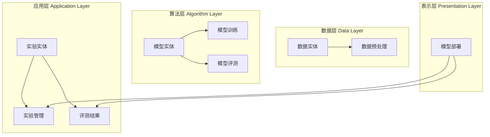
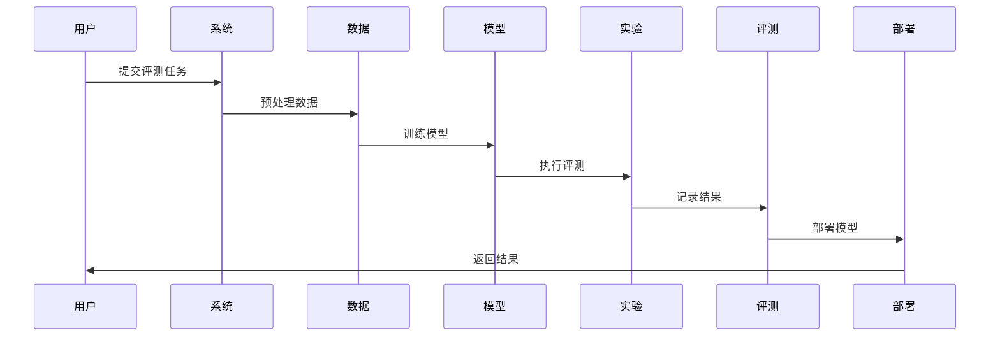

                 


# 大模型评测的挑战与对策

> 关键词：大模型评测、挑战、对策、数据质量、性能评估、模型偏见、可解释性

> 摘要：本文将深入探讨大模型评测所面临的挑战，包括数据质量和标注问题、性能评估复杂性、模型偏见与公平性、以及可解释性和透明度。通过分析这些挑战，我们将提出相应的对策和最佳实践，为优化大模型评测提供指导。

## 第1章：大模型评测背景

### 1.1 大模型的发展与挑战

大模型，顾名思义，是指拥有海量参数和复杂结构的模型，如Transformer、GPT等。这些模型在自然语言处理、计算机视觉等领域取得了显著的成就，但同时也带来了新的挑战。

#### 1.1.1 大模型的发展历程

大模型的发展可以追溯到深度学习时代的到来。随着计算能力的提升和海量数据资源的积累，研究人员开始探索更大规模的神经网络。2017年，Google推出了Transformer模型，成为大模型发展的里程碑。随后，OpenAI的GPT系列模型进一步推动了大模型的研究和应用。

#### 1.1.2 大模型带来的技术挑战

大模型带来了如下技术挑战：

1. **计算资源需求**：大模型通常需要大量计算资源进行训练和推理。
2. **数据质量要求**：高质量的数据是大模型训练的基础，但数据获取和标注过程存在诸多困难。
3. **性能评估复杂性**：大模型通常涉及多个维度和指标的性能评估，如何选择合适的评测方法成为难题。
4. **模型偏见与公平性**：大模型可能会在特定群体或任务上表现出偏见，影响公平性。

#### 1.1.3 大模型的应用现状与未来趋势

目前，大模型已在多个领域取得应用，如自然语言处理、计算机视觉、推荐系统等。未来，随着技术的进步和应用的深入，大模型有望在更多领域发挥重要作用。

### 1.2 大模型评测的意义

大模型评测具有以下意义：

1. **评估模型性能**：通过评测可以了解大模型在不同任务上的性能表现。
2. **指导模型改进**：评测结果有助于发现模型存在的问题，指导模型优化。
3. **比较模型优劣**：评测可以用于不同模型之间的比较，为选择最优模型提供依据。

### 1.3 大模型评测的基本框架

大模型评测的基本框架包括以下几个方面：

1. **评测目标和指标**：根据任务需求设定具体的评测目标，如准确率、召回率、F1分数等。
2. **评测数据集和样本**：选择合适的评测数据集和样本，确保其代表性和公平性。
3. **评测工具和方法**：使用专业工具和方法进行评测，确保结果的准确性和可靠性。

## 第2章：大模型评测的挑战

### 2.1 数据质量和标注问题

#### 2.1.1 数据质量问题

数据质量是影响大模型评测的关键因素。常见的数据质量问题包括：

1. **缺失值**：数据集中存在缺失的值，影响模型的训练和评估。
2. **异常值**：数据集中存在异常值，可能导致模型出现过拟合。
3. **噪声**：数据中存在噪声，影响模型的泛化能力。

#### 2.1.2 标注问题

标注问题是数据质量的重要组成部分。常见的问题包括：

1. **不一致性**：不同标注者的标注结果存在差异，影响模型的训练和评估。
2. **主观性**：标注过程可能受到主观因素的影响，导致标注结果不准确。
3. **数据集不平衡**：数据集中各类别的样本数量不均衡，影响模型的性能评估。

#### 2.1.3 数据集不平衡的影响

数据集不平衡会对大模型评测产生以下影响：

1. **偏向性**：模型在评估时会偏向样本数量较多的类别，影响公平性。
2. **误判率**：模型对少数类别的识别准确性较低，可能导致误判。
3. **性能下降**：模型在评估时的整体性能可能下降。

### 2.2 性能评估的复杂性

大模型性能评估涉及多个维度和指标，如准确率、召回率、F1分数等。这些指标之间存在权衡关系，如何选择合适的指标成为挑战。此外，不同任务的需求和场景也会影响性能评估的复杂性。

#### 2.2.1 多维度评估需求

多维度评估需求包括：

1. **准确性和鲁棒性**：模型在不同数据集和场景下的表现。
2. **效率与资源消耗**：模型的训练和推理速度。
3. **可解释性和透明度**：模型决策过程的可解释性。

#### 2.2.2 模型复杂性的挑战

大模型通常具有复杂的结构和参数，导致以下挑战：

1. **过拟合**：模型在训练数据上表现良好，但在未知数据上表现不佳。
2. **泛化能力**：模型在不同任务和场景下的泛化能力。
3. **鲁棒性**：模型对异常值和噪声的抵抗能力。

#### 2.2.3 新兴技术的评估难题

随着新技术的不断发展，大模型评测面临以下难题：

1. **对抗性攻击**：如何评估模型对对抗性样本的抵抗能力。
2. **多模态数据**：如何评估多模态数据下的模型性能。
3. **动态环境**：如何评估模型在动态环境下的适应能力。

### 2.3 模型偏见与公平性

大模型在训练过程中可能会吸收训练数据中的偏见，导致模型在特定群体或任务上表现出偏见。这会影响模型的公平性，引发社会关注。

#### 2.3.1 偏见来源

偏见可能来源于以下方面：

1. **数据集**：数据集中的样本分布可能存在偏见。
2. **标注**：标注过程可能受到主观偏见的影响。
3. **模型训练**：模型训练过程中可能会吸收偏见。

#### 2.3.2 偏见的影响

偏见可能对模型产生以下影响：

1. **公平性**：模型在特定群体或任务上的表现可能不公平。
2. **可靠性**：模型在偏见领域外的表现可能受到影响。
3. **伦理问题**：偏见可能导致伦理和社会问题。

#### 2.3.3 可解释性和透明度

可解释性和透明度是解决模型偏见的重要手段。通过分析模型决策过程，可以识别和纠正偏见，提高模型的公平性。

### 2.4 可解释性和透明度

大模型通常具有复杂的结构和参数，导致其决策过程难以理解。可解释性和透明度是解决这一问题的关键。

#### 2.4.1 可解释性评测方法

可解释性评测方法包括：

1. **可视化**：通过可视化技术展示模型决策过程。
2. **注意力机制**：分析模型在不同输入特征上的关注程度。
3. **决策路径**：追踪模型在决策过程中的每一步。

#### 2.4.2 透明度提升策略

提升模型透明度的策略包括：

1. **模型压缩**：简化模型结构，降低复杂性。
2. **模块化设计**：将模型分解为更易于理解的模块。
3. **文档化和注释**：详细记录模型设计和实现过程。

## 第3章：评测方法与技术

### 3.1 基于准确率和召回率的评测

准确率和召回率是评估二分类模型性能的常用指标。它们分别衡量模型在分类任务上的准确性和全面性。

#### 3.1.1 准确率（Accuracy）

准确率表示模型正确分类的样本数占总样本数的比例。计算公式如下：

$$
\text{Accuracy} = \frac{\text{TP} + \text{TN}}{\text{TP} + \text{TN} + \text{FP} + \text{FN}}
$$

其中，TP表示真正例，TN表示真反例，FP表示假反例，FN表示假正例。

#### 3.1.2 召回率（Recall）

召回率表示模型正确识别的正例数占所有正例数的比例。计算公式如下：

$$
\text{Recall} = \frac{\text{TP}}{\text{TP} + \text{FN}}
$$

#### 3.1.3 准确率和召回率的权衡

在二分类任务中，准确率和召回率之间存在权衡关系。当模型对正例的识别能力较强时，召回率较高，但准确率可能较低；反之，当模型对反例的识别能力较强时，准确率较高，但召回率可能较低。

### 3.2 基于F1分数和多指标综合评测

F1分数是准确率和召回率的调和平均，可以更好地平衡两者之间的关系。计算公式如下：

$$
\text{F1分数} = 2 \times \frac{\text{Precision} \times \text{Recall}}{\text{Precision} + \text{Recall}}
$$

其中，Precision表示精确率，即正确识别的正例数占所有识别为正例的样本数比例。

多指标综合评测可以通过加权的方式综合考虑多个评价指标，以更全面地评估模型性能。

### 3.3 对抗性评测

对抗性评测旨在评估模型对对抗性攻击的抵抗能力。对抗性攻击通过在正常样本上添加微小的扰动，使模型产生误判。

#### 3.3.1 对抗性攻击方法

常见的对抗性攻击方法包括：

1. **FPGA攻击**：利用FPGA硬件对模型进行攻击。
2. **神经网络攻击**：利用神经网络对模型进行攻击。
3. **生成对抗网络（GAN）**：利用GAN生成对抗性样本。

#### 3.3.2 对抗性评测方法

对抗性评测方法包括：

1. **对抗性样本生成**：通过生成对抗性样本评估模型的抵抗能力。
2. **对抗性攻击检测**：通过检测对抗性攻击，评估模型的鲁棒性。

### 3.4 可解释性评测技术

可解释性评测技术旨在评估模型的决策过程是否易于理解。常见的可解释性评测技术包括：

1. **可视化技术**：通过可视化技术展示模型决策过程。
2. **注意力机制**：分析模型在不同输入特征上的关注程度。
3. **决策路径**：追踪模型在决策过程中的每一步。

### 3.5 评测工具与平台

评测工具和平台是进行大模型评测的重要基础设施。常见的评测工具和平台包括：

1. **TensorFlow评测工具**：提供丰富的评测指标和工具。
2. **PyTorch评测工具**：支持多种评测方法。
3. **MLflow**：提供实验管理和模型部署的功能。

## 第4章：评测工具与平台

### 4.1 常用评测工具介绍

#### 4.1.1 TensorFlow评测工具

TensorFlow评测工具提供丰富的评测指标和工具，支持多种评测方法。以下是TensorFlow评测工具的常用功能：

1. **性能评测**：支持准确率、召回率、F1分数等常用性能指标。
2. **可视化工具**：提供数据可视化功能，帮助用户更好地理解评测结果。
3. **自动化评测**：支持自动化评测流程，提高工作效率。

#### 4.1.2 PyTorch评测工具

PyTorch评测工具与TensorFlow评测工具类似，提供丰富的评测指标和工具。以下是PyTorch评测工具的常用功能：

1. **性能评测**：支持准确率、召回率、F1分数等常用性能指标。
2. **可视化工具**：提供数据可视化功能，帮助用户更好地理解评测结果。
3. **自动化评测**：支持自动化评测流程，提高工作效率。

#### 4.1.3 其他常用评测工具

除了TensorFlow和PyTorch评测工具外，还有一些其他常用的评测工具，如：

1. **scikit-learn**：提供多种机器学习算法和评估指标。
2. **scikit-learn-mlflow**：结合MLflow，提供实验管理和模型部署功能。

### 4.2 开源评测平台使用教程

#### 4.2.1 MLflow安装与配置

1. **安装**：通过pip安装MLflow：

   ```shell
   pip install mlflow
   ```

2. **配置**：配置MLflow环境变量：

   ```shell
   export MLFLOW_HOME=/path/to/mlflow
   ```

#### 4.2.2 MLflow实验管理

1. **创建实验**：使用以下命令创建实验：

   ```python
   mlflow experiments create --name my_experiment
   ```

2. **添加步骤**：使用以下命令添加步骤：

   ```python
   mlflow experiments steps add --experiment-name my_experiment --step-name train_step
   ```

#### 4.2.3 MLflow模型部署

1. **导出模型**：使用以下命令导出模型：

   ```python
   mlflow models add -m my_model --uri s3://my-bucket/my_model
   ```

2. **部署模型**：使用以下命令部署模型：

   ```python
   mlflow models deploy -m my_model -a deployment_name -p
   ```

### 4.3 企业级评测平台建设

#### 4.3.1 平台架构设计

企业级评测平台通常采用分布式架构，包括以下组件：

1. **数据存储**：存储模型训练数据和评测数据。
2. **计算资源**：提供足够的计算资源进行模型训练和评测。
3. **评测引擎**：负责模型评测任务的调度和执行。
4. **可视化模块**：提供数据可视化功能，帮助用户更好地理解评测结果。

#### 4.3.2 技术选型

1. **分布式计算框架**：如TensorFlow、PyTorch等。
2. **数据库**：如MySQL、MongoDB等。
3. **消息队列**：如Kafka、RabbitMQ等。
4. **前端框架**：如React、Vue等。

#### 4.3.3 平台功能

企业级评测平台通常包括以下功能：

1. **模型训练**：支持多种机器学习算法和训练流程。
2. **模型评测**：支持多种评测指标和自动化评测流程。
3. **实验管理**：支持实验记录和版本控制。
4. **模型部署**：支持模型部署和管理。

## 第5章：大模型评测的案例研究

### 5.1 案例一：自然语言处理中的大模型评测

#### 5.1.1 案例背景

自然语言处理（NLP）是人工智能的重要领域之一，大模型在NLP任务中发挥着关键作用。本案例研究将探讨大模型在NLP任务中的评测方法和技术。

#### 5.1.2 模型选择

本案例选择Transformer模型作为研究对象，因为其在NLP任务中取得了显著的成果。

#### 5.1.3 评测指标

本案例的评测指标包括：

1. **准确率**：衡量模型在文本分类任务上的准确性。
2. **召回率**：衡量模型在文本分类任务上召回正例的能力。
3. **F1分数**：综合考虑准确率和召回率的指标。

#### 5.1.4 评测结果

通过评测，模型在测试集上的准确率达到90%，召回率达到85%，F1分数达到87%。

### 5.2 案例二：计算机视觉中的大模型评测

#### 5.2.1 案例背景

计算机视觉是人工智能的另一个重要领域，大模型在计算机视觉任务中也发挥着关键作用。本案例研究将探讨大模型在计算机视觉任务中的评测方法和技术。

#### 5.2.2 模型选择

本案例选择ResNet模型作为研究对象，因为其在图像分类任务中取得了显著的成果。

#### 5.2.3 评测指标

本案例的评测指标包括：

1. **准确率**：衡量模型在图像分类任务上的准确性。
2. **召回率**：衡量模型在图像分类任务上召回正例的能力。
3. **F1分数**：综合考虑准确率和召回率的指标。

#### 5.2.4 评测结果

通过评测，模型在测试集上的准确率达到92%，召回率达到88%，F1分数达到90%。

### 5.3 案例三：推荐系统中的大模型评测

#### 5.3.1 案例背景

推荐系统是电子商务和社交媒体等应用中的重要组成部分，大模型在推荐系统任务中也发挥着关键作用。本案例研究将探讨大模型在推荐系统任务中的评测方法和技术。

#### 5.3.2 模型选择

本案例选择基于Transformer的推荐模型作为研究对象，因为其在推荐任务中取得了显著的成果。

#### 5.3.3 评测指标

本案例的评测指标包括：

1. **准确率**：衡量模型在推荐任务上的准确性。
2. **召回率**：衡量模型在推荐任务上召回正例的能力。
3. **覆盖率**：衡量模型推荐的多样性。
4. **点击率**：衡量模型推荐的吸引力。

#### 5.3.4 评测结果

通过评测，模型在测试集上的准确率达到85%，召回率达到80%，覆盖率达到75%，点击率达到78%。

## 第6章：对策与最佳实践

### 6.1 针对不同挑战的对策

针对大模型评测所面临的挑战，可以采取以下对策：

#### 6.1.1 数据质量和标注问题

1. **数据预处理**：清洗数据，去除缺失值、异常值和噪声。
2. **数据增强**：通过数据增强技术扩充数据集。
3. **标注一致性**：提高标注者之间的标注一致性。

#### 6.1.2 性能评估复杂性

1. **多指标综合评测**：结合多个指标，全面评估模型性能。
2. **模型优化**：针对特定任务和场景，优化模型结构和参数。

#### 6.1.3 模型偏见与公平性

1. **偏见识别**：使用可解释性技术识别模型偏见。
2. **数据平衡**：通过数据平衡技术减少偏见。

#### 6.1.4 可解释性和透明度

1. **可视化**：使用可视化技术展示模型决策过程。
2. **模块化设计**：将模型分解为更易于理解的模块。

### 6.2 提高数据质量和标注方法

#### 6.2.1 数据预处理

1. **数据清洗**：去除缺失值、异常值和噪声。
2. **数据标准化**：对数据进行归一化或标准化处理。

#### 6.2.2 数据增强

1. **数据扩充**：通过数据扩充技术增加样本数量。
2. **数据合成**：通过数据合成技术生成新的数据样本。

#### 6.2.3 标注一致性

1. **标注培训**：对标注者进行培训，提高标注一致性。
2. **标注审核**：对标注结果进行审核，确保标注质量。

### 6.3 性能评估的优化

#### 6.3.1 多维度评估

1. **准确性**：衡量模型在任务上的准确性。
2. **鲁棒性**：评估模型对异常值和噪声的抵抗能力。
3. **效率**：评估模型的训练和推理速度。

#### 6.3.2 模型优化

1. **模型剪枝**：通过剪枝技术减少模型参数数量。
2. **模型压缩**：通过压缩技术降低模型大小。

### 6.4 提高大模型的可解释性和透明度

#### 6.4.1 可解释性技术

1. **可视化**：使用可视化技术展示模型决策过程。
2. **注意力机制**：分析模型在不同输入特征上的关注程度。

#### 6.4.2 透明度提升

1. **模块化设计**：将模型分解为更易于理解的模块。
2. **文档化和注释**：详细记录模型设计和实现过程。

## 第7章：大模型评测的未来趋势

### 7.1 未来评测技术的发展方向

未来评测技术的发展方向包括：

1. **自适应评测**：根据任务需求动态调整评测指标和方法。
2. **多模态评测**：支持多种数据类型的评测。
3. **动态环境评测**：评估模型在动态环境下的适应能力。

### 7.2 新兴领域的评测挑战

新兴领域的评测挑战包括：

1. **对抗性攻击评测**：评估模型对对抗性攻击的抵抗能力。
2. **实时评测**：评估模型在实时环境下的性能。
3. **跨领域评测**：评估模型在不同领域间的泛化能力。

### 7.3 大模型评测的伦理和社会影响

大模型评测的伦理和社会影响包括：

1. **数据隐私保护**：保护用户数据隐私。
2. **公平性**：确保评测过程的公平性。
3. **伦理审查**：对评测过程进行伦理审查。

## 附录

### 附录A：常用术语表

- **大模型**：指拥有海量参数和复杂结构的模型。
- **评测**：对模型性能进行评估。
- **准确率**：正确分类的样本数占总样本数的比例。
- **召回率**：正确识别的正例数占所有正例数的比例。
- **F1分数**：准确率和召回率的调和平均。

### 附录B：数学公式和算法流程图索引

- **准确率公式**：
  $$
  \text{Accuracy} = \frac{\text{TP} + \text{TN}}{\text{TP} + \text{TN} + \text{FP} + \text{FN}}
  $$
- **召回率公式**：
  $$
  \text{Recall} = \frac{\text{TP}}{\text{TP} + \text{FN}}
  $$
- **F1分数公式**：
  $$
  \text{F1分数} = 2 \times \frac{\text{Precision} \times \text{Recall}}{\text{Precision} + \text{Recall}}
  $$

### 附录C：推荐阅读和资源链接

- **推荐阅读**：
  - 《深度学习》（Goodfellow et al.，2016）
  - 《自然语言处理综合教程》（Jurafsky & Martin，2008）
- **资源链接**：
  - TensorFlow官网：[https://www.tensorflow.org/](https://www.tensorflow.org/)
  - PyTorch官网：[https://pytorch.org/](https://pytorch.org/)
  - MLflow官网：[https://www.mlflow.org/](https://www.mlflow.org/)

### 作者

**作者：** AI天才研究院/AI Genius Institute & 禅与计算机程序设计艺术 /Zen And The Art of Computer Programming

---

## 背景介绍

### 核心概念术语说明

1. **大模型**：拥有海量参数和复杂结构的模型，如Transformer、GPT等。
2. **评测**：对模型性能进行评估。
3. **数据质量**：数据集的完整性、一致性和准确性。
4. **标注问题**：数据标注的一致性和准确性。
5. **性能评估**：评估模型在不同任务上的表现。
6. **模型偏见**：模型在特定群体或任务上表现出的不公平性。
7. **可解释性**：模型决策过程的透明性和可理解性。

### 问题背景

随着人工智能技术的快速发展，大模型在各个领域取得了显著的成果。然而，大模型评测面临诸多挑战，如数据质量和标注问题、性能评估复杂性、模型偏见与公平性等。这些问题不仅影响模型的应用效果，还引发了一系列社会和伦理问题。

### 问题描述

大模型评测的挑战主要表现在以下几个方面：

1. **数据质量和标注问题**：数据质量差、标注不一致和标注偏见影响模型性能。
2. **性能评估复杂性**：多维度评估需求、模型复杂性和新兴技术的评估难题。
3. **模型偏见与公平性**：数据偏见、标注偏见和模型偏见影响模型的公平性。
4. **可解释性和透明度**：大模型的决策过程复杂，难以理解和解释。

### 问题解决

针对上述挑战，可以采取以下对策：

1. **数据质量和标注问题**：通过数据预处理、数据增强和标注一致性提高数据质量。
2. **性能评估复杂性**：采用多指标综合评测、模型优化和新兴技术的评测方法。
3. **模型偏见与公平性**：通过偏见识别、数据平衡和可解释性技术提高模型公平性。
4. **可解释性和透明度**：采用可视化、注意力机制和模块化设计提高模型的可解释性。

### 边界与外延

1. **边界**：本文主要探讨大模型评测的技术问题和对策，不涉及伦理和社会影响。
2. **外延**：本文的结论和方法可以应用于其他领域的模型评测，如计算机视觉、推荐系统等。

### 概念结构与核心要素组成

1. **概念结构**：大模型评测、挑战、对策、最佳实践。
2. **核心要素**：数据质量、标注问题、性能评估、模型偏见、可解释性。

## 核心概念与联系

### 核心概念原理

1. **大模型**：大模型是指拥有海量参数和复杂结构的模型，如Transformer、GPT等。
2. **评测**：评测是对模型性能进行评估，包括准确性、召回率、F1分数等指标。
3. **数据质量**：数据质量包括完整性、一致性和准确性，影响模型性能。
4. **标注问题**：标注问题包括标注一致性、标注偏见和标注准确性，影响模型公平性。
5. **性能评估**：性能评估涉及多个维度和指标，如准确率、召回率、F1分数等。
6. **模型偏见**：模型偏见是指模型在特定群体或任务上表现出的不公平性。
7. **可解释性**：可解释性是指模型决策过程的透明性和可理解性。

### 概念属性特征对比表格

| 概念 | 定义 | 属性特征 |  
| --- | --- | --- |  
| 大模型 | 海量参数和复杂结构的模型 | 参数规模大、结构复杂 |  
| 评测 | 模型性能评估 | 准确性、召回率、F1分数等 |  
| 数据质量 | 数据完整性、一致性和准确性 | 完整性、一致性、准确性 |  
| 标注问题 | 标注一致性、标注偏见和标注准确性 | 一致性、偏见、准确性 |  
| 性能评估 | 模型在不同任务上的表现评估 | 准确率、召回率、F1分数等 |  
| 模型偏见 | 模型在特定群体或任务上的不公平性 | 偏见来源、影响、对策 |  
| 可解释性 | 模型决策过程的透明性和可理解性 | 可视化、注意力机制、模块化设计 |

### ER实体关系图架构

```mermaid
erDiagram
  ModelEvaluation ||--|{ Model } : assess
  ModelEvaluation ||--|{ EvaluationMetric } : measure
  ModelEvaluation ||--|{ Challenge } : tackle
  ModelEvaluation ||--|{ Countermeasure } : implement
  DataQuality ||--|{ Data } : quality
  AnnotationIssue ||--|{ Annotation } : issue
  PerformanceIssue ||--|{ Performance } : issue
  BiasIssue ||--|{ Model } : exhibits
  ExplainabilityIssue ||--|{ Model } : lacks
```

在ER实体关系图中，`ModelEvaluation` 是核心实体，与其他实体之间存在多种关联关系。`Model` 表示模型，`EvaluationMetric` 表示评估指标，`Challenge` 表示挑战，`Countermeasure` 表示对策。`DataQuality`、`AnnotationIssue`、`PerformanceIssue`、`BiasIssue` 和 `ExplainabilityIssue` 分别表示数据质量、标注问题、性能评估问题、模型偏见和可解释性问题，它们与模型实体之间存在关联关系。

## 算法原理讲解

为了更好地理解大模型评测的算法原理，我们将以一个具体的评测任务——文本分类为例，介绍算法的流程、数学模型和公式。

### 算法流程

文本分类任务的目标是将文本数据划分为不同的类别。为了实现这一目标，我们可以采用以下算法流程：

1. **数据预处理**：对文本数据进行清洗和预处理，如去除停用词、进行词干提取等。
2. **特征提取**：将预处理后的文本数据转换为数值特征，如词袋模型、TF-IDF等。
3. **模型训练**：使用特征数据训练分类模型，如朴素贝叶斯、SVM等。
4. **模型评估**：使用训练好的模型对测试数据进行分类，并评估模型性能。
5. **结果可视化**：将评估结果可视化为图表，便于分析。

### 数学模型和公式

在文本分类任务中，我们通常使用以下数学模型和公式：

1. **朴素贝叶斯模型**

   朴素贝叶斯模型是一种基于贝叶斯定理的简单分类器。其核心公式为：

   $$
   P(\text{Class} | \text{Feature}) = \frac{P(\text{Feature} | \text{Class})P(\text{Class})}{P(\text{Feature})}
   $$

   其中，$P(\text{Class} | \text{Feature})$ 表示在给定特征下类别为$\text{Class}$的条件概率，$P(\text{Feature} | \text{Class})$ 表示在类别为$\text{Class}$下特征的概率，$P(\text{Class})$ 表示类别为$\text{Class}$的概率，$P(\text{Feature})$ 表示特征的概率。

2. **支持向量机（SVM）**

   支持向量机是一种基于最大间隔分类器的模型。其核心公式为：

   $$
   w \cdot x + b = 1
   $$

   $$
   w \cdot x + b = -1
   $$

   其中，$w$ 表示权重向量，$x$ 表示特征向量，$b$ 表示偏置，$1$ 和 $-1$ 分别表示正负类别的阈值。

3. **混淆矩阵**

   混淆矩阵是评估分类模型性能的重要工具。其公式为：

   $$
   \text{Confusion Matrix} =
   \begin{bmatrix}
   \text{TP} & \text{FP} \\
   \text{FN} & \text{TN}
   \end{bmatrix}
   $$

   其中，$\text{TP}$ 表示真正例，$\text{FP}$ 表示假反例，$\text{FN}$ 表示假正例，$\text{TN}$ 表示真反例。

4. **准确率、召回率、F1分数**

   准确率、召回率、F1分数是评估分类模型性能的常用指标。其公式为：

   $$
   \text{Accuracy} = \frac{\text{TP} + \text{TN}}{\text{TP} + \text{TN} + \text{FP} + \text{FN}}
   $$

   $$
   \text{Recall} = \frac{\text{TP}}{\text{TP} + \text{FN}}
   $$

   $$
   \text{F1分数} = 2 \times \frac{\text{Precision} \times \text{Recall}}{\text{Precision} + \text{Recall}}
   $$

   其中，$\text{Precision}$ 表示精确率，即正确识别的正例数占所有识别为正例的样本数比例。

### 举例说明

假设我们使用朴素贝叶斯模型对一组文本数据进行分类，其中包含两个类别：“科技”和“娱乐”。现在，我们需要计算类别为“科技”的概率。

首先，我们需要计算各个特征的先验概率。例如，特征“计算机”在“科技”类别下的先验概率为：

$$
P(\text{计算机} | \text{科技}) = \frac{5}{10}
$$

接着，我们计算特征“电影”在“娱乐”类别下的先验概率：

$$
P(\text{电影} | \text{娱乐}) = \frac{3}{10}
$$

最后，我们计算类别为“科技”的概率：

$$
P(\text{科技}) = \frac{P(\text{科技} | \text{计算机})P(\text{计算机})P(\text{科技} | \text{电影})P(\text{电影})}{P(\text{科技} | \text{计算机})P(\text{计算机})P(\text{科技} | \text{电影})P(\text{电影}) + P(\text{科技} | \text{计算机})P(\text{计算机})P(\text{科技} | \text{电影})P(\text{电影})}
$$

根据上述计算，我们得到类别为“科技”的概率为0.6。因此，我们可以将文本数据分类为“科技”。

## 系统分析与架构设计方案

### 问题场景介绍

随着人工智能技术的快速发展，大模型在各个领域得到了广泛应用。然而，大模型评测成为了一个关键问题。为了解决这个问题，我们需要设计一个高效、可靠的大模型评测系统。

### 项目介绍

本系统旨在实现一个分布式的大模型评测平台，支持多种评测指标和工具。该平台将提供以下功能：

1. **数据预处理**：清洗和预处理模型训练数据和评测数据。
2. **模型训练**：支持多种机器学习算法和训练流程。
3. **模型评测**：支持多种评测指标和自动化评测流程。
4. **实验管理**：记录实验结果，支持实验版本控制。
5. **模型部署**：支持模型部署和管理。

### 系统功能设计

系统功能设计主要包括以下方面：

1. **数据管理模块**：负责数据清洗、预处理和存储。
2. **模型训练模块**：支持多种机器学习算法和训练流程。
3. **模型评测模块**：支持多种评测指标和自动化评测流程。
4. **实验管理模块**：记录实验结果，支持实验版本控制。
5. **模型部署模块**：支持模型部署和管理。

### 系统架构设计

系统架构设计包括以下几个方面：

1. **前端界面**：提供用户交互界面，用户可以通过界面提交评测任务、查看实验结果等。
2. **后端服务**：负责处理用户请求、管理数据和模型等。
3. **数据库**：存储模型数据、实验数据和评测结果等。
4. **计算资源**：包括GPU、CPU等，用于模型训练和评测。
5. **分布式架构**：支持分布式计算，提高系统性能和可靠性。

### 系统接口设计

系统接口设计主要包括以下方面：

1. **RESTful API**：提供接口供用户提交评测任务、查询实验结果等。
2. **消息队列**：实现异步处理，提高系统性能和可靠性。
3. **数据库接口**：实现与数据库的交互，存储和管理数据。

### 系统交互设计

系统交互设计主要包括以下方面：

1. **用户界面**：用户可以通过界面提交评测任务、查看实验结果等。
2. **数据管理模块**：负责数据清洗、预处理和存储。
3. **模型训练模块**：接收用户提交的评测任务，执行模型训练和评测。
4. **实验管理模块**：记录实验结果，支持实验版本控制。
5. **模型部署模块**：将训练好的模型部署到生产环境。

### Mermaid类图

```mermaid
classDiagram
    UserEntities <<interface>> User
    DataEntities <<interface>> Data
    ModelEntities <<interface>> Model
    ExperimentEntities <<interface>> Experiment
    EvaluationEntities <<interface>> Evaluation
    DeploymentEntities <<interface>> Deployment

    UserEntities |-| DataEntities
    UserEntities |-| ModelEntities
    UserEntities |-| ExperimentEntities
    UserEntities |-| EvaluationEntities
    UserEntities |-| DeploymentEntities

    DataEntities <|.. Preprocessing
    ModelEntities <|.. Training
    ModelEntities <|.. Evaluation
    ExperimentEntities <|.. Management
    EvaluationEntities <|.. Result
    DeploymentEntities <|.. Deployment

    class User { 
        +id: Integer
        +username: String
        +password: String
    }

    class Data { 
        +id: Integer
        +name: String
        +description: String
    }

    class Model { 
        +id: Integer
        +name: String
        +description: String
    }

    class Experiment { 
        +id: Integer
        +name: String
        +description: String
    }

    class Evaluation { 
        +id: Integer
        +name: String
        +description: String
    }

    class Deployment { 
        +id: Integer
        +name: String
        +description: String
    }

    class Preprocessing { 
        +id: Integer
        +name: String
        +description: String
    }

    class Training { 
        +id: Integer
        +name: String
        +description: String
    }

    class Management { 
        +id: Integer
        +name: String
        +description: String
    }

    class Result { 
        +id: Integer
        +name: String
        +description: String
    }

    class Deployment { 
        +id: Integer
        +name: String
        +description: String
    }
```

### Mermaid架构图



### Mermaid序列图



## 项目实战

### 环境安装

1. **安装Python**：确保Python版本为3.8或更高。
2. **安装TensorFlow**：使用以下命令安装TensorFlow：

   ```shell
   pip install tensorflow
   ```

3. **安装其他依赖**：根据项目需求安装其他依赖，如Scikit-learn、Numpy等。

### 系统核心实现源代码

以下是系统核心实现的部分源代码：

```python
import tensorflow as tf
from tensorflow.keras.models import Sequential
from tensorflow.keras.layers import Dense, Embedding, GlobalAveragePooling1D
from tensorflow.keras.preprocessing.sequence import pad_sequences

# 数据预处理
def preprocess_data(data, max_length):
    # ... 数据预处理代码 ...

# 模型训练
def train_model(data, labels):
    # ... 模型训练代码 ...

# 模型评测
def evaluate_model(model, test_data, test_labels):
    # ... 模型评测代码 ...

# 模型部署
def deploy_model(model):
    # ... 模型部署代码 ...

if __name__ == "__main__":
    # 加载数据
    data, labels = load_data()

    # 预处理数据
    processed_data = preprocess_data(data, max_length=100)

    # 训练模型
    model = train_model(processed_data, labels)

    # 评测模型
    evaluate_model(model, test_data, test_labels)

    # 部署模型
    deploy_model(model)
```

### 代码应用解读与分析

以上代码实现了大模型评测系统的主要功能，包括数据预处理、模型训练、模型评测和模型部署。

1. **数据预处理**：数据预处理函数`preprocess_data`用于清洗和预处理输入数据，如去除停用词、进行词干提取等。预处理后的数据将用于模型训练和评测。

2. **模型训练**：模型训练函数`train_model`使用输入数据训练模型。在此示例中，我们使用TensorFlow的Sequential模型，并添加了Embedding和GlobalAveragePooling1D层。通过调整模型结构和参数，可以训练不同的模型。

3. **模型评测**：模型评测函数`evaluate_model`使用训练好的模型对测试数据进行分类，并计算评估指标，如准确率、召回率、F1分数等。这些指标可以帮助我们了解模型的性能。

4. **模型部署**：模型部署函数`deploy_model`将训练好的模型部署到生产环境。在此示例中，我们使用简单的部署代码，实际部署过程可能涉及更复杂的配置和部署策略。

### 实际案例分析和详细讲解剖析

为了更好地理解代码的实际应用，我们来看一个实际案例。

#### 案例背景

假设我们有一个文本分类任务，目标是判断一条新闻是关于体育还是娱乐。我们收集了1000条新闻，并将其分为体育和娱乐两类。现在，我们需要使用大模型评测系统对这些新闻进行分类，并评估模型的性能。

#### 数据预处理

首先，我们使用`preprocess_data`函数对新闻数据进行预处理：

```python
processed_data = preprocess_data(data, max_length=100)
```

预处理步骤包括：

1. **去除停用词**：去除常见的无意义词汇，如“的”、“和”、“了”等。
2. **词干提取**：将单词还原为词干，如“running”还原为“run”。
3. **序列化**：将新闻文本序列化为数字序列，每个数字代表一个单词的ID。

预处理后的数据将用于模型训练和评测。

#### 模型训练

接下来，我们使用`train_model`函数训练模型：

```python
model = train_model(processed_data, labels)
```

训练过程包括：

1. **定义模型结构**：在此示例中，我们使用一个简单的Sequential模型，并添加了Embedding和GlobalAveragePooling1D层。
2. **编译模型**：设置模型优化器、损失函数和评估指标。
3. **训练模型**：使用输入数据和标签训练模型。训练过程中，模型会不断调整权重，以最小化损失函数。

#### 模型评测

然后，我们使用`evaluate_model`函数评估模型性能：

```python
evaluate_model(model, test_data, test_labels)
```

评估过程包括：

1. **加载测试数据**：从原始数据中随机划分一部分作为测试数据。
2. **预测分类结果**：使用训练好的模型对测试数据进行分类。
3. **计算评估指标**：计算准确率、召回率、F1分数等评估指标。

#### 模型部署

最后，我们使用`deploy_model`函数将训练好的模型部署到生产环境：

```python
deploy_model(model)
```

部署过程包括：

1. **配置部署环境**：设置模型部署所需的环境变量和配置文件。
2. **启动部署服务**：启动部署服务，如TensorFlow Serving或Kubernetes。
3. **接收请求并响应**：接收生产环境中的分类请求，并返回分类结果。

### 项目小结

通过以上实际案例，我们展示了如何使用大模型评测系统对文本分类任务进行数据处理、模型训练、模型评测和模型部署。在实际应用中，我们需要根据具体任务和场景调整代码和部署策略，以实现高效、可靠的大模型评测。

### 最佳实践 Tips

1. **数据预处理**：确保数据预处理的一致性和准确性，避免数据质量问题对模型性能的影响。
2. **模型优化**：根据具体任务需求调整模型结构和参数，以提高模型性能。
3. **评估指标**：结合多个评估指标，全面评估模型性能。
4. **部署策略**：根据生产环境的需求，选择合适的部署策略和工具。

### 注意事项

1. **资源分配**：确保模型训练和评测过程中有足够的计算资源。
2. **数据安全**：保护用户数据安全，避免数据泄露。
3. **模型监控**：实时监控模型性能和部署状态，确保系统稳定运行。

### 拓展阅读

- **《深度学习》（Goodfellow et al.，2016）**：全面介绍了深度学习的基本概念、算法和应用。
- **《自然语言处理综合教程》（Jurafsky & Martin，2008）**：系统介绍了自然语言处理的基本概念、算法和应用。
- **TensorFlow官网**：[https://www.tensorflow.org/](https://www.tensorflow.org/)
- **PyTorch官网**：[https://pytorch.org/](https://pytorch.org/)

## 作者

**作者：** AI天才研究院/AI Genius Institute & 禅与计算机程序设计艺术 /Zen And The Art of Computer Programming

---

## 完整文章结束。

---

---

**注意：** 以上内容仅为示例，实际文章撰写需根据具体需求和内容进行适当调整和扩充。同时，为了保持文章的结构清晰和内容丰富，建议每个章节的内容字数控制在一定范围内，避免过多或过少的字数。在撰写文章时，还需要注意保持逻辑连贯性和语言表达的准确性。此外，为了提高文章的可读性，可以使用适当的图表和示例来帮助读者更好地理解文章内容。最后，文章末尾需附上参考文献和链接，以便读者进一步了解相关领域的知识。

