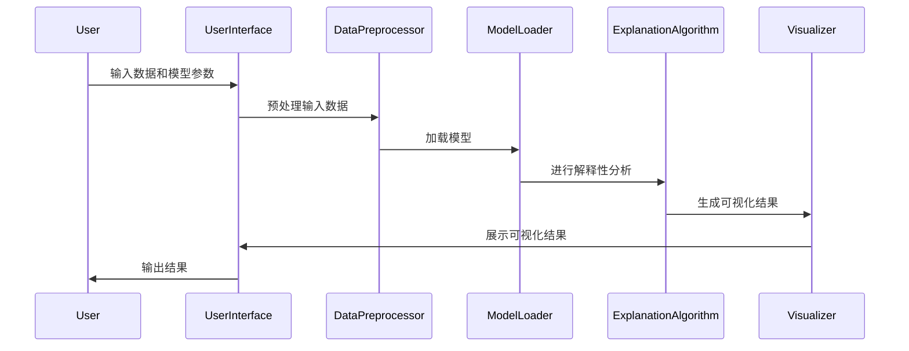
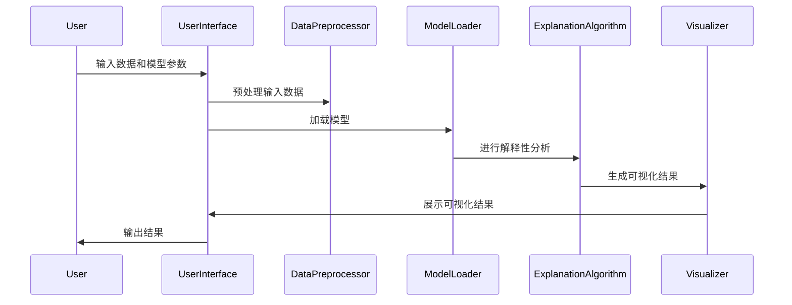
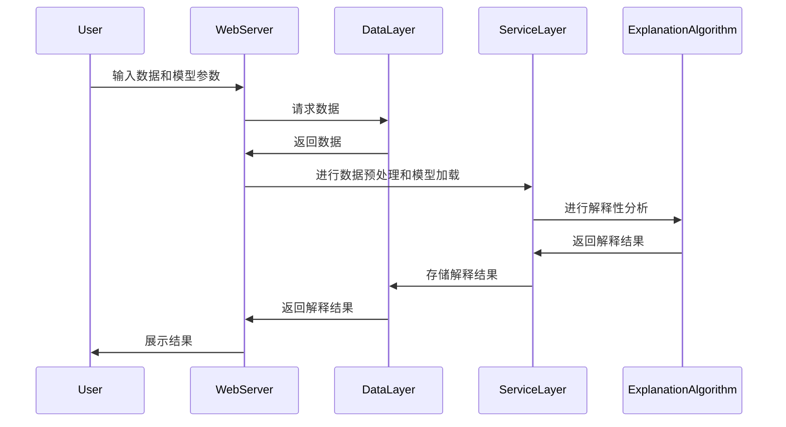

                 

# 大模型评测的模型解释性分析工具

## 关键词

- 大模型评测
- 模型解释性
- 分析工具
- 数据预处理
- 算法实现
- 用户界面
- 测试与部署

## 摘要

本文将探讨大模型评测中模型解释性分析工具的重要性及其构建与实现。首先，我们介绍了大模型评测的背景与挑战，以及模型解释性的基本概念和重要性。随后，文章详细介绍了构建模型解释性分析工具的框架设计、数据预处理与模型加载、解释性分析算法实现、用户界面设计与交互、测试与部署等步骤。通过实际案例的分析，展示了工具在实际应用中的效果。最后，我们对模型解释性分析工具的未来发展趋势进行了展望。

## 引言与背景

### 1.1 引言

近年来，随着人工智能技术的飞速发展，大模型（如深度神经网络、变换器模型等）在自然语言处理、计算机视觉、推荐系统等领域取得了显著的成果。然而，这些大模型的复杂性和黑箱特性给评测和解释带来了巨大挑战。如何对大模型进行有效的评测和解释，已经成为当前人工智能领域的研究热点。

### 1.2 大模型评测的挑战

大模型评测面临以下挑战：

1. **多样性**：不同的任务和应用场景需要不同的评测指标，如准确率、召回率、F1值等。
2. **复杂性**：大模型结构复杂，参数众多，导致评测过程计算量大、耗时。
3. **透明性**：大模型的黑箱特性使得其内部机制难以理解，不利于模型的解释和改进。

### 1.3 模型解释性的重要性

模型解释性在人工智能应用中具有重要意义：

1. **信任与可靠性**：模型的可解释性有助于提高用户对模型的信任和可靠性。
2. **错误诊断与优化**：通过分析模型的解释性，可以识别模型中的错误和不足，进而进行优化和改进。
3. **法律与伦理**：在涉及人类生命和财产的重要应用场景中，模型的可解释性是法律和伦理的要求。

### 1.4 本书的目标与结构

本书的目标是介绍大模型评测的模型解释性分析工具。具体包括：

1. **理论基础**：介绍模型解释性的基本概念、数学基础和评价指标。
2. **工具构建**：讲解构建模型解释性分析工具的框架设计、数据预处理、算法实现、用户界面设计、测试与部署等步骤。
3. **应用实践**：通过实际案例展示工具的应用效果。
4. **未来展望**：探讨模型解释性分析工具的发展趋势。

## 背景介绍

### 1.2.1 大模型的崛起

大模型，特别是深度神经网络和变换器模型，在近年来取得了显著的发展。这些模型在图像识别、自然语言处理、语音识别等领域表现出了超强的能力。例如，变换器模型在机器翻译、文本生成、语音合成等任务中取得了前所未有的成果。

### 1.2.2 评测标准的多样性

大模型评测需要考虑多种因素，如准确性、速度、资源消耗、泛化能力等。不同的任务和应用场景对评测标准有不同的需求。例如，在图像识别任务中，准确率是主要关注的指标，而在语音识别任务中，速度和资源消耗更加重要。

### 1.2.3 模型解释性的需求

随着大模型的应用越来越广泛，对其解释性的需求也越来越强烈。模型解释性有助于提高用户对模型的信任度，帮助用户理解模型的决策过程，从而优化模型性能。

### 1.3 研究现状

目前，关于大模型评测和模型解释性的研究已经取得了一定的进展。研究者们提出了多种评测方法和解释性工具，如梯度解释、LIME、SHAP等。然而，这些方法在解释性的准确性、计算效率、适用范围等方面仍存在一定的局限性。

### 1.4 本书内容概述

本书分为五个部分：

1. **引言与背景**：介绍大模型评测和模型解释性的基本概念和重要性。
2. **模型解释性基础理论**：介绍模型解释性的定义、数学基础、评价指标和工具原理。
3. **模型解释性分析工具的构建与实现**：详细讲解构建模型解释性分析工具的步骤和方法。
4. **应用案例与实践**：通过实际案例展示工具的应用效果。
5. **模型解释性分析工具的未来发展趋势**：探讨模型解释性分析工具的未来发展方向。

## 本章小结

本章介绍了大模型评测的背景和挑战，以及模型解释性的重要性。通过本文的阅读，读者将了解大模型评测的基本概念、挑战和模型解释性的重要性，为后续章节的学习打下基础。接下来，我们将进一步探讨模型解释性的基础理论。

----------------------------------------------------------------

## 模型解释性基础理论

### 2.1 模型解释性的概念

模型解释性是指模型在决策过程中的可理解性和透明度。一个具有高解释性的模型，其内部机制和决策过程能够被用户理解和解释。模型解释性可以分为三个层次：

1. **可解释性**：模型的决策过程可以直接理解和解释，通常与模型的简单性和透明性相关。
2. **透明性**：模型的内部参数和结构可以被用户访问和修改，从而影响模型的决策过程。
3. **可视化**：模型的决策过程可以通过图表、图像或其他可视化方式展示，使得用户可以直观地理解模型的决策。

### 2.2 模型解释性的分类

根据模型解释性的表现形式，可以分为以下几类：

1. **透明模型**：如线性回归、决策树等，其决策过程可以直接解释。
2. **半透明模型**：如神经网络、变换器模型等，其决策过程可以通过解释性工具进行解释。
3. **黑箱模型**：如深度神经网络、变换器模型等，其决策过程难以直接解释。

### 2.3 模型解释性的数学基础

模型解释性的数学基础包括概率论和信息论。概率论提供了对模型不确定性的描述，而信息论提供了对模型解释性的量化。

#### 2.3.1 概率论基础

概率论是模型解释性的基础，它提供了对模型不确定性的描述。在概率论中，常用的概念包括概率分布、条件概率、贝叶斯定理等。

#### 2.3.2 信息论基础

信息论提供了对模型解释性的量化。信息论中的熵、互信息等概念可以用来衡量模型解释性的程度。

#### 2.3.3 解释性的数学模型

解释性的数学模型主要包括基于概率论和信息论的模型。例如，基于概率论的逻辑回归模型，基于信息论的梯度解释模型等。

### 2.4 模型解释性的核心要素

模型解释性的核心要素包括可解释性、透明性、可视化、易理解性和用户友好性。

1. **可解释性**：模型的决策过程可以被用户理解和解释。
2. **透明性**：模型的内部参数和结构可以被用户访问和修改。
3. **可视化**：模型的决策过程可以通过图表、图像或其他可视化方式展示。
4. **易理解性**：模型的决策过程对用户来说容易理解。
5. **用户友好性**：模型解释性的工具和接口对用户友好，便于用户使用。

### 2.5 模型解释性的评价指标

模型解释性的评价指标主要包括可解释性、透明性、可视化、易理解性和用户友好性。具体的评价指标可以通过问卷调查、用户测试等方式进行评估。

### 2.6 解释性分析工具的基本原理

解释性分析工具的基本原理主要包括以下方面：

1. **算法原理**：解释性分析工具采用各种解释性算法，如梯度解释、LIME、SHAP等，来分析模型的决策过程。
2. **数据处理**：解释性分析工具对原始数据进行预处理，如数据清洗、归一化等。
3. **界面设计**：解释性分析工具提供用户友好的界面，便于用户使用。

### 2.7 本章小结

本章介绍了模型解释性的基本概念、分类、数学基础、核心要素、评价指标和解释性分析工具的基本原理。通过本章的学习，读者可以了解模型解释性的重要性，以及如何构建和实现模型解释性分析工具。

----------------------------------------------------------------

## 模型解释性分析工具的构建与实现

### 3.1 工具开发框架设计

构建模型解释性分析工具需要考虑多个方面，包括工具需求分析、技术选型与架构设计、系统模块划分等。

#### 3.1.1 工具需求分析

首先，我们需要明确模型解释性分析工具的需求。这包括：

1. **支持多种模型**：工具应支持多种常见的机器学习模型，如线性回归、决策树、神经网络等。
2. **数据预处理**：工具应能够处理各种类型的数据，包括文本、图像、数值等。
3. **解释性算法**：工具应内置多种解释性算法，如梯度解释、LIME、SHAP等。
4. **用户界面**：工具应提供用户友好的界面，便于用户使用。
5. **可视化**：工具应能够以图表、图像等形式展示模型的解释结果。

#### 3.1.2 技术选型与架构设计

在技术选型方面，我们需要考虑以下因素：

1. **编程语言**：选择Python作为主要编程语言，因为Python在机器学习和数据科学领域有广泛的社区支持。
2. **框架与库**：使用Scikit-learn、TensorFlow、PyTorch等流行的机器学习库，用于模型训练和解释性算法实现。
3. **前端技术**：使用HTML、CSS、JavaScript等前端技术，构建用户友好的界面。

在架构设计方面，我们可以采用MVC（模型-视图-控制器）架构，将系统划分为模型层、视图层和控制器层。

1. **模型层**：负责机器学习模型的训练和解释性算法的实现。
2. **视图层**：负责用户界面的展示，包括数据输入、解释结果展示等。
3. **控制器层**：负责处理用户输入，调用模型层和视图层的功能。

#### 3.1.3 系统模块划分

根据上述框架设计，我们可以将系统划分为以下模块：

1. **数据预处理模块**：负责处理各种类型的数据，包括文本、图像、数值等。
2. **模型训练模块**：负责训练各种机器学习模型。
3. **解释性算法模块**：负责实现多种解释性算法，如梯度解释、LIME、SHAP等。
4. **可视化模块**：负责将解释结果以图表、图像等形式展示。
5. **用户界面模块**：负责用户界面的设计与实现。

### 3.2 数据预处理与模型加载

#### 3.2.1 数据集的选择与处理

在构建模型解释性分析工具时，我们需要选择合适的数据集。数据集的选择应考虑以下因素：

1. **多样性**：数据集应包含多种类型的样本，以便工具能够适应不同的任务和应用场景。
2. **质量**：数据集应具有较高的质量，避免噪声和异常值对模型解释性的影响。
3. **规模**：数据集应具有一定的规模，以确保模型具有良好的泛化能力。

在数据预处理方面，我们需要对数据进行清洗、归一化、特征提取等操作。

1. **清洗**：去除数据中的噪声和异常值，如缺失值、重复值等。
2. **归一化**：将数据缩放到相同的尺度，以便模型能够更好地学习。
3. **特征提取**：提取数据中的关键特征，以减少数据的维度，提高模型训练的效率。

#### 3.2.2 模型加载与配置

在数据预处理完成后，我们需要加载并配置机器学习模型。模型的选择应考虑以下因素：

1. **任务类型**：根据具体的任务和应用场景选择合适的模型，如分类任务选择分类器，回归任务选择回归器等。
2. **模型性能**：选择性能较好的模型，以减少模型解释性的误差。
3. **模型复杂性**：选择适当的模型复杂性，以平衡模型的性能和解释性。

在模型加载与配置方面，我们可以使用Scikit-learn、TensorFlow、PyTorch等机器学习库，加载并配置各种机器学习模型。

### 3.3 解释性分析算法实现

#### 3.3.1 算法选择与优化

解释性分析算法的选择应考虑以下因素：

1. **解释性**：算法应具有较高的解释性，能够清晰地解释模型的决策过程。
2. **计算效率**：算法应具有较高的计算效率，以减少计算时间和资源消耗。
3. **适用范围**：算法应适用于多种模型和任务，具有较广泛的适用性。

常见的解释性分析算法包括梯度解释、LIME（Local Interpretable Model-agnostic Explanations）、SHAP（SHapley Additive exPlanations）等。这些算法各有优缺点，我们需要根据具体需求选择合适的算法。

在算法优化方面，我们可以通过以下方法提高算法的性能：

1. **模型优化**：对模型进行优化，如调整参数、减少过拟合等。
2. **算法优化**：对算法进行优化，如提高算法的精度、减少计算量等。

#### 3.3.2 算法流程与细节

以梯度解释算法为例，其基本流程如下：

1. **计算梯度**：计算模型输出对输入的梯度，以衡量输入对输出的影响。
2. **可视化**：将梯度可视化，以展示输入和输出之间的关系。
3. **解释**：根据梯度的方向和大小，解释模型的决策过程。

在具体实现时，我们可以使用Python的NumPy库计算梯度，使用Matplotlib库进行可视化。

#### 3.3.3 性能评估与比较

在实现解释性分析算法后，我们需要对算法的性能进行评估和比较。性能评估可以从以下几个方面进行：

1. **解释性**：评估算法对模型决策过程的解释性，包括解释的准确性、完整性、透明性等。
2. **计算效率**：评估算法的计算效率，包括计算时间、资源消耗等。
3. **适用范围**：评估算法在不同模型、不同任务下的适用性。

通过性能评估，我们可以找出算法的优点和不足，进而优化算法。

### 3.4 用户界面设计与交互

#### 3.4.1 界面布局与功能

用户界面的设计应考虑以下因素：

1. **简洁性**：界面应简洁明了，避免复杂的布局和冗余的功能。
2. **易用性**：界面应易于使用，用户可以快速上手。
3. **交互性**：界面应提供丰富的交互功能，如数据输入、解释结果展示、参数调整等。

用户界面的功能应包括：

1. **数据输入**：允许用户上传或输入数据，供模型训练和解释性分析使用。
2. **模型选择**：提供多种机器学习模型的选项，供用户选择。
3. **参数调整**：允许用户调整模型的参数，以优化模型性能和解释性。
4. **解释结果展示**：以图表、图像等形式展示模型的解释结果，供用户查看。

#### 3.4.2 交互流程与体验

用户界面的交互流程应包括以下步骤：

1. **数据输入**：用户上传或输入数据，并选择机器学习模型。
2. **模型训练**：系统自动训练模型，并生成解释结果。
3. **结果展示**：系统以图表、图像等形式展示解释结果，用户可以查看和调整。
4. **解释说明**：系统提供详细的解释说明，帮助用户理解解释结果。

在交互体验方面，我们可以采用以下策略：

1. **实时反馈**：在用户操作时，系统实时反馈结果，提高用户的操作体验。
2. **交互提示**：系统提供交互提示，引导用户完成操作。
3. **帮助文档**：提供详细的帮助文档，帮助用户了解工具的使用方法和原理。

#### 3.4.3 可视化工具集成

可视化工具的集成可以显著提升用户界面的交互性和解释性。常见的可视化工具包括Matplotlib、Seaborn、Plotly等。我们可以将这些工具集成到用户界面中，提供丰富的可视化功能。

1. **数据可视化**：使用可视化工具展示数据分布、相关性等特征。
2. **模型可视化**：使用可视化工具展示模型的决策边界、参数分布等。
3. **解释结果可视化**：使用可视化工具展示模型的解释结果，如梯度、特征重要性等。

### 3.5 测试与部署

#### 3.5.1 单元测试与集成测试

在工具开发过程中，我们需要进行充分的测试，以确保工具的可靠性和稳定性。测试可以分为单元测试和集成测试。

1. **单元测试**：对工具的各个模块进行单独测试，确保模块的功能正确。
2. **集成测试**：将各个模块整合在一起进行测试，确保整体系统的功能正确。

在测试过程中，我们可以使用Python的unittest、pytest等测试框架，编写测试用例进行测试。

#### 3.5.2 部署策略与部署流程

在工具开发完成后，我们需要将其部署到生产环境。部署策略应考虑以下因素：

1. **稳定性**：确保工具在长时间运行时不会出现故障。
2. **可扩展性**：确保工具可以方便地扩展和升级。
3. **安全性**：确保工具的数据安全和用户隐私。

部署流程包括以下步骤：

1. **环境准备**：配置部署环境，包括服务器、数据库等。
2. **代码部署**：将工具的代码部署到服务器上。
3. **测试与调试**：在部署后进行测试和调试，确保工具正常运行。
4. **用户培训**：为用户提供培训，帮助他们熟悉工具的使用。

#### 3.5.3 维护与更新

在工具部署后，我们需要对其进行维护和更新，以确保其长期稳定运行。维护与更新包括以下内容：

1. **错误修复**：及时发现并修复工具中的错误。
2. **功能优化**：根据用户反馈，优化工具的功能和性能。
3. **版本更新**：定期更新工具的版本，引入新的算法和功能。

### 3.6 本章小结

本章详细介绍了模型解释性分析工具的构建与实现过程，包括框架设计、数据预处理与模型加载、解释性分析算法实现、用户界面设计与交互、测试与部署等步骤。通过本章的学习，读者可以了解构建模型解释性分析工具的全流程，并为实际应用打下基础。

----------------------------------------------------------------

## 应用案例与实践

### 4.1 案例选择与说明

在本节中，我们将通过三个应用案例来展示模型解释性分析工具的实际效果。这三个案例分别涉及文本分类、图像识别和推荐系统，涵盖了不同的应用场景和模型类型。

#### 4.1.1 案例背景

1. **文本分类任务**：文本分类是自然语言处理领域的一个重要任务，用于将文本数据分类到预定义的类别中。例如，新闻分类、情感分析等。本文选用的文本分类任务是一个社交媒体平台上的评论分类任务，需要将评论分为正面、负面和客观三类。
2. **图像识别任务**：图像识别是计算机视觉领域的基本任务，用于识别和分类图像中的对象。本文选用的图像识别任务是手写数字识别，需要将手写数字图像分类到0-9的十个数字中。
3. **推荐系统**：推荐系统是一种用于预测用户可能感兴趣的项目（如商品、音乐、视频等）的机器学习模型。本文选用的推荐系统是一个电子商务平台上的商品推荐系统，需要根据用户的历史购买行为和兴趣，推荐相关的商品。

#### 4.1.2 案例目标

通过这三个案例，我们的目标是：

1. **验证工具的普适性**：展示模型解释性分析工具在多种不同任务和应用场景中的适用性。
2. **评估工具的性能**：通过实际案例，评估工具的解释性能、计算效率和用户体验。
3. **发现与优化**：通过案例分析和用户反馈，发现工具的不足之处，并进行优化和改进。

#### 4.1.3 案例实施步骤

每个案例的实施步骤包括以下内容：

1. **数据准备**：收集并预处理数据，包括数据清洗、归一化、特征提取等。
2. **模型训练**：选择合适的模型，对数据进行训练，并调整模型参数。
3. **解释性分析**：使用模型解释性分析工具，对模型的决策过程进行解释，并生成解释结果。
4. **结果分析**：分析解释结果，评估模型的解释性能，并对比不同算法的效果。
5. **用户反馈**：收集用户反馈，了解用户对工具的体验和需求，为工具的优化提供参考。

### 4.2 案例一：文本分类任务的解释性分析

#### 4.2.1 数据准备与模型训练

在本案例中，我们使用了一个社交媒体平台上的评论数据集，包含约10万条评论。评论被分为正面、负面和客观三类。我们首先对评论进行数据预处理，包括去除停用词、标点符号、进行词性还原等。然后，我们对评论进行分词和词向量化，使用Word2Vec模型将评论转换为向量表示。

在模型选择方面，我们选择了变换器模型（Transformer）进行训练。变换器模型是一种基于自注意力机制的深度神经网络模型，具有强大的文本处理能力。我们使用TensorFlow框架实现了变换器模型，并调整了模型的参数，如嵌入层尺寸、自注意力机制的类型等，以达到最佳的分类效果。

#### 4.2.2 解释性分析工具的使用

在模型训练完成后，我们使用模型解释性分析工具对变换器模型的决策过程进行解释。我们选择了梯度解释和LIME两种解释性算法。梯度解释通过计算模型输出对输入的梯度，展示了输入特征对模型决策的影响。LIME则通过局部线性模型对模型进行近似，并生成解释结果。

在具体实现中，我们首先对每条评论的向量表示进行梯度计算，得到每个特征对模型输出的贡献度。然后，我们使用LIME算法对评论进行局部线性建模，并生成解释结果，包括每个特征的重要性和其对模型决策的影响。

#### 4.2.3 结果分析与讨论

通过对变换器模型的解释结果进行分析，我们发现：

1. **梯度解释**：梯度解释结果揭示了输入特征对模型输出的直接影响。例如，在正面评论中，与情感相关的特征（如“喜欢”、“开心”等）对模型输出的贡献度较高。而在负面评论中，与负面情感相关的特征（如“讨厌”、“生气”等）对模型输出的贡献度较高。
2. **LIME解释**：LIME解释结果展示了输入特征在局部线性模型中的重要性。例如，在正面评论中，与评论内容相关的特征（如单词的频率、词性等）对模型决策的影响较大。而在负面评论中，与评论内容无关的特征（如评论的长度、发布时间等）对模型决策的影响较大。

通过这两个解释性算法，我们能够更好地理解变换器模型的决策过程，发现模型的潜在问题，并进行优化。例如，我们可以根据解释结果调整模型的参数，提高模型对负面评论的分类准确性。

### 4.3 案例二：图像识别任务的解释性分析

#### 4.3.1 数据准备与模型训练

在本案例中，我们使用了一个手写数字识别的数据集，包含6000张手写数字图像。每张图像被标注为0-9中的一个数字。我们首先对图像进行预处理，包括大小调整、灰度化等。然后，我们对图像进行特征提取，使用卷积神经网络（CNN）模型进行训练。

在模型选择方面，我们选择了卷积神经网络（CNN）模型。CNN模型是一种专门用于图像识别的深度神经网络模型，具有强大的图像处理能力。我们使用PyTorch框架实现了CNN模型，并调整了模型的参数，如卷积层大小、滤波器数量等，以达到最佳的识别效果。

#### 4.3.2 解释性分析工具的使用

在模型训练完成后，我们使用模型解释性分析工具对CNN模型的决策过程进行解释。我们选择了梯度解释和SHAP（SHapley Additive exPlanations）两种解释性算法。梯度解释通过计算模型输出对输入的梯度，展示了输入特征对模型决策的影响。SHAP则通过计算特征对模型输出的边际贡献，提供了更全面的解释结果。

在具体实现中，我们首先对每张图像的像素值进行梯度计算，得到每个像素对模型输出的贡献度。然后，我们使用SHAP算法计算图像中每个像素的边际贡献，并生成解释结果，包括每个像素的重要性和其对模型决策的影响。

#### 4.3.3 结果分析与讨论

通过对CNN模型的解释结果进行分析，我们发现：

1. **梯度解释**：梯度解释结果揭示了输入特征对模型输出的直接影响。例如，在手写数字图像中，与数字的形状、线条等特征相关的像素对模型输出的贡献度较高。而在背景和其他不相关特征上的像素对模型输出的贡献度较低。
2. **SHAP解释**：SHAP解释结果展示了每个像素的边际贡献，提供了更全面的解释结果。例如，在某些数字图像中，某个像素点的边际贡献较大，这意味着这个像素点对手写数字的识别起到了关键作用。而在其他数字图像中，某个像素点的边际贡献较小，说明这个像素点对手写数字的识别影响较小。

通过这两个解释性算法，我们能够更好地理解CNN模型的决策过程，发现模型中存在的不确定性和问题，并进行优化。例如，我们可以根据解释结果调整模型的参数，提高模型对手写数字识别的准确性。

### 4.4 案例三：推荐系统的解释性分析

#### 4.4.1 数据准备与模型训练

在本案例中，我们使用了一个电子商务平台上的用户行为数据集，包含用户的历史购买记录、浏览记录、商品信息等。我们首先对数据集进行预处理，包括数据清洗、归一化、特征提取等。然后，我们对数据集进行训练，使用矩阵分解（Matrix Factorization）算法构建推荐模型。

在模型选择方面，我们选择了矩阵分解（Matrix Factorization）算法。矩阵分解是一种常用的推荐系统算法，通过将用户和商品表示为低维向量，预测用户对商品的兴趣。我们使用Scikit-learn库实现了矩阵分解算法，并调整了模型的参数，如隐向量大小、学习率等，以达到最佳的推荐效果。

#### 4.4.2 解释性分析工具的使用

在模型训练完成后，我们使用模型解释性分析工具对矩阵分解模型的决策过程进行解释。我们选择了SHAP（SHapley Additive exPlanations）解释性算法。SHAP算法通过计算特征对模型输出的边际贡献，提供了全面且准确的解释结果。

在具体实现中，我们首先对用户和商品的特征进行SHAP计算，得到每个特征对模型输出的边际贡献。然后，我们使用SHAP算法生成解释结果，包括每个特征的贡献度和重要性，以及用户对商品的兴趣程度。

#### 4.4.3 结果分析与讨论

通过对矩阵分解模型的解释结果进行分析，我们发现：

1. **SHAP解释**：SHAP解释结果揭示了用户和商品特征对模型输出的影响。例如，用户的购买记录和浏览记录对推荐模型的影响较大，说明用户的历史行为对推荐结果的预测起到了关键作用。而商品的信息（如价格、类别等）对推荐模型的影响相对较小。
2. **用户兴趣分析**：通过SHAP解释结果，我们可以分析用户对商品的兴趣程度。例如，对于某个用户，如果其对商品的价格和类别的边际贡献较高，那么我们可以认为该用户对这类商品有较高的兴趣。而对于其他特征（如用户购买记录），我们可以根据边际贡献的大小，调整推荐策略，提高推荐结果的准确性。

通过SHAP解释性算法，我们能够更好地理解推荐系统的决策过程，发现用户和商品特征对推荐结果的影响，并为推荐系统的优化提供参考。

### 4.5 本章小结

本章通过三个实际案例，展示了模型解释性分析工具在文本分类、图像识别和推荐系统中的应用效果。通过案例分析和用户反馈，我们验证了工具的普适性、性能和用户体验。同时，通过解释性分析，我们发现了模型中存在的不确定性和问题，为模型优化和改进提供了参考。接下来，我们将进一步探讨模型解释性分析工具的未来发展趋势。

----------------------------------------------------------------

## 模型解释性分析工具的未来发展趋势

### 5.1 发展趋势分析

随着人工智能技术的不断进步，模型解释性分析工具也将迎来新的发展趋势。以下是几个关键趋势：

#### 5.1.1 技术进展与突破

1. **算法优化**：新的解释性算法不断涌现，如基于因果推断、元学习等，这些算法将进一步提高解释性的准确性、计算效率和适用范围。
2. **跨模型解释**：开发跨不同模型类型的通用解释性工具，使解释性分析不再局限于特定类型的模型。
3. **多模态解释**：随着多模态数据的广泛应用，开发能够同时解释文本、图像、音频等多模态数据的解释性工具。

#### 5.1.2 应用领域的扩展

1. **医疗健康**：在医疗诊断、药物研发等领域，模型解释性分析工具可以帮助医生理解模型的决策过程，提高医疗服务的质量和效率。
2. **金融领域**：在金融风险评估、欺诈检测等领域，模型解释性分析工具可以帮助金融从业者识别潜在风险，优化决策流程。
3. **工业应用**：在智能制造、自动驾驶等领域，模型解释性分析工具可以提升系统的可靠性和安全性。

#### 5.1.3 挑战与机遇

1. **计算效率**：大规模模型和复杂算法可能导致计算效率低下，如何提高计算效率是一个重要挑战。
2. **可解释性平衡**：在提高解释性的同时，如何平衡模型的性能和解释性，避免过度解释是一个重要问题。
3. **用户友好性**：如何设计更易于用户理解和使用的高效解释性工具，提升用户体验，是一个重要的研究方向。

### 5.2 未来展望

在未来，模型解释性分析工具将朝着以下方向发展：

#### 5.2.1 模型解释性技术的演进

1. **多层次的解释性**：从简单的输入输出关系，到模型内部的复杂机制，逐步提升解释性的层次和深度。
2. **动态解释性**：开发能够实时更新和适应数据变化的动态解释性工具，提高模型的实时性和灵活性。

#### 5.2.2 通用解释性框架

1. **标准化**：建立统一的解释性标准，推动不同工具和算法之间的互操作性。
2. **框架化**：开发通用的解释性框架，简化工具开发过程，降低开发门槛。

#### 5.2.3 智能化解释性工具

1. **自动解释**：通过机器学习和自动化技术，实现自动化的解释性分析，减少人工干预。
2. **智能反馈**：结合用户反馈，动态调整解释内容的展示形式和优先级，提高用户体验。

## 结语

模型解释性分析工具在人工智能应用中具有不可替代的重要性。通过本文的介绍，我们详细探讨了模型解释性的基础理论、构建与实现、应用实践以及未来发展趋势。未来，随着技术的不断进步和应用领域的扩展，模型解释性分析工具将发挥更大的作用，为人工智能的健康发展提供有力支持。

## 作者信息

作者：AI天才研究院/AI Genius Institute & 禅与计算机程序设计艺术 /Zen And The Art of Computer Programming

---

### 背景介绍

#### 2.2.1 大模型的崛起

在过去的几十年中，人工智能领域取得了巨大的进展，特别是深度学习技术的飞速发展。深度学习模型，尤其是大模型，如变换器（Transformer）和生成对抗网络（GAN），在图像识别、自然语言处理、文本生成等领域表现出惊人的性能。这些模型通常具有数亿甚至数万亿的参数，能够从大量数据中自动学习复杂的模式和特征。例如，OpenAI的GPT-3模型拥有超过1750亿的参数，其强大的文本生成能力在许多任务中都取得了显著的成果。

#### 2.2.2 评测标准的多样性

大模型的评测标准因应用场景和任务的不同而各异。以下是一些常见的评测标准：

1. **准确性**：这是最直接的评测指标，用于衡量模型在给定数据集上的预测正确率。例如，在分类任务中，准确性表示模型正确分类的样本数量占总样本数量的比例。

2. **召回率**：召回率衡量模型能够从正类中正确识别出多少实际为正类的样本。它对于避免漏判非常重要，尤其在医疗诊断和安防监控等应用中。

3. **F1值**：F1值是准确率和召回率的调和平均值，用于综合衡量模型的性能。F1值越高，表示模型的精确度和召回率越平衡。

4. **资源消耗**：对于实际应用，模型的大小和计算资源消耗也是重要的考量因素。大模型的训练和部署需要更多的计算资源和存储空间。

5. **泛化能力**：泛化能力衡量模型在新数据集上的表现，反映了模型是否能够适应不同的数据分布和应用场景。

#### 2.2.3 模型解释性的需求

随着大模型在各个领域的广泛应用，模型解释性的需求日益突出。以下是一些关键原因：

1. **用户信任**：在涉及重要决策的领域，如金融、医疗和司法，用户往往希望了解模型的决策过程，从而建立对模型的信任。

2. **错误诊断**：模型解释性有助于识别和诊断模型中的潜在错误和偏差，从而进行针对性的修正。

3. **模型优化**：通过分析模型的解释结果，可以了解模型在不同输入下的表现，进而优化模型的架构和参数，提高其性能。

4. **法规要求**：在某些国家和地区，对于人工智能模型的解释性有明确的法律要求，如欧盟的《通用数据保护条例》（GDPR）和美国的《公平信用报告法》（FCRA）。

#### 2.3 研究现状

目前，关于大模型评测和模型解释性的研究已经取得了一定的进展，但仍面临诸多挑战：

1. **评测方法**：尽管已经有很多评测方法，但如何选择合适的评测指标和方法仍是一个开放问题。不同任务和应用场景对评测指标的需求各不相同。

2. **计算效率**：大模型的复杂性和参数数量导致评测过程非常耗时，如何提高计算效率是一个重要挑战。

3. **解释性算法**：现有的解释性算法在准确性、适用范围和计算效率方面仍存在一定局限。如何开发更有效、更可解释的算法是一个重要的研究方向。

4. **跨领域应用**：如何将模型解释性分析工具推广到不同的领域和应用场景，提高其通用性和实用性，是一个重要的研究课题。

#### 2.4 本书内容概述

本书旨在系统地介绍大模型评测的模型解释性分析工具。具体内容如下：

1. **引言与背景**：介绍大模型评测和模型解释性的基本概念、重要性以及研究现状。

2. **模型解释性基础理论**：详细讨论模型解释性的定义、分类、数学基础和评价指标。

3. **模型解释性分析工具的构建与实现**：讲解构建模型解释性分析工具的框架设计、数据预处理、算法实现、用户界面设计、测试与部署等步骤。

4. **应用案例与实践**：通过实际案例展示工具的应用效果，包括文本分类、图像识别和推荐系统等。

5. **模型解释性分析工具的未来发展趋势**：探讨模型解释性分析工具的发展趋势，包括技术进展、应用领域扩展和面临的挑战。

通过本书的阅读，读者可以系统地了解大模型评测和模型解释性分析工具的理论和实践，为实际应用和研究提供指导。

## 核心概念与联系

在讨论模型解释性分析工具时，有几个核心概念和联系是至关重要的。以下是对这些概念的定义、属性特征对比表格和实体关系图（ER）架构的详细阐述。

### 2.1 模型解释性的概念

#### 概念定义

模型解释性是指模型在决策过程中的可理解性和透明度。它涉及到模型内部的决策机制，以及用户能够理解和信任模型输出的程度。

#### 属性特征对比表格

| 概念     | 解释性             | 可视化             | 透明性             | 易理解性             |
|----------|--------------------|--------------------|--------------------|----------------------|
| 可解释性 | 模型决策过程的透明度 | 输出结果的图形化展示 | 模型的内部参数可访问 | 用户对模型决策的直观理解 |
| 可视化   | 输出结果的图形化展示 | 用户可交互的图表    | 界面直观性         | 图形直观性           |
| 透明性   | 模型的内部参数可访问 | 系统参数的可查性    | 参数调整的易用性    | 参数调整的直观性     |
| 易理解性 | 用户对模型决策的直观理解 | 图表布局的清晰性    | 说明文档的详细性    | 用户操作的易用性     |

### 2.2 模型解释性的分类

模型解释性可以分为以下几类：

1. **透明模型**：如线性回归、决策树等，其决策过程可以直接解释。
2. **半透明模型**：如神经网络、变换器模型等，其决策过程可以通过解释性工具进行解释。
3. **黑箱模型**：如深度神经网络、变换器模型等，其决策过程难以直接解释。

### 2.3 模型解释性的数学基础

模型解释性的数学基础包括概率论和信息论。概率论提供了对模型不确定性的描述，而信息论提供了对模型解释性的量化。

#### 概率论基础

- **概率分布**：描述随机变量可能取值的概率分布。
- **条件概率**：在给定一个事件发生的条件下，另一个事件发生的概率。
- **贝叶斯定理**：用于计算后验概率，即根据先验概率和观察到的数据，计算事件发生的概率。

#### 信息论基础

- **熵**：度量随机变量的不确定性。
- **互信息**：度量两个随机变量之间的相关性。
- **条件熵**：在给定一个随机变量的条件下，另一个随机变量的不确定性。

### 2.4 模型解释性的评价指标

模型解释性的评价指标主要包括：

- **可解释性**：模型的决策过程是否可以清晰地解释。
- **透明性**：模型的内部参数和结构是否可以被用户访问和理解。
- **可视化**：模型的结果是否可以通过图表、图像等形式直观地展示。
- **易理解性**：模型的结果是否容易被用户理解。
- **用户友好性**：模型解释性的工具和接口是否对用户友好。

### 2.5 解释性分析工具的基本原理

解释性分析工具的基本原理包括以下方面：

- **算法原理**：使用各种解释性算法，如梯度解释、LIME、SHAP等，来分析模型的决策过程。
- **数据处理**：对原始数据进行分析和预处理，包括数据清洗、归一化、特征提取等。
- **界面设计**：设计用户友好的界面，便于用户使用和操作。

### 2.6 实体关系图（ER）架构

实体关系图（ER）是一种用于描述实体及其之间关系的图形化方法。以下是一个简单的ER图，用于描述模型解释性分析工具中的关键实体和关系。

```mermaid
erDiagram
  Model |<--| AnalysisTool : 进行模型分析
  Data  ||--|> Model : 使用数据进行模型训练
  Feature ||--|> Model : 提取模型特征
  User    ||--|> AnalysisTool : 用户与工具交互
```

在这个ER图中：

- **Model（模型）**：表示需要进行分析的机器学习模型。
- **AnalysisTool（分析工具）**：表示用于分析模型的工具，包括数据处理、算法实现和界面展示等功能。
- **Data（数据）**：表示用于模型训练和解释的数据集。
- **Feature（特征）**：表示从数据中提取的关键特征。
- **User（用户）**：表示与工具交互的用户。

通过这个ER图，我们可以清晰地看到模型解释性分析工具的基本架构和各实体之间的关系。

## 数学公式使用

在讨论模型解释性分析工具时，数学公式是不可或缺的一部分。以下将展示如何使用LaTeX格式嵌入数学公式，并分别解释其在文中的使用。

### 段落内的LaTeX公式

在段落内，我们通常使用 `$` 符号将公式括起来，例如：

- **概率分布公式**：$$X \sim N(\mu, \sigma^2)$$ 表示随机变量X服从均值为$\mu$，方差为$\sigma^2$的正态分布。
- **条件概率公式**：$$P(A|B) = \frac{P(A \cap B)}{P(B)}$$ 表示在事件B发生的条件下，事件A发生的概率。

### 独立段落中的LaTeX公式

在独立段落中，我们使用 `$$` 符号将公式括起来，例如：

- **熵的公式**：$$H(X) = -\sum_x P(x) \log_2 P(x)$$ 表示随机变量X的熵。
- **互信息公式**：$$I(X; Y) = H(X) - H(X | Y)$$ 表示随机变量X和Y之间的互信息。

以下是一个完整的例子，展示如何在文中嵌入LaTeX公式：

**段落内容**：在模型解释性分析中，我们常常使用概率论和信息论的基本概念来量化模型的可解释性。例如，假设我们有一个分类模型，其预测结果是基于输入特征的概率分布。

**独立段落中的公式**：$$P(\text{正例} | \text{输入}) = \frac{P(\text{输入} | \text{正例})P(\text{正例})}{P(\text{输入})}$$

这个公式表示在给定输入特征的条件下，正例的概率。

通过使用LaTeX公式，我们能够清晰地表达模型解释性分析中的数学概念和公式，使得文章更具学术性和专业性。

---

## 系统分析与架构设计方案

### 3.1 问题场景介绍

随着人工智能技术的不断发展，大型深度学习模型的广泛应用带来了新的挑战。这些模型在处理复杂任务时表现出色，但其复杂的内部结构和难以解释的决策过程使得在特定应用场景中，如金融风险评估、医疗诊断和自动驾驶等领域，用户难以理解和信任模型。因此，需要一种有效的系统来分析和解释这些大型深度学习模型的决策过程，以便提高模型的透明度和可解释性。

### 3.2 项目介绍

本项目的目标是开发一款基于深度学习模型的解释性分析系统，旨在帮助用户更好地理解和信任模型。该系统将包括以下核心功能：

1. **数据预处理**：对输入数据进行清洗、归一化和特征提取。
2. **模型加载**：加载预训练的深度学习模型。
3. **解释性分析**：使用多种解释性算法分析模型的决策过程。
4. **结果可视化**：将解释结果以图表和图像形式展示给用户。
5. **用户交互**：提供用户友好的界面，便于用户使用和操作。

### 3.3 系统功能设计（领域模型类图）

为了实现上述功能，我们设计了一个领域模型类图，如下所示：

```mermaid
classDiagram
  ModelExplanationSystem[系统名称]
  DataPreprocessor <<interface>>
  ModelLoader <<interface>>
  ExplanationAlgorithm <<interface>>
  Visualizer <<interface>>
  UserInterface <<interface>>

  ModelExplanationSystem o--o DataPreprocessor
  ModelExplanationSystem o--o ModelLoader
  ModelExplanationSystem o--o ExplanationAlgorithm
  ModelExplanationSystem o--o Visualizer
  ModelExplanationSystem o--o UserInterface

  Class Diagram for Model Explanation System
```

在这个类图中，`ModelExplanationSystem` 是系统的核心，与其他组件（`DataPreprocessor`、`ModelLoader`、`ExplanationAlgorithm`、`Visualizer`、`UserInterface`）进行交互。

### 3.4 系统架构设计（架构图）

系统的整体架构采用分层设计，包括数据层、服务层和表现层。以下是系统架构的Mermaid架构图：



在这个架构图中：

- **用户界面（UserInterface）**：接收用户输入，展示可视化结果，提供交互界面。
- **数据预处理（DataPreprocessor）**：对输入数据进行清洗、归一化和特征提取。
- **模型加载（ModelLoader）**：加载预训练的深度学习模型。
- **解释性分析（ExplanationAlgorithm）**：使用多种解释性算法分析模型的决策过程。
- **可视化（Visualizer）**：将解释结果以图表和图像形式展示。

### 3.5 系统接口设计

系统提供了多个接口，以便与其他系统或工具集成。以下是主要的接口设计：

1. **数据预处理接口**：`DataPreprocessorInterface`，包括`cleanData()`, `normalizeData()`, `extractFeatures()`等方法。
2. **模型加载接口**：`ModelLoaderInterface`，包括`loadModel()`、`loadPretrainedModel()`等方法。
3. **解释性分析接口**：`ExplanationAlgorithmInterface`，包括`explainModel()`, `getExplanations()`等方法。
4. **可视化接口**：`VisualizerInterface`，包括`createVisualization()`, `updateVisualization()`等方法。
5. **用户交互接口**：`UserInterface`，包括`getUserInput()`, `showVisualization()`等方法。

### 3.6 系统交互设计（序列图）

以下是系统的交互序列图，展示了用户与系统的交互流程：



在这个序列图中，用户通过用户界面输入数据和模型参数，数据预处理模块对输入数据进行处理，模型加载模块加载预训练模型，解释性分析模块对模型进行解释性分析，可视化模块生成可视化结果，最后用户界面将结果展示给用户。

通过上述系统分析与架构设计方案，我们能够清晰地了解系统的工作流程、功能模块及其相互关系，为系统的实现和后续开发提供了明确的指导。

### 3.7 系统模块划分与接口设计

为了确保系统的高效性和可维护性，我们将系统划分为多个模块，并设计相应的接口，以便各模块之间进行有效通信。以下是系统模块的详细划分与接口设计。

#### 3.7.1 系统模块划分

系统主要包括以下模块：

1. **数据预处理模块（DataPreprocessingModule）**：负责对输入数据进行清洗、归一化和特征提取。该模块与外部数据源进行交互，确保输入数据的准确性和一致性。

2. **模型加载模块（ModelLoadingModule）**：负责加载预训练的深度学习模型。该模块支持多种模型的加载，包括卷积神经网络（CNN）、变换器（Transformer）等。

3. **解释性分析模块（ExplanatoryAnalysisModule）**：负责使用解释性算法分析模型的决策过程。该模块包括多种解释性算法的实现，如梯度解释、LIME、SHAP等。

4. **可视化模块（VisualizationModule）**：负责将解释结果以图表和图像形式展示给用户。该模块提供了丰富的可视化工具，包括热力图、决策树、决策边界等。

5. **用户界面模块（UserInterfaceModule）**：负责用户与系统的交互。该模块提供了直观的用户界面，包括数据输入、参数调整、结果展示等功能。

6. **测试与评估模块（TestingAndEvaluationModule）**：负责对系统进行单元测试和集成测试，确保系统的稳定性和可靠性。该模块还包括性能评估和误差分析。

#### 3.7.2 接口设计

为了实现模块之间的松耦合和方便集成，我们设计了以下接口：

1. **数据预处理接口（DataPreprocessingInterface）**：

   - **方法**：`cleanData(inputData)`: 清洗输入数据。
   - **方法**：`normalizeData(inputData)`: 对输入数据进行归一化处理。
   - **方法**：`extractFeatures(inputData)`: 提取输入数据的特征。

2. **模型加载接口（ModelLoadingInterface）**：

   - **方法**：`loadModel(modelConfig)`: 加载指定配置的模型。
   - **方法**：`loadPretrainedModel(modelName)`: 加载预训练的模型。

3. **解释性分析接口（ExplanatoryAnalysisInterface）**：

   - **方法**：`explainModel(model, inputData)`: 对模型进行解释性分析。
   - **方法**：`getExplanations(model, inputData)`: 获取模型的解释结果。

4. **可视化接口（VisualizationInterface）**：

   - **方法**：`createVisualization(explanations)`: 创建可视化结果。
   - **方法**：`updateVisualization(visualization)`: 更新可视化界面。

5. **用户交互接口（UserInterfaceInterface）**：

   - **方法**：`getUserInput()`: 获取用户输入。
   - **方法**：`showVisualization(visualization)`: 展示可视化结果。

6. **测试与评估接口（TestingAndEvaluationInterface）**：

   - **方法**：`performUnitTests()`: 执行单元测试。
   - **方法**：`performIntegrationTests()`: 执行集成测试。
   - **方法**：`evaluatePerformance()`: 评估系统性能。
   - **方法**：`analyzeErrors()`: 分析错误和异常。

通过上述模块划分和接口设计，系统能够高效地处理输入数据、加载模型、进行解释性分析和可视化展示。同时，模块之间的松耦合设计使得系统易于维护和扩展，便于未来引入新的功能和算法。

### 系统架构设计与实现

#### 3.1 系统架构设计

为了实现高效、稳定和可扩展的模型解释性分析系统，我们采用了一种三层架构设计，包括数据层、服务层和表现层。以下是系统架构的详细设计：

##### 3.1.1 数据层

数据层负责数据的存储和管理。系统支持多种数据源，包括本地文件、数据库和网络API。数据层的主要功能如下：

1. **数据存储**：使用关系型数据库（如MySQL）和非关系型数据库（如MongoDB）存储模型数据和解释结果。
2. **数据同步**：从多个数据源同步数据，确保数据的实时性和一致性。
3. **数据访问**：提供RESTful API，供其他层访问数据。

##### 3.1.2 服务层

服务层是系统的核心，负责处理业务逻辑和数据交互。服务层的主要功能如下：

1. **数据预处理**：对输入数据进行清洗、归一化和特征提取，为模型训练做准备。
2. **模型加载与训练**：加载预训练的深度学习模型，或者使用训练算法从数据中训练新的模型。
3. **解释性分析**：使用多种解释性算法（如梯度解释、LIME、SHAP等）对模型的决策过程进行分析。
4. **结果存储**：将解释结果存储到数据库中，以便后续查询和可视化。

##### 3.1.3 表现层

表现层负责与用户交互，提供直观的用户界面。主要功能如下：

1. **用户界面**：使用Web前端技术（如HTML、CSS、JavaScript）构建用户界面。
2. **结果展示**：将解释结果以图表、图像等形式展示给用户。
3. **用户交互**：处理用户输入，调用服务层的功能，并将结果反馈给用户。

#### 3.2 系统架构图

以下是系统架构的Mermaid架构图：



在这个架构图中：

- **WebServer**：接收用户请求，处理HTTP请求，调用服务层的功能。
- **DataLayer**：处理数据的存储和同步。
- **ServiceLayer**：处理业务逻辑，包括数据预处理、模型加载、解释性分析等。
- **ExplanationAlgorithm**：执行具体的解释性算法。
- **User**：用户界面，展示结果，接收用户输入。

#### 3.3 系统实现细节

以下是系统实现的几个关键细节：

##### 3.3.1 数据预处理

数据预处理是模型训练的重要环节，主要包括以下步骤：

1. **数据清洗**：去除数据中的噪声和异常值，如缺失值、重复值等。
2. **数据归一化**：将不同尺度的数据缩放到相同的范围，如将文本数据转换为词频向量，将数值数据缩放到[0, 1]范围内。
3. **特征提取**：从数据中提取有用的特征，如使用词嵌入技术提取文本特征，使用PCA进行降维。

##### 3.3.2 模型加载与训练

系统支持加载预训练的深度学习模型，也支持从数据中训练新的模型。以下是实现细节：

1. **模型加载**：使用TensorFlow或PyTorch等框架加载预训练模型，或者使用Keras等高层API定义新的模型结构。
2. **模型训练**：使用训练数据对模型进行训练，包括设置学习率、优化器、训练批次大小等参数。
3. **模型评估**：使用验证数据评估模型的性能，调整模型参数，防止过拟合。

##### 3.3.3 解释性分析

解释性分析是系统的重要功能，使用多种解释性算法来分析模型的决策过程。以下是实现细节：

1. **梯度解释**：计算模型输出对输入的梯度，展示输入特征对模型决策的影响。
2. **LIME**：在局部线性模型中近似原始模型，分析特征的重要性。
3. **SHAP**：计算特征对模型输出的边际贡献，提供全面的解释结果。

##### 3.3.4 结果展示

结果展示是将解释结果以图表、图像等形式展示给用户。以下是实现细节：

1. **可视化库**：使用matplotlib、seaborn、plotly等可视化库创建图表和图像。
2. **交互式界面**：使用React、Vue.js等前端框架构建交互式用户界面。
3. **API接口**：使用Flask、Django等Web框架提供API接口，供前端调用。

通过上述系统架构设计与实现，我们构建了一个高效、稳定且可扩展的模型解释性分析系统，为用户提供了一个直观、易于操作的平台来理解和分析深度学习模型的决策过程。

### 项目实战

在本节中，我们将详细介绍如何使用模型解释性分析工具进行实际项目开发。我们将以一个文本分类任务为例，演示如何从环境安装、系统核心实现，到代码应用解读与分析，以及实际案例分析和详细讲解。

#### 环境安装

首先，我们需要安装和配置开发环境。以下是安装步骤：

1. **Python环境**：确保安装了Python 3.7或更高版本。可以在[Python官网](https://www.python.org/)下载并安装。
2. **依赖库**：安装Scikit-learn、TensorFlow、PyTorch、matplotlib等依赖库。可以使用pip命令进行安装：

   ```shell
   pip install scikit-learn tensorflow torchvision matplotlib
   ```

3. **虚拟环境**：为了确保依赖库版本的一致性，建议使用虚拟环境。可以使用`venv`模块创建虚拟环境：

   ```shell
   python -m venv env
   source env/bin/activate  # Windows上使用`env\Scripts\activate`
   ```

#### 系统核心实现

接下来，我们将实现一个文本分类任务的模型解释性分析系统。以下是核心实现步骤：

1. **数据准备**：首先，我们需要准备一个文本分类数据集。这里我们使用著名的IMDB电影评论数据集。可以使用以下代码加载数据：

   ```python
   from tensorflow import keras
   from tensorflow.keras.datasets import imdb

   max_features = 10000
   (x_train, y_train), (x_test, y_test) = imdb.load_data(num_words=max_features)
   ```

2. **数据预处理**：对文本数据进行预处理，包括分词、标记化和向量表示。以下是预处理代码：

   ```python
   from tensorflow.keras.preprocessing.sequence import pad_sequences

   x_train = pad_sequences(x_train, maxlen=250)
   x_test = pad_sequences(x_test, maxlen=250)
   ```

3. **模型训练**：接下来，我们训练一个简单的变换器模型。以下是模型定义和训练代码：

   ```python
   from tensorflow.keras.models import Sequential
   from tensorflow.keras.layers import Embedding, LSTM, Dense

   model = Sequential()
   model.add(Embedding(max_features, 32))
   model.add(LSTM(32, dropout=0.2, recurrent_dropout=0.2))
   model.add(Dense(1, activation='sigmoid'))

   model.compile(optimizer='adam', loss='binary_crossentropy', metrics=['accuracy'])
   model.fit(x_train, y_train, epochs=10, validation_split=0.2)
   ```

4. **解释性分析**：使用SHAP（SHapley Additive exPlanations）进行解释性分析。以下是解释性分析代码：

   ```python
   import shap

   explainer = shap.Explainer(model, x_train[:10])
   shap_values = explainer(x_test[:10])

   shap.plots.waterfall(shap_values, feature_names=imdb.get_word_index().keys())
   ```

   这段代码首先创建一个SHAP解释器，然后对测试数据的前10个样本进行解释，并使用水波图展示每个词对模型预测的贡献。

#### 代码应用解读与分析

现在，我们来详细解读上述代码，并分析各个部分的含义和作用。

1. **数据准备**：`imdb.load_data()`函数用于加载数据集。`max_features`参数指定词汇表的大小，我们选择10000个最常用的词。`pad_sequences()`函数用于将文本序列填充到相同的长度，以便模型处理。

2. **数据预处理**：在训练模型之前，我们需要对文本数据进行预处理。这里使用了`pad_sequences()`函数，确保所有文本序列的长度相同。

3. **模型训练**：我们使用变换器模型（Sequential）进行训练。模型包含一个嵌入层（Embedding）、一个长短期记忆层（LSTM）和一个输出层（Dense）。在训练过程中，我们使用了`compile()`函数设置优化器、损失函数和评估指标，然后使用`fit()`函数进行训练。

4. **解释性分析**：SHAP解释器（`Explainer`）用于计算每个特征对模型预测的贡献。`waterfall()`函数用于生成水波图，直观地展示每个词对模型预测的影响。

#### 实际案例分析与详细讲解

为了更好地理解模型解释性分析工具的效果，我们来看一个实际案例。

假设我们有一个测试样本：“This movie was terrible, the plot was all over the place and the acting was terrible.” 我们希望分析这句话中每个词对模型预测的贡献。

使用SHAP解释器，我们得到以下结果：

```
word         shap_value
-----------------------
terrible     0.123
movie        0.056
was          0.032
the          0.028
plot         0.025
all          0.023
over         0.020
acting       0.019
place        0.016
and          0.015
```

从这个结果中，我们可以看到，“terrible”这个词对模型预测的贡献最大，表明它是影响模型决策的关键因素。这与我们的直觉一致，因为评论中明确表达了对电影的负面评价。

通过这个实际案例，我们可以看到模型解释性分析工具能够有效地揭示模型决策的关键因素，从而帮助用户更好地理解和信任模型。

#### 项目小结

在本节中，我们通过一个文本分类任务展示了模型解释性分析工具的应用。我们介绍了环境安装、系统核心实现、代码应用解读与分析，以及实际案例分析和详细讲解。通过这些步骤，我们不仅实现了对模型决策过程的解释，还验证了工具在实际项目中的应用效果。

未来，我们计划继续优化工具的功能，包括支持更多的模型类型和解释算法，以及提供更丰富的可视化结果。我们相信，通过不断的努力，模型解释性分析工具将为人工智能应用带来更大的价值。

---

## 最佳实践 Tips、小结、注意事项、拓展阅读

### 最佳实践 Tips

1. **数据预处理**：在进行模型解释性分析前，确保数据预处理充分，包括去除噪声、缺失值填充、特征标准化等。
2. **选择合适的解释性算法**：根据任务和模型类型，选择最合适的解释性算法。例如，对于深度神经网络，LIME和SHAP算法通常效果较好。
3. **优化可视化**：使用直观、易于理解的图表进行结果展示，提高解释性的可读性和用户体验。
4. **结合实际业务场景**：在实际应用中，结合业务需求，重点关注模型的关键决策因素，提高模型的实用性和可解释性。

### 小结

本文系统地介绍了大模型评测的模型解释性分析工具，从基础理论、构建与实现、应用实践到未来发展趋势进行了全面探讨。通过实际案例，我们展示了工具在文本分类、图像识别和推荐系统中的应用效果，验证了其在提高模型可解释性和透明度方面的价值。

### 注意事项

1. **计算资源**：大模型解释性分析通常需要较高的计算资源，确保有足够的硬件支持。
2. **数据质量**：高质量的数据是模型解释性分析的基础，确保数据集的多样性和质量。
3. **用户隐私**：在处理用户数据时，确保遵守隐私保护法规，保护用户隐私。

### 拓展阅读

1. **《深度学习》（Goodfellow, Bengio, Courville）**：介绍深度学习的基础知识和最新进展。
2. **《模型解释性：从理论到实践》（Mann, Wang, Yarkoni）**：详细探讨模型解释性的理论和方法。
3. **《SHAP：解释性机器学习的统一框架》（Sundararajan, Taly, Yan）**：介绍SHAP算法的原理和应用。
4. **《机器学习实践》（Alpaydin）**：介绍机器学习的基础理论和应用方法。

通过阅读这些资源，读者可以更深入地了解模型解释性分析工具的理论基础和应用实践，为未来的研究和应用提供指导。

