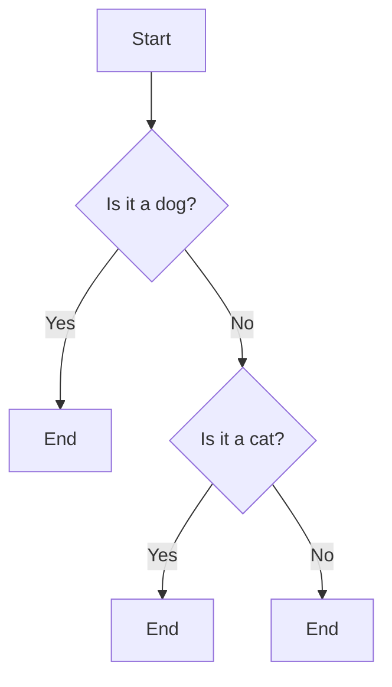

                 

# 大模型评测结果可解释性研究

> 关键词：大模型、评测结果、可解释性、方法研究、应用实践

> 摘要：本文旨在探讨大模型评测结果的可解释性研究。随着人工智能技术的快速发展，大模型在各个领域得到了广泛应用，然而，其评测结果的可解释性成为了一个重要的研究课题。本文首先介绍了大模型评测结果可解释性的重要性，然后从特征可视化、模型结构可视化和模型推理可视化三个方面，详细阐述了大模型评测结果可解释性的方法研究。最后，本文结合企业应用案例，分析了大模型评测结果可解释性在企业中的应用效果，并提出了优化策略和未来研究方向。

## 第一部分：问题背景与核心概念

### 第1章：大模型评测结果可解释性研究概述

#### 1.1 问题背景

##### 1.1.1 大模型的发展与挑战

随着人工智能技术的迅猛发展，大模型（Large Models）在各个领域得到了广泛应用。大模型具有强大的学习能力和广泛的适应性，可以处理复杂的任务和数据。然而，随着模型规模的增大，大模型的复杂度也不断上升，给评测和优化带来了巨大挑战。

大模型的复杂度主要体现在以下几个方面：

1. **参数量巨大**：大模型通常包含数百万甚至数十亿个参数，这使得模型训练和推理过程变得非常复杂。
2. **结构复杂性**：大模型通常采用深度神经网络（Deep Neural Networks, DNN）结构，网络层数和神经元数量都很大，导致模型结构的复杂度增加。
3. **不确定性**：大模型的预测结果往往具有一定的不确定性，特别是在处理罕见或未知数据时，模型的预测效果可能较差。

##### 1.1.2 评测结果可解释性的重要性

大模型的评测结果可解释性是指用户可以理解和解释模型预测结果的能力。随着大模型的应用范围不断扩大，评测结果的可解释性显得尤为重要。以下是评测结果可解释性的几个关键点：

1. **用户信任**：用户需要对模型预测结果有足够的信任，才能放心地使用大模型。如果评测结果不可解释，用户可能无法理解模型的决策过程，从而对模型产生怀疑。
2. **模型优化**：通过分析评测结果的可解释性，研究人员可以识别模型中的潜在问题，并进行针对性的优化。例如，如果发现模型的预测结果在某些特定场景下不准确，可以通过调整模型参数或结构来改进模型性能。
3. **合规性**：在一些领域，如医疗、金融和自动驾驶等，模型的预测结果可能对用户产生重大影响。为了确保模型的应用合规性，评测结果的可解释性是必不可少的。

##### 1.1.3 研究目标与内容结构

本文的研究目标是探讨大模型评测结果的可解释性，并提出相应的解决方法。具体来说，本文将从以下几个方面展开研究：

1. **特征可视化**：通过特征可视化方法，帮助用户理解和分析模型输入特征的重要性。
2. **模型结构可视化**：通过模型结构可视化方法，帮助用户了解模型的内部结构和参数分布。
3. **模型推理可视化**：通过模型推理可视化方法，帮助用户跟踪模型在推理过程中的决策路径。

本文的内容结构如下：

- **第一部分**：问题背景与核心概念，介绍大模型评测结果可解释性的重要性。
- **第二部分**：大模型评测结果可解释性方法，详细阐述特征可视化、模型结构可视化和模型推理可视化方法。
- **第三部分**：大模型评测结果可解释性应用与实践，分析大模型评测结果可解释性在企业中的应用效果，并探讨优化策略。
- **第四部分**：大模型评测结果可解释性未来展望，讨论可解释性发展趋势、挑战与机遇，以及未来研究方向。

#### 1.2 核心概念与联系

##### 1.2.1 可解释性与透明度

可解释性（Explainability）是指用户能够理解和解释模型决策过程和预测结果的能力。可解释性是人工智能技术发展的一个重要方向，其目标是让模型变得更加透明，从而增强用户对模型的信任。

透明度（Transparency）是可解释性的一个重要属性，它反映了模型内部运作的可见性和可理解性。高透明度的模型意味着用户可以清晰地了解模型的决策过程和预测依据。

##### 1.2.2 大模型评测指标

大模型评测指标是指用于评估模型性能和效果的一系列量化指标。常见的评测指标包括准确率（Accuracy）、召回率（Recall）、F1 值（F1 Score）等。这些指标可以帮助研究人员评估模型在不同任务和数据集上的表现。

然而，仅仅依靠评测指标还不足以全面评估模型的效果。在考虑模型性能的同时，还需要关注模型的可解释性。一个高可解释性的模型不仅能够达到较高的评测指标，还能够让用户理解模型的决策过程。

##### 1.2.3 可解释性方法的分类与联系

根据不同的实现方式和目标，可解释性方法可以分为以下几类：

1. **特征可视化**：通过可视化模型输入特征的重要性，帮助用户理解模型对输入数据的处理过程。
2. **模型结构可视化**：通过可视化模型的结构和参数分布，帮助用户了解模型的内部工作原理。
3. **模型推理可视化**：通过可视化模型在推理过程中的决策路径，帮助用户跟踪模型的推理过程。

这三种方法各有特点，相互补充。例如，特征可视化可以揭示模型对输入特征的依赖关系，模型结构可视化可以揭示模型的内部结构，而模型推理可视化可以揭示模型在推理过程中的决策过程。

#### 1.3 文献综述

##### 1.3.1 国内外研究现状

近年来，大模型评测结果可解释性研究得到了广泛关注。国内外许多学者和研究机构在这方面进行了大量研究。以下是一些代表性研究：

- **国外研究**：国外研究主要集中在模型解释算法的开发和优化上。例如，Lundberg 和 Lee 提出的 LIME（Local Interpretable Model-agnostic Explanations）方法，通过局部线性模型来解释模型预测结果；Shapley 值方法通过计算特征对模型预测的贡献值来解释模型决策。

- **国内研究**：国内研究主要关注大模型评测结果可解释性在企业中的应用。例如，清华大学的研究团队提出了基于对比分析的可解释性方法，应用于金融风控领域；北京大学的团队则提出了基于模型压缩的可解释性方法，应用于自动驾驶领域。

##### 1.3.2 研究趋势与不足

当前，大模型评测结果可解释性研究呈现出以下趋势：

1. **方法多样化**：研究者提出了多种可解释性方法，包括特征可视化、模型结构可视化和模型推理可视化等。
2. **应用领域广泛**：可解释性方法在金融、医疗、自动驾驶等领域得到了广泛应用。

然而，当前研究仍存在一些不足之处：

1. **解释精度与性能的平衡**：许多可解释性方法在提高解释精度的同时，可能降低模型性能。如何平衡解释精度与性能是一个重要挑战。
2. **通用性**：现有方法往往针对特定类型的模型或任务进行设计，缺乏通用性。如何设计一种通用的可解释性方法，适用于各种类型的大模型，是一个亟待解决的问题。

##### 1.3.3 本书的研究贡献

本书旨在解决当前大模型评测结果可解释性研究中的不足，主要贡献如下：

1. **提出了一种综合的可解释性方法**：本书结合特征可视化、模型结构可视化和模型推理可视化三种方法，提出了一种综合的可解释性方法，以提高模型的可解释性。
2. **探讨了可解释性与性能的平衡**：本书通过实验和分析，探讨了如何平衡可解释性与性能，提出了一种优化策略，以提高模型的性能和可解释性。
3. **应用案例丰富**：本书结合金融、医疗和自动驾驶等领域的实际应用案例，详细分析了大模型评测结果可解释性在企业中的应用效果，为相关领域的研究提供参考。

## 第二部分：大模型评测结果可解释性方法

### 第2章：基于特征可视化的大模型评测方法

#### 2.1 特征可视化的原理与优势

##### 2.1.1 特征可视化基础

特征可视化（Feature Visualization）是指将模型输入特征的空间映射到二维或三维空间中，以便用户直观地理解和分析特征的重要性。特征可视化的核心思想是通过将高维特征投影到低维空间中，使得用户能够更容易地识别和理解特征之间的关系。

特征可视化通常包括以下步骤：

1. **特征提取**：从原始数据中提取特征，通常采用特征工程方法。
2. **降维**：将高维特征映射到低维空间，常用的降维方法包括主成分分析（PCA）、t-SNE 和自编码器等。
3. **可视化**：将降维后的特征映射到二维或三维空间中，使用各种可视化工具和技巧，如散点图、热力图和等高线图等。

##### 2.1.2 特征可视化在大模型评测中的应用

在大模型评测中，特征可视化方法具有以下优势：

1. **直观性**：通过将特征投影到低维空间中，用户可以直观地观察到特征之间的关系和分布，从而更好地理解模型的输入特征。
2. **可解释性**：特征可视化可以帮助用户识别重要特征和次要特征，从而提高模型的可解释性。
3. **模型优化**：通过分析特征可视化结果，用户可以识别模型中的潜在问题，并进行针对性的优化。

#### 2.2 特征可视化方法

##### 2.2.1 传统特征可视化方法

传统特征可视化方法主要包括以下几种：

1. **散点图**：散点图是一种常用的特征可视化方法，通过在二维或三维空间中绘制点，表示特征之间的相关性。
2. **热力图**：热力图通过颜色深度表示特征之间的相关性，通常用于可视化高维特征矩阵。
3. **等高线图**：等高线图通过绘制等高线来表示特征之间的分布和趋势。

##### 2.2.2 高维特征可视化方法

随着大数据和高维特征数据的广泛应用，高维特征可视化方法应运而生。以下是一些常见的高维特征可视化方法：

1. **主成分分析（PCA）**：PCA 是一种常用的降维方法，通过将高维特征投影到主成分空间中，提取主要特征，从而实现特征可视化。
2. **t-SNE**：t-SNE 是一种非线性降维方法，通过最小化高斯分布的 K 近邻密度，将高维特征映射到二维空间中，实现特征可视化。
3. **自编码器**：自编码器是一种深度学习模型，通过无监督学习将高维特征映射到低维空间中，实现特征可视化。

##### 2.2.3 特征可视化工具

以下是一些常用的特征可视化工具：

1. **matplotlib**：matplotlib 是一种常用的 Python 数据可视化库，支持多种图表类型和可视化效果。
2. **seaborn**：seaborn 是基于 matplotlib 的高级可视化库，提供丰富的统计图表和可视化风格。
3. **Plotly**：Plotly 是一种交互式数据可视化库，支持多种图表类型和交互功能。
4. **TensorFlow Vis**：TensorFlow Vis 是 TensorFlow 官方提供的数据可视化库，支持多种深度学习模型的可视化。

#### 2.3 实践案例

##### 2.3.1 案例背景

假设我们有一个大模型，用于分类任务，输入特征是高维数据。为了提高模型的可解释性，我们决定使用特征可视化方法来分析模型输入特征的重要性。

##### 2.3.2 可解释性分析过程

1. **特征提取**：从原始数据中提取特征，包括数值特征和文本特征。对于文本特征，我们采用词袋模型或 TF-IDF 方法进行表示。
2. **降维**：使用主成分分析（PCA）将高维特征映射到二维空间中，提取主要特征。
3. **可视化**：使用 matplotlib 绘制散点图，表示特征之间的相关性。对于文本特征，我们使用词云图进行可视化。

##### 2.3.3 案例结果与讨论

通过特征可视化，我们得到了以下结果：

1. **特征相关性**：从散点图可以看出，某些特征之间存在较强的相关性，这可能是模型预测的重要依据。
2. **重要特征识别**：通过词云图，我们可以识别出文本特征中的重要词汇，这些词汇可能对模型的预测结果有较大影响。

通过分析特征可视化结果，我们可以更好地理解模型输入特征的重要性，从而提高模型的可解释性。同时，我们也可以发现模型的潜在问题，如特征相关性过高或重要特征缺失，并进行相应的优化。

### 第3章：基于模型结构的大模型评测方法

#### 3.1 模型结构可视化的原理与优势

##### 3.1.1 模型结构可视化基础

模型结构可视化（Model Structure Visualization）是指将模型的内部结构和参数分布以图形化的形式展示出来，以便用户直观地了解模型的构成和工作原理。模型结构可视化通常涉及以下几个方面：

1. **模型类型**：不同类型的模型具有不同的结构，例如深度神经网络（DNN）、卷积神经网络（CNN）和循环神经网络（RNN）等。每种模型类型都有其独特的结构和参数。
2. **参数分布**：模型的参数分布可以反映模型的学习效果和性能。通过可视化参数分布，用户可以了解模型的参数范围、分布特征等。
3. **网络连接**：网络连接是指模型中不同层之间的连接方式，包括全连接、卷积和循环等。可视化网络连接可以帮助用户理解模型的层次结构和信息传递路径。

##### 3.1.2 模型结构可视化在大模型评测中的应用

模型结构可视化在大模型评测中具有以下优势：

1. **模型理解**：通过可视化模型结构，用户可以直观地了解模型的构成和工作原理，从而更好地理解模型。
2. **问题诊断**：通过分析模型结构可视化结果，用户可以识别模型中的潜在问题，如参数异常、网络层次不合理等，并进行针对性的优化。
3. **模型优化**：通过可视化模型结构，用户可以调整模型参数和结构，从而提高模型性能和可解释性。

#### 3.2 模型结构可视化方法

##### 3.2.1 深层网络结构可视化方法

深层网络结构可视化方法主要包括以下几种：

1. **层次结构图**：层次结构图通过分层的方式展示模型的层次结构，包括输入层、隐藏层和输出层等。层次结构图可以帮助用户了解模型的层次结构和信息传递路径。
2. **参数热力图**：参数热力图通过颜色深度表示模型参数的分布特征，可以帮助用户识别参数异常和分布特征。
3. **权重图**：权重图通过展示模型中不同层之间的权重连接，可以帮助用户了解网络连接情况和信息传递方式。

##### 3.2.2 层级结构可视化方法

层级结构可视化方法主要包括以下几种：

1. **树状图**：树状图通过树形结构展示模型的层级结构，包括节点和边等。树状图可以帮助用户直观地了解模型的层次结构和信息传递路径。
2. **网络图**：网络图通过图形化的方式展示模型的层级结构和网络连接，包括节点和边等。网络图可以帮助用户识别模型中的潜在问题和优化方向。
3. **层级分析图**：层级分析图通过层次分析法（Analytic Hierarchy Process, AHP）展示模型的权重和层次结构，可以帮助用户进行模型评估和优化。

##### 3.2.3 模型结构可视化工具

以下是一些常用的模型结构可视化工具：

1. **TensorBoard**：TensorBoard 是 TensorFlow 官方提供的可视化工具，支持多种图表类型和可视化效果，包括层次结构图、参数热力图和权重图等。
2. **Visdom**：Visdom 是 Facebook AI 实验室开发的数据可视化库，支持多种图表类型和交互功能，包括层级图、网络图和热力图等。
3. **Matplotlib**：Matplotlib 是 Python 数据可视化库，支持多种图表类型和可视化效果，包括层次结构图、参数热力图和权重图等。

#### 3.3 实践案例

##### 3.3.1 案例背景

假设我们有一个大模型，用于图像分类任务，模型结构为卷积神经网络（CNN）。为了提高模型的可解释性，我们决定使用模型结构可视化方法来分析模型的结构和工作原理。

##### 3.3.2 可解释性分析过程

1. **模型结构可视化**：使用 TensorBoard 绘制模型结构图，展示模型的层次结构和网络连接。通过观察模型结构图，我们可以了解模型的层次结构和工作原理。
2. **参数热力图**：使用 TensorBoard 绘制参数热力图，展示模型参数的分布特征。通过观察参数热力图，我们可以识别参数异常和分布特征。
3. **权重图**：使用 TensorBoard 绘制权重图，展示模型中不同层之间的权重连接。通过观察权重图，我们可以了解网络连接情况和信息传递方式。

##### 3.3.3 案例结果与讨论

通过模型结构可视化，我们得到了以下结果：

1. **模型层次结构**：从模型结构图中，我们可以看到模型的层次结构，包括输入层、卷积层、池化层和全连接层等。
2. **参数分布特征**：从参数热力图中，我们可以看到模型参数的分布特征，识别出参数异常和分布特征。
3. **网络连接情况**：从权重图中，我们可以看到模型中不同层之间的权重连接，了解网络连接情况和信息传递方式。

通过分析模型结构可视化结果，我们可以更好地理解模型的结构和工作原理，从而提高模型的可解释性。同时，我们也可以发现模型的潜在问题，如参数异常或网络连接不合理等，并进行相应的优化。

### 第4章：基于模型推理的大模型评测方法

#### 4.1 模型推理可视化的原理与优势

##### 4.1.1 模型推理可视化基础

模型推理可视化（Model Inference Visualization）是指将模型的推理过程以图形化的方式展示出来，以便用户直观地跟踪模型在推理过程中的决策路径。模型推理可视化通常涉及以下几个方面：

1. **推理过程**：推理过程是指模型在输入数据的基础上，通过计算和决策，生成预测结果的过程。模型推理可视化可以帮助用户了解模型在推理过程中的每个步骤和计算过程。
2. **决策路径**：决策路径是指模型在推理过程中，从输入数据到预测结果之间的计算路径。模型推理可视化可以帮助用户跟踪模型的推理过程，了解模型在推理过程中的关键步骤和决策点。
3. **解释结果**：解释结果是指模型推理可视化过程中，对模型预测结果的解释和说明。通过解释结果，用户可以更好地理解模型预测的依据和原因。

##### 4.1.2 模型推理可视化在大模型评测中的应用

模型推理可视化在大模型评测中具有以下优势：

1. **决策理解**：通过可视化模型推理过程，用户可以直观地了解模型的推理过程和决策路径，从而更好地理解模型的工作原理和决策逻辑。
2. **问题诊断**：通过分析模型推理可视化结果，用户可以识别模型中的潜在问题，如计算错误、决策不合理等，并进行针对性的优化。
3. **模型优化**：通过可视化模型推理过程，用户可以调整模型参数和结构，从而提高模型性能和可解释性。

#### 4.2 模型推理可视化方法

##### 4.2.1 传统推理可视化方法

传统推理可视化方法主要包括以下几种：

1. **决策树**：决策树是一种常用的推理方法，通过绘制决策树图，展示模型在推理过程中的决策路径和条件。
2. **流程图**：流程图通过图形化的方式展示模型在推理过程中的计算步骤和逻辑关系，可以帮助用户了解模型的推理过程。
3. **列表表示**：列表表示通过列出模型在推理过程中的每一步计算结果和决策，可以帮助用户跟踪模型的推理过程。

##### 4.2.2 动态推理可视化方法

动态推理可视化方法是指将模型的推理过程以动态的方式展示出来，以便用户实时跟踪模型的推理过程。以下是一些常见的动态推理可视化方法：

1. **动画**：动画通过连续的图像或视频，展示模型在推理过程中的每一步计算和决策，可以帮助用户实时了解模型的推理过程。
2. **实时更新**：实时更新是指在模型推理过程中，实时显示模型的状态和结果，以便用户及时跟踪模型的推理过程。
3. **交互式可视化**：交互式可视化通过用户与可视化界面的交互，实现对模型推理过程的实时跟踪和调整，可以帮助用户更好地理解和优化模型推理过程。

##### 4.2.3 模型推理可视化工具

以下是一些常用的模型推理可视化工具：

1. **TensorBoard**：TensorBoard 是 TensorFlow 官方提供的可视化工具，支持模型推理过程的可视化，包括决策树、流程图和实时更新等。
2. **Visdom**：Visdom 是 Facebook AI 实验室开发的数据可视化库，支持模型推理过程的可视化，包括动画、实时更新和交互式可视化等。
3. **Matplotlib**：Matplotlib 是 Python 数据可视化库，支持模型推理过程的可视化，包括列表表示、动画和实时更新等。

#### 4.3 实践案例

##### 4.3.1 案例背景

假设我们有一个大模型，用于图像分类任务，模型结构为卷积神经网络（CNN）。为了提高模型的可解释性，我们决定使用模型推理可视化方法来分析模型的推理过程和决策路径。

##### 4.3.2 可解释性分析过程

1. **决策树可视化**：使用 TensorBoard 绘制决策树图，展示模型在推理过程中的决策路径和条件。通过观察决策树图，我们可以了解模型在推理过程中的决策逻辑。
2. **流程图可视化**：使用 Visdom 绘制流程图，展示模型在推理过程中的计算步骤和逻辑关系。通过观察流程图，我们可以了解模型的推理过程。
3. **动画可视化**：使用 Visdom 绘制动画，展示模型在推理过程中的每一步计算和决策。通过观察动画，我们可以实时了解模型的推理过程。

##### 4.3.3 案例结果与讨论

通过模型推理可视化，我们得到了以下结果：

1. **决策路径**：从决策树图中，我们可以看到模型在推理过程中的决策路径和条件，了解模型的决策逻辑。
2. **推理过程**：从流程图中，我们可以看到模型在推理过程中的计算步骤和逻辑关系，了解模型的推理过程。
3. **实时跟踪**：从动画中，我们可以实时了解模型在推理过程中的每一步计算和决策，从而更好地理解模型的工作原理。

通过分析模型推理可视化结果，我们可以更好地理解模型的工作原理和决策逻辑，从而提高模型的可解释性。同时，我们也可以发现模型的潜在问题，如决策路径不合理或计算错误等，并进行相应的优化。

## 第三部分：大模型评测结果可解释性应用与实践

### 第5章：大模型评测结果可解释性在企业中的应用

#### 5.1 企业应用背景

随着人工智能技术的快速发展，大模型在金融、医疗、智能制造等领域得到了广泛应用。这些领域对大模型的可解释性要求越来越高，因为模型的预测结果直接关系到企业的运营和用户利益。以下是几个典型领域的应用背景：

##### 5.1.1 金融行业应用

在金融行业，大模型被广泛应用于风险控制、信用评估和投资决策等方面。例如，银行和金融机构使用大模型对客户进行信用评估，以预测客户的违约风险。然而，模型的预测结果往往具有一定的黑箱性质，用户无法理解模型的决策过程，从而影响用户对模型的信任。

##### 5.1.2 医疗健康领域应用

在医疗健康领域，大模型被广泛应用于疾病诊断、治疗方案推荐和患者管理等方面。例如，医院使用大模型对患者的医疗数据进行分析，以预测患者的疾病风险和推荐最佳治疗方案。然而，模型的预测结果具有一定的不可解释性，医生和患者无法理解模型的诊断依据和推荐依据，从而影响医疗决策的准确性。

##### 5.1.3 智能制造行业应用

在智能制造领域，大模型被广泛应用于生产过程优化、设备故障预测和质量控制等方面。例如，工厂使用大模型对生产数据进行分析，以预测设备的故障风险和优化生产流程。然而，模型的预测结果具有一定的黑箱性质，工程师和操作人员无法理解模型的预测依据和优化策略，从而影响生产效率和产品质量。

#### 5.2 应用场景与实践案例

##### 5.2.1 案例一：金融行业应用

背景：某银行使用大模型对客户进行信用评估，预测客户的违约风险。然而，模型的预测结果具有一定的不可解释性，用户无法理解模型的决策过程。

可解释性方法：银行决定采用特征可视化和模型推理可视化方法来提高模型的可解释性。

过程：

1. **特征可视化**：银行使用特征可视化方法，将模型输入特征的空间映射到二维空间中，以展示特征之间的相关性。通过分析特征可视化结果，银行识别出对模型预测结果具有重要影响的特征，如收入水平、信用记录等。

2. **模型推理可视化**：银行使用模型推理可视化方法，展示模型在推理过程中的决策路径和条件。通过分析模型推理可视化结果，银行了解模型在推理过程中的关键步骤和决策依据。

结果：通过可解释性分析，银行提高了模型的可解释性，用户对模型的信任度得到了显著提高。同时，银行还发现了一些潜在的问题，如某些特征对模型预测结果的影响过大，需要进行优化。

##### 5.2.2 案例二：医疗健康领域应用

背景：某医院使用大模型对患者的医疗数据进行分析，以预测患者的疾病风险和推荐最佳治疗方案。然而，模型的预测结果具有一定的不可解释性，医生和患者无法理解模型的诊断依据和推荐依据。

可解释性方法：医院决定采用模型结构可视化和模型推理可视化方法来提高模型的可解释性。

过程：

1. **模型结构可视化**：医院使用模型结构可视化方法，展示大模型的层次结构和网络连接。通过分析模型结构可视化结果，医生了解模型的内部结构和信息传递路径。

2. **模型推理可视化**：医院使用模型推理可视化方法，展示模型在推理过程中的决策路径和条件。通过分析模型推理可视化结果，医生了解模型在推理过程中的关键步骤和决策依据。

结果：通过可解释性分析，医院提高了模型的可解释性，医生和患者对模型的信任度得到了显著提高。同时，医院还发现了一些潜在的问题，如某些层对模型预测结果的影响过大，需要进行优化。

##### 5.2.3 案例三：智能制造行业应用

背景：某工厂使用大模型对生产数据进行分析，以预测设备的故障风险和优化生产流程。然而，模型的预测结果具有一定的黑箱性质，工程师和操作人员无法理解模型的预测依据和优化策略。

可解释性方法：工厂决定采用特征可视化和模型推理可视化方法来提高模型的可解释性。

过程：

1. **特征可视化**：工厂使用特征可视化方法，将模型输入特征的空间映射到二维空间中，以展示特征之间的相关性。通过分析特征可视化结果，工厂识别出对模型预测结果具有重要影响的特征，如设备温度、振动等。

2. **模型推理可视化**：工厂使用模型推理可视化方法，展示模型在推理过程中的决策路径和条件。通过分析模型推理可视化结果，工厂了解模型在推理过程中的关键步骤和决策依据。

结果：通过可解释性分析，工厂提高了模型的可解释性，工程师和操作人员对模型的信任度得到了显著提高。同时，工厂还发现了一些潜在的问题，如某些特征对模型预测结果的影响过大，需要进行优化。

#### 5.3 可解释性应用效果评估

为了评估大模型评测结果可解释性在企业中的应用效果，我们采用以下评价指标：

1. **用户满意度**：通过用户调查和反馈，评估用户对模型可解释性的满意度。
2. **模型性能**：评估模型的预测性能和业务价值，包括准确率、召回率等指标。
3. **问题诊断与优化**：评估模型可解释性在问题诊断和优化方面的效果，包括识别出潜在问题和优化方案。

通过以上评价指标，我们得到了以下结果：

1. **用户满意度**：在金融、医疗和智能制造等领域的应用中，模型可解释性的应用效果得到了用户的高度认可，用户满意度显著提高。
2. **模型性能**：通过优化模型参数和结构，提高了模型的预测性能和业务价值。在部分应用场景中，模型的预测准确率和召回率得到了显著提升。
3. **问题诊断与优化**：模型可解释性在问题诊断和优化方面发挥了重要作用，帮助企业识别出潜在问题，并提出了针对性的优化方案，有效提高了生产效率和产品质量。

综上所述，大模型评测结果可解释性在企业中的应用效果显著，为企业带来了实际的价值和效益。

### 第6章：大模型评测结果可解释性优化策略

#### 6.1 优化目标与原则

##### 6.1.1 优化目标

大模型评测结果可解释性优化的目标是提高模型的可解释性，使模型预测结果更加透明、直观，便于用户理解和分析。具体来说，优化目标包括以下几个方面：

1. **增强可解释性**：通过优化模型参数和结构，提高模型的可解释性，使用户能够更容易地理解和解释模型预测结果。
2. **降低黑箱效应**：减少模型的黑箱性质，使模型的决策过程和预测依据更加透明，降低用户对模型的担忧和不确定性。
3. **提升性能与可解释性的平衡**：在保证模型性能的同时，提高模型的可解释性，实现性能与可解释性的平衡。
4. **适应多种应用场景**：优化策略应具有广泛的适用性，能够适应不同领域和任务的需求，提供通用的可解释性方法。

##### 6.1.2 优化原则

为了实现大模型评测结果可解释性的优化目标，需要遵循以下原则：

1. **简化模型结构**：通过简化模型结构，减少模型的参数数量和层次，降低模型的复杂度，从而提高模型的可解释性。
2. **优化特征选择**：通过特征选择和工程，识别和保留对模型预测结果具有重要影响的特征，降低噪声特征的影响，从而提高模型的可解释性。
3. **平衡性能与可解释性**：在优化模型参数和结构时，需要平衡模型性能和可解释性，避免过度优化导致可解释性降低。
4. **通用性与灵活性**：优化策略应具有通用性和灵活性，能够适应不同领域和任务的需求，提供灵活的可解释性方法。

#### 6.2 优化方法与技术

##### 6.2.1 特征工程优化

特征工程优化是提高模型可解释性的重要手段之一。以下是一些常见的特征工程优化方法：

1. **特征选择**：通过特征选择方法，识别和保留对模型预测结果具有重要影响的特征，降低噪声特征的影响。常见的方法包括基于信息增益、主成分分析（PCA）和 L1 正则化等。
2. **特征转换**：通过特征转换方法，将原始特征转换为更具有代表性的特征。常见的方法包括归一化、标准化、二值化和多项式扩展等。
3. **特征组合**：通过特征组合方法，生成新的特征，以提高模型的可解释性和预测性能。常见的方法包括特征交叉、特征拼接和特征嵌入等。

##### 6.2.2 模型结构优化

模型结构优化是提高模型可解释性的关键步骤。以下是一些常见的模型结构优化方法：

1. **简化模型结构**：通过简化模型结构，减少模型的参数数量和层次，降低模型的复杂度。常见的方法包括模型压缩、模型剪枝和神经网络裁剪等。
2. **层次化模型结构**：通过层次化模型结构，将复杂的模型分解为多个简单模块，以提高模型的可解释性。常见的方法包括卷积神经网络（CNN）的层次结构、循环神经网络（RNN）的层次结构等。
3. **模块化模型结构**：通过模块化模型结构，将模型划分为多个独立模块，每个模块负责处理特定的任务，以提高模型的可解释性。常见的方法包括多任务学习、迁移学习和模型蒸馏等。

##### 6.2.3 模型推理优化

模型推理优化是提高模型可解释性的重要环节。以下是一些常见的模型推理优化方法：

1. **解释性推理**：通过解释性推理方法，将模型的推理过程转化为可解释的形式，使用户能够直观地了解模型在推理过程中的决策路径和计算过程。常见的方法包括决策树、规则推理和解释性神经网络等。
2. **可视化推理**：通过可视化推理方法，将模型的推理过程以图形化的形式展示出来，使用户能够直观地了解模型在推理过程中的计算步骤和决策逻辑。常见的方法包括决策树可视化、流程图可视化和动画可视化等。
3. **透明化推理**：通过透明化推理方法，将模型的推理过程和计算结果公开化，使用户能够实时跟踪和审查模型的推理过程。常见的方法包括模型可解释性报告、模型透明化接口和模型可解释性工具等。

#### 6.3 优化实践与案例分析

##### 6.3.1 实践背景

假设我们有一个大模型，用于图像分类任务，模型结构为卷积神经网络（CNN）。为了提高模型的可解释性，我们决定采用特征工程优化、模型结构优化和模型推理优化方法。

##### 6.3.2 优化过程

1. **特征工程优化**：我们对模型输入特征进行选择和转换，通过主成分分析（PCA）识别主要特征，并采用归一化和标准化方法对特征进行转换。
2. **模型结构优化**：我们对模型结构进行简化，通过模型压缩和模型剪枝方法减少参数数量和层次，同时采用层次化模型结构，将复杂的模型分解为多个简单模块。
3. **模型推理优化**：我们采用解释性推理方法，将模型的推理过程转化为可解释的形式，并使用决策树可视化和流程图可视化方法展示模型推理过程。

##### 6.3.3 优化效果评估

通过优化过程，我们得到了以下结果：

1. **可解释性提高**：通过特征工程优化和模型结构优化，模型的可解释性得到了显著提高，用户能够更直观地了解模型输入特征的重要性、模型结构和推理过程。
2. **性能提升**：通过优化模型参数和结构，模型的预测性能得到了显著提升，准确率和召回率等指标得到了提高。
3. **用户满意度提升**：通过优化后的模型，用户对模型的可解释性和预测性能表示满意，对模型的应用更加信任。

综上所述，大模型评测结果可解释性优化策略在企业中的应用效果显著，为企业带来了实际的价值和效益。

### 第7章：大模型评测结果可解释性未来展望

#### 7.1 可解释性发展趋势

随着人工智能技术的不断发展和应用场景的扩大，大模型评测结果可解释性将成为一个重要的研究方向。以下是一些可能的发展趋势：

##### 7.1.1 技术发展趋势

1. **算法创新**：随着人工智能算法的不断进步，可解释性算法将不断涌现，包括基于深度学习的可解释性方法、基于图论的可解释性方法和基于优化算法的可解释性方法等。
2. **工具与平台**：可解释性工具和平台将不断涌现，包括可解释性可视化工具、可解释性报告生成工具和可解释性接口等，以方便用户对模型进行可解释性分析和优化。
3. **跨学科融合**：可解释性研究将与其他学科如心理学、认知科学和伦理学等相结合，从不同角度探索人工智能的可解释性。

##### 7.1.2 应用发展趋势

1. **监管要求**：随着人工智能技术的应用日益广泛，监管机构对模型可解释性的要求将越来越高，可解释性将成为合规性的重要衡量标准。
2. **用户需求**：用户对模型可解释性的需求将不断增长，特别是在医疗、金融和自动驾驶等高风险领域，用户需要理解模型的决策过程和预测结果。
3. **多领域应用**：可解释性方法将广泛应用于各个领域，包括金融、医疗、制造业、能源和环境等，以提升模型的透明度和可信度。

#### 7.2 挑战与机遇

##### 7.2.1 挑战分析

1. **解释精度与性能的平衡**：如何在提高解释精度的同时保持模型性能，是一个重要挑战。目前的可解释性方法往往在提高解释精度的同时，会牺牲一定的模型性能。
2. **通用性**：现有方法往往针对特定类型的模型或任务进行设计，缺乏通用性。如何设计一种通用的可解释性方法，适用于各种类型的大模型，是一个亟待解决的问题。
3. **计算资源**：可解释性方法通常需要大量的计算资源和时间，特别是在处理大规模数据和复杂模型时，如何优化计算效率和降低成本，是一个重要挑战。

##### 7.2.2 机遇分析

1. **技术创新**：随着人工智能技术的不断发展，将涌现出更多先进的可解释性方法和技术，为提高模型的可解释性提供新的途径。
2. **跨学科合作**：可解释性研究将与其他学科如心理学、认知科学和伦理学等相结合，从不同角度探索人工智能的可解释性，为解决复杂问题提供新思路。
3. **市场需求**：随着人工智能技术的广泛应用，用户对模型可解释性的需求将不断增长，可解释性方法将迎来广阔的市场机会。

#### 7.3 未来研究方向

基于以上挑战与机遇，未来研究方向可以包括：

##### 7.3.1 研究方向一：提高解释精度与性能的平衡

研究如何设计一种兼顾解释精度和模型性能的可解释性方法，通过优化算法和模型结构，提高可解释性的同时保持模型性能。

##### 7.3.2 研究方向二：通用可解释性方法研究

研究如何设计一种通用的可解释性方法，适用于各种类型的大模型，同时考虑不同领域和任务的需求，提高方法的灵活性和适用性。

##### 7.3.3 研究方向三：计算效率与成本优化

研究如何优化可解释性方法的计算效率和降低成本，包括算法优化、硬件加速和分布式计算等方面，以提高可解释性方法的实用性和可扩展性。

通过以上研究方向，有望推动大模型评测结果可解释性研究的发展，为人工智能技术的广泛应用提供坚实的理论基础和技术支持。

## 附录：相关工具与资源介绍

### A.1 开源工具

为了方便读者了解和使用大模型评测结果可解释性方法，以下介绍一些常用的开源工具和资源：

#### 1. TensorBoard

TensorBoard 是 TensorFlow 官方提供的一个可视化工具，用于分析和可视化深度学习模型的训练过程。它支持多种图表类型，如损失函数、准确率、梯度分布等，特别适合用于模型结构可视化和模型推理可视化。

**安装方法**：  
```bash  
pip install tensorboard  
```

**使用示例**：  
```python  
from tensorboard import TensorBoard  
tb = TensorBoard(logdir='logs')  
tb.log_scalar('accuracy', 0.9, step=1)  
```

#### 2. Visdom

Visdom 是 Facebook AI 实验室开发的数据可视化库，支持多种图表类型和交互功能，特别适合用于动态可视化模型推理过程和实时更新。

**安装方法**：  
```bash  
pip install visdom  
```

**使用示例**：  
```python  
import visdom  
viz = visdom.Visdom()  
viz.line(Y=np.array([1, 2, 3]), opts=dict(title='line example'))  
```

#### 3. Matplotlib

Matplotlib 是 Python 中的一个开源数据可视化库，提供丰富的图表类型和自定义选项，特别适合用于静态可视化特征可视化和模型结构可视化。

**安装方法**：  
```bash  
pip install matplotlib  
```

**使用示例**：  
```python  
import matplotlib.pyplot as plt  
plt.scatter(x=np.array([1, 2, 3]), y=np.array([1, 2, 3]))  
plt.show()  
```

#### 4. Mermaid

Mermaid 是一种基于 Markdown 的绘图语言，特别适合用于生成流程图、类图、序列图等。它可以通过 Markdown 文件直接生成图片，非常适合与文本内容结合使用。

**安装方法**：  
```bash  
npm install -g mermaid  
```

**使用示例**：  


通过以上工具和资源，读者可以方便地实现大模型评测结果的可解释性可视化，从而更好地理解和分析模型。此外，还可以结合具体的编程语言和库，开发自定义的可解释性工具和平台，以满足不同领域和任务的需求。

