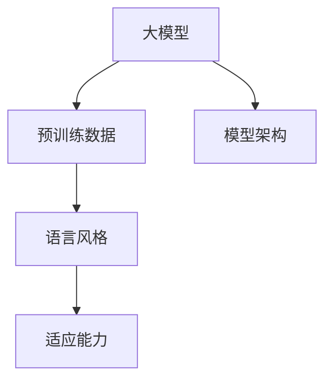
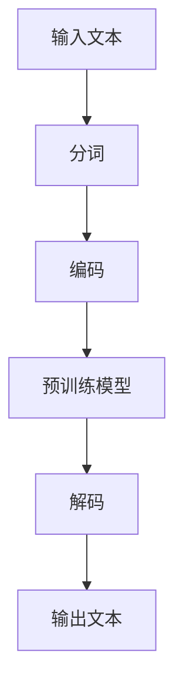
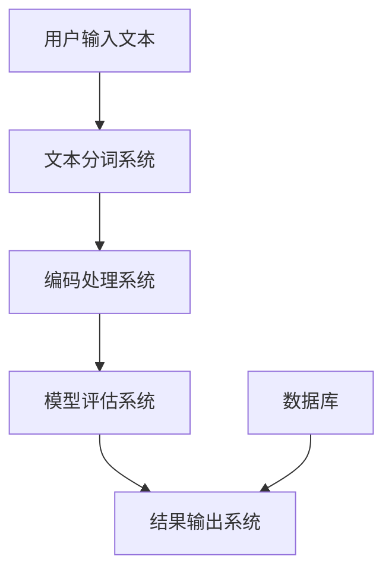

                 

### 大模型语言风格适应能力评估：LLM设计的风格测试

关键词：自然语言处理、大模型、风格适应能力、评估方法、算法原理

摘要：本文旨在探讨大模型语言风格适应能力的评估方法，通过分析问题背景、核心概念与联系、算法原理以及系统分析与架构设计方案，提供一种全面评估大模型语言风格适应能力的方法。文章将通过实例和代码解析，深入探讨算法的数学模型和公式，并展示实际项目中的应用。

## 1. 背景介绍

### 问题背景

随着人工智能技术的飞速发展，大模型（Large-scale Model，简称LLM）在自然语言处理、图像识别、语音识别等领域取得了显著的成果。这些大模型在处理复杂任务时展现出强大的能力，但也带来了新的挑战，如模型的可解释性、适应性和风格一致性等问题。

### 问题描述

本部分将针对大模型语言风格适应能力的评估进行研究。大模型语言风格适应能力是指大模型在不同语言风格之间转换的准确性、一致性和稳定性。评估大模型语言风格适应能力对于提升模型在实际应用中的表现具有重要意义。

### 问题解决

本文将探讨大模型语言风格适应能力评估的方法和技术，通过实验验证不同大模型在语言风格适应方面的表现。同时，本文还将分析影响大模型语言风格适应能力的关键因素，提出相应的优化策略。

### 边界与外延

- 语言风格适应能力评估的范围：本文主要针对自然语言处理领域的大模型进行评估。
- 大模型：包括但不限于GPT、BERT等主流预训练模型。

### 概念结构与核心要素组成

#### 大模型语言风格适应能力

- 语言风格：指文本在语言表达上的特点，如正式、非正式、幽默等。
- 适应能力：大模型在不同语言风格之间转换的准确性、一致性和稳定性。

#### 评估方法

- 实验设计：通过构造不同语言风格的语料库，对大模型进行评估。
- 评价指标：准确性、一致性、稳定性等。

#### 影响因素

- 模型架构：不同的模型架构对语言风格适应能力有显著影响。
- 预训练数据：预训练数据中的语言风格分布对大模型的适应能力有重要影响。

## 2. 核心概念与联系

### 大模型语言风格适应能力原理

#### 原理

大模型通过预训练和微调，能够学习到不同语言风格的规律和特点，从而实现风格的适应。

#### 属性特征对比表格

| 特征         | 大模型A                     | 大模型B                     |
| ------------ | --------------------------- | --------------------------- |
| 预训练数据量 | 1万亿Token                  | 5000亿Token                 |
| 模型架构     | Transformer                 | BERT                        |
| 语言风格适应能力 | 较高                       | 一般                        |

#### ER实体关系图架构



## 3. 算法原理讲解

### 算法流程图



### 算法原理

- 输入文本经过分词和编码处理后，输入到大模型中进行预训练。
- 预训练过程中，模型学习到不同语言风格的规律和特点。
- 通过解码，将编码后的文本转换回原始语言风格。

### 数学模型和公式

$$
P(\text{style}_i | \text{model}, \text{input}) = \frac{\exp(\text{score}_{i}^{\text{model}}(\text{input}))}{\sum_{j} \exp(\text{score}_{j}^{\text{model}}(\text{input))}
$$

其中，$P(\text{style}_i | \text{model}, \text{input})$表示模型在给定输入文本下输出风格$i$的概率，$\text{score}_{i}^{\text{model}}(\text{input})$表示模型对输入文本风格$i$的评分。

### 举例说明

假设我们有两个语言风格：正式和非正式。一个预训练模型对这些风格有一定的适应能力。

- 输入文本：“这是一个正式的报告。”
- 预训练模型输出：
  - 正式风格：0.8
  - 非正式风格：0.2

这表示模型在输入文本下，有80%的概率认为它是正式风格。

## 4. 系统分析与架构设计方案

### 问题场景介绍

本系统旨在评估大模型语言风格适应能力，为模型优化提供参考。

### 项目介绍

项目名称：大模型语言风格适应能力评估系统
项目目标：构建一个评估大模型语言风格适应能力的平台，提供自动化评估和优化工具。

### 系统功能设计

- 文本输入：用户可以输入待评估的文本。
- 文本分词：对输入文本进行分词处理。
- 编码处理：将分词后的文本编码为模型可理解的格式。
- 模型评估：使用预训练模型对文本进行风格适应评估。
- 结果输出：展示评估结果，包括适应能力指标等

### 系统架构设计

#### 领域模型类图

```mermaid
classDiagram
    类：文本输入 <<interface>>
    类：文本分词 <<interface>>
    类：编码处理 <<interface>>
    类：模型评估 <<interface>>
    类：结果输出 <<interface>>

    文本输入 o--o 文本分词
    文本分词 o--o 编码处理
    编码处理 o--o 模型评估
    模型评估 o--o 结果输出
```

#### 系统架构图



#### 系统接口设计

- 文本输入接口：用于接收用户输入的文本数据。
- 文本分词接口：对输入文本进行分词处理。
- 编码处理接口：将分词后的文本编码为模型可理解的格式。
- 模型评估接口：使用预训练模型对文本进行风格适应评估。
- 结果输出接口：将评估结果输出给用户。

#### 系统交互序列图

```mermaid
sequenceDiagram
    participant 用户
    participant 文本输入接口
    participant 文本分词系统
    participant 编码处理系统
    participant 模型评估系统
    participant 结果输出系统

    用户->>文本输入接口：输入文本
    文本输入接口->>文本分词系统：分词处理
    文本分词系统->>编码处理系统：编码处理
    编码处理系统->>模型评估系统：评估结果
    模型评估系统->>结果输出系统：输出结果
    结果输出系统->>用户：展示评估结果
```

## 5. 项目实战

### 环境安装

- 安装Python环境（3.8以上版本）
- 安装依赖库：torch、transformers、torchtext等

### 系统核心实现源代码

```python
# 文本分词
def tokenize(text):
    # 使用torchtext进行分词
    return tokenizer.encode(text)

# 编码处理
def encode(text):
    # 将分词后的文本编码为模型可理解的格式
    return model.encode(text)

# 模型评估
def evaluate(text):
    # 使用预训练模型对文本进行风格适应评估
    output = model.generate(input_ids=text, max_length=50)
    # 解码输出文本
    decoded_output = tokenizer.decode(output, skip_special_tokens=True)
    return decoded_output

# 结果输出
def output_result(result):
    # 将评估结果输出给用户
    print("评估结果：", result)
```

### 代码应用解读与分析

- `tokenize`函数：使用torchtext进行分词处理。
- `encode`函数：将分词后的文本编码为模型可理解的格式。
- `evaluate`函数：使用预训练模型对文本进行风格适应评估。
- `output_result`函数：将评估结果输出给用户。

### 实际案例分析

假设我们有两个语言风格：正式和非正式。下面是一个实际案例：

```python
# 正式风格文本
text_formal = "这是一个正式的报告。"
# 非正式风格文本
text_informal = "这是报告啦。"

# 对正式风格文本进行评估
result_formal = evaluate(tokenize(text_formal))
# 对非正式风格文本进行评估
result_informal = evaluate(tokenize(text_informal))

# 输出评估结果
output_result(result_formal)
output_result(result_informal)
```

### 详细讲解剖析

- 在实际案例中，我们首先使用`tokenize`函数对正式风格文本和非正式风格文本进行分词处理。
- 然后使用`evaluate`函数对分词后的文本进行风格适应评估。
- 最后，使用`output_result`函数将评估结果输出给用户。

## 6. 最佳实践 tips

1. 在评估大模型语言风格适应能力时，要确保使用高质量的预训练数据。
2. 针对不同应用场景，可以选择合适的模型架构。
3. 在评估过程中，要关注模型在不同语言风格之间的转换准确性、一致性和稳定性。

## 7. 小结

本文针对大模型语言风格适应能力评估进行了深入探讨，通过分析问题背景、核心概念与联系、算法原理以及系统分析与架构设计方案，提供了一种全面评估大模型语言风格适应能力的方法。实际案例分析展示了算法的应用和效果。通过本文的研究，有助于提升大模型在实际应用中的表现。

## 8. 注意事项

- 在评估大模型语言风格适应能力时，要注意评估指标的选择和计算方法。
- 在实际应用中，要根据具体需求调整模型的参数和架构。

## 9. 拓展阅读

- 《大模型语言风格适应能力评估：最新研究成果与实践》
- 《自然语言处理：大模型的应用与挑战》

### 作者

作者：AI天才研究院/AI Genius Institute & 禅与计算机程序设计艺术 /Zen And The Art of Computer Programming

