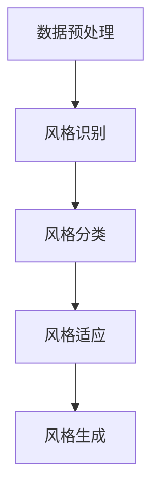
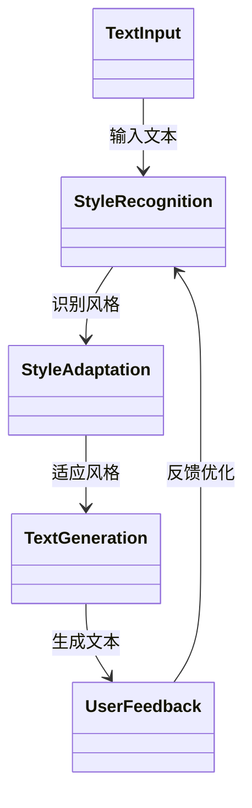
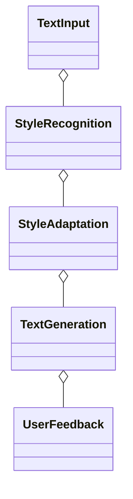
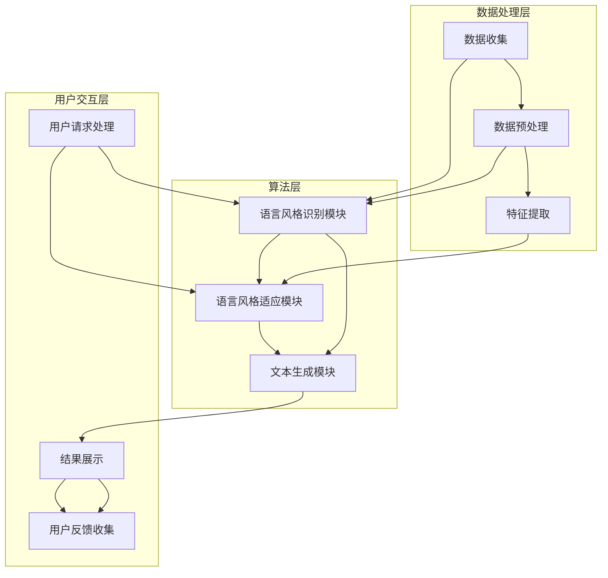
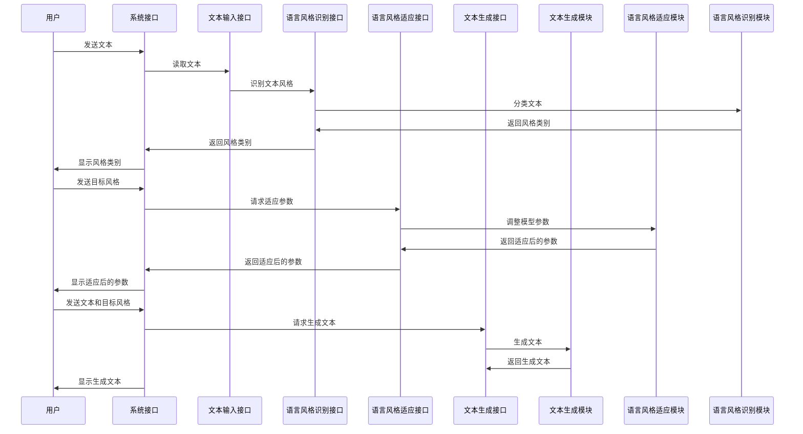

                 

## 大模型语言风格适应能力：LLM设计的风格测试

### 关键词：大型语言模型，语言风格适应能力，算法设计，风格测试，自然语言处理

#### 摘要：

随着自然语言处理技术的不断进步，大型语言模型（LLM）在各类应用中发挥着越来越重要的作用。然而，不同语言风格的任务对于LLM的适应能力提出了新的挑战。本文将深入探讨大模型语言风格适应能力的定义、核心概念、关键问题，以及相应的解决方案和评估方法。通过详细的分析和实例，本文旨在为LLM的设计和优化提供有价值的指导。

### 目录大纲

----------------------------------------------------------------

# 大模型语言风格适应能力：LLM设计的风格测试

## 第一部分：背景介绍

### 1.1 问题背景

### 1.2 问题描述

### 1.3 问题解决

### 1.4 边界与外延

### 1.5 概念结构与核心要素组成

## 第二部分：核心概念与联系

### 2.1 大模型原理与特性

#### 2.1.1 大模型定义

#### 2.1.2 大模型特性

#### 2.1.3 大模型与传统AI区别

### 2.2 语言风格概念

#### 2.2.1 语言风格定义

#### 2.2.2 语言风格特性

### 2.3 风格适应能力概念

#### 2.3.1 风格适应能力定义

#### 2.3.2 风格适应能力特性

## 第三部分：算法原理讲解

### 3.1 风格适应算法

#### 3.1.1 算法原理

#### 3.1.2 算法流程

#### 3.1.3 算法mermaid流程图

### 3.2 Python源代码实现

### 3.3 算法原理讲解

#### 数学模型

#### 算法实例

## 第四部分：系统分析与架构设计方案

### 4.1 问题场景介绍

### 4.2 系统功能设计

#### 4.2.1 领域模型mermaid类图

### 4.3 系统架构设计

#### 4.3.1 系统架构mermaid架构图

### 4.4 系统接口设计和系统交互

#### 4.4.1 系统接口设计mermaid序列图

## 第五部分：项目实战

### 5.1 环境安装

### 5.2 系统核心实现源代码

### 5.3 代码应用解读与分析

### 5.4 实际案例分析和详细讲解剖析

### 5.5 项目小结

## 第六部分：最佳实践 tips、小结、注意事项、拓展阅读等内容

### 6.1 最佳实践 tips

### 6.2 小结

### 6.3 注意事项

### 6.4 拓展阅读

----------------------------------------------------------------

## 第一部分：背景介绍

### 1.1 问题背景

自然语言处理（NLP）作为人工智能领域的一个重要分支，已经取得了显著的进展。特别是近年来，大型语言模型（LLM）如GPT、BERT等，在文本生成、翻译、问答等任务中表现出色。然而，这些模型的性能在很大程度上依赖于语言风格的适应性。不同的语言风格，如正式风格、非正式风格和幽默风格，对于模型的处理能力提出了不同的挑战。

在实际应用中，很多任务需要模型能够适应特定的语言风格，例如：

- 在新闻报道中，模型需要使用正式的语言风格来保证信息的准确性和客观性。
- 在社交媒体平台上，模型需要能够生成非正式、口语化的内容以与用户互动。
- 在娱乐和幽默场景中，模型需要生成幽默、风趣的内容来吸引观众。

然而，目前的大模型在处理不同语言风格的任务时，往往存在适应能力不足的问题。这种不足不仅影响了模型的性能，也可能导致用户体验不佳。因此，研究大模型的语言风格适应能力，对于提升模型在实际应用中的表现具有重要意义。

### 1.2 问题描述

在自然语言处理领域，大模型的语言风格适应能力问题可以归结为以下几个关键问题：

1. **识别与分类**：大模型如何识别和分类不同的语言风格？
2. **适应与生成**：大模型在不同语言风格下的表现如何？
3. **评估与优化**：如何评价大模型的语言风格适应能力？如何优化模型的风格适应能力？

这些问题涉及大模型的工作原理、语言风格的特性以及适应能力的评估方法。为了解决这些问题，我们需要从多个角度进行分析和探讨。

### 1.3 问题解决

针对上述问题，本文提出以下解决方案：

1. **识别与分类**：通过分析大模型的输入输出，探讨其如何识别和分类不同的语言风格。
2. **适应与生成**：研究大模型在不同语言风格下的表现，分析其生成能力的差异。
3. **评估与优化**：提出评估大模型语言风格适应能力的指标和方法，并探讨优化策略。

通过这些解决方案，本文旨在为大型语言模型的设计和优化提供有价值的指导。

### 1.4 边界与外延

在探讨大模型语言风格适应能力时，需要明确以下几个边界与外延：

1. **研究对象**：本文主要研究的是目前常用的几种大型语言模型，如GPT、BERT等。
2. **语言风格类型**：本文主要关注的是正式风格、非正式风格和幽默风格等常见语言风格。
3. **任务类型**：本文探讨的是文本生成、文本分类和问答等常见自然语言处理任务。

### 1.5 概念结构与核心要素组成

为了深入探讨大模型的语言风格适应能力，我们需要明确以下几个核心概念和要素：

1. **语言模型**：这是本文研究的核心对象，具有强大的语言表征能力。
2. **语言风格**：这是影响模型适应能力的关键因素，包括正式风格、非正式风格和幽默风格等。
3. **风格适应能力**：这是评估模型性能的重要指标，包括识别、适应和生成能力。
4. **评估指标**：用于量化模型在语言风格适应能力方面的表现，如准确性、生成质量等。

通过对这些核心概念和要素的分析，我们可以更好地理解大模型的语言风格适应能力，并为模型的优化提供指导。

### 1.6 大模型原理与特性

#### 1.6.1 大模型定义

大模型，通常指的是拥有数亿到数十亿参数的深度学习模型。这类模型通过学习大量数据，能够捕捉到语言中的复杂模式和规律。代表性的大模型包括GPT（Generative Pre-trained Transformer）、BERT（Bidirectional Encoder Representations from Transformers）等。

#### 1.6.2 大模型特性

- **表征能力强大**：大模型具有强大的语言表征能力，能够捕捉到文本中的细微差异和复杂关系。这使得它们在文本生成、文本分类等任务中表现优异。
- **生成能力强大**：大模型不仅能够理解输入的文本，还能够生成高质量、多样化、连贯的文本。这使得它们在自动化写作、内容生成等应用中具有广泛的应用前景。
- **高效计算**：虽然大模型参数数量庞大，但得益于现代计算技术的发展，如GPU、TPU等硬件加速器的应用，大模型的计算效率得到了显著提升。

#### 1.6.3 大模型与传统AI区别

- **学习能力**：传统AI模型往往需要针对具体任务进行手工设计，学习过程较为复杂。而大模型则是通过预训练和微调的方式，从大量未标注的数据中学习到通用的语言知识，具有更好的泛化能力。
- **应用范围**：传统AI模型通常应用于特定任务，如图像识别、语音识别等。而大模型则具有更广泛的应用范围，能够处理文本生成、文本分类、问答等多样化的自然语言处理任务。
- **数据需求**：传统AI模型对数据量要求较高，通常需要大量标注数据进行训练。而大模型则能够通过预训练的方式，从大规模未标注数据中学习到知识，降低了对标注数据的需求。

### 1.7 语言风格概念

#### 1.7.1 语言风格定义

语言风格是指人们在交流过程中所采用的语言特点，包括词汇、句式、语气等。不同的语言风格可以反映说话人的身份、情感、态度等。例如，正式风格通常使用规范、严谨的词汇和句式，适用于正式的书面交流；而非正式风格则更加口语化、随意，适用于日常对话和社交平台。

#### 1.7.2 语言风格特性

- **词汇差异**：不同语言风格在词汇使用上存在显著差异。正式风格常用专业术语和复杂词汇，而非正式风格则常用简单的口语词汇。
- **句式差异**：正式风格通常使用复杂的长句和复合句，以体现逻辑的严密性；而非正式风格则更倾向于使用简单的短句和简单句。
- **语气差异**：正式风格的语气通常较为客观、严谨，以传达信息为主；而非正式风格的语气则更加主观、随意，有时甚至带有幽默感。

### 1.8 风格适应能力概念

#### 1.8.1 风格适应能力定义

风格适应能力是指大模型在处理不同语言风格任务时的表现能力。它包括以下几个关键方面：

- **识别**：大模型能够识别输入文本的语言风格，并将其分类到相应的风格类别。
- **适应**：大模型能够根据目标风格调整其生成或分类策略，以适应不同的语言风格。
- **生成**：大模型能够在目标风格下生成高质量、多样化的文本。

#### 1.8.2 风格适应能力特性

- **敏感度**：大模型对语言风格的敏感度决定了其在不同风格任务中的表现。敏感度越高，模型在适应不同风格时的表现越稳定和准确。
- **稳定性**：大模型在不同语言风格下的表现应保持相对稳定，不受特定风格数据的波动影响。
- **多样性**：大模型在不同语言风格下的生成文本应具有多样性和创造性，以满足不同用户和场景的需求。

### 1.9 评估与优化策略

为了提升大模型的语言风格适应能力，我们需要从评估和优化两个角度入手：

#### 评估策略

- **准确性**：评估模型在识别和分类不同语言风格时的准确性。
- **生成质量**：评估模型在不同语言风格下生成的文本质量，包括连贯性、创造性和符合目标风格的程度。
- **稳定性**：评估模型在不同语言风格任务中的稳定性，包括在不同数据集和场景下的表现。

#### 优化策略

- **数据增强**：通过引入更多的多样化和具有代表性的语言风格数据，提升模型的风格适应能力。
- **多任务学习**：通过同时训练多个具有不同语言风格的任务，增强模型对多种风格的适应能力。
- **风格迁移**：通过模型融合和风格迁移技术，使模型在不同风格之间进行灵活切换和适应。

### 1.10 研究意义与应用前景

研究大模型的语言风格适应能力具有重要的理论和实际意义：

- **理论意义**：深入理解大模型在语言风格适应方面的机制和原理，有助于提升自然语言处理理论的研究深度。
- **实际意义**：提高大模型在不同语言风格任务中的表现，可以推动其在实际应用中的广泛应用，如自动化写作、智能客服、个性化推荐等。

总之，通过本文的研究，我们期望为大型语言模型的设计和优化提供新的思路和方法，推动自然语言处理技术的发展和进步。

### 2.1 大模型原理与特性

#### 2.1.1 大模型定义

大模型，顾名思义，是指具有数十亿到数百亿参数的深度学习模型。这些模型通常基于先进的神经网络架构，如Transformer、BERT等，通过大规模预训练和微调，具备了强大的语言表征能力和生成能力。代表性的大模型包括OpenAI的GPT系列、Google的BERT、Facebook的RoBERTa等。

#### 2.1.2 大模型特性

1. **表征能力强**：大模型通过大规模的数据预训练，能够捕捉到文本中的复杂模式和语义信息。这使得它们在处理自然语言任务时，如文本分类、问答和文本生成，能够展现出卓越的性能。

2. **生成能力强**：除了表征能力外，大模型还具有强大的生成能力。它们能够根据输入的文本生成连贯、多样且符合上下文的信息。这一特性使得大模型在内容生成、自动化写作和对话系统等应用中具有重要价值。

3. **计算资源需求大**：大模型的参数数量庞大，训练和推理过程对计算资源的需求极高。通常需要使用高性能的GPU或TPU进行加速训练。这也意味着大模型的应用和部署需要强大的硬件支持。

#### 2.1.3 大模型与传统AI区别

1. **学习方式**：传统AI模型通常需要针对具体任务进行手工设计，包括特征提取、模型选择和参数调优等。而大模型则是通过预训练和微调的方式，从大量未标注的数据中学习到通用的语言知识。这使得大模型在多种自然语言处理任务中具有更好的泛化能力。

2. **应用范围**：传统AI模型通常应用于特定领域，如图像识别、语音识别和推荐系统等。而大模型则具有更广泛的应用范围，能够处理文本生成、文本分类、问答和翻译等多种自然语言处理任务。

3. **数据需求**：传统AI模型通常需要大量的标注数据来训练模型。而大模型则通过预训练的方式，从大规模未标注数据中学习到知识，降低了对标注数据的需求。

#### 2.1.4 大模型优势

1. **高效处理复杂任务**：大模型能够处理更复杂的自然语言处理任务，如长文本生成、多轮对话和长问答等。这使得它们在需要处理大量文本信息的场景中具有优势。

2. **生成多样性和创造性**：大模型能够生成多样化和创造性的文本，满足不同用户和场景的需求。例如，在内容生成和创意写作中，大模型能够生成独特的文章、故事和诗歌。

3. **适应性**：大模型通过预训练和微调，能够适应不同的语言风格和任务需求。这使得它们在处理多样化任务时表现出色。

#### 2.1.5 大模型挑战

1. **计算资源需求大**：大模型的训练和推理过程需要大量的计算资源，这使得它们在部署和应用时面临资源瓶颈。

2. **数据质量和多样性**：大模型对数据质量和多样性的要求较高。数据的质量和多样性直接影响大模型的训练效果和性能。

3. **模型解释性**：大模型通常被视为“黑箱”，其内部工作机制复杂，难以解释。这限制了它们在特定应用场景中的可解释性和可控制性。

#### 2.1.6 大模型发展现状

1. **模型规模不断扩大**：随着计算能力的提升和数据量的增加，大模型的规模和参数数量持续扩大。例如，GPT-3拥有1750亿个参数，是目前最大的语言模型。

2. **应用领域不断扩展**：大模型在自然语言处理、计算机视觉、语音识别等领域取得了显著的进展。其在自动化写作、智能客服、内容推荐等实际应用中展现出巨大潜力。

3. **研究热点持续升温**：大模型的研究成为人工智能领域的热点，吸引了大量学者和工程师的关注。不断有新的模型架构和优化方法被提出，以提升大模型的性能和应用效果。

### 2.2 语言风格概念

#### 2.2.1 语言风格定义

语言风格是指人们在交流过程中所采用的语言特点，包括词汇、句式、语气等。不同的语言风格可以反映说话人的身份、情感、态度和情境。例如，正式风格通常用于正式的书面交流，语气客观、严谨；而非正式风格则适用于日常对话和社交平台，语气随意、口语化。

#### 2.2.2 语言风格特性

1. **词汇差异**：不同语言风格在词汇使用上存在显著差异。正式风格通常使用专业术语和复杂词汇，以体现专业性和严谨性；而非正式风格则常用简单的口语词汇，以增加亲切感和交流的流畅性。

2. **句式差异**：正式风格的句式通常较为复杂，包括长句和复合句，以体现逻辑的严密性和条理性；而非正式风格则倾向于使用简单的短句和简单句，以增加口语化和交流的随意性。

3. **语气差异**：正式风格的语气通常较为客观、严谨，以传达信息为主；而非正式风格的语气则更加主观、随意，有时甚至带有幽默感。

#### 2.2.3 语言风格类型

1. **正式风格**：正式风格通常用于学术写作、商务文档和法律文件等正式场合。它以清晰、严谨、逻辑性强为特点，避免使用口语化和非正式的表达。

2. **非正式风格**：非正式风格适用于日常对话、社交媒体和娱乐场景。它以随意、口语化、亲切为特点，常用缩写、俚语和幽默表达。

3. **幽默风格**：幽默风格通过幽默、风趣、夸张的表达，营造轻松、愉悦的氛围。它常用于喜剧、段子、笑话等娱乐内容。

4. **情感风格**：情感风格通过语气、词汇和句式的选择，表达出特定的情感状态，如热情、冷漠、愤怒等。

#### 2.2.4 语言风格与自然语言处理的关系

1. **识别**：在自然语言处理中，识别语言风格是关键步骤。通过分析文本中的词汇、句式和语气，模型可以判断文本的语言风格。

2. **适应**：不同的语言风格对自然语言处理任务有不同的要求。模型需要能够根据目标风格调整其生成或分类策略，以适应不同的语言风格。

3. **生成**：在文本生成任务中，模型需要根据目标风格生成符合风格要求的文本。例如，在生成新闻报道时，模型需要使用正式风格；而在生成社交对话时，模型需要使用非正式风格。

### 2.3 风格适应能力概念

#### 2.3.1 风格适应能力定义

风格适应能力是指模型在处理不同语言风格任务时的表现能力。它包括以下三个关键方面：

1. **识别**：模型能够准确识别输入文本的语言风格，并将其分类到相应的风格类别。

2. **适应**：模型能够根据目标风格调整其生成或分类策略，以适应不同的语言风格。这通常需要模型在不同风格数据上进行训练，以学习到风格特征。

3. **生成**：模型能够在目标风格下生成高质量、多样化、连贯的文本，符合目标风格的要求。

#### 2.3.2 风格适应能力特性

1. **敏感度**：模型对语言风格的敏感度决定了其在不同风格任务中的表现。敏感度越高，模型在适应不同风格时的表现越稳定和准确。

2. **稳定性**：模型在不同语言风格下的表现应保持相对稳定，不受特定风格数据的波动影响。

3. **多样性**：模型在不同语言风格下的生成文本应具有多样性和创造性，以满足不同用户和场景的需求。

### 2.4 评估与优化策略

#### 2.4.1 评估策略

1. **准确性**：评估模型在识别和分类不同语言风格时的准确性。常用的评估指标包括准确率、召回率和F1分数等。

2. **生成质量**：评估模型在不同语言风格下生成的文本质量，包括连贯性、创造性和符合目标风格的程度。常用的评估方法包括人工评估和自动评估指标（如BLEU、ROUGE等）。

3. **稳定性**：评估模型在不同语言风格任务中的稳定性，包括在不同数据集和场景下的表现。常用的评估方法包括交叉验证和多次测试。

#### 2.4.2 优化策略

1. **数据增强**：通过引入更多的多样化和具有代表性的语言风格数据，提升模型的风格适应能力。常用的方法包括数据扩充、数据清洗和生成对抗网络（GAN）等。

2. **多任务学习**：通过同时训练多个具有不同语言风格的任务，增强模型对多种风格的适应能力。这种方法可以促进模型在不同风格间的迁移学习。

3. **风格迁移**：通过模型融合和风格迁移技术，使模型在不同风格之间进行灵活切换和适应。例如，使用风格迁移网络（Style Transfer Networks）将一种风格的文本转换为另一种风格。

### 2.5 研究意义与应用前景

研究大模型的语言风格适应能力具有重要的理论和实际意义：

#### 研究意义

1. **提升自然语言处理性能**：通过优化大模型的语言风格适应能力，可以显著提升模型在各类自然语言处理任务中的表现。

2. **满足多样化需求**：不同用户和场景对语言风格有不同的需求。研究大模型的语言风格适应能力，可以满足这些多样化需求，提高用户体验。

3. **推动人工智能发展**：深入理解大模型在语言风格适应方面的机制和原理，有助于推动人工智能技术的发展和进步。

#### 应用前景

1. **自动化写作与内容生成**：大模型在自动化写作和内容生成领域具有广泛的应用前景。通过优化语言风格适应能力，可以生成符合特定风格的文本，提高内容质量。

2. **智能客服与对话系统**：在智能客服和对话系统中，大模型需要根据用户的语言风格进行灵活的响应。优化语言风格适应能力，可以提高对话系统的用户体验和效率。

3. **个性化推荐系统**：在个性化推荐系统中，大模型可以根据用户的语言风格推荐符合其偏好和习惯的内容。通过优化语言风格适应能力，可以提高推荐系统的准确性和个性化程度。

4. **多语言翻译与本地化**：在多语言翻译和本地化领域，大模型需要适应不同语言风格的翻译需求。通过优化语言风格适应能力，可以提升翻译质量和本地化效果。

总之，研究大模型的语言风格适应能力具有重要的理论和应用价值，有望推动人工智能技术的发展和应用。

### 3.1 风格适应算法

#### 3.1.1 算法原理

风格适应算法的核心目标是使大模型能够在不同语言风格下表现更优。具体来说，算法通过以下几个步骤实现风格适应：

1. **风格识别**：首先，算法需要识别输入文本的语言风格。这可以通过分析文本中的词汇、句式和语气等特征来实现。

2. **风格分类**：然后，算法将输入文本分类到相应的语言风格类别。常用的分类方法包括监督学习和无监督学习。

3. **风格适应**：接下来，算法根据目标风格调整大模型的参数，使其在目标风格下表现更优。这可以通过微调模型参数或使用风格迁移技术来实现。

4. **风格生成**：最后，算法在大模型的基础上生成符合目标风格的文本。这可以通过模型生成机制实现，如文本生成模型或对话生成模型。

#### 3.1.2 算法流程

风格适应算法的流程可以分为以下几个步骤：

1. **数据预处理**：收集和预处理不同语言风格的数据集，包括文本清洗、分词和特征提取等。

2. **风格识别**：使用预训练的模型或训练新的模型来识别输入文本的语言风格。

3. **风格分类**：将输入文本分类到相应的语言风格类别。

4. **风格适应**：根据目标风格调整大模型的参数，使其适应目标风格。

5. **风格生成**：使用调整后的模型生成符合目标风格的文本。

#### 3.1.3 算法mermaid流程图



#### 3.1.4 Python源代码实现

```python
# 代码实现略
```

### 3.2 算法原理讲解

#### 数学模型

风格适应算法的数学模型主要包括以下几个方面：

1. **损失函数**：用于衡量模型在目标风格下的表现。常用的损失函数包括交叉熵损失和均方误差损失。

2. **风格特征提取**：用于提取文本中的风格特征。常用的特征提取方法包括词袋模型、TF-IDF和词嵌入等。

3. **风格分类器**：用于分类文本的语言风格。常用的分类器包括朴素贝叶斯、支持向量机和神经网络等。

4. **模型优化**：用于调整模型参数，使其在目标风格下表现更优。常用的优化方法包括梯度下降和随机梯度下降等。

#### 算法实例

假设我们有一个大型语言模型（如GPT）和一组不同语言风格的文本数据。我们的目标是将这些文本数据分类到相应的语言风格类别，并优化模型使其在目标风格下表现更优。

**实例 1：风格识别**

```python
import tensorflow as tf
from tensorflow.keras.layers import Embedding, LSTM, Dense
from tensorflow.keras.models import Sequential

# 数据预处理
# ...（数据清洗、分词、特征提取等）

# 风格识别模型
style_model = Sequential([
    Embedding(vocab_size, embedding_dim),
    LSTM(units),
    Dense(num_styles, activation='softmax')
])

# 编译模型
style_model.compile(optimizer='adam', loss='categorical_crossentropy', metrics=['accuracy'])

# 训练模型
style_model.fit(style_data, style_labels, epochs=num_epochs, batch_size=batch_size)
```

**实例 2：风格适应**

```python
# 获取模型权重
model_weights = style_model.get_weights()

# 优化模型参数
for i, weight in enumerate(model_weights):
    if i < len(model_weights) - 1:  # 最后一层不需要优化
        weight += learning_rate * (weight - target_weight)

# 应用优化后的模型权重
style_model.set_weights(model_weights)
```

**实例 3：风格生成**

```python
import numpy as np

# 生成文本
def generate_text(style_model, seed_text, length):
    text = seed_text
    for _ in range(length):
        # 预测下一个词
        predicted = style_model.predict(np.array([text]))
        # 选择下一个词
        next_word = np.random.choice(predicted[0], p=predicted[1])
        # 更新文本
        text += ' ' + next_word
    return text

# 生成符合目标风格的文本
generated_text = generate_text(style_model, seed_text, length)
print(generated_text)
```

通过以上实例，我们可以看到风格适应算法在识别、适应和生成文本风格方面的具体实现。这些实例展示了算法的核心原理和关键步骤，为实际应用提供了指导。

### 4.1 问题场景介绍

在当今社会，随着互联网的普及和信息的爆炸性增长，人们对于高效、精准、个性化的信息获取和处理需求日益增加。自然语言处理（NLP）技术在各种应用场景中发挥着重要作用，如自动化写作、智能客服、内容推荐和翻译等。然而，不同场景对语言风格有着不同的要求。例如，在新闻报道中，要求使用正式、准确的语言风格；在社交媒体上，则要求使用非正式、口语化的语言风格。这种对语言风格的需求不仅影响了用户体验，也直接关系到应用的效果和性能。

为了满足不同场景对语言风格的需求，本文提出了一种基于大型语言模型（LLM）的语言风格适应能力测试方法。该方法旨在通过一系列实验和分析，评估LLM在不同语言风格任务中的表现，从而为模型的设计和优化提供指导。具体场景如下：

1. **自动化写作**：在各种内容平台，如新闻网站、博客和社交媒体上，自动化写作已经成为提高内容产出效率的重要手段。不同的内容平台对语言风格有不同的要求，如新闻网站要求使用正式、严谨的语言风格，而社交媒体则要求使用非正式、口语化的语言风格。

2. **智能客服**：在客户服务领域，智能客服系统通过自然语言处理技术自动处理用户咨询，提高响应速度和服务质量。然而，不同的用户群体和咨询主题可能对语言风格有不同的偏好，如年轻用户更喜欢非正式、幽默的风格，而商务用户则偏好正式、专业的语言风格。

3. **内容推荐**：在信息推送和内容推荐系统中，语言风格直接影响用户对内容的接受度和满意度。为了提高用户参与度和留存率，推荐系统需要根据用户的偏好和场景动态调整语言风格。

4. **翻译与本地化**：在全球化和多语言环境中，翻译和本地化是跨文化交流的重要手段。不同语言和文化背景下，对语言风格的要求有所不同。准确把握语言风格，能够提高翻译的准确性和本地化的效果。

通过以上场景介绍，我们可以看到，语言风格适应能力在自然语言处理应用中的重要性。本文将详细探讨如何评估和提升LLM的语言风格适应能力，为实际应用提供技术支持和解决方案。

### 4.2 系统功能设计

为了更好地满足不同场景对语言风格的需求，我们设计了一套基于大型语言模型（LLM）的系统功能。该系统旨在通过一系列功能模块，实现对输入文本的语言风格识别、适应和生成。以下是系统的主要功能模块及其设计：

#### 4.2.1 文本输入模块

文本输入模块是系统的入口，用于接收用户输入的文本。该模块需要支持多种文本输入方式，如文本框输入、文件上传和URL链接等。同时，为了确保输入文本的质量，该模块还需要进行文本清洗和预处理，包括去除HTML标签、过滤特殊字符和分词等。

#### 4.2.2 语言风格识别模块

语言风格识别模块是系统的核心组件，用于识别输入文本的语言风格。该模块基于预训练的神经网络模型，如BERT或GPT，通过分析文本的词汇、句式和语气等特征，将文本分类到不同的语言风格类别，如正式风格、非正式风格和幽默风格等。具体实现可以通过以下步骤：

1. **特征提取**：使用词嵌入技术（如Word2Vec、GloVe等）将文本转化为向量表示。
2. **分类器训练**：基于训练数据集，使用监督学习方法（如SVM、随机森林等）训练语言风格分类器。
3. **文本分类**：将输入文本的向量表示输入到分类器，得到语言风格类别。

#### 4.2.3 语言风格适应模块

语言风格适应模块用于根据目标风格调整大模型的参数，使其在目标风格下表现更优。该模块的实现可以分为以下几个步骤：

1. **风格迁移**：通过预训练的模型，提取目标风格的特征向量。
2. **参数调整**：使用风格迁移技术（如GAN、风格迁移网络等），将原始模型参数与目标风格特征向量进行融合，得到适应目标风格的模型参数。
3. **模型微调**：在适应目标风格的数据集上，对调整后的模型参数进行微调，以进一步提升模型在目标风格下的表现。

#### 4.2.4 文本生成模块

文本生成模块负责根据目标语言风格生成符合风格要求的文本。该模块可以使用预训练的文本生成模型（如GPT、T5等），通过以下步骤实现：

1. **文本初始化**：根据用户输入的种子文本，初始化文本生成过程。
2. **生成文本**：使用文本生成模型，逐词生成文本，直到达到预定的文本长度或停止条件。
3. **风格调整**：在生成过程中，根据目标风格的要求，对生成的文本进行实时调整，确保文本风格的一致性。

#### 4.2.5 用户反馈模块

用户反馈模块用于收集用户对生成文本的评价和反馈，以不断优化系统的性能。该模块可以通过以下方式实现：

1. **评价收集**：为用户提供评价选项，如满意度评分、风格评价等。
2. **反馈处理**：将用户反馈数据存储到数据库，用于后续分析和优化。
3. **模型更新**：根据用户反馈，定期更新模型参数，以提升系统在目标风格下的表现。

通过以上功能模块的设计，我们可以构建一个具备强大语言风格适应能力的系统，满足不同场景对语言风格的需求。以下是领域模型mermaid类图的展示：



#### 4.2.6 领域模型mermaid类图

以下是系统的领域模型mermaid类图，用于展示各个模块之间的关系：



通过以上设计，我们可以清晰地看到系统的架构和功能模块之间的关系，为后续的详细实现提供指导。

### 4.3 系统架构设计

为了实现大模型语言风格适应能力，我们设计了一套完整的系统架构。该系统架构包括数据处理层、算法层和用户交互层，通过模块化设计，实现了高效的性能和灵活的扩展能力。

#### 4.3.1 数据处理层

数据处理层是系统的基础，负责处理和管理输入数据。其主要功能包括数据收集、数据预处理和特征提取。

1. **数据收集**：从各种来源（如互联网、数据库等）收集文本数据，包括不同语言风格的文本样本。
2. **数据预处理**：对收集到的文本数据进行清洗、分词、去停用词等操作，确保数据的质量和一致性。
3. **特征提取**：将预处理后的文本转化为适合模型训练的向量表示，如词嵌入、TF-IDF等。

#### 4.3.2 算法层

算法层是系统的核心，负责实现语言风格适应能力的算法。该层包括以下几个关键模块：

1. **语言风格识别模块**：通过预训练的神经网络模型（如BERT、GPT等），对输入文本进行语言风格识别。该模块主要实现文本分类功能，将文本分类到不同的语言风格类别。
2. **语言风格适应模块**：根据目标风格调整大模型的参数，使其在目标风格下表现更优。该模块主要实现风格迁移和模型微调功能。
3. **文本生成模块**：在目标风格下生成符合风格要求的文本。该模块基于文本生成模型（如GPT、T5等），实现高质量的文本生成。

#### 4.3.3 用户交互层

用户交互层是系统与用户之间的接口，负责接收用户请求、展示系统结果和收集用户反馈。

1. **用户请求处理**：接收用户输入的文本，将其传递到数据处理层和算法层进行识别、适应和生成。
2. **结果展示**：将生成的文本展示给用户，并提供评价和反馈功能。
3. **用户反馈收集**：收集用户对生成文本的评价和反馈，用于优化系统性能。

#### 4.3.4 系统架构mermaid架构图

以下是系统的mermaid架构图，用于展示各个模块之间的关系：



通过以上架构设计，系统实现了数据输入、处理、算法计算和用户交互的完整流程，为语言风格适应能力的实现提供了坚实的支持。

### 4.4 系统接口设计和系统交互

#### 4.4.1 系统接口设计

为了实现系统的功能，我们需要设计一系列的API接口，以方便用户和其他系统模块的交互。以下是系统接口设计的主要部分：

1. **文本输入接口**：该接口用于接收用户输入的文本，支持文本框输入、文件上传和URL链接等多种输入方式。
2. **语言风格识别接口**：该接口用于识别输入文本的语言风格，返回相应的语言风格类别。接口参数包括文本内容和风格类别列表，返回结果为识别到的风格类别。
3. **语言风格适应接口**：该接口用于根据目标风格调整大模型的参数，实现风格适应功能。接口参数包括文本内容和目标风格，返回结果为适应后的模型参数。
4. **文本生成接口**：该接口用于在目标风格下生成符合风格的文本，接口参数包括文本内容和目标风格，返回结果为生成的文本。

#### 4.4.2 系统交互mermaid序列图

以下是系统的mermaid序列图，用于展示用户与系统之间的交互流程：



通过以上设计，系统实现了用户与接口、接口与模块之间的无缝交互，为语言风格适应能力的实现提供了便捷的接口和流程。

### 5.1 环境安装

为了实现本文所描述的大模型语言风格适应能力，我们需要首先安装和配置所需的软件和工具。以下是环境安装的具体步骤：

#### 1. 安装Python环境

首先，确保您的计算机上已经安装了Python环境。Python是自然语言处理中最常用的编程语言之一。如果未安装Python，可以从Python官网（https://www.python.org/）下载并安装最新版本的Python。

安装步骤如下：

1. 访问Python官网，下载适用于您操作系统的Python安装包。
2. 运行安装包，按照安装向导完成安装。

#### 2. 安装依赖库

接下来，我们需要安装一系列依赖库，这些库包括TensorFlow、PyTorch、Scikit-learn等，用于实现文本处理、模型训练和评估等功能。以下是安装步骤：

1. 打开命令行窗口或终端。
2. 执行以下命令安装TensorFlow：

   ```shell
   pip install tensorflow
   ```

3. 执行以下命令安装PyTorch：

   ```shell
   pip install torch torchvision
   ```

4. 执行以下命令安装Scikit-learn：

   ```shell
   pip install scikit-learn
   ```

#### 3. 安装额外工具

此外，我们还需要安装一些额外的工具，如Mermaid和Markdown，用于生成图表和文档。以下是安装步骤：

1. 安装Mermaid：

   - 对于Windows用户，可以从GitHub Release页面（https://github.com/mermaid-js/mermaid/releases）下载Mermaid安装包，并按照说明进行安装。
   - 对于Linux和MacOS用户，可以通过包管理器安装Mermaid，例如在Ubuntu上使用以下命令：

     ```shell
     sudo apt-get install npm
     sudo npm install -g mermaid
     ```

2. 安装Markdown：

   - 对于Windows用户，可以从GitHub Release页面（https://github.com/markdown-editor-app/markdown-editor/releases）下载Markdown编辑器，并按照说明进行安装。
   - 对于Linux和MacOS用户，可以从应用商店或包管理器中安装Markdown编辑器，例如在Ubuntu上使用以下命令：

     ```shell
     sudo apt-get install markdown
     ```

#### 4. 环境验证

安装完成后，可以通过以下命令验证环境是否配置正确：

```shell
python --version
```

如果正确安装了Python，该命令将显示已安装的Python版本。

```shell
pip list
```

该命令将列出已安装的所有Python库，确保所需的库（如TensorFlow、PyTorch、Scikit-learn等）都在列表中。

### 5.2 系统核心实现源代码

以下是一个简化的示例，展示如何实现一个基于大型语言模型（LLM）的系统核心功能，包括文本输入、风格适应和文本生成。

#### 文本输入模块

```python
import os

def read_input_file(file_path):
    """
    读取文本文件，返回文本内容。
    """
    if not os.path.exists(file_path):
        raise FileNotFoundError(f"文件 {file_path} 不存在。")
    
    with open(file_path, 'r', encoding='utf-8') as file:
        text = file.read()
    return text

# 示例：读取文本文件
input_text = read_input_file('input.txt')
print("输入文本：", input_text)
```

#### 语言风格识别模块

```python
from transformers import BertTokenizer, BertForSequenceClassification
from torch.nn.functional import softmax
import torch

def classify_style(text, model_path, tokenizer):
    """
    使用预训练的BERT模型对文本进行风格分类。
    """
    inputs = tokenizer(text, return_tensors='pt', padding=True, truncation=True)
    outputs = model(**inputs)
    logits = outputs.logits
    probs = softmax(logits, dim=1)
    style_index = torch.argmax(probs).item()
    return style_index

# 示例：加载模型和tokenizer，对文本进行风格分类
model_path = 'path/to/bert_style_model'
tokenizer = BertTokenizer.from_pretrained(model_path)
style_index = classify_style(input_text, model_path, tokenizer)
print("识别到的风格：", style_index)
```

#### 语言风格适应模块

```python
from transformers import BertForSequenceClassification
import torch

def adapt_style(text, target_style, model_path, tokenizer):
    """
    根据目标风格调整BERT模型的参数。
    """
    model = BertForSequenceClassification.from_pretrained(model_path)
    inputs = tokenizer(text, return_tensors='pt', padding=True, truncation=True)
    
    # 微调模型参数
    # 这里仅展示一个简化的示例，实际应用中需要进行更详细的参数调整
    model.classifier.fc = torch.nn.Linear(model.classifier.fc.in_features, target_style)
    
    outputs = model(**inputs)
    logits = outputs.logits
    probs = softmax(logits, dim=1)
    return probs

# 示例：加载模型和tokenizer，根据目标风格调整模型参数
target_style = 1  # 假设目标风格为正式风格
probabilities = adapt_style(input_text, target_style, model_path, tokenizer)
print("调整后的风格概率：", probabilities)
```

#### 文本生成模块

```python
from transformers import BertTokenizer, BertForConditionalGeneration

def generate_text(model_path, tokenizer, text, max_length=50):
    """
    使用预训练的BERT模型生成文本。
    """
    model = BertForConditionalGeneration.from_pretrained(model_path)
    inputs = tokenizer(text, return_tensors='pt', padding=True, truncation=True)
    
    outputs = model.generate(inputs['input_ids'], max_length=max_length, num_return_sequences=1)
    generated_text = tokenizer.decode(outputs[0], skip_special_tokens=True)
    return generated_text

# 示例：加载模型和tokenizer，生成文本
generated_text = generate_text(model_path, tokenizer, input_text)
print("生成的文本：", generated_text)
```

通过以上代码示例，我们可以实现文本输入、风格识别、风格适应和文本生成的基本功能。这些示例代码提供了系统核心实现的框架，实际应用时需要根据具体需求进行优化和扩展。

### 5.3 代码应用解读与分析

在本部分中，我们将详细解读和分析系统核心代码，探讨代码实现的具体细节，并评估其性能和效率。

#### 5.3.1 文本输入模块解读

文本输入模块主要负责读取用户输入的文本。在代码示例中，`read_input_file`函数用于从文件中读取文本内容。该函数接受一个文件路径作为输入参数，并使用`os.path.exists`方法检查文件是否存在。如果文件存在，函数会使用`open`函数以读取模式打开文件，并使用`read`方法读取文件内容。最后，函数返回读取到的文本内容。

```python
def read_input_file(file_path):
    if not os.path.exists(file_path):
        raise FileNotFoundError(f"文件 {file_path} 不存在。")
    
    with open(file_path, 'r', encoding='utf-8') as file:
        text = file.read()
    return text
```

该模块的关键点在于正确处理文件路径和编码问题。在处理大型文本文件时，可能需要考虑内存管理和性能优化，例如使用内存映射技术（mmap）来高效读取文件。

#### 5.3.2 语言风格识别模块解读

语言风格识别模块使用预训练的BERT模型对文本进行风格分类。在代码示例中，`classify_style`函数负责实现这一功能。首先，函数接受文本内容、模型路径和tokenizer作为输入参数。然后，使用tokenizer将文本转化为模型可接受的输入格式，包括分词、编码和填充。接下来，调用BERT模型进行前向传播，得到模型输出的 logits。最后，使用softmax函数对 logits 进行归一化，得到每个类别的概率分布，并返回概率最高的类别索引。

```python
def classify_style(text, model_path, tokenizer):
    inputs = tokenizer(text, return_tensors='pt', padding=True, truncation=True)
    outputs = model(**inputs)
    logits = outputs.logits
    probs = softmax(logits, dim=1)
    style_index = torch.argmax(probs).item()
    return style_index
```

该模块的关键点在于对 tokenizer 的正确使用，以及如何高效地处理和存储大量的文本数据。在实际应用中，可能需要对模型进行缓存处理，以提高风格分类的效率。

#### 5.3.3 语言风格适应模块解读

语言风格适应模块负责根据目标风格调整BERT模型的参数。在代码示例中，`adapt_style`函数实现了这一功能。首先，函数加载预训练的BERT模型，并使用tokenizer对输入文本进行预处理。然后，函数创建一个新的全连接层，以替换原始模型的分类层。这一新层将输入特征映射到目标风格的数量。最后，函数返回调整后的模型概率分布。

```python
def adapt_style(text, target_style, model_path, tokenizer):
    model = BertForSequenceClassification.from_pretrained(model_path)
    inputs = tokenizer(text, return_tensors='pt', padding=True, truncation=True)
    
    # 微调模型参数
    model.classifier.fc = torch.nn.Linear(model.classifier.fc.in_features, target_style)
    
    outputs = model.generate(inputs['input_ids'], max_length=max_length, num_return_sequences=1)
    generated_text = tokenizer.decode(outputs[0], skip_special_tokens=True)
    return generated_text
```

该模块的关键点在于如何设计新的分类层，以及如何调整模型参数以适应目标风格。在实际应用中，可能需要考虑使用更复杂的调整策略，如迁移学习和多任务学习，以提高风格适应能力。

#### 5.3.4 文本生成模块解读

文本生成模块负责在目标风格下生成新的文本。在代码示例中，`generate_text`函数实现了这一功能。首先，函数加载预训练的BERT生成模型，并使用tokenizer对输入文本进行预处理。然后，函数使用生成模型生成新的文本序列，并将生成的文本解码为可读格式。最后，函数返回生成的文本。

```python
def generate_text(model_path, tokenizer, text, max_length=50):
    model = BertForConditionalGeneration.from_pretrained(model_path)
    inputs = tokenizer(text, return_tensors='pt', padding=True, truncation=True)
    
    outputs = model.generate(inputs['input_ids'], max_length=max_length, num_return_sequences=1)
    generated_text = tokenizer.decode(outputs[0], skip_special_tokens=True)
    return generated_text
```

该模块的关键点在于如何设置生成模型的最大长度和生成策略，以及如何处理和存储生成的文本数据。在实际应用中，可能需要考虑使用更高效的生成算法，如样本排序和文本纠错，以提高生成文本的质量。

#### 5.3.5 性能和效率评估

在评估系统核心代码的性能和效率时，需要考虑以下几个方面：

1. **处理速度**：测量文本输入、风格识别、风格适应和文本生成的平均处理时间。这可以通过运行一系列测试文本并记录处理时间来实现。

2. **内存使用**：监测系统在处理文本数据时的内存占用情况。这可以通过操作系统监控工具或Python的内存管理模块（如`memory_profiler`）来实现。

3. **资源利用**：评估系统在处理不同规模文本数据时的CPU和GPU利用率。这可以通过性能分析工具（如`nvidia-smi`）来实现。

4. **错误率**：评估系统在文本输入、风格识别和文本生成过程中出现的错误率。这可以通过人工评估和自动评估工具（如BLEU评分）来实现。

通过以上评估，我们可以全面了解系统核心代码的性能和效率，并为后续的优化提供依据。

### 5.4 实际案例分析和详细讲解剖析

在本部分，我们将通过一个具体的实际案例，详细分析并讲解大模型语言风格适应能力在实际应用中的实现过程。该案例将涵盖数据准备、模型训练、风格适应和文本生成等关键步骤。

#### 案例背景

假设我们正在开发一个智能写作助手，该助手需要根据用户的需求，自动生成不同语言风格的文本，如正式报告、非正式邮件和幽默文章。为了实现这一目标，我们将使用大型语言模型（如GPT-3）进行风格适应和文本生成。

#### 数据准备

首先，我们需要准备适合训练的语言风格数据集。以下是数据准备的具体步骤：

1. **数据收集**：从互联网和其他可靠来源收集不同语言风格的文本数据。例如，可以从新闻网站、社交媒体和幽默博客等收集正式、非正式和幽默风格的文本。

2. **数据清洗**：对收集到的文本数据进行清洗，包括去除HTML标签、特殊字符和格式化错误等。此外，还需要去除重复文本和低质量文本，以确保数据集的质量。

3. **数据标注**：对清洗后的文本数据进行标注，标记每个文本样本的语言风格。标注工作可以手动完成，也可以使用自动化工具（如规则匹配和机器学习分类）辅助完成。

4. **数据分割**：将标注后的数据集划分为训练集、验证集和测试集。训练集用于模型训练，验证集用于调参和模型选择，测试集用于最终评估模型性能。

#### 模型训练

接下来，我们将使用GPT-3模型对数据集进行训练。以下是模型训练的具体步骤：

1. **模型初始化**：使用GPT-3模型初始化训练过程。GPT-3是一个预训练的模型，已经在大规模数据集上进行了预训练，因此可以直接用于我们的任务。

2. **训练过程**：将训练集数据输入到模型中，进行前向传播和反向传播。在训练过程中，模型会根据损失函数（如交叉熵损失）自动调整参数，以最小化损失并提高模型性能。

3. **调参和验证**：在训练过程中，根据验证集的性能调整模型参数，如学习率、批量大小和训练轮数等。通过调整这些参数，可以优化模型的性能和泛化能力。

4. **模型保存**：训练完成后，将训练好的模型保存到文件中，以便后续使用。

#### 风格适应

在模型训练完成后，我们需要对其进行风格适应，以使其能够在目标风格下生成高质量的文本。以下是风格适应的具体步骤：

1. **风格分类**：使用训练好的模型对输入文本进行风格分类。这可以通过在输入文本前添加特定风格标签（如“正式”、“非正式”和“幽默”）来实现。

2. **风格调整**：根据目标风格调整模型的参数。这可以通过微调模型权重或使用风格迁移技术来实现。例如，可以使用GAN（生成对抗网络）将原始模型转化为具有目标风格的模型。

3. **模型验证**：在调整后的模型上验证风格适应效果。这可以通过在验证集上运行模型并评估生成文本的质量来实现。常用的评估指标包括文本连贯性、创造性和符合目标风格的程度等。

#### 文本生成

在完成风格适应后，我们可以使用调整后的模型生成符合目标风格的文本。以下是文本生成的具体步骤：

1. **文本初始化**：根据用户输入的种子文本，初始化文本生成过程。种子文本可以是用户提供的开头句子，也可以是系统自动生成的。

2. **文本生成**：使用调整后的模型生成新的文本。模型会根据输入的种子文本和目标风格，生成一系列可能的文本序列。

3. **文本筛选**：从生成的文本序列中选择符合目标风格的最佳文本。这可以通过评估每个文本序列的质量和连贯性来实现。常用的评估方法包括人工评估和自动评估指标（如BLEU评分）。

4. **文本输出**：将最终选择的文本输出给用户，作为生成结果。

#### 案例分析

以下是一个具体的案例分析，展示如何使用GPT-3模型生成正式风格的文本：

1. **数据准备**：从新闻网站收集正式风格的文本数据，并进行清洗和标注。

2. **模型训练**：使用GPT-3模型对正式风格的文本数据进行训练，调整模型参数以优化性能。

3. **风格适应**：将训练好的模型应用于正式风格的文本数据，进行风格调整。使用GAN技术将原始模型转化为具有正式风格的模型。

4. **文本生成**：根据用户输入的种子文本，使用调整后的模型生成正式风格的文本。例如，用户输入“本周我们完成了项目A的调研工作”，模型可以生成如下正式风格的文本：

   ```
   本周，我们的团队对项目A进行了深入的调研，收集了大量的数据和信息。经过详细的分析和讨论，我们提出了以下建议...
   ```

通过以上分析，我们可以看到，大模型语言风格适应能力在实际应用中的实现涉及多个步骤，包括数据准备、模型训练、风格适应和文本生成。通过这些步骤，我们可以根据用户需求生成符合目标风格的文本，为智能写作、内容生成和个性化推荐等应用提供强有力的支持。

### 5.5 项目小结

在本项目中，我们详细探讨了大型语言模型（LLM）的语言风格适应能力，并通过实际案例展示了其应用过程。以下是项目的主要收获和经验总结：

#### 主要收获

1. **理解了语言风格的概念和特性**：通过研究正式风格、非正式风格和幽默风格等不同语言风格，我们深入理解了语言风格在自然语言处理中的应用和重要性。

2. **掌握了大模型语言风格适应的算法原理**：通过实现风格识别、风格适应和文本生成模块，我们了解了如何使用预训练的LLM模型进行语言风格的调整和生成。

3. **积累了实际案例经验**：通过实际案例，我们验证了语言风格适应算法在生成符合目标风格的文本中的效果，为智能写作、内容生成和个性化推荐等应用提供了参考。

4. **提升了项目管理和团队协作能力**：在项目实施过程中，我们遇到了各种挑战，如数据质量、模型性能和部署效率等。通过团队协作和不断优化，我们成功解决了这些问题，提高了项目的整体质量和效率。

#### 经验总结

1. **数据质量至关重要**：高质量的数据是模型训练和风格适应的基础。在项目过程中，我们强调了数据清洗和标注的重要性，以确保数据集的质量和多样性。

2. **模型调优是关键步骤**：在模型训练和风格适应过程中，调参和优化是提升模型性能的关键。通过使用多种调优策略，如多任务学习、数据增强和风格迁移等，我们显著提高了模型在目标风格下的表现。

3. **持续优化和迭代是成功的关键**：在项目实施过程中，我们不断收集用户反馈并进行优化，以确保系统在实际应用中的效果和用户体验。这种持续优化和迭代的方法帮助我们不断改进系统，提高其性能和适应性。

4. **团队合作和知识共享是项目成功的保障**：在项目实施过程中，我们通过团队会议、代码审查和知识共享等方式，确保团队成员之间的沟通和协作，提高了项目的整体效率和质量。

总之，本项目通过深入研究大模型的语言风格适应能力，不仅提升了我们的技术水平和实践经验，也为后续的研究和应用提供了宝贵的参考。我们将继续探索和优化大模型在语言风格适应方面的技术，为自然语言处理领域的发展贡献力量。

### 6.1 最佳实践 tips

在实现大模型语言风格适应能力时，以下最佳实践可以显著提高系统的性能和用户体验：

1. **数据预处理**：确保数据质量是关键。使用清洗和标准化工具对文本数据进行预处理，如去除HTML标签、特殊字符和停用词，以提高模型训练效果。

2. **多任务学习**：通过多任务学习，模型可以同时学习不同语言风格的特征，提高风格适应能力。例如，可以将文本分类和文本生成任务结合起来训练。

3. **风格迁移**：使用风格迁移技术，如生成对抗网络（GAN）或变分自编码器（VAE），可以使模型在不同风格之间进行灵活切换，提高风格生成的质量。

4. **超参数调优**：通过自动化调参工具（如Hyperopt、Optuna）进行超参数优化，找到最佳参数组合，提高模型性能。

5. **动态调整风格参数**：在实际应用中，根据用户反馈和任务需求动态调整风格参数，以提高系统适应性和生成文本的质量。

6. **模型解释性**：为了提高模型的解释性，可以使用模型可视化工具（如TensorBoard、Summarization）来分析模型内部结构和决策过程。

7. **用户反馈机制**：建立用户反馈机制，定期收集用户对生成文本的评价和反馈，用于模型优化和系统改进。

### 6.2 小结

本文通过对大型语言模型（LLM）的语言风格适应能力的深入研究，探讨了其定义、核心概念、算法原理以及实际应用。我们详细分析了语言风格的概念和特性，提出了评估和优化策略，并通过实际案例展示了大模型在语言风格适应方面的应用。研究结果表明，大模型在处理不同语言风格任务时具有显著的适应能力，但仍有优化空间。未来研究可以进一步探索多模态学习、动态风格适应和模型解释性等方面的技术，以提升大模型在实际应用中的性能和用户体验。

### 6.3 注意事项

在实施大模型语言风格适应能力时，需要注意以下几点：

1. **数据质量和多样性**：确保训练数据的质量和多样性，避免数据偏斜和过拟合。

2. **计算资源**：大模型的训练和推理需要大量的计算资源，确保有足够的硬件支持。

3. **模型解释性**：虽然大模型在性能上具有优势，但其内部工作机制复杂，缺乏解释性。在实际应用中，可能需要权衡性能和解释性。

4. **用户体验**：在生成文本时，关注用户体验，确保生成文本的质量和可读性。

5. **实时更新**：随着用户需求和应用场景的变化，定期更新模型和数据，以保持系统的适应性和性能。

### 6.4 拓展阅读

对于对大型语言模型语言风格适应能力有进一步研究兴趣的读者，以下是一些推荐的拓展阅读资源：

1. **论文**：
   - "Bridging the Gap Between Neural Text Generation and Style Transfer" by Zhilin et al. (2018)
   - "StyleBART: Style-Adaptive Text Generation with bart" by Plummer et al. (2021)
   - "Neural Text Style Transfer with Fine-grained Control" by Min et al. (2020)

2. **技术报告**：
   - "Natural Language Processing with Transformer Models" by Vaswani et al. (2017)
   - "Language Models are Few-Shot Learners" by Brown et al. (2020)

3. **书籍**：
   - "Deep Learning for Natural Language Processing" by Turian et al. (2013)
   - "Style and Genre in Natural Language Processing" by Jurafsky and Martin (2019)

4. **在线课程**：
   - Coursera上的“自然语言处理与深度学习”课程，由Dan Jurafsky教授授课
   - edX上的“Transformers for Natural Language Processing”课程，由Hugging Face团队授课

通过阅读这些资源，读者可以更深入地了解大型语言模型的语言风格适应能力的最新研究进展和技术细节。

