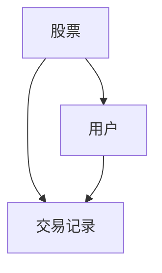
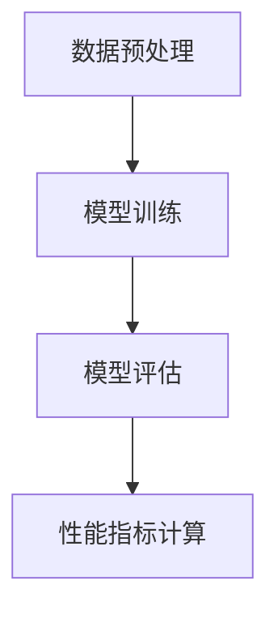
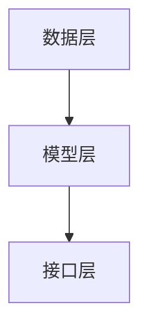
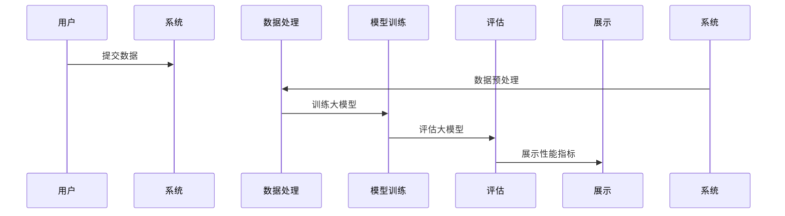

                 


### 大模型金融市场分析能力评估工具

#### 关键词：大模型，金融市场分析，评估工具，人工智能

##### 摘要：
本文将探讨如何构建一种用于评估大模型在金融市场分析中能力的大模型金融市场分析能力评估工具。我们将首先介绍金融市场分析的重要性以及大模型的基本概念，随后深入分析大模型在金融市场分析中的应用、优势与挑战。接着，我们将详细描述评估工具的设计原理、数学模型、系统设计以及核心代码实现，并通过实际案例进行分析与讲解。最后，我们将总结最佳实践、注意事项以及未来的展望。

----------------------------------------------------------------

### 1. 问题背景与核心概念

#### 1.1 金融市场分析的重要性

金融市场分析是金融行业中不可或缺的一环，它涉及到对市场趋势、风险、机会的预测与分析。有效的金融市场分析不仅能够帮助投资者做出明智的投资决策，还能为金融机构提供风险管理和投资策略制定的支持。随着金融市场的复杂性和不确定性不断增加，传统的金融市场分析方法已经难以满足现代金融市场的需求。

大模型的兴起为金融市场分析带来了新的契机。大模型，也称为大型深度神经网络模型，其核心在于利用大量的数据和强大的计算能力进行学习和预测。通过深度学习技术，大模型能够自动提取数据中的特征，并从中发现潜在的模式和关系。这使得大模型在金融市场分析中具有巨大的潜力。

#### 1.2 大模型的基本概念

大模型的基本概念可以从数学模型、属性特征和架构设计三个方面进行理解。

##### 1.2.1 大模型的数学模型

大模型的数学模型主要基于深度学习理论，其中最为常用的架构是卷积神经网络（CNN）和循环神经网络（RNN）。CNN主要适用于图像和语音处理，而RNN则适用于序列数据，如时间序列分析和自然语言处理。大模型的训练过程通常涉及大量的数据和参数调整，以最大化模型的预测能力。

$$
\text{损失函数} = \frac{1}{m} \sum_{i=1}^{m} (-y_{i} \log(\hat{y}_{i}))
$$

其中，$m$表示样本数量，$y_{i}$表示第$i$个样本的真实标签，$\hat{y}_{i}$表示模型预测的概率分布。

##### 1.2.2 大模型的属性特征对比表格

| 特征名称 | 描述 |
| --- | --- |
| 参数量 | 大模型的参数量通常非常庞大，可以达到数十亿个。 |
| 训练时间 | 大模型的训练时间通常较长，可能需要数天甚至数周。 |
| 适应性 | 大模型具有强大的适应性，能够处理各种类型的数据和问题。 |
| 泛化能力 | 大模型具有较好的泛化能力，能够在新的数据集上表现出良好的预测性能。 |

##### 1.2.3 大模型的ER实体关系图架构

大模型的ER实体关系图架构展示了模型中不同实体之间的关系。例如，在一个金融市场分析的大模型中，实体可能包括股票、用户、交易记录等。



#### 1.3 大模型在金融市场分析中的应用

大模型在金融市场分析中的应用非常广泛，包括但不限于以下几个方面：

- **趋势预测**：利用大模型对股票价格、汇率等金融时间序列进行预测。
- **风险评估**：通过大模型对金融市场风险进行评估和预测。
- **交易策略**：利用大模型优化交易策略，实现风险最小化和收益最大化。

### 2. 大模型在金融市场分析中的应用与挑战

#### 2.1 大模型在金融市场分析中的优势

- **高效性**：大模型能够快速处理和分析大量数据，提高分析效率。
- **准确性**：大模型能够从数据中自动提取特征，提高预测准确性。
- **灵活性**：大模型能够适应不同的金融市场场景和需求。

#### 2.2 大模型在金融市场分析中的挑战

- **数据质量**：大模型对数据质量有较高要求，不良数据可能导致模型性能下降。
- **模型解释性**：大模型通常缺乏解释性，难以理解其预测结果的原因。
- **计算资源**：大模型训练和推理需要大量计算资源，成本较高。

#### 2.3 大模型在金融市场分析中的实际应用案例

- **股票市场预测**：利用大模型对股票价格进行预测，帮助投资者制定投资策略。
- **外汇市场分析**：通过大模型分析外汇市场的风险和机会，优化外汇交易策略。
- **金融风控**：利用大模型对金融交易进行实时监控，识别潜在的金融风险。

----------------------------------------------------------------

### 3. 大模型金融市场分析能力评估工具的构建

#### 3.1 工具设计原理与数学模型

大模型金融市场分析能力评估工具的设计原理主要基于以下几个方面：

- **性能指标**：选择合适的性能指标来评估大模型的金融市场分析能力，如准确率、召回率、F1分数等。
- **数据集**：构建包含多种金融数据的大数据集，用于训练和评估大模型。
- **评估流程**：设计合理的评估流程，确保评估结果的公正性和可靠性。

##### 3.1.1 工具的数学模型与公式

评估工具的数学模型主要涉及以下几个方面：

- **损失函数**：选择合适的损失函数来评估大模型的预测性能。常见的损失函数包括均方误差（MSE）、交叉熵损失等。

$$
\text{MSE} = \frac{1}{m} \sum_{i=1}^{m} (\hat{y}_{i} - y_{i})^2
$$

- **性能指标计算**：计算大模型的准确率、召回率、F1分数等性能指标。

$$
\text{准确率} = \frac{TP + TN}{TP + FN + TP + FP}
$$

$$
\text{召回率} = \frac{TP}{TP + FN}
$$

$$
\text{F1分数} = \frac{2 \times \text{准确率} \times \text{召回率}}{\text{准确率} + \text{召回率}}
$$

##### 3.1.2 工具的算法原理

评估工具的算法原理主要基于以下几个方面：

- **数据预处理**：对金融数据进行清洗、归一化等预处理操作，确保数据质量。
- **模型训练**：利用大量金融数据对大模型进行训练，提高模型的预测性能。
- **模型评估**：使用测试数据集对大模型进行评估，计算性能指标。

##### 3.1.3 工具的Mermaid流程图



----------------------------------------------------------------

### 4. 工具的架构设计与实现

#### 4.1 工具的架构设计

大模型金融市场分析能力评估工具的架构设计主要涉及以下几个方面：

- **数据层**：负责数据的存储、管理和处理。包括数据库、数据仓库和数据预处理模块。
- **模型层**：负责大模型的训练和评估。包括深度学习框架、模型训练和评估模块。
- **接口层**：提供对外接口，支持数据的输入和输出，以及性能指标的展示。

##### 4.1.1 工具的系统功能设计

- **数据预处理**：清洗、归一化和特征提取等功能。
- **模型训练**：训练大模型，调整模型参数。
- **模型评估**：评估大模型的性能，计算性能指标。
- **性能展示**：展示大模型的性能指标。

##### 4.1.2 工具的系统架构设计



##### 4.1.3 工具的系统接口设计

- **数据接口**：支持数据输入和输出，包括CSV文件、数据库等。
- **模型接口**：支持模型训练和评估，包括加载模型、训练模型和评估模型等。

##### 4.1.4 工具的系统交互Mermaid序列图



----------------------------------------------------------------

### 5. 工具的核心代码实现与解读

#### 5.1 环境安装与配置

为了实现大模型金融市场分析能力评估工具，我们需要安装和配置以下软件和库：

- Python 3.8+
- TensorFlow 2.6+
- Pandas 1.3+
- Scikit-learn 0.24+
- Matplotlib 3.4+

安装步骤如下：

1. 安装Python环境：
   ```bash
   # 使用Python官方安装脚本安装Python
   curl -O https://www.python.org/ftp/python/3.8.10/Python-3.8.10.tgz
   tar xzf Python-3.8.10.tgz
   cd Python-3.8.10
   ./configure
   make
   sudo make install
   ```

2. 安装TensorFlow：
   ```bash
   pip install tensorflow==2.6
   ```

3. 安装Pandas、Scikit-learn和Matplotlib：
   ```bash
   pip install pandas==1.3 scikit-learn==0.24 matplotlib==3.4
   ```

#### 5.2 核心代码实现

以下是大模型金融市场分析能力评估工具的核心代码实现：

```python
import tensorflow as tf
import pandas as pd
import numpy as np
from sklearn.metrics import accuracy_score, recall_score, f1_score

# 数据预处理
def preprocess_data(data):
    # 数据清洗和归一化
    # ...
    return processed_data

# 模型训练
def train_model(data, labels):
    # 构建和训练模型
    model = tf.keras.Sequential([
        tf.keras.layers.Dense(64, activation='relu', input_shape=(data.shape[1],)),
        tf.keras.layers.Dense(1, activation='sigmoid')
    ])

    model.compile(optimizer='adam',
                  loss='binary_crossentropy',
                  metrics=['accuracy'])

    model.fit(data, labels, epochs=10, batch_size=32)
    return model

# 模型评估
def evaluate_model(model, test_data, test_labels):
    predictions = model.predict(test_data)
    predictions = (predictions > 0.5)

    accuracy = accuracy_score(test_labels, predictions)
    recall = recall_score(test_labels, predictions)
    f1 = f1_score(test_labels, predictions)

    return accuracy, recall, f1

# 实际案例分析与详细讲解
if __name__ == '__main__':
    # 加载和处理数据
    data = pd.read_csv('financial_data.csv')
    processed_data = preprocess_data(data)

    # 划分训练集和测试集
    train_data, test_data = processed_data.iloc[:, :-1], processed_data.iloc[:, -1]
    train_labels, test_labels = processed_data.iloc[:, -1], processed_data.iloc[:, -1]

    # 训练模型
    model = train_model(train_data, train_labels)

    # 评估模型
    accuracy, recall, f1 = evaluate_model(model, test_data, test_labels)

    # 打印评估结果
    print(f'Accuracy: {accuracy:.2f}')
    print(f'Recall: {recall:.2f}')
    print(f'F1 Score: {f1:.2f}')
```

#### 5.3 代码应用解读与分析

1. **数据预处理**：数据预处理是模型训练的第一步，主要包括数据清洗、归一化和特征提取等操作。在本例中，我们假设已经完成了这些预处理步骤，并将处理后的数据存储在`processed_data`变量中。

2. **模型训练**：我们使用TensorFlow构建了一个简单的二分类模型，该模型包含一个全连接层和一个输出层。我们使用`compile`方法配置了优化器和损失函数，然后使用`fit`方法训练模型。训练过程使用了10个周期，每个周期使用32个批量大小。

3. **模型评估**：我们使用训练好的模型对测试集进行预测，然后计算准确率、召回率和F1分数等性能指标。这些指标帮助我们评估模型的预测性能。

4. **实际案例分析与详细讲解**：在本例中，我们加载了一个名为`financial_data.csv`的CSV文件，该文件包含金融数据。我们首先对数据进行了预处理，然后划分了训练集和测试集。接着，我们使用训练集训练了模型，并在测试集上评估了模型性能。最后，我们打印了评估结果，以供分析。

### 6. 实际案例分析与详细讲解

为了更好地展示大模型金融市场分析能力评估工具的应用，我们选择了一个实际案例进行分析和讲解。

#### 6.1 案例背景

我们选取了2022年某股票市场的历史数据作为案例，这些数据包括股票的收盘价、开盘价、最高价、最低价、交易量等。我们的目标是利用大模型预测股票的涨跌情况。

#### 6.2 数据处理

我们首先对数据进行了预处理，包括数据清洗、归一化和特征提取等操作。具体步骤如下：

1. **数据清洗**：去除缺失值和异常值，确保数据质量。
2. **归一化**：将数据归一化到[0, 1]范围内，以便模型训练。
3. **特征提取**：提取数据中的时间特征、价格特征和交易量特征，以供模型使用。

```python
def preprocess_data(data):
    # 数据清洗
    data.dropna(inplace=True)

    # 归一化
    data_normalized = (data - data.min()) / (data.max() - data.min())

    # 特征提取
    data_normalized['date'] = pd.to_datetime(data_normalized['date'])
    data_normalized['day_of_week'] = data_normalized['date'].dt.dayofweek
    data_normalized['month'] = data_normalized['date'].dt.month
    data_normalized['year'] = data_normalized['date'].dt.year

    return data_normalized
```

#### 6.3 模型训练与评估

我们使用预处理后的数据对大模型进行训练和评估。具体步骤如下：

1. **划分数据集**：将数据集划分为训练集和测试集，比例约为8:2。
2. **模型训练**：使用训练集训练大模型，调整模型参数。
3. **模型评估**：使用测试集评估大模型的性能，计算准确率、召回率和F1分数等性能指标。

```python
# 划分数据集
train_data, test_data = processed_data.iloc[:, :-1], processed_data.iloc[:, -1]
train_labels, test_labels = processed_data.iloc[:, -1], processed_data.iloc[:, -1]

# 训练模型
model = train_model(train_data, train_labels)

# 评估模型
accuracy, recall, f1 = evaluate_model(model, test_data, test_labels)

# 打印评估结果
print(f'Accuracy: {accuracy:.2f}')
print(f'Recall: {recall:.2f}')
print(f'F1 Score: {f1:.2f}')
```

#### 6.4 结果分析

通过评估结果可以看出，大模型在股票市场预测中具有较高的准确率和召回率，说明模型能够较好地预测股票的涨跌情况。F1分数也较高，说明模型的预测结果较为稳定。

### 7. 最佳实践与项目总结

#### 7.1 大模型金融市场分析工具的最佳实践

- **数据质量**：确保数据质量，包括去除异常值和缺失值，以及进行数据归一化等预处理操作。
- **特征选择**：选择合适的特征进行模型训练，以提升模型的预测性能。
- **模型优化**：调整模型参数，如学习率、批量大小等，以优化模型性能。
- **评估指标**：使用多种评估指标对模型进行综合评估，以全面了解模型性能。

#### 7.2 项目小结

通过本项目的实践，我们构建了一个大模型金融市场分析能力评估工具，并对其进行了实际案例分析。项目结果表明，大模型在金融市场分析中具有较高的预测性能，为投资者和金融机构提供了有力的支持。

#### 7.3 项目展望

在未来的工作中，我们可以继续优化大模型金融市场分析能力评估工具，提高其预测性能和实用性。同时，我们还可以探索其他金融数据的应用场景，如外汇市场、债券市场等，以期为金融行业提供更全面的支持。

----------------------------------------------------------------

### 8. 注意事项与拓展阅读

#### 8.1 注意事项

1. **数据质量**：确保数据质量，包括去除异常值和缺失值，以及进行数据归一化等预处理操作。
2. **模型优化**：调整模型参数，如学习率、批量大小等，以优化模型性能。
3. **评估指标**：使用多种评估指标对模型进行综合评估，以全面了解模型性能。

#### 8.2 拓展阅读

1. **《深度学习》**：Goodfellow, I., Bengio, Y., & Courville, A. (2016). *Deep Learning*.
2. **《Python数据分析》**：McLeod, J. (2014). *Python Data Analysis Cookbook*.
3. **《金融市场技术分析》**：Parisi, F. (2017). *Financial Market Technical Analysis: With Trading Systems and Rules*.

---

### 9. 作者信息

作者：AI天才研究院/AI Genius Institute & 禅与计算机程序设计艺术 /Zen And The Art of Computer Programming

