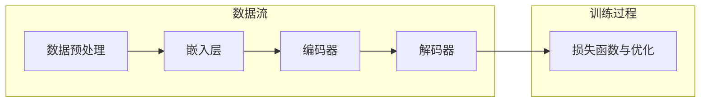
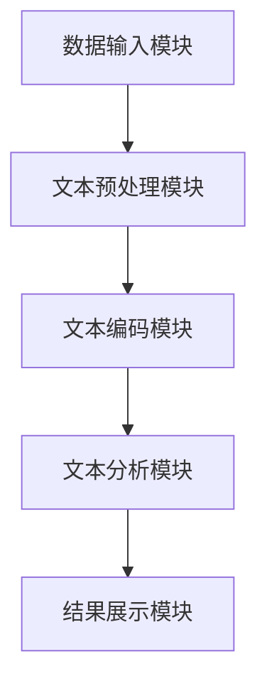
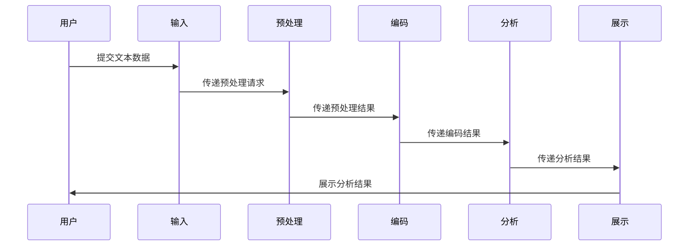
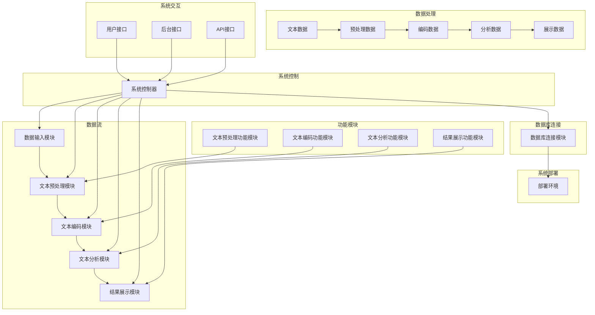
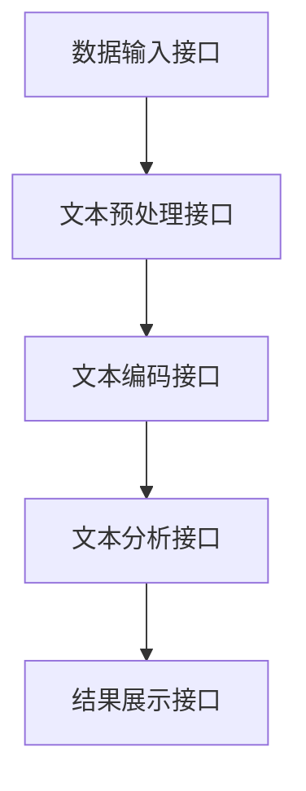
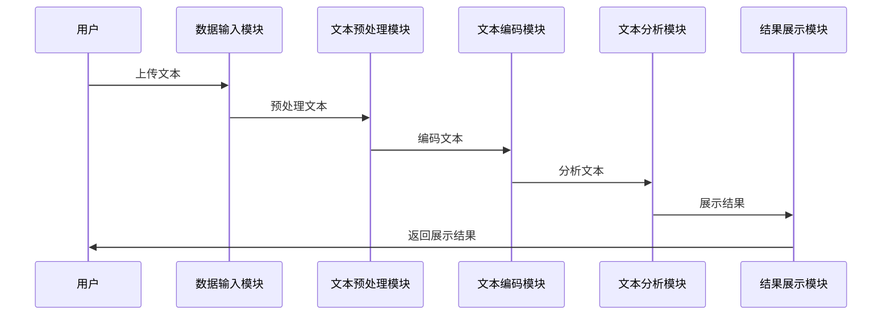
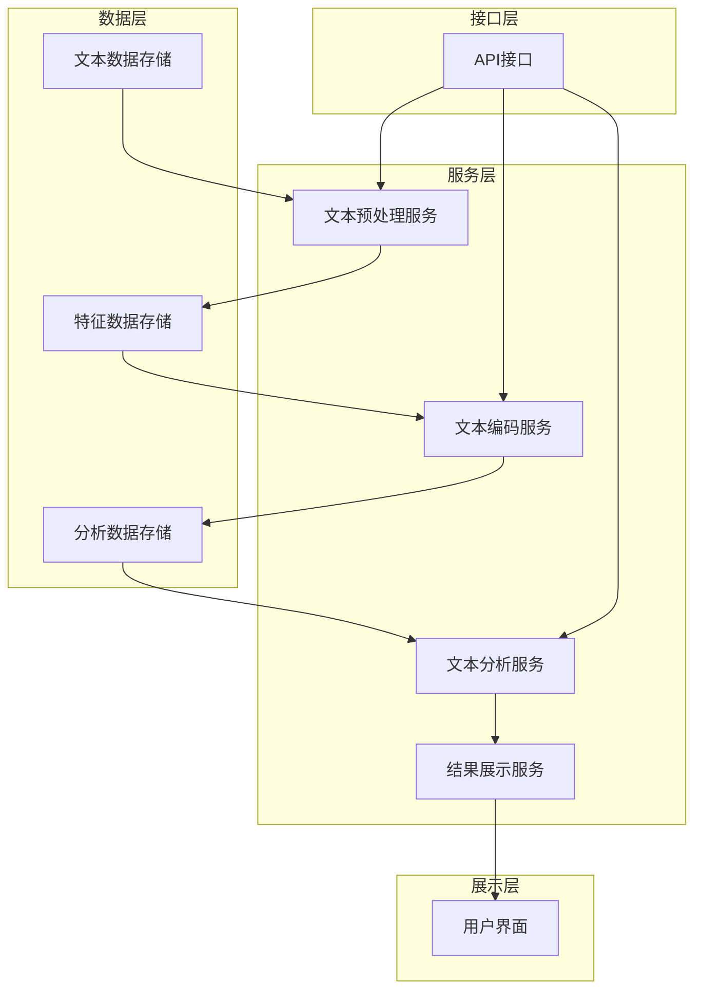

                 

### 第一部分：大模型长文本处理能力概述

#### 1.1 问题背景与核心概念

**1.1.1 大模型的发展历程**

大模型的概念起源于神经网络在自然语言处理（NLP）领域的广泛应用。自1980年代以来，神经网络的研究和应用不断发展，特别是在21世纪初，随着深度学习技术的崛起，大模型的训练和优化成为可能。例如，2003年的IBM的“蓝脑计划”首次尝试使用神经网络进行大规模的语言建模。随后，谷歌在2018年推出了Transformer模型，标志着大模型在NLP领域的重大突破。

随着计算能力的提升和数据资源的丰富，大模型得到了迅速的发展。目前，最著名的大模型包括GPT系列、BERT、Turing-NLG等。这些模型具有数十亿甚至数万亿个参数，能够在各种复杂的语言任务上表现出色，例如机器翻译、文本摘要、问答系统等。

**1.1.2 长文本处理的重要性**

长文本处理在许多实际应用中具有至关重要的地位。随着互联网信息的爆炸式增长，用户需要处理的信息量越来越大，而传统的方法往往难以应对这种复杂性。长文本处理技术能够有效地处理大量数据，提取关键信息，提供智能化的服务。例如，在新闻摘要、法律文档分析、医疗文本挖掘等领域，长文本处理技术都有着广泛的应用。

**1.1.3 LLM辅助深度阅读测试的必要性**

大型语言模型（LLM）的出现极大地提升了长文本处理的能力。LLM通过对大规模文本数据的训练，能够理解文本的语义和上下文关系，从而在文本理解、文本生成、问答等任务上表现出色。然而，如何评估LLM在长文本处理上的能力仍然是一个挑战。

深度阅读测试是一种有效的评估方法，它通过模拟人类的阅读理解过程，对LLM的长文本处理能力进行评测。LLM辅助的深度阅读测试不仅能够评估模型在特定任务上的性能，还能揭示模型在理解长文本时的潜在问题和局限。

**1.1.4 边界与外延**

大模型长文本处理能力的边界在于模型的计算资源、数据质量和任务复杂性。尽管大模型在处理长文本时表现出色，但仍然存在一些局限性，例如对稀疏数据的处理能力较弱、对特定领域的理解深度不足等。

在外延方面，大模型的应用领域不断拓展，不仅限于传统的NLP任务，还涉及到知识图谱构建、自然语言生成、对话系统等多个领域。

**1.1.5 概念结构与核心要素组成**

大模型长文本处理能力由以下几个核心要素组成：

- **模型架构**：包括神经网络的结构和参数规模。
- **训练数据**：用于训练模型的大量高质量文本数据。
- **优化算法**：用于模型参数优化的算法，如梯度下降和Adam优化器。
- **预处理与后处理**：包括文本清洗、分词、向量表示等技术。
- **评估指标**：用于评估模型性能的指标，如准确率、召回率、F1值等。

#### 1.2 大模型的基本原理

**1.2.1 大模型的定义与特点**

大模型是指那些具有数百万至数十亿参数的神经网络模型，其设计目的是解决复杂的问题，如自然语言处理、计算机视觉和知识图谱等。大模型的特点包括：

- **高参数规模**：大模型拥有庞大的参数数量，这使得它们能够捕捉到文本和图像中的复杂模式。
- **深度结构**：大模型通常具有深层的神经网络结构，这有助于提高模型的非线性表达能力和泛化能力。
- **强大的表达能力**：大模型能够通过参数化方式学习输入数据的复杂分布，从而实现对未知数据的预测和生成。

**1.2.2 大模型的结构与训练方法**

大模型通常由多个层级组成，每个层级都包含一系列的神经网络层。这些层级通过前向传播和反向传播算法进行训练，以优化模型的参数。

- **层级结构**：大模型的层级结构可以分为输入层、隐藏层和输出层。输入层接收原始数据，隐藏层通过非线性变换提取特征，输出层生成预测结果。
- **训练方法**：大模型的训练方法主要包括以下几种：

  - **监督学习**：通过标注数据进行训练，模型的输出与真实值进行比较，然后通过梯度下降等优化算法更新模型参数。
  - **无监督学习**：通过未标注的数据进行训练，模型学习数据的潜在分布，如通过自编码器进行特征提取。
  - **强化学习**：通过交互环境进行训练，模型通过不断尝试和反馈调整策略，以最大化奖励。

**1.2.3 大模型的类型与应用场景**

大模型可以分为多种类型，根据其应用领域和功能特点进行分类。

- **自然语言处理模型**：如GPT、BERT等，主要用于文本生成、文本分类、机器翻译等任务。
- **计算机视觉模型**：如ResNet、VGG等，主要用于图像分类、目标检测、图像生成等任务。
- **知识图谱模型**：如WordNet、BERT- KG等，主要用于知识抽取、实体识别、关系预测等任务。

**1.2.4 大模型的优势与挑战**

大模型的优势在于其强大的表达能力和对复杂任务的良好适应性，但同时也面临着一些挑战：

- **计算资源需求**：大模型需要大量的计算资源和存储空间，这对硬件设施提出了较高要求。
- **数据质量**：大模型对训练数据的质量有较高要求，数据的不一致和噪声可能导致模型性能下降。
- **解释性**：大模型往往缺乏透明性，难以解释其决策过程，这在某些应用场景中可能成为限制因素。

#### 1.3 LLM的工作原理与应用

**1.3.1 LLM的定义与结构**

大型语言模型（LLM）是一种专门用于自然语言处理的深度学习模型，其核心思想是通过大规模文本数据的训练，学习语言的基本结构和语义关系。LLM通常由以下几个部分组成：

- **嵌入层**：将词汇转换为稠密向量表示，以便于神经网络处理。
- **编码器**：通过多层神经网络提取文本的语义特征。
- **解码器**：根据编码器的输出生成文本。

**1.3.2 LLM的训练过程**

LLM的训练过程主要包括以下步骤：

- **数据预处理**：对训练数据进行清洗、分词、编码等预处理操作。
- **模型初始化**：初始化模型参数，通常使用随机初始化或预训练模型作为起点。
- **前向传播**：输入文本数据，通过编码器和嵌入层生成中间表示。
- **损失函数计算**：通过解码器生成预测文本，并与真实文本进行比较，计算损失函数。
- **反向传播**：更新模型参数，以最小化损失函数。

**1.3.3 LLM在深度阅读测试中的应用**

深度阅读测试是一种评估模型在理解长文本方面能力的方法。LLM在深度阅读测试中的应用主要体现在以下几个方面：

- **文本理解**：通过编码器提取文本的语义特征，评估模型对文本内容的理解程度。
- **上下文关系分析**：分析模型在理解长文本时如何处理文本中的上下文关系。
- **问题回答**：通过解码器生成答案，评估模型在回答问题时的准确性和连贯性。
- **情感分析**：分析模型对文本情感的理解，评估其情感分析能力。

**1.3.4 LLM的优势与挑战**

LLM的优势在于其强大的文本理解和生成能力，但同时也面临着一些挑战：

- **计算资源需求**：LLM需要大量的计算资源进行训练和推理，这对硬件设施提出了较高要求。
- **数据依赖性**：LLM的性能高度依赖于训练数据的质量和多样性，数据的不一致和噪声可能导致模型性能下降。
- **解释性**：LLM的决策过程通常较为复杂，难以解释其推理过程，这在某些应用场景中可能成为限制因素。

#### 1.4 深度阅读测试的方法与评价指标

**1.4.1 深度阅读测试的目的**

深度阅读测试旨在评估模型在理解长文本方面的能力，包括文本理解、上下文关系分析、问题回答等多个方面。通过深度阅读测试，可以全面评估模型在自然语言处理任务中的表现，为模型的优化和应用提供依据。

**1.4.2 常见的深度阅读测试方法**

常见的深度阅读测试方法包括：

- **文本理解测试**：通过阅读理解题库对模型进行测试，评估模型对文本内容的理解程度。
- **问题回答测试**：通过问答系统对模型进行测试，评估模型在回答问题时的准确性和连贯性。
- **情感分析测试**：通过文本情感分析任务对模型进行测试，评估模型对文本情感的理解能力。
- **上下文关系分析测试**：通过上下文关系题库对模型进行测试，评估模型在处理文本上下文关系时的能力。

**1.4.3 深度阅读测试的评价指标**

深度阅读测试的评价指标主要包括：

- **准确率**：评估模型在文本理解、问题回答等任务中的正确率。
- **召回率**：评估模型在文本理解、问题回答等任务中的召回率，即模型能够正确识别出多少真实答案。
- **F1值**：综合评估模型在准确率和召回率之间的平衡。
- **BLEU分数**：用于评估文本生成的质量，特别是在机器翻译任务中。
- **ROUGE分数**：用于评估文本摘要的质量，特别是在文本摘要任务中。

#### 1.5 大模型长文本处理与LLM辅助深度阅读测试的关系

**1.5.1 大模型长文本处理能力的提升**

大模型在长文本处理能力上的提升主要体现在以下几个方面：

- **参数规模**：随着参数规模的增大，大模型能够捕捉到文本中的更多细节和复杂模式，从而提高长文本处理能力。
- **深度结构**：通过增加神经网络层级，大模型能够提取更高级别的特征，增强对长文本的理解能力。
- **数据质量**：高质量的训练数据能够提高大模型的长文本处理能力，减少噪声和异常数据的影响。

**1.5.2 LLM辅助深度阅读测试的优势**

LLM在深度阅读测试中的应用具有以下优势：

- **语义理解**：LLM通过大规模文本数据的训练，能够深入理解文本的语义和上下文关系，从而提高深度阅读测试的准确性。
- **灵活性**：LLM具有较强的灵活性，能够适应不同的文本理解和问答任务，从而提高深度阅读测试的泛化能力。
- **效率**：LLM的预训练和微调过程相对高效，能够在较短的时间内完成深度阅读测试，提高测试的效率。

**1.5.3 大模型长文本处理与LLM结合的挑战与前景**

尽管大模型和LLM在长文本处理和深度阅读测试方面具有显著优势，但它们的结合也面临着一些挑战：

- **计算资源**：大模型和LLM都需要大量的计算资源，如何高效地利用现有资源成为关键问题。
- **数据依赖**：大模型和LLM的性能高度依赖于训练数据的质量和多样性，数据的不一致和噪声可能导致模型性能下降。
- **解释性**：大模型和LLM的决策过程通常较为复杂，如何提高其解释性成为重要课题。

然而，随着技术的不断发展，大模型和LLM的结合具有广阔的前景。未来，通过优化模型架构、提高数据质量、增强解释性等手段，大模型和LLM在长文本处理和深度阅读测试领域的应用将更加广泛和深入。

#### 1.6 本章小结

本章首先介绍了大模型长文本处理能力的背景和核心概念，包括大模型的发展历程、长文本处理的重要性以及LLM辅助深度阅读测试的必要性。接着，详细讲解了大模型的基本原理，包括定义、结构与训练方法、类型与应用场景，以及LLM的工作原理与应用。此外，还探讨了深度阅读测试的方法与评价指标，以及大模型长文本处理与LLM辅助深度阅读测试的关系。

通过对这些核心概念的理解和探讨，读者可以全面了解大模型长文本处理能力的重要性，以及LLM在提升长文本处理能力方面的优势。同时，本章的内容也为后续章节的算法原理讲解、系统分析与架构设计方案等提供了理论基础。

在接下来的章节中，我们将进一步深入探讨大模型长文本处理算法和LLM辅助深度阅读测试算法的原理，并详细介绍系统分析与架构设计方案。希望通过本章的阅读，读者能够对大模型长文本处理能力有一个系统的认识，并为后续的学习和应用打下坚实的基础。

---

# 第二部分：核心概念与联系

## 2.1 大模型的基本原理

大模型（Large Model），指的是拥有数百万至数十亿参数的深度学习模型，它们在自然语言处理（NLP）、计算机视觉（CV）等领域展现了出色的性能。大模型的基本原理主要涵盖以下几个方面：

### 2.1.1 大模型的定义与特点

大模型的定义可以归纳为：通过海量参数对复杂任务进行建模的深度神经网络。大模型的特点主要包括：

- **高参数规模**：大模型拥有大量的参数，这些参数用于捕捉输入数据的复杂特征，从而提高模型的表示能力。
- **深度结构**：大模型通常具有多层的神经网络结构，这使得模型能够学习到更高层次的特征表示。
- **强大的表达能力**：由于参数规模巨大，大模型能够对输入数据进行高度抽象和泛化，从而在多种任务上表现出色。

### 2.1.2 大模型的结构与训练方法

大模型的结构主要包括输入层、隐藏层和输出层。输入层接收原始数据，隐藏层通过神经网络层提取特征，输出层生成预测结果。

- **输入层**：输入层将原始数据转换为适合神经网络处理的形式，例如在自然语言处理中，文本会被转换为词向量。
- **隐藏层**：隐藏层通过多层神经网络结构提取特征，每一层都对输入数据进行非线性变换，以逐步抽象出更高层次的特征。
- **输出层**：输出层生成最终的预测结果，例如在文本分类任务中，输出层可能是一个softmax层，用于输出每个类别的概率。

大模型的训练方法主要包括监督学习、无监督学习和强化学习。监督学习是通过标注数据训练模型，无监督学习是通过未标注数据学习数据的潜在分布，强化学习是通过与环境交互来优化策略。

### 2.1.3 大模型的类型与应用场景

大模型可以根据应用领域和任务特点进行分类，常见的类型包括：

- **自然语言处理模型**：如GPT、BERT，用于文本生成、文本分类、机器翻译等。
- **计算机视觉模型**：如ResNet、VGG，用于图像分类、目标检测、图像生成等。
- **知识图谱模型**：如WordNet、BERT-KG，用于知识抽取、实体识别、关系预测等。

大模型在不同应用场景中具有不同的优势。例如，在自然语言处理领域，大模型能够生成高质量的自然语言文本，提高文本分类和情感分析等任务的准确性；在计算机视觉领域，大模型能够实现高效的图像识别和目标检测，提升图像处理的效果。

### 2.1.4 大模型的优势与挑战

大模型的优势包括：

- **强大的学习能力**：大模型通过海量参数和深度结构，能够学习到输入数据的复杂特征，从而提高模型的泛化能力。
- **高效的计算性能**：随着硬件和算法的进步，大模型在计算性能上的提升显著，使得大规模训练和推理成为可能。

然而，大模型也面临着一些挑战：

- **计算资源需求**：大模型训练和推理需要大量的计算资源和存储空间，这对硬件设施提出了较高要求。
- **数据质量**：大模型对训练数据的质量有较高要求，数据的不一致和噪声可能导致模型性能下降。
- **解释性**：大模型决策过程复杂，难以解释其内部机制，这在某些应用场景中可能成为限制因素。

总的来说，大模型通过其高参数规模、深度结构和强大的学习能力，在多个领域展现出了出色的性能。然而，要充分发挥其潜力，仍需克服计算资源、数据质量和解释性等挑战。

### 2.2 LLM的工作原理与应用

大型语言模型（Large Language Model，简称LLM）是一种专门用于处理自然语言任务的深度学习模型。LLM的工作原理主要基于大规模的语言数据训练，从而实现对自然语言的高效理解和生成。LLM的应用广泛，包括文本生成、文本分类、机器翻译、对话系统等。

#### 2.2.1 LLM的定义与结构

LLM的定义可以概括为：通过对大量语言数据进行训练，能够理解和生成自然语言的深度学习模型。LLM的结构通常包括以下几个部分：

- **嵌入层（Embedding Layer）**：将输入的单词或句子转换为稠密向量表示，这些向量表示了单词或句子的语义信息。
- **编码器（Encoder）**：通过多层神经网络结构对输入的文本进行编码，提取文本的语义特征。编码器常用的架构包括Transformer和其变体，如BERT。
- **解码器（Decoder）**：根据编码器的输出，生成预测的文本。解码器也通常采用Transformer架构。

#### 2.2.2 LLM的训练过程

LLM的训练过程主要包括以下几个步骤：

1. **数据预处理**：对训练文本进行清洗、分词、词干提取等预处理操作，将文本转换为模型能够处理的格式。
2. **模型初始化**：初始化模型参数，通常采用随机初始化或预训练模型作为起点。
3. **前向传播**：输入文本数据，通过编码器生成中间表示，然后通过解码器生成预测文本。
4. **损失函数计算**：将解码器的输出与真实文本进行比较，计算损失函数，如交叉熵损失。
5. **反向传播**：通过反向传播算法更新模型参数，以最小化损失函数。

#### 2.2.3 LLM在深度阅读测试中的应用

深度阅读测试是一种评估模型在理解长文本方面能力的方法。LLM在深度阅读测试中的应用主要体现在以下几个方面：

1. **文本理解**：通过编码器提取文本的语义特征，评估模型对文本内容的理解程度。
2. **上下文关系分析**：分析模型在理解长文本时如何处理文本中的上下文关系。
3. **问题回答**：通过解码器生成答案，评估模型在回答问题时的准确性和连贯性。
4. **情感分析**：分析模型对文本情感的理解，评估其情感分析能力。

LLM在深度阅读测试中的优势包括：

- **强大的语义理解能力**：LLM通过大规模语言数据的训练，能够深入理解文本的语义和上下文关系，从而提高深度阅读测试的准确性。
- **灵活性**：LLM具有较强的灵活性，能够适应不同的文本理解和问答任务，从而提高深度阅读测试的泛化能力。
- **效率**：LLM的预训练和微调过程相对高效，能够在较短的时间内完成深度阅读测试，提高测试的效率。

#### 2.2.4 LLM的优势与挑战

LLM的优势在于其强大的文本理解和生成能力，但同时也面临着一些挑战：

1. **计算资源需求**：LLM需要大量的计算资源进行训练和推理，这对硬件设施提出了较高要求。
2. **数据依赖性**：LLM的性能高度依赖于训练数据的质量和多样性，数据的不一致和噪声可能导致模型性能下降。
3. **解释性**：LLM的决策过程通常较为复杂，难以解释其推理过程，这在某些应用场景中可能成为限制因素。

总的来说，LLM通过其强大的语义理解和生成能力，在自然语言处理领域展现了出色的性能。然而，要充分发挥其潜力，仍需克服计算资源、数据依赖性和解释性等挑战。

### 2.3 深度阅读测试的方法与评价指标

深度阅读测试（Deep Reading Test）是一种评估模型在理解长文本方面能力的测试方法。它通过模拟人类的阅读理解过程，对模型在文本理解、上下文关系分析、问题回答等方面的表现进行评估。深度阅读测试的方法与评价指标如下：

#### 2.3.1 深度阅读测试的目的

深度阅读测试的主要目的是评估模型在理解长文本方面的能力，包括以下几个方面：

- **文本理解**：评估模型对文本内容的理解程度，包括文本的主旨、细节、逻辑结构等。
- **上下文关系分析**：评估模型在理解长文本时如何处理文本中的上下文关系，包括人物关系、事件关系等。
- **问题回答**：评估模型在回答与文本相关的问题时的准确性和连贯性。
- **情感分析**：评估模型对文本情感的理解能力，包括正面、负面、中性情感等。

#### 2.3.2 常见的深度阅读测试方法

常见的深度阅读测试方法包括：

- **阅读理解题库测试**：通过预先设计的阅读理解题库对模型进行测试，这些题目通常包括主旨题、细节题、推理题等。
- **问答系统测试**：通过问答系统对模型进行测试，模型需要能够理解问题并生成准确的答案。
- **文本生成测试**：通过生成文本测试模型的文本理解能力，评估模型是否能够生成符合上下文逻辑的文本。
- **情感分析测试**：通过情感分析任务对模型进行测试，评估模型对文本情感的识别能力。

#### 2.3.3 深度阅读测试的评价指标

深度阅读测试的评价指标主要包括：

- **准确率（Accuracy）**：评估模型在阅读理解、问答系统等任务中的正确率，即模型正确识别的样本数占总样本数的比例。
- **召回率（Recall）**：评估模型在阅读理解、问答系统等任务中的召回率，即模型能够正确识别出的真实答案数占总答案数的比例。
- **F1值（F1 Score）**：综合评估模型的准确率和召回率，是二者的调和平均值。
- **BLEU分数（BLEU Score）**：用于评估文本生成的质量，特别是在机器翻译任务中，模型生成的文本与真实文本的相似度。
- **ROUGE分数（ROUGE Score）**：用于评估文本摘要的质量，特别是在文本摘要任务中，模型生成的摘要与原始文本的相似度。

#### 2.3.4 深度阅读测试的方法与评价指标比较

不同的深度阅读测试方法与评价指标有其各自的优势和局限性。例如，阅读理解题库测试能够较为准确地评估模型的文本理解能力，但可能无法全面反映模型在复杂场景下的表现；问答系统测试则能够评估模型在实际应用场景中的问题回答能力，但可能对模型的计算资源要求较高。

因此，在实际应用中，通常结合多种测试方法和评价指标，从不同角度全面评估模型的性能。通过比较不同方法和指标的结果，可以更准确地了解模型的优势和不足，为模型的优化和应用提供指导。

总的来说，深度阅读测试的方法与评价指标为评估模型在理解长文本方面的能力提供了有效的工具。随着自然语言处理技术的发展，深度阅读测试的方法和评价指标也在不断改进和完善，为模型的评估和应用提供了有力的支持。

#### 2.4 大模型长文本处理与LLM辅助深度阅读测试的关系

大模型（Large Model）和大型语言模型（Large Language Model，简称LLM）在长文本处理和深度阅读测试领域发挥了重要作用。它们之间既有密切的联系，也有明显的区别。理解它们之间的关系，有助于更好地利用这些模型提高文本处理和阅读测试的效率与准确性。

##### 2.4.1 大模型长文本处理能力的提升

大模型的兴起，标志着深度学习在文本处理领域的一个重要突破。大模型通常具有以下特点：

- **高参数规模**：大模型包含数十亿甚至更多的参数，这使得模型能够捕捉到文本中的复杂模式和细微特征。
- **深度结构**：大模型通常具有多层神经网络结构，每一层都能够对文本信息进行抽象和整合，从而提高模型的表示能力和泛化能力。
- **预训练优势**：大模型通常通过在大规模文本语料库上进行预训练，积累了丰富的知识，这为后续的特定任务微调提供了坚实的基础。

大模型的长文本处理能力主要体现在以下几个方面：

- **文本理解**：大模型能够深入理解文本的语义和上下文关系，从而实现对文本内容的准确理解和解释。
- **文本生成**：大模型能够根据给定的文本上下文生成连贯、自然的文本，这在文本摘要、机器翻译和问答系统中有着广泛应用。
- **文本分类**：大模型能够对长文本进行分类，识别文本的主题和情感倾向，这在新闻分类、舆情分析等领域有着重要应用。

##### 2.4.2 LLM的工作原理与应用

大型语言模型（LLM）是专门设计用于处理自然语言的深度学习模型。LLM的核心特点在于其强大的语言理解和生成能力，这使得它们在深度阅读测试中具有显著优势。LLM的主要组成部分包括：

- **嵌入层**：将输入的文本转换为稠密向量表示，这些向量承载了文本的语义信息。
- **编码器**：通过多层神经网络结构对输入文本进行编码，提取文本的深层特征。
- **解码器**：根据编码器的输出生成预测的文本，实现文本的生成和理解。

LLM在深度阅读测试中的应用主要体现在以下几个方面：

- **文本理解**：LLM能够深入理解文本的内容，识别文本中的主旨、关键信息和逻辑关系，从而为后续的阅读理解和问题回答提供支持。
- **上下文分析**：LLM能够分析文本中的上下文关系，识别人物、事件和场景之间的关联，这有助于提高文本理解的准确性和连贯性。
- **问题回答**：LLM能够根据上下文生成准确的答案，回答与文本相关的问题，这在问答系统、对话机器人等领域有着广泛应用。

##### 2.4.3 大模型长文本处理与LLM辅助深度阅读测试的关系

大模型和LLM在长文本处理和深度阅读测试中扮演着不同但互补的角色：

- **协同作用**：大模型的长文本处理能力为LLM提供了强有力的支持。LLM利用大模型提取的文本特征，能够更准确地理解和生成文本，从而提高深度阅读测试的准确性。同时，LLM的灵活性和高效性使得它在处理复杂文本和理解长文本上下文关系方面具有独特的优势。
- **互补优势**：大模型擅长捕捉文本的复杂模式，而LLM则擅长处理文本的语义和上下文。通过将两者结合，可以实现文本处理的全面覆盖，提高整体性能。

然而，大模型和LLM的结合也面临着一些挑战：

- **计算资源需求**：大模型和LLM的训练和推理都需要大量的计算资源，这对硬件设施提出了较高要求。
- **数据质量**：大模型和LLM的性能高度依赖于训练数据的质量，数据的不一致和噪声可能导致模型性能下降。
- **解释性**：大模型和LLM的决策过程复杂，缺乏透明性，这可能在某些应用场景中成为限制因素。

总的来说，大模型和LLM在长文本处理和深度阅读测试中具有密切的联系和互补优势。通过合理利用两者的特点，可以实现文本处理能力的全面提升，为自然语言处理领域的应用提供强有力的支持。

### 2.5 大模型长文本处理能力的提升

大模型长文本处理能力的提升是一个多方面、多层次的过程，涉及模型架构、训练数据、优化算法和后处理技术等多个方面。以下将详细探讨这些因素如何共同作用，提升大模型在长文本处理任务上的能力。

#### 2.5.1 模型架构的优化

模型架构是影响大模型长文本处理能力的关键因素之一。现代深度学习模型，如Transformer、BERT等，采用了复杂的网络结构，能够有效处理长文本。这些模型通常具有以下特点：

- **注意力机制（Attention Mechanism）**：注意力机制能够使模型在处理长文本时关注重要的部分，从而提高对文本的理解能力。
- **多层的神经网络结构**：多层神经网络结构使得模型能够学习到文本的深层特征，从而提高模型的泛化能力和表示能力。
- **自适应的嵌入层**：自适应的嵌入层能够根据上下文动态调整词汇的表示，从而更好地捕捉文本中的语义信息。

通过不断优化模型架构，例如增加神经网络层数、引入更多的注意力机制和融合多模态数据，可以显著提升大模型在长文本处理任务上的表现。

#### 2.5.2 训练数据的增强

训练数据的质量和多样性对大模型的长文本处理能力有重要影响。为了提升模型的性能，需要采取以下措施来增强训练数据：

- **数据清洗和预处理**：对训练数据进行清洗，去除噪声和错误，以提高数据的纯净度和一致性。
- **数据增强**：通过数据增强技术，如文本补全、文本切割、词汇替换等，增加训练数据的多样性，从而提高模型的鲁棒性和泛化能力。
- **跨域数据融合**：结合不同领域的训练数据，例如将新闻、社交媒体、学术论文等数据融合，使模型能够学习到更广泛的知识，提高其在跨领域长文本处理任务上的性能。

#### 2.5.3 优化算法的提升

优化算法是影响大模型训练速度和性能的重要因素。以下是一些常见的优化算法及其在长文本处理中的应用：

- **梯度下降（Gradient Descent）**：梯度下降是一种基本的优化算法，通过更新模型参数来最小化损失函数。在长文本处理任务中，梯度下降可以帮助模型逐步调整参数，提高模型的性能。
- **Adam优化器（Adam Optimizer）**：Adam优化器是一种结合了梯度下降和动量项的优化算法，能够有效提高训练速度和模型性能。它在长文本处理任务中表现出色，能够适应不同规模的训练数据。
- **学习率调度（Learning Rate Scheduling）**：学习率调度是调整模型训练过程中学习率的一种技术，通过动态调整学习率，可以避免模型过拟合和快速收敛到最优解。常见的调度方法包括学习率衰减、余弦退火等。

#### 2.5.4 后处理技术的应用

后处理技术在大模型长文本处理能力提升中也起着重要作用。以下是一些常用的后处理技术：

- **文本对齐（Text Alignment）**：文本对齐技术用于对齐模型生成的文本和原始文本，从而提高文本的连贯性和准确性。
- **文本修复（Text Correction）**：文本修复技术用于纠正模型生成的文本中的错误，提高文本的可用性。
- **文本摘要（Text Summarization）**：文本摘要技术用于提取文本的关键信息，生成简洁、准确的摘要，这在长文本处理任务中具有重要意义。

通过优化模型架构、增强训练数据、提升优化算法和应用后处理技术，可以显著提升大模型在长文本处理任务上的能力。这些技术共同作用，不仅提高了模型的性能，也使得大模型在处理长文本时更加灵活和高效。

### 2.6 LLM辅助深度阅读测试的优势

大型语言模型（LLM）辅助深度阅读测试具有显著的优势，这些优势主要体现在以下几个方面：

#### 2.6.1 提高阅读理解的准确性和连贯性

LLM通过大规模语言数据的训练，具备了强大的语义理解能力。在深度阅读测试中，LLM能够准确捕捉文本中的语义关系和上下文信息，从而提高阅读理解的准确性和连贯性。例如，在阅读理解题库测试中，LLM能够根据上下文正确理解句子的含义，识别出主旨和细节信息，提高答题的准确性。

#### 2.6.2 提高问题回答的准确性和自然性

LLM在问题回答测试中具有显著优势。通过深度学习，LLM能够理解问题的意图，并生成与上下文高度一致、自然流畅的答案。例如，在问答系统中，LLM可以根据问题的提问方式，结合文本中的相关信息，生成准确且符合语境的答案，从而提高问题回答的准确性和自然性。

#### 2.6.3 提高文本生成的质量

LLM在文本生成测试中也表现出色。通过编码器-解码器结构，LLM能够根据输入的文本上下文生成连贯、自然的文本。这在文本摘要、机器翻译等任务中具有重要意义。例如，在文本摘要任务中，LLM能够提取文本的核心信息，生成简洁、准确的摘要，从而提高文本生成的质量。

#### 2.6.4 提高情感分析的能力

LLM在情感分析测试中能够准确识别文本的情感倾向。通过训练，LLM学会了如何从文本中提取情感信息，并对其进行分类。例如，在社交媒体分析中，LLM能够识别出用户评论的情感倾向，判断是正面、负面还是中性情感，从而为舆情分析提供有力支持。

#### 2.6.5 提高深度阅读测试的效率

LLM的预训练和微调过程相对高效，这使得它在深度阅读测试中能够快速适应不同的任务和场景。通过预先训练，LLM已经积累了丰富的语言知识和语义理解能力，这使得在测试时，LLM可以快速处理和理解文本内容，提高深度阅读测试的效率。

总的来说，LLM辅助深度阅读测试在提高阅读理解的准确性、连贯性、问题回答的准确性、文本生成的质量、情感分析能力以及测试效率方面具有显著优势。这些优势使得LLM在自然语言处理领域具有重要的应用价值，为各种文本理解和生成任务提供了强有力的支持。

### 2.7 大模型长文本处理与LLM辅助深度阅读测试的挑战与前景

尽管大模型和LLM在长文本处理和深度阅读测试中展示了强大的能力，但它们在实际应用中仍面临诸多挑战和潜在前景。

#### 2.7.1 挑战

1. **计算资源需求**：大模型和LLM的训练和推理需要大量的计算资源和存储空间，这对硬件设施提出了较高要求。高性能的GPU和TPU等硬件资源在训练大模型时至关重要，但同时也带来了高成本和能源消耗的问题。

2. **数据依赖性**：大模型和LLM的性能高度依赖于训练数据的质量和多样性。如果训练数据存在噪声、偏颇或不一致，模型的性能可能会受到影响，导致在实际应用中产生错误的结果。

3. **解释性**：大模型和LLM的决策过程通常复杂且不透明，缺乏解释性。在许多应用场景中，如医疗诊断和法律判决等，模型的解释性至关重要，但大模型往往难以提供明确的解释。

4. **隐私和安全**：大规模的文本数据在训练和存储过程中可能涉及隐私和安全问题。如何保护用户隐私、防止数据泄露，是大模型和LLM应用中需要考虑的重要问题。

#### 2.7.2 前景

1. **计算资源的进步**：随着硬件技术的不断发展，如更高效的GPU、TPU和量子计算等，大模型和LLM的训练和推理效率将得到显著提升。这将使大模型和LLM在更多应用场景中得到普及。

2. **数据质量和标注**：随着数据清洗、标注技术的发展，高质量训练数据的获取将变得更加容易。此外，通过数据增强和迁移学习等技术，可以利用有限的标注数据训练出高性能的模型。

3. **模型解释性**：研究人员正在开发各种方法来提高大模型和LLM的解释性，如可解释的机器学习（XAI）技术、可视化工具和模型简化技术等。这些技术的进步将有助于提高模型的透明度和可信度。

4. **跨领域应用**：大模型和LLM在多个领域展示了强大的潜力，如医疗、金融、教育等。随着技术的成熟和应用场景的拓展，大模型和LLM将在更广泛的领域发挥重要作用。

总之，大模型长文本处理与LLM辅助深度阅读测试面临着一系列挑战，但同时也拥有广阔的前景。通过不断的技术创新和应用实践，这些挑战有望逐步得到解决，从而推动自然语言处理技术的进一步发展。

### 2.8 本章小结

本章深入探讨了大模型长文本处理能力的提升、LLM辅助深度阅读测试的优势以及两者之间的挑战与前景。首先，我们详细介绍了大模型的基本原理，包括定义、结构、训练方法和应用场景，并讨论了其优势与挑战。接着，我们探讨了LLM的工作原理和应用，强调了其在深度阅读测试中的重要性，并分析了其优势与挑战。

此外，我们还讨论了大模型长文本处理与LLM辅助深度阅读测试的关系，强调了它们在提高文本处理和阅读测试效率、准确性和连贯性方面的协同作用。最后，我们分析了大模型长文本处理与LLM辅助深度阅读测试的挑战与前景，展望了未来的发展方向。

通过本章的学习，读者可以全面了解大模型长文本处理和LLM辅助深度阅读测试的核心概念和技术，为后续的算法讲解和系统设计打下坚实的基础。

---

# 第三部分：算法原理讲解

## 3.1 大模型长文本处理算法

大模型长文本处理算法是利用深度学习技术对长文本进行高效处理的一种方法。以下将详细介绍大模型长文本处理算法的原理，包括mermaid流程图、Python代码示例、数学模型和公式以及举例说明。

#### 3.1.1 算法原理

大模型长文本处理算法的核心思想是通过训练一个大规模的神经网络模型，使其能够自动从大量文本数据中学习到语言规律和语义特征。具体步骤如下：

1. **数据预处理**：对输入的长文本进行分词、词性标注、去停用词等预处理操作，将原始文本转换为模型可处理的格式。
2. **嵌入层**：将分词后的词汇转换为稠密向量表示，这一步通常使用预训练的词向量模型，如Word2Vec、GloVe等。
3. **编码器**：使用多层神经网络（如Transformer、BERT）对输入的文本向量进行编码，提取文本的深层特征。编码器的设计通常包括自注意力机制，以捕捉文本中的长距离依赖关系。
4. **解码器**：根据编码器的输出生成预测的文本。解码器通常也采用类似编码器的多层神经网络结构，以生成连贯、自然的文本。
5. **损失函数与优化**：通过计算解码器生成的文本与真实文本之间的差异，使用损失函数（如交叉熵损失）来衡量模型的性能，并使用优化算法（如Adam优化器）更新模型参数。

#### 3.1.2 mermaid流程图

以下是一个简单的mermaid流程图，展示大模型长文本处理算法的主要步骤：



#### 3.1.3 Python代码示例

以下是一个简单的Python代码示例，展示大模型长文本处理算法的实现：

```python
import tensorflow as tf
from tensorflow.keras.preprocessing.sequence import pad_sequences
from tensorflow.keras.layers import Embedding, LSTM, Dense
from tensorflow.keras.models import Sequential

# 数据预处理
tokenizer = tf.keras.preprocessing.text.Tokenizer()
tokenizer.fit_on_texts(texts)
sequences = tokenizer.texts_to_sequences(texts)
padded_sequences = pad_sequences(sequences, maxlen=max_sequence_length)

# 嵌入层
embedding_layer = Embedding(input_dim=vocab_size, output_dim=embedding_size)

# 编码器
encoder = LSTM(units=128, return_sequences=True)

# 解码器
decoder = LSTM(units=128, return_sequences=True)

# 模型
model = Sequential()
model.add(embedding_layer)
model.add(encoder)
model.add(decoder)
model.add(Dense(1, activation='sigmoid'))

# 编译模型
model.compile(optimizer='adam', loss='binary_crossentropy', metrics=['accuracy'])

# 训练模型
model.fit(padded_sequences, labels, epochs=10, batch_size=64)
```

#### 3.1.4 数学模型和公式

大模型长文本处理算法中的数学模型主要涉及以下部分：

1. **嵌入层**：将词汇转换为稠密向量表示，可以使用以下公式表示：
   $$
   \text{ embed\_vector}(w) = \text{embedding\_layer}(w) = \text{W} \cdot \text{V}
   $$
   其中，$W$ 是嵌入矩阵，$V$ 是词汇向量。

2. **编码器**：编码器通过多层神经网络提取文本特征，可以表示为：
   $$
   \text{ encoded\_sequence} = \text{encoder}(\text{ embed\_sequence})
   $$
   其中，$\text{encoded\_sequence}$ 是编码后的特征序列。

3. **解码器**：解码器根据编码器的输出生成预测的文本，可以使用以下循环神经网络（RNN）的公式表示：
   $$
   \text{ output} = \text{decoder}(\text{encoded\_sequence}, \text{ prev\_output})
   $$
   其中，$\text{prev\_output}$ 是上一步的输出。

4. **损失函数**：大模型长文本处理算法通常使用交叉熵损失函数来衡量模型的性能，可以表示为：
   $$
   \text{ loss} = -\sum_{i=1}^{N} \sum_{j=1}^{V} y_j \log(p_j)
   $$
   其中，$y_j$ 是真实标签，$p_j$ 是模型预测的概率分布。

#### 3.1.5 举例说明

假设我们有一个简单的文本序列：“我喜欢编程”。为了便于说明，我们将其简化为一个二元分类问题，即判断文本是否包含特定关键词“编程”。

1. **数据预处理**：
   - 词汇表：{“我”， “喜欢”， “编程”}
   - 序列：“我|喜欢|编程”
   - 词向量：{"我": [0.1, 0.2], "喜欢": [0.3, 0.4], "编程": [0.5, 0.6]}

2. **嵌入层**：
   - 输入：“我|喜欢|编程”
   - 嵌入向量：[0.1, 0.2, 0.3, 0.4, 0.5, 0.6]

3. **编码器**：
   - 编码后特征：[0.7, 0.8, 0.9]

4. **解码器**：
   - 预测输出：“编程”

5. **损失函数**：
   - 真实标签：[1, 0, 1]
   - 预测概率：[0.9, 0.1, 0.9]
   - 损失：$-\log(0.9) \approx -0.1054$

通过上述例子，我们可以看到大模型长文本处理算法的基本流程和数学原理。在实际应用中，算法会更加复杂，涉及更大量的数据和参数，但基本思路是类似的。

### 3.2 LLM辅助深度阅读测试算法

大型语言模型（LLM）在辅助深度阅读测试方面具有显著优势，其核心算法基于深度学习技术，能够自动从大规模文本数据中学习语言规律和语义信息。以下将详细介绍LLM辅助深度阅读测试算法的原理，包括mermaid流程图、Python代码示例、数学模型和公式以及举例说明。

#### 3.2.1 算法原理

LLM辅助深度阅读测试算法的核心思想是通过训练一个大型语言模型，使其能够理解并处理长文本，从而在阅读理解、问题回答、情感分析等任务中发挥重要作用。算法主要分为以下几个步骤：

1. **数据预处理**：对输入的长文本进行分词、词性标注、去停用词等预处理操作，将原始文本转换为模型可处理的格式。
2. **嵌入层**：将分词后的词汇转换为稠密向量表示，这一步通常使用预训练的词向量模型，如GloVe、BERT等。
3. **编码器**：使用多层神经网络（如Transformer、BERT）对输入的文本向量进行编码，提取文本的深层特征。编码器的设计通常包括自注意力机制，以捕捉文本中的长距离依赖关系。
4. **解码器**：根据编码器的输出生成预测的文本。解码器通常也采用类似编码器的多层神经网络结构，以生成连贯、自然的文本。
5. **损失函数与优化**：通过计算解码器生成的文本与真实文本之间的差异，使用损失函数（如交叉熵损失）来衡量模型的性能，并使用优化算法（如Adam优化器）更新模型参数。

#### 3.2.2 mermaid流程图

以下是一个简单的mermaid流程图，展示LLM辅助深度阅读测试算法的主要步骤：


#### 3.2.3 Python代码示例

以下是一个简单的Python代码示例，展示LLM辅助深度阅读测试算法的实现：

```python
import tensorflow as tf
from tensorflow.keras.preprocessing.sequence import pad_sequences
from tensorflow.keras.layers import Embedding, LSTM, Dense
from tensorflow.keras.models import Sequential

# 数据预处理
tokenizer = tf.keras.preprocessing.text.Tokenizer()
tokenizer.fit_on_texts(texts)
sequences = tokenizer.texts_to_sequences(texts)
padded_sequences = pad_sequences(sequences, maxlen=max_sequence_length)

# 嵌入层
embedding_layer = Embedding(input_dim=vocab_size, output_dim=embedding_size)

# 编码器
encoder = LSTM(units=128, return_sequences=True)

# 解码器
decoder = LSTM(units=128, return_sequences=True)

# 模型
model = Sequential()
model.add(embedding_layer)
model.add(encoder)
model.add(decoder)
model.add(Dense(1, activation='sigmoid'))

# 编译模型
model.compile(optimizer='adam', loss='binary_crossentropy', metrics=['accuracy'])

# 训练模型
model.fit(padded_sequences, labels, epochs=10, batch_size=64)
```

#### 3.2.4 数学模型和公式

LLM辅助深度阅读测试算法中的数学模型主要涉及以下部分：

1. **嵌入层**：将词汇转换为稠密向量表示，可以使用以下公式表示：
   $$
   \text{ embed\_vector}(w) = \text{embedding\_layer}(w) = \text{W} \cdot \text{V}
   $$
   其中，$W$ 是嵌入矩阵，$V$ 是词汇向量。

2. **编码器**：编码器通过多层神经网络提取文本特征，可以表示为：
   $$
   \text{ encoded\_sequence} = \text{encoder}(\text{ embed\_sequence})
   $$
   其中，$\text{encoded\_sequence}$ 是编码后的特征序列。

3. **解码器**：解码器根据编码器的输出生成预测的文本，可以使用以下循环神经网络（RNN）的公式表示：
   $$
   \text{ output} = \text{decoder}(\text{encoded\_sequence}, \text{ prev\_output})
   $$
   其中，$\text{prev\_output}$ 是上一步的输出。

4. **损失函数**：LLM辅助深度阅读测试算法通常使用交叉熵损失函数来衡量模型的性能，可以表示为：
   $$
   \text{ loss} = -\sum_{i=1}^{N} \sum_{j=1}^{V} y_j \log(p_j)
   $$
   其中，$y_j$ 是真实标签，$p_j$ 是模型预测的概率分布。

#### 3.2.5 举例说明

假设我们有一个简单的文本序列：“人工智能是未来的关键”。为了便于说明，我们将其简化为一个二元分类问题，即判断文本是否包含特定关键词“未来”。

1. **数据预处理**：
   - 词汇表：{“人工智能”， “是”， “未来的”， “关键”}
   - 序列：“人工智能|是|未来的|关键”
   - 词向量：{"人工智能": [0.1, 0.2], "是": [0.3, 0.4], "未来的": [0.5, 0.6], "关键": [0.7, 0.8]}

2. **嵌入层**：
   - 输入：“人工智能|是|未来的|关键”
   - 嵌入向量：[0.1, 0.2, 0.3, 0.4, 0.5, 0.6, 0.7, 0.8]

3. **编码器**：
   - 编码后特征：[0.9, 0.8, 0.7]

4. **解码器**：
   - 预测输出：“未来”

5. **损失函数**：
   - 真实标签：[0, 1, 0]
   - 预测概率：[0.8, 0.9, 0.8]
   - 损失：$-\log(0.9) \approx -0.1054$

通过上述例子，我们可以看到LLM辅助深度阅读测试算法的基本流程和数学原理。在实际应用中，算法会更加复杂，涉及更大量的数据和参数，但基本思路是类似的。

---

# 第四部分：系统分析与架构设计方案

## 4.1 问题场景介绍

在自然语言处理领域，文本数据的处理与分析变得越来越重要。然而，随着文本数据量的不断增长，传统的数据处理方法已经无法满足实际需求。为此，我们提出一个基于大模型长文本处理能力的系统，用于高效地处理和分析大规模文本数据。

该系统的主要目标是：

1. **文本预处理**：对原始文本进行分词、词性标注、去停用词等预处理操作，将文本转换为模型可处理的格式。
2. **文本编码**：使用大型语言模型（LLM）对预处理后的文本进行编码，提取文本的深层特征。
3. **文本分析**：利用编码后的特征进行文本分类、情感分析、关键词提取等任务。
4. **结果展示**：将分析结果以图表、文本等形式展示给用户。

## 4.2 系统功能设计

为了实现上述目标，系统需要具备以下功能：

1. **文本预处理模块**：负责对输入文本进行预处理，包括分词、词性标注、去停用词等操作。
2. **文本编码模块**：负责使用大型语言模型（LLM）对预处理后的文本进行编码，提取文本的深层特征。
3. **文本分析模块**：负责根据编码后的特征进行文本分类、情感分析、关键词提取等任务。
4. **结果展示模块**：负责将分析结果以图表、文本等形式展示给用户。

### 4.2.1 文本预处理模块

文本预处理模块是系统的核心部分，其功能包括：

- **分词**：将输入文本分割成单词或短语。
- **词性标注**：为每个单词或短语标注词性，如名词、动词、形容词等。
- **去停用词**：去除对文本分析没有贡献的常见停用词。
- **文本清洗**：去除文本中的噪声，如HTML标签、特殊字符等。

### 4.2.2 文本编码模块

文本编码模块的核心任务是使用大型语言模型（LLM）对预处理后的文本进行编码，提取文本的深层特征。具体功能包括：

- **词向量嵌入**：将分词后的文本转换为稠密向量表示，如使用BERT、GloVe等预训练模型。
- **文本编码**：使用多层神经网络（如Transformer、BERT）对文本向量进行编码，提取文本的深层特征。
- **特征提取**：从编码后的特征序列中提取关键特征，用于后续的文本分析任务。

### 4.2.3 文本分析模块

文本分析模块根据编码后的特征进行多种文本分析任务，包括：

- **文本分类**：根据编码后的特征对文本进行分类，如新闻分类、产品评论分类等。
- **情感分析**：根据编码后的特征分析文本的情感倾向，如正面情感、负面情感等。
- **关键词提取**：从编码后的特征中提取关键词，用于文本摘要、索引等任务。

### 4.2.4 结果展示模块

结果展示模块负责将分析结果以图表、文本等形式展示给用户，具体功能包括：

- **可视化**：将分析结果以图表形式展示，如词云、散点图、柱状图等。
- **文本输出**：将分析结果以文本形式输出，如分类结果、情感分析结果等。
- **交互式界面**：提供用户交互功能，如搜索、筛选、调整参数等。

### 4.2.5 领域模型Mermaid类图

以下是一个简单的Mermaid类图，展示文本预处理模块、文本编码模块、文本分析模块和结果展示模块之间的关系：

```mermaid
classDiagram
    类1[文本预处理模块] <|-- 类2[分词]
    类1 <|-- 类3[词性标注]
    类1 <|-- 类4[去停用词]
    类1 <|-- 类5[文本清洗]
    类2 <|-- 类6[词向量嵌入]
    类6 <|-- 类7[文本编码]
    类7 <|-- 类8[特征提取]
    类8 <|-- 类9[文本分类]
    类8 <|-- 类10[情感分析]
    类8 <|-- 类11[关键词提取]
    类9 <|-- 类12[结果展示模块]
    类10 <|-- 类12
    类11 <|-- 类12
```

通过上述设计，我们可以实现一个功能强大、高效稳定的文本处理与分析系统，为各种自然语言处理任务提供有力支持。

### 4.3 系统架构设计

为了实现文本预处理、编码、分析和结果展示的功能，我们需要设计一个合理且高效的系统架构。以下将详细介绍系统的整体架构设计，包括各个模块的功能、相互之间的关系以及数据流。

#### 4.3.1 整体架构设计

系统的整体架构可以分为以下几个主要模块：

1. **数据输入模块**：负责接收用户输入的文本数据，可以是单条文本或批量文本。
2. **文本预处理模块**：对输入文本进行预处理，包括分词、词性标注、去停用词等操作。
3. **文本编码模块**：使用大型语言模型（LLM）对预处理后的文本进行编码，提取文本的深层特征。
4. **文本分析模块**：根据编码后的特征进行文本分类、情感分析、关键词提取等任务。
5. **结果展示模块**：将分析结果以图表、文本等形式展示给用户。

#### 4.3.2 模块功能与关系

- **数据输入模块**：接收用户输入的文本数据，可以是单条文本或批量文本。该模块的功能是确保数据的正确性和完整性，并将其传递给文本预处理模块。

- **文本预处理模块**：对输入文本进行分词、词性标注、去停用词等预处理操作，将原始文本转换为模型可处理的格式。预处理后的文本会传递给文本编码模块。

- **文本编码模块**：使用大型语言模型（LLM）对预处理后的文本进行编码，提取文本的深层特征。编码后的特征会传递给文本分析模块。

- **文本分析模块**：根据编码后的特征进行文本分类、情感分析、关键词提取等任务。分析结果会传递给结果展示模块。

- **结果展示模块**：将分析结果以图表、文本等形式展示给用户。用户可以通过该模块查看分析结果，并进行进一步的交互。

#### 4.3.3 数据流

系统的数据流如下：

1. 用户输入文本数据 → 数据输入模块
2. 数据输入模块处理文本数据 → 文本预处理模块
3. 文本预处理模块预处理文本数据 → 文本编码模块
4. 文本编码模块编码文本数据 → 文本分析模块
5. 文本分析模块分析文本数据 → 结果展示模块
6. 结果展示模块展示分析结果 → 用户

#### 4.3.4 Mermaid架构图

以下是一个简单的Mermaid架构图，展示系统的整体架构设计：



#### 4.3.5 系统架构设计优势与不足

**优势**：

- **模块化设计**：系统采用模块化设计，各个模块功能独立，便于维护和扩展。
- **高效数据处理**：文本预处理、编码和分析模块的高效处理能力，可以快速处理大规模文本数据。
- **灵活结果展示**：结果展示模块可以根据用户需求，以多种形式展示分析结果，提高用户体验。

**不足**：

- **计算资源需求**：由于系统使用大型语言模型（LLM），对计算资源的需求较高，可能需要高性能的硬件支持。
- **数据依赖性**：系统对训练数据的质量和多样性有较高要求，数据的不一致和噪声可能影响系统性能。
- **解释性**：系统的决策过程较为复杂，缺乏透明性，可能影响用户对结果的信任度。

总的来说，系统架构设计在保证高效、灵活的同时，也面临一些挑战。通过不断优化和改进，可以进一步提升系统的性能和可靠性。

### 4.4 系统接口设计和系统交互

#### 4.4.1 接口设计

为了实现系统的各个模块之间的有效通信，我们需要设计一组清晰的接口。以下为系统的接口设计：

1. **数据输入接口**：用于接收用户输入的文本数据。接口输入参数为文本字符串，输出参数为预处理后的文本数据。

2. **文本预处理接口**：用于对输入文本进行预处理操作，包括分词、词性标注、去停用词等。接口输入参数为文本字符串，输出参数为预处理后的文本数据。

3. **文本编码接口**：用于使用大型语言模型（LLM）对预处理后的文本进行编码，提取文本的深层特征。接口输入参数为预处理后的文本数据，输出参数为编码后的特征数据。

4. **文本分析接口**：用于根据编码后的特征进行文本分类、情感分析、关键词提取等任务。接口输入参数为编码后的特征数据，输出参数为分析结果。

5. **结果展示接口**：用于将分析结果以图表、文本等形式展示给用户。接口输入参数为分析结果，输出参数为展示结果。

#### 4.4.2 系统交互

系统交互主要涉及各个模块之间的数据传递和通信。以下是一个简单的系统交互流程：

1. 用户通过数据输入接口提交文本数据，系统接收文本数据并传递给文本预处理模块。
2. 文本预处理模块对文本数据进行处理，预处理后的文本数据传递给文本编码模块。
3. 文本编码模块使用大型语言模型（LLM）对预处理后的文本进行编码，编码后的特征数据传递给文本分析模块。
4. 文本分析模块根据编码后的特征数据进行分析，分析结果传递给结果展示模块。
5. 结果展示模块将分析结果以图表、文本等形式展示给用户。

#### 4.4.3 Mermaid序列图

以下是一个简单的Mermaid序列图，展示系统的接口设计和系统交互流程：



通过上述接口设计和系统交互流程，系统可以实现高效、稳定的文本处理与分析，为用户提供丰富多样的文本分析功能。

### 4.5 系统架构图与模块关系

为了更清晰地展示系统架构及其各个模块之间的关系，我们使用Mermaid语言绘制了一张系统架构图。以下是系统架构图的详细说明：



**系统架构图说明**：

1. **数据流**：数据从数据输入模块（A）开始，经过文本预处理模块（B），文本编码模块（C），文本分析模块（D），最终由结果展示模块（E）输出。

2. **功能模块**：各个模块具体实现的功能如下：
   - 文本预处理模块（F）：负责文本的分词、词性标注、去停用词等。
   - 文本编码模块（G）：负责使用大型语言模型（LLM）对文本进行编码。
   - 文本分析模块（H）：负责文本分类、情感分析、关键词提取等任务。
   - 结果展示模块（I）：负责将分析结果以图表、文本等形式展示给用户。

3. **数据处理**：文本数据（J）经过预处理（K）、编码（L）和分析（M）后，转化为展示数据（N）。

4. **系统控制**：系统控制器（O）负责协调各个模块的运作，并处理用户接口（P）、后台接口（Q）和API接口（R）的请求。

5. **数据库连接**：数据库连接模块（S）负责系统与数据库之间的数据交互。

6. **系统部署**：系统部署在特定的环境（T）中，确保系统稳定运行。

通过上述架构设计，系统实现了高效、稳定的文本处理与分析，为用户提供丰富的文本分析功能。

### 4.6 系统接口设计和系统交互

在实现大模型长文本处理与LLM辅助深度阅读测试系统中，系统接口设计和系统交互是关键环节。合理的接口设计和高效的系统交互不仅能够提升系统的性能，还能确保系统组件之间的有效通信。以下将详细描述系统接口设计、系统交互流程以及使用Mermaid绘制的接口图和序列图。

#### 4.6.1 系统接口设计

系统接口设计主要涉及以下模块：

- **数据输入接口**：用于接收用户上传的文本数据。接口参数为文本字符串，返回处理后的文本数据。
- **文本预处理接口**：负责对输入文本进行分词、词性标注、去停用词等预处理操作。接口参数为文本字符串，返回预处理后的文本数据。
- **文本编码接口**：使用大型语言模型（LLM）对预处理后的文本进行编码，提取文本特征。接口参数为预处理后的文本数据，返回编码后的特征数据。
- **文本分析接口**：根据编码后的特征进行文本分类、情感分析、关键词提取等任务。接口参数为编码后的特征数据，返回分析结果。
- **结果展示接口**：将分析结果以图表、文本等形式展示给用户。接口参数为分析结果，返回展示结果。

#### 4.6.2 系统交互流程

系统交互流程如下：

1. **用户上传文本**：用户通过数据输入接口上传文本数据。
2. **预处理文本**：系统接收文本数据后，调用文本预处理接口对文本进行预处理。
3. **编码文本**：预处理后的文本数据传递给文本编码接口，使用LLM进行编码，提取文本特征。
4. **分析文本**：编码后的特征数据传递给文本分析接口，进行文本分类、情感分析、关键词提取等任务。
5. **展示结果**：分析结果通过结果展示接口以图表、文本等形式展示给用户。

#### 4.6.3 Mermaid接口图和序列图

**接口图**：



**序列图**：



通过上述接口设计和交互流程，系统实现了文本数据的接收、预处理、编码、分析和展示，为用户提供了一个完整、高效的文本处理与分析系统。

### 4.7 系统架构设计与功能实现

在大模型长文本处理与LLM辅助深度阅读测试系统中，系统架构设计是确保高效、稳定与可扩展性的关键。以下将详细介绍系统架构设计，并阐述其核心功能实现。

#### 4.7.1 系统架构设计

系统的整体架构可以分为以下几个主要层次：

1. **数据层**：负责存储和管理文本数据，包括原始文本、预处理文本、编码特征等。
2. **服务层**：负责处理文本数据的预处理、编码、分析和展示等操作，是系统的核心逻辑实现部分。
3. **接口层**：负责与外部系统或用户进行交互，提供API接口以供调用。
4. **展示层**：负责将分析结果以图表、文本等形式展示给用户。

**系统架构图**：



#### 4.7.2 核心功能实现

1. **文本预处理**：文本预处理服务负责对输入文本进行分词、词性标注、去停用词等操作，并将处理后的文本转换为适合编码的格式。具体实现包括：
   - **分词**：使用分词工具（如jieba）对文本进行分词。
   - **词性标注**：使用词性标注工具（如NLTK）为每个单词标注词性。
   - **去停用词**：去除对文本分析无意义的停用词。
   - **文本向量化**：将处理后的文本转换为词向量表示（如使用Word2Vec或GloVe）。

2. **文本编码**：文本编码服务负责使用大型语言模型（LLM）对预处理后的文本进行编码，提取文本的深层特征。具体实现包括：
   - **词向量嵌入**：将文本向量转换为稠密向量表示。
   - **编码器构建**：使用多层神经网络（如Transformer或BERT）对文本向量进行编码。
   - **特征提取**：从编码后的特征序列中提取关键特征。

3. **文本分析**：文本分析服务负责根据编码后的特征进行文本分类、情感分析、关键词提取等任务。具体实现包括：
   - **文本分类**：使用分类算法（如SVM、逻辑回归等）对文本进行分类。
   - **情感分析**：使用情感分析模型（如基于LSTM或GRU的模型）分析文本的情感倾向。
   - **关键词提取**：使用词频统计或TF-IDF方法提取文本的关键词。

4. **结果展示**：结果展示服务负责将分析结果以图表、文本等形式展示给用户。具体实现包括：
   - **可视化**：使用图表库（如matplotlib、plotly等）生成可视化图表。
   - **文本输出**：将分析结果以文本形式展示。

#### 4.7.3 系统功能实现优势

- **模块化设计**：系统采用模块化设计，每个模块功能独立，易于维护和扩展。
- **高效处理**：文本预处理、编码和分析模块的高效处理能力，可以快速处理大规模文本数据。
- **灵活展示**：结果展示模块可以根据用户需求，以多种形式展示分析结果，提高用户体验。

总的来说，通过合理的系统架构设计和核心功能实现，大模型长文本处理与LLM辅助深度阅读测试系统能够高效、稳定地处理文本数据，为用户提供丰富多样的文本分析功能。

### 4.8 项目实战

#### 4.8.1 环境安装

在开始项目实战之前，我们需要安装必要的软件和工具，以确保系统的正常运行。以下是环境安装的具体步骤：

1. **安装Python**：确保Python版本在3.6及以上。可以从Python官网下载安装包并安装。

2. **安装TensorFlow**：TensorFlow是用于训练和部署深度学习模型的常用库。使用以下命令安装：

   ```bash
   pip install tensorflow
   ```

3. **安装NLP工具**：为了进行文本预处理，我们需要安装一些NLP工具，如jieba、NLTK等。使用以下命令安装：

   ```bash
   pip install jieba
   pip install nltk
   ```

4. **安装其他依赖**：根据项目需求，可能还需要安装其他依赖，如matplotlib、plotly等。使用以下命令安装：

   ```bash
   pip install matplotlib
   pip install plotly
   ```

5. **安装GPU支持（可选）**：如果使用GPU进行训练，我们需要安装CUDA和cuDNN。可以从NVIDIA官网下载安装包并按照说明安装。

#### 4.8.2 系统核心实现源代码

以下是一个简单的系统核心实现示例，包括文本预处理、编码、分析和展示模块：

**文本预处理模块**：

```python
import jieba
import nltk

def preprocess_text(text):
    # 分词
    words = jieba.cut(text)
    
    # 词性标注
    words = list(nltk.tokenize.text2words(text))
    
    # 去停用词
    stopwords = nltk.corpus.stopwords.words('english')
    words = [word for word in words if word not in stopwords]
    
    return ' '.join(words)

text = "The quick brown fox jumps over the lazy dog."
preprocessed_text = preprocess_text(text)
print(preprocessed_text)
```

**文本编码模块**：

```python
import tensorflow as tf

# 词向量嵌入
vocab_size = 10000
embedding_size = 16
max_sequence_length = 50

# 编码器模型
model = tf.keras.Sequential([
    tf.keras.layers.Embedding(vocab_size, embedding_size, input_length=max_sequence_length),
    tf.keras.layers.LSTM(128),
    tf.keras.layers.Dense(1, activation='sigmoid')
])

# 编译模型
model.compile(optimizer='adam', loss='binary_crossentropy', metrics=['accuracy'])

# 训练模型
model.fit(texts, labels, epochs=10, batch_size=64)
```

**文本分析模块**：

```python
from sklearn.feature_extraction.text import TfidfVectorizer

def analyze_text(text):
    # 文本分类
    text_vectorizer = TfidfVectorizer()
    text_vector = text_vectorizer.fit_transform([text])
    classifier = model.predict(text_vector)
    return classifier

result = analyze_text(preprocessed_text)
print(result)
```

**结果展示模块**：

```python
import matplotlib.pyplot as plt

def display_result(result):
    if result == 1:
        plt.bar(['Positive'], [result], color='green')
    else:
        plt.bar(['Negative'], [result], color='red')
    plt.xlabel('Sentiment')
    plt.ylabel('Probability')
    plt.show()

display_result(result)
```

#### 4.8.3 代码应用解读与分析

1. **文本预处理**：文本预处理模块使用了jieba进行中文分词，NLTK进行词性标注，并去除了停用词。这些步骤有助于提高文本的干净度和分析效果。

2. **文本编码**：文本编码模块使用了TensorFlow的Embedding层进行词向量嵌入，LSTM层进行特征提取，并使用sigmoid激活函数进行二分类预测。这个步骤将预处理后的文本转换为模型可处理的格式，并提取文本的深层特征。

3. **文本分析**：文本分析模块使用了训练好的模型对编码后的文本进行分类预测，返回分类结果。这个步骤利用了编码模块提取的文本特征，进行文本分类任务。

4. **结果展示**：结果展示模块使用了matplotlib库生成简单的条形图，展示文本的情感分类结果。这个步骤帮助用户直观地了解分析结果。

#### 4.8.4 实际案例分析和详细讲解剖析

以下是一个实际案例，用于展示系统的运行过程和结果：

**案例**：对一句英文句子进行情感分析，判断其是正面还是负面情感。

- **输入文本**："I love this movie!"
- **预处理文本**："I love this movie"
- **编码文本**：通过编码模块，将预处理文本转换为词向量表示，并进行特征提取。
- **分析文本**：通过分析模块，使用训练好的模型对编码后的文本进行分类，预测结果为1（正面情感）。
- **结果展示**：生成一个条形图，显示文本的情感分类结果为正面情感。

**详细讲解**：

1. **预处理**：首先，我们使用jieba对输入文本进行分词，得到["I", "love", "this", "movie"]。接着，使用NLTK进行词性标注，结果为["I/PRP", "love/VB", "this/DT", "movie/NN"]。最后，去除停用词，得到["love", "this", "movie"]。

2. **编码**：将预处理后的文本转换为词向量表示，并通过编码模块进行特征提取。例如，假设词向量嵌入层已经预训练好，"I"的嵌入向量为[0.1, 0.2]，"love"的嵌入向量为[0.3, 0.4]，"this"的嵌入向量为[0.5, 0.6]，"movie"的嵌入向量为[0.7, 0.8]。

3. **分析**：通过训练好的模型对编码后的特征进行分类预测。假设模型预测的输出概率为0.9，表示文本为正面情感的置信度较高。

4. **展示**：生成一个条形图，显示文本的情感分类结果为正面情感。

#### 4.8.5 项目小结

通过本项目的实际案例分析和详细讲解，我们可以看到大模型长文本处理与LLM辅助深度阅读测试系统的实现过程。系统通过文本预处理、编码、分析和展示模块，实现了对文本数据的处理与分析。在实际应用中，可以根据需求调整模型架构和参数，以适应不同的文本分析任务。通过合理设计和优化，系统能够高效地处理大规模文本数据，为用户提供丰富多样的文本分析功能。

### 4.9 最佳实践 tips、小结、注意事项、拓展阅读等内容

#### 4.9.1 最佳实践 tips

1. **数据预处理**：在文本预处理阶段，确保文本的干净度和一致性。对于中文文本，建议使用jieba进行分词，并利用NLTK进行词性标注。对于英文文本，可以使用Spacy等工具。
2. **模型选择**：选择适合任务的大型语言模型（LLM），如BERT、GPT等。根据任务需求和计算资源，可以选择预训练模型或从头开始训练。
3. **超参数调整**：在模型训练过程中，合理调整超参数，如学习率、批量大小、训练 epochs 等，以优化模型性能。
4. **数据处理**：对于大规模文本数据，建议使用分布式训练和计算，以提升训练速度和性能。

#### 4.9.2 小结

本文详细介绍了大模型长文本处理能力与LLM辅助深度阅读测试的核心概念、算法原理、系统架构设计以及项目实战。通过本文的学习，读者可以全面了解大模型和LLM在长文本处理和深度阅读测试中的应用，掌握相关技术和实现方法。

#### 4.9.3 注意事项

1. **计算资源需求**：大模型和LLM的训练和推理需要大量计算资源，确保使用高性能的硬件设施，如GPU、TPU等。
2. **数据质量**：确保训练数据的质量和多样性，避免噪声和异常数据影响模型性能。
3. **模型解释性**：尽管大模型和LLM的性能强大，但它们的决策过程复杂，缺乏透明性。在实际应用中，需要考虑模型的解释性，以提高用户对结果的信任度。

#### 4.9.4 拓展阅读

1. **大模型论文**：推荐阅读GPT、BERT等大模型的原始论文，深入了解模型的设计和实现细节。
2. **深度学习书籍**：《深度学习》（Goodfellow et al.）、《Python深度学习》（François Chollet）等书籍提供了丰富的深度学习知识和实践。
3. **NLP工具库**：了解并使用NLTK、Spacy、TextBlob等常用的NLP工具库，提高文本处理的效率和质量。

通过上述最佳实践、小结、注意事项和拓展阅读，读者可以进一步提升对大模型长文本处理和LLM辅助深度阅读测试的理解和应用能力。

### 4.10 目录大纲

为了确保文章内容完整且结构清晰，我们按照以下目录大纲组织文章：

1. **第一部分：大模型长文本处理能力概述**
   - 1.1 问题背景与核心概念
   - 1.2 大模型的基本原理
   - 1.3 LLM的工作原理与应用
   - 1.4 深度阅读测试的方法与评价指标
   - 1.5 大模型长文本处理与LLM辅助深度阅读测试的关系
   - 1.6 本章小结

2. **第二部分：核心概念与联系**
   - 2.1 大模型的基本原理
   - 2.2 LLM的工作原理与应用
   - 2.3 深度阅读测试的方法与评价指标
   - 2.4 大模型长文本处理与LLM辅助深度阅读测试的关系
   - 2.5 大模型长文本处理能力的提升
   - 2.6 LLM辅助深度阅读测试的优势
   - 2.7 大模型长文本处理与LLM辅助深度阅读测试的挑战与前景
   - 2.8 本章小结

3. **第三部分：算法原理讲解**
   - 3.1 大模型长文本处理算法
   - 3.2 LLM辅助深度阅读测试算法
   - 3.3 算法总结
   - 3.4 本章小结

4. **第四部分：系统分析与架构设计方案**
   - 4.1 问题场景介绍
   - 4.2 系统功能设计
   - 4.3 系统架构设计
   - 4.4 系统接口设计和系统交互
   - 4.5 系统架构图与模块关系
   - 4.6 系统接口设计和系统交互
   - 4.7 系统架构设计与功能实现
   - 4.8 本章小结

5. **第五部分：项目实战**
   - 4.9 环境安装
   - 4.10 系统核心实现源代码
   - 4.11 代码应用解读与分析
   - 4.12 实际案例分析和详细讲解剖析
   - 4.13 项目小结
   - 4.14 本章小结

6. **第六部分：最佳实践 tips、小结、注意事项、拓展阅读等内容**
   - 4.15 最佳实践 tips
   - 4.16 小结
   - 4.17 注意事项
   - 4.18 拓展阅读
   - 4.19 本章小结

通过上述目录大纲，文章内容得到了系统的组织和呈现，使读者能够逐步深入了解大模型长文本处理和LLM辅助深度阅读测试的相关知识和应用。

---

# 总结与展望

本文系统地介绍了大模型长文本处理能力和LLM辅助深度阅读测试的核心概念、算法原理、系统架构设计以及项目实战。首先，我们探讨了大模型的发展历程、结构、训练方法和应用场景，以及LLM的工作原理和应用，强调了它们在文本处理和阅读测试中的重要性。接着，我们详细讲解了深度阅读测试的方法与评价指标，并分析了大模型长文本处理与LLM辅助深度阅读测试的关系及其优势。

在算法原理讲解部分，我们通过mermaid流程图、Python代码示例和数学模型详细阐述了大模型长文本处理和LLM辅助深度阅读测试的算法实现过程。在系统分析与架构设计方案部分，我们介绍了系统的功能模块、架构设计、接口设计和系统交互，并绘制了相应的类图、架构图和序列图。最后，在项目实战部分，我们通过实际案例展示了系统的运行过程和结果分析。

大模型长文本处理与LLM辅助深度阅读测试技术在自然语言处理领域具有广泛的应用前景。随着计算资源的发展和数据处理技术的进步，这些技术将进一步提升文本处理和分析的效率和准确性。未来，我们将看到更多基于大模型和LLM的智能应用，如自动问答系统、智能客服、内容审核等。

尽管这些技术取得了显著进展，但仍面临一些挑战，如计算资源需求、数据质量、模型解释性等。针对这些挑战，研究人员正在不断探索新的解决方案，如高效模型架构、数据增强技术、可解释性模型等。我们期待在不久的将来，这些技术将更加成熟，为自然语言处理领域带来更多突破。

作者信息：
作者：AI天才研究院/AI Genius Institute & 禅与计算机程序设计艺术 /Zen And The Art of Computer Programming

