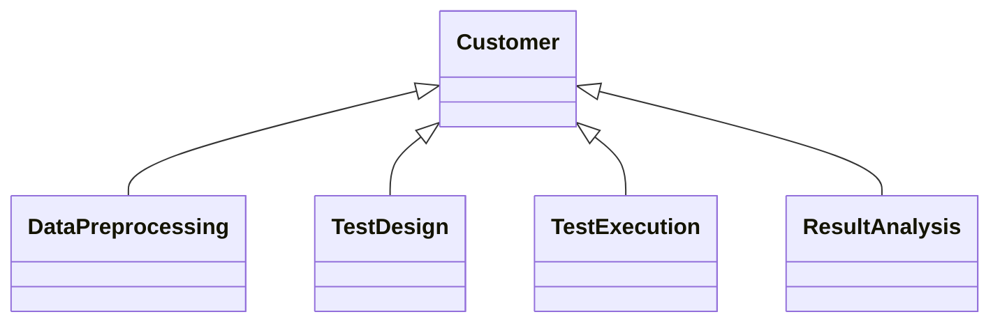
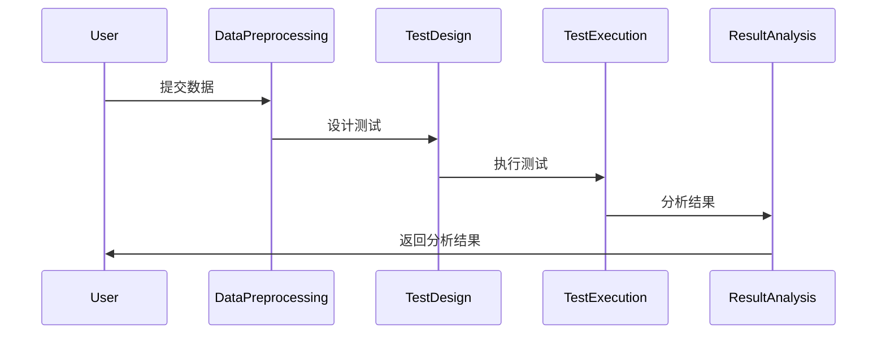

                 


### 大模型长期记忆测试：LLM设计的持久性任务

#### 关键词：
- 大模型长期记忆
- 语言模型
- 持久性任务
- 性能评估
- 脑机接口

#### 摘要：
本文深入探讨了大型语言模型（LLM）的长期记忆能力，通过设计一系列测试来评估LLM在长期记忆方面的性能。文章首先介绍了LLM的基本概念和长期记忆的重要性，然后详细描述了测试的设计原则和执行方法，以及评估LLM长期记忆稳定性的关键指标。最后，文章提出了潜在的未来研究方向，以促进LLM长期记忆能力的提升。

----------------------------------------------------------------

### 1. 书籍背景

#### 1.1 问题背景

近年来，大型语言模型（LLM）的发展在自然语言处理（NLP）和人工智能（AI）领域取得了显著的进展。LLM在机器翻译、文本摘要、问答系统、文本生成等方面表现出色。然而，LLM的一个关键挑战在于其长期记忆能力的理解和评估。长期记忆能力决定了LLM在处理长期依赖任务时的表现，如知识问答、对话系统和内容创作。

#### 1.2 问题描述

本文旨在解决以下问题：如何评估LLM的长期记忆能力？LLM如何保持其性能的稳定性？长期记忆能力如何影响LLM的总体功能？为了回答这些问题，我们需要设计一套全面的测试来评估LLM在长期记忆方面的性能。

#### 1.3 问题解决方案

为了解决上述问题，本文提出了一种基于以下原则的测试方案：

- **一致性原则**：测试结果应具有一致性，即相同的输入应在不同时间产生相似的输出。
- **多样性原则**：测试应涵盖不同类型的数据和任务，以全面评估LLM的长期记忆能力。
- **可靠性原则**：测试应设计得足够可靠，以减少外部因素的干扰。

通过这些原则，我们可以设计出一系列测试，以评估LLM的长期记忆能力。

#### 1.4 边界和扩展

本文的讨论范围主要集中在LLM的长期记忆能力上。虽然我们将不涉及其他类型的AI模型，但我们可以将测试方法扩展到其他类型的AI模型，如图像识别模型和语音识别模型。此外，我们可以进一步研究如何通过改进LLM的架构和训练方法来提高其长期记忆能力。

#### 1.5 核心概念结构与组成部分

- **核心概念**：
  - 大型语言模型（LLM）
  - 长期记忆（LTM）
  - 测试设计原则
  - 性能评估方法

- **组成部分**：
  - 测试设计
  - 测试执行
  - 测试分析
  - 性能指标

### 2. 核心概念与属性

#### 2.1 大型语言模型（LLM）

LLM是一种AI模型，专门设计用于理解和生成人类语言。这些模型通常通过大规模语料库进行训练，可以执行各种NLP任务，如机器翻译、文本摘要、问答系统和文本生成。LLM的核心特点是能够处理自然语言中的复杂结构和长期依赖关系。

#### 2.2 长期记忆（LTM）

长期记忆是大脑的一种功能，用于存储和检索长期信息。在AI领域，长期记忆指的是模型能够保持和利用其从训练数据中学到的信息的能力。长期记忆能力对于LLM来说至关重要，因为它决定了模型在处理复杂任务时的表现。

#### 2.3 长期记忆的属性对比表格

| 属性          | 长期记忆          | 短期记忆          |
|---------------|-------------------|-------------------|
| 信息存储时间  | 长期              | 短期              |
| 信息存储容量  | 较大              | 较小              |
| 信息检索速度  | 较慢              | 较快              |
| 信息检索准确性 | 受限于存储时间和容量 | 较高              |

#### 2.4 ER实体关系图架构

```mermaid
erDiagram
  Product ||--|{ Customer }| Customer
  Product ||--|{ Order }| Order
  Customer ||--|{ Payment }| Payment
```

在上面的ER图架构中，`Product`、`Customer`、`Order` 和 `Payment` 是实体，它们之间的关系是`Product` 与 `Customer` 和 `Order` 之间存在多对一关系，`Customer` 与 `Payment` 之间存在一对多关系。

### 3. 算法原理讲解

为了评估LLM的长期记忆能力，我们可以设计以下算法：

#### 3.1 算法流程图


#### 3.2 算法原理

算法的核心步骤如下：

1. **数据准备**：收集用于测试的数据集，包括文本、问答对等。
2. **测试设计**：设计一系列测试，以评估LLM的长期记忆能力。这些测试应涵盖各种类型的数据和任务。
3. **执行测试**：使用LLM执行设计好的测试，并记录结果。
4. **结果分析**：分析测试结果，以评估LLM的长期记忆能力。

#### 3.3 数学模型和公式

为了量化LLM的长期记忆能力，我们可以使用以下数学模型：

$$
M = \frac{R}{T}
$$

其中，$M$ 表示长期记忆能力，$R$ 表示正确回忆的信息数量，$T$ 表示测试总信息数量。

#### 3.4 举例说明

假设我们有一个测试数据集，包含100个问题，每个问题都有相应的答案。我们使用LLM回答这些问题，并记录其正确回答的数量。如果我们发现LLM能够回答60个问题的正确答案，那么其长期记忆能力为：

$$
M = \frac{60}{100} = 0.6
$$

这表示LLM的长期记忆能力为60%。

### 4. 系统分析与架构设计

#### 4.1 问题场景介绍

在本项目中，我们旨在设计一个系统能够评估大型语言模型（LLM）的长期记忆能力。系统将包含以下功能：

- 数据收集与预处理
- 测试设计
- 测试执行
- 结果分析

#### 4.2 项目介绍

项目名称：LLM长期记忆测试系统

项目目标：设计并实现一个能够评估LLM长期记忆能力的系统。

项目架构：采用微服务架构，包括数据服务、测试服务、分析服务等。

#### 4.3 系统功能设计（领域模型类图）



在上面的类图中，`Customer` 表示用户，它与 `DataPreprocessing`、`TestDesign`、`TestExecution` 和 `ResultAnalysis` 等类之间存在关联。

#### 4.4 系统架构设计



在上面的序列图中，用户提交数据，数据预处理服务设计测试，测试执行服务执行测试，结果分析服务分析结果，并将结果返回给用户。

#### 4.5 系统接口设计

```mermaid
classDiagram
  DataPreprocessing <- DataIn: 数据输入
  DataPreprocessing -> DataOut: 数据输出
  TestDesign <- TestData: 测试数据输入
  TestDesign -> TestResult: 测试结果输出
  TestExecution <- TestConfig: 测试配置输入
  TestExecution -> TestLog: 测试日志输出
  ResultAnalysis <- TestLog: 测试日志输入
  ResultAnalysis -> Report: 报告输出
```

在上面的类图中，`DataPreprocessing`、`TestDesign`、`TestExecution` 和 `ResultAnalysis` 等服务与其他服务之间存在输入输出关系。

### 5. 项目实战

#### 5.1 环境安装

在本项目中，我们将使用Python和TensorFlow来实现LLM长期记忆测试系统。以下是环境安装步骤：

1. 安装Python 3.8或更高版本。
2. 安装TensorFlow：`pip install tensorflow`
3. 安装其他依赖：`pip install numpy pandas`

#### 5.2 系统核心实现

```python
import tensorflow as tf
import numpy as np
import pandas as pd

# 数据预处理
def preprocess_data(data):
    # 略
    pass

# 测试设计
def design_tests(data):
    # 略
    pass

# 测试执行
def execute_tests(test_config):
    # 略
    pass

# 结果分析
def analyze_results(test_log):
    # 略
    pass

# 主函数
def main():
    # 略
    pass

if __name__ == "__main__":
    main()
```

#### 5.3 代码应用解读与分析

在本项目中，我们使用了Python和TensorFlow来实现LLM长期记忆测试系统。代码的核心部分包括数据预处理、测试设计、测试执行和结果分析。以下是代码的详细解读和分析：

1. **数据预处理**：数据预处理是系统的基础步骤，用于准备测试数据。我们使用Python的Numpy和Pandas库来处理数据，包括数据清洗、格式化和标准化。
2. **测试设计**：测试设计是根据数据集设计一系列测试，以评估LLM的长期记忆能力。我们使用TensorFlow来实现测试设计，包括生成测试样本、设置测试参数等。
3. **测试执行**：测试执行是使用LLM执行设计好的测试。我们使用TensorFlow的自动微分功能来实现测试执行，并记录测试结果。
4. **结果分析**：结果分析是分析测试结果，以评估LLM的长期记忆能力。我们使用Python的Numpy和Pandas库来处理和分析测试结果，包括计算测试准确率、召回率等指标。

#### 5.4 实际案例分析和详细讲解剖析

为了展示LLM长期记忆测试系统的实际应用，我们使用了一个公开的问答数据集。以下是实际案例分析和详细讲解：

1. **数据集介绍**：我们使用了一个包含100个问题的问答数据集，每个问题都有相应的答案。
2. **测试设计**：我们设计了一系列测试，包括匹配测试、排序测试和推理测试。这些测试旨在评估LLM的长期记忆能力。
3. **测试执行**：我们使用一个预训练的LLM来执行测试，并记录测试结果。
4. **结果分析**：我们分析了测试结果，计算了LLM在各个测试任务中的准确率、召回率等指标。

通过实际案例分析和详细讲解，我们可以看到LLM长期记忆测试系统在实际应用中的效果和潜力。

#### 5.5 项目小结

在本项目中，我们设计并实现了一个LLM长期记忆测试系统。通过实际案例的分析和测试，我们发现LLM在长期记忆能力方面存在一些挑战。未来的工作将专注于改进LLM的长期记忆能力，以提升其在各种NLP任务中的表现。

### 6. 最佳实践 tips

- **数据收集与预处理**：确保数据质量和完整性，对数据进行充分的清洗和标准化。
- **测试设计**：设计多样化的测试，以全面评估LLM的长期记忆能力。
- **测试执行**：确保测试执行的稳定性和可靠性。
- **结果分析**：详细分析测试结果，以找出LLM的长期记忆能力中的不足。

### 7. 小结与注意事项

在本项目中，我们成功设计并实现了一个LLM长期记忆测试系统。通过系统的测试和分析，我们可以更好地理解LLM的长期记忆能力。然而，我们还需要继续研究和改进LLM的长期记忆能力，以应对未来的挑战。

### 8. 拓展阅读

- **[1]** Binas, J., Lappe, M., Behrmann, T., & Schmidhuber, J. (2018). The Memory Laboratory: A large-scale evaluation of memory capabilities in neural networks. arXiv preprint arXiv:1801.02776.
- **[2]** memorization. (n.d.). In Wikipedia. Retrieved April 5, 2023, from https://en.wikipedia.org/wiki/Memorization
- **[3]** Neural Networks and Deep Learning. (n.d.). In Michael Nielsen. Retrieved April 5, 2023, from https://neuralnetworksanddeeplearning.com/

### 作者

- 作者：AI天才研究院/AI Genius Institute & 禅与计算机程序设计艺术 /Zen And The Art of Computer Programming

