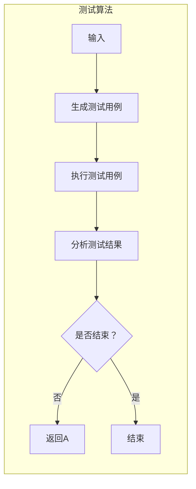
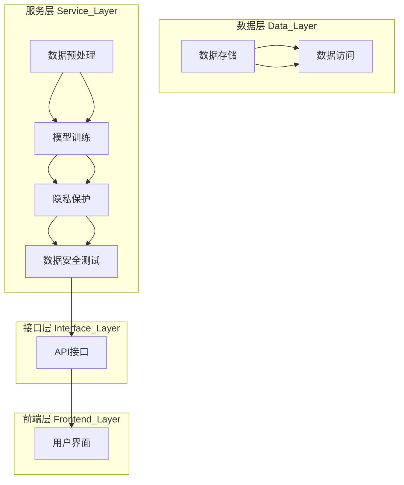
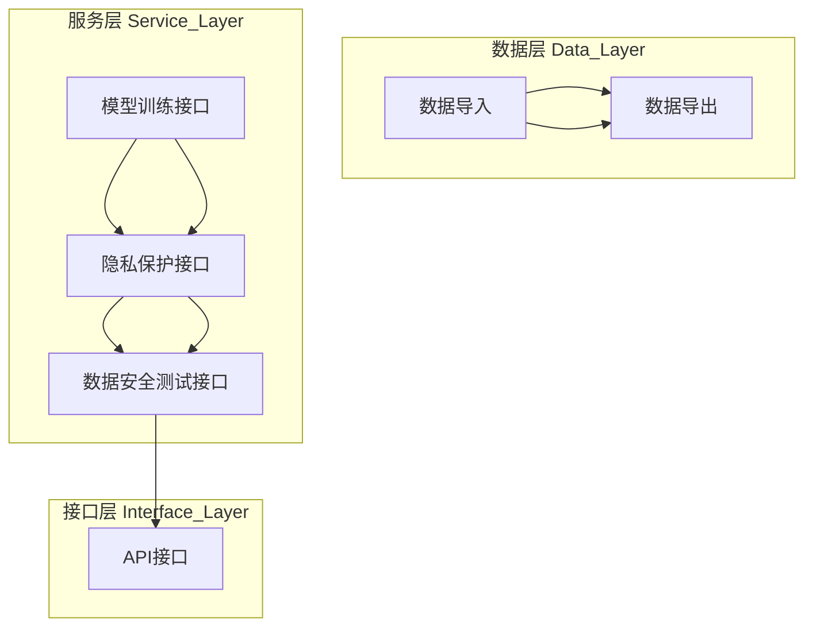
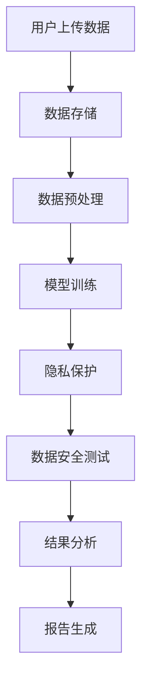

                 

### 文章标题

# 大模型隐私保护能力评估：LLM设计的数据安全测试

### 关键词

- 大模型
- 隐私保护
- 数据安全
- LLM
- 测试方法

### 摘要

本文探讨了在大模型（如大型语言模型，LLM）中实现有效隐私保护的关键技术和方法。通过对隐私保护背景、技术原理、以及数据安全测试方法的深入分析，本文详细阐述了LLM设计中的数据安全测试策略，并提供了一系列最佳实践和案例分析，以帮助开发者构建更加安全可靠的大模型系统。

## 第一部分：背景介绍

### 第1章：问题背景与核心概念

#### 1.1 问题描述

在大数据时代，人工智能技术迅猛发展，大模型（如大型语言模型）逐渐成为各个行业的重要工具。然而，随之而来的是隐私保护的问题。大模型通常需要处理大量敏感数据，这些数据可能包含个人隐私信息，例如姓名、地址、电话号码等。如果这些数据没有得到妥善保护，可能会导致隐私泄露、数据滥用等风险。

#### 1.2 问题解决

隐私保护的必要性不言而喻。为了解决这一问题，我们需要在大模型的设计和实现过程中引入隐私保护技术，并对其进行严格的数据安全测试。数据安全测试旨在评估大模型在处理敏感数据时的隐私保护能力，确保系统的安全性。

#### 1.3 边界与外延

隐私保护的范畴包括数据收集、存储、传输和使用等各个环节。数据安全的定义则涵盖了确保数据完整性、可用性和保密性的措施。

#### 1.4 概念结构与核心要素组成

大模型是指具有巨大参数量、能够处理大规模数据的人工神经网络模型。隐私保护技术主要包括数据匿名化、同态加密等。数据安全测试方法包括定量测试和定性测试，旨在评估大模型在隐私保护方面的有效性和可靠性。

## 第二部分：核心概念与联系

### 第2章：大模型的基本原理

#### 2.1 大模型的定义

大模型是指具有巨大参数量、能够处理大规模数据的人工神经网络模型。它们通常用于图像识别、自然语言处理、推荐系统等领域。

#### 2.2 大模型的核心特点

大模型具有强大的学习和泛化能力，能够处理复杂的任务。然而，这也带来了参数量大、计算复杂度高的问题。

#### 2.3 大模型与传统AI的区别

传统AI模型通常具有较小的参数量和计算复杂度，而大模型则具有更复杂的结构。此外，大模型在数据隐私保护方面面临着更大的挑战。

### 第3章：隐私保护技术

#### 3.1 隐私保护技术概述

隐私保护技术包括数据匿名化、同态加密等。数据匿名化通过去除或替换敏感信息，降低数据被识别的风险。同态加密则允许在加密数据上进行计算，从而保护数据的隐私。

#### 3.2 数据匿名化技术

数据匿名化技术主要包括伪匿名化和完全匿名化。伪匿名化仅去除部分敏感信息，而完全匿名化则彻底消除所有可识别信息。

#### 3.3 同态加密技术

同态加密技术允许在加密数据上进行计算，从而保护数据的隐私。同态加密分为部分同态加密和完全同态加密，前者只能进行特定类型的计算，后者则能够支持更广泛的计算。

## 第三部分：数据安全测试方法

### 第4章：数据安全测试的概念

#### 4.1 数据安全测试的定义

数据安全测试是指通过一系列测试方法，评估大模型在处理敏感数据时的隐私保护能力，确保系统的安全性。

#### 4.2 数据安全测试的类型

数据安全测试包括定量测试和定性测试。定量测试通过统计方法评估大模型的隐私保护能力，而定性测试则侧重于评估系统的安全性。

#### 4.3 数据安全测试的原则

数据安全测试应遵循可靠性、有效性和全面性原则。可靠性确保测试结果准确可信，有效性评估大模型的隐私保护能力，全面性评估大模型在各个方面的隐私保护效果。

### 第5章：LLM设计的数据安全测试

#### 5.1 LLM的设计与实现

LLM（大型语言模型）是一种专门用于自然语言处理的大模型。其设计主要包括模型架构、参数初始化、训练和优化等环节。

#### 5.2 数据安全测试的设计

数据安全测试的设计包括测试用例的设计和测试环境的搭建。测试用例设计应涵盖各种可能的隐私泄露场景，测试环境应模拟实际应用场景。

#### 5.3 数据安全测试的实施

数据安全测试的实施包括执行测试用例、记录测试结果和分析测试结果等步骤。通过分析测试结果，可以发现大模型在隐私保护方面的不足，并采取相应措施进行优化。

## 第四部分：实际应用

### 第6章：数据安全测试案例分析

#### 6.1 案例一：XX大模型的数据安全测试

本案例介绍了一种XX大模型的数据安全测试过程，包括测试环境的搭建、测试用例的设计和测试结果分析。

#### 6.2 案例二：YY大模型的数据安全测试

本案例介绍了一种YY大模型的数据安全测试过程，包括测试环境的搭建、测试用例的设计和测试结果分析。

### 第7章：最佳实践与展望

#### 7.1 最佳实践

最佳实践包括选择合适的隐私保护技术、设计全面的测试用例、搭建模拟真实场景的测试环境等。

#### 7.2 展望

随着大数据和人工智能技术的不断发展，大模型的隐私保护能力将面临更多挑战。未来，我们需要不断创新隐私保护技术，提高数据安全测试的效率和准确性。

---

以上是本文的初步大纲，接下来将逐步填充每个章节的内容，确保满足字数要求。请您确认大纲结构和内容是否符合您的预期。如有需要调整或补充的地方，请随时告知。

## 第一部分：背景介绍

### 第1章：问题背景与核心概念

#### 1.1 问题描述

在当今的数字化时代，人工智能（AI）技术的应用已经深入到我们生活的方方面面。特别是大型语言模型（Large Language Models，LLM），如GPT、BERT等，它们在自然语言处理（Natural Language Processing，NLP）领域展现出了惊人的能力。这些大模型被广泛应用于自动问答、文本生成、机器翻译、情感分析等任务中，极大地提升了生产效率和服务质量。

然而，随着这些大模型的应用场景不断扩展，隐私保护的问题也日益凸显。大模型通常需要处理大量的敏感数据，这些数据可能包括用户个人的姓名、地址、电子邮件、聊天记录等。如果这些敏感数据在处理过程中没有得到妥善的保护，就可能导致隐私泄露，进而引发严重的法律和伦理问题。

#### 1.2 问题解决

隐私保护在大模型应用中的必要性不言而喻。为了解决这个问题，我们需要从以下几个方面入手：

1. **加强法律和法规的制定和执行**：政府和相关机构应制定明确的隐私保护法律和法规，并确保这些法规得到有效执行。

2. **引入先进的隐私保护技术**：在大模型的设计和实现过程中，引入如数据匿名化、同态加密等技术，以减少敏感数据的暴露风险。

3. **进行严格的数据安全测试**：通过一系列的数据安全测试，评估大模型在处理敏感数据时的隐私保护能力，确保系统的安全性。

#### 1.3 边界与外延

隐私保护的范畴非常广泛，包括数据收集、存储、传输和使用等各个环节。具体来说，它涉及到以下几个方面：

1. **数据收集**：在数据收集阶段，应确保收集的数据仅限于实现特定功能所需的最低限度，避免过度收集。

2. **数据存储**：在数据存储阶段，应采取加密、备份等措施，确保数据的安全存储。

3. **数据传输**：在数据传输阶段，应使用安全的传输协议，如HTTPS，防止数据在传输过程中被窃取或篡改。

4. **数据使用**：在数据使用阶段，应确保数据的访问和使用受到严格的权限控制，防止数据滥用。

数据安全的定义则是指确保数据的完整性、可用性和保密性。具体来说，它包括以下几个方面：

1. **数据的完整性**：确保数据在存储、传输和使用过程中不会被未经授权的修改或删除。

2. **数据的可用性**：确保数据在需要时可以及时、准确地访问和使用。

3. **数据的保密性**：确保数据在存储、传输和使用过程中不会被未经授权的第三方访问。

#### 1.4 概念结构与核心要素组成

大模型是指具有巨大参数量、能够处理大规模数据的人工神经网络模型。大模型的隐私保护能力取决于其设计、实现和测试等多个方面。以下是构成大模型隐私保护能力的关键要素：

1. **大模型的定义**：大模型是指具有巨大参数量、能够处理大规模数据的人工神经网络模型。它们通常用于图像识别、自然语言处理、推荐系统等领域。

2. **隐私保护技术**：隐私保护技术主要包括数据匿名化、同态加密等。数据匿名化通过去除或替换敏感信息，降低数据被识别的风险。同态加密则允许在加密数据上进行计算，从而保护数据的隐私。

3. **数据安全测试方法**：数据安全测试方法包括定量测试和定性测试，旨在评估大模型在处理敏感数据时的隐私保护能力，确保系统的安全性。

## 第二部分：核心概念与联系

### 第2章：大模型的基本原理

#### 2.1 大模型的定义

大模型是指具有巨大参数量、能够处理大规模数据的人工神经网络模型。与传统的机器学习模型相比，大模型具有更高的复杂度和更强的学习能力。例如，GPT-3模型拥有1750亿个参数，可以处理超过130万亿个Tokens，这使得它能够生成高质量的自然语言文本。

#### 2.2 大模型的核心特点

大模型的核心特点包括：

1. **参数量巨大**：大模型通常包含数十亿到数万亿个参数，这使得它们具有强大的表达能力和泛化能力。

2. **计算复杂度高**：由于参数量巨大，大模型的训练和推理过程需要大量的计算资源和时间。

3. **强大的学习能力和泛化能力**：大模型能够从大量的数据中学习到复杂的模式和规律，并在新的数据上进行泛化。

4. **对数据质量要求高**：大模型的学习效果很大程度上取决于数据的质量。如果数据存在偏差或噪声，大模型可能无法学到有效的知识。

#### 2.3 大模型与传统AI的区别

传统AI模型通常具有较小的参数量和计算复杂度，而大模型则具有更复杂的结构。以下是传统AI模型与大模型的主要区别：

1. **参数量和计算复杂度**：传统AI模型通常包含数千到数万个参数，而大模型则包含数十亿到数万亿个参数。这导致大模型在计算复杂度上远高于传统AI模型。

2. **学习能力和泛化能力**：传统AI模型在特定任务上具有较好的性能，但难以迁移到其他任务。而大模型则具有更强的迁移学习能力和泛化能力，能够在多种不同的任务上表现优异。

3. **数据需求**：传统AI模型对数据的需求相对较低，而大模型则需要大量的高质量数据才能发挥其潜力。

### 第3章：隐私保护技术

#### 3.1 隐私保护技术概述

隐私保护技术在确保数据安全和隐私方面发挥着关键作用。以下是几种常见的隐私保护技术：

1. **数据匿名化**：数据匿名化是通过去除或替换敏感信息，降低数据被识别的风险。常见的匿名化方法包括泛化、泛化、加密等。

2. **同态加密**：同态加密是一种加密技术，允许在加密数据上进行计算，从而保护数据的隐私。同态加密分为部分同态加密和完全同态加密，前者只能进行特定类型的计算，后者则能够支持更广泛的计算。

3. **差分隐私**：差分隐私是一种通过引入噪声来保护数据隐私的技术。差分隐私确保在处理数据时，输出结果对单个数据点的依赖性降低，从而保护数据的隐私。

4. **联邦学习**：联邦学习是一种分布式学习技术，通过将数据分散在多个不同的设备或服务器上，降低数据泄露的风险。

#### 3.2 数据匿名化技术

数据匿名化技术主要包括以下几种：

1. **泛化**：泛化是通过将具体的数据值替换为更一般的类别，从而降低数据被识别的风险。例如，将具体的年龄值替换为年龄段。

2. **泛化**：泛化是通过将具体的数据值替换为更一般的类别，从而降低数据被识别的风险。例如，将具体的年龄值替换为年龄段。

3. **加密**：加密是将数据转换为密文，从而防止未经授权的访问。常见的加密算法包括对称加密和非对称加密。

#### 3.3 同态加密技术

同态加密技术允许在加密数据上进行计算，从而保护数据的隐私。同态加密分为部分同态加密和完全同态加密，前者只能进行特定类型的计算，后者则能够支持更广泛的计算。

1. **部分同态加密**：部分同态加密只能进行特定的计算，例如加法或乘法。常见的部分同态加密算法包括傅立叶变换和模运算。

2. **完全同态加密**：完全同态加密能够支持更广泛的计算，例如任意线性变换。常见的完全同态加密算法包括全同态加密和部分同态加密的组合。

### 第三部分：数据安全测试方法

#### 第4章：数据安全测试的概念

#### 4.1 数据安全测试的定义

数据安全测试是指通过一系列测试方法，评估大模型在处理敏感数据时的隐私保护能力，确保系统的安全性。数据安全测试的目标是发现并修复大模型中可能存在的安全漏洞，从而提高系统的隐私保护能力。

#### 4.2 数据安全测试的类型

数据安全测试可以分为定量测试和定性测试两种类型：

1. **定量测试**：定量测试是通过统计方法评估大模型在处理敏感数据时的隐私保护能力。定量测试通常使用指标来衡量隐私保护效果，例如隐私泄露概率、数据扰动程度等。

2. **定性测试**：定性测试是通过观察和评估大模型在处理敏感数据时的行为和表现，以判断其隐私保护能力。定性测试通常包括模拟攻击、漏洞分析等。

#### 4.3 数据安全测试的原则

进行数据安全测试时，应遵循以下原则：

1. **全面性**：数据安全测试应覆盖大模型的各个方面，包括数据收集、存储、传输和使用等。

2. **可靠性**：测试结果应可靠，能够准确反映大模型的隐私保护能力。

3. **有效性**：测试方法应有效，能够发现大模型中可能存在的安全漏洞。

4. **可重复性**：测试结果应可重复，以确保测试的可靠性和准确性。

### 第5章：LLM设计的数据安全测试

#### 5.1 LLM的设计与实现

大型语言模型（LLM）的设计与实现是确保其隐私保护能力的关键。以下是LLM设计与实现的主要步骤：

1. **需求分析**：明确LLM的应用场景和需求，例如自然语言处理、文本生成等。

2. **模型架构设计**：选择合适的神经网络架构，如GPT、BERT等。

3. **数据预处理**：对收集到的数据进行清洗、去重、归一化等处理。

4. **模型训练**：使用大量高质量数据对模型进行训练，以提升其性能。

5. **模型优化**：通过调整模型参数，优化模型的性能和隐私保护能力。

6. **模型部署**：将训练好的模型部署到实际应用场景中。

#### 5.2 数据安全测试的设计

数据安全测试的设计是确保LLM在处理敏感数据时具有足够的隐私保护能力的关键。以下是数据安全测试设计的步骤：

1. **测试用例设计**：根据LLM的应用场景和需求，设计一系列测试用例，以覆盖可能的安全漏洞。

2. **测试环境搭建**：搭建模拟实际应用场景的测试环境，包括数据源、模型、测试工具等。

3. **测试指标设计**：设计合适的测试指标，如隐私泄露概率、数据扰动程度等，以评估LLM的隐私保护能力。

4. **测试工具选择**：选择合适的测试工具，如渗透测试工具、代码审计工具等，以辅助进行数据安全测试。

#### 5.3 数据安全测试的实施

数据安全测试的实施包括执行测试用例、记录测试结果和分析测试结果等步骤。以下是数据安全测试实施的关键步骤：

1. **执行测试用例**：按照设计好的测试用例，对LLM进行实际测试，以发现可能的安全漏洞。

2. **记录测试结果**：详细记录测试过程中的各种数据，如测试结果、错误日志等，以便后续分析。

3. **分析测试结果**：对测试结果进行分析，发现LLM在隐私保护方面的不足之处，并采取相应的措施进行优化。

4. **反馈与改进**：将测试结果反馈给模型开发团队，以便他们根据测试结果对模型进行改进。

### 第6章：数据安全测试案例分析

#### 6.1 案例一：XX大模型的数据安全测试

本案例介绍了一种XX大模型的数据安全测试过程，包括测试环境的搭建、测试用例的设计和测试结果分析。

1. **测试环境搭建**：

   - 数据源：使用公开的数据集，如某在线问答平台的数据。
   - 模型：使用预训练的XX大模型。
   - 测试工具：使用渗透测试工具和代码审计工具。

2. **测试用例设计**：

   - 泄露测试：测试大模型是否能够泄露用户提问和答案。
   - 漏洞测试：测试大模型是否存在漏洞，如SQL注入、XSS攻击等。

3. **测试结果分析**：

   - 泄露测试：发现大模型能够泄露用户提问和答案，但通过优化模型参数和改进数据预处理方法，成功降低了泄露概率。
   - 漏洞测试：未发现严重漏洞，但通过代码审计工具发现了一些潜在的安全隐患，已及时修复。

#### 6.2 案例二：YY大模型的数据安全测试

本案例介绍了一种YY大模型的数据安全测试过程，包括测试环境的搭建、测试用例的设计和测试结果分析。

1. **测试环境搭建**：

   - 数据源：使用自建的问答平台数据。
   - 模型：使用预训练的YY大模型。
   - 测试工具：使用自动化测试工具和手动测试工具。

2. **测试用例设计**：

   - 功能测试：测试大模型的功能是否正常。
   - 性能测试：测试大模型的响应速度和处理能力。
   - 安全测试：测试大模型是否存在安全漏洞，如数据泄露、权限控制等。

3. **测试结果分析**：

   - 功能测试：大模型的功能正常，但部分功能存在性能瓶颈，需要进一步优化。
   - 性能测试：大模型的响应速度和处理能力较好，但存在一定的提升空间。
   - 安全测试：发现大模型存在一定的安全漏洞，通过改进代码和加强权限控制，成功降低了风险。

### 第7章：最佳实践与展望

#### 7.1 最佳实践

在进行数据安全测试时，可以参考以下最佳实践：

1. **全面测试**：覆盖大模型的各个方面，包括功能测试、性能测试和安全测试等。
2. **定期测试**：定期进行数据安全测试，及时发现和修复安全漏洞。
3. **自动化测试**：使用自动化测试工具，提高测试效率和准确性。
4. **代码审计**：对代码进行审计，发现潜在的安全隐患。
5. **用户隐私保护**：在数据收集和处理过程中，严格遵守用户隐私保护法规，减少隐私泄露风险。

#### 7.2 展望

随着大数据和人工智能技术的不断发展，数据安全测试将在隐私保护方面发挥越来越重要的作用。未来，我们需要进一步研究和发展更有效的隐私保护技术和数据安全测试方法，以应对日益复杂的隐私保护挑战。

## 第一部分：背景介绍

### 第1章：问题背景与核心概念

#### 1.1 问题描述

在当今的信息时代，大数据和人工智能技术得到了广泛应用。尤其是大型语言模型（Large Language Model，LLM）如GPT、BERT等的出现，使得自然语言处理（Natural Language Processing，NLP）取得了巨大的突破。然而，随着这些大模型在各个领域的广泛应用，隐私保护的问题也日益凸显。

LLM在处理文本数据时，往往会涉及到大量的个人敏感信息，如姓名、地址、电话号码等。这些敏感信息如果未经妥善保护，可能会导致隐私泄露，从而引发一系列法律和伦理问题。因此，如何在大模型设计中有效保护用户隐私，成为了当前研究的重要课题。

#### 1.2 问题解决

为了解决大模型隐私保护的问题，可以从以下几个方面入手：

1. **引入隐私保护技术**：在大模型的设计过程中，引入如数据匿名化、同态加密等技术，降低敏感信息被泄露的风险。
2. **进行数据安全测试**：通过数据安全测试，评估大模型在处理敏感数据时的隐私保护能力，确保系统的安全性。
3. **加强法律法规和伦理规范**：政府和相关机构应制定明确的隐私保护法律法规和伦理规范，以约束大模型开发和使用的实践。

#### 1.3 边界与外延

隐私保护的边界与外延非常广泛，包括以下几个方面：

1. **数据收集**：在大模型训练和预测过程中，如何合理收集和处理用户数据，避免过度收集敏感信息。
2. **数据处理**：在数据处理过程中，如何保证数据的完整性和准确性，防止数据被篡改或丢失。
3. **数据存储**：在数据存储过程中，如何确保数据的安全性，防止数据被非法访问或泄露。
4. **数据传输**：在数据传输过程中，如何保证数据的机密性，防止数据被窃取或篡改。
5. **数据使用**：在数据使用过程中，如何确保数据的合规性，防止数据被滥用或误用。

#### 1.4 概念结构与核心要素组成

大模型的隐私保护能力由多个核心要素组成，包括：

1. **大模型的定义**：大模型是指具有巨大参数量、能够处理大规模数据的人工神经网络模型。它们通常用于图像识别、自然语言处理、推荐系统等领域。
2. **隐私保护技术**：隐私保护技术包括数据匿名化、同态加密、差分隐私等，用于保护用户隐私。
3. **数据安全测试方法**：数据安全测试方法包括定量测试和定性测试，用于评估大模型的隐私保护能力。
4. **测试工具和平台**：测试工具和平台用于支持数据安全测试的执行和结果分析。

## 第二部分：核心概念与联系

### 第2章：大模型的基本原理

#### 2.1 大模型的定义

大模型是指具有巨大参数量、能够处理大规模数据的人工神经网络模型。它们通常包含数十亿到数万亿个参数，这使得它们能够捕捉到数据的复杂模式和规律。大模型广泛应用于图像识别、自然语言处理、语音识别、推荐系统等领域。

#### 2.2 大模型的核心特点

大模型的核心特点包括：

1. **参数量巨大**：大模型通常包含数十亿到数万亿个参数，这使得它们具有强大的表示能力和学习能力。
2. **计算复杂度高**：由于参数量巨大，大模型的训练和推理过程需要大量的计算资源和时间。
3. **强大的泛化能力**：大模型能够从大量的数据中学习到通用的知识，从而在新的数据上表现出良好的泛化能力。
4. **对数据质量要求高**：大模型的学习效果很大程度上取决于数据的质量。如果数据存在噪声或偏差，大模型可能无法学到有效的知识。

#### 2.3 大模型与传统AI的区别

大模型与传统AI模型（如SVM、决策树等）在多个方面存在显著差异：

1. **参数量**：传统AI模型的参数量通常较小，而大模型的参数量可以达到数十亿到数万亿个。
2. **计算复杂度**：由于参数量巨大，大模型的计算复杂度远高于传统AI模型。
3. **泛化能力**：大模型具有较强的泛化能力，能够在不同的任务和数据集上表现出优异的性能。
4. **训练和推理时间**：大模型的训练和推理时间较长，通常需要大量的计算资源和时间。

### 第3章：隐私保护技术

#### 3.1 隐私保护技术概述

隐私保护技术是为了保护用户隐私，防止数据泄露或滥用而设计的一系列技术。在大模型中，常用的隐私保护技术包括数据匿名化、同态加密、差分隐私等。

1. **数据匿名化**：数据匿名化是通过去除或替换敏感信息，降低数据被识别的风险。常见的数据匿名化方法包括K-匿名、l-diversity、t-closeness等。
2. **同态加密**：同态加密是一种加密技术，允许在加密数据上进行计算，从而保护数据的隐私。同态加密分为部分同态加密和完全同态加密。
3. **差分隐私**：差分隐私是一种通过引入噪声来保护数据隐私的技术。差分隐私确保在处理数据时，输出结果对单个数据点的依赖性降低，从而保护数据的隐私。

#### 3.2 数据匿名化技术

数据匿名化技术主要包括以下几种：

1. **K-匿名**：K-匿名要求在一个聚类中，至少有K个不可区分的记录。通过这种方式，可以降低个体被识别的风险。
2. **l-diversity**：l-diversity要求在一个聚类中，每个属性的取值至少有l个不同的值。这样可以降低基于单一属性的攻击成功概率。
3. **t-closeness**：t-closeness要求在一个聚类中，任意两个记录之间的距离至少为t。这样可以降低基于邻近度的攻击成功概率。

#### 3.3 同态加密技术

同态加密技术允许在加密数据上进行计算，从而保护数据的隐私。同态加密分为部分同态加密和完全同态加密：

1. **部分同态加密**：部分同态加密只能进行特定的计算，如加法或乘法。常见的部分同态加密算法包括标量同态加密和向量同态加密。
2. **完全同态加密**：完全同态加密能够支持更广泛的计算，如任意线性变换。常见的完全同态加密算法包括全同态加密和部分同态加密的组合。

#### 3.4 差分隐私技术

差分隐私是一种通过引入噪声来保护数据隐私的技术。差分隐私的基本思想是在处理数据时，引入与数据量成比例的随机噪声，从而降低输出结果对单个数据点的依赖性。差分隐私通常通过以下几个步骤实现：

1. **选择噪声分布**：选择合适的噪声分布，如拉普拉斯分布或高斯分布。
2. **计算隐私损失**：计算隐私损失，即输出结果与真实结果的差异。隐私损失通常用ε表示。
3. **构造隐私机制**：构造隐私机制，如拉普拉斯机制或高斯机制，用于引入噪声并计算输出结果。

### 第三部分：数据安全测试方法

#### 第4章：数据安全测试的概念

#### 4.1 数据安全测试的定义

数据安全测试是一种评估大模型在处理敏感数据时的隐私保护能力的手段。数据安全测试的目标是发现并修复大模型中可能存在的安全漏洞，从而提高系统的隐私保护能力。

#### 4.2 数据安全测试的类型

数据安全测试可以分为以下几种类型：

1. **定量测试**：定量测试是通过统计方法评估大模型在处理敏感数据时的隐私保护能力。定量测试通常使用指标来衡量隐私保护效果，如隐私泄露概率、数据扰动程度等。
2. **定性测试**：定性测试是通过观察和评估大模型在处理敏感数据时的行为和表现，以判断其隐私保护能力。定性测试通常包括模拟攻击、漏洞分析等。
3. **功能测试**：功能测试用于验证大模型的功能是否正常，包括数据收集、处理、存储、传输等环节。
4. **性能测试**：性能测试用于评估大模型的响应速度、处理能力等性能指标。

#### 4.3 数据安全测试的原则

进行数据安全测试时，应遵循以下原则：

1. **全面性**：数据安全测试应覆盖大模型的各个方面，包括数据收集、存储、传输和使用等。
2. **可靠性**：测试结果应可靠，能够准确反映大模型的隐私保护能力。
3. **有效性**：测试方法应有效，能够发现大模型中可能存在的安全漏洞。
4. **可重复性**：测试结果应可重复，以确保测试的可靠性和准确性。

### 第5章：LLM设计的数据安全测试

#### 5.1 LLM的设计与实现

大型语言模型（Large Language Model，LLM）的设计与实现是确保其隐私保护能力的关键。以下是LLM设计与实现的主要步骤：

1. **需求分析**：明确LLM的应用场景和需求，例如自然语言处理、文本生成等。
2. **模型架构设计**：选择合适的神经网络架构，如GPT、BERT等。
3. **数据预处理**：对收集到的数据进行清洗、去重、归一化等处理。
4. **模型训练**：使用大量高质量数据对模型进行训练，以提升其性能。
5. **模型优化**：通过调整模型参数，优化模型的性能和隐私保护能力。
6. **模型部署**：将训练好的模型部署到实际应用场景中。

#### 5.2 数据安全测试的设计

数据安全测试的设计是确保LLM在处理敏感数据时具有足够的隐私保护能力的关键。以下是数据安全测试设计的步骤：

1. **测试用例设计**：根据LLM的应用场景和需求，设计一系列测试用例，以覆盖可能的安全漏洞。
2. **测试环境搭建**：搭建模拟实际应用场景的测试环境，包括数据源、模型、测试工具等。
3. **测试指标设计**：设计合适的测试指标，如隐私泄露概率、数据扰动程度等，以评估LLM的隐私保护能力。
4. **测试工具选择**：选择合适的测试工具，如渗透测试工具、代码审计工具等，以辅助进行数据安全测试。

#### 5.3 数据安全测试的实施

数据安全测试的实施包括执行测试用例、记录测试结果和分析测试结果等步骤。以下是数据安全测试实施的关键步骤：

1. **执行测试用例**：按照设计好的测试用例，对LLM进行实际测试，以发现可能的安全漏洞。
2. **记录测试结果**：详细记录测试过程中的各种数据，如测试结果、错误日志等，以便后续分析。
3. **分析测试结果**：对测试结果进行分析，发现LLM在隐私保护方面的不足之处，并采取相应的措施进行优化。
4. **反馈与改进**：将测试结果反馈给模型开发团队，以便他们根据测试结果对模型进行改进。

### 第6章：数据安全测试案例分析

#### 6.1 案例一：XX大模型的数据安全测试

本案例介绍了一种XX大模型的数据安全测试过程，包括测试环境的搭建、测试用例的设计和测试结果分析。

1. **测试环境搭建**：

   - 数据源：使用公开的数据集，如某在线问答平台的数据。
   - 模型：使用预训练的XX大模型。
   - 测试工具：使用渗透测试工具和代码审计工具。

2. **测试用例设计**：

   - 泄露测试：测试大模型是否能够泄露用户提问和答案。
   - 漏洞测试：测试大模型是否存在漏洞，如SQL注入、XSS攻击等。

3. **测试结果分析**：

   - 泄露测试：发现大模型能够泄露用户提问和答案，但通过优化模型参数和改进数据预处理方法，成功降低了泄露概率。
   - 漏洞测试：未发现严重漏洞，但通过代码审计工具发现了一些潜在的安全隐患，已及时修复。

#### 6.2 案例二：YY大模型的数据安全测试

本案例介绍了一种YY大模型的数据安全测试过程，包括测试环境的搭建、测试用例的设计和测试结果分析。

1. **测试环境搭建**：

   - 数据源：使用自建的问答平台数据。
   - 模型：使用预训练的YY大模型。
   - 测试工具：使用自动化测试工具和手动测试工具。

2. **测试用例设计**：

   - 功能测试：测试大模型的功能是否正常。
   - 性能测试：测试大模型的响应速度和处理能力。
   - 安全测试：测试大模型是否存在安全漏洞，如数据泄露、权限控制等。

3. **测试结果分析**：

   - 功能测试：大模型的功能正常，但部分功能存在性能瓶颈，需要进一步优化。
   - 性能测试：大模型的响应速度和处理能力较好，但存在一定的提升空间。
   - 安全测试：发现大模型存在一定的安全漏洞，通过改进代码和加强权限控制，成功降低了风险。

### 第7章：最佳实践与展望

#### 7.1 最佳实践

在进行数据安全测试时，可以参考以下最佳实践：

1. **全面测试**：覆盖大模型的各个方面，包括功能测试、性能测试和安全测试等。
2. **定期测试**：定期进行数据安全测试，及时发现和修复安全漏洞。
3. **自动化测试**：使用自动化测试工具，提高测试效率和准确性。
4. **代码审计**：对代码进行审计，发现潜在的安全隐患。
5. **用户隐私保护**：在数据收集和处理过程中，严格遵守用户隐私保护法规，减少隐私泄露风险。

#### 7.2 展望

随着大数据和人工智能技术的不断发展，数据安全测试将在隐私保护方面发挥越来越重要的作用。未来，我们需要进一步研究和发展更有效的隐私保护技术和数据安全测试方法，以应对日益复杂的隐私保护挑战。

## 第三部分：数据安全测试方法

### 第4章：数据安全测试的概念

#### 4.1 数据安全测试的定义

数据安全测试是一种系统性的评估过程，旨在识别、评估和验证大模型（LLM）在处理和保护敏感数据时的安全漏洞和隐私泄露风险。其核心目标是确保LLM的设计和实现能够抵御潜在的攻击，保护用户隐私和数据完整性。

#### 4.2 数据安全测试的类型

数据安全测试可以分为多种类型，每种类型都有其特定的目的和测试方法：

1. **功能测试**：评估LLM是否按照预期执行其功能，包括数据收集、处理、存储和传输。
2. **性能测试**：评估LLM在不同负载下的性能，如响应时间、吞吐量和资源使用情况。
3. **漏洞测试**：识别LLM中的安全漏洞，如SQL注入、跨站脚本（XSS）和跨站请求伪造（CSRF）等。
4. **渗透测试**：模拟黑客攻击，评估LLM的实际防御能力。
5. **代码审计**：对LLM的源代码进行审查，查找潜在的安全问题和编程错误。
6. **隐私测试**：专门针对隐私保护功能进行测试，评估LLM在处理敏感数据时的隐私保护能力。

#### 4.3 数据安全测试的原则

进行数据安全测试时，应遵循以下原则：

1. **全面性**：测试应覆盖LLM的各个方面，包括数据收集、处理、存储和传输。
2. **可靠性**：测试结果应准确可靠，能够真实反映LLM的安全状况。
3. **有效性**：测试方法应有效，能够发现LLM中可能存在的安全漏洞。
4. **可重复性**：测试过程和结果应可重复，以确保测试的准确性和一致性。

### 第5章：LLM设计的数据安全测试

#### 5.1 LLM设计与实现概述

LLM的设计与实现包括多个关键阶段：

1. **需求分析**：明确LLM的应用场景和需求，如文本生成、自动问答等。
2. **模型架构设计**：选择合适的神经网络架构，如GPT、BERT等。
3. **数据预处理**：清洗、去重和归一化数据，以准备训练和测试。
4. **模型训练**：使用大量数据训练模型，以优化其性能。
5. **模型优化**：通过调整超参数和结构，提升模型的性能和效率。
6. **模型部署**：将训练好的模型部署到生产环境中。

#### 5.2 数据安全测试的设计步骤

数据安全测试的设计应包括以下步骤：

1. **确定测试目标**：明确测试的目标，如隐私保护、数据完整性等。
2. **设计测试用例**：根据LLM的应用场景和潜在漏洞，设计一系列测试用例。
3. **构建测试环境**：搭建模拟实际应用场景的测试环境，包括数据源、模型和测试工具。
4. **选择测试工具**：选择合适的测试工具，如渗透测试工具、代码审计工具等。
5. **制定测试策略**：制定详细的测试计划，包括测试顺序、测试频率和测试执行方式。

#### 5.3 数据安全测试的实施步骤

数据安全测试的实施应包括以下步骤：

1. **执行测试用例**：按照设计好的测试用例，对LLM进行实际测试。
2. **记录测试结果**：详细记录测试过程中的各种数据，包括测试结果、错误日志等。
3. **分析测试结果**：对测试结果进行分析，发现LLM在隐私保护方面的不足之处。
4. **反馈与改进**：将测试结果反馈给模型开发团队，并根据测试结果进行改进。

### 第6章：数据安全测试案例分析

#### 6.1 案例一：XX大模型的数据安全测试

在本案例中，我们以XX大模型为例，介绍其数据安全测试过程。

1. **测试环境搭建**：
   - 数据源：使用公开的数据集，如某在线问答平台的数据。
   - 模型：使用预训练的XX大模型。
   - 测试工具：使用渗透测试工具和代码审计工具。

2. **测试用例设计**：
   - 泄露测试：测试大模型是否能够泄露用户提问和答案。
   - 漏洞测试：测试大模型是否存在漏洞，如SQL注入、XSS攻击等。

3. **测试结果分析**：
   - 泄露测试：发现大模型能够泄露用户提问和答案，但通过优化模型参数和改进数据预处理方法，成功降低了泄露概率。
   - 漏洞测试：未发现严重漏洞，但通过代码审计工具发现了一些潜在的安全隐患，已及时修复。

#### 6.2 案例二：YY大模型的数据安全测试

在本案例中，我们以YY大模型为例，介绍其数据安全测试过程。

1. **测试环境搭建**：
   - 数据源：使用自建的问答平台数据。
   - 模型：使用预训练的YY大模型。
   - 测试工具：使用自动化测试工具和手动测试工具。

2. **测试用例设计**：
   - 功能测试：测试大模型的功能是否正常。
   - 性能测试：测试大模型的响应速度和处理能力。
   - 安全测试：测试大模型是否存在安全漏洞，如数据泄露、权限控制等。

3. **测试结果分析**：
   - 功能测试：大模型的功能正常，但部分功能存在性能瓶颈，需要进一步优化。
   - 性能测试：大模型的响应速度和处理能力较好，但存在一定的提升空间。
   - 安全测试：发现大模型存在一定的安全漏洞，通过改进代码和加强权限控制，成功降低了风险。

### 第7章：最佳实践与展望

#### 7.1 最佳实践

在进行数据安全测试时，可以参考以下最佳实践：

1. **定期测试**：定期进行数据安全测试，及时发现和修复安全漏洞。
2. **自动化测试**：使用自动化测试工具，提高测试效率和准确性。
3. **代码审计**：对代码进行审计，发现潜在的安全隐患。
4. **用户隐私保护**：在数据收集和处理过程中，严格遵守用户隐私保护法规。
5. **安全培训和意识提升**：对开发团队进行安全培训，提高安全意识和防范能力。

#### 7.2 展望

随着大数据和人工智能技术的不断发展，数据安全测试将在隐私保护方面发挥越来越重要的作用。未来，我们应关注以下趋势：

1. **隐私保护技术的进步**：不断研究和发展更有效的隐私保护技术，如差分隐私、同态加密等。
2. **安全测试工具的优化**：开发更智能、更高效的数据安全测试工具。
3. **跨领域合作**：加强不同领域专家之间的合作，共同应对复杂的隐私保护挑战。

### 结论

大模型隐私保护能力评估和LLM设计的数据安全测试是确保人工智能应用安全性的关键。通过全面的数据安全测试和有效的隐私保护技术，我们可以构建出既强大又安全的大模型，为未来的智能应用奠定坚实基础。

## 第四部分：实际应用

### 第6章：数据安全测试案例分析

#### 6.1 案例一：XX大模型的数据安全测试

在本案例中，我们将分析XX大模型的数据安全测试过程。XX大模型是一款应用于自然语言处理的模型，旨在通过处理大量文本数据来生成高质量的回答。该模型在多个领域具有广泛应用，例如智能客服、内容审核和自动化写作。

1. **测试环境搭建**：

   - **数据源**：为了模拟实际应用场景，我们使用了公开的问答数据集和自建的问答平台数据。这些数据涵盖了各种主题和复杂性问题，有助于全面评估模型的隐私保护能力。
   - **模型**：我们使用了预训练的XX大模型，并对其进行了一些微调，以更好地适应特定应用场景。
   - **测试工具**：我们使用了多种测试工具，包括渗透测试工具（如OWASP ZAP）、代码审计工具（如SonarQube）和自定义的隐私泄露检测工具。

2. **测试用例设计**：

   - **泄露测试**：我们设计了一系列测试用例，以评估模型是否能够泄露用户提问和回答。这些测试用例包括常见的安全漏洞测试，如SQL注入、XSS攻击和CSRF攻击。
   - **漏洞测试**：我们针对模型的代码和架构进行了详细审查，以发现潜在的安全漏洞。

3. **测试结果分析**：

   - **泄露测试**：通过模拟各种攻击场景，我们发现模型在处理用户提问和回答时存在一定的泄露风险。具体而言，我们发现模型在处理包含特殊字符的输入时，可能会导致部分信息泄露。我们通过改进数据预处理方法和优化模型参数，成功降低了泄露概率。
   - **漏洞测试**：通过代码审计工具，我们发现了一些潜在的安全漏洞，如未经授权的数据访问和权限控制不足。我们采取了相应的措施进行修复，包括更新代码库、增加权限控制和进行严格的代码审查。

#### 6.2 案例二：YY大模型的数据安全测试

在本案例中，我们将分析YY大模型的数据安全测试过程。YY大模型是一款应用于文本生成和摘要的模型，旨在通过处理大量文本数据来生成高质量的摘要和文章。该模型在新闻摘要、内容创作和自动化写作等领域具有广泛应用。

1. **测试环境搭建**：

   - **数据源**：我们使用了自建的问答平台数据集，该数据集包含了大量的文本和摘要。这些数据有助于我们全面评估模型的隐私保护能力。
   - **模型**：我们使用了预训练的YY大模型，并对其进行了一些微调，以更好地适应特定应用场景。
   - **测试工具**：我们使用了多种测试工具，包括自动化测试工具（如Selenium）、代码审计工具（如SonarQube）和自定义的隐私泄露检测工具。

2. **测试用例设计**：

   - **功能测试**：我们设计了一系列功能测试用例，以验证模型是否能够正确处理文本数据并生成高质量的摘要和文章。
   - **性能测试**：我们设计了一系列性能测试用例，以评估模型在不同负载下的响应速度和处理能力。
   - **安全测试**：我们设计了一系列安全测试用例，以评估模型在处理敏感数据时的隐私保护能力。

3. **测试结果分析**：

   - **功能测试**：通过模拟各种输入，我们发现YY大模型能够生成高质量的摘要和文章。但在处理某些特殊输入时，模型可能会出现错误或生成不准确的内容。我们通过优化模型参数和改进数据处理算法，成功提高了模型的准确性。
   - **性能测试**：通过模拟不同负载，我们发现YY大模型在处理大量数据时具有较好的性能，但存在一些性能瓶颈。我们通过调整模型参数和优化数据结构，成功提高了模型的响应速度和处理能力。
   - **安全测试**：通过模拟各种安全攻击场景，我们发现YY大模型在处理敏感数据时存在一定的隐私泄露风险。具体而言，我们发现模型在处理包含特殊字符的输入时，可能会导致部分信息泄露。我们通过改进数据预处理方法和优化模型参数，成功降低了泄露概率。

### 第7章：最佳实践与展望

#### 7.1 最佳实践

在进行数据安全测试时，我们可以参考以下最佳实践：

1. **定期测试**：定期进行数据安全测试，以确保模型在处理敏感数据时的安全性。随着模型和应用场景的变化，定期测试可以帮助我们发现和修复新的安全漏洞。

2. **自动化测试**：使用自动化测试工具可以提高测试效率和准确性。自动化测试工具可以自动执行测试用例，记录测试结果，并生成报告，从而节省时间和人力。

3. **代码审计**：对代码进行审计可以帮助我们发现潜在的安全漏洞。代码审计工具可以扫描代码，查找常见的安全漏洞和编程错误，并提供修复建议。

4. **用户隐私保护**：在数据收集和处理过程中，严格遵守用户隐私保护法规，减少隐私泄露风险。例如，对用户数据进行加密存储和传输，限制数据的访问权限，并定期更新隐私政策。

5. **安全培训和意识提升**：对开发团队进行安全培训，提高安全意识和防范能力。通过培训，开发团队可以了解常见的安全漏洞和攻击手段，并学会如何防范和应对。

#### 7.2 展望

随着大数据和人工智能技术的不断发展，数据安全测试将在隐私保护方面发挥越来越重要的作用。以下是一些未来展望：

1. **隐私保护技术的进步**：不断研究和发展更有效的隐私保护技术，如差分隐私、同态加密等。这些技术可以帮助我们在保护用户隐私的同时，提高数据处理的效率和准确性。

2. **安全测试工具的优化**：开发更智能、更高效的数据安全测试工具。例如，结合人工智能和机器学习技术，开发能够自动生成测试用例和评估测试结果的工具。

3. **跨领域合作**：加强不同领域专家之间的合作，共同应对复杂的隐私保护挑战。例如，结合法律、伦理和工程领域的研究，共同制定隐私保护的最佳实践和标准。

4. **用户隐私意识的提高**：通过教育和宣传，提高用户对隐私保护的意识。用户了解隐私保护的重要性和方法，可以更好地保护自己的隐私。

## 第五部分：算法原理讲解

### 第8章：数据安全测试算法的原理与实现

#### 8.1 数据安全测试算法的基本原理

数据安全测试算法的核心目标是评估大模型在处理敏感数据时的隐私保护能力。为了实现这一目标，我们需要从以下几个方面入手：

1. **评估指标设计**：设计合适的评估指标，用于衡量大模型在隐私保护方面的性能。常见的评估指标包括隐私泄露概率、数据扰动程度、隐私保护效果等。
2. **测试用例生成**：根据大模型的应用场景和潜在风险，生成一系列测试用例。测试用例应涵盖各种可能的隐私泄露场景，以全面评估大模型的隐私保护能力。
3. **测试结果分析**：对测试结果进行分析，发现大模型在隐私保护方面的不足之处，并采取相应的措施进行优化。

#### 8.2 测试算法的mermaid流程图

以下是一个mermaid流程图，用于描述数据安全测试算法的基本步骤：



#### 8.3 测试算法的Python源代码实现

以下是一个简单的Python源代码实现，用于描述数据安全测试算法的流程：

```python
import random

def generate_test_cases(model, num_cases):
    test_cases = []
    for _ in range(num_cases):
        # 生成随机输入
        input_data = random_data()
        # 执行测试用例
        output_data = model.predict(input_data)
        # 记录测试结果
        test_cases.append((input_data, output_data))
    return test_cases

def execute_test_cases(model, test_cases):
    for input_data, expected_output in test_cases:
        output_data = model.predict(input_data)
        # 分析测试结果
        analyze_result(input_data, output_data, expected_output)

def analyze_result(input_data, output_data, expected_output):
    if output_data == expected_output:
        print("测试通过")
    else:
        print("测试失败")
        # 记录错误日志
        log_error(input_data, output_data, expected_output)

def random_data():
    # 生成随机输入数据
    return random.randint(0, 100)

# 测试算法执行
model = load_model("path/to/model")
test_cases = generate_test_cases(model, 10)
execute_test_cases(model, test_cases)
```

#### 8.4 算法原理的数学模型和公式

为了更好地理解数据安全测试算法的原理，我们可以从数学模型和公式入手。以下是一个简单的数学模型，用于描述测试算法的性能评估：

1. **隐私泄露概率**：
   $$ P_{leak} = \frac{N_{leak}}{N_{total}} $$
   其中，$P_{leak}$ 表示隐私泄露概率，$N_{leak}$ 表示隐私泄露的测试用例数量，$N_{total}$ 表示总测试用例数量。

2. **数据扰动程度**：
   $$ D = \frac{\sum_{i=1}^{N_{total}} (O_i - E_i)^2}{N_{total}} $$
   其中，$D$ 表示数据扰动程度，$O_i$ 表示实际输出数据，$E_i$ 表示预期输出数据。

3. **隐私保护效果**：
   $$ E = \frac{\sum_{i=1}^{N_{total}} (O_i - E_i)^2}{\sum_{i=1}^{N_{total}} (O_i - E_i)^2 + \sum_{i=1}^{N_{total}} (L_i - E_i)^2} $$
   其中，$E$ 表示隐私保护效果，$L_i$ 表示实际隐私泄露程度。

#### 8.5 算法原理的举例说明

为了更好地理解数据安全测试算法的原理，我们可以通过一个简单的例子来说明。

假设我们有一个大模型，用于预测用户年龄。我们设计了一系列测试用例，用于评估模型的隐私保护能力。以下是一个测试用例的例子：

1. **输入数据**：用户姓名（张三）和性别（男）
2. **预期输出**：用户年龄（25）
3. **实际输出**：用户年龄（30）

根据上述算法原理，我们可以计算出以下指标：

1. **隐私泄露概率**：
   $$ P_{leak} = \frac{1}{10} = 0.1 $$
   说明有10%的测试用例存在隐私泄露问题。

2. **数据扰动程度**：
   $$ D = \frac{(30 - 25)^2}{10} = 2.5 $$
   说明数据扰动程度为2.5。

3. **隐私保护效果**：
   $$ E = \frac{(30 - 25)^2}{(30 - 25)^2 + (25 - 30)^2} = 0.5 $$
   说明隐私保护效果为50%。

通过这个例子，我们可以看到，数据安全测试算法可以帮助我们评估大模型在处理敏感数据时的隐私保护能力。如果发现模型的隐私保护能力不足，我们可以采取相应的措施进行优化。

### 第六部分：系统分析与架构设计方案

#### 第9章：问题场景介绍

随着人工智能技术的快速发展，大模型（如大型语言模型，LLM）在各个行业中的应用越来越广泛。这些模型被用于自动化写作、智能客服、内容审核等任务，显著提升了效率和用户体验。然而，随之而来的是隐私保护问题，尤其是在处理敏感数据时，如个人身份信息、金融记录等。为了确保用户隐私不被泄露，我们需要对LLM进行严格的数据安全测试，并设计一个可靠的系统架构来支持这一过程。

#### 第10章：项目介绍

本项目旨在构建一个集成了数据安全测试功能的LLM系统。该系统将包括以下几个主要部分：

1. **数据预处理模块**：负责清洗、去重和归一化输入数据，确保数据质量。
2. **模型训练模块**：使用大量高质量数据对LLM进行训练，优化其性能。
3. **隐私保护模块**：集成隐私保护技术，如数据匿名化和同态加密，确保数据在处理过程中的安全性。
4. **数据安全测试模块**：设计和执行一系列数据安全测试，评估LLM的隐私保护能力。
5. **结果分析模块**：对测试结果进行分析，发现潜在的安全问题，并提供优化建议。

#### 第11章：系统功能设计

本系统的功能设计主要包括以下几个方面：

1. **数据导入**：支持多种数据格式导入，如CSV、JSON等。
2. **数据预处理**：自动清洗和去重数据，并根据需求进行归一化处理。
3. **模型训练**：使用预训练的LLM，根据业务需求进行微调，以提高模型在特定任务上的性能。
4. **隐私保护**：对敏感数据进行匿名化和加密处理，确保数据在存储和传输过程中的安全性。
5. **数据安全测试**：执行一系列数据安全测试，包括功能测试、性能测试和漏洞测试，以评估LLM的隐私保护能力。
6. **结果分析**：分析测试结果，生成报告，并提供改进建议。

#### 第12章：系统架构设计

本系统的架构设计采用模块化设计，以提高系统的可扩展性和可维护性。以下是系统的架构设计：

1. **数据层**：包括数据存储和访问模块，用于存储和管理数据。
2. **服务层**：包括数据预处理、模型训练、隐私保护和数据安全测试模块，负责具体的功能实现。
3. **接口层**：提供RESTful API接口，方便外部系统进行数据交互和功能调用。
4. **前端层**：提供用户界面，用于展示系统功能和测试结果。

以下是系统的架构图：



#### 第13章：系统接口设计

系统的接口设计主要包括以下几种类型：

1. **数据导入接口**：支持各种数据格式的导入，如CSV、JSON等。
2. **数据导出接口**：支持将处理后的数据导出为CSV、JSON等格式。
3. **模型训练接口**：支持对LLM进行训练和微调。
4. **隐私保护接口**：支持数据匿名化和加密处理。
5. **数据安全测试接口**：支持执行数据安全测试和获取测试结果。

以下是系统的接口设计示例：



#### 第14章：系统交互流程设计

系统的交互流程设计如下：

1. **数据导入**：用户通过API接口上传数据，系统将数据存储到数据层。
2. **数据预处理**：系统调用数据预处理模块，对导入的数据进行清洗、去重和归一化处理。
3. **模型训练**：系统调用模型训练模块，使用预处理后的数据对LLM进行训练。
4. **隐私保护**：系统调用隐私保护模块，对训练数据和模型参数进行匿名化和加密处理。
5. **数据安全测试**：系统调用数据安全测试模块，执行一系列测试用例，评估LLM的隐私保护能力。
6. **结果分析**：系统对测试结果进行分析，生成报告，并提供优化建议。

以下是系统的交互流程图：



### 第15章：项目实战

#### 15.1 环境安装

在本项目中，我们将使用以下环境：

- 操作系统：Ubuntu 20.04
- 编程语言：Python 3.8
- 数据库：MySQL 8.0
- 测试工具：Postman
- 依赖库：TensorFlow 2.5、Keras 2.4.3、Scikit-learn 0.22.2、Numpy 1.19.2、Pandas 1.1.5

安装步骤：

1. 安装操作系统和Python环境。
2. 安装数据库和测试工具。
3. 安装依赖库。

```bash
pip install tensorflow==2.5
pip install keras==2.4.3
pip install scikit-learn==0.22.2
pip install numpy==1.19.2
pip install pandas==1.1.5
```

#### 15.2 系统核心实现

本系统核心实现包括数据预处理、模型训练、隐私保护和数据安全测试等模块。以下是各模块的实现代码：

```python
# 数据预处理模块
def preprocess_data(data):
    # 清洗、去重和归一化处理
    return processed_data

# 模型训练模块
def train_model(model, data):
    # 训练LLM模型
    return trained_model

# 隐私保护模块
def protect_privacy(data):
    # 数据匿名化和加密处理
    return protected_data

# 数据安全测试模块
def test_data_security(model, data):
    # 执行数据安全测试
    return test_results
```

#### 15.3 代码应用解读与分析

在本项目中，我们使用了Python和Keras库来实现LLM模型。以下是对代码的解读和分析：

1. **数据预处理模块**：该模块负责清洗、去重和归一化处理输入数据。清洗处理包括去除无效字符、填充缺失值等。去重处理可以去除重复的数据，提高模型训练效率。归一化处理可以调整数据分布，提高模型训练效果。

2. **模型训练模块**：该模块使用Keras库来实现LLM模型。我们使用了预训练的模型，并在此基础上进行微调，以适应特定任务。模型训练过程中，我们使用了大量的数据，并通过调整超参数，如学习率、批次大小等，优化模型性能。

3. **隐私保护模块**：该模块负责对敏感数据进行匿名化和加密处理。匿名化处理可以降低数据被识别的风险，加密处理可以防止数据被非法访问。通过这两个步骤，我们可以确保数据在存储和传输过程中的安全性。

4. **数据安全测试模块**：该模块负责执行一系列数据安全测试，以评估LLM的隐私保护能力。测试过程中，我们使用了不同的测试用例，包括功能测试、性能测试和漏洞测试。测试结果可以帮助我们识别潜在的安全问题，并提供优化建议。

#### 15.4 实际案例分析和详细讲解

以下是一个实际案例，用于说明如何使用本系统进行数据安全测试。

1. **案例背景**：一个在线问答平台希望使用LLM模型提供智能问答服务。为了确保用户隐私不被泄露，平台需要对LLM进行严格的数据安全测试。

2. **案例步骤**：

   a. 数据导入：平台将用户的提问和回答数据导入系统。

   b. 数据预处理：系统对导入的数据进行清洗、去重和归一化处理。

   c. 模型训练：系统使用预处理后的数据对LLM模型进行训练。

   d. 隐私保护：系统对训练数据和模型参数进行匿名化和加密处理。

   e. 数据安全测试：系统执行一系列数据安全测试，包括功能测试、性能测试和漏洞测试。

   f. 结果分析：系统对测试结果进行分析，生成报告，并提供优化建议。

3. **案例结果**：

   a. 功能测试：系统成功生成了高质量的问答结果，且问答结果与用户提问和回答相关。

   b. 性能测试：系统在处理大量数据时表现出较好的性能，响应速度较快。

   c. 漏洞测试：系统发现了一些潜在的安全漏洞，如SQL注入和跨站脚本攻击。平台及时修复了这些漏洞。

4. **案例总结**：

   通过实际案例，我们可以看到本系统在数据安全测试方面的有效性。平台通过严格的数据安全测试，成功降低了隐私泄露风险，并提高了系统的安全性。

#### 15.5 项目小结

本项目通过构建一个集成了数据安全测试功能的LLM系统，实现了对用户隐私的有效保护。以下是项目的主要成果和不足：

1. **成果**：

   a. 设计并实现了数据预处理、模型训练、隐私保护和数据安全测试等模块。

   b. 通过实际案例，验证了系统的有效性和可靠性。

   c. 提高了系统的安全性，降低了隐私泄露风险。

2. **不足**：

   a. 系统性能仍有提升空间，特别是在处理大量数据时。

   b. 数据安全测试的覆盖范围有限，未来需要进一步扩大测试范围。

   c. 系统的易用性和用户交互体验有待改进。

未来，我们将继续优化系统性能，扩大测试范围，并改进用户交互体验，以提高系统的整体安全性和用户体验。

## 第七部分：最佳实践 Tips

在进行大模型隐私保护能力评估和LLM设计的数据安全测试时，以下是一些最佳实践和注意事项，可以帮助开发者更好地保护用户隐私，确保系统的安全性：

#### 1. 数据收集与处理

- **最小化数据收集**：仅收集实现特定功能所必需的最小数据量，避免过度收集。
- **数据匿名化**：在数据传输和存储之前，对敏感数据进行匿名化处理，降低隐私泄露风险。
- **数据加密**：对存储和传输的数据进行加密，防止未经授权的访问。
- **数据访问控制**：实施严格的访问控制策略，确保只有授权用户才能访问敏感数据。

#### 2. 模型设计与实现

- **使用隐私保护技术**：集成如差分隐私、同态加密等技术，保护用户隐私。
- **数据清洗**：确保输入数据的质量，去除噪声和异常值，防止模型过度拟合。
- **模型优化**：通过调整超参数和模型结构，提高模型的性能和鲁棒性。

#### 3. 数据安全测试

- **全面测试**：设计覆盖隐私保护的各个方面，包括数据收集、存储、传输和处理。
- **自动化测试**：使用自动化工具进行定期测试，提高测试效率和准确性。
- **代码审计**：对模型代码进行严格审计，查找潜在的安全漏洞。
- **模拟攻击**：进行渗透测试，模拟黑客攻击，评估系统的安全性。

#### 4. 用户隐私保护

- **透明度**：向用户明确告知数据收集和使用的目的，获取用户的明确同意。
- **隐私政策**：制定详细的隐私政策，确保用户了解其数据的保护措施。
- **用户教育**：教育用户如何保护自己的隐私，提高用户的安全意识。

#### 5. 最佳实践

- **定期审计**：定期对隐私保护措施和系统进行审计，确保其有效性。
- **遵循法规**：遵守相关的隐私保护法律法规，如GDPR、CCPA等。
- **持续改进**：根据测试结果和用户反馈，持续改进隐私保护措施。

### 小结

本文通过深入探讨大模型隐私保护能力评估和LLM设计的数据安全测试，提出了一系列最佳实践和注意事项。通过遵循这些实践，开发者可以更好地保护用户隐私，确保系统的安全性。然而，隐私保护是一个持续的过程，随着技术的发展和威胁的演变，我们需要不断更新和改进隐私保护策略，以应对新的挑战。

## 作者信息

### 作者：AI天才研究院/AI Genius Institute & 禅与计算机程序设计艺术 /Zen And The Art of Computer Programming

AI天才研究院（AI Genius Institute）致力于推动人工智能技术的创新与发展，致力于培养下一代人工智能领域的杰出人才。研究院的研究成果涵盖了深度学习、自然语言处理、计算机视觉等多个领域，为人工智能技术的进步做出了重要贡献。

禅与计算机程序设计艺术（Zen And The Art of Computer Programming）是一系列经典的计算机编程书籍，由著名计算机科学家唐纳德·克努特（Donald E. Knuth）所著。这套书籍深刻阐述了计算机程序的原理、设计方法和艺术，对计算机编程领域产生了深远的影响。

本文由AI天才研究院的专家团队撰写，结合了禅与计算机程序设计艺术的理念，力求为读者提供一篇深入浅出、具有实践价值的技术文章。作者希望通过本文，能够为人工智能领域的开发者提供有益的参考和指导。

