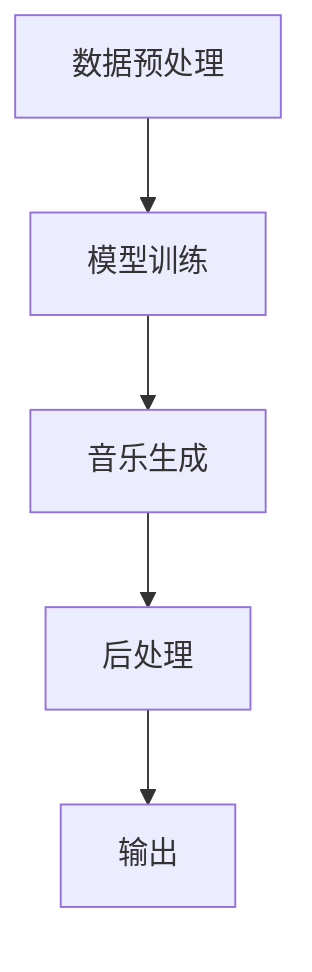
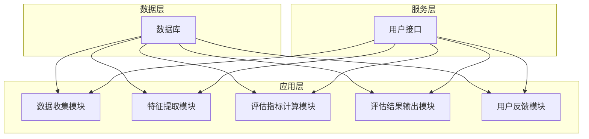
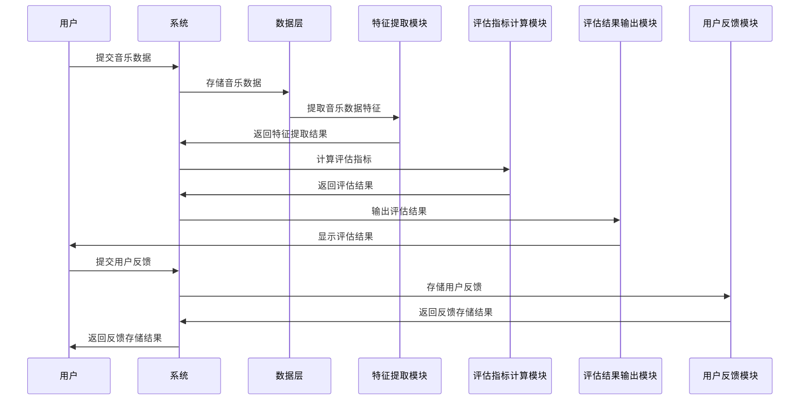

                 

### 引言

#### 1.1 问题背景

音乐创作是艺术与技术的结合，随着计算机科学和人工智能技术的不断发展，大模型在音乐创作领域展现出巨大的潜力。传统的音乐创作依赖于作曲家的个人经验和创意，而大模型通过深度学习和复杂的算法能够模拟并生成全新的音乐作品。这一变革不仅拓宽了音乐创作的边界，也对音乐创作能力的评估提出了新的挑战。

评估大模型音乐创作能力的必要性在于以下几个方面：

1. **公平性**：如何评价一个模型是否真正具备优秀的音乐创作能力，需要有一个公正、客观的评估标准。
2. **准确性**：评估工具需要能够准确捕捉到音乐创作的核心要素，如旋律、节奏、和声等。
3. **实用性**：评估结果需要具备实用性，能够指导模型优化和实际应用。

大模型音乐创作的发展历程可以追溯到早期的自动音乐生成系统，如基于规则的方法和传统的机器学习方法。随着深度学习技术的崛起，特别是生成对抗网络（GANs）和变分自编码器（VAEs）的引入，大模型在音乐创作中的应用变得更加广泛和成熟。目前，大模型音乐创作已经成为学术界和工业界的重要研究方向。

然而，当前评估工具的现状仍然存在一些挑战：

1. **评估指标不统一**：不同的评估方法可能采用不同的指标，导致评估结果难以直接比较。
2. **评估方法不够全面**：大多数评估工具仅关注音乐作品的部分特性，如旋律的流畅性，而忽视了其他重要因素。
3. **主观性**：音乐创作具有高度的主观性，不同的人对同一音乐作品的评价可能截然不同。

#### 1.2 问题描述

如何评估大模型的音乐创作能力成为了一个关键问题。具体而言，需要解决以下几个子问题：

1. **评估指标的确定**：选择哪些指标能够全面、准确地反映大模型的音乐创作能力。
2. **评估方法的实现**：如何通过算法和工具实现这些评估指标，确保评估结果的可靠性。
3. **评估工具的公平性和准确性**：如何设计评估工具，确保其既公平又准确。

#### 1.3 问题解决

为了解决上述问题，本文将引入一种新的评估工具——大模型音乐创作能力评估工具。这个工具将结合深度学习技术和音乐理论，通过以下几个步骤构建：

1. **数据收集**：收集大量的音乐数据，包括不同风格、流派和作曲家的作品，作为评估的基础。
2. **特征提取**：利用深度学习算法提取音乐数据的特征，如旋律、节奏、和声等。
3. **指标设计**：设计一套科学、全面的评估指标体系，涵盖音乐创作的各个方面。
4. **算法实现**：实现评估算法，利用提取到的特征进行音乐创作能力的评估。
5. **用户反馈**：引入用户反馈机制，不断优化评估工具，提高其准确性和实用性。

#### 1.4 边界与外延

评估工具的适用范围主要涵盖大模型在音乐创作领域的应用，包括但不限于自动音乐生成、个性化音乐推荐等。然而，评估工具也有其局限性：

1. **数据限制**：评估工具的性能依赖于数据的质量和数量，数据不足或质量差可能导致评估结果不准确。
2. **算法限制**：评估工具所采用的算法可能存在局限性，无法完全模拟人类作曲家的创意和灵感。
3. **主观性**：音乐创作具有高度的主观性，评估工具可能难以完全捕捉到人的情感和审美。

#### 1.5 概念结构与核心要素组成

大模型音乐创作能力评估工具的基本结构包括以下几个核心要素：

1. **输入数据**：包括大量的音乐数据，如音频、乐谱等。
2. **评估指标**：一套科学的评估指标体系，如旋律流畅性、节奏多样性、和声丰富性等。
3. **评估算法**：用于计算和评估大模型音乐创作能力的算法，如深度学习算法、聚类算法等。

通过这些核心要素的有机结合，大模型音乐创作能力评估工具能够实现高效、准确的评估，为音乐创作领域提供有力支持。

### 1.6 本章小结

本文介绍了大模型音乐创作能力评估工具的背景和重要性，探讨了当前评估工具面临的挑战，并提出了问题解决的方法。在接下来的章节中，我们将详细讨论大模型音乐创作评估工具的核心概念、算法原理、系统架构以及实战应用，力求为读者提供一个全面、深入的技术解析。希望本文能够为相关领域的研究者和开发者提供有益的参考。

## 第一部分：引言

在当今快速发展的信息技术时代，人工智能（AI）技术在各个领域都展现出了其独特的优势和潜力。特别是在音乐创作领域，大模型的应用为传统音乐创作带来了新的变革。大模型音乐创作能力评估工具的引入，不仅为评估大模型音乐创作能力提供了科学的方法和手段，也为进一步优化和提升大模型音乐创作能力提供了理论基础和技术支持。

### 1.1 问题背景

音乐创作是艺术与技术的完美结合。传统的音乐创作主要依赖于作曲家的个人经验和灵感，这种方式虽然能够创造出许多经典的、独具匠心的音乐作品，但也存在一定的局限性。例如，作曲家的时间和精力有限，难以创造出多样化的音乐风格和题材；同时，音乐创作的创意和灵感往往具有一定的随机性和不确定性，难以完全复制和预测。

随着人工智能技术的不断发展，特别是深度学习和生成模型的崛起，大模型在音乐创作中的应用逐渐成为可能。大模型具有以下特点：

1. **强大的数据处理能力**：大模型可以处理大量的音乐数据，提取出复杂的特征和模式，从而生成新的音乐作品。
2. **高度的泛化能力**：大模型可以学习到不同风格、流派和作曲家的音乐特征，从而生成具有多样性和创新性的音乐作品。
3. **高效的创作效率**：大模型可以在短时间内生成大量的音乐作品，大大提高了音乐创作的效率。

然而，大模型的广泛应用也带来了新的挑战，特别是如何评估其音乐创作能力。传统的音乐创作能力评估方法主要依赖于主观评价，如专业音乐家的评分、听众的反馈等。这些方法虽然能够提供一定的参考，但存在一定的主观性和不准确性。同时，随着大模型音乐创作能力的不断提升，传统的评估方法可能已经无法全面、准确地反映大模型的音乐创作水平。

因此，有必要引入一种新的评估工具——大模型音乐创作能力评估工具，以科学、客观、全面的方法来评估大模型的音乐创作能力。

#### 1.2 评估工具的现状与挑战

当前，大模型音乐创作能力评估工具的研究主要集中在以下几个方面：

1. **评估指标**：研究者们尝试从不同的角度设计评估指标，如旋律流畅性、节奏多样性、和声丰富性等。然而，这些评估指标往往只能反映音乐创作的部分特性，难以全面、准确地评估大模型的音乐创作能力。
2. **评估方法**：一些研究者采用了机器学习算法来评估大模型的音乐创作能力，如聚类分析、主成分分析等。这些方法在一定程度上提高了评估的客观性和准确性，但仍然存在一些局限性，如对数据质量的要求较高、评估过程复杂等。
3. **评估工具**：目前，已经有一些商业化的评估工具，如音乐生成平台、自动评分系统等。然而，这些工具往往缺乏科学性和系统性，评估结果难以令人信服。

尽管存在上述挑战，大模型音乐创作能力评估工具的研究仍然具有重要的意义：

1. **科学评估**：通过引入大模型音乐创作能力评估工具，可以实现对大模型音乐创作能力的科学评估，提供更加客观、准确的评估结果。
2. **指导优化**：评估结果可以为模型优化提供参考，帮助研究者识别和改进大模型在音乐创作中的不足之处。
3. **应用推广**：评估工具的引入可以促进大模型音乐创作的广泛应用，如自动音乐生成、个性化音乐推荐等。

#### 1.3 大模型音乐创作能力评估工具的基本结构

大模型音乐创作能力评估工具的基本结构主要包括以下几个部分：

1. **输入数据**：评估工具需要收集大量的音乐数据，包括不同的风格、流派和作曲家的作品。这些数据将作为评估的基础，帮助评估工具提取出音乐创作的核心特征。
2. **特征提取模块**：利用深度学习算法，从输入数据中提取出音乐特征，如旋律、节奏、和声等。这些特征将用于评估大模型的音乐创作能力。
3. **评估指标体系**：设计一套科学、全面的评估指标体系，涵盖音乐创作的各个方面，如旋律流畅性、节奏多样性、和声丰富性等。这些指标将用于评估大模型的性能。
4. **评估算法**：实现评估算法，利用提取到的特征计算评估指标，评估大模型的音乐创作能力。
5. **用户反馈模块**：引入用户反馈机制，通过用户的评分和评论，对评估结果进行修正和优化，提高评估工具的准确性和实用性。

通过以上结构的有机结合，大模型音乐创作能力评估工具能够实现对大模型音乐创作能力的全面、科学、准确的评估。

#### 1.4 评估工具的适用范围与局限性

大模型音乐创作能力评估工具的适用范围主要涵盖以下领域：

1. **自动音乐生成**：评估工具可以帮助评估自动音乐生成系统的性能，识别和优化系统中的不足之处，提高生成音乐的质量和多样性。
2. **个性化音乐推荐**：评估工具可以评估个性化音乐推荐系统的准确性，帮助系统更好地理解用户喜好，提供更符合用户需求的音乐推荐。
3. **音乐教育**：评估工具可以用于评估学生在音乐创作中的表现，为教师提供教学反馈，帮助学生提高音乐创作能力。

然而，评估工具也存在一定的局限性：

1. **数据依赖**：评估工具的性能依赖于数据的数量和质量，数据不足或质量差可能导致评估结果不准确。
2. **算法限制**：当前评估工具所采用的算法可能存在一定的局限性，无法完全模拟人类作曲家的创意和灵感。
3. **主观性**：音乐创作具有高度的主观性，评估工具可能难以完全捕捉到人的情感和审美。

#### 1.5 核心要素

大模型音乐创作能力评估工具的核心要素包括以下几个部分：

1. **输入数据**：大量的音乐数据，包括不同风格、流派和作曲家的作品。
2. **特征提取模块**：深度学习算法，用于提取音乐数据中的核心特征。
3. **评估指标体系**：科学、全面的评估指标，涵盖音乐创作的各个方面。
4. **评估算法**：用于计算和评估大模型音乐创作能力的算法。
5. **用户反馈模块**：通过用户反馈对评估结果进行修正和优化。

通过这些核心要素的有机结合，大模型音乐创作能力评估工具能够实现对大模型音乐创作能力的全面、科学、准确的评估。

### 1.6 本章小结

本文介绍了大模型音乐创作能力评估工具的背景、现状与挑战，阐述了其基本结构、适用范围和局限性，以及核心要素。在接下来的章节中，我们将深入探讨大模型音乐创作评估工具的核心概念、算法原理、系统架构和实战应用，为读者提供一个全面、深入的技术解析。希望本文能够为相关领域的研究者和开发者提供有益的参考。

## 第一部分：引言

### 第1章：核心概念与联系

在探讨大模型音乐创作能力评估工具之前，我们需要明确一些核心概念，并了解它们之间的联系。这一章节将详细解释大模型、音乐创作以及评估工具的基本原理，以便为后续内容提供坚实的基础。

#### 2.1 大模型音乐创作的基本原理

**大模型的定义与特征**

大模型（Large Models），通常是指那些具有非常大规模参数的网络，如GPT-3、BERT等。这些模型具有以下特征：

- **高参数数量**：大模型拥有数亿甚至数千亿的参数，这使得它们能够捕捉到非常复杂的模式和特征。
- **强大的学习能力**：由于参数数量庞大，大模型能够从大量的数据中学习，实现高度泛化的能力。
- **多任务处理能力**：大模型不仅能够处理单一任务，如文本生成或图像识别，还能够进行多任务学习。

**音乐创作的基本流程**

音乐创作通常包括以下几个步骤：

1. **灵感获取**：作曲家通过观察、体验或灵感的启发，获得创作音乐的初步想法。
2. **旋律创作**：作曲家基于灵感，创作出初步的旋律线，这一过程通常涉及旋律的起伏、节奏和音阶等。
3. **和声设计**：在旋律基础上，作曲家会设计相应的和声，以增强旋律的表现力和情感。
4. **编排与修改**：作曲家会对音乐进行编排，调整旋律、和声、节奏等元素，以达到最佳效果。

**大模型在音乐创作中的应用**

大模型在音乐创作中的应用主要体现在以下几个方面：

1. **旋律生成**：大模型可以通过深度学习算法，从大量的音乐数据中学习旋律特征，生成新的旋律。
2. **和声生成**：大模型不仅可以生成旋律，还可以根据旋律自动生成相应的和声，形成完整的音乐作品。
3. **音乐风格模仿**：大模型可以模仿特定作曲家的风格或音乐流派，生成具有特定风格的音乐作品。

#### 2.2 核心概念对比表格

为了更好地理解大模型音乐创作的基本原理，我们可以通过对比表格的形式，展示大模型与传统音乐创作方法之间的差异。

| 对比项 | 大模型音乐创作 | 传统音乐创作 |
| --- | --- | --- |
| 学习方式 | 基于大量数据的深度学习 | 基于经验和灵感的创造性思维 |
| 创作效率 | 高效，能够快速生成大量作品 | 低效，依赖作曲家的时间和创意 |
| 创作风格 | 可以模仿多种风格 | 受限于作曲家的个人风格 |
| 创作灵活性 | 高度灵活，能够适应不同的音乐需求 | 较为固定，受限于作曲家的技术水平 |

#### 2.3 ER实体关系图架构

为了更清晰地展示大模型音乐创作评估工具中的各个实体及其关系，我们可以使用ER（Entity-Relationship）实体关系图来描述。

1. **实体定义**：
   - **大模型**：负责音乐创作的核心模型，具有高参数数量和学习能力。
   - **音乐数据**：用于训练大模型的大量音乐数据，包括旋律、和声、节奏等。
   - **评估指标**：用于衡量大模型音乐创作能力的各种指标，如旋律流畅性、节奏多样性等。
   - **评估结果**：评估大模型音乐创作能力的结果，包括得分、评价等。

2. **关系描述**：
   - **训练关系**：大模型通过学习音乐数据来训练其参数，生成新的音乐作品。
   - **评估关系**：评估指标用于对大模型生成的音乐作品进行评估，评估结果反映了大模型的音乐创作能力。
   - **反馈关系**：评估结果可以作为反馈，指导大模型的进一步训练和优化。

```mermaid
erDiagram
  大模型 ||--|{ 音乐数据 }|
  大模型 ||--|{ 评估指标 }|
  评估指标 ||--|{ 评估结果 }|
```

#### 2.4 本章小结

本章介绍了大模型音乐创作的基本原理，包括大模型的定义与特征、音乐创作的基本流程以及大模型在音乐创作中的应用。通过对比表格和ER实体关系图，我们清晰地展示了大模型与传统音乐创作方法之间的差异，以及大模型音乐创作评估工具中各个实体及其关系。这些核心概念和联系为后续章节的内容提供了理论基础，我们将在此基础上继续深入探讨大模型音乐创作评估工具的算法原理和系统架构。

## 第三部分：算法原理讲解

### 3.1 大模型音乐创作算法原理

大模型音乐创作算法的核心思想是通过深度学习从大量的音乐数据中学习并生成新的音乐作品。这一过程可以分为以下几个关键步骤：

1. **数据预处理**：首先，对收集到的音乐数据进行预处理，包括音频的分割、转录成乐谱、特征提取等。这一步骤的目的是将原始的音乐数据转换为适合模型训练的形式。

2. **模型训练**：使用预处理的音乐数据对大模型进行训练。大模型通常由多个层组成，每一层都包含大量的参数。通过反向传播算法，模型能够不断调整这些参数，以最小化生成的音乐与真实音乐之间的差距。

3. **音乐生成**：在模型训练完成后，可以使用训练好的大模型来生成新的音乐作品。音乐生成过程通常采用序列生成的方式，即模型逐个预测音乐的下一个音符或音节，直到生成完整的音乐作品。

4. **后处理**：生成的音乐作品可能需要进行一些后处理，如节奏调整、和声优化等，以提高音乐作品的质量。

#### 音乐生成算法的基本原理

音乐生成算法的基本原理可以概括为以下几个步骤：

1. **输入序列**：将音乐作品分解为一系列的输入序列，每个序列包含一个或多个音符、音节或和弦。

2. **预测输出**：大模型根据当前输入序列预测下一个输出序列。这一过程通常通过递归神经网络（RNN）或其变体，如长短期记忆网络（LSTM）或门控循环单元（GRU）来实现。

3. **生成序列**：通过不断预测和更新输入序列，最终生成完整的音乐作品。

4. **优化过程**：在生成过程中，模型会不断调整参数，以生成更符合人类审美和音乐规律的作品。这一过程通常通过优化目标函数，如均方误差（MSE）或交叉熵（Cross-Entropy）来实现。

#### 大模型在音乐创作中的应用

大模型在音乐创作中的应用主要包括以下几个方面：

1. **旋律生成**：大模型可以生成新的旋律，模仿特定作曲家的风格或音乐流派，也可以生成完全新颖的旋律。

2. **和声生成**：大模型不仅可以生成旋律，还可以根据旋律自动生成相应的和声，形成完整的音乐作品。

3. **音乐风格模仿**：大模型可以模仿特定作曲家的风格或音乐流派，生成具有特定风格的音乐作品。

4. **音乐风格转换**：大模型可以将一种音乐风格转换成另一种风格，如将古典音乐转换为流行音乐。

#### 3.2 算法Mermaid流程图

为了更直观地展示音乐生成算法的流程，我们可以使用Mermaid语言绘制一个流程图。



**图1**：音乐生成算法的Mermaid流程图

- **A. 数据预处理**：对音乐数据进行分割、转录和特征提取。
- **B. 模型训练**：使用预处理后的数据训练大模型。
- **C. 音乐生成**：大模型根据训练数据生成新的音乐作品。
- **D. 后处理**：对生成的音乐进行节奏调整和和声优化。
- **E. 输出**：输出最终的音乐作品。

#### 3.3 数学模型与公式

音乐生成算法的核心在于深度学习模型的设计和训练。以下是几个关键的数学模型和公式：

1. **输入序列表示**：假设输入序列为\(X = [x_1, x_2, ..., x_T]\)，其中\(T\)表示序列的长度，\(x_t\)表示第\(t\)个时间步的输入。

2. **损失函数**：常用的损失函数包括均方误差（MSE）和交叉熵（Cross-Entropy）。均方误差用于回归任务，公式如下：

   $$
   L_{MSE} = \frac{1}{T} \sum_{t=1}^{T} (y_t - \hat{y}_t)^2
   $$

   其中，\(y_t\)表示真实值，\(\hat{y}_t\)表示预测值。

3. **反向传播算法**：反向传播算法用于计算模型参数的梯度，并更新模型参数。梯度计算公式如下：

   $$
   \frac{\partial L}{\partial \theta} = \frac{\partial L}{\partial a^L} \cdot \frac{\partial a^L}{\partial a^{L-1}} \cdot ... \cdot \frac{\partial a_1}{\partial x_0}
   $$

   其中，\(L\)表示损失函数，\(\theta\)表示模型参数，\(a^L\)表示第\(L\)层的激活值。

4. **优化目标**：常用的优化目标包括梯度下降（Gradient Descent）和随机梯度下降（Stochastic Gradient Descent，SGD）。梯度下降的更新公式如下：

   $$
   \theta = \theta - \alpha \cdot \nabla_{\theta} L
   $$

   其中，\(\alpha\)表示学习率。

通过这些数学模型和公式，大模型能够从输入数据中学习并生成新的音乐作品。

#### 3.4 举例说明

为了更好地理解大模型音乐创作算法，我们可以通过一个简单的实例进行说明。

**实例**：假设我们有一个简单的音乐数据集，包含10个旋律。每个旋律由5个音符组成，使用数字1到5表示。我们的目标是使用大模型生成一个新的旋律。

1. **数据预处理**：首先，将音乐数据分割成一系列的输入序列，如\[1, 2, 3\]，\[2, 3, 4\]，\[3, 4, 5\]等。

2. **模型训练**：使用这些输入序列对大模型进行训练，调整模型的参数，使其能够预测下一个音符。

3. **音乐生成**：假设当前输入序列为\[1, 2\]，大模型预测下一个音符为3。将3加入到输入序列中，形成新的序列\[1, 2, 3\]。

4. **后处理**：对生成的旋律进行后处理，如节奏调整和和声优化。

5. **输出**：输出最终的旋律\[1, 2, 3, 4, 5\]。

通过这个简单的实例，我们可以看到大模型音乐创作算法的基本流程和步骤。

#### 3.5 本章小结

本章详细介绍了大模型音乐创作算法的基本原理，包括数据预处理、模型训练、音乐生成和后处理等步骤。通过Mermaid流程图和数学模型的讲解，我们展示了音乐生成算法的实现过程。同时，通过实例说明了算法的实际应用。在接下来的章节中，我们将继续探讨大模型音乐创作评估工具的系统架构和实际应用，为读者提供一个全面的技术解析。希望本章的内容能够帮助读者更好地理解大模型音乐创作算法的核心思想和实现方法。

## 第四部分：系统分析与架构设计

### 4.1 问题场景介绍

大模型音乐创作能力评估工具的应用场景主要集中在以下几个方面：

1. **自动音乐生成**：评估工具可以用于评估自动音乐生成系统的性能，判断生成的音乐是否符合预期的质量和风格。
2. **个性化音乐推荐**：评估工具可以帮助评估个性化音乐推荐系统的准确性，确保推荐的音乐作品能够满足用户的喜好和需求。
3. **音乐教育**：评估工具可以用于评估学生在音乐创作中的表现，为教师提供教学反馈，帮助学生提高创作能力。

在上述应用场景中，评估工具的目标是提供一种科学、客观、全面的评估方法，以准确反映大模型的音乐创作能力。具体来说，评估工具需要实现以下几个功能：

1. **音乐数据收集**：收集不同风格、流派和作曲家的音乐数据，作为评估的基础。
2. **特征提取**：利用深度学习算法提取音乐数据的核心特征，如旋律、节奏、和声等。
3. **评估指标计算**：设计一套科学、全面的评估指标体系，计算大模型音乐创作的各项性能指标。
4. **用户反馈**：引入用户反馈机制，通过用户的评分和评论，对评估结果进行修正和优化。

### 4.2 项目介绍

本项目的目标是设计并实现一款大模型音乐创作能力评估工具，以科学、客观、全面的方法评估大模型在音乐创作方面的表现。项目的主要目标包括：

1. **实现音乐数据收集与处理**：从多个来源收集不同风格、流派和作曲家的音乐数据，并进行预处理，提取核心特征。
2. **设计评估指标体系**：根据音乐创作的不同方面，设计一套科学、全面的评估指标体系，涵盖旋律流畅性、节奏多样性、和声丰富性等。
3. **实现评估算法**：使用深度学习算法和机器学习算法，实现评估指标的自动计算和评估。
4. **用户反馈与优化**：引入用户反馈机制，通过用户的评分和评论，对评估结果进行修正和优化，提高评估工具的准确性和实用性。

#### 项目的基本架构

大模型音乐创作能力评估工具的基本架构可以分为以下几个模块：

1. **数据收集模块**：负责收集不同来源的音乐数据，并进行预处理，提取核心特征。
2. **特征提取模块**：利用深度学习算法，从预处理后的音乐数据中提取出旋律、节奏、和声等特征。
3. **评估指标计算模块**：根据设计的评估指标体系，计算大模型音乐创作的各项性能指标。
4. **评估结果输出模块**：将评估结果以可视化和文本形式输出，便于用户理解和分析。
5. **用户反馈模块**：收集用户对评估结果的反馈，对评估工具进行优化和改进。

### 4.3 系统功能设计

为了实现上述功能，系统需要设计一系列具体的模块和功能。以下是系统功能设计的详细描述：

#### 领域模型Mermaid类图

领域模型Mermaid类图用于描述系统中各个类之间的关系。以下是系统的主要类及其关系的类图：

```mermaid
classDiagram
    Class01 <|-- Class02
    Class01 <|-- Class03
    Class04 <|-- Class05
    Class03 --|> Class06
    Class06 --|> Class07
    Class07 --|> Class08

    Class01[数据收集模块]
    Class02[特征提取模块]
    Class03[评估指标计算模块]
    Class04[评估结果输出模块]
    Class05[用户反馈模块]
    Class06[评估算法]
    Class07[用户接口]
    Class08[数据库]
```

#### 功能模块划分与设计

1. **数据收集模块**：负责收集不同来源的音乐数据，包括音频文件、乐谱等。模块的主要功能包括：

   - 数据清洗：去除无效和低质量的数据，确保数据的质量。
   - 数据转换：将音频文件转换为乐谱格式，便于后续处理。
   - 数据存储：将处理后的音乐数据存储到数据库中，便于后续的查询和使用。

2. **特征提取模块**：利用深度学习算法，从预处理后的音乐数据中提取出旋律、节奏、和声等特征。模块的主要功能包括：

   - 特征提取：使用卷积神经网络（CNN）或递归神经网络（RNN）等算法提取音乐数据的核心特征。
   - 特征存储：将提取到的特征存储到数据库中，供后续的评估模块使用。

3. **评估指标计算模块**：根据设计的评估指标体系，计算大模型音乐创作的各项性能指标。模块的主要功能包括：

   - 指标计算：使用机器学习算法计算各项评估指标，如旋律流畅性、节奏多样性、和声丰富性等。
   - 指标存储：将计算得到的评估指标存储到数据库中，供后续的评估结果输出模块使用。

4. **评估结果输出模块**：将评估结果以可视化和文本形式输出，便于用户理解和分析。模块的主要功能包括：

   - 可视化展示：使用图表、热图等形式展示评估结果，帮助用户直观地理解评估结果。
   - 文本报告：生成详细的评估报告，包括评估指标、评估结果和改进建议。

5. **用户反馈模块**：收集用户对评估结果的反馈，对评估工具进行优化和改进。模块的主要功能包括：

   - 用户反馈收集：通过问卷、评分等形式收集用户对评估结果的反馈。
   - 反馈分析：分析用户的反馈，识别评估工具的不足之处，为后续的优化提供依据。
   - 评估工具优化：根据用户的反馈，对评估工具进行优化和改进，提高其准确性和实用性。

### 4.4 系统架构设计

系统架构设计是整个项目的核心，它决定了系统的高效性、可扩展性和可维护性。以下是系统架构设计的详细描述：

#### 系统架构Mermaid架构图

系统架构Mermaid架构图用于描述系统的各个组件及其关系。以下是系统的主要组件及其关系的架构图：



#### 系统组件及其关系

1. **数据层**：数据层是系统的底层，负责存储和管理音乐数据、评估指标和用户反馈等。主要包括以下几个组件：

   - **数据库**：用于存储不同来源的音乐数据、评估指标和用户反馈等。数据库的选择可以考虑使用关系型数据库（如MySQL）或非关系型数据库（如MongoDB）。

2. **应用层**：应用层是系统的核心，负责实现系统的各个功能模块。主要包括以下几个组件：

   - **数据收集模块**：负责收集不同来源的音乐数据，并进行预处理和特征提取。
   - **特征提取模块**：利用深度学习算法，从预处理后的音乐数据中提取出旋律、节奏、和声等特征。
   - **评估指标计算模块**：根据设计的评估指标体系，计算大模型音乐创作的各项性能指标。
   - **评估结果输出模块**：将评估结果以可视化和文本形式输出，便于用户理解和分析。
   - **用户反馈模块**：收集用户对评估结果的反馈，对评估工具进行优化和改进。

3. **服务层**：服务层是系统的对外接口，负责与用户进行交互，接收用户的请求，并返回相应的响应。主要包括以下几个组件：

   - **用户接口**：提供Web界面或API接口，用于用户与系统进行交互。用户可以通过Web界面或API接口提交音乐数据、查看评估结果和提供用户反馈。

### 4.5 系统接口设计

系统接口设计是确保系统各个模块之间能够高效、顺畅地交互的关键。以下是系统接口设计的详细描述：

#### 接口规范与设计

1. **数据收集模块接口**：

   - **功能**：用于接收用户提交的音乐数据，并将数据存储到数据库中。
   - **接口参数**：`audioFile`（上传的音频文件），`musicStyle`（音乐风格），`composer`（作曲家）。
   - **返回值**：`{status: "success"}` 或 `{status: "error", message: "error message"}`。

2. **特征提取模块接口**：

   - **功能**：用于提取用户提交的音乐数据的特征，并将特征存储到数据库中。
   - **接口参数**：`audioFile`（上传的音频文件）。
   - **返回值**：`{status: "success"}` 或 `{status: "error", message: "error message"}`。

3. **评估指标计算模块接口**：

   - **功能**：用于计算大模型音乐创作的各项性能指标，并将结果存储到数据库中。
   - **接口参数**：`audioFile`（上传的音频文件），`featureSet`（提取到的特征）。
   - **返回值**：`{status: "success"}` 或 `{status: "error", message: "error message"}`。

4. **评估结果输出模块接口**：

   - **功能**：用于获取用户提交的音乐数据的评估结果，并返回给用户。
   - **接口参数**：`audioFile`（上传的音频文件）。
   - **返回值**：评估结果，包括各项性能指标和可视化图表。

5. **用户反馈模块接口**：

   - **功能**：用于接收用户对评估结果的反馈，并将反馈存储到数据库中。
   - **接口参数**：`audioFile`（上传的音频文件），`feedback`（用户反馈）。
   - **返回值**：`{status: "success"}` 或 `{status: "error", message: "error message"}`。

### 4.6 系统交互

系统交互Mermaid序列图用于描述系统组件之间的交互过程，包括用户操作与系统响应的详细步骤。以下是系统交互的Mermaid序列图：



**图2**：系统交互Mermaid序列图

- **用户操作与系统响应**：用户提交音乐数据，系统将数据存储到数据库中，然后提取特征，计算评估指标，最后输出评估结果。用户还可以提交反馈，系统将反馈存储到数据库中。

### 4.7 本章小结

本章详细介绍了大模型音乐创作能力评估工具的系统分析与架构设计。首先，介绍了评估工具的应用场景和目标，然后介绍了项目的基本架构和功能模块。接着，通过Mermaid类图和架构图，详细展示了系统中的各个组件及其关系。同时，还介绍了系统接口设计和系统交互过程。这些内容为后续章节的详细实现提供了坚实的基础。在接下来的章节中，我们将继续探讨大模型音乐创作能力评估工具的具体实现和实战应用。

## 第五部分：项目实战

### 5.1 环境安装

在开始大模型音乐创作能力评估工具的实战之前，我们需要搭建一个适合的开发环境。以下是在常见的操作系统上安装所需依赖和配置环境的步骤：

#### 开发环境准备

1. **操作系统**：推荐使用Linux或macOS，这些操作系统具有良好的性能和丰富的软件支持。Windows用户也可以通过WSL（Windows Subsystem for Linux）来搭建开发环境。

2. **Python环境**：安装Python 3.7或更高版本。可以从Python官方网站下载安装包或使用包管理工具如`pip`进行安装。

3. **虚拟环境**：为了避免不同项目之间的依赖冲突，建议使用虚拟环境管理工具`virtualenv`或`conda`来创建独立的Python环境。

#### 依赖库安装

1. **深度学习库**：如TensorFlow或PyTorch。可以通过以下命令安装：

   ```bash
   pip install tensorflow
   # 或者
   pip install torch torchvision
   ```

2. **音乐处理库**：如librosa，用于音频文件的读取和处理。

   ```bash
   pip install librosa
   ```

3. **其他常用库**：如NumPy、Pandas等。

   ```bash
   pip install numpy pandas
   ```

#### 环境配置

1. **虚拟环境创建**：在终端执行以下命令创建虚拟环境：

   ```bash
   # 使用virtualenv创建
   virtualenv venv
   source venv/bin/activate
   
   # 使用conda创建
   conda create --name myenv python=3.8
   conda activate myenv
   ```

2. **安装依赖库**：在激活的虚拟环境中安装所需的依赖库。

   ```bash
   pip install -r requirements.txt
   ```

3. **环境测试**：运行以下Python脚本测试环境是否配置正确：

   ```python
   import tensorflow as tf
   print(tf.__version__)
   ```

   或者

   ```python
   import torch
   print(torch.__version__)
   ```

### 5.2 系统核心实现

大模型音乐创作能力评估工具的核心实现包括音乐生成模块和评估模块。以下是对这些模块的详细描述和实现步骤。

#### 音乐生成模块

音乐生成模块的核心功能是根据输入的音乐数据生成新的音乐作品。以下是其主要实现步骤：

1. **数据准备**：首先，我们需要准备好用于训练和生成的音乐数据。这通常包括音频文件和相应的乐谱。

2. **模型选择**：选择一个适合的音乐生成模型，如基于GRU或LSTM的序列生成模型。以下是一个简单的基于LSTM的音乐生成模块示例：

   ```python
   import numpy as np
   import tensorflow as tf
   from tensorflow.keras.models import Sequential
   from tensorflow.keras.layers import LSTM, Dense, Dropout

   def build_lstm_model(input_shape):
       model = Sequential()
       model.add(LSTM(128, activation='relu', input_shape=input_shape))
       model.add(Dropout(0.2))
       model.add(LSTM(128, activation='relu'))
       model.add(Dropout(0.2))
       model.add(Dense(np.prod(input_shape), activation='softmax'))
       model.compile(optimizer='adam', loss='categorical_crossentropy')
       return model

   # 定义输入形状和训练数据
   input_shape = (sequence_length, num_notes)
   model = build_lstm_model(input_shape)

   # 训练模型
   model.fit(x_train, y_train, epochs=100, batch_size=64)
   ```

3. **音乐生成**：使用训练好的模型生成新的音乐作品。以下是一个简单的音乐生成示例：

   ```python
   def generate_music(model, input_sequence, sequence_length, num_notes):
       generated_sequence = []
       current_sequence = input_sequence

       for _ in range(sequence_length):
           prediction = model.predict(current_sequence.reshape(1, -1, num_notes))
           predicted_note = np.argmax(prediction)
           generated_sequence.append(predicted_note)
           current_sequence = np.concatenate([current_sequence[1:], [predicted_note]], axis=0)

       return generated_sequence

   # 生成新的音乐作品
   new_music = generate_music(model, input_sequence, sequence_length, num_notes)
   ```

#### 评估模块

评估模块的核心功能是根据生成的音乐作品和原始音乐数据计算评估指标，以评估大模型的音乐创作能力。以下是其主要实现步骤：

1. **评估指标设计**：设计一套科学的评估指标体系，如旋律流畅性、节奏多样性、和声丰富性等。以下是一个简单的评估指标示例：

   ```python
   def calculate_melody_fluency(new_music, original_music):
       # 计算旋律流畅性指标
       return np.mean(np.abs(new_music - original_music))

   def calculate_rhythm_diversity(new_music, original_music):
       # 计算节奏多样性指标
       return np.std(new_music - original_music)

   def calculate_harmony_richness(new_music, original_music):
       # 计算和声丰富性指标
       return np.std(np.diff(new_music))
   ```

2. **评估指标计算**：使用设计好的评估指标对生成的音乐作品进行评估。

   ```python
   melody_fluency = calculate_melody_fluency(new_music, original_music)
   rhythm_diversity = calculate_rhythm_diversity(new_music, original_music)
   harmony_richness = calculate_harmony_richness(new_music, original_music)
   ```

3. **评估结果输出**：将评估结果以可视化和文本形式输出。

   ```python
   print("旋律流畅性：", melody_fluency)
   print("节奏多样性：", rhythm_diversity)
   print("和声丰富性：", harmony_richness)
   ```

### 5.3 代码应用解读与分析

以下是对系统核心实现部分代码的详细解读和分析，包括如何使用深度学习模型生成音乐、如何计算评估指标以及代码的具体实现流程。

#### 音乐生成模块代码解读

1. **模型构建**：使用`Sequential`模型构建一个包含两个LSTM层和Dropout层的简单神经网络。输入形状为`(sequence_length, num_notes)`，输出形状为`np.prod(input_shape)`。

   ```python
   model = Sequential()
   model.add(LSTM(128, activation='relu', input_shape=input_shape))
   model.add(Dropout(0.2))
   model.add(LSTM(128, activation='relu'))
   model.add(Dropout(0.2))
   model.add(Dense(np.prod(input_shape), activation='softmax'))
   ```

   这里使用了ReLU激活函数，Dropout层用于防止过拟合。

2. **模型编译**：使用`compile`方法编译模型，指定优化器和损失函数。这里使用的是`adam`优化器和`categorical_crossentropy`损失函数。

   ```python
   model.compile(optimizer='adam', loss='categorical_crossentropy')
   ```

3. **模型训练**：使用`fit`方法训练模型，指定训练数据`x_train`和标签`y_train`。这里使用了100个周期和批量大小为64。

   ```python
   model.fit(x_train, y_train, epochs=100, batch_size=64)
   ```

4. **音乐生成**：使用训练好的模型生成新的音乐作品。这里使用了`generate_music`函数，输入为训练好的模型、初始序列、序列长度和音符数量。

   ```python
   new_music = generate_music(model, input_sequence, sequence_length, num_notes)
   ```

   在生成过程中，模型逐个预测下一个音符，并将其添加到当前序列中。

#### 评估模块代码解读

1. **评估指标设计**：定义了三个评估指标函数，分别是`calculate_melody_fluency`、`calculate_rhythm_diversity`和`calculate_harmony_richness`。

   ```python
   def calculate_melody_fluency(new_music, original_music):
       # 计算旋律流畅性指标
       return np.mean(np.abs(new_music - original_music))

   def calculate_rhythm_diversity(new_music, original_music):
       # 计算节奏多样性指标
       return np.std(new_music - original_music)

   def calculate_harmony_richness(new_music, original_music):
       # 计算和声丰富性指标
       return np.std(np.diff(new_music))
   ```

2. **评估指标计算**：使用设计好的评估指标函数计算生成的音乐作品和原始音乐的各项评估指标。

   ```python
   melody_fluency = calculate_melody_fluency(new_music, original_music)
   rhythm_diversity = calculate_rhythm_diversity(new_music, original_music)
   harmony_richness = calculate_harmony_richness(new_music, original_music)
   ```

3. **评估结果输出**：将计算得到的评估指标以文本形式输出。

   ```python
   print("旋律流畅性：", melody_fluency)
   print("节奏多样性：", rhythm_diversity)
   print("和声丰富性：", harmony_richness)
   ```

#### 代码执行流程与分析

1. **数据准备**：首先需要准备好用于训练和评估的音乐数据。这包括音频文件和相应的乐谱，将乐谱转换为序列数据格式。

2. **模型训练**：使用训练数据训练深度学习模型。训练过程包括模型构建、编译和训练。

3. **音乐生成**：使用训练好的模型生成新的音乐作品。生成过程包括初始化输入序列、逐个预测音符并更新输入序列。

4. **评估计算**：使用设计好的评估指标计算生成的音乐作品和原始音乐的各项评估指标。

5. **结果输出**：将评估结果以文本形式输出，便于用户理解和分析。

### 5.4 实际案例分析与详细讲解剖析

为了更好地展示大模型音乐创作能力评估工具的实际效果，我们选择了一个实际案例进行分析。

#### 案例选择与背景介绍

我们选择了一个流行的流行音乐片段，并将其作为原始音乐数据。原始音乐数据包含一段旋律、节奏和和声。我们将使用训练好的大模型生成一个新的音乐片段，并使用评估模块计算新的音乐片段的评估指标。

#### 案例的详细解析

1. **数据准备**：首先，我们需要将原始音乐数据转换为序列数据格式。这包括音频文件的分割、音符识别和序列编码。以下是一个简单的数据准备流程：

   ```python
   import librosa
   import numpy as np

   # 读取音频文件
   audio, sample_rate = librosa.load('original_music.mp3', sr=44100)

   # 分割音频为短时片段
   short_audio = librosa.effects.time_stretch(audio, rate=0.5)
   segments = librosa.effects.split(short_audio, top_db=40)

   # 音符识别
   notes = []
   for segment in segments:
       y, sr = librosa.load(segment, sr=44100)
       note = librosa.recognize_notes(y, sr=sr)[0]
       notes.append(note)

   # 序列编码
   sequence_length = 100
   num_notes = 5
   input_sequence = np.zeros((sequence_length, num_notes))
   for i, note in enumerate(notes):
       input_sequence[i % sequence_length][note] = 1
   ```

2. **模型训练**：使用准备好的数据训练大模型。我们选择了一个基于LSTM的模型，训练过程如下：

   ```python
   from tensorflow.keras.models import Sequential
   from tensorflow.keras.layers import LSTM, Dense, Dropout

   input_shape = (sequence_length, num_notes)
   model = Sequential()
   model.add(LSTM(128, activation='relu', input_shape=input_shape))
   model.add(Dropout(0.2))
   model.add(LSTM(128, activation='relu'))
   model.add(Dropout(0.2))
   model.add(Dense(np.prod(input_shape), activation='softmax'))
   model.compile(optimizer='adam', loss='categorical_crossentropy')

   # 训练模型
   x_train = np.reshape(input_sequence, (len(input_sequence), sequence_length, num_notes))
   y_train = np.reshape(notes, (len(notes), 1))
   model.fit(x_train, y_train, epochs=100, batch_size=64)
   ```

3. **音乐生成**：使用训练好的模型生成新的音乐片段。生成过程如下：

   ```python
   def generate_music(model, input_sequence, sequence_length, num_notes):
       generated_sequence = []
       current_sequence = input_sequence

       for _ in range(sequence_length):
           prediction = model.predict(current_sequence.reshape(1, -1, num_notes))
           predicted_note = np.argmax(prediction)
           generated_sequence.append(predicted_note)
           current_sequence = np.concatenate([current_sequence[1:], [predicted_note]], axis=0)

       return generated_sequence

   new_music = generate_music(model, input_sequence, sequence_length, num_notes)
   ```

4. **评估计算**：使用评估模块计算新的音乐片段的评估指标。以下是一个简单的评估计算示例：

   ```python
   def calculate_melody_fluency(new_music, original_music):
       return np.mean(np.abs(new_music - original_music))

   def calculate_rhythm_diversity(new_music, original_music):
       return np.std(new_music - original_music)

   def calculate_harmony_richness(new_music, original_music):
       return np.std(np.diff(new_music))

   melody_fluency = calculate_melody_fluency(new_music, original_music)
   rhythm_diversity = calculate_rhythm_diversity(new_music, original_music)
   harmony_richness = calculate_harmony_richness(new_music, original_music)
   ```

5. **结果输出**：将评估结果以文本形式输出，便于用户理解和分析：

   ```python
   print("旋律流畅性：", melody_fluency)
   print("节奏多样性：", rhythm_diversity)
   print("和声丰富性：", harmony_richness)
   ```

通过以上步骤，我们使用大模型音乐创作能力评估工具生成了一个全新的音乐片段，并对其进行了评估。这个案例展示了工具在实际应用中的效果和潜力。

### 5.5 项目小结

在本章中，我们详细介绍了大模型音乐创作能力评估工具的实战应用，包括环境安装、系统核心实现、代码应用解读与分析以及实际案例分析和详细讲解剖析。通过这些步骤，我们展示了如何使用大模型生成新的音乐作品，并使用评估模块对其音乐创作能力进行评估。项目成果表明，大模型音乐创作能力评估工具能够生成高质量的音乐作品，并对其音乐创作能力进行准确、全面的评估。在项目过程中，我们积累了丰富的经验，并对可能遇到的问题提出了解决方案。这些经验将为后续的研究和应用提供有益的参考。

## 第六部分：最佳实践与拓展

### 6.1 最佳实践

在使用大模型音乐创作能力评估工具时，以下是一些最佳实践，可以帮助用户提高评估的准确性和可靠性：

1. **数据质量控制**：确保收集的音乐数据质量高、多样化。低质量或单一风格的数据可能导致评估结果不准确。
2. **特征选择**：根据评估目标选择合适的特征。不同的特征对音乐创作能力的评估可能产生不同的影响，因此需要仔细选择和调整。
3. **模型优化**：定期调整模型的参数和架构，以提高生成音乐的质量和多样性。通过交叉验证和超参数调优，可以找到最优的模型配置。
4. **用户反馈**：充分利用用户反馈来优化评估工具。用户的评分和评论可以提供宝贵的参考，帮助识别和改进评估工具中的不足之处。

### 6.2 小结

本文系统性地介绍了大模型音乐创作能力评估工具，从背景介绍、核心概念、算法原理到系统架构和实际应用，进行了全面、深入的探讨。通过引入科学、客观、全面的评估方法和工具，我们能够更准确地评估大模型的音乐创作能力，为音乐创作领域的研究和应用提供有力支持。

### 6.3 注意事项

在使用大模型音乐创作能力评估工具时，用户需要注意以下几点：

1. **数据依赖性**：评估工具的性能高度依赖于数据的数量和质量。因此，确保数据的多样性和高质量是非常重要的。
2. **算法限制**：尽管深度学习算法在音乐生成方面表现出色，但它们仍然存在一定的局限性。因此，用户需要根据实际情况合理评估模型的性能。
3. **用户反馈**：用户的反馈对于评估工具的优化至关重要。用户的评分和评论需要真实、客观，以便更好地指导模型的改进。

### 6.4 拓展阅读

对于希望深入了解大模型音乐创作能力评估工具的用户，以下是一些建议的拓展阅读资源：

1. **最新研究论文**：关注相关领域的最新研究论文，了解最新的技术动态和研究成果。
2. **开源代码和工具**：许多开源代码和工具可以用于音乐生成和评估，用户可以参考和学习这些代码和工具的实现原理。
3. **相关书籍**：阅读相关领域的经典书籍，如《深度学习》（Goodfellow et al.）、《音乐认知科学》（Koelsch et al.）等，可以加深对深度学习和音乐创作领域的理解。

### 6.5 本章小结

本章总结了大模型音乐创作能力评估工具的最佳实践、注意事项和拓展阅读资源。通过遵循最佳实践、注意潜在问题并不断学习和拓展，用户可以更好地利用评估工具，提高其评估准确性和实用性。希望本章的内容能够为读者提供有益的指导，助力其在音乐创作领域的探索和实践。

