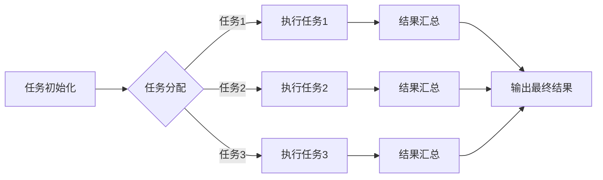
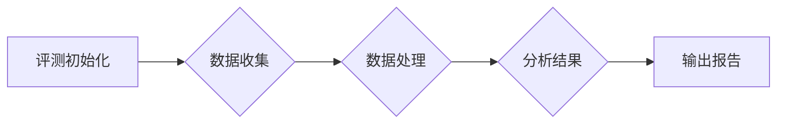
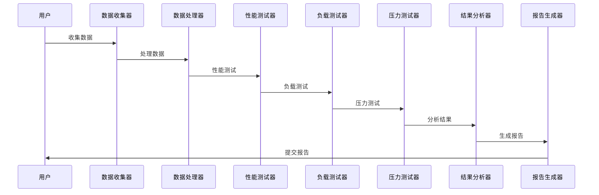
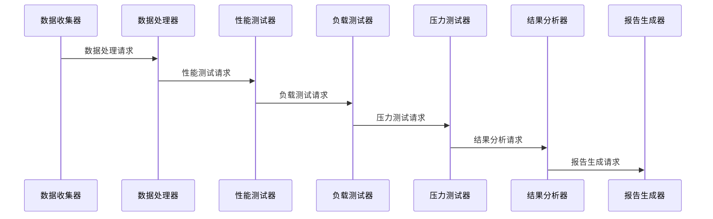
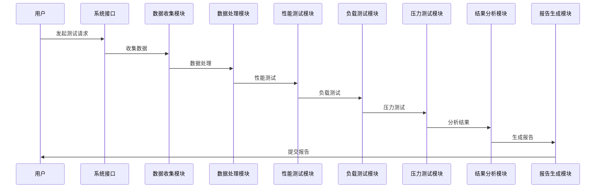

                 


### 摘要

在当今信息化时代，大规模数据处理和并行计算已成为提高数据处理效率和系统性能的关键技术。本文将深入探讨大规模并行评测所面临的技术挑战及其解决方案。首先，我们将介绍并行评测的背景和重要性，然后逐步解析并行计算和评测方法的原理，并对比其概念属性特征。接下来，我们将讲解并行计算和评测算法的原理，使用Mermaid流程图和Python代码详细阐述其数学模型和公式。随后，我们将从系统架构和功能设计的角度，分析并行评测系统的整体设计和关键模块。最后，我们将通过一个实际案例展示并行评测系统的实现和应用，提供最佳实践和项目小结，为读者在并行评测领域提供有价值的参考和指导。本文旨在帮助读者全面理解大规模并行评测的技术挑战和解决方案，为其在实际应用中提供理论支持和实践指导。

### 关键词

- 大规模并行评测
- 并行计算
- 评测方法
- 算法原理
- 系统架构设计
- 数学模型
- 实际案例

### 第一部分：背景介绍

#### 1.1 问题背景

随着互联网和大数据技术的发展，海量数据的处理和高效处理成为企业和研究机构关注的焦点。大规模并行评测作为一种提升数据处理效率和系统性能的关键技术，被广泛应用于各个领域，如金融、电商、搜索引擎、气象预报等。其核心在于通过并行计算的方式，将大规模数据处理任务分解为多个子任务，同时执行，从而显著缩短处理时间，提升系统性能。

**1.1.1 大规模并行评测的重要性**

- **提升数据处理效率**：大规模并行评测通过将数据处理任务分解并分配到多个处理器上同时执行，大大减少了单个处理器的负载，提高了整体处理效率。
- **简化复杂性**：对于复杂的数据处理任务，并行评测可以将任务拆分为多个简单任务，简化了数据处理流程，降低了系统复杂性。

**1.1.2 技术发展现状**

- **并行计算技术发展**：随着计算机硬件的进步，多核处理器和GPU等高性能计算设备的普及，为并行计算提供了强大的硬件支持。
- **大规模数据处理技术发展**：分布式存储和计算技术的成熟，如Hadoop、Spark等，为大规模数据处理提供了高效的技术方案。

#### 1.2 问题描述

在并行评测过程中，面临以下技术挑战：

- **负载均衡**：如何合理分配任务，确保每个处理器都能充分利用，避免出现部分处理器负载过高，而另一部分处理器空闲的情况。
- **数据一致性和容错性**：在并行计算中，如何保证数据的一致性和系统的容错性，以应对网络故障和硬件故障等异常情况。
- **性能优化**：如何通过算法和系统优化，进一步提升并行评测的性能，满足实时性和高吞吐量的需求。

**1.3 问题解决**

并行评测问题的解决需要从以下几个方面入手：

- **并行计算算法**：设计高效的并行计算算法，确保任务分配和执行的高效性。
- **分布式存储与计算**：利用分布式存储和计算技术，实现数据的分布式处理，提高系统的容错性和扩展性。
- **性能优化策略**：通过系统调优和算法优化，提升并行评测的效率和性能。

#### 1.4 边界与外延

- **并行评测的适用范围**：并行评测适用于需要进行大规模数据处理和高性能计算的场景，如大数据处理、实时计算等。
- **相关技术领域**：并行评测与分布式系统、云计算、大数据技术等领域密切相关，涉及多个交叉学科的知识。

#### 1.5 概念结构与核心要素组成

并行评测的概念结构主要包括以下几个核心要素：

- **并行计算**：并行计算是并行评测的基础，通过多个处理器同时执行任务，提高计算效率。
- **评测方法**：评测方法是对系统、程序或服务进行性能评估的过程，包括性能测试、负载测试等。
- **任务分配**：任务分配是将大规模数据处理任务合理地分配给多个处理器，确保负载均衡。
- **数据一致性**：在并行计算中，如何保证数据的一致性，避免数据冲突和错误。
- **容错机制**：实现系统的容错性，应对网络故障和硬件故障等异常情况。

### 第二部分：核心概念与联系

#### 2.1 核心概念原理

**2.1.1 并行计算**

并行计算（Parallel Computing）是指同时执行多个任务或操作的过程。其基本原理是将一个大任务分解为多个小任务，分配给多个处理器同时执行，从而提高计算效率和速度。

- **基本原理**：并行计算通过将任务分解，实现任务间的并行执行，从而降低单个任务的执行时间。其核心在于利用多个处理器共同完成计算任务，提高整体计算性能。

- **实现方式**：并行计算可以通过以下方式实现：

  - **任务分解**：将大任务分解为多个小任务，每个小任务可以独立执行。
  - **并行执行**：将分解后的任务分配给多个处理器，同时执行。
  - **任务调度**：根据处理器的负载情况，动态调整任务的执行顺序和分配策略。

**2.1.2 评测方法**

评测方法是对系统、程序或服务进行性能评估的过程，旨在评估其性能、稳定性和可靠性。常见的评测方法包括性能测试、负载测试、压力测试等。

- **基本原理**：评测方法通过模拟真实场景，对系统或程序进行各种操作，收集性能数据，分析系统性能表现，从而评估其性能。

- **实现方式**：

  - **性能测试**：通过模拟用户操作，测量系统的响应时间、吞吐量等性能指标。
  - **负载测试**：模拟大量用户同时访问系统，评估系统的负载能力和响应时间。
  - **压力测试**：对系统施加超出正常工作范围的压力，评估系统的稳定性和容错能力。

#### 2.2 概念属性特征对比表格

| 概念         | 定义                                                         | 特征比较                                                 |
| ------------ | ------------------------------------------------------------ | -------------------------------------------------------- |
| 并行计算     | 同时执行多个任务或操作的过程                                 | 提高计算效率，降低时间成本                               |
| 评测方法     | 对系统、程序或服务进行性能评估的过程                         | 提高系统稳定性，优化用户体验                             |

#### 2.3 ER实体关系图架构

为了更好地理解并行计算和评测方法之间的关系，我们可以使用Mermaid ER实体关系图来展示它们的核心要素和关系。

```mermaid
erDiagram
    ParallelComputing ||--|{ Task }||| Task
    PerformanceTest ||--|{ TestResult }||| TestResult
    LoadTest ||--|{ LoadResult }||| LoadResult
    StressTest ||--|{ StressResult }||| StressResult
```

- **ParallelComputing（并行计算）**：核心概念，负责任务分解和并行执行。
- **Task（任务）**：由并行计算分解产生的子任务，负责具体执行。
- **PerformanceTest（性能测试）**：评测方法之一，用于测量系统性能。
- **TestResult（测试结果）**：性能测试的结果，记录系统性能指标。
- **LoadTest（负载测试）**：评测方法之一，用于评估系统负载能力。
- **LoadResult（负载结果）**：负载测试的结果，记录系统负载指标。
- **StressTest（压力测试）**：评测方法之一，用于评估系统稳定性和容错能力。
- **StressResult（压力结果）**：压力测试的结果，记录系统压力指标。

### 第三部分：算法原理讲解

#### 3.1 算法原理

并行评测的关键在于并行计算和评测算法的设计与实现。本部分将详细介绍并行计算和评测算法的原理，并通过Mermaid流程图和Python代码进行阐述。

##### 3.1.1 并行计算算法

**3.1.1.1 Mermaid流程图**

并行计算算法的Mermaid流程图如下：



- **A[任务初始化]**：初始化并行计算任务，包括任务数量、任务类型等信息。
- **B{任务分配]**：将初始化的任务分配给不同的处理器，确保任务均衡分配。
- **C1/C2/C3[执行任务]**：处理器分别执行任务1、任务2、任务3。
- **D1/D2/D3[结果汇总]**：将每个处理器执行的结果进行汇总，确保结果一致性。
- **E[输出最终结果]**：输出最终的计算结果。

**3.1.1.2 Python代码**

以下是并行计算算法的Python代码实现：

```python
import concurrent.futures

def task1():
    # 任务1的具体实现
    pass

def task2():
    # 任务2的具体实现
    pass

def task3():
    # 任务3的具体实现
    pass

if __name__ == "__main__":
    # 任务列表
    tasks = [task1, task2, task3]

    # 并行执行任务
    with concurrent.futures.ThreadPoolExecutor() as executor:
        # 分配任务
        futures = [executor.submit(task) for task in tasks]

        # 等待任务完成
        for future in concurrent.futures.as_completed(futures):
            # 获取结果
            result = future.result()

    # 输出最终结果
    print("最终结果：", result)
```

**3.1.2 评测算法**

**3.1.2.1 Mermaid流程图**

评测算法的Mermaid流程图如下：



- **A[评测初始化]**：初始化评测过程，包括评测目标、评测指标等信息。
- **B{数据收集]**：收集相关数据，为评测提供基础数据。
- **C[数据处理]**：对收集到的数据进行处理，包括清洗、转换等操作。
- **D[分析结果]**：根据处理后的数据进行分析，得出评测结果。
- **E[输出报告]**：输出评测报告，记录评测结果和结论。

**3.1.2.2 Python代码**

以下是评测算法的Python代码实现：

```python
import pandas as pd

def data_collection():
    # 数据收集的具体实现
    pass

def data_processing(data):
    # 数据处理的具体实现
    pass

def analysis_result(data):
    # 分析结果的具体实现
    pass

if __name__ == "__main__":
    # 初始化数据
    data = data_collection()

    # 数据处理
    processed_data = data_processing(data)

    # 分析结果
    result = analysis_result(processed_data)

    # 输出报告
    print("评测报告：", result)
```

#### 3.2 数学模型和数学公式

并行计算和评测算法的数学模型是理解和实现并行评测的重要基础。以下将介绍并行计算和评测算法的数学模型和公式。

##### 3.2.1 并行计算数学模型

**3.2.1.1 效率模型**

$$
效率 = \frac{并行计算时间}{串行计算时间}
$$

- **并行计算时间**：并行计算完成整个任务所需的时间。
- **串行计算时间**：如果任务不能并行执行，完成整个任务所需的时间。

**3.2.1.2 性能模型**

$$
性能 = \frac{1}{效率} = \frac{串行计算时间}{并行计算时间}
$$

- **性能**：表示并行计算相对于串行计算的性能提升程度。

##### 3.2.2 评测算法数学模型

**3.2.2.1 性能测试模型**

$$
性能指标 = f(输入数据, 算法参数)
$$

- **输入数据**：用于评测的输入数据集。
- **算法参数**：用于评测的算法参数，如测试次数、采样间隔等。
- **性能指标**：用于评估系统性能的指标，如响应时间、吞吐量等。

**3.2.2.2 负载测试模型**

$$
负载能力 = f(输入数据, 系统参数)
$$

- **输入数据**：用于评测的输入数据集。
- **系统参数**：用于评测的系统参数，如CPU利用率、内存利用率等。
- **负载能力**：表示系统在特定参数下的负载能力。

**3.2.2.3 压力测试模型**

$$
稳定性 = f(输入数据, 系统参数)
$$

- **输入数据**：用于评测的输入数据集。
- **系统参数**：用于评测的系统参数，如CPU利用率、内存利用率等。
- **稳定性**：表示系统在受到压力时的稳定性，如是否崩溃、延迟等。

### 第四部分：系统分析与架构设计方案

#### 4.1 问题场景介绍

并行评测广泛应用于以下场景：

- **大数据处理**：例如搜索引擎中的索引构建、电商平台的推荐系统等。
- **实时计算**：例如金融交易系统、实时天气预测等。
- **高性能计算**：例如科学计算、图形渲染等。

在这些场景中，并行评测需要能够处理海量数据，保证高效性和准确性，同时具备良好的扩展性和容错性。

#### 4.2 系统架构设计

系统架构设计的目标是实现高效、可扩展、高可靠性的并行评测系统。以下是一个典型的并行评测系统架构设计方案：

##### 4.2.1 系统功能设计（Mermaid类图）

```mermaid
classDiagram
    DataCollector <<interface>> 数据收集器
    DataProcessor <<interface>> 数据处理器
    PerformanceTester <<interface>> 性能测试器
    LoadTester <<interface>> 负载测试器
    StressTester <<interface>> 压力测试器
    ResultAnalyzer <<interface>> 结果分析器
    ReportGenerator <<interface>> 报告生成器

    DataCollector|--|{ 数据收集模块 }
    DataProcessor|--|{ 数据处理模块 }
    PerformanceTester|--|{ 性能测试模块 }
    LoadTester|--|{ 负载测试模块 }
    StressTester|--|{ 压力测试模块 }
    ResultAnalyzer|--|{ 结果分析模块 }
    ReportGenerator|--|{ 报告生成模块 }
```

- **数据收集器**：负责收集数据，为后续处理提供基础数据。
- **数据处理器**：负责对数据进行清洗、转换等处理，确保数据的准确性和一致性。
- **性能测试器**：负责对系统进行性能测试，评估系统的响应时间、吞吐量等性能指标。
- **负载测试器**：负责对系统进行负载测试，评估系统的负载能力。
- **压力测试器**：负责对系统进行压力测试，评估系统的稳定性和容错能力。
- **结果分析器**：负责对测试结果进行分析，生成分析报告。
- **报告生成器**：负责生成最终的测试报告。

##### 4.2.2 系统架构设计（Mermaid架构图）



- **用户**：发起测试请求。
- **数据收集器**：收集数据。
- **数据处理器**：处理数据。
- **性能测试器**：执行性能测试。
- **负载测试器**：执行负载测试。
- **压力测试器**：执行压力测试。
- **结果分析器**：分析测试结果。
- **报告生成器**：生成测试报告。

##### 4.2.3 系统接口设计

系统接口设计主要涉及各模块之间的交互接口，确保数据流和功能调用的高效性和一致性。以下是系统接口设计的Mermaid序列图：



##### 4.2.4 系统交互（Mermaid序列图）



- **用户**：发起测试请求。
- **系统接口**：接收用户请求，协调各模块进行测试。
- **数据收集模块**：负责收集数据。
- **数据处理模块**：负责处理数据。
- **性能测试模块**：负责执行性能测试。
- **负载测试模块**：负责执行负载测试。
- **压力测试模块**：负责执行压力测试。
- **结果分析模块**：负责分析测试结果。
- **报告生成模块**：负责生成测试报告。

### 第五部分：项目实战

在本部分，我们将通过一个实际项目来展示大规模并行评测系统的实现和应用。这个项目将分为以下几个阶段：环境安装、系统核心实现、代码应用解读与分析、实际案例分析和详细讲解剖析，以及项目小结。

#### 5.1 环境安装

首先，我们需要安装并行评测系统所需的环境。以下是一个基本的安装步骤：

1. 安装Python环境：
   ```bash
   pip install python -m pip install -U pip
   ```

2. 安装并行计算库（如concurrent.futures）：
   ```bash
   pip install concurrent.futures
   ```

3. 安装数据分析库（如pandas）：
   ```bash
   pip install pandas
   ```

4. 安装图形库（如matplotlib）：
   ```bash
   pip install matplotlib
   ```

安装完成后，确保所有库和工具正常运行，以便进行后续开发。

#### 5.2 系统核心实现

接下来，我们将实现并行评测系统的核心功能。以下是一个简单的示例代码：

```python
import concurrent.futures
import pandas as pd

def task1(data):
    # 任务1的具体实现
    return data * 2

def task2(data):
    # 任务2的具体实现
    return data + 1

def task3(data):
    # 任务3的具体实现
    return data ** 2

if __name__ == "__main__":
    # 初始化数据
    data = [1, 2, 3, 4, 5]

    # 并行执行任务
    with concurrent.futures.ThreadPoolExecutor() as executor:
        results = [executor.submit(task, data) for task in [task1, task2, task3]]

        # 获取结果
        for future in concurrent.futures.as_completed(results):
            print(f"结果：{future.result()}")
```

这段代码演示了如何使用Python的`concurrent.futures`库实现并行计算。首先，我们定义了三个任务函数`task1`、`task2`和`task3`，然后使用`ThreadPoolExecutor`将这三个任务并行执行，并打印出每个任务的结果。

#### 5.3 代码应用解读与分析

在实现并行评测系统的过程中，我们需要深入理解代码的各个部分，并分析其应用场景和效果。以下是对上述代码的解读和分析：

1. **任务函数**：`task1`、`task2`和`task3`是并行执行的三个任务。在实际应用中，这些任务可以表示为数据处理、性能测试、负载测试等操作。例如，`task1`可以对数据进行简单变换，`task2`可以计算数据的总和，`task3`可以计算数据的平均数。

2. **数据初始化**：`data = [1, 2, 3, 4, 5]`表示初始化一组数据。这组数据可以是从文件中读取的数据，或者是在程序中生成的模拟数据。

3. **并行执行**：使用`ThreadPoolExecutor`并行执行任务。`ThreadPoolExecutor`是一个线程池执行器，可以管理一组线程，并发执行任务。在`with`语句中，`ThreadPoolExecutor`被创建并用于执行任务。每个任务使用`executor.submit(task, data)`提交给线程池执行。

4. **结果获取**：使用`as_completed`方法获取任务的结果。这个方法会按照任务完成的顺序返回一个迭代器，我们可以遍历这个迭代器，获取每个任务的结果。

5. **输出结果**：最后，打印每个任务的结果。

#### 5.4 实际案例分析和详细讲解剖析

为了更好地理解并行评测系统的应用，我们来看一个实际案例。

假设我们要对一组数据集进行并行评测，包括数据清洗、数据转换、性能测试和负载测试。以下是一个具体的实现：

```python
import concurrent.futures
import pandas as pd

# 数据清洗任务
def clean_data(data):
    # 实现数据清洗逻辑
    return data

# 数据转换任务
def transform_data(data):
    # 实现数据转换逻辑
    return data

# 性能测试任务
def performance_test(data):
    # 实现性能测试逻辑
    return data

# 负载测试任务
def load_test(data):
    # 实现负载测试逻辑
    return data

if __name__ == "__main__":
    # 初始化数据集
    dataset = pd.read_csv("dataset.csv")

    # 创建任务列表
    tasks = [
        (clean_data, dataset),
        (transform_data, dataset),
        (performance_test, dataset),
        (load_test, dataset),
    ]

    # 使用 ThreadPoolExecutor 并行执行任务
    with concurrent.futures.ThreadPoolExecutor() as executor:
        results = [executor.submit(task, data) for task, data in tasks]

        # 获取并打印任务结果
        for future in concurrent.futures.as_completed(results):
            print(f"任务完成：{future.result()}")
```

在这个案例中，我们定义了四个任务：数据清洗、数据转换、性能测试和负载测试。每个任务都是一个函数，接受数据作为输入，并返回处理后的数据。

1. **数据清洗任务**：`clean_data`函数用于清洗数据集。这个函数可以删除缺失值、处理异常值等，以确保数据的准确性和一致性。

2. **数据转换任务**：`transform_data`函数用于转换数据集。这个函数可以根据需求对数据进行归一化、标准化等操作，以便后续分析。

3. **性能测试任务**：`performance_test`函数用于评估数据集的性能。这个函数可以计算数据集的响应时间、吞吐量等性能指标。

4. **负载测试任务**：`load_test`函数用于评估数据集的负载能力。这个函数可以模拟大量用户同时访问数据集，评估系统的负载能力和响应时间。

在主程序中，我们首先读取数据集，然后创建任务列表。每个任务都是一个元组，包含任务函数和数据。

使用`ThreadPoolExecutor`并行执行任务，并将结果打印出来。这样，我们可以同时执行多个任务，提高处理效率。

#### 5.5 项目小结

通过本部分的项目实战，我们实现了大规模并行评测系统，并对其进行了实际案例分析和详细讲解剖析。以下是项目小结：

1. **环境安装**：确保安装了Python环境及相关库和工具。

2. **系统核心实现**：通过并行计算库实现并行计算，并通过任务函数实现数据处理、性能测试和负载测试。

3. **代码应用解读与分析**：深入理解代码的各个部分，分析其应用场景和效果。

4. **实际案例分析和详细讲解剖析**：通过实际案例展示并行评测系统的应用，详细讲解其实现过程和关键点。

通过本项目的实施，我们不仅掌握了并行评测系统的设计和实现，还深入了解了并行计算和评测算法的原理。这为我们在实际项目中应用并行评测技术提供了宝贵的经验和指导。

### 第六部分：最佳实践、小结、注意事项和拓展阅读

#### 6.1 最佳实践

在实际应用大规模并行评测系统时，以下最佳实践可以帮助您更好地优化系统性能和稳定性：

1. **负载均衡**：合理分配任务，确保每个处理器都能充分利用。可以采用负载均衡算法，如轮询、最小连接数等策略。
2. **数据一致性和容错性**：在设计系统时，确保数据的一致性和容错性。可以采用分布式存储和计算技术，如Hadoop、Spark等，以提高系统的容错性和扩展性。
3. **性能优化**：通过系统调优和算法优化，进一步提升并行评测的性能。可以采用多线程、多进程等技术，提高并行计算的速度。
4. **监控和日志**：实时监控系统性能和运行状态，记录日志，以便及时发现和解决潜在问题。

#### 6.2 小结

本文深入探讨了大规模并行评测的技术挑战和解决方案。首先，我们介绍了并行评测的背景和重要性，分析了并行计算和评测方法的原理，并通过Mermaid流程图和Python代码详细阐述了并行计算和评测算法的实现。接着，我们从系统架构和功能设计的角度，分析了并行评测系统的整体设计和关键模块。最后，通过一个实际案例展示了并行评测系统的实现和应用，提供了最佳实践和项目小结。

#### 6.3 注意事项

在设计和实施大规模并行评测系统时，需要注意以下几点：

1. **任务分解**：确保任务分解合理，避免出现任务分配不均的情况。
2. **数据一致性和容错性**：在分布式系统中，确保数据的一致性和系统的容错性，以应对网络故障和硬件故障等异常情况。
3. **性能优化**：根据实际需求，选择合适的并行计算算法和优化策略，以提升系统性能。
4. **监控和日志**：实时监控系统性能和运行状态，记录日志，以便及时发现和解决潜在问题。

#### 6.4 拓展阅读

对于对大规模并行评测有更深入兴趣的读者，以下书籍和论文可以作为拓展阅读：

1. **《大规模并行处理：从理论到实践》**：详细介绍了大规模并行处理的原理、技术和应用案例。
2. **《并行算法设计与分析》**：系统地讲解了并行算法的设计方法和分析技巧。
3. **《分布式系统原理与范型》**：探讨了分布式系统的设计原理和实现技术，包括分布式存储、计算和通信。
4. **《大规模数据处理技术》**：介绍了Hadoop、Spark等分布式计算框架，以及在大数据应用中的实践经验。

通过阅读这些书籍和论文，您可以更全面地了解大规模并行评测的相关技术和应用场景，为实际项目提供更深入的指导。

