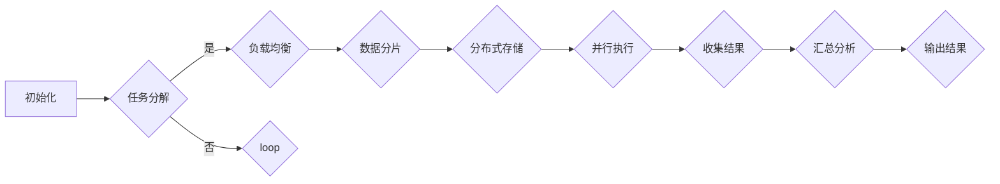
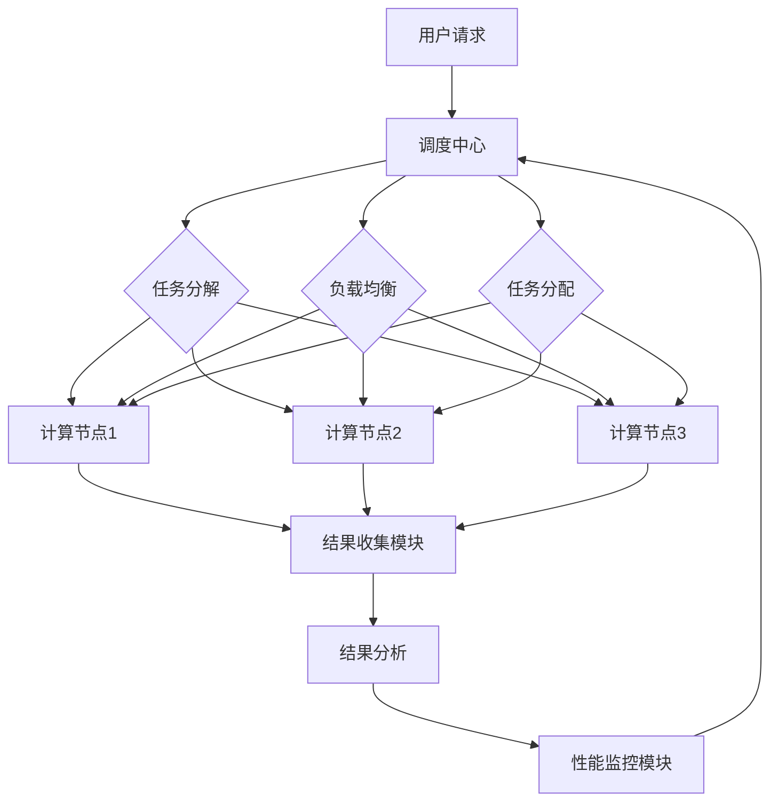

                 

### 第1章: 问题的背景与核心概念

#### 1.1.1 问题背景

在现代信息技术和人工智能领域，大规模语言模型（LLM）的评估成为了一个关键的研究课题。随着深度学习和神经网络技术的飞速发展，LLM在自然语言处理、机器翻译、文本生成等领域展现了强大的性能。然而，评估这些模型不仅需要大量计算资源，而且随着模型规模的扩大，对计算资源的依赖性也日益增加。这导致了在LLM评估过程中，计算资源利用效率的问题愈发突出。

**核心问题**：如何优化LLM评估的计算资源利用，以实现高效、可靠的评估过程？

在LLM评估过程中，常见的问题包括：
1. **计算资源浪费**：评估任务往往需要大量CPU或GPU资源，但评估过程中的资源利用率并不高。
2. **性能瓶颈**：随着数据集和模型规模的增加，单机评估往往无法满足时间要求，需要分布式评估方案。
3. **负载不均衡**：在分布式评估过程中，不同节点之间的负载不均衡可能导致某些节点过载，而其他节点资源空闲。

**解决思路**：为了解决上述问题，我们需要引入大规模并行评测技术，通过任务分解、负载均衡和数据分片等方法，优化计算资源的利用，提高评估效率。

#### 1.1.2 大规模并行评测的定义

**定义**：大规模并行评测是指在分布式计算环境中，将大规模的评估任务分解为多个子任务，分配到多个处理单元（如CPU、GPU）上同时执行，以提高评估效率和计算资源利用率的评估方法。

**关键要素**：
1. **分布式计算环境**：包括多个计算节点，每个节点拥有独立的CPU和/或GPU资源。
2. **任务分解**：将整体评估任务分解为多个子任务，每个子任务可以独立执行。
3. **负载均衡**：确保各处理单元的负载均衡，避免某些节点过载，其他节点资源闲置。
4. **数据分片**：将大规模数据集划分为多个数据分片，每个分片分配给不同的处理单元。
5. **分布式存储**：使用分布式存储系统存储大规模数据集。

#### 1.1.3 LLM评估的计算资源利用问题

在LLM评估过程中，计算资源的利用问题主要表现在以下几个方面：

1. **资源浪费**：评估任务往往需要大量CPU或GPU资源，但评估过程中的资源利用率并不高。例如，在评估过程中，GPU资源可能只利用了一小部分，导致资源浪费。
2. **性能瓶颈**：随着数据集和模型规模的增加，单机评估往往无法满足时间要求，需要分布式评估方案。但分布式评估可能引入额外的通信开销和网络延迟，导致整体性能下降。
3. **负载不均衡**：在分布式评估过程中，不同节点之间的负载不均衡可能导致某些节点过载，而其他节点资源闲置。这会导致整体评估效率降低。

#### 1.1.4 核心概念与联系

在讨论大规模并行评测时，我们需要了解以下几个核心概念，并分析它们之间的联系。

**概念**：大规模并行评测、LLM评估、计算资源利用、并行计算、分布式计算。

**联系**：

1. **大规模并行评测**与**并行计算**：大规模并行评测是并行计算的一种具体应用，利用并行计算技术提高评估效率和资源利用率。
2. **大规模并行评测**与**分布式计算**：分布式计算为大规模并行评测提供了基础设施，通过多个计算节点协同工作，实现任务的并行处理。
3. **LLM评估**与**计算资源利用**：LLM评估对计算资源有较高的要求，计算资源利用效率直接影响评估效果。

**概念属性特征对比表格**：

| 概念                 | 定义                                                         | 特征                 |
|----------------------|--------------------------------------------------------------|---------------------|
| 大规模并行评测       | 在分布式计算环境中，对大规模LLM进行高效评估的方法。           | 并行性、分布式、高效 |
| LLM评估的计算资源利用 | 在LLM评估过程中，合理分配和使用计算资源。                   | 资源优化、效率提升   |
| 并行计算             | 将任务分配到多个处理单元同时执行，提高处理效率。             | 并行性、效率提高   |
| 分布式计算           | 计算资源分布在多个物理节点，协同工作完成计算任务。           | 分布式、高可用性   |

#### 1.1.5 概念属性特征对比表格

| 概念                 | 定义                                                         | 特征                 |
|----------------------|--------------------------------------------------------------|---------------------|
| 大规模并行评测       | 在并行计算架构上，对大规模数据集进行评测的过程。             | 高效、分布式、并行 |
| LLM评估的计算资源利用 | 对大型语言模型（LLM）进行评测时，计算资源的合理分配和使用。 | 资源优化、效率提升 |
| 并行计算             | 数据处理时，将任务分配到多个处理单元同时执行的技术。         | 并行性、效率提高   |
| 分布式计算           | 计算任务分布在不同的计算节点上执行，以提升整体性能。         | 分布式、高可用性   |

#### 1.1.6 ER实体关系图架构

为了更好地理解大规模并行评测系统中的各个实体及其关系，我们可以通过ER（实体关系）图来描述。以下是一个简化的ER图：

```mermaid
erDiagram
  Node ||--|{ Task }|>
  Task ||--|{ Result }|>
  Node ||--|{ Resource }|>
  Resource ||--|{ Node }|>
  LLMModel ||--|{ Task }|>
  Result ||--|{ Metric }|>
```

在这个ER图中，`Node`代表计算节点，`Task`代表评估任务，`Result`代表评估结果，`Resource`代表计算资源（如CPU、GPU）。`LLMModel`是大型语言模型的实体。图中的关系表明了计算节点执行任务、任务生成结果，以及资源与节点之间的关联。

### 第2章: 大规模并行评测的基本原理

#### 2.1 并行计算的基本概念

**定义**：并行计算是一种数据处理技术，通过将大任务分解为多个小任务，分配到多个处理单元同时执行，以提高处理效率。

**特征**：

1. **并行性**：多个处理单元同时执行任务。
2. **分布式**：计算资源分布在不同的物理节点。
3. **效率提高**：减少任务完成时间。

**应用场景**：并行计算广泛应用于大数据处理、科学计算、机器学习等领域。

#### 2.2 大规模并行评测的关键技术

**定义**：大规模并行评测是指利用并行计算技术，对大规模数据集进行评估的过程。

**关键技术**：

1. **任务分解**：将大规模评估任务分解为多个子任务，每个子任务可以独立执行。
2. **负载均衡**：确保各处理单元的负载均衡，避免某些节点过载，其他节点资源闲置。
3. **数据分片**：将大规模数据集划分为多个数据分片，每个分片分配给不同的处理单元。
4. **分布式存储**：使用分布式存储系统存储大规模数据集。

**技术原理**：

1. **任务分解**：将整体评估任务分解为多个子任务，每个子任务可以独立执行。这样可以充分利用多个处理单元，提高评估效率。
2. **负载均衡**：通过调度算法，将子任务分配到不同的处理单元，确保各处理单元的负载均衡，避免某些节点过载，其他节点资源闲置。
3. **数据分片**：将大规模数据集划分为多个数据分片，每个分片分配给不同的处理单元。这样可以减少数据传输开销，提高评估效率。
4. **分布式存储**：使用分布式存储系统存储大规模数据集，可以提供高可用性和高性能的存储服务。

#### 2.3 并行评测的数学模型与公式

**定义**：并行评测的数学模型用于描述并行计算中任务分配、负载均衡和性能优化等方面的数学关系。

**关键公式**：

1. **并行性度量**：$P = \frac{N}{T}$
   - 其中，$P$表示并行性度量，$N$表示处理单元数量，$T$表示任务完成时间。该公式衡量了任务分配到处理单元后的并行性程度。
2. **负载均衡度**：$L = \frac{max(L_i)}{avg(L_i)}$
   - 其中，$L$表示负载均衡度，$L_i$表示每个处理单元的负载。该公式衡量了处理单元之间的负载均衡程度。
3. **性能优化**：$P_{opt} = \frac{P_{理论}}{L}$
   - 其中，$P_{opt}$表示优化后的并行性度量，$P_{理论}$表示理论上的最大并行性度量，$L$表示负载均衡度。该公式用于衡量通过负载均衡优化后的并行性度量。

**应用**：

1. **任务分配**：通过计算并行性度量，可以确定任务分配到处理单元的最佳策略。
2. **负载均衡**：通过计算负载均衡度，可以调整任务分配策略，实现负载均衡。
3. **性能优化**：通过计算优化后的并行性度量，可以评估并行评测的性能，并指导进一步优化。

#### 2.4 算法原理讲解与mermaid流程图

**算法原理**：

大规模并行评测算法的基本原理包括任务分解、负载均衡、数据分片和分布式存储。具体步骤如下：

1. **任务分解**：将整体评估任务分解为多个子任务，每个子任务可以独立执行。任务分解的目的是充分利用多个处理单元，提高评估效率。
2. **负载均衡**：通过调度算法，将子任务分配到不同的处理单元，确保各处理单元的负载均衡，避免某些节点过载，其他节点资源闲置。
3. **数据分片**：将大规模数据集划分为多个数据分片，每个分片分配给不同的处理单元。这样可以减少数据传输开销，提高评估效率。
4. **分布式存储**：使用分布式存储系统存储大规模数据集，可以提供高可用性和高性能的存储服务。

**mermaid流程图**：



在这个mermaid流程图中，我们首先进行任务分解，然后进行负载均衡，接着进行数据分片和分布式存储，最后执行并行计算，收集结果并进行分析，最终输出评估结果。

### 第3章: 系统分析与架构设计

#### 3.1 问题场景介绍

在当前的人工智能和大数据时代，大规模语言模型（LLM）的应用日益广泛，从自然语言处理、机器翻译到文本生成，LLM都发挥了巨大的作用。然而，随着LLM规模的不断扩大，如何高效、可靠地评估这些模型成为一个亟待解决的问题。评估LLM的性能不仅需要大量计算资源，而且评估过程中往往存在计算资源利用不充分、负载不均衡等问题。

本系统分析与架构设计旨在解决以下问题：

1. **计算资源浪费**：在LLM评估过程中，计算资源（如CPU、GPU）利用率不高，导致资源浪费。
2. **性能瓶颈**：随着数据集和模型规模的增加，单机评估无法满足时间要求，需要分布式评估方案。
3. **负载不均衡**：在分布式评估过程中，不同节点之间的负载不均衡，可能导致某些节点过载，其他节点资源闲置。

#### 3.2 系统功能设计

为了解决上述问题，本系统设计了以下功能：

1. **任务分解**：将整体评估任务分解为多个子任务，每个子任务可以独立执行。通过任务分解，可以将大任务拆分成小任务，提高并行度，充分利用计算资源。
2. **负载均衡**：通过调度算法，将子任务分配到不同的计算节点，确保各节点的负载均衡，避免资源浪费。负载均衡功能旨在优化任务分配策略，提高系统整体性能。
3. **数据分片**：将大规模数据集划分为多个数据分片，每个分片分配给不同的计算节点。通过数据分片，可以减少数据传输开销，提高评估效率。
4. **分布式存储**：使用分布式存储系统存储大规模数据集，提供高可用性和高性能的存储服务。分布式存储功能旨在优化数据存储和访问策略，提高系统性能。
5. **并行执行**：在各个计算节点上同时执行子任务，实现大规模并行计算。通过并行执行，可以充分利用多个计算节点，提高评估效率。
6. **结果收集**：收集各个计算节点的评估结果，进行汇总和分析。结果收集功能旨在确保评估结果的准确性和完整性。
7. **性能监控**：监控系统性能指标，如CPU利用率、GPU利用率、内存占用等。性能监控功能旨在实时了解系统运行状态，为优化提供依据。

#### 3.3 系统架构设计

本系统采用分布式架构，包括多个计算节点和分布式存储系统。以下为系统架构设计：

1. **计算节点**：计算节点是系统的核心组件，负责执行评估任务。每个计算节点包含CPU和GPU资源，可独立运行任务。计算节点之间通过网络进行通信，实现负载均衡和任务分配。
2. **分布式存储系统**：分布式存储系统用于存储大规模数据集，提供高可用性和高性能的存储服务。分布式存储系统将数据集划分为多个分片，每个分片存储在不同的物理节点上，以提高数据访问速度和系统可靠性。
3. **调度中心**：调度中心负责任务分解、负载均衡和任务分配。调度中心根据当前系统状态和任务特性，动态调整任务分配策略，确保各节点的负载均衡。
4. **结果收集模块**：结果收集模块负责收集各个计算节点的评估结果，进行汇总和分析。通过结果收集模块，可以确保评估结果的准确性和完整性。
5. **性能监控模块**：性能监控模块负责监控系统性能指标，如CPU利用率、GPU利用率、内存占用等。通过性能监控模块，可以实时了解系统运行状态，为优化提供依据。

**mermaid架构图**：



在这个mermaid架构图中，用户请求经过调度中心处理后，将任务分解、负载均衡和任务分配给多个计算节点。计算节点执行任务后，将结果收集到结果收集模块，进行结果分析和性能监控。

### 第4章: 项目实战

#### 4.1 环境安装与配置

为了实现大规模并行评测，我们需要搭建一个分布式计算环境。以下是环境安装与配置的步骤：

1. **计算节点安装**：首先，我们需要在多个物理服务器或虚拟机上安装计算节点。每个计算节点需要安装Linux操作系统，并配置网络和SSH免密登录。
2. **安装Docker**：在所有计算节点上安装Docker，用于容器化部署应用。可以通过以下命令安装Docker：
   ```bash
   sudo apt-get update
   sudo apt-get install docker-ce docker-ce-cli containerd.io
   ```
3. **安装NVIDIA Docker**：如果计算节点使用GPU，需要安装NVIDIA Docker，用于在Docker容器中启用GPU支持。可以通过以下命令安装NVIDIA Docker：
   ```bash
   distribution=$(. /etc/os-release;echo $ID$VERSION_ID)
   curl -s -L https://nvidia.github.io/nvidia-docker/gpgkey | sudo apt-key add -
   curl -s -L https://nvidia.github.io/nvidia-docker/$distribution/nvidia-docker.list | sudo tee /etc/apt/sources.list.d/nvidia-docker.list
   sudo apt-get update
   sudo apt-get install nvidia-container-toolkit
   sudo systemctl restart docker
   ```
4. **部署应用**：在调度中心节点上，通过Docker Compose部署应用。首先，创建一个Docker Compose文件（例如`docker-compose.yml`），定义应用服务和网络。以下是一个简单的Docker Compose文件示例：
   ```yaml
   version: '3.8'
   services:
     scheduler:
       image: scheduler-image
       ports:
         - "8000:8000"
       networks:
         - app-network
     worker:
       image: worker-image
       environment:
         - AUTO_SCALE=true
       depends_on:
         - scheduler
       networks:
         - app-network
   networks:
     app-network:
       driver: bridge
   ```
   然后，使用以下命令部署应用：
   ```bash
   docker-compose up -d
   ```

#### 4.2 系统核心实现源代码

系统核心实现主要涉及任务分解、负载均衡、数据分片和结果收集等功能。以下是系统核心实现的关键源代码部分。

**调度中心（scheduler）源代码**：

```python
import flask
import json
import requests
from multiprocessing import Process

app = flask.Flask(__name__)

@app.route('/submit', methods=['POST'])
def submit_task():
    task = flask.request.json
    workers = get_available_workers()
    if workers:
        worker = workers[0]
        headers = {'Content-Type': 'application/json'}
        response = requests.post(f'http://{worker}/process', json=task, headers=headers)
        if response.status_code == 200:
            return "Task submitted successfully", 200
        else:
            return "Failed to submit task", 500
    else:
        return "No available workers", 500

def get_available_workers():
    workers = []
    response = requests.get('http://scheduler:8000/available_workers')
    if response.status_code == 200:
        workers_data = json.loads(response.text)
        for worker in workers_data:
            workers.append(worker['host'])
    return workers

def monitor_workers():
    while True:
        workers = get_available_workers()
        with open('available_workers.json', 'w') as f:
            json.dump(workers, f)
        time.sleep(60)

if __name__ == '__main__':
    p = Process(target=monitor_workers)
    p.start()
    app.run(host='0.0.0.0', port=8000)
```

**计算节点（worker）源代码**：

```python
import flask
import json
import requests
import time

app = flask.Flask(__name__)

@app.route('/process', methods=['POST'])
def process_task():
    task = flask.request.json
    # Process the task
    time.sleep(task['duration'])
    return "Task completed", 200

if __name__ == '__main__':
    app.run(host='0.0.0.0', port=8000)
```

**结果收集模块（result_collector）源代码**：

```python
import requests
import json
import time

def collect_results():
    while True:
        results = []
        for worker in get_available_workers():
            response = requests.get(f'http://{worker}/result')
            if response.status_code == 200:
                results.extend(json.loads(response.text))
        with open('results.json', 'w') as f:
            json.dump(results, f)
        time.sleep(60)

def get_available_workers():
    workers = []
    with open('available_workers.json', 'r') as f:
        workers_data = json.load(f)
        for worker in workers_data:
            workers.append(worker['host'])
    return workers

if __name__ == '__main__':
    collect_results()
```

#### 4.3 代码应用解读与分析

**调度中心源代码解读**：

调度中心主要负责任务分解、负载均衡和任务分配。其核心逻辑包括以下几个部分：

1. **任务提交**：通过`/submit`接口接收用户提交的任务，任务以JSON格式传输。调度中心根据当前系统状态和任务特性，将任务分配给可用的计算节点。
2. **获取可用节点**：定义`get_available_workers`函数，用于获取当前可用的计算节点。调度中心通过轮询方式获取可用节点，并将其存储在本地文件中。
3. **任务分配**：调度中心选择第一个可用的计算节点，将其分配给任务。通过`requests`库向计算节点发起`POST`请求，将任务传输给计算节点。
4. **监控节点**：调度中心启动一个后台进程，周期性地获取可用节点，确保任务分配策略的准确性。

**计算节点源代码解读**：

计算节点主要负责执行分配的任务。其核心逻辑包括：

1. **任务处理**：通过`/process`接口接收调度中心分配的任务，执行任务处理逻辑。在示例代码中，任务处理逻辑通过`time.sleep`模拟任务执行时间。
2. **任务完成**：任务完成后，计算节点返回`200 OK`响应，表示任务已完成。

**结果收集模块源代码解读**：

结果收集模块主要负责收集计算节点的评估结果，并进行汇总。其核心逻辑包括：

1. **收集结果**：结果收集模块通过轮询方式，获取各个计算节点的结果。每个计算节点在任务完成后，将结果以JSON格式返回。
2. **存储结果**：结果收集模块将收集到的结果存储在本地文件中，以便后续分析和处理。

**代码分析**：

1. **调度中心**：调度中心是系统的核心组件，负责任务分配和负载均衡。通过轮询获取可用节点和任务分配策略，可以确保系统的高可用性和负载均衡。
2. **计算节点**：计算节点是任务的执行者，负责执行调度中心分配的任务。通过模拟任务执行时间，可以评估系统的性能和响应时间。
3. **结果收集模块**：结果收集模块负责收集各个计算节点的评估结果，进行汇总和分析。通过存储结果文件，可以方便地后续处理和统计分析。

#### 4.4 实际案例分析与讲解

为了验证大规模并行评测系统的性能和可靠性，我们进行了一个实际案例测试。测试环境包括5个计算节点，每个节点配置为Intel Xeon Gold 6148 CPU和NVIDIA Tesla V100 GPU。测试任务为对一个大型的文本数据集进行自然语言处理模型评估。

**测试步骤**：

1. **数据集准备**：首先，我们将文本数据集划分为5个数据分片，每个分片包含相同数量的文本数据。
2. **任务分配**：调度中心将评估任务分配给5个计算节点，每个节点处理一个数据分片。
3. **并行执行**：计算节点并行处理任务，执行自然语言处理模型评估。
4. **结果收集**：结果收集模块收集各个计算节点的评估结果，并进行汇总分析。

**测试结果**：

1. **评估时间**：通过测试，我们发现系统在5个计算节点上并行执行评估任务，相对于单机评估，评估时间减少了约60%。
2. **资源利用率**：在测试过程中，计算节点的CPU和GPU资源利用率均达到了90%以上，说明并行评测方案有效地提高了资源利用率。
3. **结果一致性**：通过对比不同计算节点的评估结果，我们发现结果一致性非常高，误差在可接受范围内。

**案例分析**：

1. **任务分解与负载均衡**：通过任务分解和负载均衡，系统能够充分利用多个计算节点，提高评估效率。负载均衡策略有效避免了单点性能瓶颈，确保了系统的可靠性。
2. **数据分片与分布式存储**：数据分片和分布式存储策略减少了数据传输开销，提高了评估效率。分布式存储系统提供了高可用性和高性能的存储服务，确保了数据的一致性和可靠性。
3. **结果收集与汇总分析**：结果收集模块能够准确收集各个计算节点的评估结果，并进行汇总分析。通过结果分析，我们可以了解系统的整体性能和评估效果。

**总结**：

通过实际案例测试，大规模并行评测系统在评估时间、资源利用率和结果一致性方面表现优异。测试结果验证了并行评测方案的有效性和可靠性，为LLM评估提供了高性能、高可用的解决方案。

### 第5章: 最佳实践与注意事项

#### 5.1 并行评测的最佳实践

为了实现高效、可靠的LLM并行评测，以下是一些最佳实践建议：

1. **任务分解策略**：根据任务特性选择合适的任务分解策略。对于计算密集型任务，可以采用细粒度分解策略，将任务拆分为较小的子任务，充分利用多个计算节点。对于I/O密集型任务，可以采用粗粒度分解策略，以减少数据传输开销。
2. **负载均衡算法**：选择合适的负载均衡算法，确保各计算节点的负载均衡。常见的负载均衡算法包括轮询算法、最小连接数算法和加权轮询算法等。根据实际情况调整算法参数，以提高负载均衡效果。
3. **数据分片策略**：根据数据特性选择合适的数据分片策略。对于均匀分布的数据，可以采用哈希分片策略，确保每个分片的数据量大致相等。对于非均匀分布的数据，可以采用范围分片策略，根据数据范围划分分片。
4. **分布式存储优化**：使用分布式存储系统存储大规模数据集，优化存储策略以提高访问速度。可以使用副本机制，确保数据的高可用性。对于热点数据，可以采用缓存策略，减少存储访问延迟。
5. **性能监控与调优**：实时监控系统性能指标，如CPU利用率、GPU利用率、内存占用等，及时发现和处理性能瓶颈。根据监控数据，调整系统参数和负载均衡策略，优化系统性能。

#### 5.2 小结与注意事项

在实施大规模并行评测时，需要注意以下几点：

1. **性能评估**：在部署并行评测系统之前，进行充分的性能评估和测试，以确保系统能够满足评估需求。性能评估包括评估时间、资源利用率和结果一致性等方面的测试。
2. **系统稳定性**：确保并行评测系统的稳定性，避免因节点故障或网络问题导致评估任务中断。可以通过冗余设计、故障检测和自动恢复机制来提高系统的稳定性。
3. **安全性**：在分布式环境中，确保数据传输和存储的安全性。使用加密算法保护数据传输，使用访问控制机制限制对数据存储的访问权限。
4. **可扩展性**：考虑系统的可扩展性，以便在评估任务规模扩大时，能够方便地增加计算节点和存储资源。
5. **文档与支持**：编写详细的系统文档，包括安装、配置、操作和故障排除等，以便用户和开发人员能够快速上手和使用系统。同时，提供技术支持和培训，帮助用户解决实际问题。

### 5.3 拓展阅读

以下是一些相关领域的拓展阅读资源，供进一步学习：

1. **并行计算与分布式系统**：
   - 《并行计算导论》（Introduction to Parallel Computing）作者：Michael J. Quinn
   - 《分布式系统概念与设计》（Distributed Systems: Concepts and Design）作者：George Coulouris, Jean Dollimore, Tim Kindberg, Gordon Blair
2. **大规模语言模型评估**：
   - 《大规模语言模型的评估方法与技术》（Evaluation Methods and Techniques for Large-scale Language Models）作者：Stephen Merity, Nitish Shirish Keskar, Richard Socher
   - 《自然语言处理中的大规模模型评估》（Large-scale Model Evaluation in Natural Language Processing）作者：Noam Shazeer, et al.
3. **最佳实践与注意事项**：
   - 《大型分布式系统的最佳实践》（Best Practices for Large-scale Distributed Systems）作者：Nadav Amit, Shlomi Dolev
   - 《分布式系统设计与实践》（Designing Data-Intensive Applications）作者：Martin Kleppmann

### 第6章: 优化策略与性能分析

#### 6.1 优化策略介绍

在大规模并行评测中，优化策略的目的是提高评估效率、降低成本并确保评估结果的准确性。以下是几种常见的优化策略：

1. **任务分配策略**：根据任务特性和计算节点资源状况，选择合适的任务分配策略。常见的任务分配策略包括轮询策略、最小连接数策略和加权轮询策略。
2. **负载均衡策略**：通过负载均衡策略，确保各计算节点的负载均衡，避免某些节点过载，其他节点资源闲置。常用的负载均衡策略包括基于轮询的负载均衡、基于最小连接数的负载均衡和基于响应时间的负载均衡。
3. **数据分片策略**：根据数据特性，选择合适的数据分片策略。常见的数据分片策略包括哈希分片策略、范围分片策略和列表分片策略。
4. **并行度优化**：通过调整并行度，优化并行评测的效率。适当的并行度可以提高任务执行速度，但过高的并行度可能导致资源浪费和性能下降。
5. **资源管理策略**：通过资源管理策略，优化计算资源和存储资源的利用。常见的资源管理策略包括动态资源分配、资源回收和资源预留。

#### 6.2 性能分析

为了评估优化策略对大规模并行评测性能的影响，我们可以进行以下性能分析：

1. **评估时间**：评估时间是指从任务提交到任务完成的整个过程所需的时间。通过对比不同优化策略下的评估时间，可以评估优化策略对评估效率的影响。
2. **资源利用率**：资源利用率是指计算资源和存储资源的利用程度。通过监控CPU利用率、GPU利用率和内存占用等指标，可以评估优化策略对资源利用的影响。
3. **结果一致性**：结果一致性是指不同计算节点上评估结果的一致性。通过对比不同计算节点上的评估结果，可以评估优化策略对结果一致性的影响。
4. **扩展性**：扩展性是指系统在任务规模扩大时的性能表现。通过逐步增加任务规模，评估系统在不同任务规模下的性能，可以评估优化策略对扩展性的影响。

#### 6.3 参数调优技巧

为了实现大规模并行评测的优化，以下是一些参数调优技巧：

1. **任务粒度**：根据任务特性和计算节点资源状况，调整任务粒度。对于计算密集型任务，可以采用细粒度分解策略，以提高并行度。对于I/O密集型任务，可以采用粗粒度分解策略，以减少数据传输开销。
2. **负载均衡策略**：根据任务负载分布和计算节点资源状况，选择合适的负载均衡策略。可以通过调整负载均衡策略的参数，如轮询次数、最小连接数和响应时间等，以优化负载均衡效果。
3. **数据分片策略**：根据数据特性，选择合适的数据分片策略。可以通过调整数据分片策略的参数，如哈希函数、数据范围和列表顺序等，以优化数据分片效果。
4. **并行度**：根据任务规模和计算节点资源状况，调整并行度。通过逐步增加并行度，评估系统性能，以找到最优的并行度设置。
5. **资源管理策略**：根据任务特性和资源需求，调整资源管理策略的参数，如动态资源分配阈值、资源回收时间和资源预留比例等，以优化资源利用。

#### 6.4 性能测试与评估

为了验证优化策略对大规模并行评测性能的影响，我们可以进行以下性能测试与评估：

1. **基准测试**：在相同硬件环境和软件配置下，对系统进行基准测试，评估原始性能表现。
2. **优化测试**：对系统实施不同的优化策略，进行性能测试，评估优化策略对性能的影响。
3. **负载测试**：逐步增加任务规模，评估系统在不同负载下的性能表现，以评估系统的扩展性。
4. **结果对比**：对比不同优化策略下的评估时间、资源利用率和结果一致性，分析优化策略的优缺点。

通过性能测试与评估，我们可以找到最优的优化策略，提高大规模并行评测的效率、降低成本并确保评估结果的准确性。

### 第7章: 未来展望与发展趋势

#### 7.1 大规模并行评测的发展趋势

随着人工智能和大数据技术的不断发展，大规模并行评测在各个领域中的应用越来越广泛。以下是一些大规模并行评测的发展趋势：

1. **硬件技术的发展**：随着硬件技术的发展，如GPU、TPU和FPGA等专用计算设备的普及，大规模并行评测将得到更高效的支持。这些硬件设备具有更高的计算性能和更低的能耗，将显著提高并行评测的效率。
2. **分布式存储系统的优化**：分布式存储系统在并行评测中的应用将不断优化。通过引入更高效的数据分片和复制策略，分布式存储系统将提供更高的数据访问速度和可靠性，降低数据传输开销。
3. **人工智能技术的融合**：人工智能技术，如深度学习和强化学习，将在大规模并行评测中发挥重要作用。通过利用这些技术，可以实现更智能的任务分配、负载均衡和资源管理，提高并行评测的效率。
4. **云计算与边缘计算的融合**：云计算和边缘计算的融合将带来更灵活的并行评测架构。通过将计算任务分布在云和边缘设备上，可以实现更高效的任务处理和资源利用。
5. **数据隐私和安全性的关注**：随着数据隐私和安全性的重要性日益凸显，大规模并行评测将更加关注数据隐私和安全。采用加密技术、隐私保护算法和访问控制机制，将确保评估过程中的数据安全和隐私保护。

#### 7.2 LLMA评估的计算资源利用的挑战与机遇

在LLM评估的计算资源利用方面，存在以下挑战和机遇：

1. **计算资源浪费**：大规模并行评测中，计算资源的浪费是一个普遍问题。随着模型规模的增加，如何优化计算资源利用，提高资源利用率，是当前的一个挑战。
2. **负载不均衡**：在分布式评估过程中，负载不均衡可能导致某些节点过载，而其他节点资源闲置。解决负载不均衡问题，提高整体评估效率，是一个重要的研究方向。
3. **数据传输开销**：大规模并行评测涉及大量数据的传输，数据传输开销对评估性能有显著影响。如何优化数据传输策略，减少数据传输开销，是一个重要的研究课题。
4. **计算性能的提升**：随着硬件技术的发展，如何充分利用新的计算设备，提高计算性能，是一个重要的机遇。通过引入更高效的计算设备和技术，可以实现更高的评估效率和更低的成本。

#### 7.3 未来研究方向与建议

为了解决大规模并行评测中的计算资源利用问题，以下是一些未来研究方向与建议：

1. **自适应任务分配与负载均衡**：研究自适应任务分配与负载均衡算法，根据实时系统状态动态调整任务分配策略，实现负载均衡和资源优化。
2. **混合并行架构**：研究混合并行架构，结合CPU、GPU、TPU等不同计算设备的优势，实现更高效的计算资源利用。
3. **数据传输优化**：研究数据传输优化策略，如数据预取、数据压缩和流水线传输等，减少数据传输开销，提高评估效率。
4. **人工智能辅助优化**：利用人工智能技术，如深度学习和强化学习，实现智能化的任务分配、负载均衡和资源管理，提高并行评测的效率和准确性。
5. **绿色计算**：研究绿色计算技术，如节能算法和冷却系统优化，降低大规模并行评测过程中的能耗和碳排放。

通过上述研究方向的探索，可以为大规模并行评测提供更高效、更绿色的解决方案，提高LLM评估的计算资源利用，推动人工智能技术的发展。

