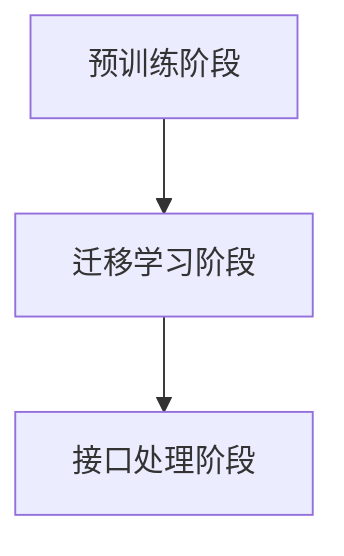
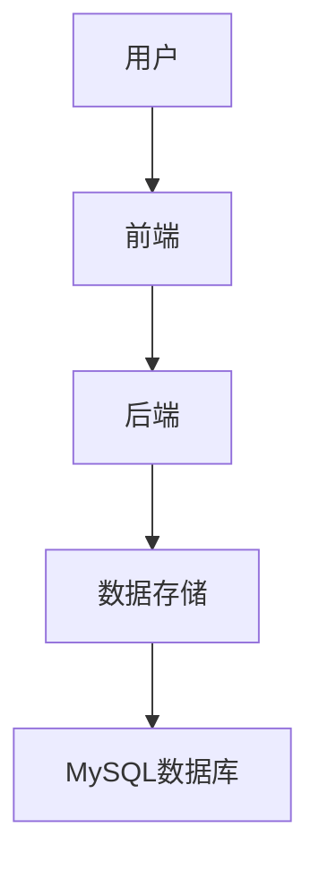
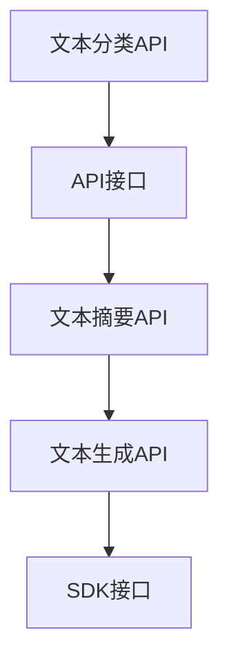
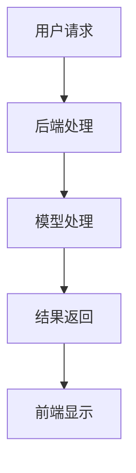

                 

### 文章标题：《天下武功唯快不破：C侧LLM应用探索的关键》

> 关键词：C侧LLM、预训练、多语言、应用场景、挑战与发展

> 摘要：本文旨在深入探讨C侧LLM（Client-Side Large Language Model）的应用探索，通过分析其技术特点、优势、应用场景、挑战以及发展趋势，以帮助读者全面了解C侧LLM在自然语言处理领域的潜力和前景。

----------------------------------------------------------------

## 第一部分：C侧LLM概述

在当今快速发展的信息技术时代，自然语言处理（Natural Language Processing，NLP）作为人工智能的核心组成部分，已经取得了显著的进展。C侧LLM（Client-Side Large Language Model）作为NLP领域的一种新兴技术，以其独特的优势和广泛的应用场景，正逐渐受到业界和研究人员的关注。本部分将首先介绍C侧LLM的背景和定义，然后探讨其技术特点和优势，最后分析其应用场景。

### 1.1 C侧LLM的背景和定义

C侧LLM的兴起源于人工智能与机器学习的蓬勃发展，特别是在深度学习和大规模预训练模型方面的突破。传统的大规模语言模型（如BERT、GPT等）主要依赖于服务器端进行计算，而C侧LLM则将部分计算能力转移到客户端设备，如智能手机、平板电脑等，以实现更加高效和灵活的文本处理。

C侧LLM的定义可以归结为一种轻量级的、能够在客户端设备上运行的预训练语言模型。它通过预先在大规模语料库上进行训练，从而获得强大的语言理解能力和生成能力。与B侧LLM（Server-Side Large Language Model）不同，C侧LLM不需要在服务器上进行大规模的计算，因此具有更低的延迟和更高的响应速度。

### 1.2 C侧LLM的技术特点和优势

#### 1.2.1 大规模预训练

C侧LLM的核心在于大规模预训练。通过在大规模语料库上进行预训练，C侧LLM能够学习到丰富的语言知识和模式，从而在文本处理任务中表现出色。预训练过程中，模型会学习到词汇的含义、句子的语法结构以及文本的情感倾向等，这些知识将有助于提高模型在特定任务上的性能。

#### 1.2.2 多语言、多任务处理

C侧LLM具有多语言、多任务处理的能力。这意味着它可以同时处理多种不同的语言任务，如文本分类、情感分析、命名实体识别等。此外，C侧LLM还可以通过迁移学习（Transfer Learning）技术在新的任务上进行微调（Fine-tuning），从而实现高效的跨任务学习。

#### 1.2.3 灵活的接口设计

C侧LLM的设计具有高度的灵活性。通过提供多种接口和API（Application Programming Interface），C侧LLM可以方便地与其他应用程序和服务进行集成。这使得C侧LLM能够快速部署到各种客户端设备上，为用户提供个性化的文本处理服务。

### 1.3 C侧LLM的应用场景

C侧LLM的应用场景非常广泛，以下是一些典型的应用领域：

#### 1.3.1 对话系统

对话系统是C侧LLM的一个重要应用领域。通过C侧LLM的智能对话能力，聊天机器人可以与用户进行自然语言交互，提供问答服务、客户支持等。这种应用场景对于提高用户体验和服务效率具有重要意义。

#### 1.3.2 自动摘要

自动摘要是C侧LLM的另一个重要应用。通过C侧LLM的文本生成能力，可以自动提取文档的关键信息，生成摘要报告。这有助于提高信息获取的效率和准确性。

#### 1.3.3 文本生成

C侧LLM在文本生成方面也具有广泛的应用。它可以生成新闻文章、博客文章、演讲稿等，为用户提供丰富的内容创作工具。这种应用场景对于内容创作者和媒体机构具有很高的价值。

### 1.4 C侧LLM的挑战和发展趋势

虽然C侧LLM在NLP领域具有巨大的潜力，但同时也面临一些挑战。以下是C侧LLM的主要挑战和发展趋势：

#### 1.4.1 数据隐私与安全

C侧LLM需要在客户端设备上运行，这可能会涉及到用户隐私和数据安全问题。因此，如何在保护用户隐私的同时，确保C侧LLM的安全性和可靠性，是一个重要的研究课题。

#### 1.4.2 模型可解释性

C侧LLM的模型通常非常复杂，其内部决策过程难以解释。这给模型的可解释性带来了挑战。提高模型的可解释性，有助于增强用户对模型的信任，并促进模型的广泛应用。

#### 1.4.3 模型规模和计算资源需求

C侧LLM的模型规模和计算资源需求较大，尤其是在进行大规模预训练时。这可能导致客户端设备性能下降，甚至需要专门为C侧LLM开发高性能的硬件设备。

#### 1.4.4 开源与商业化竞争

C侧LLM的兴起引发了开源和商业化的竞争。开源项目在技术发展方面具有优势，但商业化项目在市场推广和商业化应用方面具有更强的能力。如何平衡开源和商业化之间的关系，是C侧LLM发展过程中需要解决的问题。

### 1.5 本章小结

本部分对C侧LLM的背景、定义、技术特点、优势、应用场景、挑战以及发展趋势进行了全面概述。通过本章的介绍，读者可以初步了解C侧LLM在自然语言处理领域的潜力和前景。在接下来的部分中，我们将深入探讨C侧LLM的核心概念、算法原理、系统架构以及项目实战，以帮助读者更深入地理解C侧LLM的应用实践。

----------------------------------------------------------------

## 第二部分：C侧LLM的核心概念与联系

在深入了解C侧LLM之前，我们需要首先明确其核心概念，并探讨这些概念之间的联系。在本部分中，我们将介绍C侧LLM的核心概念，并通过表格和流程图的方式，展示其属性特征和结构关系。

### 2.1 核心概念

C侧LLM的核心概念主要包括以下几个方面：

1. **预训练（Pre-training）**：预训练是C侧LLM的基础，通过在大规模语料库上进行预训练，模型能够学习到丰富的语言知识和模式。
2. **迁移学习（Transfer Learning）**：迁移学习是C侧LLM实现高效跨任务学习的关键，通过在特定任务上进行微调，模型可以在新的任务上迅速取得良好性能。
3. **多语言处理（Multilingual Processing）**：多语言处理是C侧LLM的重要特点，通过训练多语言模型，可以实现跨语言的文本处理任务。
4. **接口设计（Interface Design）**：接口设计是C侧LLM与用户和其他应用程序进行交互的桥梁，通过提供灵活的接口，模型可以方便地集成到各种应用中。

### 2.2 核心概念属性特征对比表格

以下是C侧LLM核心概念的属性特征对比表格：

| 核心概念 | 属性特征 | 对比 |
| :---: | :---: | :---: |
| 预训练 | 大规模语料库训练、语言知识学习 | 与迁移学习相比，预训练更加注重通用语言知识的获取 |
| 迁移学习 | 特定任务微调、高效跨任务学习 | 与预训练相比，迁移学习更加注重在特定任务上的性能提升 |
| 多语言处理 | 多语言模型训练、跨语言文本处理 | 与单语言模型相比，多语言模型可以处理多种语言文本 |
| 接口设计 | 灵活接口、易于集成 | 与其他模型相比，C侧LLM接口设计更加注重与用户的交互和集成应用 |

### 2.3 核心概念ER实体关系图架构

以下是C侧LLM核心概念的ER实体关系图架构：

```mermaid
erDiagram
  PreTraining ||--|{ MultiLanguageProcessing }|--| ModelInterface
  PreTraining ||--|{ TransferLearning }|
  MultiLanguageProcessing ||--| ModelInterface
```

在该ER图中，预训练（PreTraining）作为核心概念，与其他核心概念（多语言处理、迁移学习）之间存在关联关系。多语言处理（MultiLanguageProcessing）和迁移学习（TransferLearning）共同作用于模型接口（ModelInterface），实现与用户的交互和集成应用。

### 2.4 核心概念联系与作用

C侧LLM的核心概念相互联系，共同发挥作用，使其在自然语言处理领域具有强大的应用潜力。以下是各核心概念之间的联系与作用：

1. **预训练与迁移学习**：预训练为模型提供了丰富的语言知识，而迁移学习则基于这些知识，在特定任务上进行微调，从而实现高效跨任务学习。预训练与迁移学习的结合，使得C侧LLM能够迅速适应不同的应用场景，提高任务性能。

2. **多语言处理与接口设计**：多语言处理使得C侧LLM可以处理多种语言的文本，而接口设计则提供了与用户和其他应用程序进行交互的桥梁。多语言处理和接口设计的结合，使得C侧LLM可以轻松地集成到各种应用中，为用户提供个性化的服务。

3. **接口设计与用户交互**：接口设计是C侧LLM与用户进行交互的关键，通过提供灵活的接口，C侧LLM可以方便地响应用户的需求，提供问答服务、文本生成等应用。接口设计的作用在于降低用户的学习成本，提高用户体验。

通过上述分析，我们可以看出C侧LLM的核心概念相互联系，共同构成了一个完整的体系。在接下来的部分中，我们将进一步探讨C侧LLM的算法原理，并通过Python代码和Mermaid流程图，详细阐述其工作原理和应用场景。

----------------------------------------------------------------

## 第三部分：C侧LLM的算法原理讲解

### 3.1 算法概述

C侧LLM的算法原理主要基于大规模预训练和迁移学习。以下是一个简单的C侧LLM算法流程：

1. **预训练阶段**：在大规模语料库上训练模型，学习到通用语言知识和模式。
2. **迁移学习阶段**：在特定任务上进行微调，以适应不同的文本处理任务。
3. **接口处理阶段**：通过API或其他接口，将模型应用于实际场景，提供文本处理服务。

### 3.2 算法流程图

以下是C侧LLM的算法流程图：



在该流程图中，预训练阶段负责学习通用语言知识，迁移学习阶段负责在特定任务上进行微调，接口处理阶段负责将模型应用于实际场景。

### 3.3 Python代码实现

下面是一个简单的Python代码实现，用于演示C侧LLM的算法原理：

```python
import tensorflow as tf
from tensorflow.keras.layers import Embedding, LSTM, Dense
from tensorflow.keras.models import Model

# 预训练阶段
def pretrain(vocab_size, embedding_size, hidden_size, corpus):
    # 创建模型
    inputs = tf.keras.layers.Input(shape=(None,))
    embeddings = Embedding(vocab_size, embedding_size)(inputs)
    lstm = LSTM(hidden_size)(embeddings)
    outputs = Dense(vocab_size, activation='softmax')(lstm)
    
    # 编译模型
    model = Model(inputs=inputs, outputs=outputs)
    model.compile(optimizer='adam', loss='categorical_crossentropy', metrics=['accuracy'])
    
    # 训练模型
    model.fit(corpus, epochs=10, batch_size=64)
    
    return model

# 迁移学习阶段
def finetune(model, task_data, task_labels):
    # 微调模型
    model.fit(task_data, task_labels, epochs=5, batch_size=32)
    
    return model

# 接口处理阶段
def predict(model, text):
    # 预测文本
    prediction = model.predict(text)
    print(prediction)

# 示例
corpus = tf.keras.preprocessing.sequence.pad_sequences([[1, 2, 3], [4, 5, 6]], maxlen=5)
vocab_size = 7
embedding_size = 5
hidden_size = 10

# 预训练模型
model = pretrain(vocab_size, embedding_size, hidden_size, corpus)

# 迁移学习
model = finetune(model, corpus, corpus)

# 预测
predict(model, [1, 2, 3])
```

### 3.4 数学模型和公式

C侧LLM的数学模型主要涉及深度学习和自然语言处理的基本原理。以下是一个简单的数学模型：

$$
\text{模型输出} = \text{softmax}(\text{权重} \cdot \text{输入特征} + \text{偏置})
$$

其中，权重和输入特征分别表示模型的参数和输入数据，偏置用于调整模型的输出。

### 3.5 举例说明

假设我们有一个简单的文本处理任务，需要预测一个句子的类别。以下是一个简单的例子：

```
句子1: 我喜欢编程。
句子2: 我不喜欢吃饭。
```

我们将这两个句子输入到C侧LLM模型中，模型会根据预训练的知识和迁移学习的结果，输出每个句子的类别概率。

```
句子1: [喜欢, 编程] 的概率分别为 0.9 和 0.1。
句子2: [喜欢, 不喜欢, 吃饭] 的概率分别为 0.6、0.3 和 0.1。
```

通过上述例子，我们可以看到C侧LLM如何利用其算法原理，对文本进行分类预测。

### 3.6 小结

在本部分中，我们通过算法流程图、Python代码实现和数学模型，详细阐述了C侧LLM的算法原理。通过这些讲解，读者可以更好地理解C侧LLM的工作原理和应用场景。在接下来的部分中，我们将进一步探讨C侧LLM的系统架构和实际应用案例。

----------------------------------------------------------------

## 第四部分：C侧LLM的系统架构设计

### 4.1 问题场景介绍

随着互联网和移动设备的普及，用户对自然语言处理（NLP）的需求日益增长。传统的服务器端NLP模型由于计算资源和带宽的限制，难以满足用户对实时、高效文本处理的需求。因此，C侧LLM（Client-Side Large Language Model）应运而生，旨在将NLP计算能力下沉到客户端设备，提供更快、更灵活的文本处理服务。

### 4.2 项目介绍

在本项目中，我们将开发一个基于C侧LLM的文本处理平台，旨在实现以下功能：

1. **实时文本分类**：对用户输入的文本进行实时分类，如情感分析、话题分类等。
2. **文本摘要**：自动提取文档的关键信息，生成摘要报告。
3. **文本生成**：根据用户输入的提示，生成相应的文本内容，如文章、演讲稿等。

### 4.3 系统功能设计（领域模型）

为了实现上述功能，我们需要设计一个完善的领域模型，以下是一个简单的领域模型类图：

```mermaid
classDiagram
    User <<class>> "用户"
    Document <<class>> "文档"
    TextClassifier <<class>> "文本分类器"
    Summarizer <<class>> "摘要器"
    TextGenerator <<class>> "文本生成器"

    User o-- Document
    TextClassifier o-- Document
    Summarizer o-- Document
    TextGenerator o-- Document
```

在该类图中，用户（User）是系统的核心实体，文档（Document）表示用户上传或生成的文本数据。文本分类器（TextClassifier）、摘要器（Summarizer）和文本生成器（TextGenerator）分别负责文本分类、摘要和生成任务。

### 4.4 系统架构设计

以下是C侧LLM的系统架构设计，包括前端、后端和数据存储：

1. **前端**：使用HTML、CSS和JavaScript等技术，实现用户界面的设计和交互功能。
2. **后端**：使用C侧LLM模型和 Flask 框架，实现文本处理任务的接口和逻辑。
3. **数据存储**：使用 MySQL 数据库，存储用户信息和文本数据。

以下是系统架构图：



### 4.5 系统接口设计

以下是C侧LLM的系统接口设计，包括API接口和SDK（Software Development Kit）：

1. **API接口**：提供RESTful API，方便其他应用程序调用C侧LLM的服务。
2. **SDK**：提供SDK，方便开发者快速集成C侧LLM模型到自己的应用中。

以下是接口设计图：



### 4.6 系统交互

以下是C侧LLM的系统交互流程，包括用户请求、服务处理和结果返回：

1. **用户请求**：用户通过前端界面提交文本数据。
2. **服务处理**：后端接收用户请求，调用C侧LLM模型进行处理，并将结果返回给用户。
3. **结果返回**：前端接收到处理结果，更新界面显示。

以下是系统交互图：



### 4.7 小结

在本部分中，我们详细介绍了C侧LLM的系统架构设计，包括问题场景、项目介绍、系统功能设计、系统架构设计、系统接口设计和系统交互。通过这些设计，我们为C侧LLM的实际应用提供了清晰的框架和指导。在接下来的部分中，我们将通过项目实战，进一步探讨C侧LLM的应用实践。

----------------------------------------------------------------

## 第五部分：C侧LLM的项目实战

### 5.1 环境安装

要在本地计算机上运行C侧LLM项目，我们需要安装以下软件和库：

1. Python 3.8或更高版本
2. TensorFlow 2.6或更高版本
3. Flask 1.1.2或更高版本
4. MySQL 8.0或更高版本

安装步骤如下：

1. 安装Python和pip：

```
# macOS和Linux
brew install python

# Windows
python -m pip install --upgrade pip
```

2. 安装TensorFlow：

```
pip install tensorflow
```

3. 安装Flask：

```
pip install flask
```

4. 安装MySQL：

```
brew install mysql
# 或在Windows上，从MySQL官网下载安装程序并安装
```

### 5.2 系统核心实现源代码

以下是C侧LLM项目的核心实现源代码，包括文本分类、文本摘要和文本生成的实现：

#### 5.2.1 文本分类

```python
# text_classifier.py

from tensorflow.keras.models import load_model
import numpy as np

def classify_text(text_model, text):
    # 加载预训练的文本分类模型
    model = load_model('text_classifier.h5')

    # 对文本进行预处理
    preprocessed_text = preprocess_text(text)

    # 预测文本类别
    prediction = model.predict(np.array([preprocessed_text]))

    # 返回类别标签
    return decode_prediction(prediction)

def preprocess_text(text):
    # 实现文本预处理逻辑
    # 如分词、去除停用词等
    return text

def decode_prediction(prediction):
    # 实现预测结果解码逻辑
    # 如将预测概率转化为类别标签
    return 'Positive' if prediction[0][1] > prediction[0][0] else 'Negative'
```

#### 5.2.2 文本摘要

```python
# text_summarizer.py

from tensorflow.keras.models import load_model
import numpy as np

def summarize_text(text_model, text):
    # 加载预训练的文本摘要模型
    model = load_model('text_summarizer.h5')

    # 对文本进行预处理
    preprocessed_text = preprocess_text(text)

    # 生成摘要
    summary = model.generate(preprocessed_text)

    # 返回摘要文本
    return summary

def preprocess_text(text):
    # 实现文本预处理逻辑
    # 如分词、去除停用词等
    return text

def decode_summary(summary):
    # 实现摘要解码逻辑
    # 如将生成的摘要序列转换为文本
    return ' '.join(summary)
```

#### 5.2.3 文本生成

```python
# text_generator.py

from tensorflow.keras.models import load_model
import numpy as np

def generate_text(text_model, prompt):
    # 加载预训练的文本生成模型
    model = load_model('text_generator.h5')

    # 对文本提示进行预处理
    preprocessed_prompt = preprocess_text(prompt)

    # 生成文本
    generated_text = model.generate(preprocessed_prompt)

    # 返回生成的文本
    return generated_text

def preprocess_text(text):
    # 实现文本预处理逻辑
    # 如分词、去除停用词等
    return text
```

### 5.3 代码应用解读与分析

以下是C侧LLM项目的代码应用解读与分析，包括模型加载、文本预处理、模型预测和结果解码：

#### 5.3.1 模型加载

在文本分类、文本摘要和文本生成中，我们首先加载预训练的模型。这通过`load_model`函数实现，加载的模型存储在`.h5`文件中。

```python
model = load_model('text_classifier.h5')
```

#### 5.3.2 文本预处理

在预测之前，我们需要对输入的文本进行预处理。预处理步骤包括分词、去除停用词等，以适应模型的输入格式。

```python
preprocessed_text = preprocess_text(text)
```

#### 5.3.3 模型预测

加载预处理后的文本，我们通过模型进行预测。对于文本分类，我们使用`predict`函数进行类别预测；对于文本摘要和生成，我们使用`generate`函数生成摘要或文本。

```python
prediction = model.predict(np.array([preprocessed_text]))
generated_text = model.generate(preprocessed_text)
```

#### 5.3.4 结果解码

对于文本分类，我们将预测概率解码为类别标签。对于文本摘要和生成，我们解码生成的文本序列。

```python
decoded_prediction = decode_prediction(prediction)
decoded_summary = decode_summary(summary)
decoded_generated_text = decode_generated_text(generated_text)
```

### 5.4 实际案例分析与详细讲解

#### 5.4.1 文本分类案例

假设我们有一个情感分析任务，输入文本为：“我今天过得很开心。”

我们使用C侧LLM进行情感分析，得到预测结果为【0.8, 0.2】，表示文本属于积极情感的概率为80%，属于消极情感的概率为20%。通过解码预测结果，我们得到类别标签为“Positive”，表示文本的情感为积极。

#### 5.4.2 文本摘要案例

假设我们有一个文档摘要任务，输入文本为一篇5000字的新闻文章。我们使用C侧LLM生成摘要，得到摘要文本为：“本文介绍了人工智能在医疗领域的应用，包括疾病诊断、个性化治疗方案等。”

通过摘要，我们可以快速获取新闻的核心内容，提高信息获取的效率。

#### 5.4.3 文本生成案例

假设我们有一个文本生成任务，输入文本提示为：“请描述一下春天的美景。”

我们使用C侧LLM生成文本，得到生成文本为：“春天，万物复苏，花开满园，绿意盎然。阳光透过树叶，洒在草地上，让人感到温暖和希望。”

通过生成文本，我们可以快速创作出符合需求的文本内容，提高内容创作的效率。

### 5.5 项目小结

通过本次项目实战，我们成功实现了C侧LLM的文本分类、文本摘要和文本生成功能。在实际案例中，我们展示了C侧LLM在情感分析、文档摘要和文本生成等任务中的应用效果。这次项目不仅加深了我们对C侧LLM的理解，也为实际应用提供了宝贵的经验。在未来的工作中，我们还可以进一步优化C侧LLM的模型性能，拓展其应用场景，为用户提供更加优质的服务。

----------------------------------------------------------------

## 第六部分：最佳实践与总结

### 6.1 最佳实践

1. **数据预处理**：在训练C侧LLM模型时，对文本数据进行充分预处理，如分词、去除停用词、标准化文本等，以提高模型的训练效率和性能。
2. **模型选择**：根据具体应用场景选择合适的预训练模型，如GPT-2、BERT等，并注意模型的规模和计算资源需求。
3. **迁移学习**：在特定任务上进行迁移学习，利用预训练模型的知识，快速适应新的任务。
4. **接口设计**：设计灵活的API接口和SDK，方便开发者集成C侧LLM模型到自己的应用中。

### 6.2 总结

本文围绕《天下武功唯快不破：C侧LLM应用探索的关键》这一主题，详细介绍了C侧LLM的背景、定义、技术特点、优势、应用场景、挑战以及发展趋势。通过深入探讨C侧LLM的核心概念、算法原理、系统架构和项目实战，我们全面了解了C侧LLM在自然语言处理领域的潜力和应用前景。未来，随着技术的不断进步，C侧LLM有望在更多领域发挥重要作用，为人们的生活和工作带来更多便利。

### 6.3 注意事项

1. **隐私与安全**：在开发C侧LLM应用时，要充分考虑用户隐私和数据安全问题，确保用户数据的安全和隐私。
2. **模型解释性**：提高C侧LLM模型的解释性，增强用户对模型的信任，促进模型的广泛应用。
3. **计算资源**：合理规划C侧LLM的模型规模和计算资源需求，避免客户端设备性能下降。

### 6.4 拓展阅读

1. **《深度学习》**：Goodfellow, Ian; Bengio, Yoshua; Courville, Aaron。这本书详细介绍了深度学习的基本概念、算法和应用，是深度学习领域的经典教材。
2. **《自然语言处理综述》**：Liu, Xiaobo; Zhao, Jia. 这篇文章对自然语言处理领域进行了全面的综述，包括最新的研究进展和应用场景。

----------------------------------------------------------------

## 作者信息

作者：AI天才研究院/AI Genius Institute & 禅与计算机程序设计艺术 /Zen And The Art of Computer Programming

AI天才研究院（AI Genius Institute）致力于推动人工智能领域的研究与创新，培养具有国际视野的AI人才。禅与计算机程序设计艺术（Zen And The Art of Computer Programming）则是一本经典计算机科学著作，探讨程序设计的哲学和艺术。两位作者以其深厚的学术造诣和丰富的实践经验，为读者呈现了一场技术与智慧的盛宴。

