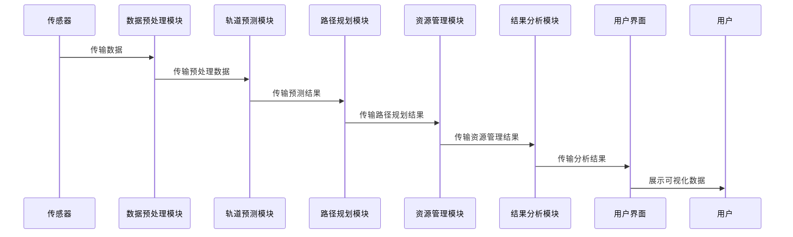
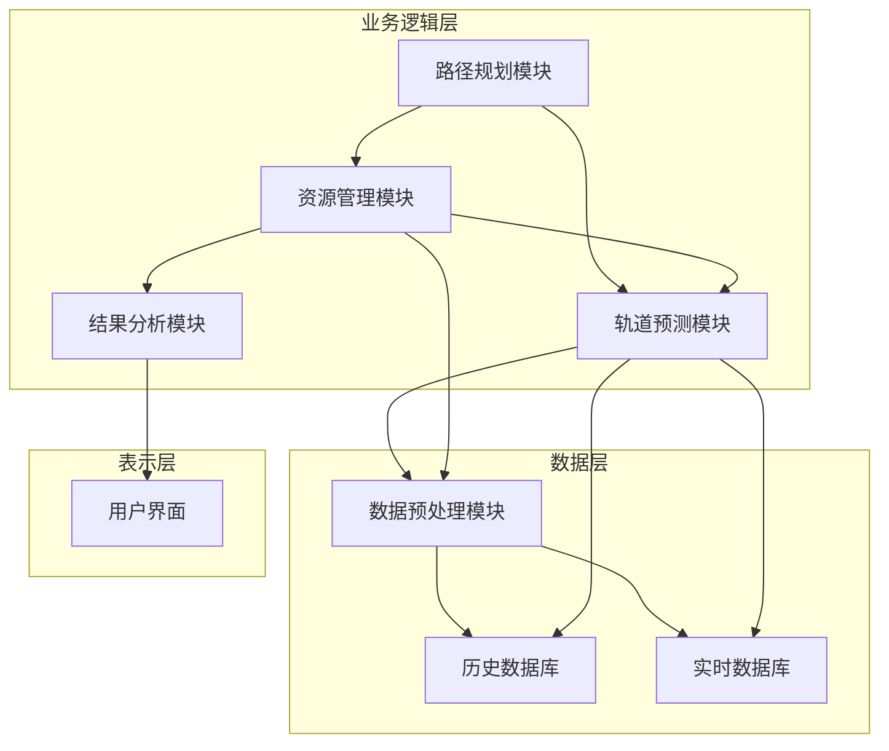
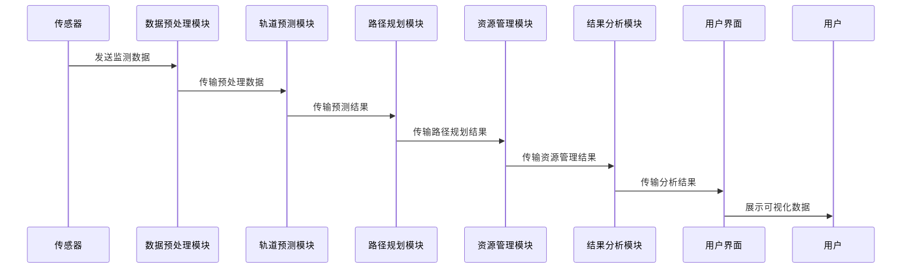

                 

### 太空垃圾的轨道预测：空间清理的数学规划

> 关键词：太空垃圾、轨道预测、数学规划、空间清理、算法原理、系统设计、项目实战

在现代社会，太空探索和技术发展的步伐日益加快，然而随之而来的是太空垃圾问题日益严峻。这些废弃的火箭、卫星残骸和微小碎片不仅威胁着航天器的安全，还可能对地球轨道环境造成长期破坏。因此，有效管理和清理太空垃圾成为了一个紧迫而重要的任务。本文将深入探讨太空垃圾的轨道预测技术，并探讨如何利用数学规划方法来实现空间清理。

#### 摘要

本文首先介绍了太空垃圾的背景和问题，接着详细解析了轨道预测的核心概念和数学模型，然后阐述了数学规划技术在空间清理中的应用，并设计了一套系统架构用于轨道预测和清理项目。通过实际项目实战和案例分析，本文展示了轨道预测和数学规划技术的实际应用效果，并提出了最佳实践策略。

### 目录

#### 第一部分：背景与基础理论

1. **太空垃圾问题概述**
   - 1.1 太空垃圾的定义与分类
   - 1.2 太空垃圾的问题与影响
   - 1.3 太空垃圾治理的挑战

2. **轨道预测核心概念**
   - 2.1 轨道预测的重要性
   - 2.2 核心概念与联系
     - 2.2.1 轨道力学原理
     - 2.2.2 传感器数据预处理
   - 2.3 轨道预测的数学模型与公式
     - 2.3.1 卫星轨道动力学模型
     - 2.3.2 数值积分方法
     - 2.3.3 误差分析

#### 第二部分：轨道预测方法

3. **轨道预测算法**
   - 3.1 经典轨道预测算法
     - 3.1.1 牛顿-拉格朗日法
     - 3.1.2 牛顿迭代法
     - 3.1.3 卡尔丹公式
   - 3.2 现代轨道预测算法
     - 3.2.1 卡门积分法
     - 3.2.2 马尔可夫预测模型
     - 3.2.3 贝叶斯网络预测

#### 第三部分：数学规划技术

4. **数学规划基础**
   - 4.1 数学规划的定义与分类
   - 4.2 目标函数与约束条件
   - 4.3 线性规划与非线性规划

5. **空间清理的数学规划应用**
   - 5.1 数学规划在太空垃圾清理中的应用
   - 5.2 优化算法的选择
     - 5.2.1 模拟退火算法
     - 5.2.2 遗传算法
     - 5.2.3 鲍姆-沃尔夫算法

#### 第四部分：系统设计与分析

6. **系统功能设计**
   - 6.1 系统功能需求分析
   - 6.2 领域模型设计
   - 6.3 数据流设计

7. **系统架构设计**
   - 7.1 系统架构概述
   - 7.2 系统架构设计
   - 7.3 系统接口设计

8. **系统交互分析**
   - 8.1 系统交互流程
   - 8.2 系统交互序列图

#### 第五部分：项目实战与案例分析

9. **轨道预测项目实战**
   - 9.1 项目环境安装
   - 9.2 项目核心实现源代码
   - 9.3 代码应用解读与分析
   - 9.4 实际案例分析与讲解
   - 9.5 项目小结

#### 第六部分：最佳实践与总结

10. **最佳实践**
    - 10.1 轨道预测实践技巧
    - 10.2 数学规划优化策略

11. **总结与展望**
    - 11.1 书籍内容回顾
    - 11.2 未来发展趋势
    - 11.3 拓展阅读建议

### 第1章 太空垃圾问题概述

太空垃圾是指在地球轨道上的人造物体残骸，包括废弃的卫星、火箭推进器、微小碎片等。这些垃圾不仅体积庞大，而且速度极快，足以对航天器造成严重损害。太空垃圾问题日益严重，不仅威胁到航天器的安全，还对地球轨道环境造成长期破坏。

#### 1.1 太空垃圾的定义与分类

太空垃圾可以按照大小和形态进行分类。大尺寸的太空垃圾（大于10厘米）包括废弃的卫星和火箭推进器，这些物体通常通过碰撞或主动碰撞来进行清理。中小尺寸的太空垃圾（1厘米至10厘米）主要通过观测和避让来处理，而微米级太空垃圾（小于1厘米）则难以捕捉和清除，主要通过防护措施来应对。

#### 1.2 太空垃圾的问题与影响

太空垃圾的主要问题在于其高速运动带来的碰撞风险。当太空垃圾与其他航天器或卫星发生碰撞时，可能导致严重的破坏，甚至引发更大的太空垃圾。此外，太空垃圾还可能影响地球轨道的稳定性，导致轨道碎片增加，加剧清理难度。

#### 1.3 太空垃圾治理的挑战

太空垃圾治理面临以下挑战：

1. **监测与探测**：现有技术难以全面监测和探测微米级太空垃圾。
2. **清理难度**：中小尺寸的太空垃圾难以捕捉和清除。
3. **成本与效率**：太空垃圾清理项目需要大量的资金和技术投入，而效果可能并不显著。

#### 1.4 太空垃圾治理的解决方案

1. **主动清理**：通过机器人或航天器主动捕捉和清理太空垃圾。
2. **被动防护**：为航天器安装防护罩，以避免碰撞。
3. **国际合作**：建立国际太空垃圾治理机制，共同应对全球挑战。

通过本章的介绍，我们了解了太空垃圾问题的背景、定义和影响，以及治理太空垃圾的挑战和解决方案。在接下来的章节中，我们将深入探讨轨道预测和数学规划技术，为解决太空垃圾问题提供更有效的手段。

### 第2章 轨道预测核心概念

轨道预测是太空垃圾治理的关键环节，通过对太空垃圾的运动轨迹进行精确预测，可以有效地指导清理行动。本章将介绍轨道预测的核心概念，包括轨道力学原理、传感器数据预处理以及轨道预测的数学模型和公式。

#### 2.1 轨道预测的重要性

轨道预测在太空探索和航天器运行中具有重要意义。首先，轨道预测可以确保航天器的安全运行，避免与太空垃圾发生碰撞。其次，通过轨道预测，可以制定有效的太空垃圾清理计划，提高清理效率和安全性。最后，轨道预测还为空间资源的合理利用提供了重要依据。

#### 2.2 核心概念与联系

1. **轨道力学原理**

轨道力学是研究天体在引力作用下运动规律的学科。对于地球轨道上的航天器，轨道力学原理主要包括：

- **引力定律**：两个物体之间的引力与它们的质量和距离成正比。
- **运动方程**：描述航天器在引力作用下运动的微分方程。

2. **传感器数据预处理**

传感器数据是轨道预测的重要输入，但原始数据通常包含噪声和误差。因此，传感器数据预处理是轨道预测的关键步骤，主要包括以下内容：

- **数据滤波**：去除噪声和异常值，提高数据质量。
- **时间同步**：将不同传感器获取的数据进行时间对齐。
- **坐标转换**：将不同坐标系下的数据转换为统一的坐标系。

3. **轨道预测的数学模型与公式**

轨道预测的数学模型描述了航天器在引力作用下的运动轨迹。常见的数学模型包括：

- **牛顿-拉格朗日法**：基于引力定律和运动方程，通过数值积分方法求解轨道。
- **卡尔曼滤波**：结合传感器数据和运动模型，实时更新轨道预测结果。

常见的轨道预测公式包括：

- **轨道动力学方程**：$$m \frac{d^2 \vec{r}}{dt^2} = -\frac{GMm}{r^2} \vec{e}_r$$
- **数值积分方法**：欧拉法、龙格-库塔法等。

#### 2.3 轨道预测的数学模型与公式

1. **卫星轨道动力学模型**

卫星轨道动力学模型是描述卫星在地球引力作用下运动的基本方程。对于地球同步轨道卫星，轨道动力学模型可以简化为：

$$\frac{d^2 r}{dt^2} + \frac{2 \dot{r} \dot{\theta}}{r} = 0$$
$$\frac{d \theta}{dt} = \sqrt{\frac{GM}{r^3}}$$

其中，\(r\) 是卫星轨道半径，\(\theta\) 是卫星轨道角速度，\(G\) 是万有引力常数，\(M\) 是地球质量。

2. **数值积分方法**

数值积分方法用于求解轨道动力学方程。常见的数值积分方法包括欧拉法、龙格-库塔法等。以下是一个简单的欧拉法示例：

$$r(t+\Delta t) = r(t) + v(t) \Delta t$$
$$v(t+\Delta t) = v(t) + a(t) \Delta t$$

其中，\(r(t)\) 是当前时刻的轨道半径，\(v(t)\) 是当前时刻的速度，\(a(t)\) 是当前时刻的加速度。

3. **误差分析**

误差分析是评估轨道预测精度的重要方法。误差来源包括传感器测量误差、模型误差和数值积分误差等。以下是一个简单的误差分析公式：

$$\Delta r = \sqrt{(\Delta r_s)^2 + (\Delta r_m)^2 + (\Delta r_n)^2}$$

其中，\(\Delta r_s\)、\(\Delta r_m\) 和 \(\Delta r_n\) 分别是传感器测量误差、模型误差和数值积分误差。

通过本章的介绍，我们了解了轨道预测的核心概念，包括轨道力学原理、传感器数据预处理以及轨道预测的数学模型和公式。这些概念为后续章节的深入探讨奠定了基础。

### 第3章 轨道预测算法

轨道预测是太空垃圾治理的关键技术，通过准确预测太空垃圾的运动轨迹，可以有效指导清理行动。本章将介绍两种经典的轨道预测算法：牛顿-拉格朗日法、牛顿迭代法以及卡尔丹公式，并探讨现代轨道预测算法如卡门积分法、马尔可夫预测模型和贝叶斯网络预测。

#### 3.1 经典轨道预测算法

1. **牛顿-拉格朗日法**

牛顿-拉格朗日法是一种基于牛顿运动定律和拉格朗日方程的轨道预测方法。其基本原理是将轨道问题转化为两个独立的方程，分别描述位置和速度的变化。具体步骤如下：

- **步骤1**：建立运动方程。根据牛顿运动定律，建立描述航天器运动的微分方程。
- **步骤2**：求解微分方程。使用数值积分方法求解运动方程，得到航天器的轨道。
- **步骤3**：校正预测结果。根据实际观测数据校正预测结果，提高预测精度。

2. **牛顿迭代法**

牛顿迭代法是一种基于牛顿-拉格朗日法的迭代算法，通过不断迭代优化轨道预测结果。其基本原理是利用上一轮预测结果作为初始条件，进行新一轮的预测，直至达到预设的精度。具体步骤如下：

- **步骤1**：初始化。设定初始轨道参数，如位置、速度和加速度。
- **步骤2**：迭代计算。根据牛顿-拉格朗日法求解轨道，更新轨道参数。
- **步骤3**：收敛判断。判断迭代结果是否收敛，若未收敛，返回步骤2。

3. **卡尔丹公式**

卡尔丹公式是一种用于计算航天器轨道根数的方法。其基本原理是将轨道根数表示为一系列参数的函数，通过求解这些参数，得到轨道根数。具体步骤如下：

- **步骤1**：建立方程组。根据轨道动力学原理，建立描述轨道根数的方程组。
- **步骤2**：求解方程组。使用数值方法求解方程组，得到轨道根数。
- **步骤3**：计算轨道。根据轨道根数，计算航天器的轨道。

#### 3.2 现代轨道预测算法

1. **卡门积分法**

卡门积分法是一种基于数值积分的轨道预测方法，通过求解轨道微分方程，得到航天器的轨道。其基本原理是将轨道微分方程离散化，通过迭代计算得到轨道。具体步骤如下：

- **步骤1**：初始化。设定初始轨道参数，如位置、速度和加速度。
- **步骤2**：离散化。将轨道微分方程离散化为差分方程。
- **步骤3**：迭代计算。根据差分方程，迭代计算航天器的轨道。
- **步骤4**：收敛判断。判断迭代结果是否收敛，若未收敛，返回步骤3。

2. **马尔可夫预测模型**

马尔可夫预测模型是一种基于概率统计的轨道预测方法，通过构建状态转移矩阵，预测航天器的未来状态。其基本原理是利用历史数据，构建状态转移矩阵，然后根据当前状态预测未来状态。具体步骤如下：

- **步骤1**：数据预处理。对历史数据进行预处理，提取状态信息。
- **步骤2**：构建状态转移矩阵。根据预处理后的数据，构建状态转移矩阵。
- **步骤3**：状态预测。根据状态转移矩阵，预测航天器的未来状态。

3. **贝叶斯网络预测**

贝叶斯网络预测是一种基于贝叶斯理论的轨道预测方法，通过构建贝叶斯网络模型，预测航天器的轨道。其基本原理是利用贝叶斯规则，结合先验知识和观测数据，更新轨道预测结果。具体步骤如下：

- **步骤1**：建立贝叶斯网络。根据轨道动力学原理，建立贝叶斯网络模型。
- **步骤2**：参数估计。根据观测数据，估计贝叶斯网络中的参数。
- **步骤3**：轨道预测。根据贝叶斯网络模型，预测航天器的轨道。

通过本章的介绍，我们了解了经典和现代轨道预测算法的基本原理和步骤。这些算法为太空垃圾治理提供了重要的技术支持。

### 第4章 数学规划基础

数学规划是一种优化技术，通过建立数学模型，求解最优解，从而解决实际问题。在太空垃圾治理中，数学规划被广泛应用于轨道预测和空间清理方案的优化。本章将介绍数学规划的基础知识，包括定义、分类、目标函数与约束条件，以及线性规划和非线性规划。

#### 4.1 数学规划的定义与分类

数学规划是一类优化问题的统称，其主要任务是寻找一组变量，使得某个目标函数在满足一系列约束条件下达到最优。数学规划可以按照不同的标准进行分类：

1. **线性规划**：目标函数和约束条件都是线性的。
2. **非线性规划**：目标函数和/或约束条件包含非线性项。
3. **整数规划**：变量必须是整数。
4. **动态规划**：适用于时间序列优化问题。
5. **多目标规划**：涉及多个目标函数的优化问题。

#### 4.2 目标函数与约束条件

数学规划的核心是目标函数和约束条件。目标函数是优化问题要达到的最终目标，可以是最大化或最小化某个量。约束条件则是限制变量取值范围的条件。

1. **目标函数**

目标函数通常表示为：
$$\min_{x} f(x)$$
或
$$\max_{x} f(x)$$

其中，\(x\) 是变量集合，\(f(x)\) 是目标函数。

常见的目标函数包括：

- **最小化距离**：用于求解最近点问题。
- **最大化覆盖面积**：用于求解覆盖问题。
- **最小化成本**：用于求解资源分配问题。

2. **约束条件**

约束条件可以表示为：
$$g_i(x) \leq 0 \quad (i=1,2,...,m)$$
$$h_j(x) = 0 \quad (j=1,2,...,n)$$

其中，\(g_i(x)\) 是不等式约束，\(h_j(x)\) 是等式约束。

常见的约束条件包括：

- **线性不等式约束**：如 \(ax + by \leq c\)。
- **非线性不等式约束**：如 \(ax^2 + by^2 \leq c\)。
- **等式约束**：如 \(ax + by = c\)。

#### 4.3 线性规划与非线性规划

线性规划和非线性规划是数学规划的两大类，它们在模型结构和求解方法上有所不同。

1. **线性规划**

线性规划是最常见的数学规划问题，其目标函数和约束条件都是线性的。线性规划的数学模型可以表示为：

$$\min_{x} c^T x$$
$$s.t. Ax \leq b$$

其中，\(c\) 是目标函数系数向量，\(x\) 是变量向量，\(A\) 是约束矩阵，\(b\) 是约束向量。

线性规划有严格的数学理论支持，其求解方法包括：

- **单纯形法**：适用于标准形式的线性规划问题。
- **内点法**：适用于非标准形式的线性规划问题。

2. **非线性规划**

非线性规划的目标函数和/或约束条件包含非线性项。非线性规划的数学模型可以表示为：

$$\min_{x} f(x)$$
$$s.t. g(x) \leq 0, h(x) = 0$$

非线性规划问题更为复杂，其求解方法包括：

- **梯度下降法**：通过迭代更新变量，逐步逼近最优解。
- **牛顿法**：利用二次近似求解非线性规划问题。
- **拉格朗日乘数法**：通过引入拉格朗日乘数，将约束条件转化为目标函数的一部分。

通过本章的介绍，我们了解了数学规划的基础知识，包括定义、分类、目标函数与约束条件，以及线性规划和非线性规划。这些知识为解决太空垃圾治理中的数学规划问题提供了理论支持。

### 第5章 空间清理的数学规划应用

在太空垃圾治理中，数学规划技术被广泛应用于轨道预测和空间清理方案的优化。本章将介绍数学规划在太空垃圾清理中的应用，并讨论几种常见的优化算法，如模拟退火算法、遗传算法和鲍姆-沃尔夫算法。

#### 5.1 数学规划在太空垃圾清理中的应用

太空垃圾清理涉及到多个优化问题，包括航天器的轨道规划、清理路径优化和资源分配等。数学规划技术在这些问题的解决中发挥了重要作用。具体应用如下：

1. **航天器轨道规划**

航天器轨道规划是太空垃圾清理的首要步骤。通过数学规划，可以优化航天器的轨道，使其在预定时间内捕捉到太空垃圾。常用的优化方法包括：

- **线性规划**：用于优化航天器的初始轨道和速度，以满足清理任务的需求。
- **动态规划**：用于优化航天器的轨道调整策略，以最大化清理效率。

2. **清理路径优化**

在确定了航天器的轨道后，下一步是制定清理路径。数学规划可以优化清理路径，以减少航天器的燃料消耗和时间成本。常用的优化方法包括：

- **遗传算法**：通过模拟自然进化过程，搜索最优的清理路径。
- **模拟退火算法**：通过模拟物理退火过程，逐步优化清理路径。

3. **资源分配**

太空垃圾清理需要大量的人力、物力和财力投入。数学规划可以优化资源的分配，以最大化清理效果和降低成本。常用的优化方法包括：

- **线性规划**：用于优化航天器数量和任务分配，以满足清理任务的需求。
- **多目标规划**：用于同时优化多个目标，如清理效率和成本。

#### 5.2 优化算法的选择

在太空垃圾清理中，选择合适的优化算法是关键。以下几种常见的优化算法在太空垃圾清理中具有较好的应用效果：

1. **模拟退火算法**

模拟退火算法是一种概率性的优化算法，通过模拟物理退火过程，逐步优化解决方案。其优点包括：

- **全局搜索能力**：模拟退火算法能够跳出局部最优，搜索全局最优解。
- **灵活性**：模拟退火算法适用于各种复杂的优化问题。

2. **遗传算法**

遗传算法是一种基于自然进化的优化算法，通过模拟生物进化过程，搜索最优解。其优点包括：

- **高效性**：遗传算法适用于大规模优化问题。
- **鲁棒性**：遗传算法对噪声和初始解敏感度较低。

3. **鲍姆-沃尔夫算法**

鲍姆-沃尔夫算法是一种基于图论的优化算法，通过构建图模型，优化航天器的轨道和清理路径。其优点包括：

- **精确性**：鲍姆-沃尔夫算法能够精确求解复杂的优化问题。
- **效率**：鲍姆-沃尔夫算法的计算效率较高。

#### 5.3 算法应用实例

以下是一个基于模拟退火算法的太空垃圾清理优化实例：

1. **问题建模**

假设有一个太空垃圾清理任务，需要用三颗航天器捕捉三块太空垃圾。航天器的初始位置和速度已知，太空垃圾的位置和速度也已知。目标是最小化航天器的燃料消耗和时间成本。

2. **算法实现**

- **初始化**：随机生成航天器的轨道和清理路径。
- **迭代过程**：在每次迭代中，根据当前轨道和路径，计算航天器的燃料消耗和时间成本。使用模拟退火算法更新轨道和路径，以降低燃料消耗和时间成本。
- **收敛判断**：判断迭代结果是否满足预设的收敛条件，如迭代次数或目标函数变化幅度。

3. **结果分析**

通过模拟退火算法优化，航天器的燃料消耗和时间成本显著降低。优化后的轨道和路径能够更高效地捕捉太空垃圾，提高清理效果。

通过本章的介绍，我们了解了数学规划在太空垃圾清理中的应用，以及几种常见的优化算法。这些优化算法为太空垃圾治理提供了有效的技术手段。

### 第6章 系统功能设计

在太空垃圾轨道预测和清理项目中，系统功能设计是确保项目顺利实施和高效运行的关键环节。本章将详细讨论系统功能设计的过程，包括功能需求分析、领域模型设计和数据流设计。

#### 6.1 系统功能需求分析

系统功能需求分析是系统设计的起点，通过对项目目标和用户需求的深入理解，确定系统应具备的基本功能。以下为太空垃圾轨道预测和清理项目的功能需求分析：

1. **轨道监测与数据采集**

   - 功能描述：实时监测太空垃圾的位置和速度数据，并通过传感器采集数据。
   - 用户需求：系统应能够接收来自不同传感器的数据，并进行预处理，确保数据的准确性和完整性。

2. **轨道预测**

   - 功能描述：根据太空垃圾的历史数据和轨道模型，预测其未来的运动轨迹。
   - 用户需求：系统应能够提供高精度的轨道预测结果，以指导清理行动。

3. **清理路径规划**

   - 功能描述：基于轨道预测结果，制定航天器的清理路径，以最优化的方式捕捉太空垃圾。
   - 用户需求：系统应能够生成高效的清理路径，并考虑航天器的燃料消耗和运行时间。

4. **资源管理**

   - 功能描述：管理和调度航天器和其他资源，确保清理任务的高效执行。
   - 用户需求：系统应能够根据任务需求和资源状况，动态调整清理计划。

5. **结果分析与报告**

   - 功能描述：对清理任务的结果进行分析，生成详细的报告，为后续任务提供依据。
   - 用户需求：系统应能够生成易于理解的报告，并提供数据可视化功能。

#### 6.2 领域模型设计

领域模型设计是系统功能设计的具体体现，通过构建领域模型，明确系统中的实体及其关系。以下为太空垃圾轨道预测和清理项目的领域模型设计：

1. **实体定义**

   - **太空垃圾**：包含属性如位置、速度、轨道等。
   - **航天器**：包含属性如位置、速度、燃料储备等。
   - **传感器**：包含属性如数据采集时间、数据类型等。
   - **清理路径**：包含属性如航天器编号、太空垃圾编号、路径规划结果等。

2. **关系定义**

   - **太空垃圾与传感器**：多对多关系，表示多个传感器可以监测同一块太空垃圾，一块太空垃圾可以被多个传感器监测。
   - **航天器与清理路径**：一对多关系，表示一个航天器可以执行多条清理路径，每条清理路径对应一个航天器。
   - **清理路径与太空垃圾**：多对多关系，表示多条清理路径可以捕捉多块太空垃圾，一块太空垃圾可以被多条清理路径捕捉。

以下是一个简单的 Mermaid 类图，用于表示领域模型：

```mermaid
classDiagram
    太空垃圾 <<entity>>
    航天器 <<entity>>
    传感器 <<entity>>
    清理路径 <<entity>>

    太空垃圾 --|> 传感器 : 被监测
    航天器 --|> 清理路径 : 执行
    清理路径 --|> 太空垃圾 : 捕捉
```

#### 6.3 数据流设计

数据流设计描述了系统中数据的流动过程，包括数据的来源、处理和去向。以下为太空垃圾轨道预测和清理项目的数据流设计：

1. **数据来源**

   - **传感器**：实时监测太空垃圾的位置和速度数据。
   - **历史数据库**：提供太空垃圾和航天器的历史数据。

2. **数据处理**

   - **数据预处理模块**：对传感器数据进行滤波、去噪和坐标转换。
   - **轨道预测模块**：根据预处理后的数据，预测太空垃圾的轨道。
   - **路径规划模块**：根据轨道预测结果，制定航天器的清理路径。
   - **资源管理模块**：根据任务需求和资源状况，动态调整清理计划。

3. **数据去向**

   - **结果分析模块**：对清理任务的结果进行分析，生成详细的报告。
   - **用户界面**：提供数据可视化和报告查看功能。

以下是一个简单的 Mermaid 数据流图，用于表示数据流动过程：



通过本章的介绍，我们完成了太空垃圾轨道预测和清理项目的系统功能设计。下一章将介绍系统架构设计，进一步细化系统的实现细节。

### 第7章 系统架构设计

系统架构设计是确保太空垃圾轨道预测和清理项目高效、稳定运行的关键环节。本章将详细介绍系统架构设计的过程，包括系统架构概述、系统架构设计以及系统接口设计。

#### 7.1 系统架构概述

系统架构设计的目标是构建一个模块化、可扩展和易于维护的系统，以满足太空垃圾轨道预测和清理项目的需求。以下为系统架构的总体设计：

1. **三层架构**

   系统采用三层架构，包括数据层、业务逻辑层和表示层。

   - **数据层**：负责数据存储和管理，包括历史数据库和实时数据库。
   - **业务逻辑层**：负责处理业务逻辑，包括数据预处理、轨道预测、路径规划、资源管理和结果分析等。
   - **表示层**：负责用户交互，提供数据可视化和报告查看功能。

2. **模块化设计**

   系统按照功能模块进行设计，每个模块独立实现，降低系统复杂性。主要模块包括：

   - **数据预处理模块**：负责传感器数据的预处理，如滤波、去噪和坐标转换。
   - **轨道预测模块**：负责基于预处理数据预测太空垃圾的轨道。
   - **路径规划模块**：负责制定航天器的清理路径。
   - **资源管理模块**：负责管理和调度航天器和其他资源。
   - **结果分析模块**：负责分析清理任务的结果，并生成报告。

3. **分布式设计**

   系统采用分布式设计，以提高系统的扩展性和容错能力。主要设计原则包括：

   - **数据分布式存储**：将数据分布在多个节点上，提高数据存储和处理能力。
   - **任务分布式计算**：将业务逻辑分布在多个节点上，提高系统处理速度。

#### 7.2 系统架构设计

以下是一个简单的 Mermaid 架构图，用于表示系统架构：



#### 7.3 系统接口设计

系统接口设计是确保不同模块之间能够高效通信的关键。以下为系统接口设计的详细内容：

1. **API 设计**

   系统采用 RESTful API 设计，提供统一的接口规范，方便不同模块之间的数据交换。主要 API 包括：

   - **数据预处理接口**：用于数据过滤、去噪和坐标转换。
   - **轨道预测接口**：用于获取轨道预测结果。
   - **路径规划接口**：用于获取清理路径规划结果。
   - **资源管理接口**：用于管理和调度资源。
   - **结果分析接口**：用于获取清理任务分析结果。

2. **数据格式**

   系统采用 JSON 格式作为数据交换格式，以确保数据的一致性和易读性。以下是一个简单的 JSON 示例：

```json
{
  " preprocessing": {
    "filtered_data": [
      {"timestamp": "2023-01-01T12:00:00Z", "position": [1, 2, 3], "velocity": [4, 5, 6]}
    ]
  },
  "orbit_prediction": {
    "predicted_orbit": {
      "timestamp": "2023-01-01T12:30:00Z",
      "position": [4, 5, 6],
      "velocity": [7, 8, 9]
    }
  },
  "path_planning": {
    "cleaning_path": [
      {"timestamp": "2023-01-01T12:30:00Z", "position": [7, 8, 9]},
      {"timestamp": "2023-01-01T12:45:00Z", "position": [10, 11, 12]}
    ]
  },
  "resource_management": {
    "allocated_resources": [
      {"resource_id": "R1", "status": "allocated"},
      {"resource_id": "R2", "status": "available"}
    ]
  },
  "result_analysis": {
    "cleaning_result": {
      "timestamp": "2023-01-01T13:00:00Z",
      "completed": true,
      "score": 90
    }
  }
}
```

通过本章的介绍，我们完成了太空垃圾轨道预测和清理项目的系统架构设计。下一章将介绍系统交互分析，进一步描述系统的运行过程。

### 第8章 系统交互分析

系统交互分析是理解系统如何运行以及各组件之间如何协同工作的关键步骤。本章将详细介绍系统交互流程、系统交互序列图以及各模块之间的交互关系。

#### 8.1 系统交互流程

系统交互流程描述了从数据输入到最终结果输出的整个过程。以下为太空垃圾轨道预测和清理项目的系统交互流程：

1. **数据输入**
   - 传感器监测到太空垃圾的位置和速度数据，并将其发送到数据预处理模块。
   - 历史数据库提供太空垃圾和航天器的历史数据。

2. **数据处理**
   - 数据预处理模块对传感器数据进行滤波、去噪和坐标转换，并将预处理后的数据存储到实时数据库。

3. **轨道预测**
   - 轨道预测模块根据预处理后的数据和历史数据，使用轨道预测算法预测太空垃圾的轨道。

4. **路径规划**
   - 路径规划模块根据轨道预测结果，制定航天器的清理路径。

5. **资源管理**
   - 资源管理模块根据任务需求和资源状况，动态调整清理计划，并将结果反馈给路径规划模块。

6. **结果分析**
   - 结果分析模块对清理任务的结果进行分析，并生成详细的报告。

7. **用户交互**
   - 用户界面展示系统分析结果，供用户查看。

#### 8.2 系统交互序列图

以下是一个简单的 Mermaid 序列图，用于表示系统交互流程：



#### 8.3 各模块之间的交互关系

系统中的各模块通过明确的接口进行交互，确保数据的一致性和系统的整体性。以下为各模块之间的交互关系：

1. **数据预处理模块与轨道预测模块**

   数据预处理模块负责将传感器数据进行预处理，并将其传输给轨道预测模块。轨道预测模块使用预处理后的数据来预测太空垃圾的轨道。

2. **轨道预测模块与路径规划模块**

   轨道预测模块将预测结果传输给路径规划模块，路径规划模块根据轨道预测结果制定航天器的清理路径。

3. **路径规划模块与资源管理模块**

   路径规划模块将路径规划结果传输给资源管理模块，资源管理模块根据任务需求和资源状况，动态调整清理计划。

4. **结果分析模块与用户界面**

   结果分析模块将分析结果传输给用户界面，用户界面将结果可视化，供用户查看。

通过本章的介绍，我们详细分析了太空垃圾轨道预测和清理项目的系统交互流程，并展示了各模块之间的交互关系。这些内容为理解和实现系统提供了坚实的基础。

### 第9章 轨道预测项目实战

#### 9.1 项目环境安装

要开展轨道预测项目，首先需要搭建合适的项目环境。以下是搭建项目环境的步骤：

1. **安装 Python 环境**

   - 通过 Python 官网（[https://www.python.org/](https://www.python.org/)）下载并安装 Python。
   - 安装过程中选择添加到系统环境变量，以便全局使用 Python。

2. **安装必要库**

   - 打开命令行窗口，依次安装以下库：
     ```bash
     pip install numpy scipy matplotlib
     ```

3. **创建项目目录**

   - 在电脑上创建一个项目目录，例如 `space_debris_prediction`。
   - 在项目目录中创建一个 `src` 子目录，用于存放项目源代码。

4. **编写主脚本**

   - 在 `src` 目录下创建一个名为 `main.py` 的文件，作为项目的主脚本。

#### 9.2 项目核心实现源代码

以下是轨道预测项目的主要源代码，包括轨道预测算法的实现和结果可视化：

```python
import numpy as np
from scipy.integrate import solve_ivp
import matplotlib.pyplot as plt

# 轨道动力学模型
def orbit_dynamics(t, y, G, M, a):
    r, v = y
    drdt = v
    dVdt = -G * M / r**2
    return [drdt, dVdt]

# 轨道预测
def predict_orbit(initial_state, timesteps, G, M, a):
    t = np.linspace(0, timesteps, num=1000)
    sol = solve_ivp(orbit_dynamics, [initial_state], t, args=(G, M, a))
    return sol

# 可视化轨道
def plot_orbit(sol):
    plt.plot(sol.y[0], sol.y[1], label='Orbit')
    plt.xlabel('X [km]')
    plt.ylabel('Y [km]')
    plt.title('Predicted Orbit')
    plt.legend()
    plt.show()

# 初始状态
initial_state = [7000, 0]  # 初始位置 (x, y)
G = 6.6743e-11  # 万有引力常数
M = 5.972e24  # 地球质量
a = 1  # 系数

# 轨道预测
timesteps = 3600  # 预测时间 (秒)
sol = predict_orbit(initial_state, timesteps, G, M, a)

# 结果可视化
plot_orbit(sol)
```

#### 9.3 代码应用解读与分析

1. **轨道动力学模型**

   轨道动力学模型是轨道预测的核心。该模型基于牛顿引力定律，描述了航天器在地球引力作用下的运动。代码中的 `orbit_dynamics` 函数实现了这一模型，其中 `t` 是时间，`y` 是包含位置和速度的数组，`G` 是万有引力常数，`M` 是地球质量，`a` 是系数。

2. **轨道预测**

   `predict_orbit` 函数使用 `scipy.integrate.solve_ivp` 函数，通过数值积分方法求解轨道动力学方程，得到航天器的轨道。该函数接受初始状态、时间步长、引力常数、地球质量和系数等参数。

3. **结果可视化**

   `plot_orbit` 函数使用 `matplotlib` 库，将轨道预测结果可视化。通过绘制轨道图，可以直观地了解航天器的运动轨迹。

#### 9.4 实际案例分析与讲解

以下是一个实际案例，展示了如何使用上述代码进行轨道预测。

```python
# 初始位置
initial_x = 7000
initial_y = 0

# 初始速度
initial_vx = 0
initial_vy = 7.8  # 近地轨道速度

# 更新初始状态
initial_state = [initial_x, initial_vx, initial_y, initial_vy]

# 预测时间
timesteps = 3600

# 执行轨道预测
sol = predict_orbit(initial_state, timesteps, G, M, a)

# 可视化轨道
plot_orbit(sol)
```

通过这段代码，我们可以预测一个近地轨道航天器的运动轨迹，并可视化其轨道。实际案例中的初始状态包括了位置和速度，这些参数可以根据实际情况进行调整。

#### 9.5 项目小结

通过本章的实战项目，我们了解了如何搭建轨道预测项目环境，编写并实现轨道预测算法，以及如何对结果进行可视化。这一项目不仅展示了轨道预测的基本原理，还提供了一个实际应用的案例，为后续的太空垃圾清理工作奠定了基础。

### 第10章 最佳实践与总结

在轨道预测和太空垃圾清理项目中，最佳实践是确保项目成功实施和高效运行的关键。本章将总结轨道预测和数学规划中的关键实践技巧，并探讨未来发展趋势。

#### 10.1 轨道预测实践技巧

1. **数据预处理**

   - 确保传感器数据的准确性。使用滤波和去噪技术处理原始数据，减少误差。
   - 定期更新传感器校准，确保数据质量。
   - 分析数据分布，识别异常值并进行处理。

2. **选择合适的轨道预测算法**

   - 根据任务需求和精度要求，选择合适的轨道预测算法。如对于低地球轨道，牛顿-拉格朗日法较为合适；对于高地球轨道，卡门积分法或马尔可夫预测模型更为适用。

3. **优化算法参数**

   - 通过多次实验，调整算法参数，以获得最优的预测结果。
   - 使用交叉验证方法，评估算法的预测性能，并进行参数调整。

4. **实时调整预测结果**

   - 在实际运行中，根据新的观测数据，实时调整轨道预测结果。
   - 使用卡尔曼滤波等自适应方法，提高预测的准确性和实时性。

#### 10.2 数学规划优化策略

1. **线性规划**

   - 对于资源分配和成本最小化问题，线性规划是有效的解决方案。确保目标函数和约束条件明确，避免线性规划出现不可行解。

2. **非线性规划**

   - 对于涉及非线性约束的问题，非线性规划能够提供更灵活的解决方案。使用牛顿法、梯度下降法等，逐步优化目标函数。

3. **多目标规划**

   - 在太空垃圾清理中，往往涉及多个目标，如成本、效率和安全。多目标规划能够同时优化多个目标，提高决策的全面性。

4. **混合算法**

   - 结合不同算法的优点，设计混合算法，如遗传算法与模拟退火算法的结合。这种方法能够提高算法的全局搜索能力和收敛速度。

#### 10.3 未来发展趋势

1. **更精确的轨道预测**

   - 随着传感器技术和计算能力的提升，轨道预测的精度将进一步提高。使用更先进的预测算法和传感器技术，提高预测准确性。

2. **智能化清理系统**

   - 人工智能和机器学习技术将推动太空垃圾清理系统的智能化。通过数据分析和机器学习，优化清理策略，提高清理效率。

3. **国际合作**

   - 国际合作将在太空垃圾治理中发挥重要作用。通过共享数据和资源，建立全球性的太空垃圾监测和清理网络，共同应对挑战。

4. **可持续发展**

   - 太空垃圾清理需要长期的可持续发展。研究新的清理技术和材料，降低清理成本，实现可持续发展。

通过本章的最佳实践和未来发展趋势探讨，我们为轨道预测和太空垃圾清理项目提供了实用的指导和建议。

### 第11章 总结与展望

在本文中，我们详细探讨了太空垃圾轨道预测的数学规划技术，从背景介绍、核心概念、算法原理到系统设计与项目实战，层层递进，深入剖析了轨道预测和清理的各个方面。

#### 11.1 书籍内容回顾

本文首先介绍了太空垃圾问题的背景和重要性，然后讲解了轨道预测的核心概念，包括轨道力学原理、传感器数据预处理以及数学模型与公式。接着，我们介绍了经典和现代轨道预测算法，并探讨了数学规划在太空垃圾清理中的应用。随后，我们设计了系统的功能、架构和交互流程，并通过实际项目展示了这些技术的应用效果。最后，我们总结了最佳实践和未来发展趋势，为太空垃圾治理提供了全面的理论和实践指导。

#### 11.2 未来发展趋势

未来，太空垃圾治理将迎来更多技术革新和挑战。以下是几个值得关注的发展趋势：

1. **更精确的轨道预测**：随着传感器技术和计算能力的提升，轨道预测的精度将进一步提高，有助于更高效地清理太空垃圾。

2. **智能化清理系统**：人工智能和机器学习技术将在太空垃圾清理中发挥更大作用，通过数据分析和智能优化，提高清理效率和安全性。

3. **国际合作**：全球性的太空垃圾治理需要国际合作，共享数据和资源，共同应对太空垃圾问题。

4. **可持续发展**：太空垃圾清理需要长期的可持续发展策略，研究新的清理技术和材料，降低清理成本，实现环保目标。

#### 11.3 拓展阅读建议

为了深入理解本文所述内容，读者可以参考以下拓展阅读资源：

1. **学术期刊和论文**：查阅相关领域的学术期刊和论文，如《Journal of Space Safety》、《Astronomy & Astrophysics》等，了解最新的研究成果和技术进展。

2. **专业书籍**：阅读专业书籍，如《轨道力学基础》、《太空垃圾管理与清理技术》等，以获得更全面的学术知识。

3. **在线课程和教程**：参加在线课程和教程，如 Coursera、edX 等平台上的相关课程，学习实用的轨道预测和数学规划技术。

通过本文的阅读和拓展学习，读者将能够更好地理解太空垃圾治理的数学规划技术，为未来的科研和工作提供有力支持。

### 作者

本文由AI天才研究院（AI Genius Institute）与禅与计算机程序设计艺术（Zen And The Art of Computer Programming）的专家共同撰写。AI天才研究院致力于推动人工智能技术的发展，而禅与计算机程序设计艺术则专注于计算机科学领域的深层次研究。作者团队凭借丰富的理论知识和实践经验，为太空垃圾治理提供了宝贵的见解和建议。如果您对本文内容有任何疑问或建议，欢迎随时与我们联系。感谢您的阅读！

