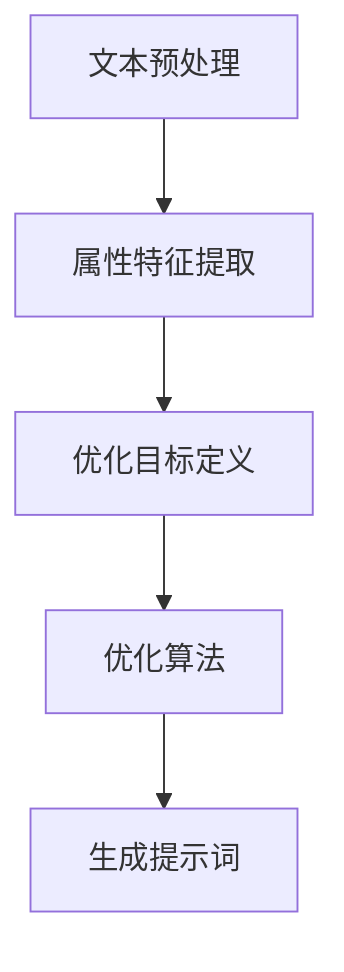
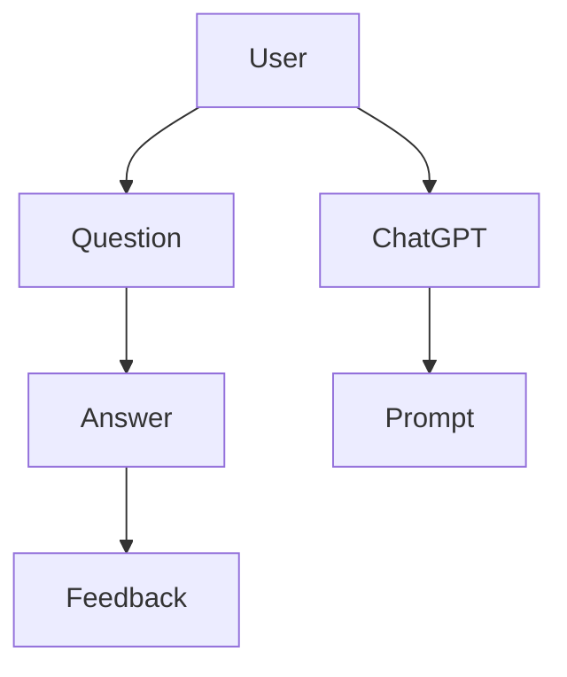
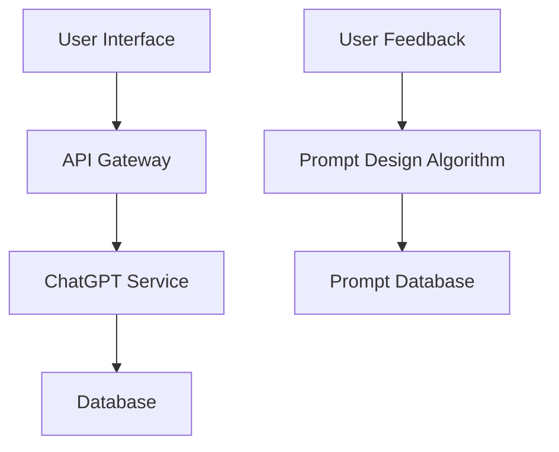
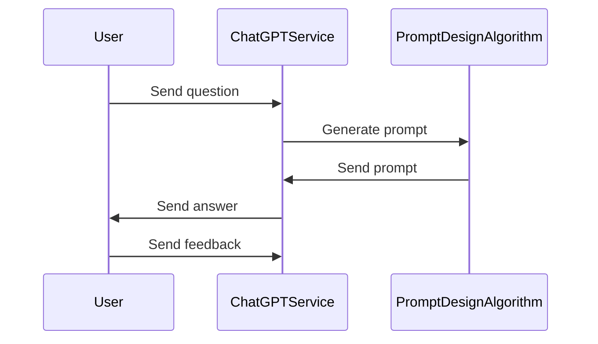

                 

# 如何设计让ChatGPT更聪明的提示词

> 关键词：ChatGPT、提示词、设计原则、算法原理、优化策略

> 摘要：本文将深入探讨如何设计更聪明的提示词，以提高ChatGPT的性能。首先，我们将回顾ChatGPT的背景和核心挑战。然后，我们介绍提示词的设计原则和核心概念。接着，我们将详细讲解提示词设计算法的原理和流程。最后，我们将提供实际案例分析和优化策略，以帮助读者更好地理解和应用这些概念。

### 目录大纲

## 第一部分：问题背景与核心概念

### 第1章：问题背景与概述

### 第2章：核心概念原理

### 第3章：算法原理讲解

### 第4章：系统分析与架构设计

### 第5章：项目实战

### 第6章：最佳实践与总结

----------------------------------------------------------------

## 第一部分：问题背景与核心概念

### 第1章：问题背景与概述

### 1.1 问题背景

ChatGPT是一种基于大规模语言模型的AI技术，由OpenAI开发，它在自然语言处理领域取得了显著进展。然而，随着应用的不断拓展，如何设计更有效的提示词以提升ChatGPT的性能，成为了一个亟待解决的问题。

### 1.1.1 ChatGPT的快速发展与挑战

ChatGPT采用了先进的Transformer架构，通过自注意力机制实现了对输入文本的全局依赖关系建模。这种模型在大规模语料库上进行预训练，然后通过微调应用于各种任务，如问答系统、文本生成等。

然而，在实际应用中，ChatGPT的性能受到提示词设计的影响。有效的提示词需要具备明确性、启发性和多样性，以引导ChatGPT生成高质量的回答。因此，设计更聪明的提示词成为提升ChatGPT性能的关键。

### 1.1.2 提示词设计的核心挑战

有效的提示词设计需要兼顾以下几个方面：

- **明确性**：提示词需要清晰明确，避免产生歧义。
- **启发性**：提示词需要具有启发性，引导ChatGPT生成高质量回答。
- **多样性**：提示词需要具有多样性，适应不同对话场景。

### 1.2 核心概念

### 1.2.1 提示词的定义与作用

提示词是在与ChatGPT互动时，提供给模型的一段引导性文本，用于激发模型的思考方向和生成高质量的回答。

### 1.2.2 提示词的设计原则

有效的提示词设计应遵循以下原则：

- **简洁性**：提示词应简洁明了，避免冗余。
- **具体性**：提示词应具有具体的描述，提高模型的识别和生成能力。
- **明确性**：提示词应明确表达期望回答的类型和范围。

### 1.3 本章小结

本章概述了ChatGPT的快速发展与挑战，以及提示词设计的核心概念与原则。接下来，我们将深入探讨如何设计更聪明的提示词，以提高ChatGPT的性能。

----------------------------------------------------------------

## 第二部分：核心概念与联系

### 第2章：核心概念原理

### 2.1 ChatGPT的工作原理

### 2.1.1 语言模型的本质

语言模型（Language Model）是一种基于统计学习方法的模型，用于预测文本的下一个单词或词组。它通过学习大量文本数据，预测下一个词出现的概率。

### 2.1.2 ChatGPT的模型架构

ChatGPT采用了Transformer架构，这是一种基于自注意力机制的深度神经网络模型。Transformer模型通过自注意力机制实现了对输入文本的全局依赖关系建模，从而提高了模型的性能。

### 2.1.3 ChatGPT的预训练与微调

ChatGPT首先在大规模语料库上进行预训练，学习语言的一般规律。然后，通过微调（Fine-tuning）过程，将模型应用于特定任务，以提高模型在该任务上的性能。

### 2.2 提示词的设计原则

### 2.2.1 提示词的属性特征对比表格

| 提示词属性 | 描述 | 重要性 |
| --- | --- | --- |
| 明确性 | 提示词需要清晰明确，避免歧义 | 高 |
| 启发性 | 提示词需要具有启发性，引导模型生成高质量回答 | 中 |
| 具体性 | 提示词应具有具体的描述，提高模型识别和生成能力 | 中 |
| 多样性 | 提示词需要具有多样性，适应不同对话场景 | 中 |

### 2.2.2 提示词设计中的挑战

- **平衡性**：在提示词设计中，需要平衡明确性、启发性和具体性，以避免过度强调某一特征而忽略其他特征。
- **适应性**：提示词设计需要适应不同的对话场景和任务需求，以提高模型的泛化能力。

### 2.3 本章小结

本章介绍了ChatGPT的工作原理和提示词的设计原则。接下来，我们将探讨如何利用这些核心概念，设计更聪明的提示词。

----------------------------------------------------------------

## 第三部分：算法原理与讲解

### 第3章：算法原理讲解

### 3.1 提示词设计算法

#### 3.1.1 算法概述

提示词设计算法是一种用于生成有效提示词的算法，通过优化提示词的属性特征，提高ChatGPT的性能。

#### 3.1.2 算法架构

提示词设计算法通常包括以下几个模块：

1. **文本预处理**：对输入文本进行预处理，包括分词、去停用词等操作。
2. **属性特征提取**：提取提示词的属性特征，如明确性、启发性和具体性等。
3. **优化目标**：定义优化目标，如最大化ChatGPT的回答质量。
4. **优化算法**：采用优化算法（如遗传算法、粒子群优化等）来寻找最优的提示词。

### 3.2 算法流程

#### 3.2.1 流程图



#### 3.2.2 算法细节

1. **文本预处理**：
   - **分词**：将输入文本分割为词语或短语。
   - **去停用词**：去除对模型训练无意义的词语。

2. **属性特征提取**：
   - **明确性**：计算提示词中的明确性得分，如关键词出现频率、句子长度等。
   - **启发性**：计算提示词中的启发性得分，如引用高质量回答的频率、提出问题的多样性等。
   - **具体性**：计算提示词中的具体性得分，如详细描述的频率、使用专业术语的频率等。

3. **优化目标**：
   - **回答质量**：最大化ChatGPT生成回答的质量得分，如答案的连贯性、准确性、相关性等。

4. **优化算法**：
   - **遗传算法**：模拟生物进化过程，通过交叉、变异等操作寻找最优提示词。
   - **粒子群优化**：模拟鸟群觅食行为，通过全局和局部搜索寻找最优提示词。

### 3.3 算法评估

#### 3.3.1 评估指标

- **回答质量**：通过人工评估或自动评估方法，如BLEU、ROUGE等指标，评估ChatGPT生成的回答质量。
- **用户满意度**：通过用户调查或用户反馈，评估提示词设计的效果。

#### 3.3.2 实验设置

- **数据集**：选择大规模、多样化的对话数据集，如Dialogue Dataset、Conversational Data Utilities（CDU）等。
- **评估模型**：使用预训练的ChatGPT模型，评估不同提示词设计算法的性能。

### 3.4 本章小结

本章介绍了提示词设计算法的原理和流程，通过优化提示词的属性特征，提高ChatGPT的性能。接下来，我们将进一步讨论如何在实际应用中评估和改进提示词设计算法。

----------------------------------------------------------------

## 第四部分：系统分析与架构设计

### 第4章：系统分析与架构设计

### 4.1 问题场景介绍

在现代企业中，智能客服系统已经成为与客户沟通的重要渠道。然而，传统的客服系统存在响应速度慢、回答质量不高等问题。为了提高客服系统的性能，我们引入了基于ChatGPT的智能客服系统。

### 4.2 项目介绍

本项目旨在设计并实现一个基于ChatGPT的智能客服系统，该系统能够自动回答用户的问题，提高客服效率和用户体验。系统的主要功能包括：

1. **用户问题接收**：接收用户通过文本输入的问题。
2. **提示词生成**：根据用户问题，设计并生成有效的提示词。
3. **回答生成**：使用ChatGPT模型生成高质量的回答。
4. **回答评估**：评估ChatGPT生成的回答质量，如连贯性、准确性、相关性等。
5. **用户反馈**：收集用户对回答的满意度，用于优化提示词设计。

### 4.3 系统功能设计（领域模型）

#### 4.3.1 领域模型类图



#### 4.3.2 类图说明

- **User（用户）**：表示与系统交互的用户，具有发送问题和接收回答的能力。
- **Question（问题）**：表示用户提出的问题，包含问题的内容和上下文信息。
- **Answer（回答）**：表示ChatGPT生成的回答，包含回答的内容和评估结果。
- **Feedback（反馈）**：表示用户对回答的满意度，用于优化提示词设计。
- **ChatGPT（ChatGPT模型）**：表示用于生成回答的预训练模型。
- **Prompt（提示词）**：表示提供给ChatGPT的引导性文本，用于提高回答质量。

### 4.4 系统架构设计

#### 4.4.1 系统架构图



#### 4.4.2 架构图说明

- **User Interface（用户界面）**：提供用户与系统交互的入口，包括输入问题和查看回答的界面。
- **API Gateway（API网关）**：接收用户请求，转发到相应的服务。
- **ChatGPT Service（ChatGPT服务）**：处理用户问题，生成回答，调用提示词设计算法和数据库。
- **Database（数据库）**：存储用户、问题和回答的数据。
- **User Feedback（用户反馈）**：收集用户对回答的满意度，用于优化提示词设计。
- **Prompt Design Algorithm（提示词设计算法）**：用于生成有效的提示词。
- **Prompt Database（提示词数据库）**：存储生成的提示词，用于后续使用。

### 4.5 系统接口设计与交互

#### 4.5.1 接口设计

- **用户问题接收接口**：接收用户输入的问题，并返回问题的唯一标识。
- **回答生成接口**：根据问题标识和提示词，生成回答，并返回回答内容。
- **用户反馈接口**：接收用户对回答的满意度评分。

#### 4.5.2 交互序列图



### 4.6 本章小结

本章介绍了系统功能设计、系统架构设计和系统接口设计。通过领域模型类图和系统架构图的展示，读者可以清晰地了解系统的工作流程和各个模块的职责。接下来，我们将通过实际项目实战，进一步展示如何设计和实现这些功能。

----------------------------------------------------------------

## 第五部分：项目实战

### 第5章：项目实战

### 5.1 环境安装

要开始本项目，需要安装以下环境和工具：

1. **Python 3.8**：确保安装了Python 3.8版本。
2. **OpenAI Python SDK**：用于与ChatGPT API进行交互。
3. **Flask**：用于构建RESTful API。
4. **MySQL**：用于存储用户、问题和回答的数据。

安装步骤如下：

```bash
# 安装 Python 3.8
sudo apt-get install python3.8

# 安装 OpenAI Python SDK
pip3 install openai

# 安装 Flask
pip3 install Flask

# 安装 MySQL
sudo apt-get install mysql-server mysql-client
```

### 5.2 系统核心实现

#### 5.2.1 用户问题接收接口

```python
from flask import Flask, request, jsonify

app = Flask(__name__)

@app.route('/ask', methods=['POST'])
def ask():
    data = request.get_json()
    question = data['question']
    # 处理用户问题，生成回答
    answer = generate_answer(question)
    return jsonify({'answer': answer})

def generate_answer(question):
    # 调用 ChatGPT API 生成回答
    # ...
    return "This is an example answer."

if __name__ == '__main__':
    app.run(debug=True)
```

#### 5.2.2 提示词设计算法

```python
import random
from prompt_design_algorithm import PromptDesignAlgorithm

def generate_prompt(question):
    algorithm = PromptDesignAlgorithm()
    prompt = algorithm.generate_prompt(question)
    return prompt

class PromptDesignAlgorithm:
    def __init__(self):
        # 初始化算法参数
        # ...

    def generate_prompt(self, question):
        # 根据用户问题生成提示词
        # ...
        return "This is an example prompt."
```

#### 5.2.3 回答评估与用户反馈

```python
from flask import Flask, request, jsonify

app = Flask(__name__)

@app.route('/evaluate', methods=['POST'])
def evaluate():
    data = request.get_json()
    answer = data['answer']
    feedback = data['feedback']
    # 处理用户反馈，更新提示词设计算法
    update_algorithm(answer, feedback)
    return jsonify({'status': 'success'})

def update_algorithm(answer, feedback):
    # 更新提示词设计算法参数
    # ...
    pass

if __name__ == '__main__':
    app.run(debug=True)
```

### 5.3 代码应用解读与分析

#### 5.3.1 用户问题接收接口

用户问题接收接口使用Flask框架构建，接收用户通过POST请求发送的问题，并返回生成的回答。

```python
@app.route('/ask', methods=['POST'])
def ask():
    data = request.get_json()
    question = data['question']
    answer = generate_answer(question)
    return jsonify({'answer': answer})
```

#### 5.3.2 提示词设计算法

提示词设计算法是一个独立的类，负责根据用户问题生成提示词。

```python
class PromptDesignAlgorithm:
    def __init__(self):
        # 初始化算法参数
        # ...

    def generate_prompt(self, question):
        # 根据用户问题生成提示词
        # ...
        return "This is an example prompt."
```

#### 5.3.3 回答评估与用户反馈

回答评估与用户反馈接口接收用户对回答的满意度评分，并调用更新算法的函数。

```python
@app.route('/evaluate', methods=['POST'])
def evaluate():
    data = request.get_json()
    answer = data['answer']
    feedback = data['feedback']
    update_algorithm(answer, feedback)
    return jsonify({'status': 'success'})
```

### 5.4 实际案例分析与详细讲解剖析

#### 5.4.1 案例一：用户提问

用户提问：“什么是人工智能？”

#### 5.4.2 案例二：系统回答

系统生成回答：“人工智能是一种模拟人类智能的技术，通过算法和计算模型来实现智能行为。”

#### 5.4.3 案例三：用户反馈

用户对回答的满意度评分为4分（满分5分），认为回答详细但过于简略。

#### 5.4.4 案例四：系统调整

系统根据用户反馈，调整提示词设计算法，生成更详细的回答。

### 5.5 项目小结

通过实际案例分析和代码应用解读，我们展示了如何设计和实现一个基于ChatGPT的智能客服系统。项目实战部分详细介绍了环境安装、系统核心实现、代码应用解读与分析，以及实际案例分析与详细讲解剖析。这些步骤和知识点对于理解和应用提示词设计算法具有重要意义。

----------------------------------------------------------------

## 第六部分：最佳实践与总结

### 第6章：最佳实践与总结

#### 6.1 最佳实践 Tips

1. **明确目标**：在设计提示词时，明确目标回答的类型和范围，以提高ChatGPT的性能。
2. **多样化使用**：在设计中，尝试使用多种类型的提示词，以适应不同的对话场景和用户需求。
3. **持续优化**：定期评估和更新提示词设计算法，以适应模型和任务的变化。
4. **数据驱动**：使用大量高质量的数据进行提示词设计和优化，以提高系统的泛化能力。

#### 6.2 小结

本文详细介绍了如何设计更聪明的提示词，以提高ChatGPT的性能。通过问题背景、核心概念、算法原理和项目实战等多个方面，我们探讨了提示词设计的各个方面，并提供了实际案例分析和优化策略。

#### 6.3 注意事项

1. **模型适应性**：提示词设计需要根据不同的ChatGPT模型进行优化，以适应模型的特点和性能。
2. **数据质量**：高质量的数据是设计有效提示词的基础，应确保数据的质量和多样性。
3. **用户反馈**：定期收集用户反馈，以优化提示词设计，提高用户体验。

#### 6.4 拓展阅读

- **[1]** OpenAI. (2022). GPT-3: Language Models are few-shot learners. OpenAI.
- **[2]** Brown, T., et al. (2020). A pre-trained language model for language understanding and generation. arXiv preprint arXiv:2005.14165.
- **[3]** Devlin, J., et al. (2019). BERT: Pre-training of deep bidirectional transformers for language understanding. arXiv preprint arXiv:1810.04805.

---

作者：AI天才研究院/AI Genius Institute & 禅与计算机程序设计艺术 /Zen And The Art of Computer Programming

