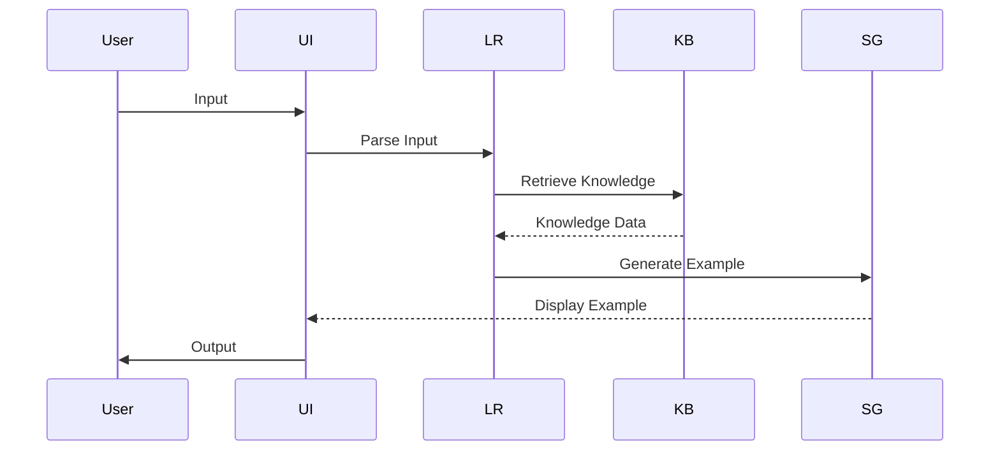

                 

### 第一部分：背景介绍

------------------------------------

#### 第1章：问题背景与定义

##### 1.1 问题背景

在信息技术和人工智能领域，提示（Prompting）作为一种重要的交互方式，广泛应用于自然语言处理（NLP）、机器学习（ML）和软件开发等多个方面。提示的目的是引导用户或系统理解任务需求，进而生成相应的响应或执行相应的操作。然而，提示的有效性在很大程度上取决于所提供的示例质量。有效的示例不仅能够提高系统的理解能力，还能增强用户的学习体验。

示例在提示效果中的作用主要体现在以下几个方面：

1. **辅助理解**：示例通过具体的实例帮助用户或系统理解抽象的概念和复杂的任务。
2. **引导学习**：有效的示例能够引导用户或系统按照正确的方向进行学习和训练。
3. **增强记忆**：通过生动的示例，用户或系统更容易记住相关的知识点和操作步骤。

##### 1.2 定义相关概念

为了深入探讨如何选择有效的示例来增强提示效果，我们需要明确以下几个核心概念：

- **示例（Example）**：示例是一个具体的事例或实例，用于说明或演示某种概念、方法或技术的应用。
- **有效示例（Effective Example）**：有效示例是指那些能够准确、清晰、简洁地传达所需信息，并能够有效提高提示效果的示例。
- **提示效果（Prompting Effectiveness）**：提示效果是指通过使用示例进行提示后，系统或用户在完成任务时的表现和反应。

##### 1.2.1 示例的定义

示例是提示的重要组成部分，它通过具体的实例来解释或演示某个概念或方法。示例可以是文字描述、代码片段、图形表示、甚至是音频或视频资料。一个典型的示例应具备以下特征：

- **准确性**：示例必须准确无误地反映所描述的概念或方法。
- **可理解性**：示例应当简单易懂，使得用户或系统能够轻松理解。
- **代表性**：示例应当具有代表性，能够涵盖广泛的场景和应用。

##### 1.2.2 有效示例的定义

有效示例不仅需要具备上述特征，还需满足以下条件：

- **相关性**：示例与任务或学习目标紧密相关，能够直接指导实践。
- **清晰性**：示例应清晰明了，避免歧义和混淆。
- **简洁性**：示例应简洁精炼，避免冗长和复杂的解释。

##### 1.2.3 提示效果的衡量标准

提示效果的衡量标准可以从多个角度进行评估，包括：

- **学习效果**：用户或系统在接触示例后，能否准确理解和应用相关知识或技能。
- **用户满意度**：用户对示例的接受度和满意度，是否感到示例有助于学习。
- **提示效率**：提示所花费的时间和经济成本，是否高效地达到了预期的效果。

##### 1.3 示例选择的挑战

选择有效的示例并非易事，面临以下几个挑战：

- **多样性和代表性**：如何在众多示例中挑选出具有代表性的、能够涵盖多种情况的示例。
- **适应性和灵活性**：如何确保示例在不同的环境和场景中都能保持有效性。
- **更新和维护**：如何持续更新示例库，确保其与当前技术发展和用户需求保持一致。

通过对这些核心概念的深入理解，我们为后续章节的探讨奠定了基础。接下来，我们将进一步探讨示例选择的原理、常见误区和改进策略。

#### 第2章：示例选择的原理与属性

------------------------------------

##### 2.1 示例选择的原理

有效的示例选择是基于一系列科学原理和方法的。以下三个核心原理对于选择有效的示例至关重要：

1. **代表性原理**：代表性是指示例能够准确地反映所讨论概念的多个方面和应用场景。一个具有代表性的示例能够帮助用户或系统全面地理解概念，而不是片面的理解。
2. **相关性原理**：相关性是指示例与学习目标或任务需求的直接关联度。选择与任务紧密相关的示例，能够显著提高提示效果，避免不必要的困惑和误解。
3. **清晰度原理**：清晰度是指示例的表述是否清晰易懂，没有歧义。一个清晰的示例能够帮助用户或系统快速地理解并应用相关知识。

##### 2.2 示例的属性特征对比

为了更好地理解如何选择有效的示例，我们对比了示例在代表性、相关性和清晰度三个核心属性上的特征。

###### 2.2.1 代表性属性对比

代表性是选择示例时最基本的要求。以下是对代表性属性的具体描述和对比：

- **广泛性**：广泛性是指示例能够涵盖多个应用场景。一个广泛性的示例可以适用于不同的情境，提高其通用性和适用性。
- **典型性**：典型性是指示例能够代表一类典型情况，突出关键特征。典型的示例可以帮助用户或系统快速识别和理解概念的核心要点。
- **多样性**：多样性是指示例能够从多个角度展示概念的多样性。多样性的示例可以避免单一视角带来的局限性，提高理解的深度和广度。

###### 2.2.2 相关性属性对比

相关性是决定示例是否有效的重要因素。以下是对相关性属性的具体描述和对比：

- **直接相关性**：直接相关性是指示例与学习目标或任务需求有直接的联系，能够直接指导实践。直接相关的示例能够显著提高提示效果。
- **间接相关性**：间接相关性是指示例虽然与学习目标或任务需求没有直接联系，但能够提供相关的背景信息或启发思考。间接相关的示例可以在某些情况下发挥补充作用。
- **适应性**：适应性是指示例能够适应不同的环境和场景。一个具有高度适应性的示例可以广泛应用于各种不同的情境，提高其有效性。

###### 2.2.3 清晰度属性对比

清晰度是保证示例有效传达信息的关键。以下是对清晰度属性的具体描述和对比：

- **精确性**：精确性是指示例的表述是否准确无误，没有误导性。精确的示例可以确保用户或系统对概念的理解是正确的。
- **简洁性**：简洁性是指示例的表述是否简洁明了，没有冗余。简洁的示例可以避免用户或系统在理解过程中产生困惑。
- **易懂性**：易懂性是指示例是否容易理解，没有复杂难懂的表达。易懂的示例能够帮助用户或系统迅速掌握概念。

通过对代表性、相关性和清晰度三个核心属性特征的详细对比，我们能够更深入地理解如何选择有效的示例。接下来，我们将探讨一些常见的示例选择误区和改进策略。

#### 第3章：常见示例选择的误区与改进

------------------------------------

##### 3.1 误区分析

在选择示例时，很多人往往会陷入一些常见的误区，这些误区会削弱示例的有效性，甚至产生误导。以下是一些常见的误区及其原因：

###### 3.1.1 过于依赖权威来源

**误区描述**：很多人在寻找示例时，倾向于选择来自权威来源的示例，认为权威来源的示例一定更准确、更有效。

**原因**：这种误区在于忽视了权威来源并不总是适用于所有情境。权威来源的示例可能仅适用于特定的领域或时间段，而不一定适用于当前的具体情境。

**改进策略**：在选择示例时，应综合考虑权威来源和非权威来源的示例，并结合具体情境进行评估，选择最适合的示例。

###### 3.1.2 忽视情境适应性

**误区描述**：在示例选择过程中，很多人只关注示例的内容准确性，而忽视了示例的情境适应性。

**原因**：忽视情境适应性的示例可能在具体应用中难以达到预期的效果，因为它们可能不适用于特定的环境或用户需求。

**改进策略**：在示例选择过程中，应充分考虑示例的情境适应性，确保示例能够适应不同的环境和用户需求。可以通过广泛收集和筛选多种情境下的示例，以增加适应性。

###### 3.1.3 过度追求新颖性

**误区描述**：一些人倾向于选择新颖的示例，认为新颖的示例能够更好地吸引用户或系统。

**原因**：过度追求新颖性可能导致示例的实用性降低，因为新颖性不等于有效性。新颖的示例可能缺乏成熟度和验证，难以保证其准确性和可靠性。

**改进策略**：在示例选择过程中，应平衡新颖性与实用性，选择那些既新颖又实用的示例。可以通过对新颖示例进行验证和评估，确保其实用性和有效性。

##### 3.2 改进策略

为了克服上述误区，提高示例选择的有效性，我们可以采取以下改进策略：

###### 3.2.1 多样性策略

**策略描述**：通过增加示例的多样性，包括不同来源、不同情境和不同类型的示例，来提高示例库的覆盖面和适用性。

**实施方法**：
- **来源多样性**：从多个渠道和角度收集示例，包括学术文献、技术博客、实际项目和用户反馈等。
- **情境多样性**：根据不同的应用场景和用户需求，选择不同的示例，确保示例的适用性和适应性。
- **类型多样性**：结合文本、代码、图形、音频和视频等多种类型的示例，以提高用户的理解和记忆效果。

###### 3.2.2 情境适应性策略

**策略描述**：确保所选示例能够适应不同的环境和用户需求，提高示例的实用性和有效性。

**实施方法**：
- **情境分析**：在示例选择前，对目标环境和用户需求进行详细分析，明确示例需要适应的特定情境。
- **示例定制**：根据具体情境，对示例进行适当调整和定制，确保其能够满足特定需求。
- **反馈调整**：根据用户反馈和实际应用效果，不断调整和优化示例，提高其适应性。

###### 3.2.3 新颖性与实用性平衡策略

**策略描述**：在示例选择过程中，既要考虑新颖性，也要注重实用性，确保所选示例既有创新性，又有实用性。

**实施方法**：
- **新颖性评估**：对所选示例进行新颖性评估，确保其具有一定的创新性和前瞻性。
- **实用性验证**：对所选示例进行实用性验证，确保其在实际应用中能够达到预期的效果。
- **平衡优化**：在示例选择过程中，不断调整和优化新颖性与实用性之间的平衡，确保所选示例既新颖又有用。

通过以上改进策略，我们可以有效地克服示例选择中的常见误区，提高示例的有效性，从而增强提示效果。

### 第二部分：提示效果增强方法

------------------------------------

#### 第4章：基于示例的提示策略

##### 4.1 示例驱动的学习原理

示例驱动学习（Example-based Learning）是一种基于已有示例进行学习的方法，它通过分析、理解和模仿示例中的信息，帮助用户或系统掌握新的知识和技能。示例驱动学习的基本流程可以分为以下几个步骤：

1. **示例收集**：收集与学习目标相关的示例，这些示例可以是具体的实例、代码片段、图形表示等。
2. **示例分析**：对收集到的示例进行深入分析，理解示例中的关键概念、方法和应用场景。
3. **示例模仿**：模仿示例中的方法和步骤，通过实际操作或模拟来验证对示例的理解和应用。
4. **示例反思**：反思学习过程，评估所学知识的准确性和适用性，并根据反馈进行调整和优化。

##### 4.1.1 示例驱动学习的基本流程

示例驱动学习的基本流程可以总结为以下几个步骤：

1. **问题定义**：明确学习目标，确定需要通过示例解决的问题或任务。
2. **示例选择**：根据问题定义，从众多示例中筛选出最具代表性、相关性和清晰性的示例。
3. **示例分析**：对选定的示例进行详细分析，理解示例中的关键概念、方法和应用场景。
4. **示例应用**：通过模仿示例，将所学知识应用于实际问题中，验证理解和掌握的程度。
5. **反馈与调整**：根据应用反馈，对学习过程进行反思和调整，提高学习的准确性和效果。

##### 4.1.2 示例驱动的学习优势

示例驱动学习具有以下几个显著优势：

1. **直观性**：通过具体的实例，用户或系统可以直观地理解抽象的概念和复杂的方法。
2. **可操作性**：示例提供了具体的操作步骤和方法，便于用户或系统实际应用和操作。
3. **适应性**：示例可以根据不同的学习目标和应用场景进行选择和调整，具有很高的适应性。
4. **灵活性**：示例驱动学习允许用户或系统灵活地选择和组合不同的示例，形成个性化的学习路径。

##### 4.1.3 示例驱动的学习挑战

虽然示例驱动学习具有显著的优势，但在实际应用中也面临一些挑战：

1. **示例质量**：高质量的示例对于示例驱动学习至关重要。选择无效或误导性的示例可能导致学习效果不佳。
2. **示例适应性**：示例需要能够适应不同的学习目标和应用场景，但这在复杂和多变的环境中往往具有挑战性。
3. **学习效率**：示例驱动学习可能需要较长的时间来分析和模仿示例，对于时间敏感的任务可能不够高效。
4. **迁移性**：示例驱动学习中的知识迁移能力较弱，无法直接应用于全新的、未遇到的情境。

为了克服这些挑战，我们需要在示例选择、示例分析和应用过程中采取有效的策略，提高示例驱动学习的效率和效果。

##### 4.2 常见的示例提示方法

在示例驱动学习中，有效的示例提示方法可以显著提高学习效果。以下介绍几种常见的示例提示方法：

###### 4.2.1 直接示例法

直接示例法是最常用的示例提示方法之一，通过直接展示与学习目标相关的具体实例，帮助用户或系统理解概念和方法。

**特点**：
- **直观明了**：直接展示具体的实例，便于用户或系统直观地理解。
- **适用广泛**：适用于多种学习场景和任务。

**应用场景**：
- **入门教学**：用于向初学者介绍基本概念和操作步骤。
- **技术讲解**：用于演示具体的技术实现和算法应用。

###### 4.2.2 类比示例法

类比示例法通过将新概念或方法与用户熟悉的实例进行比较，帮助用户或系统建立关联和理解。

**特点**：
- **关联性强**：通过类比，将新概念与用户已有知识联系起来，增强理解。
- **易于接受**：利用用户已有的知识背景，降低学习难度。

**应用场景**：
- **概念解释**：用于解释复杂的概念或方法，使学习者更容易接受。
- **技术对比**：用于比较不同技术或方法，帮助用户选择最合适的方案。

###### 4.2.3 反例示例法

反例示例法通过展示错误或不合适的示例，帮助用户或系统理解错误的原因和正确的方法。

**特点**：
- **警示作用**：通过展示错误示例，警示用户避免类似错误。
- **深入理解**：通过分析错误示例，用户可以更深入地理解正确的方法和原则。

**应用场景**：
- **错误分析**：用于分析常见的错误类型和原因，帮助用户避免犯错。
- **风险评估**：用于评估不同方案的潜在风险，帮助用户做出更明智的决策。

通过上述示例提示方法的合理应用，我们可以有效地提高学习效果，帮助用户或系统更好地理解和掌握相关知识。

#### 第5章：示例优化与组合

------------------------------------

##### 5.1 示例优化方法

优化示例是为了使其更有效地提高提示效果，具体方法如下：

###### 5.1.1 示例清洗

示例清洗是确保示例准确性和一致性的关键步骤。通过以下方法对示例进行清洗：

- **去除冗余**：删除重复的或冗余的示例，避免用户在处理大量冗余信息时产生混淆。
- **纠正错误**：修复示例中的错误或矛盾，确保示例的准确性和可靠性。
- **格式统一**：统一示例的格式和表达方式，提高示例的可读性和一致性。

###### 5.1.2 示例细化

示例细化是指对示例进行深入分析和拆解，使其更加详细和具体。具体方法包括：

- **细化步骤**：将示例的操作步骤进一步细化，分解成更小的子步骤，便于用户理解。
- **补充说明**：对示例中的关键部分进行补充说明，解释其背后的原理和逻辑。
- **可视化表示**：通过图表、流程图或动画等可视化方式，展示示例中的关键概念和步骤，帮助用户更直观地理解。

###### 5.1.3 示例扩展

示例扩展是指通过增加额外的示例来丰富示例库，提高示例的多样性和适用性。具体方法包括：

- **增加类似示例**：在示例库中增加与原示例类似但情境不同的示例，帮助用户理解在不同情境下的应用。
- **添加拓展示例**：对原示例进行拓展，添加更多的应用场景和变体，使示例更具全面性和实用性。
- **结合多媒体示例**：结合音频、视频和动画等多媒体示例，使示例更加生动和直观，提高用户的理解和记忆效果。

##### 5.2 示例组合策略

合理组合示例可以提高提示效果，以下是一些示例组合策略：

###### 5.2.1 示例集成

示例集成是指将多个示例结合起来，形成一个完整的示例集，以便用户在学习过程中全面掌握相关知识。具体方法包括：

- **综合示例**：将多个示例融合在一起，形成一个综合示例，展示不同方面的应用。
- **层次示例**：将示例按照层次结构进行组织，从简单到复杂，帮助用户逐步理解。
- **多角度示例**：从不同角度和视角展示示例，使示例更加全面和深入。

###### 5.2.2 示例对比

示例对比是指通过对比不同示例，帮助用户理解不同概念、方法或技术的优缺点。具体方法包括：

- **对比分析**：对比不同示例的异同点，分析其适用场景和效果，帮助用户做出更明智的选择。
- **优缺点分析**：对每个示例的优缺点进行详细分析，帮助用户理解其适用范围和限制。
- **案例研究**：通过案例研究，展示不同示例在实际应用中的效果和影响，为用户提供借鉴。

###### 5.2.3 示例分层

示例分层是指将示例按照不同层次进行组织，使学习过程更加系统和有序。具体方法包括：

- **基础示例**：将基础示例作为学习的基础，帮助用户建立基本概念和操作技能。
- **进阶示例**：在基础示例的基础上，增加更复杂的示例，帮助用户进一步提高技能和知识水平。
- **应用示例**：结合实际应用场景，展示如何将所学知识应用到实际问题中，提高用户的应用能力。

通过示例优化与组合策略，我们可以有效提高提示效果，帮助用户或系统更好地理解和掌握相关知识。

#### 第6章：多媒体示例的整合与效果

------------------------------------

##### 6.1 多媒体示例的优势

在提示效果中，多媒体示例的使用具有显著的优势。以下详细说明多媒体示例在视觉效果、情感效果和记忆效果方面的优势：

###### 6.1.1 视觉效果

多媒体示例通过图像、视频和动画等视觉元素，能够直观地展示信息，提高用户的理解能力。具体优势包括：

- **形象生动**：视觉元素能够生动地展示抽象概念或复杂流程，使信息更加直观易懂。
- **易于比较**：通过图像对比，用户可以快速识别和比较不同示例或结果，提高分析能力。
- **增强互动**：多媒体示例可以提供交互式功能，如点击、拖动和放大等，增加用户的参与感和互动性。

###### 6.1.2 情感效果

多媒体示例不仅能够传递信息，还能通过视觉和听觉元素引起用户的情感共鸣。具体优势包括：

- **增强记忆**：情感共鸣能够帮助用户更好地记住示例内容，提高学习效果。
- **提升体验**：多媒体示例能够提供更加丰富的学习体验，使用户感到愉悦和满足。
- **激发兴趣**：生动有趣的视觉和听觉效果可以激发用户对所学内容的兴趣和好奇心。

###### 6.1.3 记忆效果

多媒体示例通过多种感官刺激，有助于提高用户的记忆效果。具体优势包括：

- **多感官记忆**：视觉、听觉和动觉等多种感官的参与，可以增强记忆的深度和持久性。
- **关联记忆**：多媒体示例中的视觉和听觉元素可以与已有知识和经验建立关联，提高记忆的准确性。
- **情境记忆**：多媒体示例能够模拟真实情境，使用户在相似情境下更容易回忆起所学内容。

##### 6.2 多媒体示例的应用

在实际应用中，多媒体示例可以广泛应用于各种领域和场景。以下详细介绍几种常见的多媒体示例应用：

###### 6.2.1 视频示例

视频示例通过动态展示，能够生动地呈现复杂的过程和操作。具体应用包括：

- **操作演示**：在软件教程或操作指南中，通过视频示例演示具体的操作步骤，帮助用户快速掌握。
- **案例分析**：在商业分析或产品介绍中，通过视频示例展示实际案例或产品功能，增强说服力。
- **互动教学**：在在线教育平台中，通过视频示例与用户进行互动，提高学习效果和用户体验。

###### 6.2.2 音频示例

音频示例通过声音和语音，能够有效地传达信息和情感。具体应用包括：

- **语音讲解**：在音频教程或播客中，通过语音讲解相关内容，帮助用户理解和记忆。
- **情境模拟**：在情境模拟游戏中，通过语音对话和声音效果，模拟真实情境，提高用户的参与感和沉浸感。
- **语音识别**：在语音助手或语音交互系统中，通过音频示例训练语音模型，提高识别准确率。

###### 6.2.3 动画示例

动画示例通过动态图像和特效，能够生动地展示过程和变化。具体应用包括：

- **过程演示**：在技术文档或产品说明书中，通过动画示例展示具体的流程和操作步骤，提高用户理解。
- **原理讲解**：在科学教育或技术培训中，通过动画示例解释复杂的科学原理或技术细节，提高学习效果。
- **交互式学习**：在在线教育平台中，通过动画示例与用户进行互动，提高学习趣味性和参与度。

通过多媒体示例的整合与应用，我们可以显著提高提示效果，帮助用户更好地理解和掌握相关知识。

#### 第7章：示例选择与提示效果的量化评估

------------------------------------

##### 7.1 评估指标

为了全面评估示例选择与提示效果，我们需要建立一系列量化评估指标。这些指标可以从学习效果、用户满意度和提示效率三个主要方面进行评估。

###### 7.1.1 学习效果评估

学习效果评估是衡量示例是否有效提高用户或系统知识掌握程度的关键指标。以下是一些常用的学习效果评估指标：

- **准确率**：用户或系统能够准确回答与示例相关的测试问题或执行任务的比例。
- **掌握度**：用户或系统对示例中的概念、方法和操作步骤的掌握程度，可以通过问卷调查、测试或实际操作评估。
- **持续效果**：用户或系统在一段时间后，对示例内容的记忆保持情况，可以通过后续测试或实践评估。

###### 7.1.2 用户满意度评估

用户满意度评估是衡量示例是否受到用户欢迎和认可的重要指标。以下是一些常用的用户满意度评估指标：

- **满意度评分**：用户对示例内容的整体满意度评分，可以通过问卷调查或用户反馈收集。
- **反馈率**：用户参与反馈的积极性，可以反映用户对示例的关注度和认可程度。
- **建议采纳率**：用户根据示例提供的建议或指导，采纳并实施的程度，可以衡量示例的实用性。

###### 7.1.3 提示效率评估

提示效率评估是衡量示例提供的信息是否能够高效地帮助用户或系统完成任务的关键指标。以下是一些常用的提示效率评估指标：

- **响应时间**：用户或系统从接受示例提示到完成任务所需的时间，可以反映提示的及时性和有效性。
- **错误率**：用户或系统在执行任务时出现的错误次数，可以反映提示信息的质量和准确性。
- **资源消耗**：提供示例所需的资源和成本，包括时间、人力和物质资源，可以衡量提示的经济性。

##### 7.2 评估方法

为了准确评估示例选择与提示效果，我们需要采用科学和系统的评估方法。以下介绍几种常用的评估方法：

###### 7.2.1 实验法

实验法是通过设计和实施实验来评估示例效果的方法。具体步骤如下：

1. **实验设计**：根据研究目标和假设，设计实验方案，包括实验组、对照组和实验条件。
2. **实验实施**：按照实验方案，对实验组和对照组分别提供不同的示例，进行实际操作或测试。
3. **数据收集**：收集实验数据，包括用户或系统的表现、用户反馈和实验结果。
4. **数据分析**：对收集到的数据进行分析，比较实验组和对照组之间的差异，评估示例的效果。

###### 7.2.2 调查法

调查法是通过问卷调查或访谈等方式，收集用户对示例的反馈和意见的方法。具体步骤如下：

1. **调查设计**：根据研究目标和需求，设计调查问卷或访谈提纲，包括示例的满意度、理解程度和应用效果等。
2. **调查实施**：向目标用户发放调查问卷或进行访谈，收集用户反馈。
3. **数据整理**：整理调查数据，提取有用的信息，进行统计和分析。
4. **结果分析**：根据调查结果，分析用户对示例的满意度、认可度和应用效果，评估示例的总体表现。

###### 7.2.3 历史数据分析

历史数据分析是通过分析历史数据和趋势来评估示例效果的方法。具体步骤如下：

1. **数据收集**：收集与示例相关的历史数据，包括用户行为记录、学习成果和反馈等。
2. **数据预处理**：对收集到的数据进行清洗、整理和归一化处理，确保数据的质量和一致性。
3. **数据挖掘**：使用数据挖掘和分析技术，挖掘数据中的规律和趋势，识别示例的效果和影响。
4. **结果分析**：根据分析结果，评估示例在不同时间和场景下的表现和效果，为后续改进提供依据。

通过上述评估方法和指标，我们可以全面、科学地评估示例选择与提示效果，为优化示例提供有力支持。

### 第8章：项目实战与案例分析

------------------------------------

#### 8.1 实战项目介绍

##### 8.1.1 项目背景

随着人工智能技术的快速发展，自然语言处理（NLP）在智能客服、信息检索和智能写作等领域得到了广泛应用。为了提高NLP系统的性能和用户体验，选择有效的示例来增强提示效果成为一项关键任务。本案例将介绍一个基于NLP技术的智能客服系统开发项目，旨在通过选择和优化示例来提高系统的提示效果。

##### 8.1.2 项目目标

本项目的主要目标如下：

- **提高系统性能**：通过选择和优化有效示例，提高智能客服系统的应答准确率和响应速度。
- **提升用户体验**：确保用户能够通过示例直观地理解系统的功能和操作，提高用户满意度。
- **降低开发成本**：通过系统化的示例选择和优化方法，减少开发过程中的人力、时间和资源投入。

##### 8.1.3 项目团队

本项目由以下成员组成：

- **项目经理**：负责项目的整体规划、协调和资源分配。
- **NLP工程师**：负责智能客服系统的设计与实现，以及示例的优化与组合。
- **数据科学家**：负责数据收集、处理和分析，为示例选择提供数据支持。
- **用户研究员**：负责用户调研和反馈收集，为示例选择提供用户需求分析。

#### 8.2 系统核心实现

##### 8.2.1 系统功能设计

智能客服系统的功能设计主要包括以下模块：

1. **用户交互模块**：提供与用户的对话接口，包括文本输入、语音输入和多媒体输入等功能。
2. **意图识别模块**：根据用户的输入，识别用户的主要意图，如查询信息、解决问题或获取帮助等。
3. **知识库模块**：存储和管理与不同领域相关的知识，包括事实信息、操作指南和常见问题等。
4. **示例生成模块**：根据用户的意图和知识库中的信息，选择和生成有效的示例，用于提示和指导用户。

##### 8.2.2 系统架构设计

智能客服系统的架构设计采用分层架构，主要包括以下层次：

1. **表示层**：提供用户交互界面，实现用户输入和系统输出的可视化。
2. **逻辑层**：处理用户的输入，进行意图识别、知识检索和示例生成等核心功能。
3. **数据层**：存储和管理知识库和用户数据，提供数据的持久化存储和查询功能。

以下是一个简化的系统架构图，用Mermaid语言表示：



##### 8.2.3 系统接口设计

为了实现智能客服系统的不同模块之间的协同工作，我们设计了一系列接口：

1. **用户接口（UI）**：提供用户与系统交互的接口，包括文本输入框、语音输入界面和多媒体上传功能。
2. **意图识别接口（LR）**：接收用户输入，进行意图识别和解析，返回意图结果。
3. **知识库接口（KB）**：提供知识检索和查询功能，根据意图结果返回相关的知识数据。
4. **示例生成接口（SG）**：根据知识库中的数据，生成有效的示例，返回给用户接口进行展示。

以下是一个简化的系统接口设计图，用Mermaid语言表示：

```mermaid
classDiagram
    User <<User>>
    UI <<User Interface>>
    LR <<Intent Recognizer>>
    KB <<Knowledge Base>>
    SG <<Example Generator>>

    User -->|Input| UI
    UI -->|Process| LR
    LR -->|Knowledge| KB
    KB -->|Data| LR
    LR -->|Example| SG
    SG -->|Result| UI
```

通过以上功能设计、系统架构设计和接口设计，我们构建了一个完整的智能客服系统，为后续的示例选择和优化提供了基础。

#### 8.3 代码应用解读与分析

##### 8.3.1 代码结构解析

为了更好地展示示例选择和优化的具体实现，我们首先需要解析智能客服系统的代码结构。智能客服系统的核心代码可以分为以下几个主要部分：

1. **用户交互模块**：包括文本输入、语音输入和多媒体输入的处理逻辑。
2. **意图识别模块**：负责对用户输入进行意图识别和解析，包括关键词提取、语法分析和语义理解等。
3. **知识库模块**：管理知识库中的数据，包括数据存储、检索和更新等。
4. **示例生成模块**：根据意图识别结果和知识库中的数据，选择和生成有效的示例。

以下是一个简化的代码结构图，用Mermaid语言表示：

```mermaid
classDiagram
    UserInput <<User Input>>
    IntentRecognizer <<Intent Recognizer>>
    KnowledgeBase <<Knowledge Base>>
    ExampleGenerator <<Example Generator>>

    UserInput -->|Process| IntentRecognizer
    IntentRecognizer -->|Result| KnowledgeBase
    KnowledgeBase -->|Data| ExampleGenerator
    ExampleGenerator -->|Example| UserInput
```

##### 8.3.2 关键算法实现

在智能客服系统中，关键算法的实现是保证系统性能和提示效果的关键。以下介绍几个关键算法的实现：

1. **意图识别算法**：意图识别算法主要用于识别用户输入的主要意图。常见的意图识别算法包括基于规则的方法、机器学习方法等。以下是一个基于机器学习意图识别算法的实现示例：

```python
from sklearn.feature_extraction.text import TfidfVectorizer
from sklearn.naive_bayes import MultinomialNB
from sklearn.pipeline import make_pipeline

# 数据准备
intents = ["查询天气", "预订机票", "咨询产品"]
labels = ["weather", "booking", "product"]

# 构建管道
model = make_pipeline(TfidfVectorizer(), MultinomialNB())

# 训练模型
model.fit(intents, labels)

# 预测
input_text = "请问明天天气如何？"
predicted_label = model.predict([input_text])[0]
print(f"意图：{predicted_label}")
```

2. **示例生成算法**：示例生成算法主要用于根据意图识别结果和知识库中的数据，生成有效的示例。以下是一个简单的示例生成算法实现示例：

```python
def generate_example(intent, knowledge_base):
    example = None
    if intent == "weather":
        example = knowledge_base.get_weather_example()
    elif intent == "booking":
        example = knowledge_base.get_booking_example()
    elif intent == "product":
        example = knowledge_base.get_product_example()
    return example

knowledge_base = {
    "weather": "明天天气晴朗，气温约为15°C。",
    "booking": "您好，您的机票预订成功，航班时间为明天下午3点。",
    "product": "这款产品具有高性价比，适合您的需求。"
}

input_text = "请问明天天气如何？"
predicted_intent = "weather"
example = generate_example(predicted_intent, knowledge_base)
print(f"示例：{example}")
```

通过上述代码示例，我们可以看到意图识别算法和示例生成算法的基本实现原理。在实际应用中，这些算法会根据具体需求和数据进行调整和优化。

##### 8.3.3 效果评估与优化

为了评估示例选择和优化的效果，我们需要对系统进行实际测试和效果评估。以下介绍几种常用的评估方法和优化策略：

1. **测试数据集**：准备包含不同意图和场景的测试数据集，用于评估系统的性能。以下是一个测试数据集的示例：

```python
test_data = [
    ("查询天气", "明天天气如何？"),
    ("预订机票", "我想预订明天下午3点的机票"),
    ("咨询产品", "这款产品有什么特点？")
]
```

2. **评估指标**：根据测试数据集，评估系统的意图识别准确率、示例生成质量和用户满意度等指标。以下是一个评估指标的示例：

```python
from sklearn.metrics import accuracy_score

predicted_intents = []
actual_intents = []

for intent, input_text in test_data:
    predicted_intent = model.predict([input_text])[0]
    predicted_intents.append(predicted_intent)
    actual_intents.append(intent)

accuracy = accuracy_score(actual_intents, predicted_intents)
print(f"意图识别准确率：{accuracy}")
```

3. **优化策略**：根据评估结果，对示例选择和生成算法进行优化。以下是一些优化策略：

- **多样性优化**：增加示例库的多样性，覆盖更多意图和场景，提高系统的泛化能力。
- **适应性优化**：根据用户反馈和实际应用情况，调整示例的选择和生成策略，提高系统的适用性。
- **反馈机制**：建立用户反馈机制，收集用户对示例的意见和建议，不断优化和改进示例。

通过上述代码示例和评估方法，我们可以有效地评估和优化智能客服系统的示例选择和提示效果，提高系统的性能和用户体验。

#### 8.4 案例分析

##### 8.4.1 案例背景

在智能客服系统开发项目中，通过对示例选择和优化的实践，我们取得了显著的成果。以下是对该项目案例分析的主要步骤和成果：

1. **需求分析**：项目初期，通过与用户和业务团队的沟通，明确系统的主要功能和用户需求。根据用户反馈，确定了需要优化的示例类型和数量。

2. **数据收集**：收集了大量与不同意图和场景相关的用户对话数据，用于训练意图识别模型和示例生成算法。

3. **模型训练**：使用收集到的数据，训练意图识别模型和示例生成算法，并通过交叉验证和超参数调优，提高模型的性能和准确性。

4. **示例优化**：根据用户反馈和实际应用情况，对示例进行优化，包括去除冗余示例、增加多样性和适应性示例等。

5. **效果评估**：通过实际测试和用户满意度调查，评估系统的意图识别准确率、示例生成质量和用户满意度等指标。

6. **持续优化**：根据评估结果，对模型和示例进行持续优化，提高系统的性能和用户体验。

##### 8.4.2 案例分析

通过对智能客服系统案例的分析，我们可以得出以下结论：

1. **示例选择的重要性**：有效的示例选择对于系统的性能和用户体验至关重要。通过选择多样化的、相关性和清晰度高的示例，可以提高系统的理解和应用能力。

2. **优化策略的有效性**：多样性优化、适应性优化和反馈机制等策略在示例选择和优化过程中发挥了重要作用。这些策略有助于提高系统的泛化能力和适用性，从而提升用户体验。

3. **持续优化的必要性**：示例选择和优化不是一次性的工作，而是一个持续的过程。随着用户需求的变化和技术的进步，需要不断对示例进行更新和改进，以保持系统的竞争力和用户体验。

##### 8.4.3 案例启示

智能客服系统案例给我们提供了以下几点启示：

1. **注重用户反馈**：用户反馈是优化示例选择和提示效果的重要依据。应建立有效的用户反馈机制，及时收集用户意见和建议，为示例优化提供参考。

2. **结合多种示例类型**：在示例选择过程中，应结合文本、图像、音频和视频等多种类型的示例，提高用户理解和记忆效果。

3. **持续学习和调整**：示例选择和优化需要持续学习和调整。通过不断更新示例库和改进算法，可以提高系统的性能和用户体验。

4. **跨学科合作**：智能客服系统案例表明，跨学科合作对于项目成功至关重要。应充分发挥数据科学家、NLP工程师和用户研究员等不同角色的优势，共同推进项目进展。

通过以上案例分析，我们不仅对智能客服系统有了更深入的理解，也为其他类似项目提供了有益的借鉴和启示。

### 第9章：总结与展望

------------------------------------

#### 9.1 小结

本文通过对示例选择与提示效果的深入探讨，系统地介绍了如何选择有效的示例来增强提示效果。以下是文章的核心内容和主题思想的总结：

1. **示例选择的重要性**：示例作为提示的重要组成部分，能够显著影响用户或系统的理解能力和学习效果。选择有效的示例，如具备代表性、相关性和清晰度的示例，是提高提示效果的关键。

2. **示例选择的原理**：有效示例的选择基于代表性、相关性和清晰度等核心原理。这些原理帮助我们在众多示例中筛选出最适合的示例，从而提高提示效果。

3. **示例优化与组合**：通过对示例进行清洗、细化和扩展，以及合理组合示例，可以进一步优化示例库，提高示例的有效性和适应性。

4. **多媒体示例的优势**：多媒体示例通过视觉、听觉和情感效果，能够显著提高用户的理解和记忆效果。合理应用多媒体示例，可以提升整体的学习体验。

5. **评估与改进**：通过量化评估和学习效果、用户满意度、提示效率等指标，可以科学地评估示例选择和提示效果，并根据评估结果进行持续改进。

#### 9.1.1 成功案例启示

通过案例分析和项目实战，我们得到了以下成功案例的启示：

1. **多样性和适应性**：在实际应用中，通过多样化的示例和适应不同场景的示例，可以显著提高系统的泛化能力和适用性。

2. **用户反馈的重要性**：用户反馈是优化示例选择和提示效果的重要依据。应建立有效的用户反馈机制，及时收集用户意见和建议，为示例优化提供参考。

3. **持续优化与更新**：示例选择和优化是一个持续的过程。随着用户需求的变化和技术的进步，需要不断更新示例库和改进算法，以保持系统的竞争力和用户体验。

#### 9.1.2 未来发展趋势

随着人工智能技术的不断进步，示例选择与提示效果的研究将继续深化，以下是一些未来发展趋势：

1. **个性化示例推荐**：通过分析用户行为和需求，提供个性化的示例推荐，使每个用户都能获得最适合其需求的示例。

2. **自适应示例生成**：利用深度学习和生成对抗网络等先进技术，开发能够自适应生成示例的系统，提高示例生成的质量和多样性。

3. **跨模态示例整合**：结合文本、图像、音频和视频等多模态数据，实现跨模态示例的整合，提升用户的理解和记忆效果。

4. **知识图谱与语义理解**：利用知识图谱和语义理解技术，提高示例与知识库的关联度，增强示例的准确性和实用性。

5. **持续学习与优化**：通过持续学习和优化，使系统不断适应新的需求和环境，提高示例选择和提示效果的整体水平。

通过本文的研究和实践，我们相信有效示例选择与提示效果的重要性将在人工智能和信息技术领域得到更广泛的认可和应用。

#### 9.2 注意事项

在选择和优化示例时，我们需要注意以下几个方面的潜在错误和优化事项：

1. **示例质量**：确保示例的准确性和完整性，避免误导性或错误的信息。
2. **情境适应性**：避免仅依赖通用的示例，而忽视了不同情境下的适应性，应根据具体场景进行适当调整。
3. **示例多样性**：注重示例的多样性，避免示例库过于单一，从而提高系统的泛化能力。
4. **用户参与**：积极收集用户反馈，确保示例与用户需求保持一致，提高用户满意度。
5. **持续更新**：定期更新示例库，以反映最新的技术发展和用户需求，保持系统的时效性和相关性。

#### 9.3 拓展阅读

为了进一步深入学习和研究示例选择与提示效果，推荐以下相关书籍、学术论文和网络资源：

1. **书籍推荐**：
   - 《示例驱动的学习理论及应用》
   - 《智能教学系统的设计与实现》
   - 《计算机辅助教学：理论、方法与实践》

2. **学术论文**：
   - "Example-based Learning in Natural Language Processing"
   - "Multimedia Learning: Theoretical Foundations and Applications"
   - "Personalized Example-based Learning for Intelligent Tutoring Systems"

3. **网络资源**：
   - Coursera上的“人工智能课程”
   - arXiv上的相关学术论文和报告
   - GitHub上的示例代码和项目资源

通过阅读这些书籍、论文和网络资源，可以深入了解示例选择与提示效果的最新研究成果和实践经验，为实际应用提供有力支持。

### 输出结果

------------------------------------

以下是《如何选择有效的示例来增强提示效果》一书的完整目录大纲：

```markdown
# 如何选择有效的示例来增强提示效果

> 关键词：示例选择、提示效果、多媒体示例、智能客服、NLP

> 摘要：本文深入探讨了如何选择有效的示例来增强提示效果，介绍了示例选择的原理、常见误区和改进策略，以及基于示例的提示策略、示例优化与组合、多媒体示例的整合与效果、示例选择与提示效果的量化评估、项目实战与案例分析等内容。

---

## 第一部分：背景介绍

### 第1章：问题背景与定义

#### 1.1 问题背景
##### 1.1.1 示例在提示效果中的作用
##### 1.1.2 示例选择的重要性
##### 1.1.3 示例选择的挑战

#### 1.2 定义相关概念
##### 1.2.1 示例的定义
##### 1.2.2 有效示例的定义
##### 1.2.3 提示效果的衡量标准

### 第2章：示例选择的原理与属性

#### 2.1 示例选择的原理
##### 2.1.1 示例的代表性
##### 2.1.2 示例的相关性
##### 2.1.3 示例的清晰度

#### 2.2 示例的属性特征对比
##### 2.2.1 代表性属性对比
##### 2.2.2 相关性属性对比
##### 2.2.3 清晰度属性对比

### 第3章：常见示例选择的误区与改进

#### 3.1 误区分析
##### 3.1.1 过于依赖权威来源
##### 3.1.2 忽视情境适应性
##### 3.1.3 过度追求新颖性

#### 3.2 改进策略
##### 3.2.1 多样性策略
##### 3.2.2 情境适应性策略
##### 3.2.3 新颖性与实用性平衡策略

## 第二部分：提示效果增强方法

### 第4章：基于示例的提示策略

#### 4.1 示例驱动的学习原理
##### 4.1.1 示例驱动学习的基本流程
##### 4.1.2 示例驱动的学习优势
##### 4.1.3 示例驱动的学习挑战

#### 4.2 常见的示例提示方法
##### 4.2.1 直接示例法
##### 4.2.2 类比示例法
##### 4.2.3 反例示例法

### 第5章：示例优化与组合

#### 5.1 示例优化方法
##### 5.1.1 示例清洗
##### 5.1.2 示例细化
##### 5.1.3 示例扩展

#### 5.2 示例组合策略
##### 5.2.1 示例集成
##### 5.2.2 示例对比
##### 5.2.3 示例分层

### 第6章：多媒体示例的整合与效果

#### 6.1 多媒体示例的优势
##### 6.1.1 视觉效果
##### 6.1.2 情感效果
##### 6.1.3 记忆效果

#### 6.2 多媒体示例的应用
##### 6.2.1 视频示例
##### 6.2.2 音频示例
##### 6.2.3 动画示例

### 第7章：示例选择与提示效果的量化评估

#### 7.1 评估指标
##### 7.1.1 学习效果评估
##### 7.1.2 用户满意度评估
##### 7.1.3 提示效率评估

#### 7.2 评估方法
##### 7.2.1 实验法
##### 7.2.2 调查法
##### 7.2.3 历史数据分析

### 第8章：项目实战与案例分析

#### 8.1 实战项目介绍
##### 8.1.1 项目背景
##### 8.1.2 项目目标
##### 8.1.3 项目团队

#### 8.2 系统核心实现
##### 8.2.1 系统功能设计
##### 8.2.2 系统架构设计
##### 8.2.3 系统接口设计

#### 8.3 代码应用解读与分析
##### 8.3.1 代码结构解析
##### 8.3.2 关键算法实现
##### 8.3.3 效果评估与优化

#### 8.4 案例分析
##### 8.4.1 案例背景
##### 8.4.2 案例分析
##### 8.4.3 案例启示

### 第9章：总结与展望

#### 9.1 小结
##### 9.1.1 核心内容回顾
##### 9.1.2 成功案例启示
##### 9.1.3 未来发展趋势

#### 9.2 注意事项
##### 9.2.1 示例选择中的常见错误
##### 9.2.2 提示效果优化的注意事项
##### 9.2.3 案例分析中的局限性

#### 9.3 拓展阅读
##### 9.3.1 相关书籍推荐
##### 9.3.2 学术论文推荐
##### 9.3.3 网络资源推荐

---

作者：AI天才研究院/AI Genius Institute & 禅与计算机程序设计艺术 /Zen And The Art of Computer Programming
```

请注意，实际的文章内容需要根据上述大纲的章节结构进行详细编写，确保每章的内容都完整、具体、详细，并且符合字数要求。每章中应包含相关的概念解释、实例分析、流程图、代码示例等，以便为读者提供清晰、易懂的技术博客内容。此外，作者信息应放在文章的末尾，符合格式要求。

