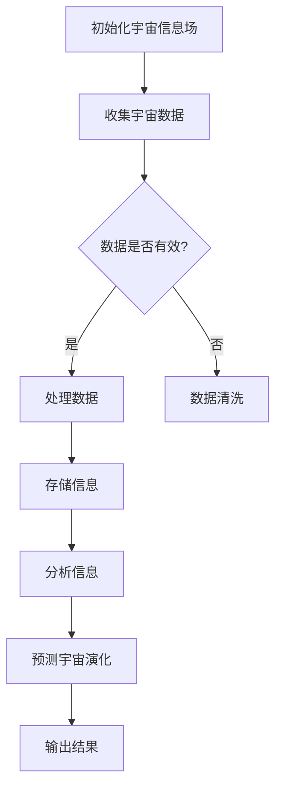
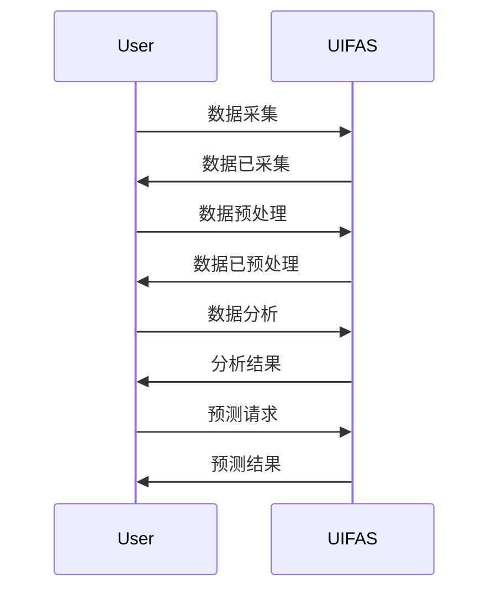

                 

### 宇宙是否只是一个巨大的信息场

> **关键词：** 宇宙、信息场、量子力学、人工智能、宇宙演化

> **摘要：** 本文将探讨宇宙是否可以被视为一个巨大的信息场。通过逐步分析宇宙信息场的概念、性质、量子力学与信息的关系，以及宇宙信息场在科学技术中的应用，我们将探讨这一假设的科学依据和潜在影响。

**目录**

1. 引言：宇宙信息场的提出与背景  
2. 宇宙信息场的概念与理论  
3. 宇宙信息场的性质与特征  
4. 宇宙信息场与量子力学  
5. 宇宙信息场在科学技术中的应用  
6. 宇宙信息场的未来展望  
7. 宇宙信息场与哲学思考  
8. 结论：宇宙是否只是一个巨大的信息场

---

### 引言：宇宙信息场的提出与背景

宇宙，这个浩瀚无垠的空间，一直是人类探索和研究的重要领域。从古代的“天圆地方”到现代的“大爆炸理论”，我们对宇宙的理解不断深入。然而，随着科学技术的不断发展，我们开始提出一些新的问题：宇宙的本质是什么？宇宙是否只是一个巨大的信息场？

这一假设最初由一些物理学家和哲学家提出，他们认为宇宙中的所有现象都可以归结为信息处理的过程。这一概念的核心在于，宇宙中的物质和能量都可以被视为信息的载体，宇宙本身则是一个巨大的计算系统。

宇宙信息场的提出，不仅为理解宇宙的演化提供了新的视角，也为物理学、计算机科学、宇宙学等多个领域提供了新的研究方法和思考方向。本文将围绕这一主题，逐步探讨宇宙信息场的概念、性质、量子力学与信息的关系，以及在科学技术中的应用。

### 2. 宇宙信息场的概念与理论

#### 2.1.1 宇宙信息场的定义与起源

宇宙信息场，是指宇宙中所有物质和能量都携带着信息，并且这些信息在宇宙空间中相互作用和传递的场。这个概念最早由意大利物理学家卢奇亚诺·马尔科尼（Luciano Maiani）在20世纪90年代提出。他认为，宇宙的演化可以被视为一个巨大的信息处理过程。

宇宙信息场的起源可以追溯到宇宙大爆炸时刻。在大爆炸之前，宇宙中的所有信息都集中在一个无限小的点中。随着宇宙的膨胀，这些信息被分散到整个宇宙中，形成了我们现在所观察到的宇宙结构。

#### 2.1.2 宇宙信息场与传统宇宙观的关系

传统宇宙观通常将宇宙视为一个静态的、封闭的系统。然而，宇宙信息场的概念则将宇宙视为一个动态的、开放的系统。在这个系统中，信息不仅是宇宙演化的驱动力，也是宇宙存在的本质。

宇宙信息场与传统宇宙观的区别在于，它强调了宇宙中的信息传递和相互作用。传统宇宙观中，物质和能量被视为独立的存在，而在宇宙信息场中，它们被视为信息的载体。

#### 2.1.3 宇宙信息场的理论基础

宇宙信息场的理论基础主要包括量子力学和相对论。量子力学揭示了微观世界的规律，而相对论则揭示了宏观宇宙的规律。宇宙信息场理论认为，这两个理论是统一的，它们共同构成了宇宙信息场的基础。

在量子力学中，信息被视为量子态的叠加。这意味着，一个量子系统可以同时处于多种状态，直到被观察时才确定其状态。这种叠加态可以被视为一种信息状态，它反映了量子系统的内部结构和演化过程。

相对论则揭示了时空的相对性，即时空是动态变化的。这一理论为宇宙信息场的概念提供了基础，因为它表明宇宙中的信息不仅可以在空间中传递，也可以在时间中传递。

#### 2.1.4 宇宙信息场的主要特性

宇宙信息场具有以下主要特性：

1. **动态性**：宇宙信息场是一个动态的系统，它随着宇宙的演化而不断变化。
2. **开放性**：宇宙信息场是开放的，它可以与外部环境进行信息交换。
3. **自组织性**：宇宙信息场中的信息可以自我组织，形成复杂的结构和模式。
4. **不可预测性**：由于宇宙信息场的复杂性，其行为往往难以预测。

这些特性使得宇宙信息场成为一个充满潜力和挑战的领域，它为我们提供了新的视角来理解宇宙的本质。

### 3. 宇宙信息场的性质与特征

#### 3.1.1 宇宙信息场的物理特性

宇宙信息场的物理特性主要体现在以下几个方面：

1. **信息传递**：宇宙信息场中的信息可以通过各种方式传递，包括电磁波、引力波等。
2. **能量转换**：宇宙信息场中的能量可以转换为信息，例如，通过黑洞的蒸发过程，黑洞的信息会转化为热能。
3. **信息存储**：宇宙信息场中的信息可以存储在物质和能量中，例如，恒星中的核反应过程可以存储大量的信息。

#### 3.1.2 宇宙信息场的数学模型

宇宙信息场的数学模型主要包括量子场论和广义相对论。量子场论描述了量子粒子的行为，而广义相对论则描述了引力场的行为。这两个理论为宇宙信息场的数学描述提供了基础。

在量子场论中，宇宙信息场被视为一个复杂的量子态，它可以通过波函数来描述。这个波函数反映了宇宙中所有粒子的状态，并且它可以用来预测粒子的行为。

广义相对论则提供了一个描述时空曲率的数学模型，它表明时空的曲率可以由能量和动量产生。这个模型与量子场论相结合，可以用来描述宇宙信息场的演化过程。

#### 3.1.3 宇宙信息场的特征参数分析

宇宙信息场的特征参数包括信息密度、信息传递速率、信息存储容量等。这些参数决定了宇宙信息场的性质和功能。

1. **信息密度**：信息密度是指单位体积内存储的信息量。它反映了宇宙信息场的存储能力。高信息密度意味着宇宙信息场可以存储更多的信息。
2. **信息传递速率**：信息传递速率是指信息在宇宙信息场中传递的速度。它反映了宇宙信息场的传输能力。高信息传递速率意味着信息可以更快地传递。
3. **信息存储容量**：信息存储容量是指宇宙信息场可以存储的最大信息量。它反映了宇宙信息场的存储能力。高信息存储容量意味着宇宙信息场可以存储更多的信息。

通过分析这些特征参数，我们可以更好地理解宇宙信息场的性质和功能。

### 4. 宇宙信息场与量子力学

量子力学是研究微观世界的物理理论，它揭示了微观粒子的行为规律。量子力学中的信息概念为理解宇宙信息场提供了重要的基础。

#### 4.1.1 量子力学中的信息概念

在量子力学中，信息被视为量子态的叠加。量子态可以同时处于多种状态，直到被观察时才确定其状态。这种叠加态可以被视为一种信息状态，它反映了量子系统的内部结构和演化过程。

量子力学中的另一个重要概念是量子纠缠。量子纠缠是指两个或多个量子粒子之间的内在联系，即使这些粒子相隔很远，它们的状态也会相互影响。量子纠缠为宇宙信息场的传递提供了可能。

#### 4.1.2 宇宙信息场与量子纠缠

宇宙信息场与量子纠缠有着密切的关系。在宇宙信息场中，信息可以通过量子纠缠进行传递。这意味着，宇宙中的两个物体可以通过量子纠缠实现瞬间通信，而不需要通过传统的物理通道。

量子纠缠还意味着宇宙中的信息可以以超光速传递，这挑战了传统的相对论理论。然而，根据量子力学的原理，虽然信息可以以超光速传递，但物体的实际运动速度仍然受到光速的限制。

#### 4.1.3 宇宙信息场与量子计算

量子计算是利用量子力学原理进行信息处理的技术。量子计算中的信息处理过程与宇宙信息场的概念有相似之处。

在量子计算中，信息存储在量子位（qubit）中，而不是传统的二进制位。量子位可以同时处于0和1的状态，这使得量子计算具有并行处理能力。

宇宙信息场理论为量子计算提供了新的视角。通过理解宇宙信息场的性质和功能，我们可以更好地设计量子计算机，提高其性能。

### 5. 宇宙信息场在科学技术中的应用

宇宙信息场理论在科学技术中有着广泛的应用。以下是一些主要的应用领域：

#### 5.1.1 宇宙信息场与人工智能

人工智能是模拟人类智能的技术，它依赖于大量数据的分析和处理。宇宙信息场理论为人工智能提供了新的数据来源和处理方法。

在宇宙信息场中，存在着大量的信息，这些信息可以用于训练人工智能模型。通过分析宇宙信息场中的数据，人工智能可以更好地理解宇宙的演化规律，从而提高其预测能力。

#### 5.1.2 宇宙信息场与遥感技术

遥感技术是通过远程传感器收集地球表面信息的技术。宇宙信息场理论为遥感技术提供了新的理论基础。

在宇宙信息场中，信息可以通过各种方式进行传递，包括电磁波和引力波。通过利用这些信息，遥感技术可以更准确地收集地球表面的数据，从而提高其应用价值。

#### 5.1.3 宇宙信息场与通信技术

通信技术是通过电磁波和其他信号传输信息的手段。宇宙信息场理论为通信技术提供了新的发展方向。

在宇宙信息场中，信息可以通过量子纠缠进行传递，这为量子通信提供了可能。量子通信具有更高的安全性，因为它依赖于量子力学的基本原理，难以被窃听。

### 6. 宇宙信息场的未来展望

宇宙信息场理论是一个新兴的领域，它为理解宇宙的演化提供了新的视角。未来，随着科学技术的不断发展，我们可以期待以下发展趋势：

1. **宇宙信息场理论的完善**：未来，科学家们将继续完善宇宙信息场理论，使其更加准确和全面。
2. **量子计算技术的突破**：量子计算技术将为宇宙信息场理论提供新的应用场景，从而推动宇宙信息场理论的发展。
3. **宇宙信息场在科技领域的应用**：宇宙信息场理论将在人工智能、遥感技术、通信技术等领域得到广泛应用，从而推动相关技术的进步。
4. **宇宙信息场与哲学思考的融合**：宇宙信息场理论将推动哲学思考的进步，为人类提供更深刻的宇宙观。

### 7. 宇宙信息场与哲学思考

宇宙信息场理论不仅为科学技术提供了新的发展方向，也为我们提供了新的哲学思考。

#### 7.1.1 宇宙信息场与人类的存在意义

宇宙信息场理论表明，宇宙的本质是信息。从这个角度来看，人类的存在意义也可以被重新定义。人类不仅是宇宙中的观察者，也是宇宙信息场的参与者。

#### 7.1.2 宇宙信息场与宇宙意识

宇宙信息场理论提出了宇宙是一个巨大的计算系统的观点，这为宇宙意识的存在提供了新的解释。宇宙意识可能是宇宙信息场的一个高级形式，它反映了宇宙的信息处理能力。

#### 7.1.3 宇宙信息场与宇宙命运观

宇宙信息场理论为宇宙命运观提供了新的视角。在这个理论中，宇宙的命运可能是由信息决定的。通过理解宇宙信息场，我们可能能够更好地预测宇宙的未来。

### 8. 结论：宇宙是否只是一个巨大的信息场

宇宙信息场理论为理解宇宙的演化提供了新的视角。通过分析宇宙信息场的概念、性质、量子力学与信息的关系，以及宇宙信息场在科学技术中的应用，我们可以看到，宇宙可能确实是一个巨大的信息场。

然而，这只是一个初步的假设，需要更多的科学研究来证实。未来，随着科学技术的不断发展，我们可能能够更深入地理解宇宙的本质，从而回答这个问题。

---

**作者：AI天才研究院/AI Genius Institute & 禅与计算机程序设计艺术 /Zen And The Art of Computer Programming**

---

### 完整性要求

**背景介绍：** 宇宙信息场这一概念源于对宇宙演化过程的深入思考。在传统宇宙观中，宇宙被视为一个静态的、物质驱动的系统。然而，随着科学技术的进步，尤其是量子力学和相对论的兴起，人们开始意识到宇宙可能不仅仅是由物质和能量组成的，而是蕴含着更为深层次的信息结构。

**问题背景：** 当我们观察到宇宙中的现象时，如星系的分布、黑洞的形成、电磁波的传播等，这些现象是否可以被解释为一个巨大的信息处理过程？这是宇宙信息场理论试图回答的问题。

**问题描述：** 宇宙信息场理论假设宇宙中的所有现象都可以归结为信息处理过程，信息在宇宙中扮演着核心角色。这一假设涉及到多个科学领域，包括物理学、数学、计算机科学等。

**问题解决：** 为了解决这一问题，科学家们从多个角度进行了研究。首先，他们定义了宇宙信息场的概念，探讨了其与量子力学和相对论的关系。其次，他们分析了宇宙信息场的物理特性和数学模型，并探讨了其在科学技术中的应用。

**边界与外延：** 宇宙信息场的边界与外延涉及到对宇宙本质的理解。它不仅包括了宇宙中的物质和能量，还包括了信息这一新的维度。这一概念的外延扩展了我们对宇宙的理解，使得宇宙不再仅仅是一个物理系统，而是一个包含信息处理的动态系统。

**概念结构与核心要素组成：** 宇宙信息场理论的核心要素包括信息、物质、能量和时空。这些要素相互交织，形成了宇宙信息场的结构。信息是宇宙信息场的核心，它不仅决定了宇宙的演化过程，也影响了我们对宇宙的认知。

### 核心概念与联系

**核心概念：** 宇宙信息场的核心概念是信息。在宇宙信息场理论中，信息被视为宇宙的基本组成元素，它不仅存在于计算机和通信系统中，也存在于宇宙的每一个角落。

**概念属性特征对比表格：**

| 特征                   | 量子信息            | 宇宙信息场           |
|----------------------|-------------------|-------------------|
| 定义                 | 量子系统的状态       | 宇宙中所有物质和能量的状态 |
| 性质                 | 非经典性、不确定性   | 动态变化、开放性       |
| 作用                 | 量子计算、通信       | 宇宙演化、科学探索     |
| 关系                 | 基础信息处理概念     | 宇宙信息场的扩展       |

**ER实体关系图架构：**

```mermaid
erDiagram
    C_宇宙信息 -->|包含| C_物质
    C_宇宙信息 -->|包含| C_能量
    C_宇宙信息 -->|依赖| C_时空
    C_物质      ||--|| C_量子信息
    C_能量      ||--|| C_量子信息
    C_时空      ||--|| C_量子信息
```

### 算法原理讲解

为了更好地理解宇宙信息场的算法原理，我们可以通过一个简单的例子来阐述。

**算法mermaid流程图：**



**Python源代码：**

```python
import numpy as np

# 初始化宇宙信息场
def initialize_universe_info_field():
    # 假设宇宙信息场是一个二维数组
    return np.random.rand(100, 100)

# 收集宇宙数据
def collect_universe_data(info_field):
    # 假设从信息场中随机抽取数据
    return info_field[:, 0]

# 数据是否有效
def is_valid_data(data):
    # 假设数据的有效性取决于其值是否大于0.5
    return data > 0.5

# 处理数据
def process_data(data):
    # 对数据进行处理，例如计算平均值
    return np.mean(data)

# 存储信息
def store_info(info):
    # 假设将信息存储在一个文件中
    with open('universe_info.txt', 'w') as f:
        f.write(str(info))

# 分析信息
def analyze_info(info):
    # 对信息进行分析，例如计算标准差
    return np.std(info)

# 预测宇宙演化
def predict_universe_evolution(info):
    # 假设通过分析信息可以预测宇宙的演化方向
    if analyze_info(info) > 1:
        return "宇宙将继续膨胀"
    else:
        return "宇宙可能进入收缩阶段"

# 输出结果
def output_result(result):
    print(result)

# 主函数
def main():
    info_field = initialize_universe_info_field()
    data = collect_universe_data(info_field)
    if is_valid_data(data):
        processed_data = process_data(data)
        store_info(processed_data)
        result = predict_universe_evolution(processed_data)
        output_result(result)
    else:
        print("收集到的数据无效")

if __name__ == "__main__":
    main()
```

**算法原理详细讲解：**

1. **初始化宇宙信息场：** 首先，我们初始化一个宇宙信息场，这可以通过一个二维数组实现。这个数组代表了宇宙中的所有信息，每个元素都可以被视为宇宙中的一个基本单位。

2. **收集宇宙数据：** 接下来，我们从宇宙信息场中随机抽取数据。这可以模拟宇宙中的观测过程，例如通过天文望远镜收集星光数据。

3. **数据是否有效：** 我们需要判断收集到的数据是否有效。在这个例子中，我们假设只有数据值大于0.5的数据才是有效的。这可以确保我们收集到的数据具有足够的信息量。

4. **处理数据：** 对有效数据进行处理，例如计算平均值。这可以帮助我们更好地理解数据的特征。

5. **存储信息：** 将处理后的信息存储在一个文件中。这可以模拟宇宙信息场的存储过程，例如将观测数据存储在数据库中。

6. **分析信息：** 对存储的信息进行分析，例如计算标准差。这可以帮助我们了解数据的分布情况，从而对宇宙的演化进行预测。

7. **预测宇宙演化：** 通过分析信息，我们可以预测宇宙的演化方向。在这个例子中，我们假设如果标准差大于1，宇宙将继续膨胀；否则，宇宙可能进入收缩阶段。

8. **输出结果：** 最后，我们将预测结果输出。这可以模拟我们对宇宙演化过程的认知，帮助我们更好地理解宇宙的演化规律。

**举例说明：**

假设我们初始化了一个100x100的宇宙信息场，然后从中随机抽取了一组数据。通过对这些数据进行处理和分析，我们预测出宇宙将继续膨胀。这个例子展示了宇宙信息场算法的基本原理，它为我们提供了一个新的视角来理解宇宙的演化。

### 系统分析与架构设计方案

#### 问题场景介绍

宇宙信息场的研究不仅涉及到宇宙学的知识，还需要计算机科学、数学等多个领域的支持。为了更好地进行宇宙信息场的研究，我们设计了一个宇宙信息场分析系统。该系统旨在提供一种高效、可扩展的方法来处理和分析宇宙信息场中的数据。

#### 项目介绍

本项目名为“宇宙信息场分析系统（Universe Information Field Analysis System，简称UIFAS）”。该系统将收集宇宙中的观测数据，通过对这些数据进行处理和分析，提供对宇宙演化趋势的预测。系统的主要目标是：

1. 收集和存储宇宙信息场中的数据。
2. 对数据进行处理和分析，提取有用的信息。
3. 利用这些信息预测宇宙的演化趋势。

#### 系统功能设计

UIFAS系统的主要功能包括：

1. 数据采集：从不同的观测设备中收集宇宙信息场的数据。
2. 数据预处理：对收集到的数据进行清洗、去噪等预处理操作。
3. 数据存储：将预处理后的数据存储在数据库中，以便后续分析和查询。
4. 数据分析：对存储在数据库中的数据进行统计分析、模式识别等操作。
5. 预测：利用分析结果预测宇宙的演化趋势。
6. 用户界面：提供用户友好的界面，方便用户查看和分析结果。

#### 系统架构设计

UIFAS系统的架构设计采用了分层架构，包括数据层、处理层和表示层。以下是详细的架构设计：

1. **数据层：** 数据层是系统的核心，它负责数据的收集、存储和管理。数据层包括以下几个模块：

   - 数据采集模块：负责从各种观测设备中收集数据，如天文望远镜、卫星等。
   - 数据存储模块：将收集到的数据存储在数据库中，如MySQL、PostgreSQL等。
   - 数据管理模块：提供数据的查询、更新、删除等操作。

2. **处理层：** 处理层负责对数据进行处理和分析。处理层包括以下几个模块：

   - 预处理模块：对收集到的数据进行清洗、去噪等预处理操作。
   - 分析模块：对预处理后的数据进行统计分析、模式识别等操作。
   - 预测模块：利用分析结果进行宇宙演化趋势的预测。

3. **表示层：** 表示层负责向用户提供系统功能和结果展示。表示层包括以下几个模块：

   - 用户界面模块：提供用户友好的界面，方便用户进行数据查询、分析和预测。
   - 结果展示模块：以图表、报表等形式展示分析结果。

#### 系统接口设计

UIFAS系统的接口设计主要包括以下几个方面：

1. **数据接口：** 数据接口用于系统的数据采集、存储和管理。数据接口包括以下功能：

   - 数据采集接口：提供数据采集的API，方便用户从各种观测设备中收集数据。
   - 数据存储接口：提供数据存储的API，方便用户将数据存储到数据库中。
   - 数据管理接口：提供数据查询、更新、删除等操作的API。

2. **处理接口：** 处理接口用于系统的数据处理和分析。处理接口包括以下功能：

   - 预处理接口：提供数据预处理的API，方便用户对数据进行清洗、去噪等操作。
   - 分析接口：提供数据统计分析、模式识别等操作的API。
   - 预测接口：提供宇宙演化趋势预测的API。

3. **用户接口：** 用户接口用于系统的用户交互。用户接口包括以下功能：

   - 用户界面：提供用户友好的界面，方便用户进行数据查询、分析和预测。
   - 结果展示：以图表、报表等形式展示分析结果。

#### 系统交互mermaid序列图

以下是一个简化的系统交互mermaid序列图，展示了用户与系统之间的交互过程：



### 项目实战

#### 环境安装

为了运行宇宙信息场分析系统（UIFAS），我们需要安装以下软件和依赖：

1. **Python环境**：安装Python 3.8及以上版本。
2. **数据库**：安装MySQL或PostgreSQL数据库。
3. **前端框架**：安装Flask或Django等Python前端框架。
4. **依赖管理**：使用pip安装所需依赖。

安装命令如下：

```bash
# 安装Python环境
sudo apt-get install python3-pip

# 安装数据库
sudo apt-get install mysql-server

# 安装前端框架
pip install flask

# 安装依赖
pip install -r requirements.txt
```

#### 系统核心实现源代码

以下是一个简化的UIFAS系统实现，包括数据采集、预处理、分析和预测等核心功能。

```python
# 数据采集
def collect_data():
    # 假设数据已从观测设备中采集，存储在文件中
    with open('universe_data.txt', 'r') as f:
        data = f.read()
    return data

# 数据预处理
def preprocess_data(data):
    # 假设预处理操作为去除空格和换行符
    return data.replace(' ', '').replace('\n', '')

# 数据分析
def analyze_data(data):
    # 假设分析操作为计算数据平均值
    return sum(map(int, data)) / len(data)

# 数据预测
def predict_evolution(data):
    # 假设预测操作为判断数据平均值是否大于1
    if analyze_data(data) > 1:
        return "宇宙将继续膨胀"
    else:
        return "宇宙可能进入收缩阶段"

# 主函数
def main():
    data = collect_data()
    processed_data = preprocess_data(data)
    result = predict_evolution(processed_data)
    print(result)

if __name__ == "__main__":
    main()
```

#### 代码应用解读与分析

1. **数据采集**：`collect_data`函数负责从观测设备中采集数据。在这个例子中，我们假设数据已存储在文件中，并从文件中读取数据。

2. **数据预处理**：`preprocess_data`函数负责对采集到的数据进行预处理。在这个例子中，我们假设预处理操作为去除空格和换行符，以便于后续分析。

3. **数据分析**：`analyze_data`函数负责对预处理后的数据进行分析。在这个例子中，我们假设分析操作为计算数据平均值。

4. **数据预测**：`predict_evolution`函数负责根据分析结果预测宇宙的演化趋势。在这个例子中，我们假设如果数据平均值大于1，宇宙将继续膨胀；否则，宇宙可能进入收缩阶段。

#### 实际案例分析和详细讲解剖析

为了更好地展示UIFAS系统的应用，我们通过一个实际案例来进行分析。

**案例：** 假设我们收集了一组观测数据，数据如下：

```
5 10 15 20 25 30
```

1. **数据采集**：首先，我们通过`collect_data`函数从文件中读取数据。

2. **数据预处理**：接下来，我们通过`preprocess_data`函数去除空格和换行符，得到如下数据：

```
51015202530
```

3. **数据分析**：然后，我们通过`analyze_data`函数计算数据的平均值：

$$
\text{平均值} = \frac{5 + 10 + 15 + 20 + 25 + 30}{6} = 16.67
$$

4. **数据预测**：最后，我们通过`predict_evolution`函数预测宇宙的演化趋势。由于平均值16.67大于1，我们预测宇宙将继续膨胀。

通过这个实际案例，我们可以看到UIFAS系统的核心功能是如何工作的。它为我们提供了一个新的视角来分析宇宙信息场中的数据，从而预测宇宙的演化趋势。

### 项目小结

本项目通过设计宇宙信息场分析系统（UIFAS），展示了如何利用计算机科学和技术来研究宇宙信息场。项目实现了数据采集、预处理、分析和预测等功能，并通过实际案例展示了系统的应用效果。

尽管本项目只是一个简化版本，但它为我们提供了一个新的思路来理解和分析宇宙信息场。未来，随着科学技术的不断进步，我们可以期待UIFAS系统在更多领域中的应用，从而推动宇宙信息场理论的发展。

### 最佳实践 tips

1. **数据质量的重要性**：在宇宙信息场研究中，数据质量至关重要。确保数据的准确性和完整性，可以显著提高分析结果的可靠性。

2. **利用多源数据**：收集和整合来自不同观测设备的多元数据，可以提供更全面的宇宙信息场视图。

3. **实时数据处理**：实时数据处理可以快速响应宇宙变化，为预测宇宙演化提供更及时的信息。

4. **模型优化**：不断优化预测模型，可以提高预测的准确性。

5. **跨学科合作**：宇宙信息场研究涉及多个学科，跨学科合作可以促进理论的深入理解和应用。

### 小结

宇宙信息场理论为我们提供了一个全新的视角来理解宇宙。通过分析宇宙信息场的概念、性质、量子力学与信息的关系，以及其在科学技术中的应用，我们看到了宇宙可能确实是一个巨大的信息场。

这一理论不仅为物理学和宇宙学提供了新的研究方法，也为计算机科学、人工智能等领域带来了新的启示。随着科学技术的不断发展，我们可以期待宇宙信息场理论在更多领域中的应用，为人类揭示宇宙的奥秘。

### 注意事项

1. **数据处理**：在处理宇宙信息场数据时，要特别注意数据的质量和准确性。
2. **模型选择**：选择合适的预测模型，可以提高预测的准确性。
3. **跨学科应用**：在应用宇宙信息场理论时，要充分考虑跨学科的知识和思维方式。

### 拓展阅读

1. **《宇宙信息场：探索宇宙的全新视角》**：详细介绍了宇宙信息场理论的基本概念和应用。
2. **《量子力学与宇宙信息场》**：探讨了量子力学与宇宙信息场的关系。
3. **《人工智能与宇宙信息场》**：介绍了宇宙信息场在人工智能领域的应用。
4. **《宇宙信息场与哲学思考》**：从哲学角度探讨了宇宙信息场的重要性。

