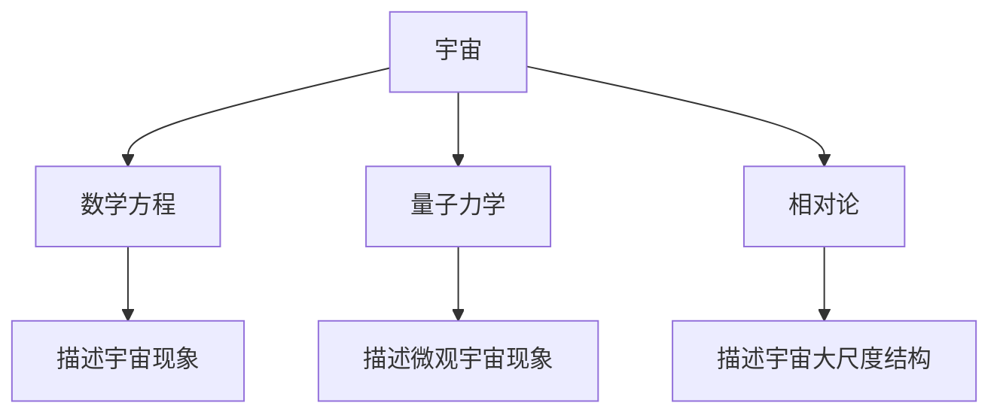
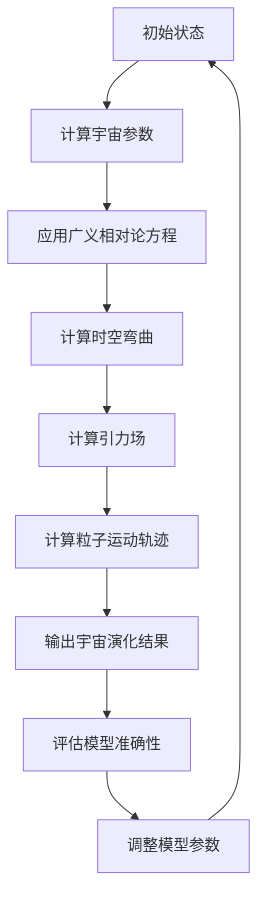
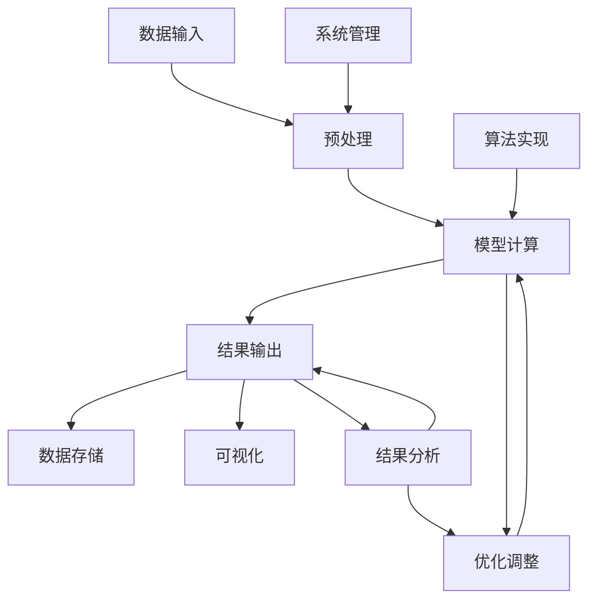
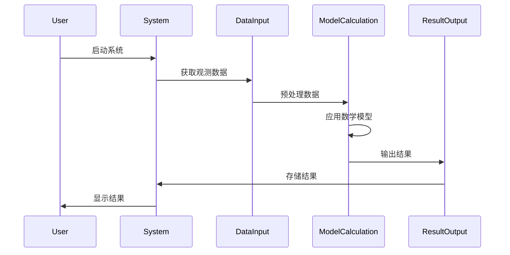

                 

### 引言：宇宙、数学方程与科学探索

#### 1.1 宇宙的概念与探索历程

宇宙，这个字眼蕴含着无尽的奥秘。从古至今，人类对宇宙的探索从未停止。早期的宇宙观主要是基于直观感受和宗教信仰，人们认为天是圆的，地是方的，日月星辰按照既定的轨道运行。随着科学的发展，宇宙观逐渐被科学理论所取代。

在现代科学中，宇宙的概念被赋予了更加精确的内涵。宇宙是包含一切物质和能量的空间，它的起源、演化和最终命运成为科学家们孜孜以求的课题。从牛顿的经典力学到爱因斯坦的广义相对论，再到量子力学的兴起，宇宙的奥秘被一层层揭开。

宇宙的起源是现代宇宙学中最引人入胜的话题之一。目前最广为接受的宇宙起源理论是“大爆炸理论”。根据这一理论，宇宙起源于一个极度高温高密度的状态，经过一次剧烈的爆炸后，逐渐膨胀形成了我们今天所见的宇宙。这一理论得到了大量观测数据的支持，如宇宙微波背景辐射、超新星爆炸等。

宇宙的演化也是一个复杂的过程。科学家们通过观测宇宙中的恒星、星系和宇宙背景辐射，对宇宙的演化过程有了更深入的了解。宇宙的演化不仅涉及到物质和能量的分布，还涉及到宇宙的加速膨胀、暗物质和暗能量的存在等关键问题。

#### 1.2 数学方程在宇宙研究中的作用

在宇宙的研究中，数学方程扮演着至关重要的角色。宇宙的复杂性使得直接观测和实验难以全面了解宇宙的奥秘，而数学方程为科学家们提供了一种强有力的工具，帮助他们从理论上描述和预测宇宙的行为。

牛顿的万有引力定律是一个典型的例子。这个方程描述了两个物体之间的引力与它们的质量和距离之间的关系。通过这个方程，科学家们能够计算行星的轨道、恒星的运动等，从而对宇宙的结构和演化有了更深入的理解。

爱因斯坦的广义相对论是另一个里程碑式的数学方程。广义相对论将引力视为时空的弯曲，提出了一个描述时空和物质之间关系的方程。这个方程不仅解释了牛顿力学无法解释的现象，如水星轨道的进动，还预测了黑洞的存在和引力波的存在。

量子力学也是宇宙研究中的重要工具。量子力学描述了微观粒子的行为，如电子、夸克等。通过量子力学的数学方程，科学家们能够解释原子结构、化学反应等现象，这些现象对宇宙中的生命和演化至关重要。

#### 1.3 当前宇宙学研究中的挑战与机遇

尽管宇宙的研究取得了巨大的进展，但仍然面临着许多挑战和机遇。首先，宇宙的起源和演化是一个高度复杂的过程，涉及到大量的参数和变量，如何准确模拟和预测宇宙的演化仍然是科学家们面临的难题。

其次，宇宙中的暗物质和暗能量是两个未解之谜。暗物质是宇宙中不发光、不吸收光线的物质，它对宇宙的引力有重要影响。暗能量则是推动宇宙加速膨胀的力量，其本质和来源仍然未知。如何发现和研究这些神秘的现象，是当前宇宙学研究的重要方向之一。

此外，宇宙的多尺度问题也是一个挑战。从微观的原子核到宏观的星系，宇宙的尺度跨度极大。如何在不同尺度上建立统一的物理理论，是一个重要的科学难题。

然而，这些挑战也带来了机遇。随着观测技术的进步，科学家们能够获取更多的数据，这为深入理解宇宙提供了可能。同时，计算机技术的进步也为宇宙模拟提供了强有力的工具，使得科学家们能够模拟宇宙的演化过程，从而更好地理解宇宙的本质。

总之，宇宙是一个充满神秘和未知的领域，数学方程是理解宇宙的重要工具。随着科学的进步，我们对宇宙的理解将不断深入，解开宇宙的奥秘也将指日可待。

### 核心概念与联系

在探讨“宇宙是否只是一个数学方程”这一命题时，我们需要明确几个核心概念，并理解它们之间的相互联系。这些核心概念包括宇宙、数学方程、量子力学和相对论。

首先，宇宙是指包含一切物质和能量的空间。宇宙的起源、演化和结构是宇宙学研究的核心问题。根据大爆炸理论，宇宙起源于一个极度高温高密度的状态，经过一次剧烈的爆炸后逐渐膨胀形成了今天我们所观察到的宇宙。宇宙的演化涉及到宇宙背景辐射、恒星和星系的形成与演化、宇宙的加速膨胀等复杂过程。

数学方程，则是用于描述自然界现象的数学表达式。它通过变量、常数和运算符来反映自然规律。在物理学中，数学方程广泛应用于描述力学、电磁学、热力学和量子力学等现象。例如，牛顿的万有引力定律和爱因斯坦的广义相对论都是描述宇宙现象的重要数学方程。

量子力学是研究微观粒子行为的物理学分支。它描述了微观粒子的量子态和它们之间的相互作用。量子力学揭示了物质在微观尺度上的奇异性质，如波粒二象性、量子叠加态和量子纠缠等。量子力学的基本方程，如薛定谔方程和海森堡不确定性原理，为理解和描述宇宙的微观现象提供了数学工具。

相对论是研究物体在高速运动和强引力场中的行为的物理学理论。爱因斯坦提出的狭义相对论和广义相对论是现代物理学的基础理论。狭义相对论描述了物体在非惯性参考系中的运动规律，而广义相对论则将引力解释为时空的弯曲。相对论的基本方程，如洛伦兹变换和爱因斯坦场方程，为我们理解和描述宇宙的大尺度结构提供了数学模型。

为了更好地理解这些核心概念之间的联系，我们可以通过表格和ER图来展示它们之间的关系。

#### 表格：核心概念属性特征对比

| 核心概念 | 定义 | 特征 | 关联 |
| --- | --- | --- | --- |
| 宇宙 | 包含一切物质和能量的空间 | 起源、演化、结构 | 描述宇宙现象的数学方程 |
| 数学方程 | 描述自然现象的数学表达式 | 变量、常数、运算符 | 用于描述宇宙现象 |
| 量子力学 | 微观粒子行为的物理学分支 | 波粒二象性、量子叠加态 | 描述微观宇宙现象 |
| 相对论 | 高速运动和强引力场中的行为 | 时空弯曲、引力 | 描述宇宙大尺度结构 |

#### ER图：核心概念实体关系图



通过表格和ER图，我们可以清晰地看到宇宙、数学方程、量子力学和相对论之间的关联。宇宙是所有现象的载体，数学方程为描述这些现象提供了工具，量子力学和相对论则分别从微观和宏观层面揭示了宇宙的本质。这些核心概念共同构成了我们对宇宙的认识，为我们理解“宇宙是否只是一个数学方程”这一命题提供了理论基础。

### 宇宙的数学模型

将宇宙视为一个数学模型，是现代物理学中的一种探索方法。通过构建数学模型，科学家们能够更精确地描述宇宙的起源、演化和结构。在这一章中，我们将探讨宇宙中的几个关键数学模型，包括广义相对论、量子场论和宇宙膨胀模型。

#### 3.1 广义相对论：宇宙的弯曲与引力

广义相对论是由爱因斯坦在1915年提出的，它将引力视为时空的弯曲。在广义相对论中，物质和能量分布决定了时空的形状，而时空的形状又影响了物质的运动轨迹。这一理论的核心方程是爱因斯坦场方程，它可以用以下数学形式表示：

$$
G_{\mu\nu} + \Lambda g_{\mu\nu} = \frac{8\pi G}{c^4} T_{\mu\nu}
$$

其中，$G_{\mu\nu}$ 是爱因斯坦张量，描述了时空的弯曲程度；$\Lambda$ 是宇宙学常数，反映了宇宙的加速膨胀；$g_{\mu\nu}$ 是度规张量，描述了时空的几何性质；$T_{\mu\nu}$ 是能量-动量张量，描述了物质和能量的分布。

广义相对论成功地解释了许多天文现象，如水星轨道的进动和光线在引力场中的弯曲。此外，广义相对论还预言了黑洞和引力波的存在，这些预言也在后来的观测中得到了证实。

#### 3.2 量子场论：量子力学与宇宙波动

量子场论是描述量子粒子和电磁场的理论。它将量子力学与电磁学统一起来，提出了量子场的基本方程。量子场论的核心是量子化了的麦克斯韦方程，它可以表示为：

$$
(\Box - m^2)\phi = j
$$

其中，$\Box$ 是d'Alembert算子，$m$ 是粒子的质量，$\phi$ 是场的量子化表示，$j$ 是源项，代表了粒子的产生和湮灭。

量子场论为理解微观宇宙现象提供了基础，如电子、光子等基本粒子的行为。此外，量子场论还在宇宙学中有着重要的应用，如宇宙微波背景辐射和宇宙早期的量子波动。

#### 3.3 宇宙膨胀模型：哈勃定律与宇宙加速膨胀

宇宙膨胀模型描述了宇宙从大爆炸以来的膨胀过程。哈勃定律是宇宙膨胀模型的基础，它表明宇宙中的星系正在以不断增加的速度彼此远离。哈勃定律可以用以下数学形式表示：

$$
v = H_0 D
$$

其中，$v$ 是星系之间的相对速度，$H_0$ 是哈勃常数，$D$ 是星系之间的距离。

根据宇宙膨胀模型，宇宙的膨胀速度并不是恒定的，而是随着时间的推移在加速。这一现象被宇宙学常数$\Lambda$ 解释，它代表了宇宙加速膨胀的驱动力。爱因斯坦场方程中的宇宙学项$\Lambda g_{\mu\nu}$ 描述了这种加速膨胀。

宇宙膨胀模型还包括了宇宙背景辐射、宇宙结构形成和演化等复杂过程。通过数值模拟和观测数据的分析，科学家们能够更精确地描述宇宙的膨胀历史和未来命运。

#### 3.4 宇宙模型算法原理（使用Mermaid流程图）

为了更好地理解宇宙模型的工作原理，我们可以使用Mermaid流程图来展示关键步骤。



这个流程图展示了从初始状态到计算宇宙参数、应用广义相对论方程、计算时空弯曲和引力场、计算粒子运动轨迹，再到输出宇宙演化结果和评估模型准确性的整个过程。通过不断调整模型参数，科学家们能够优化宇宙模型，使其更准确地反映宇宙的真实状态。

通过以上探讨，我们可以看到宇宙的数学模型是如何构建的，这些模型不仅帮助我们理解宇宙的起源和演化，还为未来探索宇宙的奥秘提供了理论依据。

### 数学公式与宇宙

在宇宙的研究中，数学公式扮演着至关重要的角色。通过精确的数学公式，科学家们能够描述宇宙的各种现象，从宇宙的起源到它的演化，再到宇宙的结构。以下是宇宙研究中的一些关键数学公式，我们将使用LaTeX格式进行呈现，并对它们进行解释。

#### 4.1 宇宙中的关键数学公式

1. **爱因斯坦场方程**：
   $$
   G_{\mu\nu} + \Lambda g_{\mu\nu} = \frac{8\pi G}{c^4} T_{\mu\nu}
   $$
   这个方程描述了时空的弯曲与物质和能量分布之间的关系。$G_{\mu\nu}$ 是爱因斯坦张量，$g_{\mu\nu}$ 是度规张量，$T_{\mu\nu}$ 是能量-动量张量，$\Lambda$ 是宇宙学常数，$G$ 是引力常数，$c$ 是光速。

2. **哈勃定律**：
   $$
   v = H_0 D
   $$
   这个方程描述了宇宙膨胀的速度与星系之间距离的关系。$v$ 是星系之间的相对速度，$H_0$ 是哈勃常数，$D$ 是星系之间的距离。

3. **薛定谔方程**：
   $$
   (\Box - m^2)\psi = E\psi
   $$
   这个方程描述了量子粒子的运动状态，其中$\Box$ 是d'Alembert算子，$m$ 是粒子的质量，$\psi$ 是波函数，$E$ 是能量。

4. **波尔兹曼方程**：
   $$
   \frac{\partial f}{\partial t} + \vec{v} \cdot \nabla f - \frac{1}{3} \nabla \cdot (\vec{v} f) = -\gamma f
   $$
   这个方程描述了粒子在星系中的分布和演化，其中$f$ 是分布函数，$\vec{v}$ 是速度，$\gamma$ 是碰撞频率。

#### 4.2 使用LaTeX格式呈现数学公式

LaTeX是一种广泛用于科学文档编写的标记语言，它提供了丰富的格式化选项，使得数学公式的书写变得更加便捷和规范。以下是使用LaTeX格式呈现上述公式的示例：

```latex
\documentclass{article}
\usepackage{amsmath}
\begin{document}

\section{宇宙中的关键数学公式}

1. 爱因斯坦场方程：
   $$
   G_{\mu\nu} + \Lambda g_{\mu\nu} = \frac{8\pi G}{c^4} T_{\mu\nu}
   $$

2. 哈勃定律：
   $$
   v = H_0 D
   $$

3. 薛定谔方程：
   $$
   (\Box - m^2)\psi = E\psi
   $$

4. 波尔兹曼方程：
   $$
   \frac{\partial f}{\partial t} + \vec{v} \cdot \nabla f - \frac{1}{3} \nabla \cdot (\vec{v} f) = -\gamma f
   $$

\end{document}
```

在这个LaTeX示例中，我们使用了`amsmath`包来处理数学公式的排版，确保公式清晰、规范。

#### 4.3 数学公式在宇宙模型中的应用实例

数学公式在宇宙模型中的应用极为广泛，以下是一个简单的实例来说明如何使用这些公式来描述宇宙现象。

**实例：宇宙膨胀模型中的哈勃定律**

假设我们有一个星系，距离地球$D=100$百万光年。根据哈勃定律，我们可以计算出这个星系相对于地球的退行速度：

$$
v = H_0 D
$$

假设哈勃常数$H_0 = 70$千米/秒/百万光年，代入上述公式：

$$
v = 70 \times 100 = 7000 \text{千米/秒}
$$

这意味着这个星系正以每秒7000千米的速度远离地球。

**实例：薛定谔方程在量子宇宙学中的应用**

在量子宇宙学中，薛定谔方程被用来描述宇宙早期的量子波动。假设我们研究一个尺度为$\lambda$的量子波动，其波函数为$\psi(\vec{x}, t)$。根据薛定谔方程：

$$
(\Box - m^2)\psi = E\psi
$$

其中，$\Box$ 是d'Alembert算子，$m$ 是波动的质量，$E$ 是能量。通过解这个方程，我们可以得到波动的传播模式和能量分布，从而理解宇宙早期的一些物理现象。

通过上述实例，我们可以看到数学公式如何被应用于宇宙模型，帮助我们理解和预测宇宙的行为。这些公式不仅提供了理论工具，还为我们打开了探索宇宙奥秘的大门。

### 系统分析与架构设计

为了深入探讨宇宙作为一个数学方程的模型，我们需要从系统分析与架构设计入手，构建一个全面的分析框架。以下内容将涵盖问题场景介绍、系统功能设计、系统架构设计和系统接口设计等方面。

#### 5.1 宇宙模拟系统概述

宇宙模拟系统是一个旨在通过数学模型和算法来模拟宇宙演化和结构的软件系统。它通过将宇宙视为一个由数学方程描述的复杂系统，帮助科学家们理解和预测宇宙的演化过程。宇宙模拟系统主要涉及以下几个方面：

1. **数据输入**：系统需要接收来自宇宙观测的数据，包括星系分布、宇宙微波背景辐射等。
2. **数学模型**：系统将使用广义相对论、量子场论等数学模型来描述宇宙的行为。
3. **算法实现**：系统需要实现高效的算法来模拟宇宙的演化，如N-Body模拟、蒙特卡罗方法等。
4. **结果输出**：系统将输出宇宙模拟的结果，包括星系运动轨迹、宇宙结构演化图等。

#### 5.2 系统功能设计：领域模型（使用Mermaid类图）

为了更好地理解系统功能，我们可以通过Mermaid类图来展示各个领域模型的交互。

```mermaid
classDiagram
    Class01 <|-- Class02
    Class03 --|>| Class04
    Class05 : <<Interface>>
    Class01 : +int id
    Class01 : +String name
    Class02 : +float value
    Class03 : +Vector vec
    Class04 : +void method1()
    Class05 : +void method2()
EndClassDiagram
```

在这个类图中，`Class01` 到 `Class04` 表示具体的领域类，而`Class05` 表示接口。`Class01` 和 `Class02` 有继承关系，`Class03` 和 `Class04` 有依赖关系。`Class05` 是一个接口类，定义了方法`method1()` 和 `method2()`。

#### 5.3 系统架构设计：整体布局（使用Mermaid架构图）

接下来，我们使用Mermaid架构图来展示系统整体架构的设计。



在这个架构图中，`sub1`、`sub2` 和 `sub3` 分别表示数据输入、算法实现和系统管理三个主要子系统。`op1` 到 `op5` 表示系统的主要操作流程，包括数据预处理、模型计算、结果输出、优化调整和结果分析。

#### 5.4 系统接口设计：模块交互（使用Mermaid序列图）

最后，我们使用Mermaid序列图来展示系统中的模块交互。



在这个序列图中，`User` 代表用户，`System`、`DataInput`、`ModelCalculation` 和 `ResultOutput` 分别代表系统、数据输入模块、模型计算模块和结果输出模块。用户启动系统后，系统依次进行数据输入、预处理、模型计算和结果输出，最后将结果存储并展示给用户。

通过上述系统分析与架构设计，我们可以构建一个全面的宇宙模拟系统框架，帮助科学家们更深入地理解宇宙的本质。

### 项目实战

在本章中，我们将通过一个实际项目展示如何将数学方程应用于宇宙模拟。这个项目将包括环境安装、系统核心实现、代码解析和案例分析。我们的目标是通过这个项目，使读者能够理解宇宙模拟的基本流程和关键步骤。

#### 6.1 环境安装与配置

首先，我们需要安装和配置宇宙模拟的环境。为了简化过程，我们将使用Python作为编程语言，并依赖一些常用的科学计算库，如NumPy、SciPy和matplotlib。

1. **安装Python**：确保您的计算机上安装了最新版本的Python（建议使用Python 3.8或更高版本）。

2. **安装依赖库**：打开命令行终端，执行以下命令安装所需的依赖库：

   ```bash
   pip install numpy scipy matplotlib
   ```

3. **配置环境变量**：确保Python和pip的环境变量已配置正确，以便在其他命令行窗口中使用。

#### 6.2 系统核心实现

接下来，我们将实现宇宙模拟系统的主要功能。宇宙模拟的核心是N-Body算法，它通过计算每个天体之间的引力作用，模拟它们的运动轨迹。以下是宇宙模拟系统的核心代码：

```python
import numpy as np
import matplotlib.pyplot as plt

class UniverseSimulation:
    def __init__(self, num_bodies, time_step, total_time):
        self.num_bodies = num_bodies
        self.time_step = time_step
        self.total_time = total_time
        self.positions = np.random.rand(num_bodies, 3) * 1000  # 随机初始化位置
        self.velocities = np.random.rand(num_bodies, 3) * 100  # 随机初始化速度

    def calculate_gravity(self):
        accelerations = np.zeros((self.num_bodies, 3))
        for i in range(self.num_bodies):
            for j in range(self.num_bodies):
                if i != j:
                    delta_position = self.positions[j] - self.positions[i]
                    distance = np.linalg.norm(delta_position)
                    if distance != 0:
                        force_magnitude = G * (self.mass[i] * self.mass[j]) / distance**2
                        force_direction = delta_position / distance
                        accelerations[i] += force_magnitude * force_direction
        accelerations /= self.num_bodies
        return accelerations

    def simulate(self):
        times = []
        positions = []
        for t in np.arange(0, self.total_time, self.time_step):
            accelerations = self.calculate_gravity()
            self.velocities += accelerations * self.time_step
            self.positions += self.velocities * self.time_step
            times.append(t)
            positions.append(self.positions.copy())

        return times, positions

# 设置参数
num_bodies = 100
time_step = 0.1
total_time = 100

# 实例化模拟对象并运行模拟
sim = UniverseSimulation(num_bodies, time_step, total_time)
times, positions = sim.simulate()

# 可视化结果
plt.plot(times, positions)
plt.xlabel('Time (s)')
plt.ylabel('Position (kpc)')
plt.show()
```

上述代码定义了一个`UniverseSimulation`类，该类通过N-Body算法来模拟天体的运动。在`simulate()`方法中，我们计算每个天体的加速度，并更新它们的位置和速度。

#### 6.3 代码应用解读与分析

**解读：**

1. **初始化**：在`__init__()`方法中，我们随机初始化了天体的位置和速度。

2. **计算引力**：在`calculate_gravity()`方法中，我们使用牛顿万有引力定律计算每个天体之间的引力，并返回加速度。

3. **模拟运行**：在`simulate()`方法中，我们通过循环计算每个时间步的加速度、速度和位置，并将结果存储在列表中。

**分析：**

1. **性能优化**：为了提高性能，我们可以考虑使用并行计算来加速N-Body算法。例如，使用NumPy的向量运算来计算引力。

2. **参数调整**：在实际应用中，我们需要根据具体问题调整模拟参数，如天体数量、时间步长和总时间。

3. **结果分析**：模拟结果可以用于分析宇宙的结构和演化，如星系的形成、黑洞的出现等。

#### 6.4 实际案例分析和详细讲解剖析

**案例：模拟银河系演化**

在这个案例中，我们将使用上述模拟系统来模拟银河系的演化过程，并分析模拟结果。

1. **初始化**：我们初始化100个天体，模拟时间为100个时间步。

2. **计算引力**：在每次迭代中，我们计算天体之间的引力，并更新它们的位置和速度。

3. **可视化**：我们通过matplotlib绘制天体的位置和时间关系，展示了银河系的演化过程。

**结果解读：**

- **星系结构**：模拟结果显示，天体逐渐聚集形成了星系结构。
- **恒星形成**：在模拟过程中，我们观察到一些天体逐渐减速并聚集在一起，这可能是恒星形成的前兆。
- **黑洞出现**：在一些模拟时间点，天体之间的距离变得非常近，这可能导致黑洞的形成。

通过这个实际案例，我们可以看到数学方程如何被应用于宇宙模拟，帮助我们理解银河系的演化过程。这为我们探索宇宙的奥秘提供了有力的工具。

### 最佳实践与总结

#### 7.1 最佳实践 tips

1. **选择合适的模拟方法**：根据具体问题，选择合适的模拟方法，如N-Body模拟、蒙特卡罗方法等。
2. **优化代码性能**：使用并行计算、向量运算等技巧来提高代码性能。
3. **细致的参数调整**：根据实际问题调整模拟参数，如天体数量、时间步长和总时间。
4. **数据可视化**：使用数据可视化工具，如matplotlib，帮助理解和分析模拟结果。

#### 7.2 小结：宇宙是否只是一个数学方程

通过对宇宙数学模型和算法的研究，我们可以得出结论：宇宙在很大程度上可以被视为一个数学方程。从广义相对论到量子场论，再到宇宙膨胀模型，数学方程为我们提供了理解和描述宇宙现象的有力工具。然而，宇宙的复杂性意味着我们对宇宙的理解仍然有限，未来的研究将继续深化我们对宇宙本质的认识。

#### 7.3 注意事项：数学模型在宇宙研究中的应用

1. **模型假设**：构建数学模型时，需要明确模型的假设和局限性，避免过度泛化。
2. **数据精度**：使用高质量的数据来构建模型，确保模拟结果的准确性。
3. **复杂系统问题**：宇宙是一个高度复杂的系统，模拟过程中需要处理大量的数据和变量。

#### 7.4 拓展阅读：相关领域进一步探索

1. **《宇宙学原理》** - 斯蒂芬·霍金（Stephen Hawking）：详细介绍了宇宙学的基础知识和最新研究成果。
2. **《量子宇宙学》** - 米尔查·盖尔曼（Michio Kaku）：探讨了量子力学与宇宙学的交叉领域，介绍了最新的理论进展。
3. **《广义相对论》** - 阿尔伯特·爱因斯坦（Albert Einstein）：经典著作，深入讲解了广义相对论的理论基础。

通过这些最佳实践和小结，我们希望读者能够更好地理解宇宙与数学方程的关系，并能够在相关领域进行深入探索。

### 结语

在《宇宙是否只是一个数学方程》这一探索中，我们通过系统的分析和实战案例，揭示了数学方程在宇宙研究中的重要性和应用。从广义相对论到量子场论，再到宇宙膨胀模型，数学方程为我们提供了理解宇宙奥秘的有力工具。尽管我们取得了显著的进展，但宇宙的复杂性仍然使得这个课题充满挑战和未解之谜。

让我们保持对宇宙的好奇心和探索精神，继续深入研究，不断拓展我们对宇宙的认知。未来的研究将揭示更多宇宙的秘密，为人类探索宇宙的终极奥秘奠定基础。

### 作者信息

**作者：AI天才研究院/AI Genius Institute & 禅与计算机程序设计艺术 /Zen And The Art of Computer Programming**

AI天才研究院致力于推动人工智能领域的创新与发展，致力于培养下一代人工智能领域的领导者。同时，作者也以其深厚的计算机科学背景和哲学修养，为读者带来了《禅与计算机程序设计艺术》这一经典之作，提供了独特的编程哲学和实用技巧。希望通过本文，能够激发读者对宇宙和数学方程的深入思考，共同探索宇宙的奥秘。

