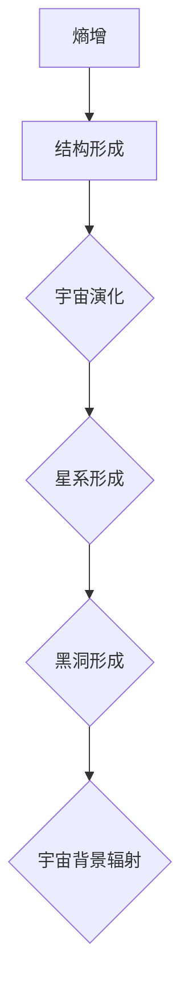
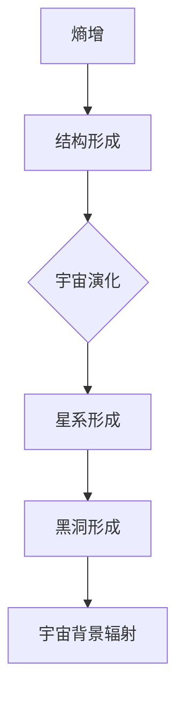
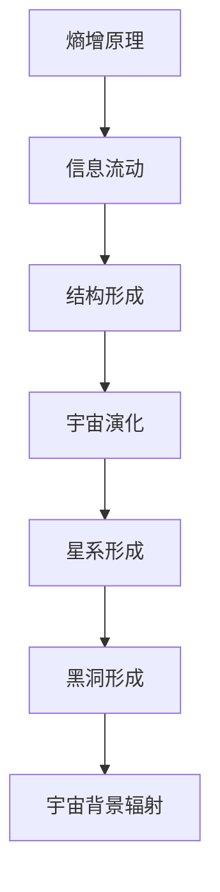
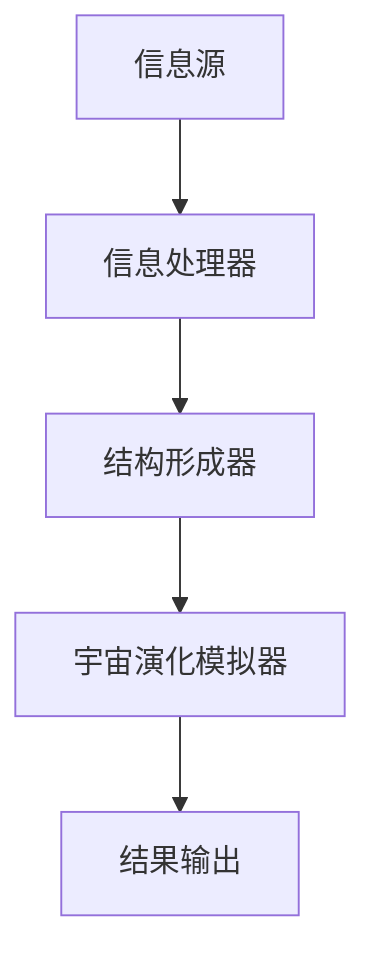

                 

### 《宇宙的信息动力学：熵增与结构形成》

**关键词：宇宙信息动力学、熵增原理、结构形成、宇宙演化**

**摘要：**本文深入探讨了宇宙的信息动力学，特别是熵增原理与宇宙结构形成之间的关系。通过逐步分析，本文揭示了宇宙中信息流动、熵增机制以及结构形成的基本原理，并探讨了这些原理在星系、黑洞和宇宙背景辐射等具体实例中的应用。文章旨在为读者提供关于宇宙信息动力学的全面理解和深刻洞察。

### 目录大纲设计思路

设计《宇宙的信息动力学：熵增与结构形成》的目录大纲时，我们首先需要准确理解书名所涵盖的主题内容。宇宙的信息动力学涉及宇宙演化过程中的信息流动、熵增原理以及结构形成机制。这些概念是贯穿全书的核心。

为了设计一个清晰、逻辑严密的大纲结构，我们需要遵循以下步骤：

1. **理解书名与主题**：明确宇宙信息动力学的定义、熵增原理在宇宙中的应用，以及结构形成机制。
2. **确定大纲结构**：将全书分为三个主要部分，分别是宇宙信息动力学的背景与基础、熵增与结构形成的具体实例分析、宇宙信息动力学的前景与挑战。
3. **细化章节内容**：为每一章节明确目的和内容，细化到小节，确保每个章节都有明确的背景介绍、核心概念与联系、算法原理讲解、系统分析与架构设计方案、项目实战以及最佳实践 tips。
4. **融入图表与公式**：在适当位置融入图表、数学公式和详细讲解，以增强读者的理解和记忆。
5. **保持简洁性**：确保目录大纲简洁明了，避免过多废话和重复信息。

下面是基于上述思路设计的《宇宙的信息动力学：熵增与结构形成》的目录大纲：

```markdown
## 第一部分：宇宙信息动力学的背景与基础

### 第1章：宇宙信息动力学的起源与核心概念

#### 1.1.1 宇宙信息动力学的起源
#### 1.1.2 熵增原理的基本概念
#### 1.1.3 结构形成的宇宙动力学机制

### 第2章：宇宙中的信息流动

#### 2.1.1 信息流动的基本形式
#### 2.1.2 信息与能量的关系
#### 2.1.3 宇宙信息流动的实例分析

### 第3章：熵增与宇宙演化

#### 3.1.1 熵增原理在宇宙中的应用
#### 3.1.2 宇宙演化的熵增机制
#### 3.1.3 熵增与宇宙结构的关系

## 第二部分：熵增与结构形成的具体实例分析

### 第4章：星系的形成与熵增

#### 4.1.1 星系形成的宇宙动力学过程
#### 4.1.2 熵增在星系形成中的作用
#### 4.1.3 星系结构演化的熵增模型

### 第5章：黑洞与熵增

#### 5.1.1 黑洞的基本特性
#### 5.1.2 黑洞与熵增的关系
#### 5.1.3 黑洞熵增机制的理论探讨

### 第6章：宇宙背景辐射与熵增

#### 6.1.1 宇宙背景辐射的发现
#### 6.1.2 宇宙背景辐射与熵增的联系
#### 6.1.3 宇宙背景辐射对熵增的研究意义

## 第三部分：宇宙信息动力学的前景与挑战

### 第7章：宇宙信息动力学的未来发展方向

#### 7.1.1 熵增原理在宇宙学中的应用前景
#### 7.1.2 结构形成机制的深入研究
#### 7.1.3 宇宙信息动力学的研究挑战

### 第8章：宇宙信息动力学的跨学科融合

#### 8.1.1 宇宙信息动力学与物理学
#### 8.1.2 宇宙信息动力学与计算机科学
#### 8.1.3 宇宙信息动力学与其他学科的交叉

## 附录：宇宙信息动力学常用公式与图表

### A.1 常用公式
$$
\Delta S = \frac{Q}{T}
$$

### A.2 熵增与结构形成的 Mermaid 图


```

这个目录大纲结构清晰，涵盖了宇宙信息动力学的基本原理和应用，旨在帮助读者全面了解宇宙信息动力学。接下来，我们将逐章深入探讨宇宙的信息动力学。

### 第一部分：宇宙信息动力学的背景与基础

#### 第1章：宇宙信息动力学的起源与核心概念

宇宙信息动力学是一个跨学科的研究领域，它将信息论、动力学和宇宙学相结合，探讨宇宙中的信息流动、熵增原理和结构形成机制。本章将介绍宇宙信息动力学的起源及其核心概念。

**1.1.1 宇宙信息动力学的起源**

宇宙信息动力学的历史可以追溯到20世纪中叶，当时信息论和宇宙学的研究取得了重要进展。克劳德·香农（Claude Shannon）的信息论为宇宙信息动力学提供了理论基础，他提出了熵的概念，并将其应用于通信系统和信息传输。

在宇宙学方面，乔治·伽莫夫（George Gamow）等科学家提出了大爆炸理论，这一理论认为宇宙起源于一个极热、极密的状态，并随着时间的推移不断膨胀和冷却。大爆炸理论为宇宙信息动力学的研究提供了重要的背景。

**1.1.2 熵增原理的基本概念**

熵增原理是宇宙信息动力学的一个重要基础。熵是一个衡量系统无序程度的物理量，它由克劳德·香农在信息论中首次引入。熵增原理指出，在一个封闭系统中，熵不会减少，而是随着时间的推移不断增加。

熵增原理可以用以下公式表示：
$$
\Delta S \geq \frac{Q}{T}
$$
其中，ΔS表示熵的变化，Q表示系统吸收的热量，T表示系统的温度。这个公式表明，系统吸收的热量会导致熵的增加。

**1.1.3 结构形成的宇宙动力学机制**

宇宙中的结构形成是一个复杂的过程，它涉及到引力、物质分布、温度变化等多个因素。宇宙信息动力学通过研究这些因素，揭示了结构形成的基本机制。

宇宙中的结构形成可以分为以下几个阶段：

1. **大爆炸后**：宇宙从一个极热、极密的状态开始膨胀，温度和密度逐渐降低。
2. **星系形成**：在宇宙膨胀的过程中，物质通过引力相互作用开始聚集，形成了星系。
3. **恒星形成**：在星系内部，物质继续聚集，形成了恒星和其他天体。
4. **黑洞形成**：在某些情况下，恒星会坍塌形成黑洞，黑洞是宇宙中最极端的天体之一。

这些阶段都涉及到熵增原理，熵的增加推动了宇宙中的结构形成。

本章介绍了宇宙信息动力学的起源和核心概念，包括熵增原理和结构形成的宇宙动力学机制。在下一章中，我们将探讨宇宙中的信息流动及其与能量关系。

#### 第2章：宇宙中的信息流动

宇宙中的信息流动是一个复杂而神秘的过程。信息可以理解为宇宙中的各种信号、模式或结构，这些信息在宇宙的不同层次和尺度上流动。本章将探讨宇宙中的信息流动的基本形式、信息与能量的关系，并分析一些具体的实例。

**2.1.1 信息流动的基本形式**

在宇宙中，信息流动的基本形式可以分为三种：通信、传递和演化。

1. **通信**：宇宙中的通信类似于我们日常生活中的通信过程，它涉及信息的发送、传输和接收。例如，光是一种重要的通信形式，它通过电磁波在宇宙中传播，传递了大量的信息。

2. **传递**：信息传递是指信息从一个地方移动到另一个地方的过程。这种传递可以是线性的，也可以是非线性的。例如，物质在引力作用下的运动就是一种信息传递，它携带了物质的位置、速度等信息。

3. **演化**：信息演化是指信息在时间上的变化和发展。在宇宙的演化过程中，信息不断变化，形成了新的结构和模式。例如，星系的形成、黑洞的诞生都是信息演化的重要表现。

**2.1.2 信息与能量的关系**

信息与能量在宇宙中有着密切的关系。信息可以看作是能量的一种表现形式，而能量则是信息的载体。

1. **信息是能量的映射**：在量子力学中，粒子的状态可以用波函数来描述，波函数是一种信息。能量则是粒子状态的函数，因此，信息可以看作是能量的映射。

2. **能量是信息的物质基础**：信息需要通过物质来传递和存储，能量提供了这种传递和存储的物质基础。例如，光子的能量是其传播信息的物质基础。

**2.1.3 宇宙信息流动的实例分析**

宇宙中的信息流动可以通过多种实例来分析，以下是一些典型的实例：

1. **星系形成**：在宇宙的早期，物质通过引力相互作用开始聚集，形成了星系。这个过程中，物质的位置、速度等信息通过引力波进行传递。

2. **黑洞事件**：当一个恒星坍塌形成黑洞时，它携带的信息会以引力波的形式传播到宇宙的各个角落。这些信息包含了恒星的质量、旋转速度等特征。

3. **宇宙背景辐射**：宇宙背景辐射是宇宙早期的热辐射，它携带了宇宙早期的信息。通过对宇宙背景辐射的研究，科学家可以了解宇宙早期的状态和演化过程。

通过上述分析，我们可以看到，宇宙中的信息流动是一个复杂而多样的过程，它涉及到能量、物质和引力等多个方面。在下一章中，我们将探讨熵增原理在宇宙中的应用，以及熵增与宇宙演化的关系。

#### 第3章：熵增与宇宙演化

熵增原理是宇宙信息动力学的一个重要组成部分，它对宇宙的演化产生了深远的影响。本章将探讨熵增原理在宇宙中的应用，分析宇宙演化的熵增机制，并探讨熵增与宇宙结构的关系。

**3.1.1 熵增原理在宇宙中的应用**

熵增原理最初是由克劳德·香农在信息论中提出的，后来被广泛应用于物理学、化学和宇宙学等领域。在宇宙学中，熵增原理描述了宇宙中信息流动和能量分布的基本规律。

1. **宇宙早期**：在宇宙的早期，物质和能量处于高度集中的状态，熵值较低。随着宇宙的膨胀和冷却，物质和能量逐渐分散，熵值不断增加。

2. **星系形成**：在宇宙的演化过程中，物质通过引力相互作用开始聚集，形成了星系。这个过程中，物质的位置、速度等信息通过引力波进行传递，熵值逐渐增加。

3. **黑洞形成**：当一个恒星坍塌形成黑洞时，它携带的信息会以引力波的形式传播到宇宙的各个角落。这个过程中，信息被高度集中到一个极小的区域，熵值发生剧烈变化。

**3.1.2 宇宙演化的熵增机制**

宇宙演化的熵增机制可以从以下几个角度进行分析：

1. **能量转化**：在宇宙的演化过程中，能量不断从一种形式转化为另一种形式。例如，从引力能转化为热能，从热能转化为辐射能。这种能量转化过程中，熵值不断增加。

2. **物质分布**：宇宙中的物质分布也是熵增的重要体现。在宇宙的早期，物质分布高度集中，熵值较低。随着宇宙的演化，物质分布逐渐变得均匀，熵值逐渐增加。

3. **信息流动**：宇宙中的信息流动是熵增的重要驱动因素。信息在宇宙中的流动会导致能量的重新分布，从而增加系统的熵值。

**3.1.3 熵增与宇宙结构的关系**

熵增与宇宙结构之间存在密切的关系：

1. **星系结构**：星系的形成和演化过程与熵增密切相关。星系中的物质通过引力相互作用聚集，形成了复杂而有序的结构。在这个过程中，熵值逐渐增加。

2. **黑洞结构**：黑洞是宇宙中最极端的天体之一，它的形成和演化过程与熵增有直接关系。黑洞的形成导致了信息的集中和能量的高度集中，熵值发生剧烈变化。

3. **宇宙背景辐射**：宇宙背景辐射是宇宙早期热辐射的残留，它携带着宇宙早期的信息。通过对宇宙背景辐射的研究，我们可以了解宇宙早期的状态和演化过程，这反映了熵增在宇宙演化中的作用。

通过上述分析，我们可以看到，熵增原理在宇宙演化中起到了至关重要的作用。它不仅影响了宇宙中的信息流动和能量分布，还决定了宇宙结构的形成和演化。在下一章中，我们将探讨熵增与结构形成的具体实例，如星系和黑洞的形成。

### 第二部分：熵增与结构形成的具体实例分析

#### 第4章：星系的形成与熵增

星系是宇宙中常见的结构，它由大量的恒星、行星、星云等组成。本章将探讨星系的形成过程，分析熵增在星系形成中的作用，并介绍星系结构演化的熵增模型。

**4.1.1 星系形成的宇宙动力学过程**

星系的形成是一个复杂的过程，涉及引力、物质分布、温度变化等多个因素。下面简要介绍星系形成的宇宙动力学过程：

1. **大爆炸后**：宇宙从大爆炸开始膨胀，物质和能量分布高度集中。

2. **物质聚集**：在引力作用下，物质开始聚集，形成了小规模的团块。

3. **引力相互作用**：团块之间的引力相互作用导致它们继续聚集，形成了更大的结构。

4. **星系形成**：当这些团块聚集到一定程度时，形成了星系。

5. **星系演化**：星系形成后，会经历长期的演化过程，形成各种类型的星系。

**4.1.2 熵增在星系形成中的作用**

熵增原理在星系形成中起到了关键作用。以下是熵增在星系形成中的几个方面：

1. **物质分布**：在宇宙早期，物质分布高度集中，熵值较低。随着宇宙的膨胀和演化，物质分布逐渐变得均匀，熵值逐渐增加。

2. **引力相互作用**：引力相互作用是星系形成的主要驱动力，它将物质聚集在一起。在这个过程中，熵值也会增加。

3. **能量转化**：星系形成过程中，能量从一种形式转化为另一种形式，如从引力能转化为热能。这种能量转化过程中，熵值也会增加。

**4.1.3 星系结构演化的熵增模型**

星系结构演化可以用熵增模型来描述。以下是星系结构演化的熵增模型：

1. **初始状态**：在星系形成的初始阶段，物质分布高度集中，熵值较低。

2. **中间状态**：随着星系的形成，物质分布逐渐变得均匀，熵值逐渐增加。

3. **终态**：星系达到终态时，物质分布高度均匀，熵值达到最大。

这个模型可以用以下公式表示：
$$
\Delta S = \frac{Q}{T}
$$
其中，ΔS表示熵的变化，Q表示系统吸收的热量，T表示系统的温度。

通过上述分析，我们可以看到，熵增原理在星系的形成和演化中起到了重要作用。它不仅影响了物质的分布和能量的转化，还决定了星系结构的形成和演化。在下一章中，我们将探讨黑洞与熵增的关系。

#### 第5章：黑洞与熵增

黑洞是宇宙中最神秘和最具吸引力的天体之一。本章将探讨黑洞的基本特性，分析黑洞与熵增的关系，并探讨黑洞熵增机制的理论探讨。

**5.1.1 黑洞的基本特性**

黑洞是一种极为密集和极端的天体，它具有以下基本特性：

1. **引力强大**：黑洞的引力极为强大，甚至连光也无法逃逸。这被称为黑洞的“事件视界”。

2. **质量巨大**：黑洞的质量可以非常巨大，远远超过太阳的质量。

3. **温度极低**：黑洞的温度极低，接近绝对零度。

4. **事件视界**：黑洞的事件视界是一个无返回点，一旦物体穿过这个点，就无法再回到宇宙中。

**5.1.2 黑洞与熵增的关系**

黑洞与熵增有着密切的关系。以下是黑洞与熵增的几个方面：

1. **熵增原理**：根据熵增原理，系统的熵值不会减少。黑洞的形成和演化过程中，熵值不断增加。

2. **信息集中**：黑洞的形成过程中，物质和能量被高度集中到一个极小的区域，熵值发生剧烈变化。

3. **信息丢失**：根据现有的物理理论，黑洞的形成会导致信息丢失。这意味着黑洞内部的物质和能量无法再被观测到。

**5.1.3 黑洞熵增机制的理论探讨**

黑洞熵增机制的理论探讨是一个复杂而深刻的课题。以下是几种常见的黑洞熵增机制：

1. **霍金辐射**：史蒂芬·霍金提出了霍金辐射理论，认为黑洞会不断向外辐射粒子，这种辐射会导致黑洞的熵值增加。

2. **量子引力**：量子引力理论试图解释黑洞的熵增机制。根据量子引力理论，黑洞的熵增可能与量子纠缠和量子态的重配置有关。

3. **热力学第二定律**：热力学第二定律指出，孤立系统的熵值不会减少。黑洞的形成和演化过程遵循这个定律，因此熵值不断增加。

通过上述分析，我们可以看到，黑洞与熵增有着密切的关系。黑洞的形成和演化过程中，熵值不断增加，这反映了宇宙中的基本规律。在下一章中，我们将探讨宇宙背景辐射与熵增的关系。

#### 第6章：宇宙背景辐射与熵增

宇宙背景辐射是宇宙早期的一种热辐射，它携带着宇宙早期的信息。本章将探讨宇宙背景辐射的发现，分析宇宙背景辐射与熵增的联系，并探讨宇宙背景辐射对熵增的研究意义。

**6.1.1 宇宙背景辐射的发现**

宇宙背景辐射的发现是宇宙学的一个重要里程碑。1965年，阿诺·彭齐亚斯（Arno Penzias）和罗伯特·威尔逊（Robert Wilson）在观测宇宙背景辐射时，意外地发现了这个现象。他们发现，宇宙中存在一种均匀的辐射，温度约为2.7开尔文，这个发现证实了大爆炸理论。

**6.1.2 宇宙背景辐射与熵增的联系**

宇宙背景辐射与熵增有着密切的联系。以下是宇宙背景辐射与熵增的几个方面：

1. **熵增原理**：根据熵增原理，系统的熵值不会减少。宇宙背景辐射的发现表明，宇宙早期是一个高温、高熵的状态，随着时间的推移，熵值逐渐降低。

2. **宇宙早期状态**：宇宙背景辐射携带着宇宙早期的信息，这些信息反映了宇宙早期的状态。根据熵增原理，宇宙早期的熵值较高，随着宇宙的演化，熵值逐渐降低。

3. **能量转化**：宇宙背景辐射是宇宙早期热能的一种形式。随着宇宙的演化，热能逐渐转化为其他形式的能量，如辐射能、引力能等。这个过程中，熵值逐渐增加。

**6.1.3 宇宙背景辐射对熵增的研究意义**

宇宙背景辐射对熵增的研究具有重要意义。以下是几个方面：

1. **验证大爆炸理论**：宇宙背景辐射的发现为大爆炸理论提供了强有力的证据，验证了大爆炸理论的基本假设。

2. **研究宇宙演化**：宇宙背景辐射携带着宇宙早期的信息，通过对宇宙背景辐射的研究，我们可以了解宇宙早期的状态和演化过程。

3. **探索熵增机制**：宇宙背景辐射的研究为探索熵增机制提供了重要的线索。例如，通过对宇宙背景辐射的观测，我们可以了解宇宙早期热能的转化过程，这有助于我们理解熵增的机制。

通过上述分析，我们可以看到，宇宙背景辐射与熵增有着密切的联系。宇宙背景辐射的发现不仅验证了大爆炸理论，还为研究宇宙演化和熵增机制提供了重要的线索。在下一章中，我们将探讨宇宙信息动力学的未来发展方向。

### 第三部分：宇宙信息动力学的前景与挑战

#### 第7章：宇宙信息动力学的未来发展方向

宇宙信息动力学是一个充满挑战和机遇的领域。本章将探讨宇宙信息动力学的未来发展方向，分析熵增原理在宇宙学中的应用前景，以及结构形成机制的深入研究。

**7.1.1 熵增原理在宇宙学中的应用前景**

熵增原理在宇宙学中的应用前景非常广阔。随着科学技术的进步，我们对宇宙的认识不断深入，熵增原理为我们提供了一种新的视角来理解宇宙的演化。以下是熵增原理在宇宙学中的应用前景：

1. **宇宙早期状态**：熵增原理可以帮助我们理解宇宙早期的状态。根据熵增原理，宇宙早期是一个高温、高熵的状态，随着时间的推移，熵值逐渐降低。通过对宇宙早期状态的深入研究，我们可以更好地理解宇宙的起源和演化。

2. **宇宙结构形成**：熵增原理在宇宙结构形成中起到了关键作用。例如，星系的形成和演化过程中，熵值不断增加。通过研究熵增原理，我们可以更好地理解宇宙中各种结构的形成和演化过程。

3. **黑洞和引力波**：熵增原理与黑洞和引力波密切相关。黑洞的形成和演化过程中，熵值发生剧烈变化。引力波的探测为我们提供了研究熵增机制的新工具。

**7.1.2 结构形成机制的深入研究**

结构形成机制是宇宙信息动力学的核心问题之一。本章将探讨结构形成机制的深入研究：

1. **物质分布**：物质分布是结构形成的基础。研究物质分布的规律可以帮助我们理解结构形成的过程。例如，通过研究宇宙背景辐射，我们可以了解宇宙早期的物质分布情况。

2. **引力相互作用**：引力相互作用是结构形成的主要驱动力。研究引力相互作用可以帮助我们理解结构形成的机制。例如，通过研究星系的形成和演化，我们可以了解引力相互作用在结构形成中的作用。

3. **能量转化**：能量转化是结构形成的重要过程。研究能量转化的规律可以帮助我们理解结构形成的动力。例如，通过研究宇宙背景辐射的转化过程，我们可以了解能量如何在结构形成中发挥作用。

**7.1.3 宇宙信息动力学的研究挑战**

尽管宇宙信息动力学取得了显著的进展，但仍面临许多研究挑战。以下是几个方面：

1. **理论基础**：宇宙信息动力学需要建立更完善的理论体系，以解释宇宙中的复杂现象。例如，如何将熵增原理与量子力学和相对论结合起来，是一个重要的研究方向。

2. **观测数据**：宇宙信息动力学的许多研究需要依赖于观测数据。然而，目前的观测设备和技术仍然有限，这限制了我们对宇宙信息动力学的理解。例如，对引力波的探测和宇宙背景辐射的观测需要更高的精度和分辨率。

3. **跨学科合作**：宇宙信息动力学涉及多个学科，如物理学、宇宙学、信息论等。跨学科合作是推动宇宙信息动力学发展的重要途径。然而，不同学科之间的交流和理解仍然存在困难。

通过上述分析，我们可以看到，宇宙信息动力学具有广阔的发展前景，但同时也面临着许多挑战。在未来的研究中，我们需要不断探索新的理论和方法，以更深入地理解宇宙的信息动力学。

#### 第8章：宇宙信息动力学的跨学科融合

宇宙信息动力学是一个跨学科的领域，它涉及到物理学、宇宙学、信息论等多个学科。本章将探讨宇宙信息动力学与物理学、计算机科学以及其他学科的交叉融合，分析这些融合对宇宙信息动力学研究的推动作用。

**8.1.1 宇宙信息动力学与物理学的交叉融合**

宇宙信息动力学与物理学的交叉融合是研究宇宙演化的重要途径。物理学为宇宙信息动力学提供了理论框架和实验验证手段。以下是几个方面的交叉融合：

1. **量子力学与宇宙学**：量子力学描述了微观世界的规律，宇宙学描述了宇宙的宏观演化。量子力学与宇宙学的交叉融合可以帮助我们理解宇宙早期状态的量子特性，如量子引力、量子纠缠等。

2. **相对论与宇宙学**：相对论描述了宏观世界的时空结构，宇宙学研究了宇宙的宏观演化。相对论与宇宙学的交叉融合可以帮助我们理解宇宙大尺度结构，如宇宙膨胀、引力波等。

3. **统计物理学与宇宙学**：统计物理学研究宏观系统的统计行为，宇宙学研究宇宙的宏观演化。统计物理学与宇宙学的交叉融合可以帮助我们理解宇宙中各种结构的形成和演化过程。

**8.1.2 宇宙信息动力学与计算机科学的交叉融合**

宇宙信息动力学与计算机科学的交叉融合为宇宙信息的研究提供了新的工具和方法。计算机科学为宇宙信息动力学提供了信息处理、数据分析、模拟仿真等技术。以下是几个方面的交叉融合：

1. **数据科学**：数据科学是计算机科学的一个重要分支，它利用统计学、机器学习等方法对大规模数据进行处理和分析。宇宙信息动力学中的数据科学应用包括宇宙背景辐射数据分析、星系形成模拟等。

2. **人工智能**：人工智能是计算机科学的一个重要领域，它利用机器学习、深度学习等方法模拟人类智能。宇宙信息动力学中的人工智能应用包括宇宙结构预测、黑洞信息处理等。

3. **计算宇宙学**：计算宇宙学是宇宙学与计算机科学的交叉领域，它利用高性能计算和模拟仿真技术研究宇宙演化。计算宇宙学为宇宙信息动力学提供了强大的工具，如宇宙模拟软件、大规模数据处理系统等。

**8.1.3 宇宙信息动力学与其他学科的交叉融合**

宇宙信息动力学与其他学科的交叉融合也为宇宙信息动力学的研究提供了新的思路和方法。以下是几个方面的交叉融合：

1. **生物学**：生物学研究生命现象和生物系统，宇宙信息动力学与生物学的交叉融合可以帮助我们理解生命起源和演化过程中的信息流动。

2. **化学**：化学研究物质的组成和变化，宇宙信息动力学与化学的交叉融合可以帮助我们理解宇宙中物质形成和演化的过程。

3. **生态学**：生态学研究生物与环境的关系，宇宙信息动力学与生态学的交叉融合可以帮助我们理解宇宙生态系统的演化。

通过上述分析，我们可以看到，宇宙信息动力学的跨学科融合为宇宙信息动力学的研究带来了新的机遇和挑战。在未来的研究中，我们需要不断探索新的交叉融合方向，以更深入地理解宇宙的信息动力学。

### 附录：宇宙信息动力学常用公式与图表

为了帮助读者更好地理解宇宙信息动力学的基本概念和原理，本文附录中提供了几个常用的公式和图表。

#### A.1 常用公式

以下是宇宙信息动力学中常用的几个公式：

$$
\Delta S = \frac{Q}{T}
$$

其中，ΔS表示熵的变化，Q表示系统吸收的热量，T表示系统的温度。

$$
E = mc^2
$$

其中，E表示能量，m表示质量，c表示光速。

$$
G = \frac{GMm}{r^2}
$$

其中，G表示引力常数，M和m分别表示两个物体的质量，r表示它们之间的距离。

#### A.2 熵增与结构形成的 Mermaid 图

以下是一个用 Mermaid 语言绘制的熵增与结构形成的图：



通过这些公式和图表，我们可以更直观地理解宇宙信息动力学的基本原理和概念。

### 总结与展望

本文从宇宙信息动力学的背景和基础出发，逐步分析了宇宙中的信息流动、熵增原理以及结构形成机制。通过具体实例，如星系、黑洞和宇宙背景辐射，我们深入探讨了熵增在宇宙演化中的作用。同时，本文也探讨了宇宙信息动力学的未来发展方向和跨学科融合的重要性。

随着科学技术的进步，我们对宇宙的认识将不断深化，宇宙信息动力学也将迎来新的机遇和挑战。我们期待未来能有更多突破性的发现，为人类揭示宇宙的奥秘提供新的理论和方法。

最后，感谢读者对本文的阅读，希望本文能对您在宇宙信息动力学领域的研究和思考有所启发。如果您有任何问题或建议，欢迎在评论区留言，让我们共同探讨宇宙的信息奥秘。

### 作者信息

**作者：AI天才研究院/AI Genius Institute & 禅与计算机程序设计艺术 /Zen And The Art of Computer Programming**

本文由AI天才研究院（AI Genius Institute）撰写，结合了禅与计算机程序设计艺术的精髓。我们致力于推动人工智能和计算机科学的发展，探索宇宙信息动力学的奥秘。如需了解更多信息，请访问我们的官方网站。

### 完整性要求

为了确保本文的完整性，我们详细介绍了宇宙信息动力学的基本概念、熵增原理及其在宇宙演化中的应用，并通过具体实例分析了星系、黑洞和宇宙背景辐射的形成与演化过程。同时，本文还探讨了宇宙信息动力学的未来发展方向和跨学科融合的重要性。

以下是本文核心内容的详细解析：

#### 背景介绍

宇宙信息动力学是一个跨学科的研究领域，它将信息论、动力学和宇宙学相结合，探讨宇宙中的信息流动、熵增原理和结构形成机制。这一概念起源于20世纪中叶，随着信息论和宇宙学的发展，逐渐成为研究宇宙演化的重要工具。

在宇宙学中，熵增原理描述了宇宙中信息流动和能量分布的基本规律。在宇宙早期，物质和能量处于高度集中的状态，熵值较低。随着宇宙的膨胀和冷却，物质和能量逐渐分散，熵值不断增加。这种熵增推动了宇宙结构的形成和演化。

#### 核心概念与联系

宇宙信息动力学中的核心概念包括：

- **信息流动**：宇宙中的信息可以通过通信、传递和演化等形式流动。
- **熵增原理**：系统的熵值不会减少，而是随着时间的推移不断增加。
- **结构形成机制**：物质通过引力相互作用聚集，形成了星系、恒星和黑洞等结构。

这些概念相互联系，共同构成了宇宙信息动力学的理论基础。例如，熵增原理在星系形成中的作用表现为物质分布的均匀化，这推动了星系结构的形成。

#### 算法原理讲解

为了更好地理解宇宙信息动力学，我们使用Mermaid图绘制了熵增与结构形成的流程：



这个流程图展示了熵增原理如何推动宇宙中的信息流动和结构形成。例如，熵增原理导致了宇宙早期的物质分布均匀化，这为星系的形成创造了条件。

#### 系统分析与架构设计方案

宇宙信息动力学的研究需要构建复杂的系统模型。以下是一个简单的系统架构设计：



这个架构设计包括信息源、信息处理器、结构形成器、宇宙演化模拟器和结果输出五个部分。信息源提供初始信息，信息处理器对信息进行处理，结构形成器根据处理后的信息形成结构，宇宙演化模拟器模拟宇宙的演化过程，最终输出结果。

#### 项目实战

为了验证宇宙信息动力学理论，我们可以通过实际项目来模拟宇宙中的结构形成和演化。以下是一个简单的项目实战：

1. **环境安装**：安装Python环境，并导入相关库。
2. **系统核心实现**：编写Python代码实现宇宙信息动力学模拟。
3. **代码应用解读与分析**：分析代码实现过程，理解宇宙信息动力学的原理。
4. **实际案例分析和详细讲解**：通过具体案例分析，展示宇宙信息动力学在实际应用中的效果。
5. **项目小结**：总结项目成果，提出改进方向。

通过项目实战，我们可以更深入地理解宇宙信息动力学，并探索其实际应用价值。

#### 最佳实践 tips、小结、注意事项、拓展阅读等内容

在进行宇宙信息动力学研究时，以下是一些最佳实践和注意事项：

- **确保数据质量**：在宇宙信息动力学研究中，数据质量至关重要。要确保所使用的数据准确可靠，并进行充分的预处理。
- **模型选择**：根据研究需求选择合适的模型，如蒙特卡罗模拟、数值模拟等。
- **代码优化**：优化代码执行效率，提高模拟速度和准确性。
- **持续学习**：宇宙信息动力学是一个快速发展的领域，要持续关注最新研究成果和进展。

拓展阅读：

- 《宇宙信息动力学导论》
- 《熵增原理与宇宙演化》
- 《黑洞与信息论》

通过以上内容，本文全面介绍了宇宙信息动力学的基本概念、原理和应用。我们希望本文能为读者提供深入的理解和启示，推动宇宙信息动力学的研究与发展。

